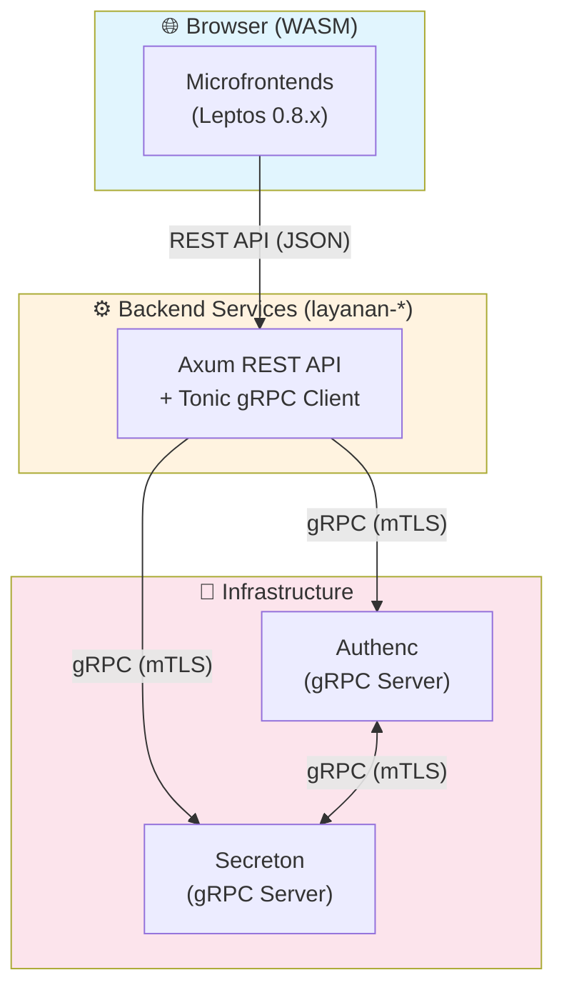

# SIMPEL AI Coding Agent Instructions

## Project Overview

**SIMPEL** (Sistem Informasi Manajemen Perlengkapan) is an **enterprise-grade asset management system** for Indonesia's Attorney General's Office (Kejaksaan RI), built with a **microfrontend + microservices architecture** in Rust.

- **Production URL:** https://simpel.kejaksaan.go.id/
- **Language:** Rust (Edition 2024, MSRV 1.90+)
- **Architecture:** 11 independent Leptos 0.8.x microfrontends + Axum/Tonic microservices
- **Compliance:** Zero-trust security, FIPS, GDPR-aligned, government standards

## System Architecture



### Communication Rules (CRITICAL)

| From | To | Protocol | Allowed |
|------|-----|----------|---------|
| Microfrontend | Backend (layanan-*) | **REST API** | ✅ |
| Microfrontend | Authenc/Secreton | ❌ | ⛔ FORBIDDEN |
| Backend | Backend | **gRPC** | ✅ |
| Backend | Authenc/Secreton | **gRPC (mTLS)** | ✅ |

## Critical Architecture Rules

### 1. Workspace Structure (MUST Follow)

```
/var/www/simpelv2/
├── Cargo.toml          # ROOT WORKSPACE - single source of truth for deps
├── lib/                # Shared libraries
│   ├── ui/             # UI components (lib-ui, alias: shared-microfrontend)
│   ├── middleware/     # Axum middlewares (lib-middleware)
│   ├── crypto/         # Cryptography (lib-crypto)
│   ├── types/          # Domain types (lib-types)
│   ├── storage/        # Database (lib-storage)
│   └── utils/          # Utilities (lib-utils)
├── layanan/            # Backend microservices (Axum + Tonic gRPC)
│   └── daskrimti/      # Domain services (layanan-*)
├── antarmuka/          # Frontend microfrontends (Leptos 0.8.x WASM)
│   ├── daskrimti/portal/  # Main portal
│   └── [domain]/       # Other microfrontends
└── infra/              # INDEPENDENT WORKSPACES (separate Cargo.lock)
    ├── authenc/        # Identity Provider - DO NOT reference from main workspace
    └── secreton/       # Secrets Management - DO NOT reference from main workspace
```

### 2. Dependency Management (NEVER Violate)

- **ALL dependencies** must be defined in root `Cargo.toml` under `[workspace.dependencies]`
- Member crates use `dependency = { workspace = true }` - **NEVER specify versions locally**
- **Alias**: `shared-microfrontend = { package = "lib-ui", path = "lib/ui" }` in root Cargo.toml
- `infra/authenc` and `infra/secreton` are **separate workspaces** with their own Cargo.lock

### 3. Naming Conventions

| Type | Location | Package Name |
|------|----------|--------------|
| Microfrontend | `antarmuka/[domain]/[name]/` | `[name]-microfrontend` |
| Microservice | `layanan/daskrimti/[name]/` | `layanan-[name]` |
| Shared Library | `lib/[name]/` | `lib-[name]` |
| Infrastructure | `infra/[name]/` | `[name]` |

## Build & Development Commands

```bash
# Always use cargo directly (NO Makefile exists)
cargo check --workspace          # Verify compilation
cargo build --workspace          # Build all crates
cargo test --workspace           # Run all tests
cargo fmt --all                  # Format code
cargo clippy --workspace         # Lint with warnings as errors
cargo audit                      # Security vulnerability check

# Frontend microfrontends (Leptos + WASM)
cd antarmuka/daskrimti/portal && trunk serve --open   # Dev server with hot reload
cd antarmuka/daskrimti/portal && trunk build --release  # Production build

# Separate infrastructure workspaces (MUST build separately)
cd infra/authenc && cargo build   # Build Authenc separately
cd infra/secreton && cargo build  # Build Secreton separately
```

## Code Patterns (MUST Follow)

### Axum 0.8.x Pattern (Backend REST API)

```rust
use axum::{
    extract::{Path, Query, State, Json},
    routing::{get, post, put, delete},
    Router,
    response::IntoResponse,
};
use std::sync::Arc;
use tokio::net::TcpListener;

// Application State with gRPC clients
#[derive(Clone)]
pub struct AppState {
    pub db_pool: deadpool_postgres::Pool,
    pub authenc_client: AuthencGrpcClient,   // gRPC to Authenc
    pub secreton_client: SecretonGrpcClient, // gRPC to Secreton
}

// Router setup with State
pub fn create_router(state: Arc<AppState>) -> Router {
    Router::new()
        .route("/api/v1/users", get(list_users).post(create_user))
        .route("/api/v1/users/{id}", get(get_user).put(update_user))
        .layer(lib_middleware::jwt_validation_layer())
        .with_state(state)
}

// Handler with extractors
async fn get_user(
    State(state): State<Arc<AppState>>,
    Path(id): Path<uuid::Uuid>,
) -> Result<Json<User>, AppError> {
    // Validate JWT via gRPC to Authenc (handled by middleware)
    let user = state.db_pool.get().await?
        .query_one("SELECT * FROM users WHERE id = $1", &[&id]).await?;
    Ok(Json(user.into()))
}

// Main entry
#[tokio::main]
async fn main() {
    let state = Arc::new(AppState::new().await);
    let app = create_router(state);
    let listener = TcpListener::bind("0.0.0.0:3000").await.unwrap();
    axum::serve(listener, app).await.unwrap();
}
```

### Tonic + Prost Pattern (gRPC)

```rust
// build.rs - Generate gRPC code
fn main() -> Result<(), Box<dyn std::error::Error>> {
    tonic_prost_build::Config::new()
        .out_dir("src/generated")
        .compile_protos(&["proto/auth.proto"], &["proto/"])?;
    Ok(())
}

// gRPC Server Implementation
use tonic::{Request, Response, Status};

pub mod auth_proto {
    tonic::include_proto!("auth");
}
use auth_proto::auth_service_server::{AuthService, AuthServiceServer};

#[derive(Debug, Default)]
pub struct AuthServiceImpl;

#[tonic::async_trait]
impl AuthService for AuthServiceImpl {
    async fn validate_token(
        &self,
        request: Request<TokenRequest>,
    ) -> Result<Response<TokenResponse>, Status> {
        let token = request.into_inner().token;
        // Validate token...
        Ok(Response::new(TokenResponse { valid: true, user_id: "...".into() }))
    }
}

// gRPC Client (layanan → authenc)
use auth_proto::auth_service_client::AuthServiceClient;
use tonic::transport::Channel;

pub async fn create_authenc_client() -> Result<AuthServiceClient<Channel>, tonic::transport::Error> {
    let channel = Channel::from_static("https://authenc.internal:50051")
        .tls_config(tonic::transport::ClientTlsConfig::new())?
        .connect().await?;
    Ok(AuthServiceClient::new(channel))
}
```

### Leptos 0.8.x Pattern (Microfrontend WASM)

```rust
use leptos::prelude::*;
use lib_ui::prelude::*;  // This is lib-ui!

// Signal creation (NOT create_signal!)
#[component]
pub fn Counter(initial: i32) -> impl IntoView {
    let (count, set_count) = signal(initial);

    let increment = move |_| *set_count.write() += 1;

    view! {
        <button on:click=increment>{count}</button>
    }
}

// RwSignal for shared state
#[component]
pub fn SharedState() -> impl IntoView {
    let state = RwSignal::new(AppState::default());
    provide_context(state);
    view! { <ChildComponent /> }
}

// Resource for async data (calls REST API, NOT gRPC!)
#[component]
pub fn UserList() -> impl IntoView {
    let users = Resource::new(
        || (),
        |_| async move {
            // Call backend REST API (layanan-portal)
            gloo_net::http::Request::get("/api/v1/users")
                .send().await?.json::<Vec<User>>().await
        }
    );

    view! {
        <Suspense fallback=|| view! { <Loading /> }>
            {move || users.get().map(|result| match result {
                Ok(users) => view! { <UserTable users=users /> }.into_any(),
                Err(e) => view! { <Error message=e.to_string() /> }.into_any(),
            })}
        </Suspense>
    }
}

// Effect for side effects
#[component]
pub fn WithEffect() -> impl IntoView {
    let (count, _) = signal(0);
    Effect::new(move || log::info!("Count: {}", count.get()));
    view! { <div /> }
}

// Main mount (CSR)
pub fn main() {
    console_error_panic_hook::set_once();
    leptos::mount::mount_to_body(App);
}
```

### Authentication Flow

**Critical:** Microfrontends call layanan (REST), layanan calls Authenc (gRPC).

```rust
// In microfrontend - use hooks from lib-ui
use lib_ui::hooks::use_auth;
use lib_ui::components::auth::ProtectedRoute;

// Session stored in localStorage (NOT sessionStorage) for cross-tab sync
// JWT validation via layanan → Authenc gRPC
```

### Secrets Management

```rust
// In layanan backend - call Secreton via gRPC
let secret = state.secreton_client
    .get_secret(GetSecretRequest { key: "database_password".into() })
    .await?
    .into_inner()
    .value;

// NEVER use environment variables for secrets!
```

## Common Mistakes to AVOID

❌ **DON'T:**
- Call Authenc/Secreton directly from microfrontend (use layanan as proxy)
- Reference `infra/authenc` or `infra/secreton` from main workspace members
- Use `create_signal` in Leptos 0.8.x (use `signal()`)
- Store JWT tokens in cookies (use `localStorage`)
- Duplicate auth logic in microfrontends (redirect to Portal)
- Use RSA for new signing implementations (use Ed25519)
- Specify dependency versions in member `Cargo.toml` files
- Use environment variables for secrets

✅ **DO:**
- Import from `shared-microfrontend` (alias for `lib-ui`) for UI components
- Use REST API from microfrontend → layanan
- Use gRPC from layanan → authenc/secreton
- Use `trunk build --release` for production WASM
- Run `cargo fmt --all && cargo clippy --workspace` before commits
- Use `ProtectedRoute` for all authenticated pages
- Build authenc/secreton separately when needed

## File Locations Reference

| Purpose | Location |
|---------|----------|
| Shared UI components | `lib/ui/src/components/` |
| Auth hooks | `lib/ui/src/hooks/` |
| Backend services | `layanan/daskrimti/{service}/` |
| Database migrations | `layanan/*/migrations/` |
| CI/CD workflows | `.github/workflows/` |
| K8s manifests | `infra/k8s/` |
| Architecture docs | `docs/`, `antarmuka/COMPLETE_AUTH_FLOW_ARCHITECTURE.md` |

## Questions to Ask Before Implementation

1. **Auth-related?** → Use Portal + `use_auth()` hook, microfrontend → REST → gRPC
2. **Needs secrets?** → Use Secreton gRPC client in layanan (NOT env vars)
3. **Reusable UI?** → Put in `lib/ui/`, use via `shared-microfrontend` alias
4. **New dependency?** → Add to root `Cargo.toml` workspace.dependencies first
5. **Integration test?** → Use testcontainers for database tests

## Security Patterns

- **Zero-trust:** No implicit trust between services, all via mTLS
- **JWT validation:** On every request via lib-middleware → Authenc gRPC
- **Audit logs:** Immutable PostgreSQL logging
- **Cryptography:** Ed25519 (signing), X25519 (key exchange), ChaCha20-Poly1305 (encryption)
