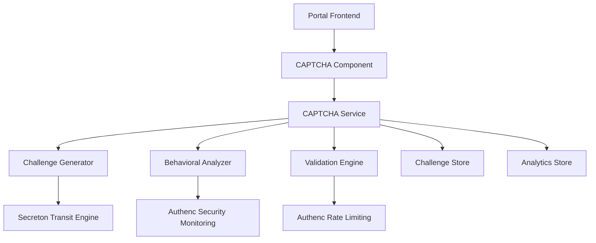

# Design Document - AI-Resistant CAPTCHA System

## Overview

Sistem CAPTCHA multi-layer yang tahan terhadap bot AI modern, terintegrasi dengan infrastruktur keamanan SIMPelv2 existing. Menggunakan kombinasi teknik behavioral analysis, cryptographic challenges, dan adaptive difficulty untuk melawan serangan otomatis canggih.

## Architecture

### High-Level Architecture



### Integration Points

1. **Frontend Integration**: Shared microfrontend components
2. **Security Integration**: Authenc middleware dan monitoring
3. **Cryptographic Integration**: Secreton transit engine
4. **Storage Integration**: Existing database infrastructure

## Components and Interfaces

### 1. CAPTCHA Component (Frontend)

**Location**: `antarmuka/shared/src/components/captcha/`

**Dependencies**:
- Shared component library (Button, Input, etc.)
- Existing hooks (storage, validation)
- Theme system

**Key Features**:
- Multi-modal challenges (visual, audio, behavioral)
- Progressive difficulty adaptation
- Accessibility compliance
- Real-time validation feedback
### 2. CAPTCHA Service (Backend)

**Location**: `infra/authenc/src/services/captcha/`

**Dependencies**:
- Authenc middleware (rate limiting, security monitoring)
- Secreton client for encryption
- Database for challenge storage

**Key Features**:
- Challenge generation and validation
- Behavioral pattern analysis
- Adaptive difficulty algorithms
- Integration with existing auth flow

### 3. Challenge Generator

**Responsibilities**:
- Generate cryptographically secure challenges
- Support multiple challenge types (visual, logical, behavioral)
- Integrate with Secreton for encryption
- Adaptive difficulty based on threat level

**Challenge Types**:
1. **Visual Challenges**: Iased puzzles with AI-resistant elements
2. **Behavioral Challenges**: Mouse movement, typing patterns, timing analysis
3. **Logical Challenges**: Mathematical or pattern-based problems
4. **Hybrid Challenges**: Combination of multiple types

### 4. Behavioral Analyzer

**Responsibilities**:
- Analyze user interaction patterns
- Detect bot-like behavior
- Machine learning-based classification
- Real-time threat assessment

**Analysis Metrics**:
- Mouse movement patterns and velocity
- Keystroke dynamics and timing
- Browser fingerprinting
- Session behavior analysis
- Network pattern analysis

### 5. Validation Engine

**Responsibilities**:
- Validate challenge responses
- Implement progressive penalties
- Coordinate with rate limiting
- Generate audit logs

**Validation Flow**:
1. Decrypt challenge response using Secreton
2. Validate against expected answer
3. Analyze behavioral metrics
4. Apply rate limiting if suspicious
5. Log security events to Authenc

## Data Models

### Challenge Model
```rust
#[derive(Debug, Clone, Serialize, Deserialize)]
pub struct Challenge {
    pub id: String,
    pub challenge_type: ChallengeType,
    pub difficulty_level: u8,
    pub encrypted_data: String,
    pub expected_answer_hash: String,
    pub created_at: DateTime<Utc>,
    pub expires_at: DateTime<Utc>,
    pub session_id: Option<String>,
    pub ip_address: String,
}
```
### Behavioral Metrics Model
```rust
#[derive(Debug, Clone, Serialize, Deserialize)]
pub struct BehavioralMetrics {
    pub session_id: String,
    pub mouse_movements: Vec<MouseEvent>,
    pub keystroke_dynamics: Vec<KeystrokeEvent>,
    pub timing_patterns: TimingAnalysis,
    pub browser_fingerprint: BrowserFingerprint,
    pub risk_score: f64,
    pub classification: BehaviorClassification,
}
```

### Validation Result Model
```rust
#[derive(Debug, Clone, Serialize, Deserialize)]
pub struct ValidationResult {
    pub success: bool,
    pub confidence_score: f64,
    pub risk_assessment: RiskLevel,
    pub next_difficulty: u8,
    pub retry_allowed: bool,
    pub lockout_duration: Option<Duration>,
}
```

## Error Handling

### Error Types
1. **Challenge Generation Errors**: Secreton unavailable, encryption failures
2. **Validation Errors**: Invalid responses, expired challenges
3. **Rate Limiting Errors**: Too many attempts, suspicious behavior
4. **Integration Errors**: Authenc/Secreton communication failures

### Error Recovery
- Graceful degradation to simpler challenges
- Fallback to manual verification
- Automatic retry with exponential backoff
- Circuit breaker pattern for external services

## Testing Strategy

### Unit Testing
- Challenge generation algorithms
- Behavioral analysis functions
- Validation logic
- Encryption/decryption operations

### Integration Testing
- Authenc middleware integration
- Secreton transit engine integration
- Database operations
- Frontend component integration

### Security Testing
- Bot detection accuracy
- Cryptographic security validation
- Rate limiting effectiveness
- Accessibility compliance

### Performance Testing
- Challenge generation latency
- Validation response times
- Concurrent user handling
- Memory usage optimization
## Security Considerations

### Cryptographic Security
- All challenges encrypted using Secreton transit engine
- Challenge answers hashed with salt
- Secure random number generation
- Key rotation support

### Anti-Bot Measures
1. **Multi-Layer Detection**:
   - Behavioral analysis (mouse, keyboard, timing)
   - Browser fingerprinting
   - Network pattern analysis
   - Challenge response analysis

2. **Adaptive Difficulty**:
   - Progressive difficulty increase for suspicious behavior
   - Dynamic challenge type selection
   - Personalized difficulty based on user history

3. **Rate Limiting Integration**:
   - Leverage Authenc rate limiting middleware
   - IP-based and session-based limits
   - Progressive penalties for failures

### Privacy Protection
- Minimal data collection
- Anonymized behavioral metrics
- GDPR compliance
- Data retention policies

## Performance Optimization

### Caching Strategy
- Challenge templates cached in memory
- Behavioral models cached per session
- Database query optimization
- CDN for static challenge assets

### Scalability
- Horizontal scaling support
- Database sharding for high volume
- Async processing for behavioral analysis
- Load balancing considerations

## Monitoring and Analytics

### Metrics Collection
- Challenge success/failure rates
- Bot detection accuracy
- Performance metrics (latency, throughput)
- User experience metrics

### Alerting
- High bot detection rates
- Performance degradation
- Integration failures
- Security incidents

### Dashboards
- Real-time threat monitoring
- Performance analytics
- User experience metrics
- System health status
