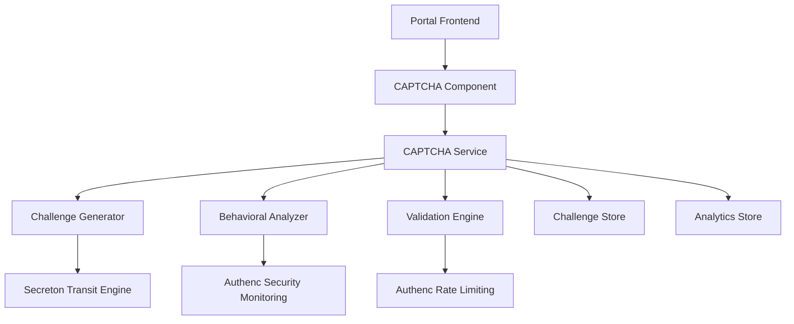

# Design Document - AI-Resistant CAPTCHA System

## Overview

Sistem CAPTCHA multi-layer yang tahan terhadap bot AI modern, terintegrasi dengan infrastruktur keamanan SIMPelv2 existing. Menggunakan kombinasi teknik behavioral analysis, cryptographic challenges, dan adaptive difficulty untuk melawan serangan otomatis canggih.

## Architecture

### High-Level Architecture



### Integration Points

1. **Frontend Integration**: Shared microfrontend components
2. **Security Integration**: Authenc middleware dan monitoring
3. **Cryptographic Integration**: Secreton transit engine
4. **Storage Integration**: Existing database infrastructure

## Components and Interfaces

### 1. CAPTCHA Component (Frontend)

**Location**: `antarmuka/shared/src/components/captcha/`

**Dependencies**:
- Shared component library (Button, Input, etc.)
- Existing hooks (storage, validation)
- Theme system

**Key Features**:
- Multi-modal challenges (visual, audio, behavioral)
- Progressive difficulty adaptation
- Accessibility compliance
- Real-time validation feedback
### 2. CAPTCHA Service (Backend)

**Location**: `infra/authenc/src/services/captcha/`

**Dependencies**:
- Authenc middleware (rate limiting, security monitoring)
- Secreton client for encryption
- Database for challenge storage

**Key Features**:
- Challenge generation and validation
- Behavioral pattern analysis
- Adaptive difficulty algorithms
- Integration with existing auth flow

### 3. Challenge Generator

**Responsibilities**:
- Generate cryptographically secure challenges
- Support multiple challenge types (visual, logical, behavioral)
- Integrate with Secreton for encryption
- Adaptive difficulty based on threat level

**Challenge Types**:
1. **Visual Challenges**: Iased puzzles with AI-resistant elements
2. **Behavioral Challenges**: Mouse movement, typing patterns, timing analysis
3. **Logical Challenges**: Mathematical or pattern-based problems
4. **Hybrid Challenges**: Combination of multiple types

### 4. Behavioral Analyzer

**Responsibilities**:
- Analyze user interaction patterns
- Detect bot-like behavior
- Machine learning-based classification
- Real-time threat assessment

**Analysis Metrics**:
- Mouse movement patterns and velocity
- Keystroke dynamics and timing
- Browser fingerprinting
- Session behavior analysis
- Network pattern analysis

### 5. Validation Engine

**Location**: `infra/authenc/src/services/captcha/validator.rs`

**Responsibilities**:
- Validate challenge responses with answer hash verification
- Implement progressive penalties based on consecutive failures
- Coordinate with rate limiting via CaptchaRateLimitState
- Generate audit logs via security_monitoring module
- Track validation attempts per IP/session

**Validation Flow**:
1. Check if challenge is expired (>300 seconds)
2. Check lockout status (Critical: 1 hour, High: 15 minutes)
3. Verify answer hash using authenc crypto module
4. Calculate confidence score based on behavioral analysis
5. Assess risk level (Low, Medium, High, Critical)
6. Update attempt tracking and rate limiting state
7. Log security events to Authenc asynchronously
8. Determine next difficulty and retry policy

**Lockout Policy**:
- 1-2 failures: Low risk, 5 max attempts
- 3-5 failures: Medium risk, 3 max attempts
- 6-10 failures: High risk, 2 max attempts, 15 min lockout
- 10+ failures: Critical risk, 1 max attempt, 1 hour lockout

### 6. Metrics Collector

**Location**: `infra/authenc/src/services/captcha/metrics.rs`

**Responsibilities**:
- Collect performance metrics (latency, success/failure rates)
- Track bot detection accuracy (precision, recall, F1 score)
- Monitor user experience (completion time, abandonment, satisfaction)
- Record security events (attacks, blocked IPs, lockouts)

**Metrics Types**:
- PerformanceMetrics: generation_latency, validation_latency, success_rate, concurrent_challenges
- BotDetectionMetrics: true_positives, false_positives, accuracy_rate, precision, recall, f1_score
- UserExperienceMetrics: completion_time, abandonment_rate, retry_rate, accessibility_usage
- SecurityEventMetrics: attack_attempts, blocked_ips, rate_limit_triggers, lockout_events

### 7. Alerting System

**Location**: `infra/authenc/src/services/captcha/alerting.rs`

**Responsibilities**:
- Evaluate alert rules against metrics
- Trigger alerts when conditions are met
- Send notifications via multiple channels
- Track alert states and cooldown periods

**Default Alert Rules**:
- High Bot Detection Rate: >15% in 15 minutes → Warning
- Low Success Rate: <80% in 30 minutes → Critical
- High Latency: >2000ms in 10 minutes → Warning
- Security Incident: >100 attacks in 5 minutes → Critical

**Notification Channels**:
- Email, Webhook, Slack, PagerDuty, Log

## Data Models

### Challenge Model
```rust
#[derive(Debug, Clone, Serialize, Deserialize)]
pub struct Challenge {
    pub id: String,
    pub challenge_type: ChallengeType,
    pub difficulty_level: u8,
    pub encrypted_data: String,
    pub expected_answer_hash: String,
    pub created_at: SystemTime,
    pub expires_at: SystemTime,
    pub session_id: Option<String>,
    pub ip_address: String,
    pub encrypted_challenge_data: Option<EncryptedChallengeData>,
    pub is_encrypted: bool,
}
```

### Challenge Types
```rust
pub enum ChallengeType {
    Visual,      // Image-based CAPTCHA
    Audio,       // Sound-based CAPTCHA
    Behavioral,  // Interaction-based CAPTCHA
    Logical,     // Puzzle-based CAPTCHA
    Hybrid,      // Multiple types combined
}
```

### Behavioral Metrics Model
```rust
#[derive(Debug, Clone, Serialize, Deserialize)]
pub struct BehavioralMetrics {
    pub session_id: String,
    pub mouse_movements: Vec<MouseEvent>,
    pub keystroke_dynamics: Vec<KeystrokeEvent>,
    pub timing_patterns: TimingAnalysis,
    pub browser_fingerprint: BrowserFingerprint,
    pub risk_score: f64,
    pub classification: BehaviorClassification,
}

pub struct MouseEvent {
    pub x: f64,
    pub y: f64,
    pub timestamp: u64,
    pub event_type: String,
    pub velocity: Option<f64>,
    pub acceleration: Option<f64>,
}

pub struct KeystrokeEvent {
    pub key: String,
    pub timestamp: u64,
    pub duration: u64,
    pub dwell_time: u64,
    pub flight_time: Option<u64>,
}

pub struct TimingAnalysis {
    pub total_interaction_time: u64,
    pub pause_patterns: Vec<u64>,
    pub rhythm_consistency: f64,
    pub typing_speed: Option<f64>,
}

pub struct BrowserFingerprint {
    pub user_agent: String,
    pub screen_resolution: String,
    pub timezone: String,
    pub language: String,
    pub plugins: Vec<String>,
    pub canvas_fingerprint: Option<String>,
    pub webgl_fingerprint: Option<String>,
}
```

### Validation Result Model
```rust
#[derive(Debug, Clone, Serialize, Deserialize)]
pub struct ValidationResult {
    pub success: bool,
    pub confidence_score: f64,
    pub risk_assessment: RiskLevel,
    pub next_difficulty: u8,
    pub retry_allowed: bool,
    pub lockout_duration: Option<Duration>,
    pub message: String,
}
```

### Bot Detection Models
```rust
pub struct BotDetectionResult {
    pub is_bot: bool,
    pub confidence: f64,
    pub risk_score: f64,
    pub classification: BehaviorClassification,
    pub model_predictions: HashMap<String, f64>,
    pub anomaly_scores: HashMap<String, f64>,
    pub feature_importance: HashMap<String, f64>,
}

pub struct FeatureVector {
    pub mouse_velocity_mean: f64,
    pub mouse_velocity_std: f64,
    pub mouse_trajectory_smoothness: f64,
    pub mouse_pause_ratio: f64,
    pub mouse_direction_changes: f64,
    pub keystroke_dwell_mean: f64,
    pub keystroke_dwell_std: f64,
    pub keystroke_flight_mean: f64,
    pub keystroke_flight_std: f64,
    pub keystroke_rhythm_consistency: f64,
    pub interaction_duration: f64,
    pub pause_frequency: f64,
    pub rhythm_score: f64,
    pub fingerprint_uniqueness: f64,
    pub automation_indicator_count: f64,
    pub plugin_count: f64,
    pub velocity_acceleration_ratio: f64,
    pub typing_speed_consistency: f64,
    pub behavioral_entropy: f64,
}
```

### Adaptive Difficulty Models
```rust
pub struct UserBehaviorHistory {
    pub session_id: String,
    pub ip_address: String,
    pub failed_attempts: u32,
    pub successful_attempts: u32,
    pub avg_completion_time: f64,
    pub risk_scores: Vec<f64>,
    pub last_challenge_at: SystemTime,
    pub consecutive_failures: u32,
    pub user_agent: Option<String>,
}

pub struct ThreatAssessment {
    pub risk_level: RiskLevel,
    pub risk_score: f64,
    pub indicators: Vec<ThreatIndicator>,
    pub assessed_at: SystemTime,
}

pub struct ThreatIndicator {
    pub indicator_type: String,
    pub severity: f64,
    pub description: String,
}
```

### Rate Limiting Models
```rust
pub struct CaptchaRateLimitConfig {
    pub base_config: RateLimitConfig,
    pub progressive_limits: ProgressiveLimits,
    pub risk_based_limits: RiskBasedLimits,
    pub enabled: bool,
}

pub struct ProgressiveLimits {
    pub low_failure_rpm: u64,      // 20 rpm (1-2 failures)
    pub medium_failure_rpm: u64,   // 10 rpm (3-5 failures)
    pub high_failure_rpm: u64,     // 5 rpm (6-10 failures)
    pub critical_failure_rpm: u64, // 1 rpm (10+ failures)
}

pub struct CaptchaFailureTracker {
    pub failure_count: u32,
    pub last_failure: SystemTime,
    pub current_risk_level: RiskLevel,
    pub consecutive_failures: u32,
}
```

## Correctness Properties

*A property is a characteristic or behavior that should hold true across all valid executions of a system-essentially, a formal statement about what the system should do. Properties serve as the bridge between human-readable specifications and machine-verifiable correctness guarantees.*

### Property 1: Adaptive Difficulty Increases with Failures
*For any* user session with consecutive failures, the difficulty level SHALL increase by 1 per failure up to maximum level 10, and reset to base level (3) after success.
**Validates: Requirements 1.3, 1.5**

### Property 2: Validation Response Time
*For any* valid CAPTCHA challenge response, the validation SHALL complete within 2 seconds.
**Validates: Requirements 1.2**

### Property 3: Bot Detection Classification Consistency
*For any* behavioral metrics with risk_score > 0.8, the classification SHALL be High or Critical risk, and for risk_score > 0.9, emergency protection SHALL be activated.
**Validates: Requirements 2.1, 2.5, 6.4**

### Property 4: Progressive Rate Limiting
*For any* IP address with consecutive failures, the rate limit SHALL decrease progressively: 20 rpm (1-2 failures) → 10 rpm (3-5 failures) → 5 rpm (6-10 failures) → 1 rpm (10+ failures).
**Validates: Requirements 2.4, 8.2**

### Property 5: Lockdown Mode Activation
*For any* IP address with more than 100 failed attempts in 1 minute, the system SHALL activate lockdown mode with 1 request/minute limit.
**Validates: Requirements 2.3**

### Property 6: Challenge Encryption Round-Trip
*For any* challenge created with Secreton encryption enabled, encrypting then decrypting the challenge data SHALL produce the original challenge data.
**Validates: Requirements 3.1**

### Property 7: Fallback Mechanism Activation
*For any* scenario where Secreton or Authenc is unavailable, the system SHALL use fallback mechanism and continue to function with local encryption.
**Validates: Requirements 3.5**

### Property 8: Anomaly Detection Z-Score Threshold
*For any* feature vector with z-score > 2.5 from baseline, the system SHALL flag it as anomaly and include it in anomaly_scores.
**Validates: Requirements 5.4**

### Property 9: Automation Indicator Risk Score Impact
*For any* behavioral analysis with automation_indicator_count > 0, the risk_score SHALL increase by weight 0.4 * automation_indicator_count.
**Validates: Requirements 6.2**

### Property 10: Challenge Struct Completeness
*For any* created challenge, the Challenge struct SHALL have all required fields populated: id, challenge_type, difficulty_level, encrypted_data, expected_answer_hash, created_at, expires_at, ip_address.
**Validates: Requirements 9.2**

### Property 11: ValidationResult Struct Completeness
*For any* validation operation, the ValidationResult SHALL have all required fields: success, confidence_score, risk_assessment, next_difficulty, retry_allowed, message.
**Validates: Requirements 9.4**

### Property 12: Challenge Expiration and Cleanup
*For any* challenge older than 300 seconds (5 minutes), the challenge SHALL be marked as expired and removed by cleanup function.
**Validates: Requirements 10.2**

### Property 13: Threat Assessment Indicator Detection
*For any* user behavior with high_failure_rate > 0.7, consecutive_failures > 5, or avg_completion_time < 2s, the ThreatAssessment SHALL include corresponding ThreatIndicator.
**Validates: Requirements 6.5**

### Property 14: ARIA Labels Completeness
*For any* interactive CAPTCHA element, the element SHALL have appropriate ARIA labels (aria-label, aria-pressed, aria-live) for screen reader compatibility.
**Validates: Requirements 4.2**

### Property 15: Audit Logging on Bot Detection
*For any* bot detection event (classification=Bot), the system SHALL log the event to audit trail within 1 second.
**Validates: Requirements 2.2, 3.4**

## Error Handling

**Location**: `infra/authenc/src/services/captcha/error.rs`

### Error Types (CaptchaError enum)
1. **GenerationFailed**: Challenge generation failed (recoverable, retry_after)
2. **ValidationFailed**: Incorrect answer (attempts_remaining, next_difficulty)
3. **ChallengeNotFound**: Challenge ID not found (expired flag)
4. **ChallengeExpired**: Challenge has expired (expired_at timestamp)
5. **SecreonUnavailable**: Secreton service unavailable (fallback_available)
6. **MonitoringUnavailable**: Authenc monitoring unavailable (degraded_mode)
7. **DatabaseError**: Database connection/operation failed (transient, retry_after)
8. **RateLimitExceeded**: Rate limit exceeded (reset_time, max_attempts)
9. **UserLockedOut**: Account temporarily locked (lockout_duration, reason)
10. **SuspiciousActivity**: Suspicious activity detected (risk_level, additional_verification_required)
11. **AccessibilityUnavailable**: Accessibility feature unavailable (alternatives)
12. **AudioGenerationFailed**: Audio challenge generation failed (fallback_to_visual)
13. **ConfigurationError**: Invalid configuration (parameter, expected, actual)
14. **SystemOverloaded**: System overloaded (retry_after, queue_position)
15. **NetworkTimeout**: Network timeout (service, timeout_duration, retry_count)
16. **ExternalServiceError**: External service error (service, error_code, recoverable)

### Recovery Strategies
```rust
pub enum RecoveryStrategy {
    Retry { max_attempts, delay, exponential_backoff },
    Fallback { fallback_type, degraded_functionality },
    ManualIntervention { contact_info, ticket_id },
    GracefulDegradation { reduced_security, alternative_flow },
}

pub enum FallbackType {
    LocalEncryption,
    SimplifiedChallenge,
    ManualVerification,
    AlternativeProvider,
    CachedResponse,
}
```

### Error Recovery Implementation
- **ErrorRecovery struct**: Executes operations with automatic retry and recovery
- **Exponential backoff**: base_delay * 2^(attempt-1), capped at max_delay
- **IntoCaptchaError trait**: Converts standard errors (tokio_postgres, reqwest) to CaptchaError

## Testing Strategy

### Property-Based Testing Framework
- **Library**: `proptest` crate for Rust property-based testing
- **Minimum Iterations**: 100 iterations per property test
- **Test Annotation Format**: `// **Feature: ai-resistant-captcha, Property {number}: {property_text}**`

### Property-Based Tests
Each correctness property MUST be implemented as a property-based test:

1. **Property 1 Test**: Generate random failure sequences, verify difficulty scaling
2. **Property 2 Test**: Generate random valid challenges, measure validation time
3. **Property 3 Test**: Generate random risk scores, verify classification consistency
4. **Property 4 Test**: Generate random failure counts, verify rate limit values
5. **Property 5 Test**: Simulate high failure rates, verify lockdown activation
6. **Property 6 Test**: Generate random challenge data, verify encryption round-trip
7. **Property 7 Test**: Simulate service unavailability, verify fallback activation
8. **Property 8 Test**: Generate random feature vectors, verify anomaly detection
9. **Property 9 Test**: Generate random automation indicators, verify risk score impact
10. **Property 10 Test**: Generate random challenges, verify struct completeness
11. **Property 11 Test**: Generate random validations, verify result completeness
12. **Property 12 Test**: Generate expired challenges, verify cleanup behavior
13. **Property 13 Test**: Generate random user behaviors, verify threat indicators
14. **Property 14 Test**: Render CAPTCHA components, verify ARIA attributes
15. **Property 15 Test**: Trigger bot detection, verify audit log timing

### Unit Testing
- Challenge generation algorithms
- Behavioral analysis functions (mouse, keystroke, timing)
- Validation logic
- Encryption/decryption operations
- Risk score calculations
- Difficulty adjustment algorithms

### Integration Testing
- Authenc middleware integration (rate limiting, CSRF, security monitoring)
- Secreton transit engine integration (encryption, key rotation)
- Database operations (challenge storage, metrics, cleanup)
- Frontend component integration (Leptos signals, callbacks)
- API endpoint testing (challenge, validate, refresh, health)

### Security Testing
- Bot detection accuracy (>95% target)
- Cryptographic security validation
- Rate limiting effectiveness
- CSRF protection validation
- Replay attack prevention
- Session security

### Performance Testing
- Challenge generation latency (<100ms target)
- Validation response times (<2s target)
- Concurrent user handling (1000+ concurrent challenges)
- Memory usage optimization
- Cache hit rate monitoring
- Database query performance

### Accessibility Testing
- Screen reader compatibility (NVDA, JAWS, VoiceOver)
- Keyboard navigation completeness
- WCAG 2.1 AA compliance
- Color contrast validation (4.5:1 ratio)
- Audio challenge quality
## Security Considerations

### Cryptographic Security
- All challenges encrypted using Secreton transit engine
- Challenge answers hashed with salt
- Secure random number generation
- Key rotation support

### Anti-Bot Measures
1. **Multi-Layer Detection**:
   - Behavioral analysis (mouse, keyboard, timing)
   - Browser fingerprinting
   - Network pattern analysis
   - Challenge response analysis

2. **Adaptive Difficulty**:
   - Progressive difficulty increase for suspicious behavior
   - Dynamic challenge type selection
   - Personalized difficulty based on user history

3. **Rate Limiting Integration**:
   - Leverage Authenc rate limiting middleware
   - IP-based and session-based limits
   - Progressive penalties for failures

### Privacy Protection
- Minimal data collection
- Anonymized behavioral metrics
- GDPR compliance
- Data retention policies

## Performance Optimization

### Caching Strategy
- Challenge templates cached in memory
- Behavioral models cached per session
- Database query optimization
- CDN for static challenge assets

### Scalability
- Horizontal scaling support
- Database sharding for high volume
- Async processing for behavioral analysis
- Load balancing considerations

## Monitoring and Analytics

### Metrics Collection
- Challenge success/failure rates
- Bot detection accuracy
- Performance metrics (latency, throughput)
- User experience metrics

### Alerting
- High bot detection rates
- Performance degradation
- Integration failures
- Security incidents

### Dashboards
- Real-time threat monitoring
- Performance analytics
- User experience metrics
- System health status
