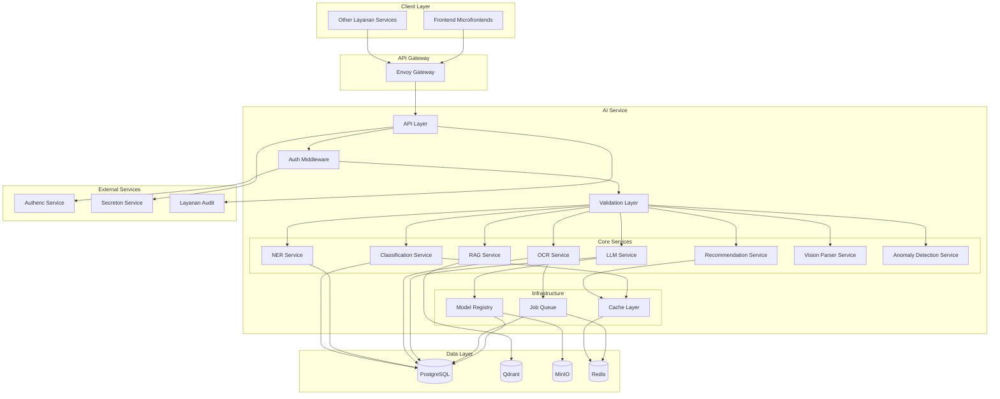
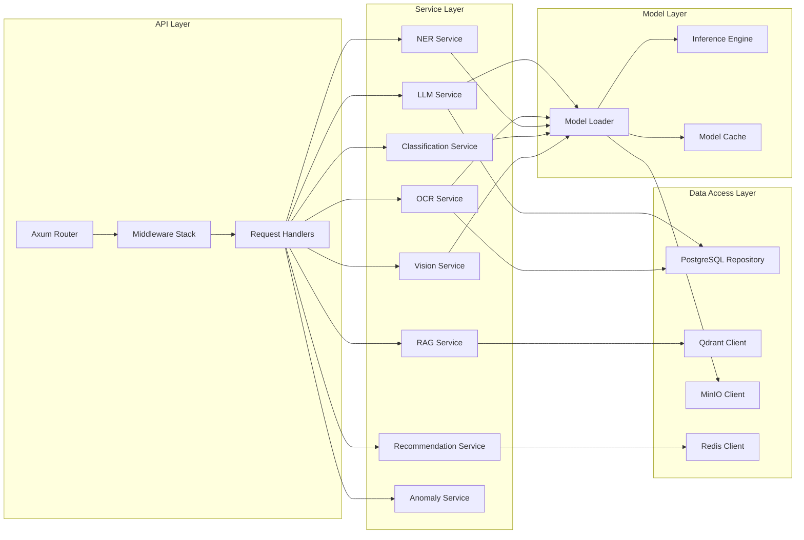
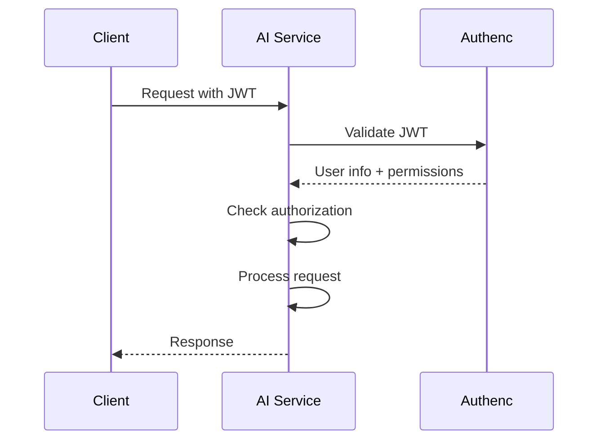

# Design Document - AI Service Optimization

## Overview

The AI Service (layanan-ai) is designed as a high-performance, scalable microservice that provides comprehensive artificial intelligence and machine learning capabilities for the Indonesian Attorney General's Office (Kejaksaan RI). The service supports all divisions (Pidum, Pidsus, Pidmil, Intel, Pengawasan, Datun, Badiklat, Pemulihan Aset, Pembinaan) with specialized AI capabilities including document processing, text analysis, pattern recognition, predictive analytics, and intelligent automation.

### Design Principles

1. **Security First**: All operations are authenticated, authorized, and audited. Sensitive data is encrypted at rest and in transit.
2. **Performance**: Target p95 latency < 2 seconds for inference, 100 req/s throughput, horizontal scalability.
3. **Reliability**: 99.9% uptime, graceful degradation, circuit breakers, retry mechanisms.
4. **Modularity**: Loosely coupled components, clear interfaces, easy to extend and maintain.
5. **Observability**: Comprehensive logging, metrics, and tracing for troubleshooting and optimization.
6. **Compliance**: Adherence to Indonesian data protection laws (UU ITE, PP PSTE) and government security standards.

### Technology Stack

- **Language**: Rust (edition 2024, version 1.90+)
- **Web Framework**: Axum 0.8.6 with Tower middleware
- **Database**: PostgreSQL 15+ with tokio-postgres and deadpool-postgres
- **Vector Database**: Qdrant for embeddings and RAG
- **Object Storage**: MinIO for documents, models, and datasets
- **Message Queue**: Redis for job queue and caching
- **AI/ML**: Rust-based inference with ONNX Runtime, Candle, or Burn
- **Monitoring**: Prometheus, OpenTelemetry, Sentry
- **Authentication**: Integration with Authenc service (JWT)
- **Secrets**: Integration with Secreton service

## Architecture

### High-Level Architecture




### Component Architecture



## Components and Interfaces

### 1. API Layer

#### Router Configuration
```rust
pub fn create_router(state: AppState) -> Router {
    Router::new()
        // Health and metrics
        .route("/health", get(handlers::health))
        .route("/metrics", get(handlers::metrics))

        // LLM endpoints
        .route("/api/llm/generate", post(handlers::llm::generate_text))
        .route("/api/llm/summarize", post(handlers::llm::summarize))
        .route("/api/llm/classify", post(handlers::llm::classify))

        // OCR endpoints
        .route("/api/ocr/extract", post(handlers::ocr::extract_text))
        .route("/api/ocr/batch", post(handlers::ocr::process_batch))
        .route("/api/ocr/status/:job_id", get(handlers::ocr::job_status))

        // NER endpoints
        .route("/api/ner/extract", post(handlers::ner::extract_entities))

        // RAG endpoints
        .route("/api/rag/query", post(handlers::rag::query))
        .route("/api/rag/ingest", post(handlers::rag::ingest_documents))

        // Classification endpoints
        .route("/api/classify/bmn", post(handlers::classify::classify_bmn))
        .route("/api/classify/case", post(handlers::classify::classify_case))
        .route("/api/classify/document", post(handlers::classify::classify_document))

        // Recommendation endpoints
        .route("/api/recommend/quantity", post(handlers::recommend::recommend_quantity))
        .route("/api/recommend/specification", post(handlers::recommend::recommend_spec))

        // Vision endpoints
        .route("/api/vision/parse", post(handlers::vision::parse_document))
        .route("/api/vision/extract_table", post(handlers::vision::extract_table))

        // Anomaly detection endpoints
        .route("/api/anomaly/detect", post(handlers::anomaly::detect_anomalies))

        // Model management endpoints
        .route("/api/models", get(handlers::models::list_models))
        .route("/api/models/:id", get(handlers::models::get_model))
        .route("/api/models/register", post(handlers::models::register_model))
        .route("/api/models/:id/deploy", post(handlers::models::deploy_model))
        .route("/api/models/:id/rollback", post(handlers::models::rollback_model))

        // Job management endpoints
        .route("/api/jobs/:id", get(handlers::jobs::get_job_status))
        .route("/api/jobs/:id/cancel", post(handlers::jobs::cancel_job))
        .route("/api/jobs/:id/retry", post(handlers::jobs::retry_job))

        // Middleware stack
        .layer(
            ServiceBuilder::new()
                .layer(TraceLayer::new_for_http())
                .layer(CorsLayer::permissive())
                .layer(CompressionLayer::new())
                .layer(TimeoutLayer::new(Duration::from_secs(30)))
                .layer(middleware::from_fn_with_state(state.clone(), auth_middleware))
                .layer(middleware::from_fn(rate_limit_middleware))
        )
        .with_state(state)
}
```

#### Middleware Stack
1. **Authentication Middleware**: Validates JWT tokens with Authenc service
2. **Authorization Middleware**: Checks user permissions based on division and role
3. **Rate Limiting**: Enforces rate limits per user/IP
4. **Request Validation**: Validates request payloads using garde
5. **Logging**: Structured logging with trace IDs
6. **Metrics**: Records request metrics (latency, status, endpoint)
7. **Error Handling**: Converts errors to RFC 7807 problem details

### 2. Service Layer

#### LLM Service
```rust
pub struct LlmService {
    model_registry: Arc<ModelRegistry>,
    config: LlmConfig,
    cache: Arc<RwLock<LruCache<String, String>>>,
}

impl LlmService {
    pub async fn generate_text(&self, request: GenerateTextRequest) -> Result<GenerateTextResponse> {
        // 1. Validate and sanitize input
        // 2. Check cache for similar prompts
        // 3. Load model from registry
        // 4. Run inference
        // 5. Post-process output
        // 6. Cache result
        // 7. Log prediction
        // 8. Return response
    }

    pub async fn summarize(&self, request: SummarizeRequest) -> Result<SummarizeResponse> {
        // Similar flow for summarization
    }

    pub async fn classify(&self, request: ClassifyRequest) -> Result<ClassifyResponse> {
        // Similar flow for classification
    }
}
```


#### OCR Service
```rust
pub struct OcrService {
    model_registry: Arc<ModelRegistry>,
    job_queue: Arc<JobQueue>,
    config: OcrConfig,
}

impl OcrService {
    pub async fn extract_text(&self, request: ExtractTextRequest) -> Result<ExtractTextResponse> {
        // 1. Validate image format and size
        // 2. Preprocess image (deskew, denoise, enhance)
        // 3. Detect language
        // 4. Load OCR model (PaddleOCR)
        // 5. Run OCR inference
        // 6. Post-process text (spell check, formatting)
        // 7. Extract confidence scores and bounding boxes
        // 8. Store results in database
        // 9. Return response
    }

    pub async fn process_batch(&self, request: BatchOcrRequest) -> Result<BatchOcrResponse> {
        // 1. Validate batch size and total size
        // 2. Create job in queue
        // 3. Return job_id immediately
        // 4. Process asynchronously in background
    }
}
```

#### NER Service
```rust
pub struct NerService {
    model_registry: Arc<ModelRegistry>,
    config: NerConfig,
}

impl NerService {
    pub async fn extract_entities(&self, request: ExtractEntitiesRequest) -> Result<ExtractEntitiesResponse> {
        // 1. Validate and preprocess text
        // 2. Load NER model (spaCy)
        // 3. Run NER inference
        // 4. Extract entities with types and positions
        // 5. Normalize entity values
        // 6. Filter by confidence threshold
        // 7. Store results
        // 8. Return entities
    }
}
```

#### RAG Service
```rust
pub struct RagService {
    llm_service: Arc<LlmService>,
    qdrant_client: Arc<QdrantClient>,
    embedding_model: Arc<EmbeddingModel>,
    config: RagConfig,
}

impl RagService {
    pub async fn query(&self, request: RagQueryRequest) -> Result<RagQueryResponse> {
        // 1. Validate query
        // 2. Generate query embedding
        // 3. Search Qdrant for similar documents
        // 4. Retrieve top-k relevant chunks
        // 5. Build context from retrieved chunks
        // 6. Generate answer using LLM with context
        // 7. Extract citations
        // 8. Return answer with citations
    }

    pub async fn ingest_documents(&self, request: IngestDocumentsRequest) -> Result<IngestDocumentsResponse> {
        // 1. Validate documents
        // 2. Extract text (OCR if needed)
        // 3. Chunk documents
        // 4. Generate embeddings for chunks
        // 5. Store embeddings in Qdrant
        // 6. Store metadata in PostgreSQL
        // 7. Return ingestion status
    }
}
```

#### Classification Service
```rust
pub struct ClassificationService {
    model_registry: Arc<ModelRegistry>,
    cache: Arc<RwLock<LruCache<String, ClassificationResult>>>,
    config: ClassificationConfig,
}

impl ClassificationService {
    pub async fn classify_bmn(&self, request: ClassifyBmnRequest) -> Result<ClassifyBmnResponse> {
        // 1. Validate input text
        // 2. Check cache
        // 3. Load classification model
        // 4. Preprocess text (tokenization, normalization)
        // 5. Run inference
        // 6. Get top-k predictions with confidence
        // 7. Apply business rules if needed
        // 8. Cache result
        // 9. Return classification
    }

    pub async fn classify_case(&self, request: ClassifyCaseRequest) -> Result<ClassifyCaseResponse> {
        // Similar flow for case classification
    }
}
```

#### Recommendation Service
```rust
pub struct RecommendationService {
    model_registry: Arc<ModelRegistry>,
    pg_pool: Arc<Pool>,
    cache: Arc<RwLock<LruCache<String, RecommendationResult>>>,
    config: RecommendationConfig,
}

impl RecommendationService {
    pub async fn recommend_quantity(&self, request: RecommendQuantityRequest) -> Result<RecommendQuantityResponse> {
        // 1. Validate input
        // 2. Fetch historical data from PostgreSQL
        // 3. Load XGBoost model
        // 4. Prepare features (satker size, budget, usage patterns)
        // 5. Run inference
        // 6. Apply business rules and constraints
        // 7. Generate explanation
        // 8. Return recommendation with confidence
    }

    pub async fn recommend_specification(&self, request: RecommendSpecRequest) -> Result<RecommendSpecResponse> {
        // Similar flow for specification recommendations
    }
}
```

#### Vision Parser Service
```rust
pub struct VisionParserService {
    model_registry: Arc<ModelRegistry>,
    config: VisionConfig,
}

impl VisionParserService {
    pub async fn parse_document(&self, request: ParseDocumentRequest) -> Result<ParseDocumentResponse> {
        // 1. Validate image
        // 2. Load vision model (Donut/Pix2Struct)
        // 3. Run inference
        // 4. Extract document structure
        // 5. Identify regions (header, body, table, signature)
        // 6. Extract key-value pairs
        // 7. Return structured data
    }

    pub async fn extract_table(&self, request: ExtractTableRequest) -> Result<ExtractTableResponse> {
        // 1. Detect table regions
        // 2. Extract table structure
        // 3. Extract cell contents
        // 4. Return table data
    }
}
```

#### Anomaly Detection Service
```rust
pub struct AnomalyDetectionService {
    model_registry: Arc<ModelRegistry>,
    pg_pool: Arc<Pool>,
    config: AnomalyConfig,
}

impl AnomalyDetectionService {
    pub async fn detect_anomalies(&self, request: DetectAnomaliesRequest) -> Result<DetectAnomaliesResponse> {
        // 1. Validate input data
        // 2. Fetch historical baseline
        // 3. Load anomaly detection model (Isolation Forest/Autoencoder)
        // 4. Run inference
        // 5. Calculate anomaly scores
        // 6. Filter by threshold
        // 7. Generate explanations
        // 8. Return anomalies with scores
    }
}
```

### 3. Model Layer

#### Model Registry
```rust
pub struct ModelRegistry {
    models: Arc<RwLock<HashMap<String, ModelMetadata>>>,
    loaded_models: Arc<RwLock<LruCache<String, Arc<dyn Model>>>>,
    pg_pool: Arc<Pool>,
    minio_client: Arc<MinioClient>,
    config: ModelRegistryConfig,
}

impl ModelRegistry {
    pub async fn register_model(&self, metadata: ModelMetadata) -> Result<String> {
        // 1. Validate metadata
        // 2. Check model file exists in MinIO
        // 3. Verify checksum
        // 4. Store metadata in PostgreSQL
        // 5. Return model_id
    }

    pub async fn load_model(&self, model_id: &str) -> Result<Arc<dyn Model>> {
        // 1. Check if model is already loaded in cache
        // 2. If not, fetch metadata from PostgreSQL
        // 3. Download model from MinIO
        // 4. Verify checksum
        // 5. Load model into memory
        // 6. Cache model with LRU eviction
        // 7. Return model reference
    }

    pub async fn deploy_model(&self, model_id: &str) -> Result<()> {
        // 1. Validate model exists
        // 2. Load model to verify it works
        // 3. Update status to "deployed"
        // 4. Emit deployment event
    }

    pub async fn rollback_model(&self, model_id: &str) -> Result<()> {
        // 1. Find previous version
        // 2. Unload current model
        // 3. Load previous version
        // 4. Update status
        // 5. Emit rollback event
    }
}
```

#### Inference Engine
```rust
pub trait Model: Send + Sync {
    fn predict(&self, input: &Tensor) -> Result<Tensor>;
    fn metadata(&self) -> &ModelMetadata;
}

pub struct OnnxModel {
    session: Arc<Session>,
    metadata: ModelMetadata,
}

impl Model for OnnxModel {
    fn predict(&self, input: &Tensor) -> Result<Tensor> {
        // Run ONNX inference
    }
}

pub struct CandleModel {
    model: Arc<dyn candle_core::Module>,
    metadata: ModelMetadata,
}

impl Model for CandleModel {
    fn predict(&self, input: &Tensor) -> Result<Tensor> {
        // Run Candle inference
    }
}
```


### 4. Job Queue System

```rust
pub struct JobQueue {
    redis_client: Arc<RedisClient>,
    pg_pool: Arc<Pool>,
    workers: Arc<RwLock<Vec<JoinHandle<()>>>>,
    config: JobQueueConfig,
}

impl JobQueue {
    pub async fn enqueue(&self, job: Job) -> Result<Uuid> {
        // 1. Validate job
        // 2. Check resource limits
        // 3. Generate job_id
        // 4. Store job in PostgreSQL
        // 5. Push to Redis queue
        // 6. Return job_id
    }

    pub async fn get_status(&self, job_id: Uuid) -> Result<JobStatus> {
        // 1. Query PostgreSQL for job
        // 2. Return status with progress
    }

    pub async fn cancel_job(&self, job_id: Uuid) -> Result<()> {
        // 1. Update status to "cancelled"
        // 2. Signal worker to stop
    }

    pub async fn start_workers(&self, num_workers: usize) {
        // 1. Spawn worker tasks
        // 2. Each worker polls Redis queue
        // 3. Process jobs and update status
    }
}

pub struct JobWorker {
    queue: Arc<JobQueue>,
    services: Arc<Services>,
}

impl JobWorker {
    pub async fn run(&self) {
        loop {
            // 1. Poll queue for next job
            // 2. Update status to "running"
            // 3. Execute job based on type
            // 4. Update progress periodically
            // 5. Store results
            // 6. Update status to "completed" or "failed"
            // 7. Retry on failure with backoff
        }
    }
}
```

## Data Models

### Database Schema

```sql
-- AI Models
CREATE TABLE ai_models (
    id UUID PRIMARY KEY DEFAULT gen_random_uuid(),
    name VARCHAR(255) NOT NULL,
    version VARCHAR(50) NOT NULL,
    model_type VARCHAR(50) NOT NULL, -- llm, ocr, ner, classification, etc.
    path TEXT NOT NULL, -- MinIO path
    checksum VARCHAR(64) NOT NULL, -- SHA256
    status VARCHAR(20) NOT NULL, -- draft, deployed, deprecated
    config JSONB,
    metadata JSONB,
    created_at TIMESTAMPTZ NOT NULL DEFAULT NOW(),
    updated_at TIMESTAMPTZ NOT NULL DEFAULT NOW(),
    created_by UUID,
    UNIQUE(name, version)
);

-- AI Jobs
CREATE TABLE ai_jobs (
    id UUID PRIMARY KEY DEFAULT gen_random_uuid(),
    job_type VARCHAR(50) NOT NULL, -- ocr_batch, training, bulk_classification
    payload JSONB NOT NULL,
    status VARCHAR(20) NOT NULL, -- queued, running, completed, failed, cancelled
    progress INTEGER DEFAULT 0, -- 0-100
    result JSONB,
    error TEXT,
    resource_limits JSONB, -- memory_mb, cpu_cores
    created_at TIMESTAMPTZ NOT NULL DEFAULT NOW(),
    updated_at TIMESTAMPTZ NOT NULL DEFAULT NOW(),
    started_at TIMESTAMPTZ,
    completed_at TIMESTAMPTZ,
    created_by UUID NOT NULL,
    satker_id UUID
);

-- AI Predictions
CREATE TABLE ai_predictions (
    id UUID PRIMARY KEY DEFAULT gen_random_uuid(),
    model_id UUID NOT NULL REFERENCES ai_models(id),
    input_hash VARCHAR(64) NOT NULL, -- SHA256 of input
    input_metadata JSONB,
    output JSONB NOT NULL,
    confidence FLOAT,
    latency_ms INTEGER,
    created_at TIMESTAMPTZ NOT NULL DEFAULT NOW(),
    created_by UUID NOT NULL,
    satker_id UUID,
    division VARCHAR(50) -- pidum, pidsus, etc.
);

-- AI Embeddings
CREATE TABLE ai_embeddings (
    id UUID PRIMARY KEY DEFAULT gen_random_uuid(),
    document_id UUID NOT NULL,
    model_id UUID NOT NULL REFERENCES ai_models(id),
    chunk_index INTEGER NOT NULL,
    text TEXT NOT NULL,
    qdrant_collection VARCHAR(255) NOT NULL,
    qdrant_point_id UUID NOT NULL,
    metadata JSONB,
    created_at TIMESTAMPTZ NOT NULL DEFAULT NOW()
);

-- AI Annotations (HITL)
CREATE TABLE ai_annotations (
    id UUID PRIMARY KEY DEFAULT gen_random_uuid(),
    prediction_id UUID REFERENCES ai_predictions(id),
    original_output JSONB NOT NULL,
    corrected_output JSONB NOT NULL,
    feedback TEXT,
    annotator_id UUID NOT NULL,
    created_at TIMESTAMPTZ NOT NULL DEFAULT NOW()
);

-- AI Training Jobs
CREATE TABLE ai_training_jobs (
    id UUID PRIMARY KEY DEFAULT gen_random_uuid(),
    model_type VARCHAR(50) NOT NULL,
    base_model_id UUID REFERENCES ai_models(id),
    training_data_path TEXT NOT NULL, -- MinIO path
    config JSONB NOT NULL,
    status VARCHAR(20) NOT NULL,
    metrics JSONB, -- loss, accuracy, f1, etc.
    output_model_id UUID REFERENCES ai_models(id),
    created_at TIMESTAMPTZ NOT NULL DEFAULT NOW(),
    started_at TIMESTAMPTZ,
    completed_at TIMESTAMPTZ,
    created_by UUID NOT NULL
);

-- AI Feedback
CREATE TABLE ai_feedback (
    id UUID PRIMARY KEY DEFAULT gen_random_uuid(),
    prediction_id UUID REFERENCES ai_predictions(id),
    rating INTEGER CHECK (rating BETWEEN 1 AND 5),
    feedback_text TEXT,
    created_at TIMESTAMPTZ NOT NULL DEFAULT NOW(),
    created_by UUID NOT NULL
);

-- Indexes
CREATE INDEX idx_ai_jobs_status ON ai_jobs(status);
CREATE INDEX idx_ai_jobs_created_by ON ai_jobs(created_by);
CREATE INDEX idx_ai_predictions_model_id ON ai_predictions(model_id);
CREATE INDEX idx_ai_predictions_created_by ON ai_predictions(created_by);
CREATE INDEX idx_ai_predictions_division ON ai_predictions(division);
CREATE INDEX idx_ai_embeddings_document_id ON ai_embeddings(document_id);
CREATE INDEX idx_ai_annotations_prediction_id ON ai_annotations(prediction_id);
```

### Rust Data Models

```rust
#[derive(Debug, Clone, Serialize, Deserialize)]
pub struct ModelMetadata {
    pub id: Uuid,
    pub name: String,
    pub version: String,
    pub model_type: ModelType,
    pub path: String,
    pub checksum: String,
    pub status: ModelStatus,
    pub config: serde_json::Value,
    pub metadata: serde_json::Value,
    pub created_at: DateTime<Utc>,
    pub updated_at: DateTime<Utc>,
    pub created_by: Option<Uuid>,
}

#[derive(Debug, Clone, Serialize, Deserialize)]
pub enum ModelType {
    Llm,
    Ocr,
    Ner,
    Classification,
    Recommendation,
    Vision,
    Anomaly,
    Embedding,
}

#[derive(Debug, Clone, Serialize, Deserialize)]
pub enum ModelStatus {
    Draft,
    Deployed,
    Deprecated,
}

#[derive(Debug, Clone, Serialize, Deserialize)]
pub struct Job {
    pub id: Uuid,
    pub job_type: JobType,
    pub payload: serde_json::Value,
    pub status: JobStatus,
    pub progress: u8,
    pub result: Option<serde_json::Value>,
    pub error: Option<String>,
    pub resource_limits: ResourceLimits,
    pub created_at: DateTime<Utc>,
    pub updated_at: DateTime<Utc>,
    pub started_at: Option<DateTime<Utc>>,
    pub completed_at: Option<DateTime<Utc>>,
    pub created_by: Uuid,
    pub satker_id: Option<Uuid>,
}

#[derive(Debug, Clone, Serialize, Deserialize)]
pub enum JobType {
    OcrBatch,
    Training,
    BulkClassification,
    BulkRecommendation,
    DocumentIngestion,
}

#[derive(Debug, Clone, Serialize, Deserialize)]
pub enum JobStatus {
    Queued,
    Running,
    Completed,
    Failed,
    Cancelled,
}

#[derive(Debug, Clone, Serialize, Deserialize)]
pub struct ResourceLimits {
    pub memory_mb: u32,
    pub cpu_cores: f32,
    pub timeout_seconds: u32,
}

#[derive(Debug, Clone, Serialize, Deserialize)]
pub struct Prediction {
    pub id: Uuid,
    pub model_id: Uuid,
    pub input_hash: String,
    pub input_metadata: serde_json::Value,
    pub output: serde_json::Value,
    pub confidence: Option<f32>,
    pub latency_ms: u32,
    pub created_at: DateTime<Utc>,
    pub created_by: Uuid,
    pub satker_id: Option<Uuid>,
    pub division: Option<String>,
}
```


## Error Handling

### Error Types

```rust
#[derive(Debug, thiserror::Error)]
pub enum AiError {
    #[error("Model not found: {0}")]
    ModelNotFound(String),

    #[error("Model loading failed: {0}")]
    ModelLoadError(String),

    #[error("Inference failed: {0}")]
    InferenceError(String),

    #[error("Invalid input: {0}")]
    ValidationError(String),

    #[error("Resource limit exceeded: {0}")]
    ResourceLimitExceeded(String),

    #[error("Job not found: {0}")]
    JobNotFound(Uuid),

    #[error("Database error: {0}")]
    DatabaseError(#[from] tokio_postgres::Error),

    #[error("Qdrant error: {0}")]
    QdrantError(String),

    #[error("MinIO error: {0}")]
    MinioError(String),

    #[error("Authentication failed: {0}")]
    AuthenticationError(String),

    #[error("Authorization failed: {0}")]
    AuthorizationError(String),

    #[error("Rate limit exceeded")]
    RateLimitExceeded,

    #[error("Timeout: {0}")]
    TimeoutError(String),

    #[error("Internal error: {0}")]
    InternalError(String),
}

impl IntoResponse for AiError {
    fn into_response(self) -> Response {
        let (status, error_message) = match self {
            AiError::ModelNotFound(_) => (StatusCode::NOT_FOUND, self.to_string()),
            AiError::ValidationError(_) => (StatusCode::BAD_REQUEST, self.to_string()),
            AiError::AuthenticationError(_) => (StatusCode::UNAUTHORIZED, self.to_string()),
            AiError::AuthorizationError(_) => (StatusCode::FORBIDDEN, self.to_string()),
            AiError::RateLimitExceeded => (StatusCode::TOO_MANY_REQUESTS, self.to_string()),
            AiError::ResourceLimitExceeded(_) => (StatusCode::BAD_REQUEST, self.to_string()),
            _ => (StatusCode::INTERNAL_SERVER_ERROR, "Internal server error".to_string()),
        };

        let body = Json(json!({
            "type": "about:blank",
            "title": status.canonical_reason().unwrap_or("Error"),
            "status": status.as_u16(),
            "detail": error_message,
        }));

        (status, body).into_response()
    }
}
```

### Error Handling Strategy

1. **Validation Errors**: Return 400 with field-level errors
2. **Authentication Errors**: Return 401 with clear message
3. **Authorization Errors**: Return 403 with permission details
4. **Not Found Errors**: Return 404 with resource type
5. **Rate Limit Errors**: Return 429 with Retry-After header
6. **Internal Errors**: Return 500, log full error, send to Sentry
7. **Timeout Errors**: Return 504, log timeout details
8. **Circuit Breaker**: Open circuit after 5 consecutive failures, half-open after 30s

## Testing Strategy

### Unit Tests

```rust
#[cfg(test)]
mod tests {
    use super::*;

    #[tokio::test]
    async fn test_llm_generate_text() {
        let service = create_test_llm_service().await;
        let request = GenerateTextRequest {
            prompt: "Test prompt".to_string(),
            max_tokens: 100,
        };
        let response = service.generate_text(request).await.unwrap();
        assert!(!response.text.is_empty());
        assert!(response.confidence > 0.0);
    }

    #[tokio::test]
    async fn test_ocr_extract_text() {
        let service = create_test_ocr_service().await;
        let image = load_test_image("test_document.png");
        let request = ExtractTextRequest { image };
        let response = service.extract_text(request).await.unwrap();
        assert!(!response.text.is_empty());
    }

    #[tokio::test]
    async fn test_model_registry_load() {
        let registry = create_test_registry().await;
        let model = registry.load_model("test-model-id").await.unwrap();
        assert_eq!(model.metadata().name, "test-model");
    }
}
```

### Integration Tests

```rust
#[tokio::test]
async fn test_end_to_end_classification() {
    let app = create_test_app().await;
    let client = TestClient::new(app);

    let response = client
        .post("/api/classify/bmn")
        .json(&json!({
            "text": "Laptop Dell Latitude 5420 i5 RAM 16GB"
        }))
        .send()
        .await;

    assert_eq!(response.status(), StatusCode::OK);
    let body: ClassifyBmnResponse = response.json().await;
    assert_eq!(body.category, "Elektronik");
    assert!(body.confidence > 0.8);
}

#[tokio::test]
async fn test_rag_query_with_context() {
    let app = create_test_app().await;
    let client = TestClient::new(app);

    // First ingest documents
    client.post("/api/rag/ingest")
        .json(&json!({
            "documents": [{"text": "BMN adalah Barang Milik Negara..."}]
        }))
        .send()
        .await;

    // Then query
    let response = client
        .post("/api/rag/query")
        .json(&json!({
            "query": "Apa itu BMN?"
        }))
        .send()
        .await;

    assert_eq!(response.status(), StatusCode::OK);
    let body: RagQueryResponse = response.json().await;
    assert!(!body.answer.is_empty());
    assert!(!body.citations.is_empty());
}
```

### Performance Tests

```rust
#[tokio::test]
async fn test_throughput() {
    let app = create_test_app().await;
    let client = TestClient::new(app);

    let start = Instant::now();
    let mut handles = vec![];

    for _ in 0..100 {
        let client = client.clone();
        let handle = tokio::spawn(async move {
            client.post("/api/llm/generate")
                .json(&json!({"prompt": "Test"}))
                .send()
                .await
        });
        handles.push(handle);
    }

    for handle in handles {
        handle.await.unwrap();
    }

    let duration = start.elapsed();
    let throughput = 100.0 / duration.as_secs_f64();
    assert!(throughput >= 100.0, "Throughput: {} req/s", throughput);
}

#[tokio::test]
async fn test_latency() {
    let app = create_test_app().await;
    let client = TestClient::new(app);

    let mut latencies = vec![];

    for _ in 0..100 {
        let start = Instant::now();
        client.post("/api/classify/bmn")
            .json(&json!({"text": "Test"}))
            .send()
            .await;
        latencies.push(start.elapsed().as_millis());
    }

    latencies.sort();
    let p95 = latencies[94];
    assert!(p95 < 2000, "P95 latency: {}ms", p95);
}
```

### Security Tests

```rust
#[tokio::test]
async fn test_authentication_required() {
    let app = create_test_app().await;
    let client = TestClient::new(app);

    let response = client
        .post("/api/llm/generate")
        .json(&json!({"prompt": "Test"}))
        .send()
        .await;

    assert_eq!(response.status(), StatusCode::UNAUTHORIZED);
}

#[tokio::test]
async fn test_input_sanitization() {
    let app = create_test_app().await;
    let client = TestClient::new(app);

    let response = client
        .post("/api/llm/generate")
        .header("Authorization", "Bearer valid-token")
        .json(&json!({
            "prompt": "<script>alert('xss')</script>"
        }))
        .send()
        .await;

    assert_eq!(response.status(), StatusCode::OK);
    let body: GenerateTextResponse = response.json().await;
    assert!(!body.text.contains("<script>"));
}

#[tokio::test]
async fn test_rate_limiting() {
    let app = create_test_app().await;
    let client = TestClient::new(app);

    for i in 0..101 {
        let response = client
            .post("/api/llm/generate")
            .header("Authorization", "Bearer valid-token")
            .json(&json!({"prompt": "Test"}))
            .send()
            .await;

        if i < 100 {
            assert_eq!(response.status(), StatusCode::OK);
        } else {
            assert_eq!(response.status(), StatusCode::TOO_MANY_REQUESTS);
        }
    }
}
```


## Configuration Management

### Configuration Structure

```rust
#[derive(Debug, Clone, Deserialize)]
pub struct Config {
    pub server: ServerConfig,
    pub database: DatabaseConfig,
    pub qdrant: QdrantConfig,
    pub minio: MinioConfig,
    pub redis: RedisConfig,
    pub authenc: AuthencConfig,
    pub secreton: SecretonConfig,
    pub models: ModelsConfig,
    pub job_queue: JobQueueConfig,
    pub monitoring: MonitoringConfig,
    pub security: SecurityConfig,
}

#[derive(Debug, Clone, Deserialize)]
pub struct ServerConfig {
    pub host: String,
    pub port: u16,
    pub workers: usize,
    pub max_connections: usize,
    pub request_timeout_seconds: u64,
}

#[derive(Debug, Clone, Deserialize)]
pub struct DatabaseConfig {
    pub host: String,
    pub port: u16,
    pub database: String,
    pub user: String,
    pub password: String, // From Secreton
    pub pool_min_size: u32,
    pub pool_max_size: u32,
    pub connection_timeout_seconds: u64,
}

#[derive(Debug, Clone, Deserialize)]
pub struct ModelsConfig {
    pub cache_size: usize,
    pub default_timeout_seconds: u64,
    pub llm: LlmConfig,
    pub ocr: OcrConfig,
    pub ner: NerConfig,
    pub classification: ClassificationConfig,
    pub recommendation: RecommendationConfig,
}

#[derive(Debug, Clone, Deserialize)]
pub struct LlmConfig {
    pub default_model: String,
    pub max_tokens: usize,
    pub temperature: f32,
    pub top_p: f32,
}
```

### Configuration Loading

```rust
impl Config {
    pub async fn load() -> Result<Self> {
        // 1. Load from TOML file
        let config_path = std::env::var("CONFIG_PATH")
            .unwrap_or_else(|_| "config/ai.toml".to_string());
        let mut config: Config = config::Config::builder()
            .add_source(config::File::with_name(&config_path))
            .build()?
            .try_deserialize()?;

        // 2. Override with environment variables
        config.apply_env_overrides()?;

        // 3. Fetch secrets from Secreton
        config.fetch_secrets().await?;

        // 4. Validate configuration
        config.validate()?;

        Ok(config)
    }

    fn apply_env_overrides(&mut self) -> Result<()> {
        if let Ok(port) = std::env::var("SERVER_PORT") {
            self.server.port = port.parse()?;
        }
        if let Ok(db_host) = std::env::var("DATABASE_HOST") {
            self.database.host = db_host;
        }
        // ... more overrides
        Ok(())
    }

    async fn fetch_secrets(&mut self) -> Result<()> {
        let secreton_client = SecretonClient::new(&self.secreton)?;

        // Fetch database password
        self.database.password = secreton_client
            .get_secret("ai-service/database/password")
            .await?;

        // Fetch API keys
        // ... more secrets

        Ok(())
    }

    fn validate(&self) -> Result<()> {
        if self.server.port == 0 {
            return Err(anyhow!("Invalid server port"));
        }
        if self.database.pool_max_size < self.database.pool_min_size {
            return Err(anyhow!("Invalid pool configuration"));
        }
        // ... more validation
        Ok(())
    }
}
```

### Environment-Specific Configurations

```toml
# config/ai.development.toml
[server]
host = "127.0.0.1"
port = 3002
workers = 4
max_connections = 100

[database]
host = "localhost"
port = 5432
database = "simpelv2_dev"
user = "simpelv2"
pool_min_size = 5
pool_max_size = 20

[models]
cache_size = 5

[models.llm]
default_model = "llama3-3b-dev"
max_tokens = 2048

# config/ai.production.toml
[server]
host = "0.0.0.0"
port = 3002
workers = 16
max_connections = 1000

[database]
host = "postgres.simpelv2.internal"
port = 5432
database = "simpelv2_prod"
user = "ai_service"
pool_min_size = 20
pool_max_size = 100

[models]
cache_size = 10

[models.llm]
default_model = "llama3-3b-prod"
max_tokens = 4096
```

## Monitoring and Observability

### Metrics

```rust
use prometheus::{IntCounter, IntGauge, Histogram, Registry};

pub struct Metrics {
    // Request metrics
    pub requests_total: IntCounter,
    pub requests_duration: Histogram,
    pub requests_in_flight: IntGauge,

    // Model metrics
    pub model_inference_duration: Histogram,
    pub model_load_duration: Histogram,
    pub models_loaded: IntGauge,
    pub model_cache_hits: IntCounter,
    pub model_cache_misses: IntCounter,

    // Job metrics
    pub jobs_queued: IntGauge,
    pub jobs_running: IntGauge,
    pub jobs_completed: IntCounter,
    pub jobs_failed: IntCounter,

    // Resource metrics
    pub memory_usage_bytes: IntGauge,
    pub cpu_usage_percent: IntGauge,

    // Error metrics
    pub errors_total: IntCounter,
}

impl Metrics {
    pub fn new(registry: &Registry) -> Self {
        // Register all metrics
        Self {
            requestsntCounter::new("ai_requests_total", "Total requests")
                .unwrap(),
            // ... register all metrics
        }
    }

    pub fn record_request(&self, endpoint: &str, status: u16, duration: Duration) {
        self.requests_total.inc();
        self.requests_duration.observe(duration.as_secs_f64());
    }

    pub fn record_inference(&self, model_type: &str, duration: Duration) {
        self.model_inference_duration.observe(duration.as_secs_f64());
    }
}
```

### Logging

```rust
use tracing::{info, warn, error, debug};
use tracing_subscriber::{layer::SubscriberExt, util::SubscriberInitExt};

pub fn init_logging() {
    tracing_subscriber::registry()
        .with(tracing_subscriber::EnvFilter::new(
            std::env::var("RUST_LOG").unwrap_or_else(|_| "info".into()),
        ))
        .with(tracing_subscriber::fmt::layer().json())
        .with(sentry_tracing::layer())
        .init();
}

// Usage in handlers
#[tracing::instrument(skip(state))]
pub async fn generate_text(
    State(state): State<AppState>,
    Json(request): Json<GenerateTextRequest>,
) -> Result<Json<GenerateTextResponse>> {
    info!(
        prompt_length = request.prompt.len(),
        max_tokens = request.max_tokens,
        "Generating text"
    );

    let start = Instant::now();
    let result = state.llm_service.generate_text(request).await?;
    let duration = start.elapsed();

    info!(
        duration_ms = duration.as_millis(),
        output_length = result.text.len(),
        confidence = result.confidence,
        "Text generation completed"
    );

    Ok(Json(result))
}
```

### Tracing

```rust
use opentelemetry::global;
use opentelemetry_otlp::WithExportConfig;
use tracing_opentelemetry::OpenTelemetryLayer;

pub fn init_tracing() -> Result<()> {
    let tracer = opentelemetry_otlp::new_pipeline()
        .tracing()
        .with_exporter(
            opentelemetry_otlp::new_exporter()
                .tonic()
                .with_endpoint("http://jaeger:4317"),
        )
        .with_trace_config(
            opentelemetry::sdk::trace::config()
                .with_resource(opentelemetry::sdk::Resource::new(vec![
                    opentelemetry::KeyValue::new("service.name", "ai-service"),
                ])),
        )
        .install_batch(opentelemetry::runtime::Tokio)?;

    tracing_subscriber::registry()
        .with(OpenTelemetryLayer::new(tracer))
        .init();

    Ok(())
}
```

## Security Considerations

### Authentication Flow



### Authorization Rules

```rust
pub struct AuthorizationService {
    authenc_client: Arc<AuthencClient>,
}

impl AuthorizationService {
    pub async fn check_permission(
        &self,
        user_id: Uuid,
        resource: &str,
        action: &str,
    ) -> Result<bool> {
        // 1. Get user info from Authenc
        let user = self.authenc_client.get_user(user_id).await?;

        // 2. Check role-based permissions
        let has_role_permission = self.check_role_permission(&user.role, resource, action);

        // 3. Check division-based permissions
        let has_division_permission = self.check_division_permission(&user.division, resource);

        // 4. Check resource-level permissions
        let has_resource_permission = self.check_resource_permission(user_id, resource).await?;

        Ok(has_role_permission && has_division_permission && has_resource_permission)
    }
}

// Permission matrix
const PERMISSIONS: &[(&str, &str, &[&str])] = &[
    // (resource, action, allowed_roles)
    ("llm:generate", "execute", &["prosecutor", "admin", "analyst"]),
    ("ocr:extract", "execute", &["prosecutor", "admin", "clerk"]),
    ("model:deploy", "execute", &["admin", "ml_engineer"]),
    ("job:cancel", "execute", &["admin", "job_owner"]),
];
```

### Data Protection

```rust
pub struct DataProtectionService {
    encryption_key: Arc<[u8; 32]>,
}

impl DataProtectionService {
    pub fn encrypt_sensitive_data(&self, data: &str) -> Result<Vec<u8>> {
        // Use AES-GCM for encryption
        let cipher = Aes256Gcm::new(self.encryption_key.as_ref().into());
        let nonce = Aes256Gcm::generate_nonce(&mut OsRng);
        let ciphertext = cipher.encrypt(&nonce, data.as_bytes())?;
        Ok(ciphertext)
    }

    pub fn anonymize_pii(&self, text: &str) -> String {
        // Detect and redact PII
        let mut result = text.to_string();

        // Redact NIK (16 digits)
        result = Regex::new(r"\b\d{16}\b").unwrap()
            .replace_all(&result, "[NIK_REDACTED]")
            .to_string();

        // Redact phone numbers
        result = Regex::new(r"\b\d{10,13}\b").unwrap()
            .replace_all(&result, "[PHONE_REDACTED]")
            .to_string();

        // Redact email addresses
        result = Regex::new(r"\b[A-Za-z0-9._%+-]+@[A-Za-z0-9.-]+\.[A-Z|a-z]{2,}\b").unwrap()
            .replace_all(&result, "[EMAIL_REDACTED]")
            .to_string();

        result
    }
}
```

## Deployment Architecture

### Kubernetes Deployment

```yaml
apiVersion: apps/v1
kind: Deployment
metadata:
  name: ai-service
  namespace: simpelv2
spec:
  replicas: 3
  selector:
    matchLabels:
      app: ai-service
  template:
    metadata:
      labels:
        app: ai-service
    spec:
      containers:
      - name: ai-service
        image: registry.simpelv2.internal/ai-service:latest
        ports:
        - containerPort: 3002
          name: http
        - containerPort: 9090
          name: metrics
        env:
        - name: RUST_LOG
          value: "info"
        - name: CONFIG_PATH
          value: "/config/ai.production.toml"
        resources:
          requests:
            memory: "2Gi"
            cpu: "1000m"
          limits:
            memory: "4Gi"
            cpu: "2000m"
        livenessProbe:
          httpGet:
            path: /health
            port: 3002
          initialDelaySeconds: 30
          periodSeconds: 10
        readinessProbe:
          httpGet:
            path: /health
            port: 3002
          initialDelaySeconds: 10
          periodSeconds: 5
        volumeMounts:
        - name: config
          mountPath: /config
      volumes:
      - name: config
        configMap:
          name: ai-service-config
```

### Horizontal Pod Autoscaler

```yaml
apiVersion: autoscaling/v2
kind: HorizontalPodAutoscaler
metadata:
  name: ai-service-hpa
  namespace: simpelv2
spec:
  scaleTargetRef:
    apiVersion: apps/v1
    kind: Deployment
    name: ai-service
  minReplicas: 3
  maxReplicas: 10
  metrics:
  - type: Resource
    resource:
      name: cpu
      target:
        type: Utilization
        averageUtilization: 70
  - type: Resource
    resource:
      name: memory
      target:
        type: Utilization
        averageUtilization: 80
```

## Performance Optimization

### Caching Strategy

1. **Model Cache**: LRU cache for loaded models (max 10 models)
2. **Prediction Cache**: Redis cache for frequent predictions (TTL 1 hour)
3. **Embedding Cache**: Qdrant for vector embeddings
4. **Response Cache**: HTTP cache for idempotent requests

### Connection Pooling

- PostgreSQL: 20-100 connections per instance
- Redis: 10-50 connections per instance
- Qdrant: 5-20 connections per instance

### Batch Processing

- OCR: Process 100 documents per batch
- Classification: Process 500 items per batch
- Embedding generation: Process 200 chunks per batch

### Resource Management

- Memory limit: 4GB per instance
- CPU limit: 2 cores per instance
- Model memory: Max 2GB per model
- Request timeout: 30 seconds
- Job timeout: 1 hour

This design provides a comprehensive, production-ready architecture for the AI service that meets all requirements while maintaining security, performance, and scalability.

