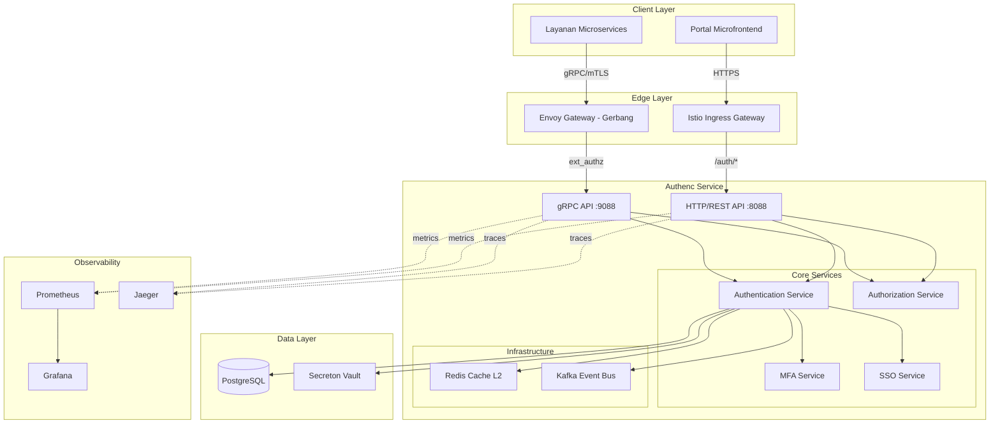

# Design Document: Authenc Comprehensive Optimization

## Overview

Dokumen ini menjelaskan desain teknis untuk optimalisasi menyeluruh sistem Authenc IAM di SIMPelv2. Optimalisasi ini mencakup peningkatan performa, arsitektur, keamanan, dan integrasi dengan ekosistem microservice/microfrontend yang ada.

### Goals

1. **Performance**: Mencapai P95 latency < 100ms untuk authentication requests
2. **Scalability**: Mendukung horizontal scaling dengan stateless design
3. **Security**: Implementasi defense-in-depth dengan modern cryptography
4. **Integration**: Seamless integration dengan Secreton, Portal, Layanan, dan Istio
5. **Observability**: Comprehensive monitoring dengan Prometheus, Grafana, dan Jaeger
6. **Reliability**: 99.9% uptime dengan zero-downtime deployment

### Non-Goals

- Rewrite complete codebase (incremental optimization)
- Breaking changes to existing APIs (backward compatibility)
- Migration dari PostgreSQL ke database lain
- Implementasi custom service mesh (menggunakan Istio)

## Architecture

### High-Level Architecture




### Component Architecture

#### 1. API Layer

**HTTP/REST API (Port 8088)**
- Axum web framework dengan tower middleware stack
- OpenAPI/Swagger documentation
- CORS, security headers, rate limiting
- JWT bearer token authentication
- Request/response logging dengan trace_id

**gRPC API (Port 9088)**
- Tonic framework dengan HTTP/2 multiplexing
- Protocol Buffers (authenc.proto)
- mTLS untuk inter-service communication
- gRPC interceptors untuk auth, logging, metrics
- Health check protocol (grpc.health.v1)

#### 2. Service Layer

**Authentication Service**
- User credential validation (Argon2 password hashing)
- JWT token generation dan validation (Ed25519 signing)
- Session management dengan Redis cache
- Brute force protection dengan rate limiting
- Anomaly detection untuk suspicious login patterns

**Authorization Service**
- RBAC (Role-Based Access Control)
- Satker hierarchy-aware permission checks
- Permission caching dengan Redis (TTL 5 minutes)
- Batch authorization untuk multiple resources
- Policy evaluation dengan context (user, resource, action)

**MFA Service**
- TOTP generation dan verification (RFC 6238)
- QR code generation untuk authenticator apps
- Backup codes dengan one-time use enforcement
- WebAuthn/FIDO2 support (future)
- MFA secret encryption via Secreton Transit Engine

**SSO Service**
- OIDC provider implementation
- SSO cookie management (AUTHENC_SSO)
- Session replication across instances
- Silent token refresh dengan iframe
- Federated authentication (Google, GitHub, SAML)

#### 3. Data Layer

**PostgreSQL Database**
- Connection pooling dengan deadpool-postgres (max 50 connections)
- Prepared statements untuk query caching
- Database indexes untuk performance
- Audit log tables dengan partitioning
- Migration management dengan refinery

**Redis Cache**
- Multi-layer caching (L1 in-memory, L2 Redis)
- Cache-aside pattern dengan automatic refresh
- TTL-based expiration (sessions: 1h, permissions: 5m)
- Cache invalidation via Kafka events
- Graceful fallback ke database saat cache unavailable

**Secreton Vault**
- MFA secret storage dengan encryption-at-rest
- Transit Engine untuk encryption-as-a-service
- Automatic key rotation (30 days)
- Secret versioning dan audit trail
- gRPC client dengan connection pooling

#### 4. Event System

**Kafka Event Bus**
- Event publishing untuk audit trail
- Event types: UserLogin, UserLogout, PermissionChange, MFAEnabled
- Event consumers: audit logger, analytics, notification
- Event retention: 7 days (configurable)
- Dead letter queue untuk failed events

#### 5. Observability

**Metrics (Prometheus)**
- Request latency histograms (P50, P95, P99)
- Request rate counters (per endpoint, per status code)
- Active sessions gauge
- Cache hit/miss ratio
- Database connection pool utilization

**Logging (Structured JSON)**
- Request/response logging dengan trace_id
- Error logging dengan stack traces
- Audit logging untuk compliance
- Log levels: ERROR, WARN, INFO, DEBUG, TRACE
- Log aggregation ke Elasticsearch (optional)

**Tracing (Jaeger)**
- Distributed tracing dengan OpenTelemetry
- Trace propagation via HTTP headers (x-request-id, x-b3-traceid)
- Span creation untuk database queries, cache operations, external calls
- Trace sampling (10% in production)


## Components and Interfaces

### 1. gRPC Service Implementation

**Proto Definition** (`infra/proto/authenc.proto`)
```protobuf
service AuthencService {
  rpc Authenticate(AuthenticateRequest) returns (AuthenticateResponse);
  rpc ValidateToken(ValidateTokenRequest) returns (ValidateTokenResponse);
  rpc CheckPermission(CheckPermissionRequest) returns (CheckPermissionResponse);
  rpc EnableMFA(EnableMFARequest) returns (EnableMFAResponse);
  rpc VerifyMFA(VerifyMFARequest) returns (VerifyMFAResponse);
  // ... other methods
}
```

**Implementation Structure**
```rust
// src/grpc/mod.rs
pub mod authenc_service;
pub mod interceptors;
pub mod health;

// src/grpc/authenc_service.rs
pub struct AuthencGrpcService {
    state: Arc<AppState>,
}

#[tonic::async_trait]
impl AuthencService for AuthencGrpcService {
    async fn authenticate(&self, request: Request<AuthenticateRequest>)
        -> Result<Response<AuthenticateResponse>, Status> {
        // Implementation
    }

    async fn validate_token(&self, request: Request<ValidateTokenRequest>)
        -> Result<Response<ValidateTokenResponse>, Status> {
        // Fast path: check cache first
        // Slow path: validate JWT signature
    }
}
```

**gRPC Interceptors**
```rust
// src/grpc/interceptors.rs
pub struct AuthInterceptor;
pub struct LoggingInterceptor;
pub struct MetricsInterceptor;

impl Interceptor for AuthInterceptor {
    fn call(&mut self, request: Request<()>) -> Result<Request<()>, Status> {
        // Extract and validate authorization header
        // Inject user context into request extensions
    }
}
```

### 2. Redis Cache Layer

**Cache Interface**
```rust
#[async_trait]
pub trait Cache: Send + Sync {
    async fn get(&self, key: &str) -> Result<Option<Value>>;
    async fn set(&self, key: &str, value: &Value, ttl: Duration) -> Result<()>;
    async fn delete(&self, key: &str) -> Result<()>;
    async fn exists(&self, key: &str) -> Result<bool>;
    async fn set_nx(&self, key: &str, value: &Value, ttl: Duration) -> Result<bool>;
}
```

**Multi-Layer Cache**
```rust
pub struct MultiLayerCache {
    l1: Arc<InMemoryCache>,  // Local cache (DashMap)
    l2: Arc<RedisCache>,     // Distributed cache
}

impl MultiLayerCache {
    pub async fn get(&self, key: &str) -> Result<Option<Value>> {
        // Try L1 first
        if let Some(value) = self.l1.get(key).await? {
            return Ok(Some(value));
        }

        // Try L2
        if let Some(value) = self.l2.get(key).await? {
            // Populate L1
            self.l1.set(key, &value, Duration::from_secs(60)).await?;
            return Ok(Some(value));
        }

        Ok(None)
    }
}
```

**Cache Keys Strategy**
```
session:{session_id}                    -> Session data (TTL: 1h)
user:{user_id}                          -> User profile (TTL: 5m)
permissions:{user_id}:{resource}        -> Permission cache (TTL: 5m)
mfa:{user_id}:secret                    -> MFA secret (TTL: 5m)
mfa:{user_id}:attempts                  -> Failed attempts counter (TTL: 15m)
token:{token_hash}                      -> Token validation result (TTL: 5m)
rate_limit:{ip}:{endpoint}              -> Rate limit counter (TTL: 1m)
```

### 3. Database Optimization

**Connection Pool Configuration**
```rust
pub struct DatabaseConfig {
    pub max_connections: u32,           // 50
    pub min_connections: u32,           // 10
    pub connection_timeout: Duration,   // 30s
    pub idle_timeout: Duration,         // 10m
    pub max_lifetime: Duration,         // 30m
}
```

**Prepared Statements Cache**
```rust
pub struct PreparedStatementCache {
    cache: DashMap<String, Statement>,
}

impl PreparedStatementCache {
    pub async fn get_or_prepare(&self, client: &Client, sql: &str)
        -> Result<Statement> {
        if let Some(stmt) = self.cache.get(sql) {
            return Ok(stmt.clone());
        }

        let stmt = client.prepare(sql).await?;
        self.cache.insert(sql.to_string(), stmt.clone());
        Ok(stmt)
    }
}
```

**Query Optimization**
```sql
-- Add indexes for frequently queried columns
CREATE INDEX CONCURRENTLY idx_users_email ON users(email);
CREATE INDEX CONCURRENTLY idx_users_username ON users(username);
CREATE INDEX CONCURRENTLY idx_sessions_user_id ON sessions(user_id);
CREATE INDEX CONCURRENTLY idx_sessions_expires_at ON sessions(expires_at);
CREATE INDEX CONCURRENTLY idx_audit_logs_user_id_timestamp ON audit_logs(user_id, timestamp);
CREATE INDEX CONCURRENTLY idx_permissions_user_id_resource ON permissions(user_id, resource);

-- Partitioning for audit logs
CREATE TABLE audit_logs_2024_01 PARTITION OF audit_logs
    FOR VALUES FROM ('2024-01-01') TO ('2024-02-01');
```

### 4. Secreton Integration

**Secreton
```rust
pub struct SecretonClient {
    grpc_client: SecretonServiceClient<Channel>,
    endpoint: String,
    token: String,
}

impl SecretonClient {
    pub async fn store_mfa_secret(&self, user_id: &str, secret: &str)
        -> Result<String> {
        let request = StoreSecretRequest {
            path: format!("mfa/{}", user_id),
            data: [("secret".to_string(), secret.to_string())].into(),
            security_level: SecurityLevel::Confidential as i32,
            ttl_seconds: None, // No expiration
            ..Default::default()
        };

        let response = self.grpc_client.store_secret(request).await?;
        Ok(response.into_inner().id)
    }

    pub async fn encrypt(&self, key_name: &str, plaintext: &[u8])
        -> Result<String> {
        let request = EncryptRequest {
            key_name: key_name.to_string(),
            plaintext: plaintext.to_vec(),
            context: None,
        };

        let response = self.grpc_client.encrypt(request).await?;
        Ok(response.into_inner().ciphertext)
    }
}
```

### 5. Event System

**Event Publisher**
```rust
pub struct EventPublisher {
    kafka_producer: FutureProducer,
    topic: String,
}

impl EventPublisher {
    pub async fn publish_auth_event(&self, event: AuthEvent) -> Result<()> {
        let payload = serde_json::to_vec(&event)?;
        let record = FutureRecord::to(&self.topic)
            .key(&event.user_id)
            .payload(&payload);

        self.kafka_producer.send(record, Duration::from_secs(5)).await?;
        Ok(())
    }
}

#[derive(Serialize, Deserialize)]
pub struct AuthEvent {
    pub event_type: AuthEventType,
    pub user_id: String,
    pub timestamp: DateTime<Utc>,
    pub ip_address: String,
    pub user_agent: String,
    pub metadata: HashMap<String, String>,
}

pub enum AuthEventType {
    UserLogin,
    UserLogout,
    MFAEnabled,
    MFADisabled,
    PermissionGranted,
    PermissionRevoked,
}
```


## Data Models

### 1. Core Entities

**User Model**
```rust
#[derive(Debug, Clone, Serialize, Deserialize)]
pub struct User {
    pub id: Uuid,
    pub username: String,
    pub email: String,
    pub password_hash: String,  // Argon2
    pub full_name: Option<String>,
    pub is_active: bool,
    pub mfa_enabled: bool,
    pub satker_code: String,
    pub roles: Vec<String>,
    pub created_at: DateTime<Utc>,
    pub updated_at: DateTime<Utc>,
    pub last_login: Option<DateTime<Utc>>,
}
```

**Session Model**
```rust
#[derive(Debug, Clone, Serialize, Deserialize)]
pub struct Session {
    pub id: Uuid,
    pub user_id: Uuid,
    pub access_token: String,
    pub refresh_token: String,
    pub expires_at: DateTime<Utc>,
    pub ip_address: String,
    pub user_agent: String,
    pub created_at: DateTime<Utc>,
}
```

**Permission Model**
```rust
#[derive(Debug, Clone, Serialize, Deserialize)]
pub struct Permission {
    pub id: Uuid,
    pub user_id: Uuid,
    pub resource: String,
    pub action: String,
    pub scope: PermissionScope,
    pub granted_at: DateTime<Utc>,
    pub granted_by: Uuid,
}

pub enum PermissionScope {
    Global,
    Satker(String),
    Resource(String),
}
```

**MFA Secret Model**
```rust
#[derive(Debug, Clone)]
pub struct MfaSecret {
    pub user_id: Uuid,
    pub secret_id: String,  // Secreton secret ID
    pub backup_codes: Vec<String>,  // Hashed
    pub enabled_at: DateTime<Utc>,
}
```

### 2. Cache Models

**Session Cache Entry**
```rust
#[derive(Debug, Clone, Serialize, Deserialize)]
pub struct SessionCacheEntry {
    pub user_id: Uuid,
    pub username: String,
    pub roles: Vec<String>,
    pub satker_code: String,
    pub expires_at: i64,  // Unix timestamp
}
```

**Permission Cache Entry**
```rust
#[derive(Debug, Clone, Serialize, Deserialize)]
pub struct PermissionCacheEntry {
    pub allowed: bool,
    pub reason: Option<String>,
    pub cached_at: i64,
}
```

### 3. Event Models

**Audit Log**
```rust
#[derive(Debug, Clone, Serialize, Deserialize)]
pub struct AuditLog {
    pub id: Uuid,
    pub event_type: AuditEventType,
    pub user_id: Option<Uuid>,
    pub action: String,
    pub resource: String,
    pub success: bool,
    pub ip_address: String,
    pub user_agent: String,
    pub timestamp: DateTime<Utc>,
    pub metadata: serde_json::Value,
}

pub enum AuditEventType {
    Authentication,
    Authorization,
    AdminAction,
    MfaOperation,
    SessionManagement,
}
```

## Error Handling

### Error Types

```rust
#[derive(Error, Debug)]
pub enum AuthencError {
    // Authentication errors
    #[error("Authentication failed")]
    AuthenticationFailed,

    #[error("Invalid credentials")]
    InvalidCredentials,

    #[error("Token expired")]
    TokenExpired,

    #[error("MFA verification required")]
    MfaVerificationRequired,

    // Authorization errors
    #[error("Access denied: {reason}")]
    AccessDenied { reason: String },

    #[error("Insufficient permissions")]
    InsufficientPermissions,

    // System errors
    #[error("Database error: {0}")]
    DatabaseError(#[from] tokio_postgres::Error),

    #[error("Cache error: {0}")]
    CacheError(String),

    #[error("Secreton error: {0}")]
    SecretonError(String),

    #[error("Rate limit exceeded")]
    RateLimitExceeded,

    // gRPC errors
    #[error("gRPC error: {0}")]
    GrpcError(#[from] tonic::Status),
}

impl From<AuthencError> for tonic::Status {
    fn from(err: AuthencError) -> Self {
        match err {
            AuthencError::AuthenticationFailed => {
                Status::unauthenticated("Authentication failed")
            }
            AuthencError::AccessDenied { reason } => {
                Status::permission_denied(reason)
            }
            AuthencError::RateLimitExceeded => {
                Status::resource_exhausted("Rate limit exceeded")
            }
            _ => Status::internal("Internal server error"),
        }
    }
}
```

### Error Response Format

**HTTP REST**
```json
{
  "error": {
    "code": "AUTH_FAILED",
    "message": "Authentication failed",
    "details": {
      "reason": "Invalid password",
      "attempts_remaining": 3
    },
    "trace_id": "550e8400-e29b-41d4-a716-446655440000"
  }
}
```

**gRPC**
```protobuf
message ErrorDetails {
  string code = 1;
  string message = 2;
  map<string, string> details = 3;
  string trace_id = 4;
}
```

## Testing Strategy

### 1. Unit Tests

**Coverage Target**: 70% for core business logic

```rust
#[cfg(test)]
mod tests {
    use super::*;

    #[tokio::test]
    async fn test_authenticate_valid_credentials() {
        let auth_service = create_test_auth_service().await;
        let result = auth_service.authenticate("user", "password").await;
        assert!(result.is_ok());
    }

    #[tokio::test]
    async fn test_authenticate_invalid_credentials() {
        let auth_service = create_test_auth_service().await;
        let result = auth_service.authenticate("user", "wrong").await;
        assert!(matches!(result, Err(AuthencError::InvalidCredentials)));
    }

    #[tokio::test]
    async fn test_rate_limiting() {
        let auth_service = create_test_auth_service().await;

        // Exceed rate limit
        for _ in 0..10 {
            let _ = auth_service.authenticate("user", "wrong").await;
        }

        let result = auth_service.authenticate("user", "password").await;
        assert!(matches!(result, Err(AuthencError::RateLimitExceeded)));
    }
}
```

### 2. Integration Tests

**Database Integration**
```rust
#[tokio::test]
async fn test_user_crud_operations() {
    let db = create_test_database().await;
    let user_store = UserStore::new(db);

    // Create
    let user = user_store.create_user(CreateUserRequest {
        username: "test".to_string(),
        email: "test@example.com".to_string(),
        password: "password".to_string(),
    }).await.unwrap();

    // Read
    let fetched = user_store.get_user(&user.id).await.unwrap();
    assert_eq!(fetched.username, "test");

    // Update
    user_store.update_user(&user.id, UpdateUserRequest {
        email: Some("new@example.com".to_string()),
        ..Default::default()
    }).await.unwrap();

    // Delete
    user_store.delete_user(&user.id).await.unwrap();
}
```

**gRPC Integration**
```rust
#[tokio::test]
async fn test_grpc_authenticate() {
    let server = start_test_grpc_server().await;
    let mut client = AuthencServiceClient::connect(server.addr()).await.unwrap();

    let request = AuthenticateRequest {
        username: "test".to_string(),
        password: "password".to_string(),
        ..Default::default()
    };

    let response = client.authenticate(request).await.unwrap();
    assert!(!response.into_inner().access_token.is_empty());
}
```

### 3. Load Tests

**Criterion Benchmarks**
```rust
fn benchmark_authenticate(c: &mut Criterion) {
    let rt = tokio::runtime::Runtime::new().unwrap();
    let auth_service = rt.block_on(create_test_auth_service());

    c.bench_function("authenticate", |b| {
        b.to_async(&rt).iter(|| async {
            auth_service.authenticate("user", "password").await
        });
    });
}

criterion_group!(benches, benchmark_authenticate);
criterion_main!(benches);
```

**K6 Load Test**
```javascript
import grpc from 'k6/net/grpc';
import { check } from 'k6';

const client = new grpc.Client();
client.load(['../proto'], 'authenc.proto');

export default () => {
  client.connect('localhost:9088', { plaintext: true });

  const response = client.invoke('authenc.v1.AuthencService/Authenticate', {
    username: 'test',
    password: 'password',
  });

  check(response, {
    'status is OK': (r) => r && r.status === grpc.StatusOK,
    'response time < 100ms': (r) => r && r.timings.duration < 100,
  });

  client.close();
};
```

### 4. Security Tests

**Penetration Testing**
- SQL injection attempts
- JWT token manipulation
- Rate limit bypass attempts
- Session fixation attacks
- CSRF attacks
- XSS attacks (for admin UI)

**Compliance Testing**
- OWASP Top 10 validation
- ISO 27001 controls verification
- GDPR compliance checks
- Audit trail completeness


## Performance Optimization

### 1. Caching Strategy

**Cache Hierarchy**
```
L1: In-Memory (DashMap)
├── TTL: 60 seconds
├── Size: 10,000 entries
└── Eviction: LRU

L2: Redis
├── TTL: Configurable per key type
├── Size: Unlimited (managed by Redis)
└── Eviction: allkeys-lru

L3: PostgreSQL
└── Source of truth
```

**Cache Warming**
```rust
pub async fn warm_cache(&self) -> Result<()> {
    // Pre-load frequently accessed data
    let active_users = self.db.get_active_users(1000).await?;

    for user in active_users {
        let key = format!("user:{}", user.id);
        self.cache.set(&key, &user, Duration::from_secs(300)).await?;
    }

    tracing::info!("Cache warmed with {} users", active_users.len());
    Ok(())
}
```

### 2. Database Optimization

**Query Optimization**
```rust
// Bad: N+1 query problem
for user_id in user_ids {
    let permissions = db.get_permissions(user_id).await?;
}

// Good: Batch query
let permissions = db.get_permissions_batch(&user_ids).await?;
```

**Prepared Statements**
```rust
pub struct UserStore {
    get_user_stmt: Statement,
    create_user_stmt: Statement,
    update_user_stmt: Statement,
}

impl UserStore {
    pub async fn new(db: &Database) -> Result<Self> {
        let client = db.get_client().await?;

        Ok(Self {
            get_user_stmt: client.prepare(
                "SELECT * FROM users WHERE id = $1"
            ).await?,
            create_user_stmt: client.prepare(
                "INSERT INTO users (username, email, password_hash) VALUES ($1, $2, $3) RETURNING *"
            ).await?,
            update_user_stmt: client.prepare(
                "UPDATE users SET email = $1, updated_at = NOW() WHERE id = $2"
            ).await?,
        })
    }
}
```

### 3. Async Optimization

**Concurrent Operations**
```rust
pub async fn validate_and_authorize(&self, token: &str, resource: &str)
    -> Result<bool> {
    // Run validation and authorization concurrently
    let (user, permissions) = tokio::try_join!(
        self.validate_token(token),
        self.get_permissions(resource)
    )?;

    Ok(permissions.contains(&user.id))
}
```

**Batch Processing**
```rust
pub async fn process_audit_logs_batch(&self, logs: Vec<AuditLog>)
    -> Result<()> {
    const BATCH_SIZE: usize = 1000;

    for chunk in logs.chunks(BATCH_SIZE) {
        self.db.insert_audit_logs_batch(chunk).await?;
    }

    Ok(())
}
```

### 4. Resource Management

**Connection Pooling**
```rust
pub struct DatabasePool {
    pool: deadpool_postgres::Pool,
    metrics: Arc<PoolMetrics>,
}

impl DatabasePool {
    pub async fn get_connection(&self) -> Result<PooledConnection> {
        let start = Instant::now();
        let conn = self.pool.get().await?;

        self.metrics.record_acquisition_time(start.elapsed());
        self.metrics.increment_active_connections();

        Ok(conn)
    }
}
```

**Memory Management**
```rust
// Use Arc for shared state
pub struct AppState {
    pub config: Arc<AppConfig>,
    pub db: Arc<Database>,
    pub cache: Arc<RedisCache>,
}

// Avoid unnecessary cloning
pub async fn handle_request(state: Arc<AppState>) -> Result<Response> {
    // state is already Arc, no need to clone
    let user = state.db.get_user(&user_id).await?;
    Ok(Response::new(user))
}
```

## Security Hardening

### 1. Cryptography

**Password Hashing**
```rust
use argon2::{Argon2, PasswordHash, PasswordHasher, PasswordVerifier};
use argon2::password_hash::SaltString;

pub fn hash_password(password: &str) -> Result<String> {
    let salt = SaltString::generate(&mut OsRng);
    let argon2 = Argon2::default();

    let password_hash = argon2.hash_password(password.as_bytes(), &salt)?
        .to_string();

    Ok(password_hash)
}

pub fn verify_password(password: &str, hash: &str) -> Result<bool> {
    let parsed_hash = PasswordHash::new(hash)?;
    let argon2 = Argon2::default();

    Ok(argon2.verify_password(password.as_bytes(), &parsed_hash).is_ok())
}
```

**JWT Signing (Ed25519)**
```rust
use ed25519_dalek::{Keypair, Signature, Signer, Verifier};

pub struct JwtSigner {
    keypair: Keypair,
}

impl JwtSigner {
    pub fn sign(&self, payload: &[u8]) -> Signature {
        self.keypair.sign(payload)
    }

    pub fn verify(&self, payload: &[u8], signature: &Signature) -> bool {
        self.keypair.verify(payload, signature).is_ok()
    }
}
```

**MFA Secret Encryption**
```rust
pub async fn encrypt_mfa_secret(&self, user_id: &str, secret: &str)
    -> Result<String> {
    // Use Secreton Transit Engine
    let ciphertext = self.secreton_client
        .encrypt("mfa-encryption-key", secret.as_bytes())
        .await?;

    Ok(ciphertext)
}
```

### 2. Rate Limiting

**Adaptive Rate Limiting**
```rust
pub struct AdaptiveRateLimiter {
    limits: DashMap<String, RateLimit>,
    threat_level: Arc<AtomicU8>,
}

impl AdaptiveRateLimiter {
    pub async fn check_rate_limit(&self, key: &str) -> Result<bool> {
        let threat_level = self.threat_level.load(Ordering::Relaxed);

        let limit = match threat_level {
            0..=2 => 100,  // Normal
            3..=5 => 50,   // Elevated
            6..=8 => 20,   // High
            _ => 5,        // Critical
        };

        let mut rate_limit = self.limits.entry(key.to_string())
            .or_insert_with(|| RateLimit::new(limit, Duration::from_secs(60)));

        rate_limit.check()
    }
}
```

### 3. Input Validation

**Request Validation**
```rust
use garde::Validate;

#[derive(Debug, Validate, Deserialize)]
pub struct AuthenticateRequest {
    #[garde(length(min = 3, max = 50))]
    pub username: String,

    #[garde(length(min = 8, max = 128))]
    pub password: String,

    #[garde(length(min = 6, max = 6))]
    pub mfa_code: Option<String>,
}

pub async fn authenticate(
    Json(request): Json<AuthenticateRequest>
) -> Result<Json<AuthenticateResponse>> {
    request.validate()?;

    // Process authentication
}
```

## Deployment Strategy

### 1. Kubernetes Deployment

**Deployment Manifest**
```yaml
apiVersion: apps/v1
kind: Deployment
metadata:
  name: authenc
  namespace: simpelv2-infra
spec:
  replicas: 3
  strategy:
    type: RollingUpdate
    rollingUpdate:
      maxSurge: 1
      maxUnavailable: 0
  selector:
    matchLabels:
      app: authenc
  template:
    metadata:
      labels:
        app: authenc
        version: v1
      annotations:
        prometheus.io/scrape: "true"
        prometheus.io/port: "9090"
    spec:
      containers:
      - name: authenc
        image: registry.kejaksaan.go.id/simpelv2/authenc:latest
        ports:
        - containerPort: 8088
          name: http
        - containerPort: 9088
          name: grpc
        - containerPort: 9090
          name: metrics
        env:
        - name: DATABASE_URL
          valueFrom:
            secretKeyRef:
              name: authenc-secrets
              key: database-url
        - name: REDIS_URL
          valueFrom:
            configMapKeyRef:
              name: authenc-config
              key: redis-url
        - name: SECRETON_ENDPOINT
          value: "secreton-service.simpelv2-infra.svc.cluster.local:9000"
        resources:
          requests:
            memory: "512Mi"
            cpu: "250m"
          limits:
            memory: "2Gi"
            cpu: "1"
        livenessProbe:
          grpc:
            port: 9088
          initialDelaySeconds: 30
          periodSeconds: 10
        readinessProbe:
          grpc:
            port: 9088
          initialDelaySeconds: 10
          periodSeconds: 5
        lifecycle:
          preStop:
            exec:
              command: ["/bin/sh", "-c", "sleep 15"]
```

### 2. Istio Integration

**VirtualService**
```yaml
apiVersion: networking.istio.io/v1beta1
kind: VirtualService
metadata:
  name: authenc
  namespace: simpelv2-infra
spec:
  hosts:
  - authenc-service
  http:
  - match:
    - uri:
        prefix: /auth/
    route:
    - destination:
        host: authenc-service
        port:
          number: 8088
    timeout: 30s
    retries:
      attempts: 3
      perTryTimeout: 10s
```

**DestinationRule**
```yaml
apiVersion: networking.istio.io/v1beta1
kind: DestinationRule
metadata:
  name: authenc
  namespace: simpelv2-infra
spec:
  host: authenc-service
  trafficPolicy:
    connectionPool:
      tcp:
        maxConnections: 100
      http:
        http1MaxPendingRequests: 50
        http2MaxRequests: 100
    loadBalancer:
      simple: LEAST_REQUEST
    outlierDetection:
      consecutiveErrors: 5
      interval: 30s
      baseEjectionTime: 30s
```

### 3. Monitoring

**Prometheus ServiceMonitor**
```yaml
apiVersion: monitoring.coreos.com/v1
kind: ServiceMonitor
metadata:
  name: authenc
  namespace: simpelv2-monitoring
spec:
  selector:
    matchLabels:
      app: authenc
  endpoints:
  - port: metrics
    interval: 30s
    path: /metrics
```

**Grafana Dashboard**
```json
{
  "dashboard": {
    "title": "Authenc Metrics",
    "panels": [
      {
        "title": "Request Rate",
        "targets": [
          {
            "expr": "rate(authenc_requests_total[5m])"
          }
        ]
      },
      {
        "title": "P95 Latency",
        "targets": [
          {
            "expr": "histogram_quantile(0.95, rate(authenc_request_duration_seconds_bucket[5m]))"
          }
        ]
      },
      {
        "title": "Error Rate",
        "targets": [
          {
            "expr": "rate(authenc_errors_total[5m])"
          }
        ]
      }
    ]
  }
}
```

## Migration Plan

### Phase 1: Foundation (Week 1-2)
- Setup gRPC service with tonic
- Implement basic authentication endpoints
- Add Redis cache layer
- Setup Prometheus metrics

### Phase 2: Integration (Week 3-4)
- Integrate with Secreton for MFA secrets
- Implement Kafka event publishing
- Add Istio service mesh configuration
- Setup distributed tracing

### Phase 3: Optimization (Week 5-6)
- Database query optimization
- Connection pool tuning
- Cache strategy refinement
- Load testing and benchmarking

### Phase 4: Production (Week 7-8)
- Security hardening
- Compliance validation
- Documentation
- Production deployment

## Risks and Mitigation

### Risk 1: Performance Degradation
**Mitigation**: Comprehensive load testing, gradual rollout, rollback plan

### Risk 2: Cache Inconsistency
**Mitigation**: Cache invalidation strategy, TTL tuning, monitoring

### Risk 3: Secreton Dependency
**Mitigation**: Fallback to local encryption, circuit breaker, retry logic

### Risk 4: Database Migration Issues
**Mitigation**: Backward-compatible changes, dry-run testing, rollback scripts

### Risk 5: Breaking Changes
**Mitigation**: API versioning, deprecation notices, backward compatibility

