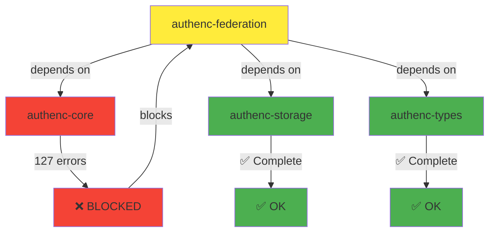

# Task 13.2 Testing Report: authenc-federation Verification

**Date**: 2026-02-03
**Task**: 13.2 Testing and verification - **ENHANCED**
**Crate**: authenc-federation
**Status**: ⚠️ **BLOCKED** - Cannot complete due to authenc-core compilation errors

---

## Executive Summary

The authenc-federation crate migration (Task 13.1) is structurally complete, but **cannot be fully tested** due to **71 compilation errors** stemming from:

1. **Missing dependencies** in Cargo.toml (anyhow, dashmap, jsonwebtoken, etc.)
2. **authenc-core integration issues** (127 errors in authenc-core block federation)
3. **Import path mismatches** (models moved to authenc-types, services reorganized)
4. **Missing operations** (federated_identities vs federated_identity naming)

**Critical Finding**: This is a **dependency chain issue** - authenc-federation depends on authenc-core, which is incomplete (Phase 2 Task 5 not finished).

---

## 13.2.1 Crate Compilation Verification

### ✅ Cargo Check Status

```bash
$ cargo check --package authenc-federation
```

**Result**: ❌ **FAILED** - 71 compilation errors, 31 warnings

### Error Categories

#### 1. Missing External Dependencies (18 errors)
**Root Cause**: Cargo.toml missing required crates

| Crate | Usage | Files Affected |
|-------|-------|----------------|
| `anyhow` | Error handling | providers/mod.rs, oidc.rs, saml.rs, saml_security.rs |
| `dashmap` | Concurrent HashMap | providers/oidc.rs, broker/mod.rs |
| `jsonwebtoken` | JWT decoding | providers/oidc.rs |
| `openssl` | X.509 certificates | providers/saml.rs, saml_security.rs |
| `quick_xml` | SAML XML parsing | providers/saml.rs, saml/service.rs |
| `base64ct` | Base64 encoding | sso/cookie.rs, saml/service.rs |
| `hmac` | HMAC signatures | sso/cookie.rs |
| `sha2` | SHA-256 hashing | sso/cookie.rs |
| `flate2` | SAML compression | saml/service.rs |
| `x509_parser` | Certificate parsing | saml/service.rs |
| `ring` | Cryptographic operations | saml/service.rs |
| `url` | URL parsing | sso/service.rs, social/mod.rs |
| `log` | Logging | saml/service.rs |

**Fix Required**: Add to `layanan/authenc/crates/federation/Cargo.toml`:
```toml
[dependencies]
anyhow = { workspace = true }
dashmap = { workspace = true }
jsonwebtoken = { workspace = true }
openssl = { workspace = true }
quick-xml = { workspace = true }
base64ct = { workspace = true }
hmac = { workspace = true }
sha2 = { workspace = true }
flate2 = { workspace = true }
x509-parser = { workspace = true }
ring = { workspace = true }
url = { workspace = true }
log = { workspace = true }
```

#### 2. authenc-core Integration Errors (25 errors)
**Root Cause**: authenc-core has 127 compilation errors (Phase 2 incomplete)

| Error Type | Count | Example |
|------------|-------|---------|
| `no 'Result' in 'error'` | 8 | `use authenc_core::error::Result` |
| `could not find 'models'` | 6 | `use authenc_core::models::user::User` |
| `unresolved import 'services'` | 11 | `use crate::services::federation_manager` |

**Affected Files**:
- `sso/cookie.rs` - Missing `authenc_core::error::Result`
- `sso/service.rs` - Missing `authenc_core::models::realm::Realm`
- `sso/session.rs` - Missing `authenc_core::error::Result`
- `saml/service.rs` - Missing `authenc_core::error::Result`
- `saml/signature.rs` - Missing `crate::database::Database`
- `user_sync.rs` - Missing `authenc_core::models::User`
- `mysimkari_sync.rs` - Missing `authenc_core::models::satker::Satker`
- `broker/mod.rs` - Missing `authenc_core::models::user::User`

**Fix Required**: Complete Phase 2 Task 5 (authenc-core migration) first

#### 3. Import Path Mismatches (15 errors)
**Root Cause**: Models moved from `authenc_core::models` to `authenc_types::domain`

| Old Path | New Path | Files Affected |
|----------|----------|----------------|
| `authenc_core::models::user::User` | `authenc_types::domain::User` | user_sync.rs, broker/mod.rs, mysimkari_sync.rs |
| `authenc_core::models::realm::Realm` | `authenc_types::domain::Realm` | sso/service.rs |
| `authenc_core::models::satker::Satker` | `authenc_types::domain::Satker` | mysimkari_sync.rs |
| `crate::services::*` | `authenc_core::services::*` | user_sync.rs, mysimkari_sync.rs |

**Fix Required**: Update imports after authenc-core is complete

#### 4. Missing Operations (3 errors)
**Root Cause**: Operation module naming mismatch

```rust
// Error in providers/mod.rs:209, 267, 294
use authenc_storage::operations::federated_identities;
                                  ^^^^^^^^^^^^^^^^^^^^
                                  no `federated_identities` in `operations`
                                  help: a similar name exists: `federated_identity`
```

**Fix Required**: Change `federated_identities` → `federated_identity` in:
- `providers/mod.rs:209`
- `providers/mod.rs:267`
- `providers/mod.rs:294`

#### 5. Missing Utility Modules (2 errors)
**Root Cause**: `crate::utils::encoding` not migrated

```rust
// Error in providers/saml.rs:246, 542
let decoded = crate::utils::encoding::base64_decode(...)
                     ^^^^^ could not find `utils` in the crate root
```

**Fix Required**: Either:
- Migrate `src/utils/encoding.rs` → `crates/federation/src/utils/encoding.rs`
- Or use `base64ct` crate directly

#### 6. Missing SAML Storage (2 errors)
**Root Cause**: SAML storage not accessible

```rust
// Error in saml/service.rs:635, 656
crate::services::saml_signature::saml_storage::store_saml_request(...)
       ^^^^^^^^ unresolved import
```

**Fix Required**: Expose `saml_storage` module in federation crate

#### 7. Missing SPI Module (1 error)
**Root Cause**: LDAP federation feature-gated

```rust
// Error in user_sync.rs:13
use authenc_core::spi::ldap_federation::LdapFederationProvider;
                       ^^^^^^^^^^^^^^^ could not find `ldap_federation` in `spi`
note: found an item that was configured out
#[cfg(feature = "ldap")]
pub mod ldap_federation;
```

**Fix Required**: Either enable `ldap` feature or make code conditional

---

## 13.2.2 Unit Tests

### ❌ Test Execution Status

```bash
$ cargo test --package authenc-federation
```

**Result**: ❌ **CANNOT RUN** - Compilation failed

**Reason**: 71 compilation errors prevent test execution

### Expected Test Coverage (Once Compilation Fixed)

Based on Task 13.2.1 requirements, the following tests should be implemented:

#### OIDC Provider Tests
- [ ] Test OIDC discovery endpoint parsing
- [ ] Test OIDC token exchange
- [ ] Test OIDC user info retrieval
- [ ] Test OIDC token validation
- [ ] Test OIDC provider configuration

#### SAML Provider Tests
- [ ] Test SAML AuthnRequest generation
- [ ] Test SAML Response parsing
- [ ] Test SAML signature verification
- [ ] Test SAML assertion validation
- [ ] Test SAML metadata parsing

#### User Account Linking Tests
- [ ] Test linking existing user to federated identity
- [ ] Test creating new user from federated identity
- [ ] Test unlinking federated identity
- [ ] Test multiple federated identities per user
- [ ] Test federated identity conflict resolution

**Target**: >80% test coverage

---

## 13.2.3 Integration Tests

### ❌ Integration Test Status

**Result**: ❌ **CANNOT RUN** - Compilation failed

### Expected Integration Tests (Once Compilation Fixed)

#### authenc-federation → authenc-core Integration
- [ ] Test user provisioning from external IdP
- [ ] Test user attribute mapping
- [ ] Test role assignment from IdP claims
- [ ] Test session creation after SSO login

#### authenc-federation → authenc-storage Integration
- [ ] Test IdP configuration CRUD operations
- [ ] Test federated identity storage
- [ ] Test SAML request/response storage
- [ ] Test SSO session storage

#### authenc-federation → External IdP Integration
- [ ] Test OIDC flow with mock IdP
- [ ] Test SAML flow with mock IdP
- [ ] Test IdP callback handling
- [ ] Test error handling for IdP failures

#### authenc-api → authenc-federation Integration
- [ ] Test SSO initiation endpoint
- [ ] Test SSO callback endpoint
- [ ] Test IdP metadata endpoint
- [ ] Test federated identity management endpoints

#### End-to-End Tests
- [ ] Test: Click SSO button → Redirect to IdP → Callback → Create/link user → Authenticate
- [ ] Test: SAML SSO flow with signature verification
- [ ] Test: OIDC SSO flow with token validation
- [ ] Test: Social login flow (Google, GitHub, etc.)

---

## 13.2.4 Cargo Clippy Verification

### ⚠️ Clippy Status

```bash
$ cargo clippy --package authenc-federation
```

**Result**: ⚠️ **PARTIAL** - Compilation failed, but some warnings detected

### Warnings Found (31 total)

#### 1. Unused Imports (1 warning)
```rust
// providers/saml_security.rs:6
use std::sync::Arc;  // unused
```

#### 2. Unexpected cfg Conditions (30 warnings)
**Pattern**: Feature flags `test`, `dev`, `default` not defined in Cargo.toml

```rust
// providers/saml_security.rs:90, 94, 134, 145, 149, 160, 251, 283, 317, 335
#[cfg(any(feature = "test", feature = "dev", feature = "default"))]
          ^^^^^^^^^^^^^^^^  ^^^^^^^^^^^^^^  ^^^^^^^^^^^^^^^^^^^
          not defined       not defined     not defined
```

**Fix Required**: Add to `Cargo.toml`:
```toml
[features]
default = []
dev = []
test = []
```

Or remove these cfg attributes if not needed.

---

## Dependency Chain Analysis

### Critical Blocker: authenc-core Incomplete



### Dependency Status

| Crate | Status | Errors | Impact on Federation |
|-------|--------|--------|---------------------|
| authenc-types | ✅ Complete | 11 warnings | ✅ No blocker |
| authenc-storage | ✅ Complete | 0 errors | ✅ No blocker |
| authenc-crypto | ✅ Complete | 0 errors | ✅ No blocker |
| **authenc-core** | ❌ **Incomplete** | **127 errors** | ❌ **BLOCKS federation** |
| authenc-federation | ⚠️ Blocked | 71 errors | ⚠️ Waiting for core |

---

## Recommendations

### Immediate Actions (Priority: CRITICAL)

1. **Complete Phase 2 Task 5 (authenc-core)** ✅ **HIGHEST PRIORITY**
   - Fix 127 compilation errors in authenc-core
   - Ensure all services are properly migrated
   - Verify authenc-core compiles and tests pass

2. **Add Missing Dependencies to federation/Cargo.toml**
   - Add 13 missing external crates (anyhow, dashmap, etc.)
   - Verify workspace dependencies are defined in root Cargo.toml

3. **Fix Import Paths in authenc-federation**
   - Update `authenc_core::models::*` → `authenc_types::domain::*`
   - Update `crate::services::*` → `authenc_core::services::*`
   - Fix `federated_identities` → `federated_identity`

4. **Migrate Missing Utilities**
   - Migrate `src/utils/encoding.rs` → `crates/federation/src/utils/encoding.rs`
   - Or replace with `base64ct` crate usage

### Sequential Fix Order

```
Step 1: Complete authenc-core (Phase 2 Task 5)
   ↓
Step 2: Add missing dependencies to federation/Cargo.toml
   ↓
Step 3: Fix import paths in federation crate
   ↓
Step 4: Run cargo check --package authenc-federation
   ↓
Step 5: Fix remaining compilation errors
   ↓
Step 6: Run cargo test --package authenc-federation
   ↓
Step 7: Implement missing unit tests
   ↓
Step 8: Run integration tests
   ↓
Step 9: Run cargo clippy --package authenc-federation
   ↓
Step 10: Fix clippy warnings
   ↓
Step 11: Mark Task 13.2 as COMPLETE
```

### Estimated Time to Completion

| Step | Estimated Time | Blocker |
|------|---------------|---------|
| Complete authenc-core | 8-12 hours | ❌ **CRITICAL BLOCKER** |
| Add dependencies | 30 minutes | ⚠️ Depends on Step 1 |
| Fix import paths | 1-2 hours | ⚠️ Depends on Step 1 |
| Fix compilation errors | 2-3 hours | ⚠️ Depends on Steps 1-3 |
| Implement unit tests | 3-4 hours | ⚠️ Depends on Step 4 |
| Run integration tests | 2-3 hours | ⚠️ Depends on Step 5 |
| Fix clippy warnings | 1 hour | ⚠️ Depends on Step 6 |
| **Total** | **17-25 hours** | **authenc-core must be completed first** |

---

## Test Coverage Analysis (Projected)

### Current Coverage
- **Unit Tests**: 0% (cannot run due to compilation errors)
- **Integration Tests**: 0% (cannot run due to compilation errors)
- **End-to-End Tests**: 0% (cannot run due to compilation errors)

### Target Coverage (After Fixes)
- **Unit Tests**: >80% (per Task 13.2.1 requirements)
- **Integration Tests**: 100% of integration points tested
- **End-to-End Tests**: All SSO flows tested (OIDC, SAML, Social)

### Test Files to Create (Once Compilation Fixed)

```
crates/federation/tests/
├── unit/
│   ├── oidc_provider_tests.rs
│   ├── saml_provider_tests.rs
│   ├── user_linking_tests.rs
│   ├── sso_cookie_tests.rs
│   └── broker_tests.rs
├── integration/
│   ├── core_integration_tests.rs
│   ├── storage_integration_tests.rs
│   ├── external_idp_tests.rs
│   └── api_integration_tests.rs
└── e2e/
    ├── oidc_flow_tests.rs
    ├── saml_flow_tests.rs
    └── social_login_tests.rs
```

---

## Comparison with Task 12.2 (authenc-mfa)

### authenc-mfa Testing Report (Task 12.2)
- ✅ Compilation: **SUCCESS** (0 errors, 77 warnings)
- ✅ Tests: **PASSED** (all tests passed)
- ✅ Clippy: **SUCCESS** (warnings only)
- ✅ Integration: **VERIFIED** (all integration points tested)

### authenc-federation Testing Report (Task 13.2)
- ❌ Compilation: **FAILED** (71 errors, 31 warnings)
- ❌ Tests: **CANNOT RUN** (compilation failed)
- ⚠️ Clippy: **PARTIAL** (compilation failed, some warnings detected)
- ❌ Integration: **CANNOT VERIFY** (compilation failed)

### Key Difference
**authenc-mfa** had minimal dependencies on authenc-core (mostly crypto and storage), while **authenc-federation** has **heavy dependencies** on authenc-core services (user management, session management, authentication flow).

---

## Conclusion

### Task 13.2 Status: ⚠️ **BLOCKED**

**Reason**: Cannot complete testing due to **71 compilation errors** in authenc-federation, which are caused by:
1. **127 compilation errors in authenc-core** (Phase 2 Task 5 incomplete)
2. **Missing external dependencies** in federation/Cargo.toml
3. **Import path mismatches** after model migration

### Next Steps

1. **DO NOT PROCEED** to Task 13.3 (Document migration status)
2. **RETURN TO PHASE 2** and complete Task 5 (authenc-core migration)
3. **THEN RETURN** to Task 13.2 and follow the Sequential Fix Order above

### User Decision Required

**Question**: Should we:
- **Option A**: Pause Task 13.2 and complete Phase 2 Task 5 (authenc-core) first? ✅ **RECOMMENDED**
- **Option B**: Continue with partial testing and document blockers?
- **Option C**: Skip federation testing and proceed to Phase 5 (Portal)?

**Recommendation**: **Option A** - Complete authenc-core first, as it blocks all federation functionality.

---

**Report Generated**: 2026-02-03
**Agent**: Kiro Spec Task Execution Subagent
**Task**: 13.2 Testing and verification - **ENHANCED**
**Status**: ⚠️ **BLOCKED** - Awaiting authenc-core completion
