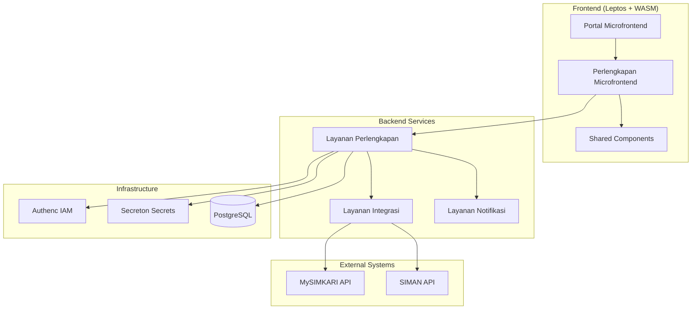
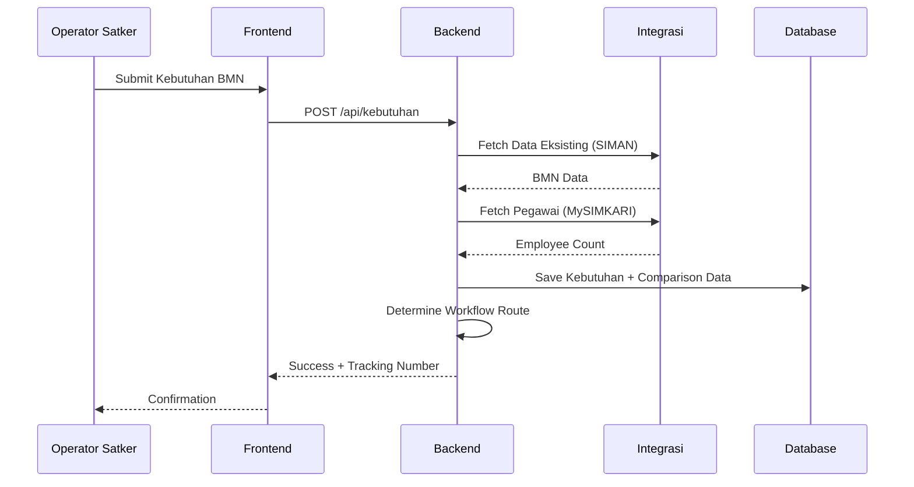

# Design Document: Sistem Analisis Kebutuhan BMN

## Overview

Sistem Analisis Kebutuhan BMN adalah modul komprehensif untuk mengelola siklus lengkap pengumpulan, validasi, dan analisis kebutuhan Barang Milik Negara di Kejaksaan RI. Sistem ini dibangun dengan arsitektur microservices menggunakan Rust (Axum) untuk backend dan Leptos + WebAssembly untuk frontend, terintegrasi dengan ekosistem SIMPelv2 yang sudah ada.

### Key Design Decisions

1. **Hierarchical Workflow Engine**: Implementasi state machine untuk alur persetujuan berjenjang
2. **Integration-First**: Memanfaatkan layanan integrasi existing (MySIMKARI, SIMAN) untuk data pegawai dan BMN
3. **SBSK Configuration**: Sistem standar yang fleksibel dan dapat dikonfigurasi per level organisasi
4. **Real-time Analysis**: Perhitungan gap analysis dan priority scoring secara real-time
5. **Audit-Complete**: Logging komprehensif untuk kepatuhan dan audit trail

## Architecture



### Data Flow



## Components and Interfaces

### Backend Components

#### 1. Kebutuhan BMN Module (`layanan/pembinaan/perlengkapan/src/kebutuhan/`)

```rust
// Core types for BMN needs management
pub mod models;      // Data models
pub mod handlers;    // HTTP handlers
pub mod services;    // Business logic
pub mod workflow;    // Approval workflow engine
pub mod anysis;    // Gap analysis and scoring
pub mod sbsk;        // Standards configuration
```

#### 2. API Endpoints

```
POST   /api/v1/kebutuhan                    # Submit new needs request
GET    /api/v1/kebutuhan                    # List needs (filtered by role)
GET    /api/v1/kebutuhan/{id}               # Get specific request
PUT    /api/v1/kebutuhan/{id}               # Update request (draft only)
DELETE /api/v1/kebutuhan/{id}               # Delete request (draft only)

POST   /api/v1/kebutuhan/{id}/submit        # Submit for approval
POST   /api/v1/kebutuhan/{id}/approve       # Approve request
POST   /api/v1/kebutuhan/{id}/reject        # Reject request
POST   /api/v1/kebutuhan/{id}/revise        # Request revision

GET    /api/v1/sbsk                         # List SBSK configurations
POST   /api/v1/sbsk                         # Create SBSK config
PUT    /api/v1/sbsk/{id}                    # Update SBSK config
GET    /api/v1/sbsk/bmn/{kode}              # Get SBSK for BMN code

POST   /api/v1/analisis/run                 # Run analysis on approved requests
GET    /api/v1/analisis/results             # Get analysis results
GET    /api/v1/analisis/report/{type}       # Generate report

GET    /api/v1/periode                      # List collection periods
POST   /api/v1/periode                      # Create new period
PUT    /api/v1/periode/{id}                 # Update period
POST   /api/v1/periode/{id}/extend          # Extend deadline

GET    /api/v1/dashboard/stats              # Dashboard statistics
GET    /api/v1/dashboard/summary            # Summary by category/region
```

#### 3. Workflow Engine Interface

```rust
pub trait WorkflowEngine {
    /// Determine next approver based on organizational hierarchy
    async fn route_request(&self, request: &KebutuhanBmn) -> Result<WorkflowRoute>;

    /// Process approval action
    async fn approve(&self, request_id: Uuid, approver: &User, notes: Option<String>) -> Result<()>;

    /// Process rejection action
    async fn reject(&self, request_id: Uuid, approver: &User, reason: String) -> Result<()>;

    /// Check if request is overdue
    fn is_overdue(&self, request: &KebutuhanBmn) -> bool;

    /// Get pending requests for validator
    async fn get_pending(&self, validator: &User) -> Result<Vec<KebutuhanBmn>>;
}
```


#### 4. Analysis Engine Interface

```rust
pub trait AnalysisEngine {
    /// Compare needs against existing BMN data
    async fn calculate_gap(&self, request: &KebutuhanBmn) -> Result<GapAnalysis>;

    /// Compare against SBSK standards
    async fn check_sbsk_compliance(&self, request: &KebutuhanBmn) -> Result<SbskCompliance>;

    /// Calculate BMN-to-employee ratio
    async fn calculate_ratio(&self, satker_id: &str) -> Result<RatioAnalysis>;

    /// Generate priority score
    fn calculate_priority_score(&self, gap: &GapAnalysis, compliance: &SbskCompliance) -> PriorityScore;

    /// Categorize result
    fn categorize(&self, score: PriorityScore, compliance: &SbskCompliance) -> AnalysisCategory;

    /// Run batch analysis
    async fn analyze_batch(&self, requests: Vec<KebutuhanBmn>) -> Result<Vec<AnalysisResult>>;
}
```

### Frontend Components

#### 1. Page Components (`antarmuka/pembinaan/perlengkapan/src/pages/`)

```rust
// Kebutuhan BMN pages
pub mod kebutuhan_list;      // List view with filters
pub mod kebutuhan_form;      // Create/edit form
pub mod kebutuhan_detail;    // Detail view with workflow actions
pub mod kebutuhan_approval;  // Approval queue for validators

// SBSK Management pages
pub mod sbsk_list;           // SBSK configuration list
pub mod sbsk_form;           // SBSK create/edit form

// Analysis pages
pub mod analisis_dashboard;  // Analysis dashboard
pub mod analisis_results;    // Analysis results view
pub mod analisis_report;     // Report generation

// Period Management
pub mod periode_list;        // Collection periods list
pub mod periode_form;        // Period create/edit
```

#### 2. Shared Components Used

```rust
use shared_microfrontend::components::{
    auth::{ProtectedRoute, PermissionGuard, UserProfile, LogoutButton},
    forms::{Input, Select, TextArea, FileUpload, DatePicker},
    layout::{Card, PageHeader, Sidebar, DataTable},
    feedback::{Alert, Toast, Modal, ConfirmDialog},
    navigation::{Breadcrumb, Tabs, Pagination},
    display::{Badge, StatusIndicator, ProgressBar},
};
```

## Data Models

### Core Entities

```rust
/// Kebutuhan BMN - Main entity for needs request
#[derive(Debug, Clone, Serialize, Deserialize, FromRow)]
pub struct KebutuhanBmn {
    pub id: Uuid,
    pub tracking_number: String,           // Format: KB-{YEAR}-{SATKER}-{SEQ}
    pub satker_id: String,                 // Satker code from MySIMKARI
    pub satker_nama: String,
    pub kejati_id: Option<String>,         // Kejati code (null for Kejagung units)
    pub periode_id: Uuid,                  // Collection period

    // BMN Details
    pub kode_bmn: String,                  // BMN code per PMK
    pub nama_bmn: String,
    pub kategori_bmn: String,
    pub satuan: String,                    // Unit of measurement
    pub jumlah_diusulkan: i32,             // Requested quantity
    pub spesifikasi_diusulkan: Option<String>,

    // Comparison Data (from integration)
    pub jumlah_eksisting: Option<i32>,     // Current count from SIMAN
    pub jumlah_pegawai: Option<i32>,       // Employee count from MySIMKARI

    // Request Details
    pub prioritas: Priority,               // Urgent, High, Normal, Low
    pub justifikasi: String,
    pub dokumen_pendukung: Vec<String>,    // File paths

    // Workflow
    pub status: KebutuhanStatus,
    pub current_approver_role: Option<ApproverRole>,
    pub submitted_at: Option<DateTime<Utc>>,
    pub approved_at: Option<DateTime<Utc>>,

    // Audit
    pub created_by: Uuid,
    pub created_at: DateTime<Utc>,
    pub updated_by: Option<Uuid>,
    pub updated_at: DateTime<Utc>,
    pub version: i32,
}

/// Status enum for workflow states
#[derive(Debug, Clone, Serialize, Deserialize, sqlx::Type)]
#[sqlx(type_name = "kebutuhan_status", rename_all = "snake_case")]
pub enum KebutuhanStatus {
    Draft,              // Initial state
    Submitted,          // Submitted for approval
    PendingWilayah,     // Waiting for Kejati validation
    PendingPusat,       // Waiting for Biro Perlengkapan validation
    Approved,           // Fully approved
    Rejected,           // Rejected at any level
    Revision,           // Returned for revision
}

/// Priority levels
#[derive(Debug, Clone, Serialize, Deserialize, sqlx::Type)]
#[sqlx(type_name = "priority_level", rename_all = "snake_case")]
pub enum Priority {
    Urgent,
    High,
    Normal,
    Low,
}

/// SBSK - Standar Barang dan Standar Kebutuhan
#[derive(Debug, Clone, Serialize, Deserialize, FromRow)]
pub struct Sbsk {
    pub id: Uuid,
    pub kode_bmn: String,
    pub nama_bmn: String,
    pub kategori: String,

    // Specification Standards
    pub spesifikasi_minimum: Option<String>,
    pub spesifikasi_rekomendasi: Option<String>,
    pub spesifikasi_maksimum: Option<String>,

    // Quantity Standards (ratio-based)
    pub rasio_per_pegawai: Option<f64>,    // e.g., 1.0 = 1 per employee
    pub jumlah_minimum: Option<i32>,
    pub jumlah_maksimum: Option<i32>,

    // Organizational Level
    pub level_organisasi: OrganizationLevel,

    // Versioning
    pub version: i32,
    pub effective_date: NaiveDate,
    pub expired_date: Option<NaiveDate>,

    // Audit
    pub created_by: Uuid,
    pub created_at: DateTime<Utc>,
    pub updated_by: Option<Uuid>,
    pub updated_at: DateTime<Utc>,
}

/// Organization levels for SBSK profiles
#[derive(Debug, Clone, Serialize, Deserialize, sqlx::Type)]
#[sqlx(type_name = "organization_level", rename_all = "snake_case")]
pub enum OrganizationLevel {
    Satker,
    Kejati,
    KejaksaanAgung,
    All,
}

/// Collection Period
#[derive(Debug, Clone, Serialize, Deserialize, FromRow)]
pub struct Periode {
    pub id: Uuid,
    pub nama: String,                      // e.g., "Pengumpulan Kebutuhan TA 2026"
    pub tahun_anggaran: i32,
    pub tanggal_mulai: NaiveDate,
    pub tanggal_selesai: NaiveDate,
    pub status: PeriodeStatus,
    pub created_by: Uuid,
    pub created_at: DateTime<Utc>,
}

#[derive(Debug, Clone, Serialize, Deserialize, sqlx::Type)]
#[sqlx(type_name = "periode_status", rename_all = "snake_case")]
pub enum PeriodeStatus {
    Draft,
    Active,
    Closed,
    Archived,
}

/// Analysis Result
#[derive(Debug, Clone, Serialize, Deserialize, FromRow)]
pub struct AnalysisResult {
    pub id: Uuid,
    pub kebutuhan_id: Uuid,
    pub analyzed_at: DateTime<Utc>,

    // Gap Analysis
    pub gap_quantity: i32,                 // requested - existing
    pub gap_percentage: f64,

    // SBSK Compliance
    pub sbsk_compliant: bool,
    pub spec_compliance: SpecCompliance,
    pub ratio_compliance: RatioCompliance,

    // Scoring
    pub priority_score: f64,               // 0-100
    pub category: AnalysisCategory,

    // Details
    pub notes: Option<String>,
    pub flags: Vec<String>,
}

#[derive(Debug, Clone, Serialize, Deserialize, sqlx::Type)]
#[sqlx(type_name = "analysis_category", rename_all = "snake_case")]
pub enum AnalysisCategory {
    Urgent,
    Normal,
    LowPriority,
    OverStandard,
}

/// Workflow History
#[derive(Debug, Clone, Serialize, Deserialize, FromRow)]
pub struct WorkflowHistory {
    pub id: Uuid,
    pub kebutuhan_id: Uuid,
    pub action: WorkflowAction,
    pub from_status: KebutuhanStatus,
    pub to_status: KebutuhanStatus,
    pub actor_id: Uuid,
    pub actor_name: String,
    pub actor_role: ApproverRole,
    pub notes: Option<String>,
    pub created_at: DateTime<Utc>,
}

#[derive(Debug, Clone, Serialize, Deserialize, sqlx::Type)]
#[sqlx(type_name = "workflow_action", rename_all = "snake_case")]
pub enum WorkflowAction {
    Submit,
    Approve,
    Reject,
    RequestRevision,
    Revise,
}
```

### Database Schema

```sql
-- Schema for BMN Needs Analysis
CREATE SCHEMA IF NOT EXISTS kebutuhan_bmn;

-- Enum types
CREATE TYPE kebutuhan_bmn.kebutuhan_status AS ENUM (
    'draft', 'submitted', 'pending_wilayah', 'pending_pusat',
    'approved', 'rejected', 'revision'
);

CREATE TYPE kebutuhan_bmn.priority_level AS ENUM (
    'urgent', 'high', 'normal', 'low'
);

CREATE TYPE kebutuhan_bmn.organization_level AS ENUM (
    'satker', 'kejati', 'kejaksaan_agung', 'all'
);

CREATE TYPE kebutuhan_bmn.periode_status AS ENUM (
    'draft', 'active', 'closed', 'archived'
);

CREATE TYPE kebutuhan_bmn.analysis_category AS ENUM (
    'urgent', 'normal', 'low_priority', 'over_standard'
);

-- Main tables
CREATE TABLE kebutuhan_bmn.periode (
    id UUID PRIMARY KEY DEFAULT gen_random_uuid(),
    nama VARCHAR(255) NOT NULL,
    tahun_anggaran INTEGER NOT NULL,
    tanggal_mulai DATE NOT NULL,
    tanggal_selesai DATE NOT NULL,
    status kebutuhan_bmn.periode_status DEFAULT 'draft',
    created_by UUID NOT NULL,
    created_at TIMESTAMPTZ DEFAULT NOW(),
    updated_at TIMESTAMPTZ DEFAULT NOW()
);

CREATE TABLE kebutuhan_bmn.sbsk (
    id UUID PRIMARY KEY DEFAULT gen_random_uuid(),
    kode_bmn VARCHAR(50) NOT NULL,
    nama_bmn VARCHAR(255) NOT NULL,
    kategori VARCHAR(100) NOT NULL,
    spesifikasi_minimum TEXT,
    spesifikasi_rekomendasi TEXT,
    spesifikasi_maksimum TEXT,
    rasio_per_pegawai DECIMAL(10,4),
    jumlah_minimum INTEGER,
    jumlah_maksimum INTEGER,
    level_organisasi kebutuhan_bmn.organization_level DEFAULT 'all',
    version INTEGER DEFAULT 1,
    effective_date DATE NOT NULL,
    expired_date DATE,
    created_by UUID NOT NULL,
    created_at TIMESTAMPTZ DEFAULT NOW(),
    updated_by UUID,
    updated_at TIMESTAMPTZ DEFAULT NOW(),
    UNIQUE(kode_bmn, level_organisasi, version)
);

CREATE TABLE kebutuhan_bmn.kebutuhan (
    id UUID PRIMARY KEY DEFAULT gen_random_uuid(),
    tracking_number VARCHAR(50) UNIQUE NOT NULL,
    satker_id VARCHAR(20) NOT NULL,
    satker_nama VARCHAR(255) NOT NULL,
    kejati_id VARCHAR(20),
    periode_id UUID REFERENCES kebutuhan_bmn.periode(id),
    kode_bmn VARCHAR(50) NOT NULL,
    nama_bmn VARCHAR(255) NOT NULL,
    kategori_bmn VARCHAR(100) NOT NULL,
    satuan VARCHAR(50) NOT NULL,
    jumlah_diusulkan INTEGER NOT NULL,
    spesifikasi_diusulkan TEXT,
    jumlah_eksisting INTEGER,
    jumlah_pegawai INTEGER,
    prioritas kebutuhan_bmn.priority_level DEFAULT 'normal',
    justifikasi TEXT NOT NULL,
    dokumen_pendukung JSONB DEFAULT '[]',
    status kebutuhan_bmn.kebutuhan_status DEFAULT 'draft',
    current_approver_role VARCHAR(50),
    submitted_at TIMESTAMPTZ,
    approved_at TIMESTAMPTZ,
    created_by UUID NOT NULL,
    created_at TIMESTAMPTZ DEFAULT NOW(),
    updated_by UUID,
    updated_at TIMESTAMPTZ DEFAULT NOW(),
    version INTEGER DEFAULT 1
);

CREATE TABLE kebutuhan_bmn.analysis_result (
    id UUID PRIMARY KEY DEFAULT gen_random_uuid(),
    kebutuhan_id UUID REFERENCES kebutuhan_bmn.kebutuhan(id),
    analyzed_at TIMESTAMPTZ DEFAULT NOW(),
    gap_quantity INTEGER NOT NULL,
    gap_percentage DECIMAL(10,2) NOT NULL,
    sbsk_compliant BOOLEAN DEFAULT false,
    spec_compliance JSONB,
    ratio_compliance JSONB,
    priority_score DECIMAL(5,2) NOT NULL,
    category kebutuhan_bmn.analysis_category NOT NULL,
    notes TEXT,
    flags JSONB DEFAULT '[]'
);

CREATE TABLE kebutuhan_bmn.workflow_history (
    id UUID PRIMARY KEY DEFAULT gen_random_uuid(),
    kebutuhan_id UUID REFERENCES kebutuhan_bmn.kebutuhan(id),
    action VARCHAR(50) NOT NULL,
    from_status kebutuhan_bmn.kebutuhan_status NOT NULL,
    to_status kebutuhan_bmn.kebutuhan_status NOT NULL,
    actor_id UUID NOT NULL,
    actor_name VARCHAR(255) NOT NULL,
    actor_role VARCHAR(50) NOT NULL,
    notes TEXT,
    created_at TIMESTAMPTZ DEFAULT NOW()
);

-- Indexes
CREATE INDEX idx_kebutuhan_satker ON kebutuhan_bmn.kebutuhan(satker_id);
CREATE INDEX idx_kebutuhan_kejati ON kebutuhan_bmn.kebutuhan(kejati_id);
CREATE INDEX idx_kebutuhan_status ON kebutuhan_bmn.kebutuhan(status);
CREATE INDEX idx_kebutuhan_periode ON kebutuhan_bmn.kebutuhan(periode_id);
CREATE INDEX idx_kebutuhan_kode_bmn ON kebutuhan_bmn.kebutuhan(kode_bmn);
CREATE INDEX idx_sbsk_kode_bmn ON kebutuhan_bmn.sbsk(kode_bmn);
CREATE INDEX idx_workflow_kebutuhan ON kebutuhan_bmn.workflow_history(kebutuhan_id);
```

## Correctness Properties

*A property is a characteristic or behavior that should hold true across all valid executions of a system—essentially, a formal statement about what the system should do. Properties serve as the bridge between human-readable specifications and machine-verifiable correctness guarantees.*

Based on the prework analysis, the following correctness properties have been identified:

### Property 1: BMN Code Auto-Population
*For any* valid BMN code selected from the Kodefikasi_BMN master data, the system SHALL correctly populate the corresponding BMN name, category, and unit of measurement.
**Validates: Requirements 1.2**

### Property 2: Required Field Validation
*For any* needs request submission attempt, if any required field (BMN code, quantity, justification, priority) is missing or invalid, the system SHALL reject the submission with appropriate error messages.
**Validates: Requirements 1.3, 1.6**

### Property 3: Integration Data Fetch on Submission
*For any* successfully submitted needs request, the system SHALL fetch and store both existing BMN data from SIMAN and employee count from MySIMKARI for the corresponding satker.
**Validates: Requirements 1.4, 1.5**

### Property 4: Unique Tracking Number Generation
*For any* successfully submitted needs request, the system SHALL generate a unique tracking number that does not conflict with any existing tracking number in the system.
**Validates: Requirements 1.7**

### Property 5: File Upload Size Validation
*For any* file upload attempt, if the file size exceeds 10MB, the system SHALL reject the upload with an appropriate error message.
**Validates: Requirements 1.8**

### Property 6: Workflow Routing Based on Organizational Unit
*For any* needs request submission:
- If from a Satker under Kejati, it SHALL be routed to Validator_Wilayah
- If from Biro/Pusat at Kejaksaan Agung (Pembinaan), it SHALL be routed directly to Biro_Perlengkapan
- If from Sekretariat Bidang (non-Pembinaan), it SHALL be routed directly to Biro_Perlengkapan
**Validates: Requirements 2.1, 2.2, 2.3**

### Property 7: Approval State Transitions
*For any* approval action by Validator_Wilayah, the request SHALL transition to pending_pusat status. *For any* approval action by Validator_Pusat, the request SHALL transition to approved status.
**Validates: Requirements 2.4, 2.6**

### Property 8: Rejection State Transition
*For any* rejection action at any level, the request SHALL transition to rejected status and include the rejection reason in the workflow history.
**Validates: Requirements 2.5**

### Property 9: Comprehensive Audit Logging
*For any* create, update, delete, or status change operation on a needs request, the system SHALL create an audit record containing timestamp, user ID, action type, and relevant details.
**Validates: Requirements 2.8, 10.1, 10.2, 10.3**

### Property 10: SBSK Versioning
*For any* update to SBSK configuration, the system SHALL create a new version while preserving the previous version in history.
**Validates: Requirements 3.4**

### Property 11: Gap Analysis Calculation
*For any* analysis run, the gap quantity SHALL equal (requested quantity - existing quantity), and gap percentage SHALL be calculated correctly based on the formula: ((requested - existing) / existing) * 100.
**Validates: Requirements 4.2**

### Property 12: Ratio Analysis Calculation
*For any* satker with employee data, the BMN-to-employee ratio SHALL be calculated as (BMN count / employee count) and compared against the SBSK ratio standard for that BMN type.
**Validates: Requirements 4.4**

### Property 13: Priority Score Calculation
*For any* completed analysis, the priority score SHALL be calculated based on gap severity (40%), SBSK compliance (30%), and priority level (30%), resulting in a score between 0-100.
**Validates: Requirements 4.5**

### Property 14: Over-Standard Categorization
*For any* needs request where the requested quantity exceeds the SBSK maximum, the analysis result SHALL be categorized as "Over-standard".
**Validates: Requirements 4.7**

### Property 15: Role-Based Data Access Restriction
*For any* authenticated user:
- Operator_Satker SHALL only access data from their own satker
- Validator_Wilayah SHALL access data from all satker within their Kejati
- Validator_Pusat SHALL access all data nationwide
**Validates: Requirements 7.3, 7.4, 7.5**

### Property 16: Unauthorized Access Denial
*For any* access attempt to data outside the user's authorized scope, the system SHALL deny access and create an audit log entry.
**Validates: Requirements 7.8**

### Property 17: Event-Triggered Notifications
*For any* status change event (submission, approval, rejection), the system SHALL create a notification for the relevant stakeholder.
**Validates: Requirements 8.1, 8.2, 8.5**

### Property 18: Period-Based Submission Control
*For any* submission attempt:
- If the collection period is active, submission SHALL be allowed
- If the collection period is closed, submission SHALL be rejected
**Validates: Requirements 9.2, 9.3**

### Property 19: Audit Record Immutability
*For any* audit record in the system, modification or deletion attempts SHALL be rejected.
**Validates: Requirements 10.7**

## Error Handling

### Error Categories

```rust
#[derive(Debug, thiserror::Error)]
pub enum KebutuhanError {
    // Validation Errors
    #[error("Validation failed: {0}")]
    ValidationError(String),

    #[error("Invalid BMN code: {0}")]
    InvalidBmnCode(String),

    #[error("File size exceeds limit: {size} bytes (max: {max} bytes)")]
    FileSizeExceeded { size: u64, max: u64 },

    // Workflow Errors
    #[error("Invalid status transition from {from:?} to {to:?}")]
    InvalidStatusTransition { from: KebutuhanStatus, to: KebutuhanStatus },

    #[error("Request not in approvable state")]
    NotApprovable,

    #[error("Collection period is not active")]
    PeriodNotActive,

    #[error("Collection period has ended")]
    PeriodEnded,

    // Authorization Errors
    #[error("Unauthorized access to resource")]
    Unauthorized,

    #[error("Insufficient permissions for action: {0}")]
    InsufficientPermissions(String),

    // Integration Errors
    #[error("SIMAN integration error: {0}")]
    SimanError(String),

    #[error("MySIMKARI integration error: {0}")]
    MysimkariError(String),

    #[error("Integration data unavailable, using cached data from {0}")]
    IntegrationUnavailable(DateTime<Utc>),

    // Database Errors
    #[error("Database error: {0}")]
    DatabaseError(#[from] sqlx::Error),

    #[error("Resource not found: {0}")]
    NotFound(String),

    #[error("Duplicate tracking number")]
    DuplicateTrackingNumber,
}
```

### Error Response Format

```rust
#[derive(Debug, Serialize)]
pub struct ErrorResponse {
    pub success: bool,
    pub error_code: String,
    pub message: String,
    pub details: Option<Vec<ValidationDetail>>,
    pub timestamp: DateTime<Utc>,
    pub request_id: String,
}

#[derive(Debug, Sze)]
pub struct ValidationDetail {
    pub field: String,
    pub message: String,
    pub code: String,
}
```

### Fallback Strategies

1. **Integration Unavailable**: Use cached data with freshness indicator
2. **Database Connection Lost**: Retry with exponential backoff
3. **Notification Delivery Failed**: Queue for retry, log failure
4. **File Upload Failed**: Return partial success with failed files list

## Testing Strategy

### Unit Tests
- Test individual functions and methods in isolation
- Focus on business logic validation
- Mock external dependencies (database, integrations)


### Property-Based Tests

Property-based testing will be implemented using the `proptest` crate for Rust. Each correctness property will have a corresponding property test with minimum 100 iterations.

**Test Configuration:**
```rust
proptest! {
    #![proptest_config(ProptestConfig::with_cases(100))]

    // Property tests here
}
```

**Test Annotation Format:**
```rust
/// Feature: bmn-needs-analysis, Property 1: BMN Code Auto-Population
/// Validates: Requirements 1.2
#[test]
fn prop_bmn_code_auto_population() {
    // Property test implementation
}
```

### Integration Tests
- Test API endpoints with real database
- Test workflow state transitions
- Test integration with MySIMKARI and SIMAN (mocked)
- Test authentication and authorization flows

### Test Coverage Requirements
- Minimum 80% code coverage for business logic
- 100% coverage for workflow state machine
- All error paths must be tested

### Testing Tools
- **Unit/Integration**: `cargo test`
- **Property-Based**: `proptest` crate
- **API Testing**: `axum-test` crate
- **Coverage**: `cargo-tarpaulin`
- **Frontend**: `wasm-bindgen-test`

## Security Considerations

### Authentication
- All API endpoints require valid JWT token from Authenc
- Token validation on every request
- Session timeout after 30 minutes of inactivity

### Authorization
- Role-based access control (RBAC) enforced at API layer
- Data filtering based on user's organizational scope
- Permission checks before any data modification

### Data Protection
- Sensitive data encrypted at rest
- API keys stored in Secreton
- Audit logs tamper-proof (append-only)

### Input Validation
- All inputs validated using `garde` crate
- SQL injection prevention via parameterized queries
- XSS prevention in frontend via Leptos escaping
