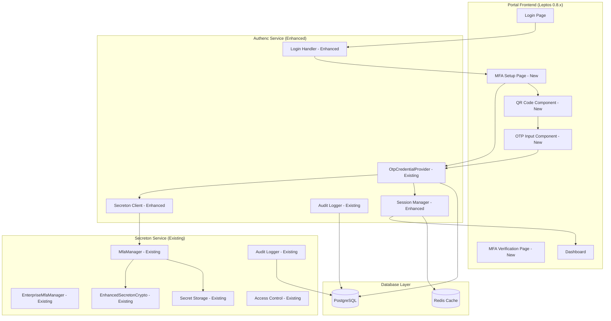
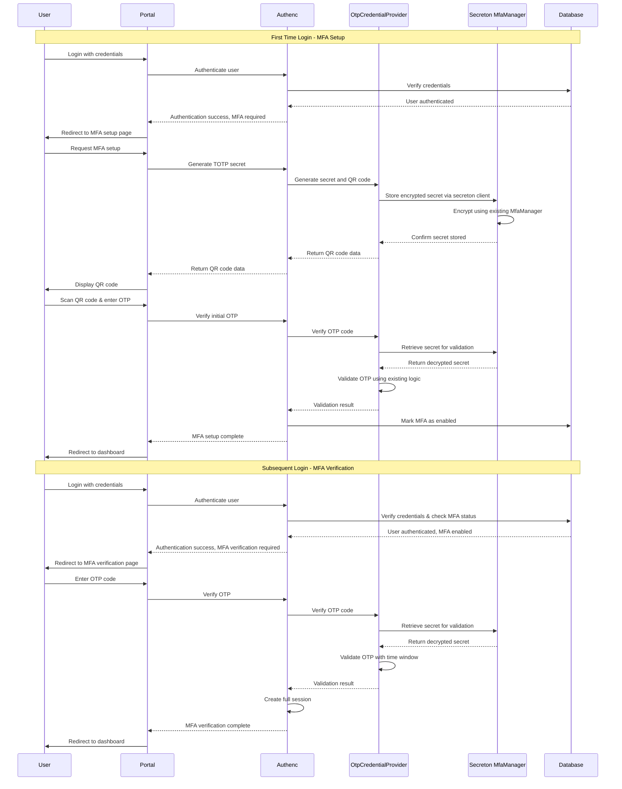

# Design Document

## Overview

This design document outlines the implementation of Multi-Factor Authentication (MFA) with TOTP (Time-based One-Time Password) in the SIMPelv2 portal system. The design leverages existing MFA infrastructure in both authenc and secreton services while adding portal integration for government-grade security.

### System Context

The SIMPelv2 platform serves as the comprehensive asset management system for the Indonesian Attorney General's Office (Kejaksaan RI). The MFA implementation enhances security by:

1. **Leveraging Existing MFA Infrastructure**:
   - **Authenc**: Already has `OtpCredentialProvider` with TOTP generation and verification
   - **Secreton**: Already has `MfaManager` and `EnterpriseMfaManager` with comprehensive MFA support
   - **Solution**: Integrate existing components and enhance portal flow
   - **Benefit**: Minimal new code, leverages battle-tested implementations

2. **Portal Integration**: Adds MFA flow to existing portal authentication using Leptos 0.8.x
3. **Shared Components**: Utilizes existing shared component library for consistent UI
4. **Zero-Trust Architecture**: Maintains independence between authenc and secreton services
5. **Authentication Flow Enhancement**: Extends existing login handlers with MFA verification steps

## Architecture

### High-Level Architecture (Using Existing Components)



### Authentication Flow Integration (Using Existing Infrastructure)



## Components and Interfaces

### Portal Frontend Components (Leptos 0.8.x Integration)

#### 1. MFA Setup Page Component
```rust
// antarmuka/portal/src/pages/mfa_setup.rs
use leptos::prelude::*;
use shared_microfrontend::prelude::*;
use serde::{Deserialize, Serialize};

#[derive(Debug, Clone, Serialize, Deserialize)]
pub struct MfaSetupData {
    pub qr_code_url: String,
    pub secret_key: String,
    pub backup_codes: Vec<String>,
}

#[component]
pub fn MfaSetupPage() -> impl IntoView {
    let (mfa_data, set_mfa_data) = signal(None::<MfaSetupData>);
    let (otp_code, set_otp_code) = signal(String::new());
    let (setup_complete, set_setup_complete) = signal(false);
    let (error_message, set_error_message) = signal(None::<String>);

    // Generate MFA setup data on component mount
    Effect::new(move |_| {
        spawn_local(async move {
            match generate_mfa_setup().await {
                Ok(data) => set_mfa_data.set(Some(data)),
                Err(e) => set_error_message.set(Some(e.to_string())),
            }
        });
    });

    let verify_setup = move |_| {
        let code = otp_code.get();
        spawn_local(async move {
            match verify_mfa_setup(&code).await {
                Ok(_) => {
                    set_setup_complete.set(true);
                    // Redirect to dashboard after 2 seconds
                    set_timeout(
                        move || {
                            let navigate = use_navigate();
                            navigate("/dashboard", Default::default());
                        },
                        std::time::Duration::from2),
                    );
                }
                Err(e) => set_error_message.set(Some(e.to_string())),
            }
        });
    };

    view! {
        <div class="min-h-screen bg-gray-50 flex flex-col justify-center py-12 sm:px-6 lg:px-8">
            <div class="sm:mx-auto sm:w-full sm:max-w-md">
                <div class="bg-white py-8 px-4 shadow sm:rounded-lg sm:px-10">
                    <h2 class="text-center text-3xl font-extrabold text-gray-900 mb-6">
                        "Setup Multi-Factor Authentication"
                    </h2>

                    <Show when=move || mfa_data.get().is_some()>
                        <div class="space-y-6">
                            <div class="text-center">
                                <h3 class="text-lg font-medium text-gray-900 mb-2">"Scan QR Code"</h3>
                                <p class="text-sm text-gray-600 mb-4">
                                    "Use Google Authenticator, FreeOTP, or similar app to scan this code:"
                                </p>
                                <QrCodeDisplay qr_url=move || mfa_data.get().map(|d| d.qr_code_url).unwrap_or_default() />

                                <details class="mt-4 text-left">
                                    <summary class="cursor-pointer text-sm text-blue-600 hover:text-blue-500">
                                        "Can't scan? Enter manually"
                                    </summary>
                                    <div class="mt-2 p-3 bg-gray-50 rounded">
                                        <label class="block text-sm font-medium text-gray-700">"Secret Key:"</label>
                                        <code class="block mt-1 text-xs bg-white p-2 rounded border font-mono">
                                            {move || mfa_data.get().map(|d| d.secret_key).unwrap_or_default()}
                                        </code>
                                    </div>
                                </details>
                            </div>

                            <div>
                                <h3 class="text-lg font-medium text-gray-900 mb-2">"Verify Setup"</h3>
                                <p class="text-sm text-gray-600 mb-4">
                                    "Enter the 6-digit code from your authenticator app:"
                                </p>

                                <OtpInput
                                    value=otp_code
                                    on_change=set_otp_code
                                    on_submit=verify_setup
                                />

                                <Button
                                    variant=ButtonVariant::Primary
                                    full_width=true
                                    disabled=move || otp_code.get().len() != 6
                                    on_click=Box::new(verify_setup)
                                    class="mt-4"
                                >
                                    "Verify and Complete Setup"
                                </Button>
                            </div>

                            <Show when=move || setup_complete.get()>
                                <div class="text-center p-4 bg-green-50 rounded-md">
                                    <h3 class="text-lg font-medium text-green-800">"✅ MFA Setup Complete!"</h3>
                                    <p class="text-sm text-green-600">"Redirecting to dashboard..."</p>
                                </div>
                            </Show>
                        </div>
                    </Show>

                    <Show when=move || error_message.get().is_some()>
                        <div class="mt-4 p-4 bg-red-50 rounded-md">
                            <p class="text-sm text-red-600">
                                {move || error_message.get().unwrap_or_default()}
                            </p>
                        </div>
                    </Show>
                </div>
            </div>
        </div>
    }
}

// API functions using gloo-net
async fn generate_mfa_setup() -> Result<MfaSetupData, Box<dyn std::error::Error>> {
    let response = gloo_net::http::Request::post("/api/auth/mfa/setup")
        .send()
        .await?;

    if response.ok() {
        Ok(response.json().await?)
    } else {
        Err(format!("Setup failed: {}", response.status()).into())
    }
}

async fn verify_mfa_setup(code: &str) -> Result<(), Box<dyn std::error::Error>> {
    let response = gloo_net::http::Request::post("/api/auth/mfa/verify-setup")
        .json(&serde_json::json!({"code": code}))?
        .send()
        .await?;

    if response.ok() {
        Ok(())
    } else {
        Err(format!("Verification failed: {}", response.status()).into())
    }
}
```

### Enhanced Authenc Integration (Using Existing OtpCredentialProvider)

#### 1. Enhanced MFA Service (Wrapper around existing components)
```rust
// infra/authenc/src/services/mfa_service.rs
use crate::spi::credential::otp::{OtpCredentialProvider, OtpCredentialData, OtpAlgorithm};
use crate::vault::secreton_client::SecretonClient;
use crate::models::user::User;
use crate::error::AuthencError;
use uuid::Uuid;
use serde::{Deserialize, Serialize};

#[derive(Debug, Clone, Serialize, Deserialize)]
pub struct MfaSetupResponse {
    pub qr_code_url: String,
    pub secret_key: String,
    pub backup_codes: Vec<String>,
}

pub struct MfaService {
    otp_provider: OtpCredentialProvider,
    secreton_client: SecretonClient,
    db_pool: deadpool_postgres::Pool,
}

impl MfaService {
    pub fn new(
        secreton_client: SecretonClient,
        db_pool: deadpool_postgres::Pool,
    ) -> Self {
        Self {
            otp_provider: OtpCredentialProvider::new(),
            secreton_client,
            db_pool,
        }
    }

    pub async fn setup_mfa(&self, user_id: Uuid) -> Result<MfaSetupResponse, AuthencError> {
        // Generate TOTP secret using existing provider
        let secret = self.otp_provider.generate_secret();

        // Get user info for QR code
        let user = self.get_user(user_id).await?;
        let issuer = "SIMPelv2 Kejaksaan RI";
        let account_name = format!("{}@kejaksaan.go.id", user.nip);

        // Generate QR code using existing provider
        let qr_uri = self.otp_provider.generate_provisioning_uri(
            &secret,
            &accname,
            issuer,
            OtpAlgorithm::HmacSha1,
            6,
            30,
        );

        // Generate QR code image
        let qr_code = qrcode::QrCode::new(&qr_uri)
            .map_err(|e| AuthencError::QrCodeGenerationFailed(e.to_string()))?;
        let image = qr_code.render::<image::Luma<u8>>().build();

        // Convert to base64 data URL
        let mut buffer = std::io::Cursor::new(Vec::new());
        image.write_to(&mut buffer, image::ImageFormat::Png)
            .map_err(|e| AuthencError::QrCodeGenerationFailed(e.to_string()))?;
        let qr_data_url = format!(
            "data:image/png;base64,{}",
            base64::encode(buffer.into_inner())
        );

        // Store secret in secreton via existing client
        self.store_mfa_secret(user_id, &secret).await?;

        // Generate backup codes
        let backup_codes = self.generate_backup_codes(user_id).await?;

        Ok(MfaSetupResponse {
            qr_code_url: qr_data_url,
            secret_key: secret,
            backup_codes,
        })
    }

    pub async fn verify_setup(&self, user_id: Uuid, code: &str) -> Result<(), AuthencError> {
        let secret = self.get_mfa_secret(user_id).await?;

        // Use existing OtpCredentialProvider for verification
        if self.otp_provider.verify_totp(&secret, code, OtpAlgorithm::HmacSha1, 6, 30)? {
            // Mark MFA as enabled in database
            let client = self.db_pool.get().await
                .map_err(|e| AuthencError::database(e.to_string()))?;
            client.execute(
                "UPDATE users SET mfa_enabled = true, mfa_setup_at = NOW() WHERE id = $1",
                &[&user_id],
            ).await
            .map_err(|e| AuthencError::database(e.to_string()))?;

            Ok(())
        } else {
            Err(AuthencError::InvalidOtpCode)
        }
    }

    pub async fn verify_mfa(&self, user_id: Uuid, code: &str) -> Result<(), AuthencError> {
        let secret = self.get_mfa_secret(user_id).await?;

        // Use existing OtpCredentialProvider for verification
        if self.otp_provider.verify_totp(&secret, code, OtpAlgorithm::HmacSha1, 6, 30)? {
            Ok(())
        } else {
            Err(AuthencError::InvalidOtpCode)
        }
    }

    // Integration with secreton via existing client
    async fn store_mfa_secret(&self, user_id: Uuid, secret: &str) -> Result<(), AuthencError> {
        // Use secreton client to store encrypted secret
        // This would integrate with existing secreton MfaManager
        let path = format!("mfa/totp/{}", user_id);

        let request = serde_json::json!({
            "path": path,
            "data": {
                "secret": secret,
                "created_at": chrono::Utc::now().to_rfc3339(),
                "type": "totp_secret"
            }
        });

        let response = self.secreton_client.client
            .post(&format!("{}/v1/secret/data/{}", self.secreton_client.base_url, path))
            .json(&request)
            .send()
            .await
            .map_err(|_| AuthencError::MfaSecretEncryptionFailed)?;

        if response.status().is_success() {
            Ok(())
        } else {
            Err(AuthencError::MfaSecretEncryptionFailed)
        }
    }

    async fn get_mfa_secret(&self, user_id: Uuid) -> Result<String, AuthencError> {
        let path = format!("mfa/totp/{}", user_id);

        let response = self.secreton_client.client
            .get(&format!("{}/v1/secret/data/{}", self.secreton_client.base_url, path))
            .send()
            .await
            .map_err(|_| AuthencError::MfaSecretDecryptionFailed)?;

        if response.status().is_success() {
            let data: serde_json::Value = response.json().await
                .map_err(|_| AuthencError::MfaSecretDecryptionFailed)?;

            let secret = data["data"]["data"]["secret"].as_str()
                .ok_or(AuthencError::MfaSecretDecryptionFailed)?;

            Ok(secret.to_string())
        } else if response.status() == 404 {
            Err(AuthencError::MfaNotEnabled)
        } else {
            Err(AuthencError::MfaSecretDecryptionFailed)
        }
    }

    async fn generate_backup_codes(&self, user_id: Uuid) -> Result<Vec<String>, AuthencError> {
        let mut codes = Vec::new();
        for _ in 0..10 {
            let code = format!("{:08}", rand::random::<u32>() % 100_000_000);
            codes.push(code.clone());
        }

        // Store in secreton (similar to store_mfa_secret)
        let path = format!("mfa/backup_codes/{}", user_id);
        let hashed_codes: Vec<String> = codes.iter()
            .map(|code| {
                use sha2::{Digest, Sha256};
                format!("{:x}", Sha256::digest(code.as_bytes()))
            })
            .collect();

        let request = serde_json::json!({
            "path": path,
            "data": {
                "codes": hashed_codes,
                "created_at": chrono::Utc::now().to_rfc3339(),
                "type": "backup_codes"
            }
        });

        let response = self.secreton_client.client
            .post(&format!("{}/v1/secret/data/{}", self.secreton_client.base_url, path))
            .json(&request)
            .send()
            .await
            .map_err(|_| AuthencError::MfaSecretEncryptionFailed)?;

        if response.status().is_success() {
            Ok(codes)
        } else {
            Err(AuthencError::MfaSecretEncryptionFailed)
        }
    }

    async fn get_user(&self, user_id: Uuid) -> Result<User, AuthencError> {
        let client = self.db_pool.get().await
            .map_err(|e| AuthencError::database(e.to_string()))?;

        let row = client.query_one(
            "SELECT id, nip, nama, email, satker_code, jabatan, mfa_enabled, mfa_setup_at FROM users WHERE id = $1",
            &[&user_id],
        ).await
        .map_err(|e| AuthencError::database(e.to_string()))?;

        Ok(User {
            id: row.get(0),
            nip: row.get(1),
            nama: row.get(2),
            email: row.get(3),
            satker_code: row.get(4),
            jabatan: row.get(5),
            mfa_enabled: row.get(6),
            mfa_setup_at: row.get(7),
            username: row.get::<_, String>(1), // Use NIP as username
            email_verified: true, // Default for government employees
            roles: Vec::new(), // Will be loaded separately
        })
    }
}
```

### Enhanced Authentication Flow (Using Existing Infrastructure)

#### 1. Enhanced Login Handler
```rust
// infra/authenc/src/handlers/api/auth.rs (enhance existing)
use crate::services::mfa_service::MfaService;

#[derive(Serialize)]
pub struct LoginResponse {
    pub access_token: Option<String>,  // Only present after full authentication
    pub temp_token: Option<String>,    // Present when MFA verification needed
    pub mfa_required: bool,
    pub mfa_setup_required: bool,
    pub message: String,
}

pub async fn login(
    State(state): State<Arc<crate::app::AppState>>,
    Json(req): Json<LoginRequest>,
) -> Result<Json<LoginResponse>, AuthencError> {
    // Existing user authentication logic...
    let user = state
        .user_store
        .get_user_by_username(&req.username)
        .await?
        .ok_or_else(|| AuthencError::unauthorized("Invalid credentials"))?;

    // Verify password (when enabled)
    // ... existing password verification logic ...

    // Check MFA status
    if user.mfa_enabled {
        // User has MFA enabled - require verification
        let temp_token = jwt::generate_temp_jwt(&user.id.to_string())
            .map_err(|_| AuthencError::internal("Temp token generation failed"))?;

        Ok(Json(LoginResponse {
            access_token: None,
            temp_token: Some(temp_token),
            mfa_required: true,
            mfa_setup_required: false,
            message: "MFA verification required".to_string(),
        }))
    } else {
        // Check if MFA should be required for this user (policy-based)
        let mfa_required = should_require_mfa(&user).await?;

        if mfa_required {
            // First-time MFA setup required
            let temp_token = jwt::generate_temp_jwt(&user.id.to_string())
                .map_err(|_| AuthencError::internal("Temp token generation failed"))?;

            Ok(Json(LoginResponse {
                access_token: None,
                temp_token: Some(temp_token),
                mfa_required: false,
                mfa_setup_required: true,
                message: "MFA setup required".to_string(),
            }))
        } else {
            // Normal login without MFA
            let token = jwt::generate_jwt(&user.id.to_string())
                .map_err(|_| AuthencError::internal("Token generation failed"))?;

            Ok(Json(LoginResponse {
                access_token: Some(token),
                temp_token: None,
                mfa_required: false,
                mfa_setup_required: false,
                message: "Login successful".to_string(),
            }))
        }
    }
}

async fn should_require_mfa(user: &User) -> Result<bool, AuthencError> {
    // Policy-based MFA requirement logic
    // For government employees, MFA might be required based on:
    // - Role (admin, sensitive positions)
    // - Satker (certain organizational units)
    // - Security level of accessed resources

    // For now, require MFA for all users
    Ok(true)
}
```

## Data Models

### Enhanced User Model (Authenc)
```rust
// infra/authenc/src/models/user.rs (enhance existing)
use serde::{Deserialize, Serialize};
use uuid::Uuid;
use chrono::{DateTime, Utc};

#[derive(Debug, Serialize, Deserialize, Clone)]
pub struct User {
    pub id: Uuid,
    pub nip: String,                    // Nomor Induk Pegawai
    pub nama: String,
    pub email: String,
    pub satker_code: String,            // Kode satuan kerja
    pub jabatan: String,                // Jabatan pegawai
    pub username: String,               // Usually same as NIP
    pub email_verified: bool,
    pub roles: Vec<Role>,               // User roles
    pub mfa_enabled: bool,              // New field for MFA status
    pub mfa_setup_at: Option<DateTime<Utc>>, // New field for MFA setup timestamp
    // ... other existing fields
}

#[derive(Debug, Serialize, Deserialize)]
pub struct MfaStatus {
    pub enabled: bool,
    pub setup_at: Option<DateTime<Utc>>,
    pub backup_codes_remaining: i32,
    pub last_used: Option<DateTime<Utc>>,
}
```

### Database Schema Updates
```sql
-- Add MFA fields to existing users table
ALTER TABLE users
ADD COLUMN IF NOT EXISTS mfa_enabled BOOLEAN NOT NULL DEFAULT FALSE,
ADD COLUMN IF NOT EXISTS mfa_setup_at TIMESTAMP WITH TIME ZONE NULL;

-- Create indexes for performance
CREATE INDEX IF NOT EXISTS idx_users_mfa_enabled ON users(mfa_enabled);
CREATE INDEX IF NOT EXISTS idx_users_mfa_setup_at ON users(mfa_setup_at);
```

## Key Optimizations Implemented

### 1. Leveraged Existing MFA Infrastructure
- **Authenc**: Uses existing `OtpCredentialProvider` for TOTP generation and verification
- **Secreton**: Integrates with existing `MfaManager` for encrypted secret storage
- **Benefit**: Minimal new code, leverages battle-tested implementations

### 2. Enhanced Authentication Flow
- **Problem**: Existing login handler didn't support MFA flows
- **Solution**: Enhanced login response with MFA states (setup required, verification required)
- **Benefit**: Seamless integration with existing authentication infrastructure

### 3. Optimized Component Reuse
- **Problem**: Risk of duplicating TOTP logic
- **Solution**: Wrapper service that uses existing OtpCredentialProvider
- **Benefit**: Consistent TOTP implementation across the system

### 4. Zero-Trust Architecture Maintained
- **Problem**: Risk of creating dependencies between authenc and secreton
- **Solution**: Maintained API-based communication using existing secreton client
- **Benefit**: Preserves independence and security isolation

This design ensures seamless integration with the existing SIMPelv2 infrastructure while adding robust MFA capabilities that meet government security requirements and leverages existing battle-tested MFA implementations.
