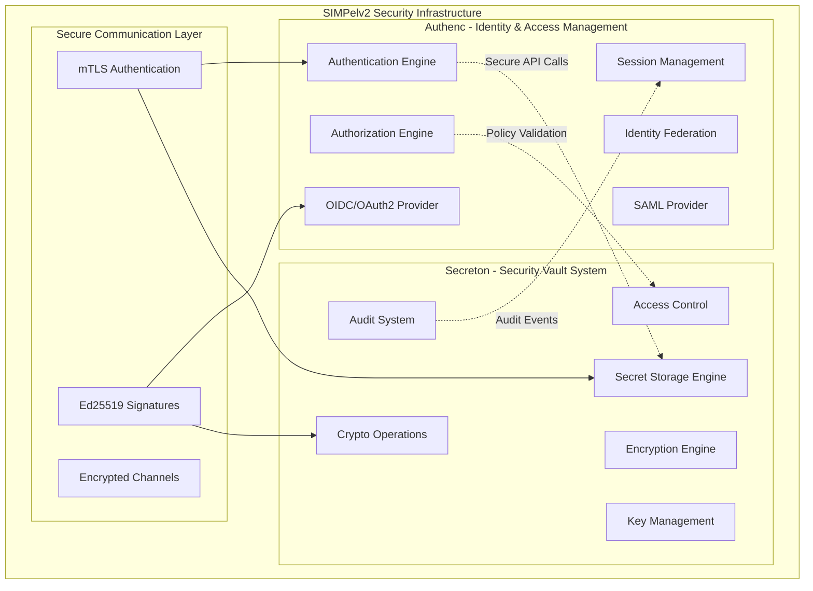

# Design Document

## Overview

This design document outlines the architecture for optimizing and enhancing the synergy between infra/authenc (Identity and Access Management) and infra/secreton (Security Vault System) within the SIMPelv2 government asset management system. The design maintains complete independence and zero-trust principles while optimizing for Indonesian government operations, including Barang Milik Negara (BMN) management, pegawai (employee) authentication, and multi-instansi (institution) security.

### SIMKARI Super App Context

SIMKARI (Sistem Informasi Manajemen Kejaksaan Republik Indonesia) is a comprehensive super app platform for the Indonesian Attorney General's Office. The system features:

- **Microfrontend Architecture**: Modular frontend components for different functional areas
- **Portal Integration**: Unified portal with shared frontend components
- **Microservices Backend**: Distributed services architecture with independent scaling
- **Flexible Authentication**: Dynamic user authentication and authorization
- **Audit & Compliance**: Comprehensive audit trails and security monitoring
- **Post-Quantum Ready**: Cryptographic architecture prepared for quantum-safe algorithms

## Architecture

### High-Level Architecture



### Component Relationships

The design maintains strict independence while enabling secure synergy:

1. **Authenc Role**: Identity and Access Management
   - User authentication and authorization
   - Identity federation (SAML, OIDC, OAuth2)
   - Session management and token issuance
   - Access policy enforcement

2. **Secreton Role**: Security Vault System
   - Secret storage and encryption
   - Cryptographic key management
   - Secure secret retrieval
   - Audit logging and compliance

3. **Synergy Pattern**: Secure API Integration
   - Authenc authenticates users and issues tokens
   - Secreton validates tokens and provides secrets
   - No shared libraries or dependencies
   - Independent failure modes

## Components and Interfaces

### Authenc Optimization Components

#### 1. Enhanced Cryptographic Engine
```rust
// infra/authenc/src/crypto/mod.rs (enhance existing)
impl CryptoEngine {
    // Enhanced for government IAM operations
    pub async fn sign_jwt_for_government(&self, claims: &Claims) -> Result<String>;
    pub async fn verify_token_batch(&self, tokens: &[String]) -> Result<Vec<bool>>;
    pub async fn encrypt_session_data(&self, data: &SessionData) -> Result<EncryptedData>;
    pub async fn generate_government_audit_signature(&self, data: &AuditData) -> Result<Signature>;
}
```

#### 2. Secreton Integration Client
```rust
// infra/authenc/src/vault/secreton_client.rs (rename from secreton_vault.rs)
impl SecretonClient {
    // Enhanced for SIMKARI super app operations
    pub async fn get_signing_key(&self, key_id: &str, context: &SecurityContext) -> Result<SigningKey>;
    pub async fn get_encryption_key(&self, resource_id: &str, context: &SecurityContext) -> Result<EncryptionKey>;
    pub async fn validate_user_secret_access(&self, user_id: &str, secret_path: &str) -> Result<bool>;
    pub async fn get_application_config(&self, app_id: &str) -> Result<ApplicationConfig>;
    pub async fn get_post_quantum_key(&self, key_id: &str, algorithm: PqAlgorithm) -> Result<PqKey>;
}
```

### Secreton Optimization Components

#### 1. Enhanced Secret Engine
```rust
// infra/secreton/crates/core/src/engines/enhanced.rs (new)
pub struct EnhancedSecretEngine {
    storage: Box<dyn StorageBackend>,
    crypto: CryptoEngine,
    pq_crypto: PostQuantumCrypto,
    cache: LruCache<String, CachedSecret>,
    audit_logger: AuditLogger,
}

impl EnhancedSecretEngine {
    // Enhanced for SIMKARI super app operations
    pub async fn get_application_secret(&self, app_id: &str, path: &str) -> Result<Secret>;
    pub async fn get_user_credentials(&self, user_id: &str) -> Result<UserCredentials>;
    pub async fn batch_get_secrets(&self, resource_ids: &[String]) -> Result<Vec<Secret>>;
    pub async fn validate_application_token(&self, token: &str, app_context: &str) -> Result<bool>;
    pub async fn get_pq_encrypted_secret(&self, path: &str, algorithm: PqAlgorithm) -> Result<Secret>;
}
```

#### 2. Authenc Authentication Provider
```rust
// infra/secreton/crates/core/src/auth/authenc_provider.rs (new)
pub struct AuthencAuthProvider {
    authenc_endpoint: String,
    client_cert: ClientCertificate,
    token_cache: TokenCache,
    validation_cache: ValidationCache,
    pq_validator: PostQuantumValidator,
}

impl AuthProvider for AuthencAuthProvider {
    async fn authenticate_user(&self, user_id: &str, credentials: &Credentials) -> Result<AuthResult>;
    async fn validate_token(&self, token: &str) -> Result<TokenValidation>;
    async fn check_resource_permissions(&self, user: &User, resource_id: &str) -> Result<bool>;
    async fn validate_application_access(&self, app_id: &str, resource: &str) -> Result<bool>;
    async fn validate_pq_signature(&self, signature: &PqSignature, data: &[u8]) -> Result<bool>;
}
```

### Secure Communication Interface

#### 1. mTLS Communication Layer
```rust
// Shared pattern (implemented independently in both projects)
pub struct SecureCommunication {
    client_cert: ClientCertificate,
    ca_bundle: CertificateAuthority,
    tls_config: TlsConfiguration,
}

impl SecureCommunication {
    pub async fn secure_request<T>(&self, endpoint: &str, payload: &T) -> Result<Response>;
    pub fn verify_peer_certificate(&self, cert: &Certificate) -> Result<bool>;
    pub fn establish_secure_channel(&self, peer: &str) -> Result<SecureChannel>;
}
```

## Data Models

### Authenc Data Models

#### Enhanced User Model
```rust
// infra/authenc/src/models/user.rs (enhance existing)
#[derive(Debug, Serialize, Deserialize)]
pub struct User {
    pub id: Uuid,
    pub nip: String,                    // Nomor Induk Pegawai
    pub nama: String,
    pub email: String,
    pub satker_code: String,            // Kode satuan kerja
    pub jabatan: String,                // Jabatan pegawai
    pub roles: Vec<Role>,               // Roles diatur oleh admin (satker/wilayah/pusat)
    pub permissions: Vec<Permission>,   // Derived from roles
    pub session_data: EncryptedSessionData,
    pub secreton_access_policy: SecretonAccessPolicy,
    pub last_auth: DateTime<Utc>,
    pub security_context: SecurityContext,
}

#[derive(Debug, Serialize, Deserialize)]
pub struct SecretonAccessPolicy {
    pub allowed_satker_secrets: Vec<String>,    // Secret satker yang diizinkan
    pub access_level: AccessLevel,              // Level akses berdasarkan role
    pub time_restrictions: Option<TimeRestrictions>,
    pub audit_required: bool,                   // Apakah akses perlu audit
}

#[derive(Debug, Serialize, Deserialize)]
pub struct Role {
    pub id: Uuid,
    pub name: String,
    pub scope: RoleScope,               // Satker, Wilayah, atau Pusat
    pub permissions: Vec<Permission>,
    pub managed_by: AdminLevel,         // Admin level yang mengelola role ini
}

#[derive(Debug, Serialize, Deserialize)]
pub enum RoleScope {
    Satker(String),                     // Role untuk satker tertentu
    Wilayah(String),                    // Role untuk wilayah tertentu (kejaksaan tinggi)
    Pusat,                              // Role untuk tingkat pusat
}

#[derive(Debug, Serialize, Deserialize)]
pub enum AdminLevel {
    AdminSatker(String),                // Admin satker tertentu
    AdminWilayah(String),               // Admin wilayah tertentu
    AdminEselonI,                       // Admin eselon I di kejaksaan agung
    AdminPusat,                         // Admin tingkat pusat
}
```

#### Enhanced Token Model
```rust
// infra/authenc/src/models/optimized_token.rs
#[derive(Debug, Serialize, Deserialize)]
pub struct OptimizedToken {
    pub toktring,
    pub user_id: Uuid,
    pub issued_at: DateTime<Utc>,
    pub expires_at: DateTime<Utc>,
    pub scopes: Vec<String>,
    pub secreton_permissions: SecretonPermissions,
    pub signature: Ed25519Signature,
}

#[derive(Debug, Serialize, Deserialize)]
pub struct SecretonPermissions {
    pub read_secrets: Vec<String>,
    pub write_secrets: Vec<String>,
    pub admin_operations: bool,
    pub audit_access: bool,
}
```

### Secreton Data Models

#### Enhanced Secret Model
```rust
// infra/secreton/crates/core/src/models/secret.rs (enhance existing)
#[derive(Debug, Serialize, Deserialize)]
pub struct Secret {
    pub path: String,
    pub value: EncryptedValue,
    pub metadata: SecretMetadata,
    pub access_control: AccessControl,
    pub audit_trail: AuditTrail,
    pub version: u64,
    pub created_by_nip: Option<String>,     // NIP pegawai yang membuat
    pub satker_owner: String,               // Satker pemilik secret
    pub last_accessed: DateTime<Utc>,
}

#[derive(Debug, Serialize, Deserialize)]
pub struct AccessControl {
    pub required_roles: Vec<String>,            // Role yang diperlukan (fleksibel)
    pub required_satker: Vec<String>,           // Satker yang diizinkan
    pub nip_whitelist: Option<Vec<String>>,     // NIP yang diizinkan
    pub nip_blacklist: Option<Vec<String>>,     // NIP yang dilarang
    pub time_based_access: Option<TimeBasedAccess>,
    pub audit_required: bool,                   // Wajib audit setiap akses
}
```

#### Enhanced Audit Model
```rust
// infra/secreton/crates/core/src/models/audit.rs (enhance existing)
#[derive(Debug, Serialize, Deserialize)]
pub struct AuditEvent {
    pub event_id: Uuid,
    pub timestamp: DateTime<Utc>,
    pub event_type: AuditEventType,
    pub nip: Option<String>,                    // NIP pegawai
    pub satker_code: Option<String>,            // Kode satuan kerja
    pub authenc_session_id: Option<String>,
    pub resource_path: String,
    pub operation: Operation,
    pub result: OperationResult,
    pub security_context: SecurityContext,
    pub risk_score: Option<f64>,
    pub compliance_flags: Vec<String>,          // Flag compliance kejaksaan
    pub admin_level: Option<AdminLevel>,        // Level admin yang melakukan operasi
}
```

## Error Handling

### Unified Error Architecture

Both projects will maintain independent error types while following consistent patterns:

#### Authenc Error Enhancement
```rust
// infra/authenc/src/error/optimized_error.rs
#[derive(Error, Debug)]
pub enum OptimizedAuthencError {
    // Existing errors...

    // New secreton integration errors
    #[error("Secreton communication failed: {message}")]
    SecretonCommunicationError { message: String },

    #[error("Secret access denied: {path}")]
    SecretAccessDenied { path: String },

    #[error("Secreton authentication failed")]
    SecretonAuthenticationFailed,

    #[error("Secret not found in secreton: {path}")]
    SecretNotFound { path: String },
}

impl OptimizedAuthencError {
    pub fn is_secreton_related(&self) -> bool {
        matches!(self,
            OptimizedAuthencError::SecretonCommunicationError { .. } |
            OptimizedAuthencError::SecretAccessDenied { .. } |
            OptimizedAuthencError::SecretonAuthenticationFailed |
            OptimizedAuthencError::SecretNotFound { .. }
        )
    }

    pub fn should_retry_secreton(&self) -> bool {
        matches!(self, OptimizedAuthencError::SecretonCommunicationError { .. })
    }
}
```

#### Secreton Error Enhancement
```rust
// infra/secreton/crates/crypto/src/error/optimized_error.rs
#[derive(Error, Debug, Clone, PartialEq, Serialize, Deserialize)]
pub enum OptimizedCryptoError {
    // Existing errors...

    // New authenc integration errors
    #[error("Authenc token validation failed: {reason}")]
    AuthencTokenValidationFailed { reason: String },

    #[error("Authenc authentication failed: {message}")]
    AuthencAuthenticationFailed { message: String },

    #[error("IAM permission denied for operation: {operation}")]
    IamPermissionDenied { operation: String },

    #[error("Authenc communication timeout")]
    AuthencCommunicationTimeout,
}

impl OptimizedCryptoError {
    pub fn is_authenc_related(&self) -> bool {
        matches!(self,
            OptimizedCryptoError::AuthencTokenValidationFailed { .. } |
            OptimizedCryptoError::AuthencAuthenticationFailed { .. } |
            OptimizedCryptoError::IamPermissionDenied { .. } |
            OptimizedCryptoError::AuthencCommunicationTimeout
        )
    }

    pub fn requires_reauthentication(&self) -> bool {
        matches!(self,
            OptimizedCryptoError::AuthencTokenValidationFailed { .. } |
            OptimizedCryptoError::AuthencAuthenticationFailed { .. }
        )
    }
}
```

## Testing Strategy

### Independent Testing Approach

Each project maintains its own comprehensive test suite while adding integration testing capabilities:

#### Authenc Testing Enhancements
```rust
// infra/authenc/tests/secreton_integration_tests.rs
#[cfg(test)]
mod secreton_integration_tests {
    use super::*;

    #[tokio::test]
    async fn test_secreton_client_authentication() {
        // Test authenc can authenticate with secreton
    }

    #[tokio::test]
    async fn test_secret_retrieval_with_authenc_token() {
        // Test secreton accepts authenc tokens
    }

    #[tokio::test]
    async fn test_secreton_unavailable_fallback() {
        // Test authenc graceful degradation when secreton is unavailable
    }
}
```

#### Secreton Testing Enhancements
```rust
// infra/secreton/tests/authenc_integration_tests.rs
#[cfg(test)]
mod authenc_integration_tests {
    use super::*;

    #[tokio::test]
    async fn test_authenc_token_validation() {
        // Test secreton can validate authenc tokens
    }

    #[tokio::test]
    async fn test_iam_based_secret_access() {
        // Test IAM-based secret access control
    }

    #[tokio::test]
    async fn test_authenc_unavailable_fallback() {
        // Test secreton graceful degradation when authenc is unavailable
    }
}
```

### Performance Testing Strategy

#### Authenc Performance Tests
```rust
// infra/authenc/benches/performance.rs (enhance existing)
#[bench]
fn bench_pegawai_jwt_signing(b: &mut Bencher) {
    // Benchmark JWT signing for pegawai authentication
}

#[bench]
fn bench_batch_nip_validation(b: &mut Bencher) {
    // Benchmark batch NIP validation for multiple pegawai
}

#[bench]
fn bench_satker_secreton_integration(b: &mut Bencher) {
    // Benchmark secreton integration performance per satker
}

#[bench]
fn bench_role_based_access_control(b: &mut Bencher) {
    // Benchmark role-based access control validation
}

#[bench]
fn bench_hierarchical_admin_operations(b: &mut Bencher) {
    // Benchmark admin operations across satker/wilayah/pusat levels
}
```

#### Secreton Performance Tests
```rust
// infra/secreton/benches/performance.rs (enhance existing)
#[bench]
fn bench_secret_retrieval_by_role(b: &mut Bencher) {
    // Benchmark secret retrieval based on role permissions
}

#[bench]
fn bench_token_validation(b: &mut Bencher) {
    // Benchmark token validation performance
}

#[bench]
fn bench_satker_batch_operations(b: &mut Bencher) {
    // Benchmark batch operations for multi-satker scenarios
}

#[bench]
fn bench_audit_logging_performance(b: &mut Bencher) {
    // Benchmark audit logging performance
}

#[bench]
fn bench_post_quantum_operations(b: &mut Bencher) {
    // Benchmark post-quantum cryptographic operations
}
```

## Security Considerations

### Zero-Trust Architecture Maintenance

1. **No Shared Dependencies**: Both projects maintain completely independent dependency trees
2. **Mutual Authentication**: All communication uses mTLS with client certificate validation
3. **Token-Based Authorization**: Secreton validates authenc-issued tokens without shared secrets
4. **Independent Failure Modes**: Each system can operate independently if the other is unavailable
5. **Audit Independence**: Each system maintains its own audit logs and security monitoring

### Post-Quantum Cryptography Integration

#### Hybrid Approach (Recommended)
```rust
// Mixed classical and post-quantum for transition period
pub enum CryptoMode {
    Classical,           // Ed25519, AES-256-GCM
    Hybrid,             // Ed25519 + ML-DSA, AES-256-GCM + ML-KEM
    PostQuantum,        // Pure ML-DSA, ML-KEM
}

pub struct HybridCrypto {
    classical: ClassicalCrypto,
    post_quantum: PostQuantumCrypto,
    mode: CryptoMode,
}
```

#### Critical Areas for Post-Quantum
1. **Long-term Secret Storage**: Use ML-KEM for key encapsulation
2. **Digital Signatures**: Hybrid Ed25519 + ML-DSA for authentication tokens
3. **Key Exchange**: X25519 + ML-KEM for session establishment
4. **Archive Security**: Pure post-quantum for long-term data protection

#### Implementation Strategy
- **Phase 1**: Hybrid mode with classical + PQ algorithms
- **Phase 2**: Gradual migration to pure post-quantum
- **Phase 3**: Classical algorithm deprecation

### Cryptographic Security

1. **Ed25519 Signatures**: All inter-service communication uses Ed25519 signatures
2. **AES-GCM Encryption**: All sensitive data encrypted with AES-256-GCM
3. **Perfect Forward Secrecy**: TLS connections use ephemeral key exchange
4. **Constant-Time Operations**: All cryptographic operations use constant-time implementations
5. **Quantum-Safe Preparation**: Architecture ready for post-quantum cryptography migration

### Access Control Security

1. **Principle of Least Privilege**: Minimal required permissions for inter-service communication
2. **Time-Based Access Control**: Support for time-restricted access policies
3. **Rate Limiting**: Protection against abuse and DoS attacks
4. **Circuit Breaker Pattern**: Automatic failure detection and recovery
5. **Security Monitoring**: Real-time security event monitoring and alerting

## Performance Optimizations

### Authenc Performance Enhancements

1. **JWT Signing Optimization**: Batch JWT signing for improved throughput
2. **Token Validation Caching**: LRU cache for frequently validated tokens
3. **Session Data Encryption**: Optimized session data encryption/decryption
4. **Database Connection Pooling**: Optimized database connections for IAM operations
5. **Async Request Processing**: Non-blocking request processing for better concurrency

### Secreton Performance Enhancements

1. **Secret Caching**: Intelligent caching of frequently accessed secrets
2. **Batch Operations**: Support for batch secret retrieval operations
3. **Crypto Operation Pooling**: Reuse of cryptographic contexts for better performance
4. **Storage Backend Optimization**: Optimized storage operations for IAM use cases
5. **Memory Management**: Efficient memory usage with proper cleanup

### Integration Performance

1. **Connection Pooling**: Persistent connections between authenc and secreton
2. **Request Batching**: Batch multiple requests to reduce network overhead
3. **Compression**: Request/response compression for reduced bandwidth usage
4. **Caching Strategy**: Intelligent caching of validation results and permissions
5. **Load Balancing**: Support for multiple secreton instances for high availability

## Deployment Considerations

### Independent Deployment

1. **Separate Containers**: Each project deploys in independent containers
2. **Independent Scaling**: Each service can scale independently based on load
3. **Rolling Updates**: Independent update cycles without service dependencies
4. **Health Checks**: Independent health monitoring and alerting
5. **Configuration Management**: Separate configuration management for each service

### Network Security

1. **Network Segmentation**: Services deployed in separate network segments
2. **Firewall Rules**: Strict firewall rules allowing only necessary communication
3. **TLS Termination**: Proper TLS termination and certificate management
4. **Service Mesh**: Optional service mesh integration for advanced networking
5. **Monitoring**: Network traffic monitoring and anomaly detection

## Code Cleanup and Optimization

### Files to Remove or Consolidate

#### Authenc Cleanup
1. **Duplicate Crypto Implementations**: Remove redundant AES-GCM implementations, keep the most performant
2. **Unused Vault Providers**: Remove unused vault provider implementations (keep only secreton_client.rs)
3. **Legacy Error Types**: Consolidate overlapping error variants
4. **Deprecated Handlers**: Remove unused authentication handlers
5. **Test Duplicates**: Merge similar test cases

#### Secreton Cleanup
1. **Redundant Storage Backends**: Remove unused storage implementations
2. **Legacy Crypto Modules**: Remove deprecated cryptographic implementations
3. **Unused Engine Types**: Remove engine implementations that are not used
4. **Duplicate Audit Modules**: Consolidate audit logging implementations
5. **Test Redundancy**: Remove duplicate test scenarios

### Performance Optimizations

#### Memory Usage
- **Lazy Loading**: Load cryptographic contexts only when needed
- **Connection Pooling**: Reuse HTTP connections between services
- **Cache Optimization**: Implement intelligent caching with TTL
- **Memory Cleanup**: Proper zeroization of sensitive data

#### CPU Optimization
- **Batch Operations**: Group multiple operations for better throughput
- **Async Optimization**: Use async/await patterns efficiently
- **Crypto Acceleration**: Leverage hardware acceleration where available
- **Algorithm Selection**: Choose optimal algorithms based on use case

### Dynamic Configuration

#### Runtime Flexibility
```rust
pub struct DynamicConfig {
    pub crypto_mode: CryptoMode,
    pub cache_settings: CacheConfig,
    pub security_level: SecurityLevel,
    pub performance_profile: PerformanceProfile,
}

impl DynamicConfig {
    pub fn adapt_to_load(&mut self, current_load: LoadMetrics) {
        // Dynamically adjust configuration based on system load
    }

    pub fn update_security_posture(&mut self, threat_level: ThreatLevel) {
        // Adjust security settings based on threat assessment
    }
}
```

This design ensures that both authenc and secreton are optimized for their specific roles within the SIMKARI super app while maintaining the ability to work together securely and efficiently, all while preserving the critical zero-trust and independence requirements. The architecture is flexible, dynamic, and ready for post-quantum cryptography migration.
