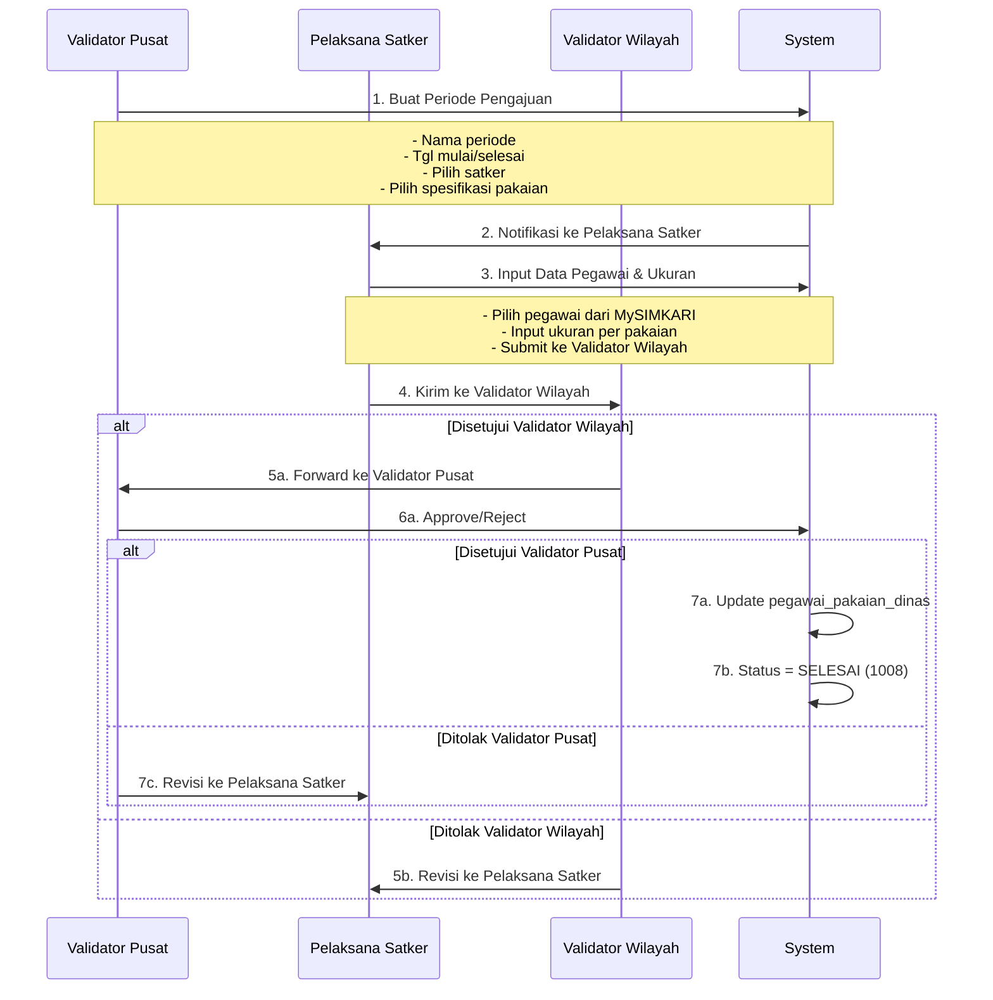
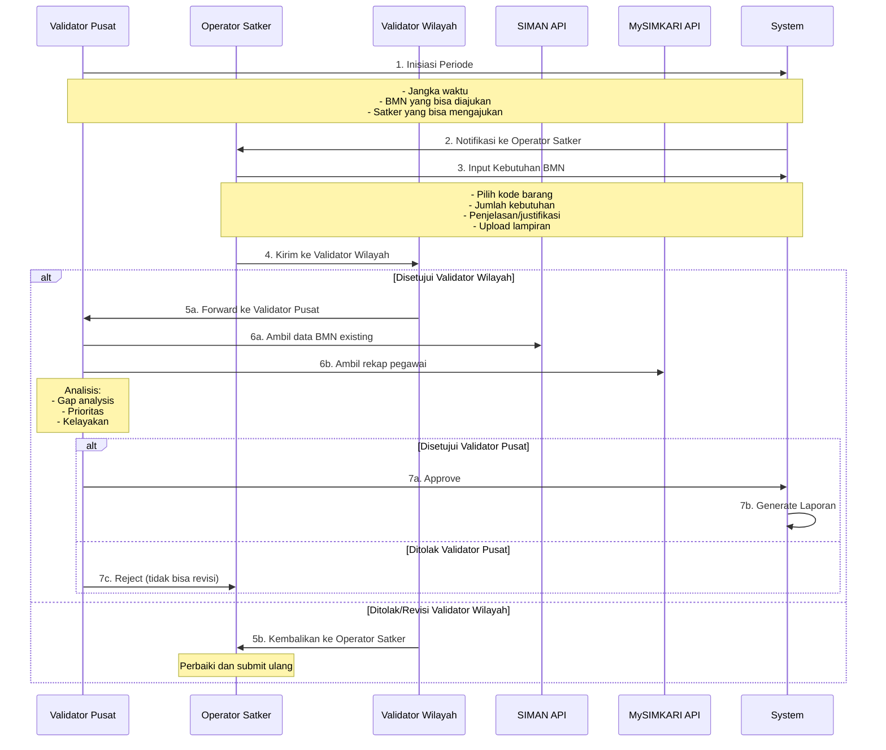
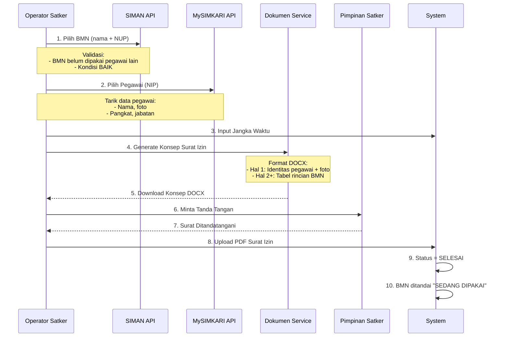
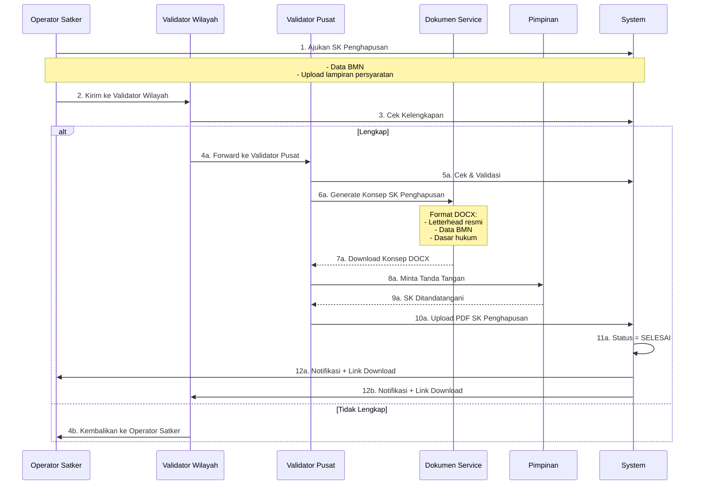

# Analisis Proses Bisnis SIMPEL - Berdasarkan simpel_web-main

**Tanggal Analisis:** 11 Februari 2026
**Sumber:** `simpel_web-main` (Laravel)
**Target:** SIMPelv2 (Rust + Leptos)

---

## 1. PAKAIAN DINAS - Analisis Proses Bisnis

### 1.1 Struktur Role yang Teridentifikasi

Dari kode Laravel, teridentifikasi role-role berikut:

| Role | Fungsi | Akses |
|------|--------|-------|
| **Validator Pusat** | Membuat periode pengajuan, melihat semua data | CREATE, VIEW |
| **Validator Wilayah** | Melihat data wilayah, approve/reject | VIEW, APPROVE |
| **Pelaksana Satker** | Input data pengajuan | INPUT |
| **Super Admin** | Full access | ALL |

### 1.2 Flow Proses Bisnis Pakaian Dinas (Dari Kode)



### 1.3 Status Workflow (ms_aktifitas_id)

| ID | Status | Deskripsi |
|----|--------|-----------|
| 1000 | DRAFT | Draft awal |
| 1001 | SUBMITTED_KEJARI | Disubmit oleh Kejari |
| 1003 | REVISION_FROM_KEJATI | Revisi dari Kejati |
| 1004 | APPROVED_KEJATI | Disetujui Kejati |
| 1005 | REVISION_FROM_KEJATI_TO_KEJARI | Revisi dari Kejati ke Kejari |
| 1007 | REVISION_FROM_KEJAGUNG | Revisi dari Kejagung |
| 1008 | COMPLETED | Selesai |
| 1009 | SUBMITTED_KEJAGUNG | Disubmit Kejagung (satker pusat) |
| 1010 | APPROVED_KEJATI_TO_KEJAGUNG | Disetujui Kejati, diteruskan ke Kejagung |
| 1011 | SUBMITTED_KEJARI | Disubmit Kejari |
| 1012 | APPROVED_KEJARI_TO_KEJATI | Disetujui Kejari, diteruskan ke Kejati |

### 1.4 Struktur Data Pakaian Dinas

**Tabel Utama:**

1. **pengajuan_pakaian_dinas** - Master periode pengajuan
   - id, nama, deskripsi, tgl_mulai, tgl_selesai, tahun
   - ms_aktifitas_id, is_reguler

2. **pengajuan_pakaian_dinas_satker_terpilih** - Satker yang dipilih
   - pengajuan_pakaian_dinas_id, ms_satker_id, ms_satker_pusat_id
   - is_show_in_form

3. **pengajuan_pakaian_dinas_pakaian** - Spesifikasi pakaian yang dipilih
   - pengajuan_pakaian_dinas_id, jenis_pakaian_id, spesifikasi_id
   - spesifikasi_ukuran_group (BAJU, CELANA, SEPATU)

4. **pengajuan_pakaian_dinas_satker** - Data pengajuan per satker
   - id, pengajuan_pakaian_dinas_id, ms_satker_id, ms_satker_pusat_id
   - ms_aktifitas_id

5. **pengajuan_pakaian_dinas_satker_pegawai** - Data pegawai per satker
   - id, pengajuan_pakaian_dinas_satker_id, nip, nama
   - pangkat, jabatan, with_hijab

6. **pengajuan_pakaian_dinas_satker_pegawai_ukuran** - Ukuran per pegawai per pakaian
   - pengajuan_pakaian_dinas_satker_pegawai_id
   - pengajuan_pakaian_dinas_pakaian_id
   - ukuran

7. **pengajuan_pakaian_dinas_satker_aktifitas** - History aktivitas
   - pengajuan_pakaian_dinas_satker_id, ms_aktifitas_id
   - komentar, created_by, created_at

8. **pegawai_pakaian_dinas** - Master data ukuran pegawai (hasil akhir)
   - nip, ukuran_baju, ukuran_celana, ukuran_sepatu
   - with_hijab, pangkat, jabatan
   - last_pengajuan_pakaian_dinas_satker_pegawai_id

### 1.5 Format Laporan

**Laporan Daftar (Individual):**
- Kolom: No, NIP, Nama, Pangkat, Jabatan, Eselon, Jenis Pegawai, Ukuran per Pakaian
- Filter: Jenis pegawai (TU/Jaksa), Eselon, Jenis Kelamin
- Format: PDF, Excel

**Laporan Rekap (Agregat):**
- Agregasi per ukuran dengan breakdown L/P
- Per satker
- Format: PDF, Excel

---

## 2. KEBUTUHAN BMN - Analisis Proses Bisnis

### 2.1 Flow Proses Bisnis (Berdasarkan Requirements)



### 2.2 Fitur Analisis Validator Pusat

**Data yang Digunakan:**
1. **Dari SIMAN:** Data BMN existing per satker
   - Jumlah BMN per kode barang
   - Kondisi BMN (BAIK, RUSAK RINGAN, RUSAK BERAT)

2. **Dari MySIMKARI:** Rekap pegawai per satker
   - Jumlah eselon (I, II, III, IV)
   - Jumlah non-eselon per golongan/pangkat
   - Breakdown Jaksa vs Non-Jaksa (TU)

**Analisis yang Dilakukan:**
- Gap Analysis: Kebutuhan vs Existing (kondisi BAIK)
- Prioritas berdasarkan scoring
- Kelayakan berdasarkan standar jumlah

---

## 3. PEMAKAIAN BMN - Analisis Proses Bisnis

### 3.1 Flow Proses Bisnis (Berdasarkan Requirements)



### 3.2 Fitur Tambahan

**Perpanjangan Izin:**
- Operator Satker bisa perpanjang izin yang akan habis
- Link ke izin sebelumnya (history tracking)

**Pencabutan Izin:**
- Operator Satker atau Admin bisa cabut izin
- Dengan alasan pencabutan
- BMN kembali tersedia

**Monitoring (Validator Wilayah & Pusat):**
- Lihat semua izin pemakaian
- Filter per BMN, per pegawai, per satker
- Lihat jangka waktu dan status

**Catatan Penting:**
- **Satu pegawai bisa mengajukan lebih dari satu BMN dalam satu surat izin**
- Format surat: Halaman 1 = identitas pegawai + foto, Halaman 2+ = tabel BMN

---

## 4. SK PENGHAPUSAN BMN - Analisis Proses Bisnis

### 4.1 Flow Proses Bisnis (Berdasarkan Requirements)



---

## 5. GAP ANALYSIS - Perbedaan dengan SIMPelv2

### 5.1 Struktur Role

| Aspek | simpel_web-main | SIMPelv2 (Target) | Action |
|-------|-----------------|-------------------|--------|
| Role Validator | Validator Pusat, Validator Wilayah | ✅ Sama | Keep |
| Role Operator | Pelaksana Satker | ✅ Operator Satker | Rename |
| Role Pegawai | ❌ Tidak ada akses langsung | ✅ Tidak ada akses langsung | ✅ Sesuai |
| Approval Flow | 3-level (Kejari→Kejati→Kejagung) | ✅ Sama | Keep |

### 5.2 Proses Bisnis Pakaian Dinas

| Aspek | simpel_web-main | SIMPelv2 (Target) | Action |
|-------|-----------------|-------------------|--------|
| Inisiasi | Validator Pusat buat periode | ✅ Sama | Keep |
| Input Data | Pelaksana Satker input | ✅ Operator Satker input | Rename role |
| Approval | 3-level approval | ✅ Sama | Keep |
| Laporan | Daftar + Rekap (PDF/Excel) | ✅ Sama | Keep |
| Format Laporan | Sesuai template Laravel | ⚠️ Perlu disesuaikan | **TODO: Buat template baru** |

### 5.3 Proses Bisnis Kebutuhan BMN

| Aspek | simpel_web-main | SIMPelv2 (Target) | Action |
|-------|-----------------|-------------------|--------|
| Inisiasi | ❌ Tidak ada | ✅ Validator Pusat inisiasi | **TODO: Implement** |
| Filter BMN | ❌ Tidak ada | ✅ Filter by standar kodefikasi | **TODO: Implement** |
| Filter Satker | ❌ Tidak ada | ✅ Pilih satker yang bisa ajukan | **TODO: Implement** |
| Input | Operator input kebutuhan | ✅ Sama | Keep |
| Lampiran | ❌ Tidak ada | ✅ Upload surat permohonan | **TODO: Implement** |
| Approval | 3-level approval | ✅ Sama | Keep |
| Analisis | ❌ Manual | ✅ Otomatis (SIMAN + MySIMKARI) | **TODO: Implement** |
| Reject | Bisa revisi | ✅ Reject final (tidak bisa revisi) | **CHANGE** |

### 5.4 Proses Bisnis Pemakaian BMN

| Aspek | simpel_web-main | SIMPelv2 (Target) | Action |
|-------|-----------------|-------------------|--------|
| Validasi BMN | ❌ Tidak ada | ✅ Cek apakah sudah dipakai | **TODO: Implement** |
| Generate Surat | ❌ Tidak ada | ✅ Generate DOCX konsep | **TODO: Implement** |
| Upload PDF | ❌ Tidak ada | ✅ Upload PDF yang sudah TTD | **TODO: Implement** |
| Multi BMN | ❌ Tidak jelas | ✅ 1 pegawai bisa ajukan >1 BMN | **TODO: Implement** |
| Format Surat | ❌ Tidak ada | ✅ Hal 1: Identitas + foto, Hal 2+: Tabel BMN | **TODO: Implement** |
| Perpanjangan | ❌ Tidak ada | ✅ Perpanjangan dengan history | **TODO: Implement** |
| Pencabutan | ❌ Tidak ada | ✅ Pencabutan dengan alasan | **TODO: Implement** |

### 5.5 Proses Bisnis SK Penghapusan BMN

| Aspek | simpel_web-main | SIMPelv2 (Target) | Action |
|-------|-----------------|-------------------|--------|
| Workflow | ❌ Frontend only | ✅ Full workflow backend | **TODO: Implement** |
| Generate SK | ❌ Tidak ada | ✅ Generate DOCX konsep | **TODO: Implement** |
| Upload PDF | ❌ Tidak ada | ✅ Upload PDF yang sudah TTD | **TODO: Implement** |
| Approval | ❌ Tidak ada | ✅ 3-level approval | **TODO: Implement** |

---

## 6. REKOMENDASI IMPLEMENTASI

### 6.1 Prioritas Implementasi

**PRIORITY 1 - CRITICAL (Week 1-2):**
1. ✅ Pakaian Dinas - Sesuaikan dengan flow simpel_web-main
2. ✅ Kebutuhan BMN - Implement inisiasi Validator Pusat
3. ✅ Kebutuhan BMN - Implement analisis otomatis

**PRIORITY 2 - HIGH (Week 3-4):**
4. ✅ Pemakaian BMN - Implement full workflow
5. ✅ SK Penghapusan BMN - Implement full workflow
6. ✅ Document generation - DOCX templates

**PRIORITY 3 - MEDIUM (Week 5-6):**
7. ✅ Laporan Pakaian Dinas - Sesuaikan format
8. ✅ Integration testing - End-to-end
9. ✅ UI/UX improvements

### 6.2 Alternatif Flow yang Lebih Baik

**Kebutuhan BMN - Alternatif 1 (RECOMMENDED):**
```
Validator Pusat Inisiasi
  ↓
Operator Satker Input (dengan batasan)
  ↓
Validator Wilayah Review
  ├─ Approve → Forward ke Validator Pusat
  └─ Revisi → Kembali ke Operator Satker
  ↓
Validator Pusat Analisis (dengan data SIMAN + MySIMKARI)
  ├─ Approve → Masuk prioritas + Generate laporan
  └─ Reject → Final (tidak bisa revisi)
```

**Kebutuhan BMN - Alternatif 2 (Lebih Fleksibel):**
```
Validator Pusat Inisiasi
  ↓
Operator Satker Input (dengan batasan)
  ↓
Validator Wilayah Review
  ├─ Approve → Forward ke Validator Pusat
  └─ Revisi → Kembali ke Operator Satker
  ↓
Validator Pusat Analisis (dengan data SIMAN + MySIMKARI)
  ├─ Approve → Masuk prioritas + Generate laporan
  ├─ Reject → Final (tidak bisa revisi)
  └─ Revisi dengan Catatan → Kembali ke Validator Wilayah (untuk kasus khusus)
```

**Rekomendasi:** Gunakan **Alternatif 1** untuk kesederhanaan dan kejelasan proses. Validator Pusat memiliki data lengkap untuk membuat keputusan final.

---

## 7. TECHNICAL SPECIFICATIONS

### 7.1 Database Schema Changes

**New Tables:**
```sql
-- Periode inisiasi kebutuhan BMN
CREATE TABLE perlengkapan.periode_kebutuhan_bmn (
    id UUID PRIMARY KEY,
    nama VARCHAR(255) NOT NULL,
    tahun_anggaran INTEGER NOT NULL,
    tgl_mulai DATE NOT NULL,
    tgl_selesai DATE NOT NULL,
    deskripsi TEXT,
    created_by UUID NOT NULL,
    created_at TIMESTAMPTZ NOT NULL DEFAULT NOW(),
    updated_at TIMESTAMPTZ NOT NULL DEFAULT NOW()
);

-- BMN yang diizinkan per periode
CREATE TABLE perlengkapan.periode_kebutuhan_bmn_kode_barang (
    periode_id UUID NOT NULL REFERENCES perlengkapan.periode_kebutuhan_bmn(id),
    kode_barang VARCHAR(50) NOT NULL,
    PRIMARY KEY (periode_id, kode_barang)
);

-- Satker yang diizinkan per periode
CREATE TABLE perlengkapan.periode_kebutuhan_bmn_satker (
    periode_id UUID NOT NULL REFERENCES perlengkapan.periode_kebutuhan_bmn(id),
    satker_id UUID NOT NULL REFERENCES authenc.satkers(id),
    PRIMARY KEY (periode_id, satker_id)
);

-- Lampiran kebutuhan BMN
CREATE TABLE perlengkapan.kebutuhan_bmn_lampiran (
    id UUID PRIMARY KEY,
    kebutuhan_bmn_id UUID NOT NULL REFERENCES perlengkapan.kebutuhan_bmn(id),
    nama_file VARCHAR(255) NOT NULL,
    file_path VARCHAR(500) NOT NULL,
    file_size BIGINT NOT NULL,
    mime_type VARCHAR(100) NOT NULL,
    uploaded_by UUID NOT NULL,
    uploaded_at TIMESTAMPTZ NOT NULL DEFAULT NOW()
);

-- Validasi BMN sedang dipakai
CREATE TABLE perlengkapan.bmn_usage_status (
    nup VARCHAR(50) PRIMARY KEY,
    is_in_use BOOLEAN NOT NULL DEFAULT FALSE,
    current_permit_id UUID REFERENCES perlengkapan.izin_pemakaian_bmn(id),
    updated_at TIMESTAMPTZ NOT NULL DEFAULT NOW()
);
```

### 7.2 API Endpoints

**Pakaian Dinas:**
```
POST   /api/v1/pakaian-dinas/periode                    # Validator Pusat buat periode
GET    /api/v1/pakaian-dinas/periode                    # List periode
GET    /api/v1/pakaian-dinas/periode/:id                # Detail periode
PUT    /api/v1/pakaian-dinas/periode/:id                # Update periode
DELETE /api/v1/pakaian-dinas/periode/:id                # Delete periode

POST   /api/v1/pakaian-dinas/pengajuan/:periode_id      # Operator Satker input
GET    /api/v1/pakaian-dinas/pengajuan/:periode_id      # List pengajuan per periode
PUT    /api/v1/pakaian-dinas/pengajuan/:id              # Update pengajuan
POST   /api/v1/pakaian-dinas/pengajuan/:id/submit       # Submit ke Validator Wilayah

POST   /api/v1/pakaian-dinas/pengajuan/:id/approve      # Approve (Validator Wilayah/Pusat)
POST   /api/v1/pakaian-dinas/pengajuan/:id/reject       # Reject (Validator Wilayah/Pusat)
POST   /api/v1/pakaian-dinas/pengajuan/:id/revisi       # Revisi (Validator Wilayah/Pusat)

GET    /api/v1/pakaian-dinas/laporan/daftar             # Laporan daftar (PDF/Excel)
GET    /api/v1/pakaian-dinas/laporan/rekap              # Laporan rekap (PDF/Excel)
```

**Kebutuhan BMN:**
```
POST   /api/v1/kebutuhan-bmn/periode                    # Validator Pusat inisiasi
GET    /api/v1/kebutuhan-bmn/periode                    # List periode
GET    /api/v1/kebutuhan-bmn/periode/:id                # Detail periode

POST   /api/v1/kebutuhan-bmn/pengajuan                  # Operator Satker input
POST   /api/v1/kebutuhan-bmn/pengajuan/:id/lampiran     # Upload lampiran
GET    /api/v1/kebutuhan-bmn/pengajuan/:id/analisis     # Validator Pusat lihat analisis

POST   /api/v1/kebutuhan-bmn/pengajuan/:id/approve      # Approve
POST   /api/v1/kebutuhan-bmn/pengajuan/:id/reject       # Reject (final)
POST   /api/v1/kebutuhan-bmn/pengajuan/:id/revisi       # Revisi (Validator Wilayah only)

GET    /api/v1/kebutuhan-bmn/laporan/analisis           # Laporan analisis (PDF/DOCX/Excel)
```

**Pemakaian BMN:**
```
GET    /api/v1/pemakaian-bmn/bmn-available              # List BMN yang tersedia
POST   /api/v1/pemakaian-bmn/validate-bmn               # Validasi BMN belum dipakai
POST   /api/v1/pemakaian-bmn/generate-konsep            # Generate konsep surat (DOCX)
POST   /api/v1/pemakaian-bmn/upload-pdf                 # Upload PDF yang sudah TTD
POST   /api/v1/pemakaian-bmn/perpanjang/:id             # Perpanjang izin
POST   /api/v1/pemakaian-bmn/cabut/:id                  # Cabut izin

GET    /api/v1/pemakaian-bmn/monitoring                 # Monitoring (Validator Wilayah/Pusat)
```

**SK Penghapusan BMN:**
```
POST   /api/v1/penghapusan-bmn                          # Operator Satker ajukan
POST   /api/v1/penghapusan-bmn/:id/lampiran             # Upload lampiran
POST   /api/v1/penghapusan-bmn/:id/approve              # Approve (Validator Wilayah/Pusat)
POST   /api/v1/penghapusan-bmn/:id/revisi               # Revisi (Validator Wilayah only)
POST   /api/v1/penghapusan-bmn/:id/generate-sk          # Generate konsep SK (DOCX)
POST   /api/v1/penghapusan-bmn/:id/upload-sk            # Upload SK yang sudah TTD
```

---

## 8. NEXT STEPS

1. **Review dokumen ini** dan berikan approval/feedback
2. **Pilih alternatif flow** untuk Kebutuhan BMN (Alternatif 1 atau 2)
3. **Confirm format laporan** Pakaian Dinas (apakah perlu sama persis dengan simpel_web-main?)
4. **Mulai implementasi** sesuai prioritas yang sudah ditentukan

---

**Status:** DRAFT - Menun
