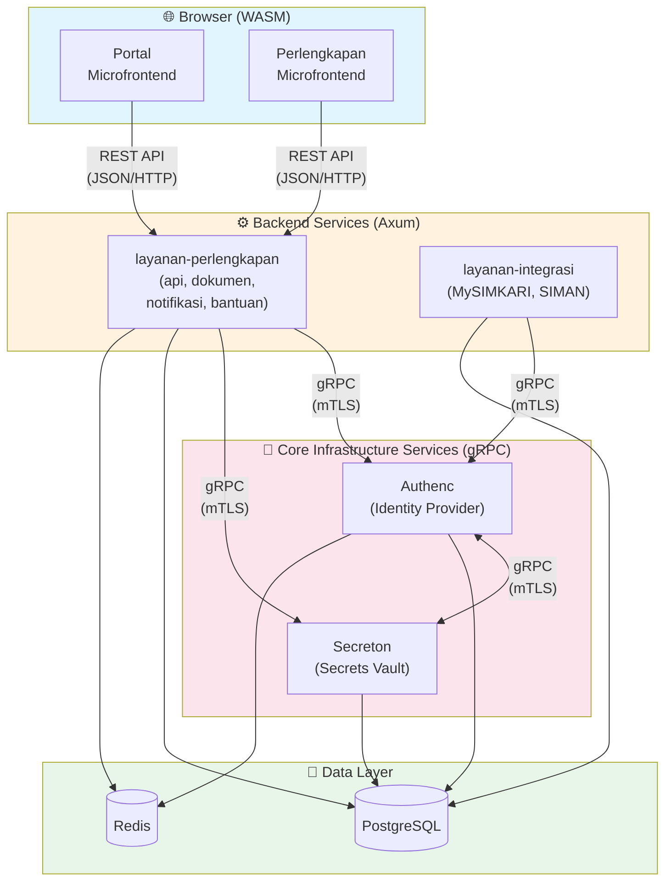
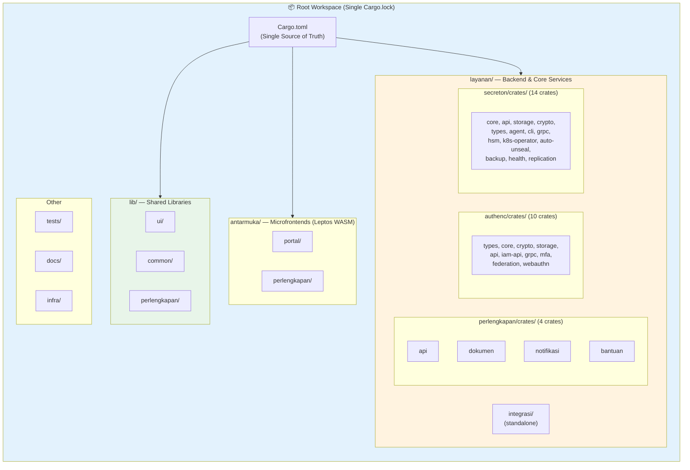
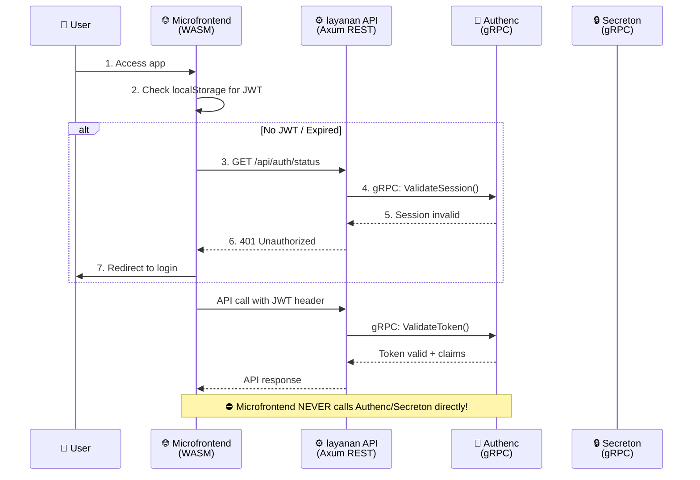

# 🤖 AGENTS.md - AI Developer Guide for SIMPEL

> **Notice to Agents**: This file serves as the **primary source of truth** for AI agents working on this repository. Read this before planning or executing tasks to understand the architecture, conventions, and workflows.

## 🌍 Project Context

**SIMPEL** (Sistem Informasi Perlengkapan) is a mission-critical **Rust Monorepo** for the Indonesian Attorney General's Office (Kejaksaan RI). It uses a modular crate-based architecture for backend services (`layanan/`) and a microfrontend architecture for the frontend (`antarmuka/`).

- **Production URL:** https://simpel.kejaksaan.go.id/
- **Compliance:** Zero-trust security, government standards

### 🔑 Key Tech Stack

| Component | Technology | Version |
|-----------|------------|---------|
| **Language** | Rust (Edition 2024, MSRV 1.90+) | 1.93+ |
| **Backend HTTP** | Axum (REST API) | 0.8.7 |
| **Backend gRPC** | Tonic + Prost | 0.14.x |
| **Frontend** | Leptos (WASM CSR) | 0.8.14 |
| **Database** | PostgreSQL (tokio-postgres / deadpool) | 15+ |
| **Caching** | Redis | — |
| **Infrastructure** | Docker, Kubernetes | — |
| **Identity** | Authenc (custom OAuth2/OIDC via gRPC) | — |
| **Secrets** | Secreton (custom vault via gRPC) | — |

---

## 🏛️ System Architecture



### 🚨 Critical Communication Rules

| From | To | Protocol | Allowed? |
|------|-----|----------|----------|
| Microfrontend | Backend Service | **REST API** (JSON/HTTP) | ✅ YES |
| Microfrontend | Authenc | ❌ FORBIDDEN | ⛔ NO |
| Microfrontend | Secreton | ❌ FORBIDDEN | ⛔ NO |
| Backend Service | Backend Service | **gRPC** (Protobuf) | ✅ YES |
| Backend Service | Authenc | **gRPC** (mTLS) | ✅ YES |
| Backend Service | Secreton | **gRPC** (mTLS) | ✅ YES |
| Authenc | Secreton | **gRPC** (mTLS) | ✅ YES |

---

## 🏗️ Workspace Structure



### Directory Layout

```bash
simpel2/
├── Cargo.toml               # ROOT WORKSPACE MANIFEST (Single source of truth)
├── Cargo.lock               # Unified lockfile for all workspace members
├── lib/                     # SHARED LIBRARIES
│   ├── ui/                  # UI components (lib-ui) — Leptos shared components
│   ├── common/              # Common utilities (lib-common) — types, config, crypto
│   └── perlengkapan/        # Perlengkapan domain types (lib-perlengkapan)
├── antarmuka/               # FRONTEND MICROFRONTENDS (Leptos WASM CSR)
│   ├── portal/              # Portal microfrontend — SSO gateway
│   └── perlengkapan/        # Perlengkapan microfrontend — BMN management
├── layanan/                 # BACKEND SERVICES & CORE INFRASTRUCTURE
│   ├── perlengkapan/        # Perlengkapan domain backend
│   │   └── crates/          # → api, dokumen, notifikasi, bantuan
│   ├── integrasi/           # Integrasi layanan eksternal (MySIMKARI, SIMAN)
│   ├── authenc/             # Identity Provider (OAuth2, OIDC, MFA, RBAC, SAML)
│   │   └── crates/          # → types, core, crypto, storage, api, iam-api,
│   │                        #   grpc, mfa, federation, webauthn
│   └── secreton/            # Secrets Vault (Transit, PKI, HSM, Auto-Unseal)
│       └── crates/          # → core, api, storage, crypto, types, agent,
│                            #   cli, grpc, hsm, k8s-operator, auto-unseal,
│                            #   backup, health, replication
├── tests/                   # INTEGRATION & E2E TESTS
│   ├── e2e/                 # End-to-end tests
│   ├── load/                # Load/performance tests
│   └── verification/        # Verification scripts
├── docs/                    # ENGINEERING DOCUMENTATION
├── infra/                   # OPERATIONS & INFRASTRUCTURE
│   ├── k8s/                 # Kubernetes manifests (Kustomize)
│   ├── monitoring/          # Prometheus, Grafana configs
│   └── nginx/               # Nginx configs
├── .github/                 # GitHub Actions & templates
└── .gitlab-ci.yml           # GitLab CI/CD pipeline
```

### Naming Conventions

| Type | Directory Location | Package Name Schema | Example |
|------|-------------------|---------------------|---------|
| **Microfrontend** | `antarmuka/[name]/` | (per Cargo.toml) | `antarmuka/portal` |
| **Domain Service** | `layanan/[domain]/crates/[name]/` | `[domain]-[name]` | `layanan-perlengkapan-api` |
| **Core Service** | `layanan/[core]/crates/[name]/` | `[core]-[name]` | `authenc-core`, `secreton-grpc` |
| **Shared Library** | `lib/[name]/` | `lib-[name]` | `lib-ui`, `lib-common` |

---

## 📏 Critical Conventions (DO NOT VIOLATE)

### 1. 📦 Dependency Management

- **Root Cargo.toml is King**: ALL external dependencies MUST be defined in `[workspace.dependencies]`
- **Inheritance**: Member crates MUST use `dependency_name = { workspace = true }`
- **NEVER specify versions** in member `Cargo.toml` files
- **lib-ui**: Use for shared Leptos UI components
- **lib-common**: Use for shared types, database config, utilities, crypto helpers
- **Unified Workspace**: ALL services including `authenc` and `secreton` crates are part of the main workspace

### 2. 🧹 Code Quality Commands

```bash
# Verification & Building
cargo check --workspace          # Quick compilation check
cargo build --workspace          # Full workspace build
cargo build -p authenc-core      # Build specific crate
cargo build -p secreton-api      # Build specific crate

# Code Quality
cargo fmt --all                  # Format all code
cargo clippy --workspace         # Lint with warnings as errors

# Testing
cargo test --workspace           # Run all tests
cargo test -p authenc-core       # Test specific crate

# Security
cargo audit                      # Check for vulnerabilities
cargo deny check                 # Check licenses and advisories

# Frontend (Leptos WASM)
cd antarmuka/portal && trunk serve --open    # Dev server with hot reload
cd antarmuka/portal && trunk build --release # Production build
```

---

## 🦀 Code Patterns

### Axum 0.8.x Pattern (Backend REST API)

```rust
use axum::{
    extract::{Path, Query, State, Json},
    routing::{get, post, put, delete},
    Router,
    http::StatusCode,
    response::IntoResponse,
};
use std::sync::Arc;
use tokio::net::TcpListener;

// ✅ Application State with gRPC clients
#[derive(Clone)]
pub struct AppState {
    pub db_pool: deadpool_postgres::Pool,
    pub redis: redis::aio::ConnectionManager,
    pub authenc_client: AuthencGrpcClient,   // gRPC to Authenc
    pub secreton_client: SecretonGrpcClient, // gRPC to Secreton
}

// ✅ Router setup with State
pub fn create_router(state: Arc<AppState>) -> Router {
    Router::new()
        .route("/api/v1/items", get(list_items).post(create_item))
        .route("/api/v1/items/{id}", get(get_item).put(update_item))
        .layer(tower_http::trace::TraceLayer::new_for_http())
        .with_state(state)
}

// ✅ Handler with extractors
async fn get_item(
    State(state): State<Arc<AppState>>,
    Path(id): Path<uuid::Uuid>,
) -> Result<Json<Item>, AppError> {
    let client = state.db_pool.get().await?;
    let row = client.query_one("SELECT * FROM items WHERE id = $1", &[&id]).await?;
    Ok(Json(Item::try_from(row)?))
}
```

### Tonic + Prost Pattern (gRPC)

```rust
// build.rs — Generate gRPC code from proto
fn main() -> Result<(), Box<dyn std::error::Error>> {
    tonic_prost_build::Config::new()
        .out_dir("src/generated")
        .compile_protos(&["proto/auth.proto"], &["proto/"])?;
    Ok(())
}

// gRPC Client (layanan → authenc)
use tonic::transport::Channel;

pub async fn create_authenc_client() -> Result<AuthServiceClient<Channel>, tonic::transport::Error> {
    let channel = Channel::from_static("https://authenc.internal:50051")
        .tls_config(tonic::transport::ClientTlsConfig::new())?
        .connect().await?;
    Ok(AuthServiceClient::new(channel))
}
```

### Leptos 0.8.x Pattern (Microfrontend WASM)

```rust
use leptos::prelude::*;
use lib_ui::prelude::*;  // Shared UI components

// ✅ Signal creation (NOT create_signal!)
#[component]
pub fn Counter(initial: i32) -> impl IntoView {
    let (count, set_count) = signal(initial);

    let increment = move |_| *set_count.write() += 1;
    let decrement = move |_| *set_count.write() -= 1;

    view! {
        <div class="counter">
            <button on:click=decrement>"-1"</button>
            <span>{count}</span>
            <button on:click=increment>"+1"</button>
        </div>
    }
}

// ✅ Resource for async data (calls REST API, NOT gRPC!)
#[component]
pub fn UserList() -> impl IntoView {
    let users = Resource::new(
        || (),
        |_| async move {
            gloo_net::http::Request::get("/api/v1/users")
                .send().await?.json::<Vec<User>>().await
        }
    );

    view! {
        <Suspense fallback=|| view! { <Loading /> }>
            {move || users.get().map(|result| match result {
                Ok(users) => view! { <UserTable users=users /> }.into_any(),
                Err(e) => view! { <Error message=e.to_string() /> }.into_any(),
            })}
        </Suspense>
    }
}

// ✅ Main mount (CSR)
pub fn main() {
    console_error_panic_hook::set_once();
    leptos::mount::mount_to_body(App);
}
```

---

## 🔐 Authentication Flow



### Auth Patterns in Code

```rust
// In microfrontend — use hooks from lib-ui
use lib_ui::hooks::use_auth;

// Session stored in localStorage (NOT sessionStorage) for cross-tab sync
// JWT validation: microfrontend → REST → gRPC Authenc
```

### Secrets Management

```rust
// In layanan backend — call Secreton via gRPC
let secret = state.secreton_client
    .get_secret(GetSecretRequest { key: "database_password".into() })
    .await?
    .into_inner()
    .value;

// NEVER use environment variables for secrets in production!
```

---

## ⚠️ Common Pitfalls

❌ **DON'T:**
- Call Authenc/Secreton directly from microfrontend
- Use `create_signal` in Leptos 0.8.x (use `signal()`)
- Duplicate auth logic in microfrontends (redirect to Portal)
- Specify dependency versions in member `Cargo.toml` files
- Use RSA for new signing implementations (use Ed25519)
- Use environment variables for production secrets (use Secreton)
- Store JWT tokens in cookies (use `localStorage`)

✅ **DO:**
- Import from `lib_ui` for shared UI components
- Add new dependencies to root `Cargo.toml` `workspace.dependencies` first
- Run `cargo fmt --all && cargo clippy --workspace` before commits
- Use REST API from microfrontend → layanan
- Use gRPC from layanan → authenc/secreton
- Use `trunk build --release` for production WASM builds

---

## 🔍 Pre-Implementation Checklist

Before implementing a feature, check:

1. **Auth-related?** → Use Portal + `use_auth()` hook, flow: microfrontend → REST → gRPC
2. **Needs secrets?** → Use Secreton gRPC client in layanan (NOT env vars)
3. **Reusable UI?** → Put in `lib/ui/`, import via `lib_ui`
4. **New dependency?** → Add to root `Cargo.toml` `[workspace.dependencies]` first
5. **Database?** → Each service has its own database for isolation

---

## 📚 Key Documentation References

| Topic | Location |
|-------|----------|
| Authenc details | `layanan/authenc/AGENTS.md` |
| Secreton details | `layanan/secreton/AGENTS.md` |
| Shared UI lib | `lib/ui/README.md` |
| Shared common lib | `lib/common/README.md` |
| Shared perlengkapan lib | `lib/perlengkapan/README.md` |
| Kubernetes deploy | `infra/k8s/` |
| Engineering docs | `docs/README.md` |
| Contributing guide | `CONTRIBUTING.md` |

---

## 🗄️ Database Architecture

Each service uses a separate database for isolation:

| Database | Service | Description |
|----------|---------|-------------|
| `perlengkapan` | layanan/perlengkapan/* | Core BMN & equipment management |
| `authenc` | layanan/authenc/* | Authentication, SSO, OIDC & Identity |
| `secreton` | layanan/secreton/* | Secrets, HSM & transit vault |

---

## 🛡️ Security Patterns

- **Zero-trust:** No implicit trust between services, all via mTLS
- **JWT validation:** On every request via middleware → Authenc gRPC
- **Audit logs:** Immutable PostgreSQL logging
- **Cryptography:** Ed25519 (signing), X25519 (key exchange), ChaCha20-Poly1305 (encryption)
- **Password hashing:** Argon2id with recommended parameters
- **Post-quantum:** ML-DSA, ML-KEM (experimental, feature-gated in authenc-crypto)

> **Catatan Akhir**: Arsitektur modular *crates/* ditujukan untuk memisahkan domain boundary dengan ketat. Harap pastikan setiap crate hanya bertanggung jawab pada satu lingkup (misalnya `api`, `core`, `storage`).
