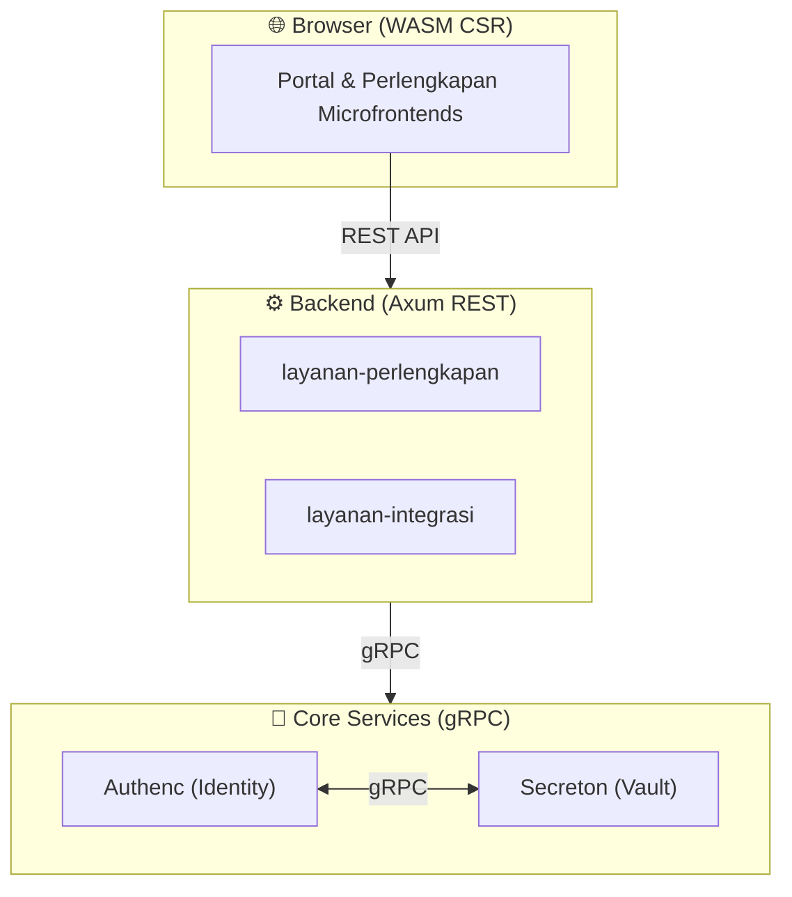

# 🤖 AGENTS.md - AI Developer Guide for SIMPEL

> **Notice to Agents**: This file is the **Single Source of Truth** for the project's macro-architecture.
> **DO NOT LOOK FOR CODE EXAMPLES HERE.** This file is deliberately kept short to prevent AI context truncation. Use the **AI Routing Guide** below to find specific code patterns.

## 📑 Daftar Isi (Table of Contents)
1. 🗺️ AI Routing Guide
2. 🌍 Project Context
3. 🏛️ System Architecture & Contracts
4. 🏗️ Workspace Structure
5. 📏 Critical Conventions (Absolute Rules)
6. ⚠️ Common Pitfalls (DO & DON'T)
7. ✅ Pre-Implementation Checklist

## 🗺️ AI Routing Guide (Read This First!)
Berdasarkan lokasi file yang sedang Anda kerjakan, baca `AGENTS.md` spesifik di direktori tersebut untuk mengetahui aturan teknis (Axum, Leptos, gRPC, dll):

- ⚙️ **Backend Services**: Baca `layanan/AGENTS.md` (Pola Axum, gRPC, PostgreSQL, Observability).
- 🌐 **Frontend (WASM)**: Baca `antarmuka/AGENTS.md` (Pola Leptos v0.8.x, Signals, CSS).
- 🏗️ **Legacy/Monolith (Laravel)**: Baca `monolith/AGENTS.md` (Aplikasi Monolitik Umum) atau `monolith/simpelv1/AGENTS.md` (Untuk proyek PHP spesifik).
- 📦 **Shared Libraries**: Baca `lib/AGENTS.md` (Aturan library mandiri).
- 🔐 **Authenc Service**: Baca `layanan/authenc/AGENTS.md` (Aturan OAuth2, OIDC, Identity).
- 🔒 **Secreton Service**: Baca `layanan/secreton/AGENTS.md` (Aturan Secrets Vault).
- 🔗 **Integrasi Service**: Baca `layanan/integrasi/AGENTS.md` (MonSAKTI, MySIMKARI, SIMAN).
- 🛠️ **Perlengkapan Service**: Baca `layanan/perlengkapan/AGENTS.md` (Backend BMN).
- 🚢 **Infrastructure & DevOps**: Baca `infra/AGENTS.md` (GitOps, Kubernetes, Secrets).
- 🧪 **Global Testing (E2E/Integration)**: Baca `tests/AGENTS.md` (Playwright, Load Tests).
- 📖 **Documentation & ADRs**: Baca `docs/AGENTS.md` (Standar Penulisan, Mermaid).

## 🌍 Project Context
**SIMPEL** adalah sistem monorepo Rust kritikal untuk Kejaksaan RI. Backend menggunakan arsitektur *modular monolith* (`layanan/`) dan antarmuka menggunakan Microfrontends Leptos (`antarmuka/`).
- **Production URL:** https://simpel.kejaksaan.go.id/
- **Compliance:** Zero-trust security, government standards
- **Precedence**: `AGENTS.md` (root) > `<domain>/AGENTS.md` > `README.md`.

## 🏛️ System Architecture & Contracts

- **Frontend → Backend**: Wajib via REST API (JSON/HTTP). Frontend DILARANG mengakses infrastruktur core (Authenc/Secreton).
- **Backend → Backend/Core**: Wajib via gRPC (mTLS).

### Canonical localStorage Keys

| Key | Purpose |
|-----|---------|
| `auth_token` | JWT access token (canonical) |
| `refresh_token` | JWT refresh token |
| `logout_event` | Cross-tab logout broadcast |
| `temp_token` | MFA flow temporary token |

⛔ **DO NOT** use alternative key names (e.g. `simpel_access_token`, `jwt_token`).

## 🏗️ Workspace Structure
- **`Cargo.toml` (Root)**: Single source of truth untuk SEMUA dependensi eksternal.
- **`antarmuka/`**: Frontend WASM (Portal, Perlengkapan).
- **`layanan/`**: Backend services & Core infra (Perlengkapan, Integrasi, Authenc, Secreton).
- **`lib/`**: Shared crates (`lib-ui`, `lib-core`, `lib-backend`, `lib-crypto`, `lib-perlengkapan`).
- **`monolith/`**: Kode aplikasi monolitik umum. Berisi `monolith/simpelv1/` (PHP/Laravel).

### Key Tech Stack

| Component | Technology | Version |
|-----------|------------|---------|
| **Language** | Rust (Edition 2024, MSRV 1.90+) | 1.93+ |
| **Backend HTTP** | Axum (REST API) | 0.8.7 |
| **Backend gRPC** | Tonic + Prost | 0.14.x |
| **Frontend** | Leptos (WASM CSR) | 0.8.14 |
| **Database** | PostgreSQL (tokio-postgres / deadpool) | 15+ |
| **Caching** | Redis | — |
| **Identity** | Authenc (custom OAuth2/OIDC via gRPC) | — |
| **Secrets** | Secreton (custom vault via gRPC) | — |

## 📏 Critical Conventions (Absolute Rules)

1. **Dependency Management**:
   - ALL external dependencies MUST be in `[workspace.dependencies]` di Root `Cargo.toml`.
   - Member crates MUST use `dependency_name = { workspace = true }`. Jangan pernah menaruh versi di crate anak.
2. **Database Rules**: ⛔ **DO NOT USE SQLx**. Gunakan `tokio-postgres` + `deadpool-postgres` + `refinery`. Setiap layanan (authenc, perlengkapan, secreton) menggunakan DB terpisah.
3. **Secrets (Zero-Trust)**:
   - **Source of truth produksi & staging**: Secreton vault (`kv/<service>/...`).
   - **Auth**: Setiap pod project SA token (audience `secreton`) → exchange via `POST /v1/auth/kubernetes/login` → Secreton client token. **JANGAN** pakai `SECRETON_TOKEN` env (dev lokal saja).
   - **Image registry resmi**: `ghcr.io/analisaperlengkapan/simpel2/<service>` dengan tag SemVer immutable (`v0.1.0`). DILARANG mutable tag (`latest`/`stag`/`prod`).
   - Detail: `infra/AGENTS.md` section "Secret Management Zero-Trust".
4. **Library Boundaries**: `lib/common/` telah dipecah menjadi `lib/core/` (WASM-safe types), `lib/backend/` (infrastruktur backend), dan `lib/crypto/` (primitif kripto). DILARANG menambahkan dependensi async (`tokio`, `axum`) ke `lib-core`. Buat crate shared spesifik baru di `lib/` jika diperlukan.
5. **Security**: Zero-trust antar layanan. Validasi JWT di setiap request REST via middleware yang memanggil Authenc gRPC. Password hash menggunakan Argon2.

## ⚠️ Common Pitfalls (DO & DON'T)

❌ **DON'T:**
- Call Authenc/Secreton directly from microfrontend.
- Use `create_signal` in Leptos 0.8.x (use `signal()`).
- Specify dependency versions in member `Cargo.toml` files.
- Use RSA (use Ed25519).
- Store JWT tokens in cookies (use `localStorage`).
- Use `.unwrap()` in production (use `?` and custom `AppError`).

✅ **DO:**
- Gunakan alat *search* (grep/view_file) ke `AGENTS.md` spesifik jika butuh contoh kode.
- Jalankan `cargo fmt --all && cargo clippy --workspace` sebelum *commit*.
- Gunakan REST API untuk MFE → Backend, dan gRPC untuk Backend → Core.

## ✅ Pre-Implementation Checklist
1. **Auth-related?** → Gunakan Portal + `use_auth()` hook. Flow: MFE → REST → gRPC.
2. **Needs secrets?** → Gunakan Secreton client di backend dengan **Kubernetes Auth Backend** (BUKAN `SECRETON_TOKEN` env). Pod project SA token → exchange ke Secreton token → fetch dari `kv/<service>/...`. Untuk simpelv1 (PHP/Laravel): init container `fetch-secrets` generate `.env` ke emptyDir saat pod start.
3. **Reusable UI?** → Masukkan ke `lib/ui/`, lalu impor.
4. **New dependency?** → Tambahkan ke root `Cargo.toml` `[workspace.dependencies]` terlebih dahulu.
