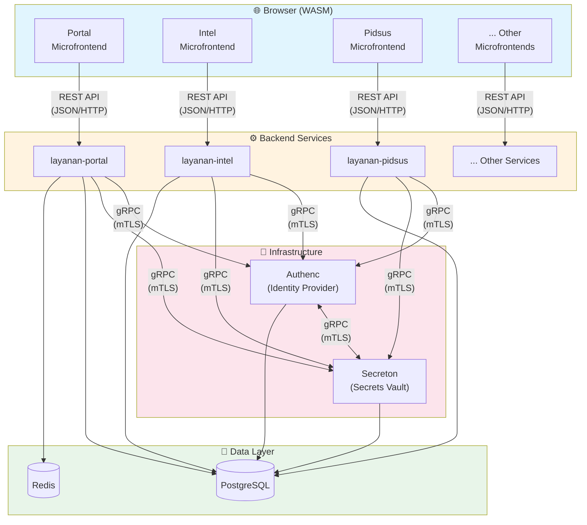
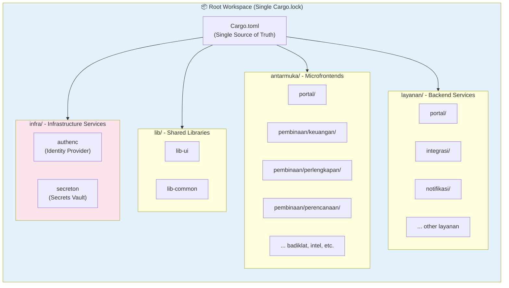
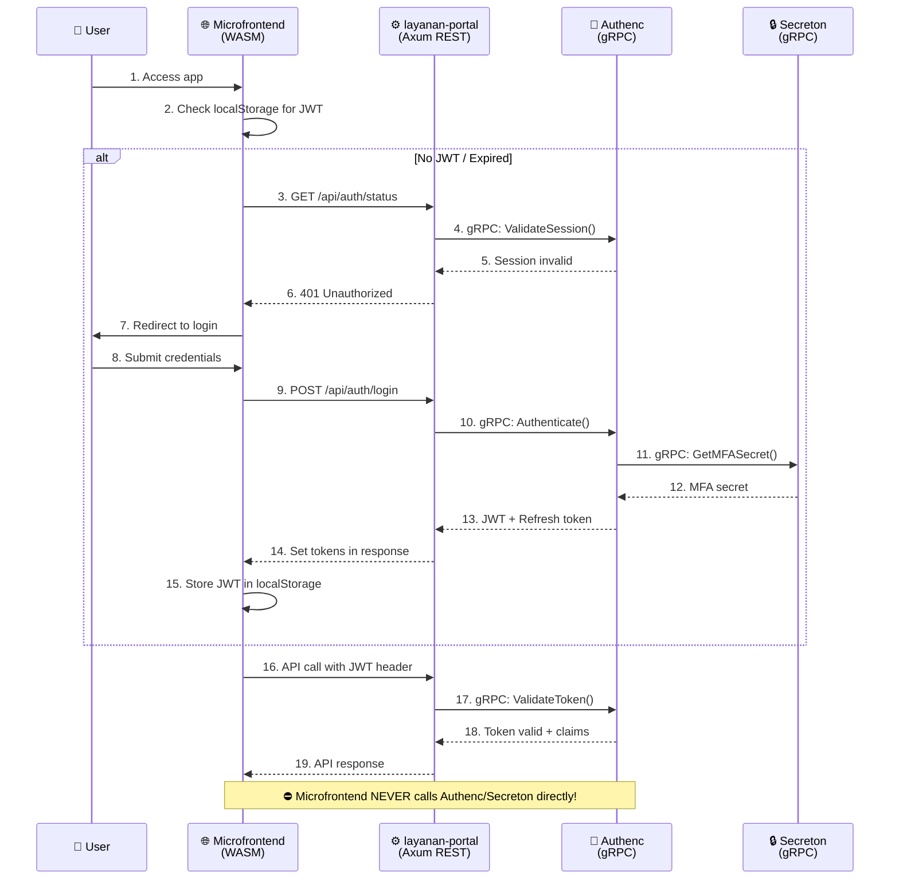

# 🤖 AGENTS.md - AI Developer Guide for SIMPelv2

> **Notice to Agents**: This file serves as the **primary source of truth** for AI agents working on this repository. Read this before planning or executing tasks to understand the architecture, conventions, and workflows.

## 🌍 Project Context

**SIMPEL** is a mission-critical **Rust Monorepo** for the Indonesian Attorney General's Office (Kejaksaan RI). It uses a microservices architecture for the backend (`layanan/`) and a microfrontend architecture for the frontend (`antarmuka/`).

### 🔑 Key Tech Stack

| Component | Technology |
|-----------|------------|
| **Language** | Rust (Edition 2024, MSRV 1.90+) |
| **Backend HTTP** | Axum 0.8.x (REST API) |
| **Backend gRPC** | Tonic 0.14.x + Prost 0.14.x |
| **Frontend** | Leptos 0.8.x (WASM CSR) |
| **Database** | PostgreSQL (tokio-postgres / deadpool) |
| **Caching** | Redis |
| **Infrastructure** | Docker, Kubernetes |
| **Identity** | Authenc (custom OAuth2/OIDC via gRPC) |
| **Secrets** | Secreton (custom vault via gRPC) |

---

## 🏛️ System Architecture



### 🚨 Critical Communication Rules

| From | To | Protocol | Allowed? |
|------|-----|----------|----------|
| Microfrontend | Backend Service | **REST API** (JSON/HTTP) | ✅ YES |
| Microfrontend | Authenc | ❌ FORBIDDEN | ⛔ NO |
| Microfrontend | Secreton | ❌ FORBIDDEN | ⛔ NO |
| Backend Service | Backend Service | **gRPC** (Protobuf) | ✅ YES |
| Backend Service | Authenc | **gRPC** (mTLS) | ✅ YES |
| Backend Service | Secreton | **gRPC** (mTLS) | ✅ YES |
| Authenc | Secreton | **gRPC** (mTLS) | ✅ YES |

---

## 🏗️ Workspace Structure



### Directory Layout

```bash
/var/www/simpelv2/
├── Cargo.toml          # ROOT WORKSPACE MANIFEST (Single source of truth)
├── lib/                # SHARED LIBRARIES
│   ├── ui/             # UI components (lib-ui) - Leptos components
│   └── common/         # Common utilities (lib-common) - shared types, config
├── antarmuka/          # FRONTEND MICROFRONTENDS (Leptos WASM)
│   ├── portal/         # Portal microfrontend (legacy: daskrimti)
│   ├── pembinaan/      # Pembinaan domain
│   │   ├── keuangan/   # Keuangan microfrontend
│   │   ├── perencanaan/  # Perencanaan microfrontend
│   │   └── perlengkapan/ # Perlengkapan microfrontend
│   ├── badiklat/       # Badiklat microfrontend
│   ├── datun/          # Datun microfrontend
│   ├── intel/          # Intel microfrontend
│   ├── pemulihan_aset/ # Pemulihan Aset microfrontend
│   ├── pengawasan/     # Pengawasan microfrontend
│   ├── pidmil/         # Pidmil microfrontend
│   ├── pidsus/         # Pidsus microfrontend
│   └── pidum/          # Pidum microfrontend
├── layanan/            # BACKEND MICROSERVICES (Axum + Tonic)
│   ├── portal/         # Portal backend API (legacy: layanan-*)
│   │   ├── integrasi/  # MonSAKTI/MySIMKARI/SIMAN integration
│   │   ├── notifikasi/ # Notification service
│   │   ├── ai/         # AI service
│   │   ├── bantuan/    # Bantuan service
│   │   └── dokumen/    # Document service
│   ├── pembinaan/      # Pembinaan domain services
│   │   ├── keuangan/   # Keuangan backend
│   │   ├── perencanaan/  # Perencanaan backend
│   │   └── perlengkapan/ # Perlengkapan backend
│   └── [domain]/       # Other domain services (badiklat, intel, etc.)
└── infra/              # INFRASTRUCTURE (Part of main workspace!)
    ├── authenc/        # Identity Provider (OAuth2/OIDC, MFA, RBAC)
    ├── secreton/       # Secrets Vault (Transit, PKI, HSM)
    ├── k8s/            # Kubernetes manifests (Kustomize)
    ├── monitoring/     # Prometheus, Grafana configs
    └── nginx/          # Nginx configs
```

### Naming Conventions

> **Catatan migrasi:** Beberapa dokumentasi lama menggunakan namespace `daskrimti`. Di repositori ini nama domain telah disederhanakan — gunakan `portal/` (atau `layanan/portal`) saat menavigasi kode. Simpan referensi lama saat merujuk ke tugas migrasi.

| Type | Directory Location | Package Name Schema | Example |
|------|-------------------|---------------------|---------|
| **Microfrontend** | `antarmuka/[domain]/[name]/` | `[name]-microfrontend` | `portal-microfrontend` |
| **Microservice** | `layanan/[domain]/[name]/` | `layanan-[domain]-[name]` | `layanan-portal` |
| **Shared Lib** | `lib/[name]/` | `lib-[name]` | `lib-ui`, `lib-common` |
| **Infra Service** | `infra/[name]/` | `[name]` | `authenc`, `secreton` |

---

## 📏 Critical Conventions (DO NOT VIOLATE)

### 1. 📦 Dependency Management

- **Root Cargo.toml is King**: ALL external dependencies MUST be defined in `[workspace.dependencies]`
- **Inheritance**: Member crates MUST use `dependency_name = { workspace = true }`
- **NEVER specify versions** in member `Cargo.toml` files
- **lib-ui**: Use `lib-ui` directly (no alias), contains Leptos UI components
- **lib-common**: Use `lib-common` for shared types, database config, utilities
- **Unified Workspace**: `layanan/authenc` and `layanan/secreton` are PART of the main workspace

### 2. 🧹 Code Quality Commands

```bash
# Verification & Building
cargo check --workspace          # Quick compilation check
cargo build --workspace          # Full workspace build
cargo build --bin authenc        # Build Authenc specifically
cargo build --bin secreton       # Build Secreton specifically
cargo build --bin layanan-integrasi  # Build specific service

# Code Quality
cargo fmt --all                  # Format all code
cargo clippy --workspace         # Lint with warnings as errors

# Testing
cargo test --workspace           # Run all tests

# Security
cargo audit                      # Check for vulnerabilities
cargo deny check                 # Check licenses and advisories

# Frontend (Leptos WASM)
cd antarmuka/daskrimti/portal && trunk serve --open    # Dev server
cd antarmuka/daskrimti/portal && trunk build --release # Production build
```

---

## 🦀 Code Patterns

### Axum 0.8.x Pattern (Backend REST API)

```rust
use axum::{
    extract::{Path, Query, State, Json},
    routing::{get, post, put, delete},
    Router,
    http::StatusCode,
    response::IntoResponse,
};
use std::sync::Arc;
use tokio::net::TcpListener;

// ✅ Application State
#[derive(Clone)]
pub struct AppState {
    pub db_pool: deadpool_postgres::Pool,
    pub redis: redis::aio::ConnectionManager,
    pub authenc_client: AuthencGrpcClient,  // gRPC client to Authenc
    pub secreton_client: SecretonGrpcClient, // gRPC client to Secreton
}

// ✅ Router setup with State
pub fn create_router(state: Arc<AppState>) -> Router {
    Router::new()
        .route("/api/v1/users", get(list_users).post(create_user))
        .route("/api/v1/users/{id}", get(get_user).put(update_user).delete(delete_user))
        .layer(lib_middleware::tracing_layer())
        .layer(lib_middleware::jwt_validation_layer())
        .with_state(state)
}

// ✅ Handler with extractors
async fn get_user(
    State(state): State<Arc<AppState>>,
    Path(id): Path<uuid::Uuid>,
) -> Result<Json<User>, AppError> {
    let user = state.db_pool.get().await?
        .query_one("SELECT * FROM users WHERE id = $1", &[&id]).await?;
    Ok(Json(user.into()))
}

// ✅ Main entry point
#[tokio::main]
async fn main() {
    let state = Arc::new(AppState::new().await);
    let app = create_router(state);

    let listener = TcpListener::bind("0.0.0.0:3000").await.unwrap();
    axum::serve(listener, app).await.unwrap();
}
```

### Tonic + Prost Pattern (gRPC Services)

```rust
// ✅ Proto file: proto/auth.proto
// syntax = "proto3";
// package auth;
// service AuthService {
//   rpc ValidateToken(TokenRequest) returns (TokenResponse);
// }

// ✅ build.rs - Generate code with tonic-prost-build
fn main() -> Result<(), Box<dyn std::error::Error>> {
    tonic_prost_build::Config::new()
        .out_dir("src/generated")
        .compile_protos(&["proto/auth.proto"], &["proto/"])?;
    Ok(())
}

// ✅ gRPC Server Implementation
use tonic::{Request, Response, Status};

pub mod auth_proto {
    tonic::include_proto!("auth");
}
use auth_proto::auth_service_server::{AuthService, AuthServiceServer};
use auth_proto::{TokenRequest, TokenResponse};

#[derive(Debug, Default)]
pub struct AuthServiceImpl {
    // dependencies
}

#[tonic::async_trait]
impl AuthService for AuthServiceImpl {
    async fn validate_token(
        &self,
        request: Request<TokenRequest>,
    ) -> Result<Response<TokenResponse>, Status> {
        let token = request.into_inner().token;

        // Validate token logic
        let response = TokenResponse {
            valid: true,
            user_id: "user-123".to_string(),
            roles: vec!["admin".to_string()],
        };

        Ok(Response::new(response))
    }
}

// ✅ gRPC Client Usage (from layanan to authenc)
use auth_proto::auth_service_client::AuthServiceClient;
use tonic::transport::Channel;

pub async fn create_authenc_client() -> Result<AuthServiceClient<Channel>, tonic::transport::Error> {
    let channel = Channel::from_static("https://authenc.internal:50051")
        .tls_config(tonic::transport::ClientTlsConfig::new())?
        .connect()
        .await?;

    Ok(AuthServiceClient::new(channel))
}

// ✅ Using gRPC client in Axum handler
async fn protected_handler(
    State(state): State<Arc<AppState>>,
    headers: axum::http::HeaderMap,
) -> Result<impl IntoResponse, AppError> {
    let token = headers.get("authorization")
        .and_then(|v| v.to_str().ok())
        .ok_or(AppError::Unauthorized)?;

    // Call Authenc via gRPC (NOT directly from frontend!)
    let response = state.authenc_client
        .clone()
        .validate_token(TokenRequest { token: token.to_string() })
        .await?;

    if !response.into_inner().valid {
        return Err(AppError::Unauthorized);
    }

    Ok(Json(json!({"message": "authorized"})))
}
```

### Leptos 0.8.x Pattern (Microfrontend WASM)

```rust
use leptos::prelude::*;
use lib_ui::prelude::*;  // Shared UI components

// ✅ Signal creation (NOT create_signal!)
#[component]
pub fn Counter(initial: i32) -> impl IntoView {
    let (count, set_count) = signal(initial);

    // Event handlers
    let increment = move |_| *set_count.write() += 1;
    let decrement = move |_| *set_count.write() -= 1;

    view! {
        <div class="counter">
            <button on:click=decrement>"-1"</button>
            <span>{count}</span>
            <button on:click=increment>"+1"</button>
        </div>
    }
}

// ✅ RwSignal for shared state
#[component]
pub fn SharedState() -> impl IntoView {
    let state = RwSignal::new(AppState::default());

    // Provide to children
    provide_context(state);

    view! { <ChildComponent /> }
}

// ✅ Resource for async data fetching (calls REST API, NOT gRPC!)
#[component]
pub fn UserList() -> impl IntoView {
    let users = Resource::new(
        || (),
        |_| async move {
            // Call backend REST API (layanan-portal)
            gloo_net::http::Request::get("/api/v1/users")
                .send()
                .await?
                .json::<Vec<User>>()
                .await
        }
    );

    view! {
        <Suspense fallback=move || view! { <Loading /> }>
            {move || users.get().map(|result| match result {
                Ok(users) => view! {
                    <ul>
                        <For
                            each=move || users.clone()
                            key=|user| user.id
                            children=|user| view! { <li>{user.name}</li> }
                        />
                    </ul>
                }.into_any(),
                Err(e) => view! { <ErrorDisplay error=e.to_string() /> }.into_any(),
            })}
        </Suspense>
    }
}

// ✅ Effect for side effects
#[component]
pub fn WithEffect() -> impl IntoView {
    let (count, set_count) = signal(0);

    Effect::new(move || {
        // Runs when count changes
        log::info!("Count changed to: {}", count.get());
    });

    view! { <button on:click=move |_| set_count.set(count.get() + 1)>"Click"</button> }
}

// ✅ Main mount (CSR)
pub fn main() {
    console_error_panic_hook::set_once();
    leptos::mount::mount_to_body(App);
}
```

---

## 🔐 Authentication Flow



---

## ⚠️ Common Pitfalls

❌ **DON'T:**
- Call Authenc/Secreton directly from microfrontend (use layanan as proxy)
- Use `create_signal` in Leptos 0.8.x (use `signal()`)
- Store JWT tokens in cookies (use `localStorage`)
- Duplicate auth logic in microfrontends (Portal only!)
- Use RSA for new signing (use Ed25519)
- Specify dependency versions in member `Cargo.toml` files
- Use environment variables for secrets (use Secreton via gRPC)

✅ **DO:**
- Import from `lib_ui` for shared UI components
- Use REST API from microfrontend → layanan
- Use gRPC from layanan → authenc/secreton
- Use `trunk build --release` for production WASM
- Run `cargo fmt --all && cargo clippy --workspace` before commits
- Use `ProtectedRoute` for all authenticated pages
- Build with `cargo build --workspace` (authenc/secreton included)
- Add new dependencies to root `Cargo.toml` workspace.dependencies first

---

## 📚 Key Documentation References

| Topic | Location |
|-------|----------|
| Full coding guide | `.github/copilot-instructions.md` |
| Auth flow architecture | `antarmuka/COMPLETE_AUTH_FLOW_ARCHITECTURE.md` |
| MFA documentation | `docs/MFA_ARCHITECTURE_DOCUMENTATION.md` |
| Security considerations | `docs/ATTORNEY_GENERAL_SECURITY_CONSIDERATIONS.md` |
| lib-ui components | `lib/ui/README.md`, `lib/ui/COMPONENT_REFERENCE.md` |
| Contributing guide | `CONTRIBUTING.md` |
| CI/CD workflows | `.github/workflows/` |

---

## 📖 Related AGENTS.md Files

> **Cross-Reference**: Each major component has its own AGENTS.md with specialized instructions. Always check the relevant AGENTS.md before working on that component.

| Component | AGENTS.md Location | Purpose |
|-----------|-------------------|---------|
| **Kubernetes Infrastructure** | [`infra/k8s/AGENTS.md`](infra/k8s/AGENTS.md) | Kustomize-based K8s deployment, overlays, MetalLB, Istio configuration |
| **Authenc (Identity Provider)** | [`layanan/authenc/AGENTS.md`](layanan/authenc/AGENTS.md) | OAuth2/OIDC, MFA, RBAC/ABAC, SSO/Federation, Admin Console |
| **Secreton (Secrets Vault)** | [`layanan/secreton/AGENTS.md`](layanan/secreton/AGENTS.md) | Secret storage, Transit engine, PKI, HSM integration, Raft HA |
| **Layanan Integrasi** | [`layanan/daskrimti/integrasi/AGENTS.md`](layanan/daskrimti/integrasi/AGENTS.md) | MonSAKTI, MySIMKARI, SIMAN API integration |

### Quick Navigation by Task

| If you need to... | Check this AGENTS.md |
|------------------|---------------------|
| Deploy to Kubernetes | `infra/k8s/AGENTS.md` |
| Configure MetalLB/Istio | `infra/k8s/AGENTS.md` |
| Work on authentication/authorization | `layanan/authenc/AGENTS.md` |
| Manage secrets/encryption | `layanan/secreton/AGENTS.md` |
| Integrate with government APIs | `layanan/daskrimti/integrasi/AGENTS.md` |
| Work on backend services | This file (root `AGENTS.md`) |
| Work on frontend microfrontends | This file (root `AGENTS.md`) |

---

## 🗄️ Database Architecture

Setiap layanan memiliki database terpisah untuk isolasi:

| Database | Service | Description |
|----------|---------|-------------|
| `perlengkapan` | layanan/perlengkapan/* | Core BMN management |
| `authenc` | layanan/authenc | Authentication & SSO |
| `secreton` | layanan/secreton | Secrets management |

---

## 📦 Mockup Directories

| Directory | Purpose |
|-----------|---------|
| `antarmuka/contoh/*` | Mockup microfrontends (placeholder untuk modul yang belum diimplementasi) |
| `layanan/contoh/*` | Mockup backend services (placeholder untuk layanan yang belum diimplementasi) |

> **Note**: Direktori contoh berisi mockup untuk menunjukkan struktur standar. Implementasi akhir bisa berbeda.

---

## 🚀 Superapps Readiness

> **Catatan Tambahan**: SIMPelv2 dirancang dengan arsitektur modular yang siap diintegrasikan menjadi **SIMKARI Superapps** jika diperlukan di masa depan. Arsitektur microfrontend dan microservices memungkinkan penambahan modul baru dengan mudah.

