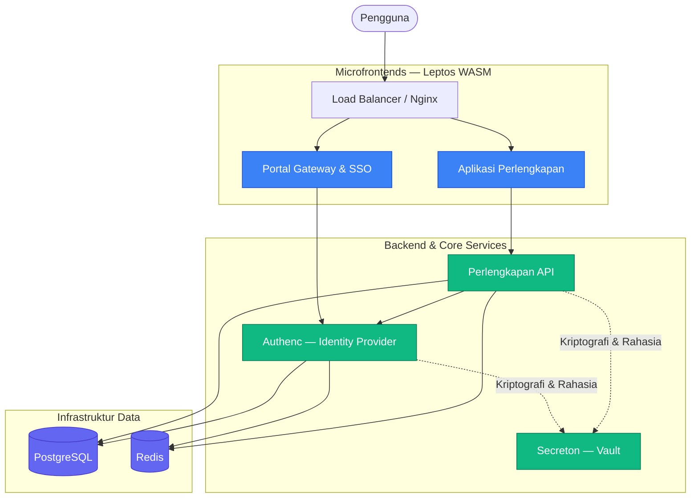

# 🏛️ SIMPEL (Sistem Informasi Perlengkapan)

[](https://rustlang.org)
[](https://leptos.dev)
[](https://github.com/tokio-rs/axum)
[](https://kubernetes.io)

**SIMPEL** adalah platform untuk manajemen Barang Milik Negara (BMN) di lingkungan Kejaksaan Republik Indonesia. Dibangun sepenuhnya menggunakan **Rust** dengan arsitektur workspace tunggal yang terdiri dari microfrontend (WebAssembly), backend services, dan layanan infrastruktur inti.

---

## ✨ Fitur Utama

- 🛡️ **Keamanan & Autentikasi**: IAM kustom (*Authenc*) dengan OAuth2/OIDC, MFA, RBAC, SAML, WebAuthn, dan manajemen rahasia (*Secreton*)
- 🧩 **Microfrontend (WASM)**: Antarmuka reaktif dibangun dengan Leptos 0.8 — Portal (SSO Gateway) dan Perlengkapan (BMN)
- ⚙️ **Backend Services**: API asinkron berperforma tinggi dengan Axum 0.8, komunikasi antar-layanan via gRPC (Tonic)
- 📦 **Workspace Terintegrasi**: Seluruh ~34 crate dikelola dalam satu `Cargo.toml` workspace dengan dependensi terpusat

---

## 🏗️ Arsitektur Sistem



---

## 📁 Struktur Proyek

```bash
simpel2/
├── Cargo.toml               # Workspace manifest (single source of truth)
├── antarmuka/               # Microfrontend applications (Leptos WASM)
│   ├── portal/              #   Portal Gateway & SSO
│   └── perlengkapan/        #   Modul operasional BMN
├── layanan/                 # Backend & Core Services
│   ├── perlengkapan/        #   Layanan backend BMN terpadu (kebutuhan, dokumen, notifikasi, bantuan, dll)
│   ├── integrasi/           #   Integrasi layanan eksternal (MySIMKARI, SIMAN)
│   ├── authenc/crates/      #   10 crates: types, core, crypto, storage, api, iam-api,
│   │                        #              grpc, mfa, federation, webauthn
│   └── secreton/crates/     #   14 crates: core, api, storage, crypto, types, agent,
│                            #              cli, grpc, hsm, k8s-operator, auto-unseal,
│                            #              backup, health, replication
├── lib/                     # Shared Libraries
│   ├── ui/                  #   Komponen Antarmuka (Leptos)
│   ├── core/                #   Tipe data aman WASM (WASM-safe types)
│   ├── backend/             #   Infrastruktur backend (database, gRPC, middleware)
│   ├── crypto/              #   Primitif kriptografi bersama
│   └── perlengkapan/        #   Tipe domain perlengkapan
├── tests/                   # Integration & E2E tests
├── docs/                    # Dokumentasi engineering
└── infra/                   # Infrastruktur (K8s, Monitoring, Nginx)
```

---

## 🚀 Tumpukan Teknologi

| Lapisan | Teknologi | Versi | Tujuan |
|---------|-----------|-------|--------|
| **Bahasa** | Rust | 1.97+ (Edition 2024) | Memory safety & performa tinggi |
| **Frontend** | Leptos | 0.8.20 | Reaktivitas WASM (Client-Side Rendering) |
| **Backend HTTP** | Axum | 0.8.9 | REST API asinkron |
| **Backend gRPC** | Tonic + Prost | 0.14.x | Komunikasi antar-layanan terproteksi mTLS |
| **Database** | PostgreSQL | 15+ | Persistensi data relasional |
| **Cache** | Redis | — | Caching in-memory & session store |
| **Kriptografi** | Ed25519, ChaCha20 | — | Signing, enkripsi modern |
| **Orkestrasi** | Kubernetes | — | Manajemen container |

---

## 🏁 Memulai Pengembangan

### 1. Persyaratan Sistem

- **Rust 1.97+** (`rustup` dengan target `wasm32-unknown-unknown`)
- **Trunk** (`cargo install trunk` atau `cargo binstall trunk`)
- **Docker & Docker Compose** (PostgreSQL & Redis lokal)

### 2. Instalasi

```bash
git clone <URL_REPOSITORY> simpel
cd simpel
cp .env.example .env
docker compose up -d postgres redis
```

### 3. Menjalankan Service

**Frontend (WASM + hot-reload):**

```bash
cd antarmuka/portal && trunk serve --port 8080 --open
cd antarmuka/perlengkapan && trunk serve --port 8081 --open
```

**Backend API:**

```bash
cargo run --bin layanan-perlengkapan
cargo run --bin authenc
cargo run --bin api_server
```

### 4. Verifikasi Workspace

```bash
cargo check --workspace                                    # Cek kompilasi
cargo clippy --workspace --all-targets -- -D warnings      # Linter
cargo fmt --all                                            # Format kode
cargo test --workspace                                     # Jalankan semua tes
```

---

## 🛡️ Kebijakan Keamanan

SIMPEL mematuhi paradigma **Security-by-Design**:

- Arsitektur autentikasi berbasis token modern (OAuth2/OIDC) dengan rotasi kunci via Secreton
- Kriptografi modern: Ed25519 (signing), ChaCha20-Poly1305 (enkripsi), Argon2id (password hashing)
- Strict `unsafe_code = "forbid"` pada level workspace
- Zero-trust: semua komunikasi antar-layanan via mTLS (gRPC)

---

## 🤝 Panduan Kontribusi

1. Buat cabang (*branch*) dari `main` berdasarkan penugasan spesifik
2. Pastikan kode selaras: `cargo fmt --all`
3. Pastikan tidak ada warning: `cargo clippy --workspace --all-targets -- -D warnings`
4. Commit dengan format [Conventional Commits](https://www.conventionalcommits.org/)

Panduan selengkapnya: 📖 [CONTRIBUTING.md](CONTRIBUTING.md) · Panduan AI Agent: 🤖 [AGENTS.md](AGENTS.md)

---

## ☎️ Bantuan & Dukungan

Lihat `docs/` untuk panduan arsitektur mendalam dan pemahaman logika lintas layanan.

> **SIMPEL (Sistem Informasi Perlengkapan)**
> Hak Cipta © Kejaksaan Agung Republik Indonesia. Semua Hak Dilindungi Undang-Undang.
