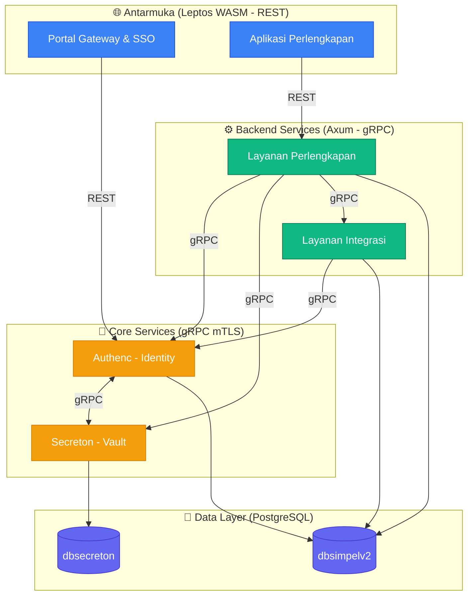

# 🏛️ SIMPEL (Sistem Informasi Perlengkapan)

[](https://rustlang.org)
[](https://leptos.dev)
[](https://github.com/tokio-rs/axum)
[](https://kubernetes.io)

**SIMPEL** (Sistem Informasi Perlengkapan) adalah platform monorepo berbasis **Rust** untuk manajemen Barang Milik Negara (BMN) di lingkungan Kejaksaan Republik Indonesia. Proyek ini menggunakan arsitektur *microfrontend* (WebAssembly) dan *microservices* terproteksi mTLS, yang dirancang untuk performa tinggi, keamanan *zero-trust*, dan skalabilitas.

---

## ✨ Fitur Utama

- 🛡️ **Identity & Access Management (Authenc)**: Implementasi OAuth2/OIDC kustom, MFA (TOTP & WebAuthn), RBAC, dan integrasi federasi identitas.
- 🔒 **Manajemen Rahasia (Secreton)**: Sistem *vault* internal untuk penyimpanan rahasia terenkripsi, *transit encryption*, PKI certificate management, dan rotasi kredensial database dinamis.
- 🔗 **Layanan Integrasi (SSoT)**: *Single Source of Truth* untuk data master eksternal, mengintegrasikan API pemerintah seperti **MonSAKTI** (Kemenkeu), **MySIMKARI** (Kepegawaian), dan **SIMAN v2** (Aset Negara).
- 🧩 **Microfrontend (WASM)**: Antarmuka reaktif dibangun dengan **Leptos 0.8** yang berjalan sepenuhnya di sisi klien menggunakan WebAssembly (WASM).
- ⚙️ **Backend Terpadu**: API asinkron berperforma tinggi dengan **Axum 0.8** dan komunikasi antar-layanan melalui **gRPC (Tonic)** dengan enkripsi mTLS.

---

## 🏗️ Arsitektur Sistem

SIMPEL mengadopsi prinsip *security-by-design* dengan pemisahan tanggung jawab yang jelas antara antarmuka, layanan domain, dan infrastruktur inti.



---

## 📁 Struktur Proyek

Penerapan monorepo memungkinkan manajemen dependensi terpusat di `Cargo.toml` root.

```bash
simpel2/
├── antarmuka/               # Frontend Microfrontends (Leptos WASM)
│   ├── portal/              #   Gateway Portal & SSO
│   └── perlengkapan/        #   Modul Operasional BMN
├── layanan/                 # Backend & Core Services
│   ├── perlengkapan/        #   Layanan BMN terpadu (Unified Service)
│   ├── integrasi/           #   Integrasi Eksternal (MonSAKTI, SIMAN, MySIMKARI)
│   ├── authenc/crates/      #   Identity Provider (10 sub-crates)
│   │   └── api, core, crypto, storage, grpc, mfa, federation, webauthn, types, iam-api
│   └── secreton/crates/     #   Secret Vault (14 sub-crates)
│       └── core, api, storage, crypto, grpc, cli, agent, hsm, k8s-operator, types,
│           auto-unseal, backup, health, replication
├── lib/                     # Shared Libraries (Internal)
│   ├── ui/                  #   Komponen Antarmuka Bersama (Leptos)
│   ├── core/                #   Tipe data aman WASM (WASM-safe types)
│   ├── backend/             #   Utilitas Backend (DB, gRPC, Middleware)
│   ├── crypto/              #   Primitif Kriptografi (Ed25519, ChaCha20)
│   └── perlengkapan/        #   Kontrak & Domain Perlengkapan
├── infra/                   # Konfigurasi Infrastruktur (Helm, K8s, Istio)
└── tests/                   # Integrasi & E2E Tests (Playwright)
```

---

## 🗺️ Roadmap Layanan

Beberapa layanan berikut telah didokumentasikan di `docs/` dan direncanakan untuk implementasi masa depan:
- `layanan-aset`, `layanan-usulan`, `layanan-pemeliharaan`, `layanan-penghapusan` (Migrasi dari v1)
- `layanan-dokumen`, `layanan-notifikasi` (Modul terpadu)
- `layanan-ai` (Analisis BMN cerdas)
- `layanan-audit`, `layanan-laporan`, `layanan-dasbor`

---

## 🚀 Tumpukan Teknologi

| Lapisan | Teknologi | Versi | Catatan |
|---------|-----------|-------|---------|
| **Bahasa** | Rust | 1.96+ | Edition 2024, MSRV 1.96 |
| **Frontend** | Leptos | 0.8.19 | WASM Client-Side Rendering (CSR) |
| **Backend HTTP** | Axum | 0.8.9 | REST API dengan middleware Tower |
| **Backend gRPC** | Tonic | 0.14.x | Komunikasi antar-layanan (mTLS) |
| **Database** | PostgreSQL | 15+ | Shared DB dengan *schema-per-service* |
| **Kriptografi** | RustCrypto | — | Ed25519, ChaCha20-Poly1305, Argon2id |
| **Orkestrasi** | Kubernetes | — | Deploy via Helm dengan Istio Service Mesh |

---

## 🏁 Memulai Pengembangan

### 1. Persyaratan Sistem

- **Rust 1.96+** (dengan target `wasm32-unknown-unknown`)
- **Trunk** (`cargo install trunk`) untuk build frontend.
- **Protobuf Compiler** (`protoc`) untuk kompilasi kontrak gRPC.
- **Docker & Docker Compose** untuk menjalankan dependensi lokal (PostgreSQL & Redis).

### 2. Instalasi & Setup Lokal

```bash
git clone <URL_REPOSITORY> simpel
cd simpel
cp .env.example .env
docker compose up -d postgres redis
```

### 3. Menjalankan Layanan

**Frontend (WASM + hot-reload):**
```bash
# Portal (Port 8080)
cd antarmuka/portal && trunk serve
# Perlengkapan (Port 8081)
cd antarmuka/perlengkapan && trunk serve --port 8081
```

**Backend & Core Services:**
```bash
cargo run --bin authenc                    # Identity Provider
cargo run --bin layanan-perlengkapan       # BMN Service
cargo run --bin layanan-integrasi-server   # Integration Service
cargo run -p secreton-api --bin api_server # Secret Vault
```

### 4. Verifikasi & Kualitas Kode
```bash
cargo check --workspace                                    # Cek kompilasi
cargo clippy --workspace --all-targets -- -D warnings      # Linter
cargo fmt --all                                            # Format kode
cargo test --workspace                                     # Jalankan seluruh test suite
```

---

## 🛡️ Kebijakan Keamanan & Zero-Trust

- **Zero-Trust Networking**: Semua komunikasi internal dienkripsi menggunakan mTLS melalui Istio Service Mesh.
- **Secret Management**: Rahasia tidak pernah disimpan dalam *environment variables* di produksi. Pod mengambil rahasia langsung dari Secreton menggunakan identitas *Kubernetes ServiceAccount*.
- **Memory Safety**: Seluruh workspace backend diatur dengan `unsafe_code = "forbid"`.
- **Identity First**: Akses ke setiap layanan domain divalidasi melalui token JWT yang diterbitkan oleh Authenc.

---

## 🤝 Panduan Kontribusi

1. Gunakan **Conventional Commits** untuk setiap perubahan.
2. Pastikan kode telah diformat dengan `cargo fmt` dan bersih dari peringatan `clippy`.
3. Baca dokumen spesifik agen di [AGENTS.md](AGENTS.md) untuk aturan teknis mendalam per domain.

Informasi lebih lanjut: 📖 [CONTRIBUTING.md](CONTRIBUTING.md) · [docs/](docs/)

---

> **SIMPEL (Sistem Informasi Perlengkapan)**
> Hak Cipta © Kejaksaan Agung Republik Indonesia. Semua Hak Dilindungi Undang-Undang.
