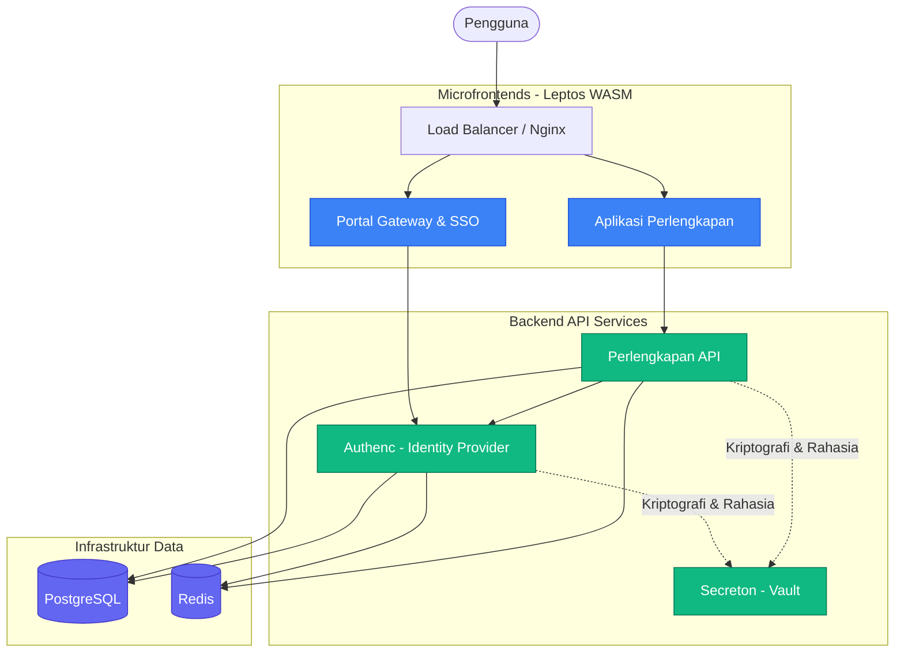

# 🏛️ SIMPEL (Sistem Informasi Perlengkapan)

[](CHANGELOG.md)
[](https://rustlang.org)
[](https://leptos.dev)
[](https://kubernetes.io)
[](LICENSE)

**SIMPEL (Sistem Informasi Perlengkapan)** adalah platform untuk manajemen Barang Milik Negara (BMN) di lingkungan Kejaksaan Republik Indonesia. Dibangun menggunakan bahasa **Rust** dengan arsitektur berbasis workspace yang terdiri dari microfrontend (WebAssembly) dan backend services komprehensif.

---

## ✨ Fitur Utama

- 🛡️ **Keamanan & Autentikasi**: Otorisasi terpusat melalui IAM kustom (*Authenc*) dan manajemen rahasia (*Secreton*).
- 🧩 **Microfrontend (WASM)**: Antarmuka dibangun dengan Leptos (Rust to WebAssembly) yang terbagi menjadi Portal dan Perlengkapan.
- ⚙️ **Backend Services**: API backend asinkron berperforma tinggi yang dibangun menggunakan Axum.
- 📦 **Workspace Terintegrasi**: Pengelolaan dependensi terpusat dalam satu `Cargo.toml` workspace secara efisien.

---

## 🏗️ Arsitektur Sistem (Riil Saat Ini)

Berikut adalah interaksi komponen-komponen utama yang faktual dan tersedia pada platform SIMPEL saat ini:



---

## 📁 Struktur Proyek

Platform SIMPEL terdistribusi dalam beberapa direktori utama:

- `📁 antarmuka/` – Berisi *Microfrontend applications* berbasis WebAssembly (Leptos):
  - `portal` - Portal Gateway & SSO.
  - `perlengkapan` - Modul operasional layanan perlengkapan BMN.
- `📁 layanan/` – Pusat seluruh kode program *Backend Services*:
  - `perlengkapan/` - Domain API, integrasi, dan dokumen terkait perlengkapan.
  - `authenc/` - Identity Provider & Layanan IAM Kustom.
  - `secreton/` - Secrets Vault & Manajemen Kriptografi dan Sertifikat.
- `📁 lib/` – Komponen dan pustaka yang digunakan bersama (*Shared Libraries*):
  - `ui` - Pustaka Komponen Antarmuka (Shared UI Library).
  - `common` - Utilitas bersama (Error handling, tipe dasar, dll).
  - `perlengkapan` - Tipe data dan core logic domain perlengkapan.
- `📁 infra/` – Infrastruktur deklaratif untuk *deployment* (Kubernetes Manifests, Monitoring, Nginx).
- `📁 docs/` – Repositori untuk dokumentasi *engineering*, panduan arsitektur, dll.

---

## 🚀 Tumpukan Teknologi (Tech Stack)

| Lapisan           | Teknologi              | Tujuan Utama                                        |
| ----------------- | ---------------------- | --------------------------------------------------- |
| **Inti Sistem**   | Rust 1.90+             | Keamanan memori (*Memory Safety*) & Performa Tinggi |
| **Frontend**      | Leptos 0.8             | Reaktivitas antarmuka berbasis WebAssembly (WASM)   |
| **Backend API**   | Axum 0.8.7             | Web framework asinkron untuk REST API dan gRPC      |
| **Database**      | PostgreSQL 15 & Redis  | Persistensi data relasional dan *caching* in-memory |
| **Keamanan**      | Ed25519, WebAuthn      | Autentikasi modern dan kriptografi kencang & ringan |
| **Orkestrasi**    | Kubernetes             | Manajemen *container* untuk fase deployment         |

---

## 🏁 Memulai Pengembangan (Quick Start)

### 1. Persyaratan Sistem
Pastikan Anda memiliki *tools* berikut terpasang:
- **Rust 1.90+** (Gunakan `rustup`)
- **Trunk** (Build tool khusus untuk Rust WebAssembly): `cargo install trunk` atau `cargo binstall trunk`
- **Docker & Docker Compose** (Untuk menjalankan database lokal Redis/PostgreSQL)

### 2. Instalasi dan Persiapan Lokal

```bash
# 1. Unduh repositori
git clone <URL_REPOSITORY_SIMPEL> simpel
cd simpel

# 2. Persiapan Konfigurasi Lingkungan
cp .env.example .env

# 3. Jalankan Basis Data (contoh: PostgreSQL dan Redis)
docker compose up -d postgres redis
```

### 3. Kompilasi & Menjalankan Service

**Frontend (WASM dengan hot-reloading):**
```bash
# Menjalankan Portal Microfrontend
cd antarmuka/portal
trunk serve --port 8080 --open

# Menjalankan Perlengkapan Microfrontend
cd antarmuka/perlengkapan
trunk serve --port 8081 --open
```

**Backend API:**
```bash
# Menjalankan backend layanan utama
cargo run --bin layanan-perlengkapan-api

# Menjalankan layanan infrastruktur IAM dan Kriptografi
cargo run --bin authenc
cargo run --bin secreton
```

### 4. Memverifikasi Workspace

Sangat direkomendasikan untuk memverifikasi proyek secara berkala:

```bash
# Cek seluruh workspace tanpa kompilasi penuh
cargo check --workspace

# Analisis linter (Pastikan tidak ada warning)
cargo clippy --workspace --all-targets -- -D warnings

# Format kode
cargo fmt --all
```

---

## 🛡️ Kebijakan Keamanan

SIMPEL mematuhi paradigma **Security-by-Design**:
- Menerapkan arsitektur autentikasi berbasis token modern dengan rotasi kunci melalui utilitas `Secreton`.
- Menggunakan standar Ed25519 Cryptography dibandingkan standar lama RSA.
- Mematuhi strict `unsafe_code = "forbid"` pada level konfigurasi workspace di tingkat `Cargo.toml`.

---

## 🤝 Panduan Kontribusi

1. Mulai pengembangan dari cabang (*branch*) tunggal berdasarkan penugasan yang spesifik.
2. Pastikan kode selaras dalam format standar (`cargo fmt --all`).
3. Pastikan tidak ada *warning* atau *error* dari linter (`cargo clippy --workspace --all-targets -- -D warnings`).
4. *Commits* diusahakan jelas tertata sebelum mengajukan pertimbangan ke dalam sistem *Merge Request*.

Panduan selengkapnya: 📖 [CONTRIBUTING.md](CONTRIBUTING.md)

---

## ☎️ Bantuan & Dukungan Sistem

Silakan merujuk pada `docs/` untuk panduan arsitektur yang jauh lebih mendalam dan pemahaman logika lintas layanan (*cross-service logics*).

> **SIMPEL (Sistem Informasi Perlengkapan)**
> Hak Cipta © Kejaksaan Agung Republik Indonesia. Semua Hak Dilindungi Undang-Undang.
