# Security Considerations for Attorney General's Office

## Executive Summary

This document outlines comprehensive security considerations for the SIMKARI (Sistem Informasi Manajemen Kejaksaan Republik Indonesia) platform, specifically tailored for the Indonesian Attorney General's Office (Kejaksaan Republik Indonesia) operational requirements, legal compliance, and security standards.

## Table of Contents

1. [Legal and Regulatory Framework](#legal-and-regulatory-framework)
2. [Data Classification and Handling](#data-classification-and-handling)
3. [Access Control and Authorization](#access-control-and-authorization)
4. [Cryptographic Security Requirements](#cryptographic-security-requirements)
5. [Audit and Compliance Framework](#audit-and-compliance-framework)
6. [Incident Response and Forensics](#incident-response-and-forensics)
7. [Physical and Environmental Security](#physical-and-environmental-security)
8. [Personnel Security](#personnel-security)

## Legal and Regulatory Framework

### Indonesian Legal Requirements

```mermaid
graph TB
    subgraph "Legal Foundation"
        subgraph "Constitutional Framework"
            UUD1945[UUD 1945<br/>Pasal 28G - Perlindungan Diri]
            UUKejaksaan[UU No. 16/2004<br/>Kejaksaan Republik Indonesia]
            UUInformasi[UU No. 11/2008 jo UU No. 19/2016<br/>Informasi dan Transaksi Elektronik]
        end

        subgraph "Data Protection Laws"
            UUPerlindunganData[UU No. 27/2022<br/>Perlindungan Data Pribadi]
            PPPerlindunganData[PP No. 71/2019<br/>Penyelenggaraan Sistem Elektronik]
            PermenKominfo[Permen Kominfo No. 4/2016<br/>Sistem Elektronik Lingkup Privat]
        end

        subgraph "Criminal Justice Framework"
            KUHAP[KUHAP<br/>Hukum Acara Pidana]
            UUTipikor[UU No. 31/1999 jo UU No. 20/2001<br/>Pemberantasan Tindak Pidana Korupsi]
            UUTerorisme[UU No. 5/2018<br/>Pemberantasan Tindak Pidana Terorisme]
        end
    end

    subgraph "Implementation Requirements"
        DataSovereignty[Data Sovereignty<br/>Indonesian Territory]
        LegalCompliance[Legal Compliance<br/>Evidence Integrity]
        PrivacyProtection[Privacy Protection<br/>Personal Data Security]
        AuditTrail[Audit Trail<br/>Legal Accountability]
    end

    UUD1945 --> DataSovereignty
    UUKejaksaan --> LegalCompliance
    UUInformasi --> PrivacyProtection

    UUPerlindunganData --> PrivacyProtection
    PPPerlindunganData --> DataSovereignty
    PermenKominfo --> AuditTrail

    KUHAP --> LegalCompliance
    UUTipikor --> AuditTrail
    UUTerorisme --> LegalCompliance
```

### Attorney General's Office Specific Regulations

```mermaid
graph TB
    subgraph "Internal Regulations"
        subgraph "Organizational Structure"
            PeraturanJakgung[Peraturan Jaksa Agung<br/>Organisasi dan Tata Kerja]
            SOPKejaksaan[SOP Kejaksaan<br/>Operational Procedures]
            JuklakJuknis[Juklak/Juknis<br/>Technical Guidelines]
        end

        subgraph "Information Security"
            KebijakanKeamanan[Kebijakan Keamanan Informasi<br/>Information Security Policy]
            ProsedurKeamanan[Prosedur Keamanan<br/>Security Procedures]
            StandardTeknis[Standar Teknis<br/>Technical Standards]
        end

        subgraph "Case Management"
            ProsedurPerkara[Prosedur Penanganan Perkara<br/>Case Handling Procedures]
            KeamananBukti[Keamanan Barang Bukti<br/>Evidence Security]
            ArsipPerkara[Arsip Perkara<br/>Case Archives]
        end
    end

    subgraph "Security Controls"
        AccessManagement[Access Management<br/>Role-based Control]
        DataClassification[Data Classification<br/>Security Levels]
        AuditLogging[Audit Logging<br/>Activity Monitoring]
        IncidentResponse[Incident Response<br/>Security Events]
    end

    PeraturanJakgung --> AccessManagement
    SOPKejaksaan --> DataClassification
    JuklakJuknis --> AuditLogging

    KebijakanKeamanan --> AccessManagement
    ProsedurKeamanan --> IncidentResponse
    StandardTeknis --> DataClassification

    ProsedurPerkara --> AuditLogging
    KeamananBukti --> DataClassification
    ArsipPerkara --> IncidentResponse
```

## Data Classification and Handling

### Classification Levels

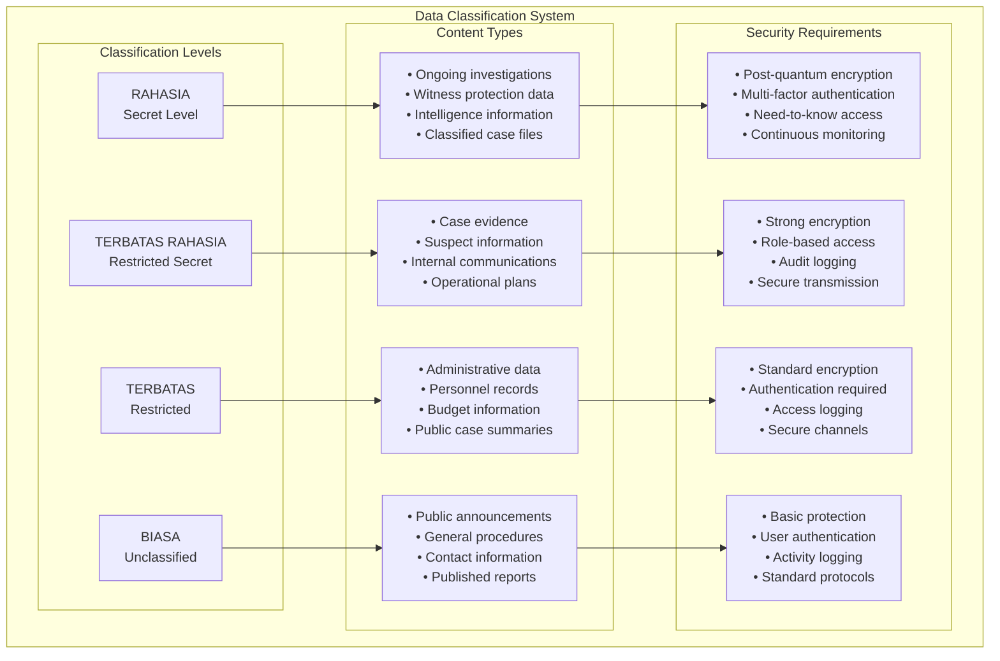

### Data Handling Procedures

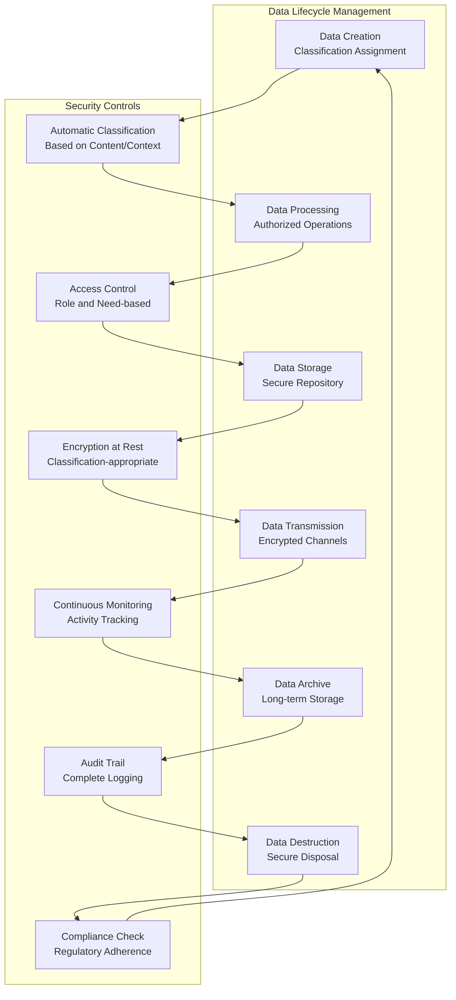

### Case-Specific Data Protection

| Case Type | Data Classification | Protection Requirements | Retention Period |
|-----------|-------------------|------------------------|------------------|
| **Corruption Cases** | RAHASIA | Post-quantum encryption, witness protection | 30 years |
| **Terrorism Cases** | RAHASIA | Maximum security, intelligence coordination | Permanent |
| **General Criminal** | TERBATAS RAHASIA | Strong encryption, evidence integrity | 20 years |
| **Civil Cases** | TERBATAS | Standard encryption, privacy protection | 10 years |
| **Administrative** | BIASA | Basic protection, transparency compliance | 5 years |

## Access Control and Authorization

### Hierarchical Access Control Model

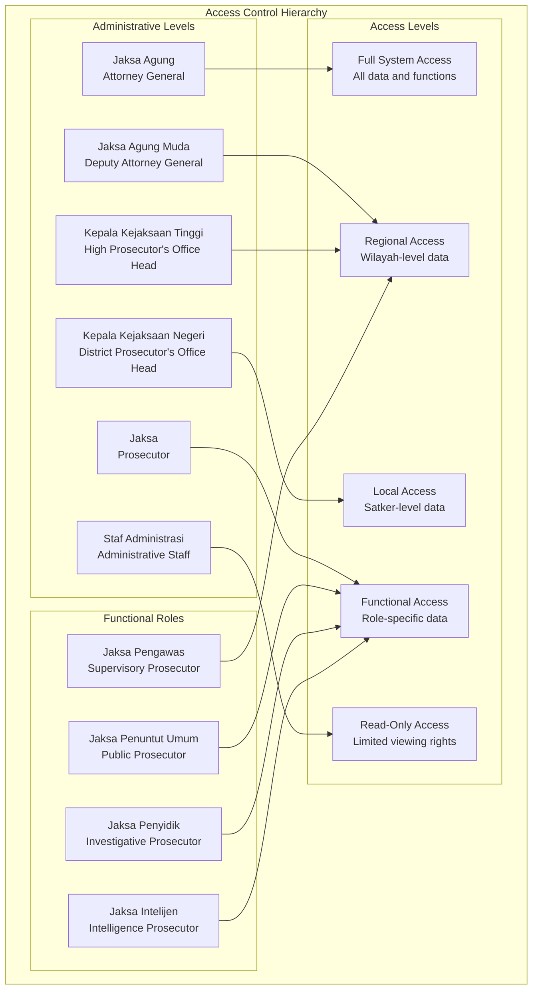

### Role-Based Permissions Matrix

```mermaid
graph TB
    subgraph "Permission Matrix"
        subgraph "Data Access Permissions"
            ReadCases[Read Cases]
            WriteCases[Write Cases]
            DeleteCases[Delete Cases]
            ReadEvidence[Read Evidence]
            WriteEvidence[Write Evidence]
            ReadPersonnel[Read Personnel]
            WritePersonnel[Write Personnel]
            ReadAudit[Read Audit Logs]
            WriteAudit[Write Audit Logs]
        end

        subgraph "System Permissions"
            UserManagement[User Management]
            RoleManagement[Role Management]
            SystemConfig[System Configuration]
            SecurityConfig[Security Configuration]
            BackupRestore[Backup/Restore]
            SystemMonitoring[System Monitoring]
        end

        subgraph "Administrative Permissions"
            CreateReports[Create Reports]
            ApproveActions[Approve Actions]
            ManageWorkflow[Manage Workflow]
            AccessArchives[Access Archives]
            ManageCompliance[Manage Compliance]
        end
    end

    subgraph "Role Assignments"
        AdminPusat[Admin Pusat<br/>Central Administrator]
        AdminWilayah[Admin Wilayah<br/>Regional Administrator]
        AdminSatker[Admin Satker<br/>Local Administrator]
        JaksaSenior[Jaksa Senior<br/>Senior Prosecutor]
        JaksaJunior[Jaksa Junior<br/>Junior Prosecutor]
    end

    AdminPusat --> UserManagement
    AdminPusat --> RoleManagement
    AdminPusat --> SystemConfig
    AdminPusat --> SecurityConfig

    AdminWilayah --> ReadCases
    AdminWilayah --> WriteCases
    AdminWilayah --> ReadPersonnel
    AdminWilayah --> CreateReports

    AdminSatker --> ReadCases
    AdminSatker --> WriteCases
    AdminSatker --> ReadEvidence
    AdminSatker --> WriteEvidence

    JaksaSenior --> ReadCases
    JaksaSenior --> WriteCases
    JaksaSenior --> ReadEvidence
    JaksaSenior --> ApproveActions

    JaksaJunior --> ReadCases
    JaksaJunior --> ReadEvidence
```

### Multi-Factor Authentication Requirements

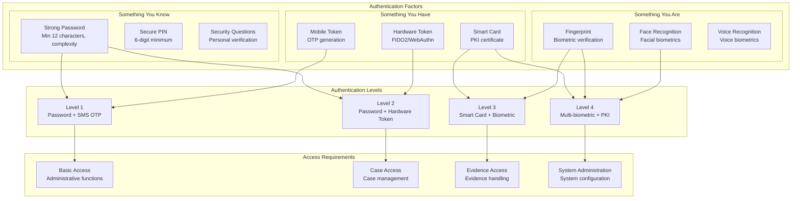

## Cryptographic Security Requirements

### Encryption Standards by Classification

```mermaid
graph TB
    subgraph "Encryption Requirements"
        subgraph "RAHASIA Level"
            RahasiaAlgo[Post-Quantum Algorithms<br/>ML-KEM-1024, ML-DSA-87]
            RahasiaKey[Key Management<br/>Hardware Security Module]
            RahasiaRotation[Key Rotation<br/>Monthly rotation]
        end

        subgraph "TERBATAS RAHASIA Level"
            TerbatasRahasiaAlgo[Hybrid Algorithms<br/>AES-256 + ML-KEM-768]
            TerbatasRahasiaKey[Key Management<br/>Secure key storage]
            TerbatasRahasiaRotation[Key Rotation<br/>Quarterly rotation]
        end

        subgraph "TERBATAS Level"
            TerbatasAlgo[Strong Algorithms<br/>AES-256-GCM, Ed25519]
            TerbatasKey[Key Management<br/>Encrypted key storage]
            TerbatasRotation[Key Rotation<br/>Annual rotation]
        end

        subgraph "BIASA Level"
            BiasaAlgo[Standard Algorithms<br/>AES-128-GCM, RSA-2048]
            BiasaKey[Key Management<br/>Standard key storage]
            BiasaRotation[Key Rotation<br/>Bi-annual rotation]
        end
    end

    subgraph "Implementation Requirements"
        FIPS140[FIPS 140-2 Level 3<br/>Cryptographic modules]
        CommonCriteria[Common Criteria EAL4+<br/>Security evaluation]
        SNICrypto[SNI Cryptographic Standards<br/>Indonesian standards]
    end

    RahasiaAlgo --> FIPS140
    TerbatasRahasiaAlgo --> CommonCriteria
    TerbatasAlgo --> SNICrypto
    BiasaAlgo --> SNICrypto
```

### Key Management Architecture

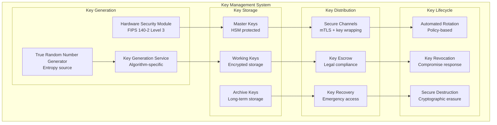

## Audit and Compliance Framework

### Comprehensive Audit System

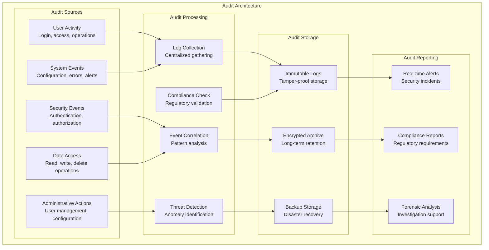

### Compliance Monitoring

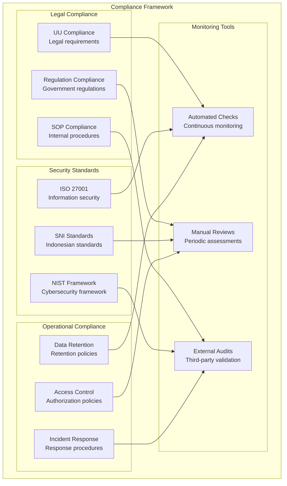

## Incident Response and Forensics

### Incident Response Framework

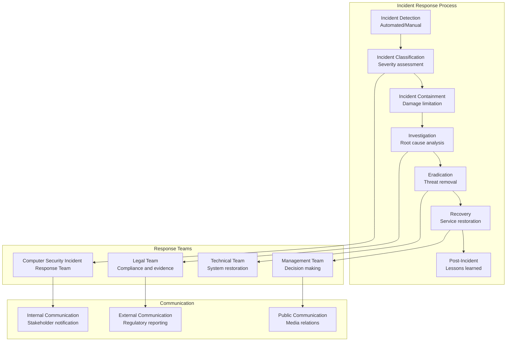

### Digital Forensics Capabilities

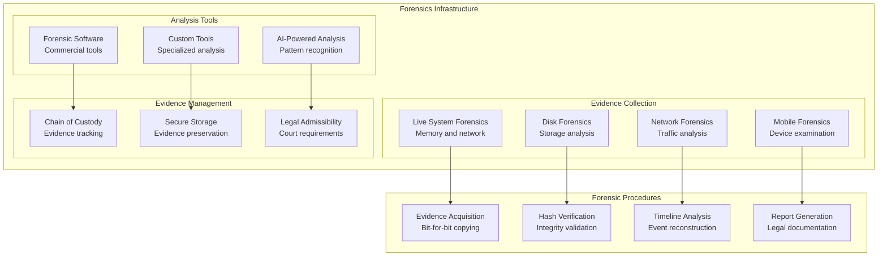

## Physical and Environmental Security

### Data Center Security

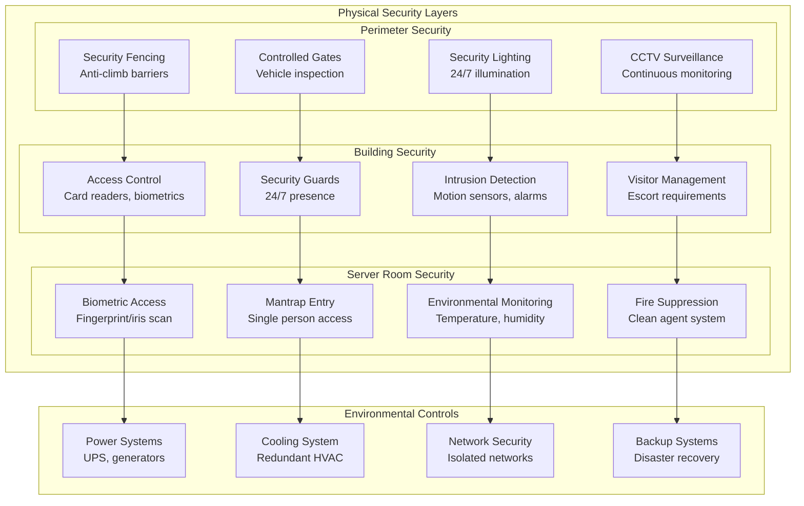

### Disaster Recovery and Business Continuity

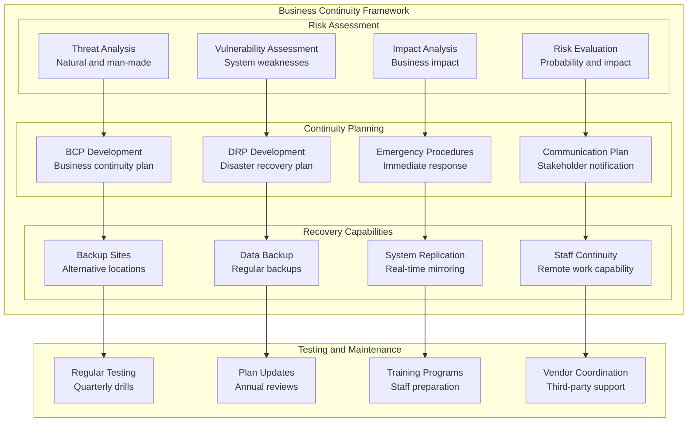

## Personnel Security

### Security Clearance Framework

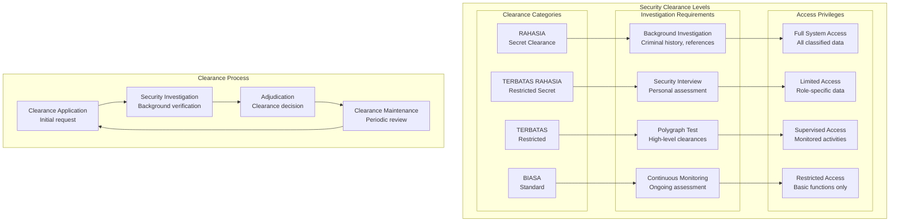

### Security Training and Awareness

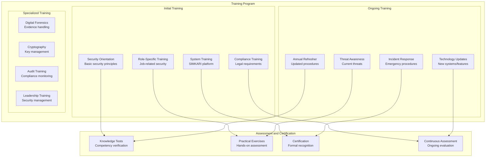

This comprehensive security considerations document provides detailed guidance for implementing and maintaining security within the SIMKARI platform, specifically tailored for the Indonesian Attorney General's Office operational and legal requirements.
