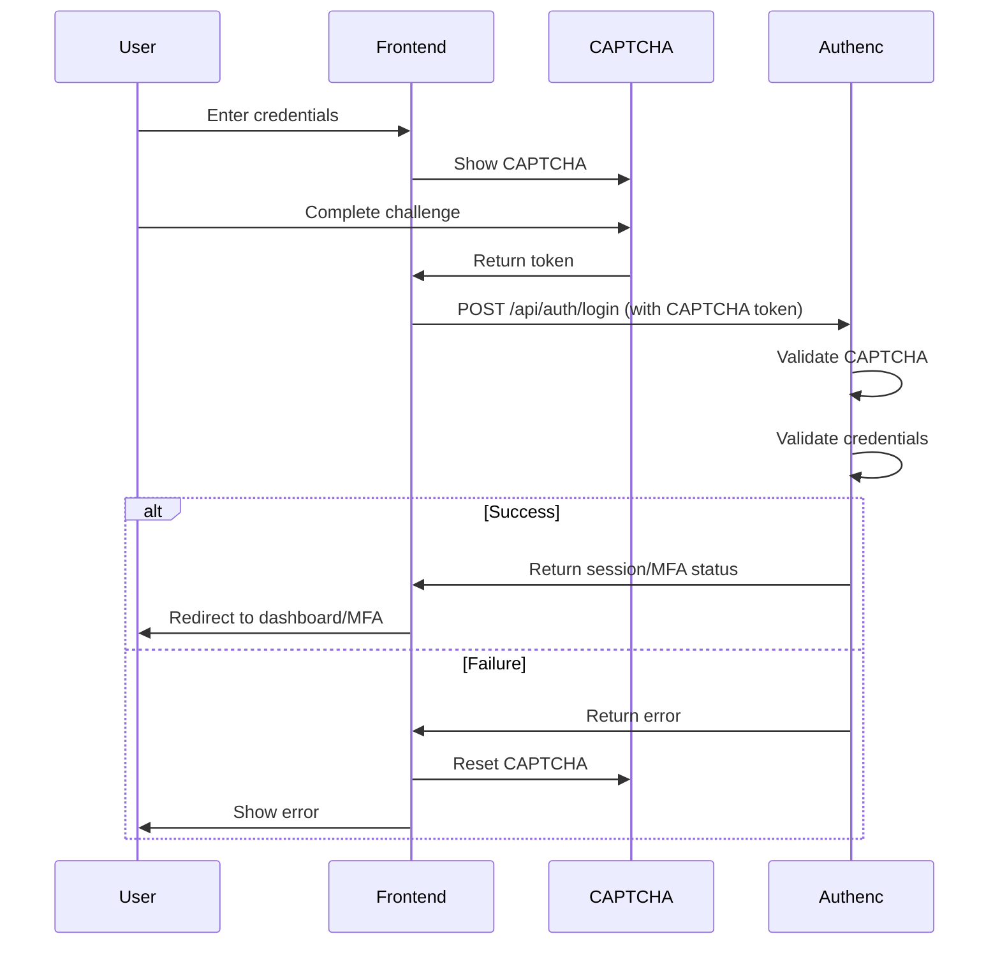
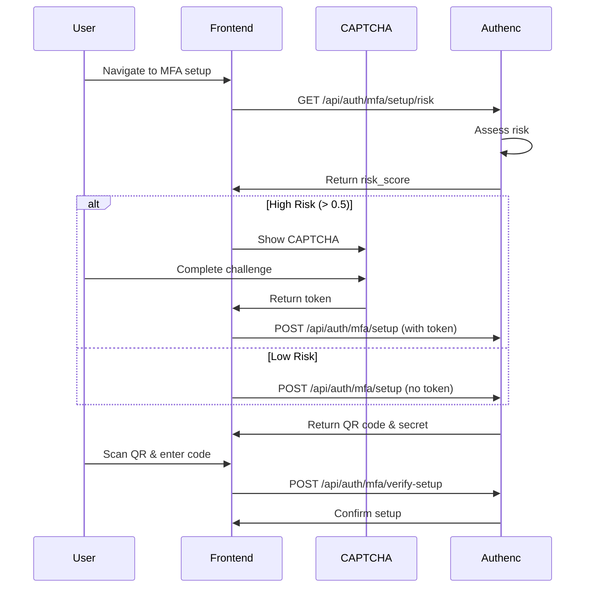
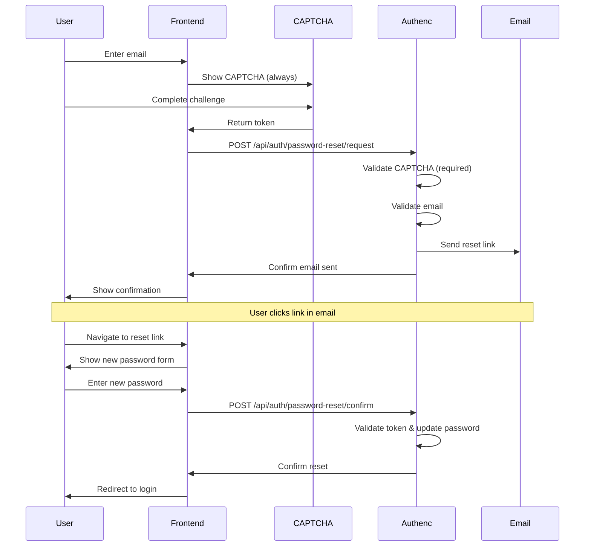

# CAPTCHA Authentication Integration Guide

## Overview

This document describes the comprehensive integration of the AI-resistant CAPTCHA system with SIMPEL's authentication flows, including login, MFA setup, and password reset.

## Table of Contents

1. [Integration Points](#integration-points)
2. [Risk-Based CAPTCHA](#risk-based-captcha)
3. [Login Flow](#login-flow)
4. [MFA Setup Flow](#mfa-setup-flow)
5. [Password Reset Flow](#password-reset-flow)
6. [API Endpoints](#api-endpoints)
7. [Frontend Components](#frontend-components)
8. [Configuration](#configuration)
9. [Security Considerations](#security-considerations)

## Integration Points

The CAPTCHA system is integrated at three critical authentication points:

### 1. Login Flow
- **Always Required**: CAPTCHA is shown on every login attempt
- **Purpose**: Prevent automated brute-force attacks
- **Difficulty**: Standard (level 3) — the UI no longer displays the level, it is handled internally
- **Location**: `/login` page

### 2. MFA Setup Flow
- **Risk-Based**: CAPTCHA shown only for high-risk scenarios
- **Purpose**: Prevent unauthorized MFA enrollment
- **Difficulty**: Higher (level 5) due to sensitivity (still configurable via API, not shown to end user)
- **Location**: `/mfa/setup` page

### 3. Password Reset Flow
- **Always Required**: CAPTCHA mandatory for all reset requests
- **Purpose**: Prevent account enumeration and automated attacks
- **Difficulty**: Higher (level 4) due to sensitivity
- **Location**: `/password-reset` page

## Risk-Based CAPTCHA

### Risk Assessment Service

The `RiskAssessmentService` evaluates multiple factors to determine if CAPTCHA should be required:

```rust
pub struct RiskFactors {
    pub failed_attempts: u32,        // Recent failed login attempts
    pub ip_reputation: f64,          // IP reputation score (0.0-1.0)
    pub timing_anomaly: f64,         // Timing pattern anomaly
    pub geographic_anomaly: f64,     // Geographic location anomaly
    pub user_agent_anomaly: f64,     // User agent anomaly
}
```

### Risk Calculation

Risk score is calculated as a weighted sum:

```
risk_score = (failed_attempts_score * 0.4) +
             (ip_reputation * 0.3) +
             (timing_anomaly * 0.2) +
             (geographic_anomaly * 0.1)
```

### Risk Thresholds

- **Low Risk** (< 0.3): No CAPTCHA required (except where always required)
- **Medium Risk** (0.3 - 0.6): CAPTCHA recommended
- **High Risk** (0.6 - 0.9): CAPTCHA required
- **Critical Risk** (≥ 0.9): CAPTCHA required with increased difficulty

### CAPTCHA Requirement Policy

| Flow | Risk Level | CAPTCHA Required | Difficulty |
|------|-----------|------------------|------------|
| Login | Any | Always | 3 |
| MFA Setup | Low | No | - |
| MFA Setup | Medium+ | Yes | 5 |
| Password Reset | Any | Always | 4 |

## Login Flow

### Flow Diagram



### Implementation

**Frontend (Leptos)**:
```rust
// In antarmuka/portal/src/pages/login.rs
let handle_submit = move |ev: web_sys::SubmitEvent| {
    ev.prevent_default();

    // CAPTCHA is always required
    if captcha_token.get().is_none() {
        set_error_message.set("Please complete the security verification first.".to_string());
        return;
    }

    let credentials = LoginCredentials {
        username: username.get(),
        password: password.get(),
        captcha_token: captcha_token.get(),
    };

    spawn_local(async move {
        match AuthService::login(credentials).await {
            LoginResult::Success(session) => {
                // Handle successful login
            }
            LoginResult::Error(msg) => {
                set_captcha_token.set(None); // Reset CAPTCHA on failure
            }
        }
    });
};
```

**Backend (Authenc)**:
```rust
// In layanan/authenc/src/handlers/api/auth.rs
pub async fn login(
    Json(req): Json<LoginRequest>,
) -> Result<Json<LoginResponse>, AuthencError> {
    // Validate CAPTCHA token (required)
    if let Some(captcha_token) = &req.captcha_token {
        validate_captcha_token(captcha_token).await?;
    } else {
        return Err(AuthencError::validation("CAPTCHA verification required"));
    }

    // Proceed with authentication
    // ...
}
```

## MFA Setup Flow

### Flow Diagram



### Implementation

**Frontend (Leptos)**:
```rust
// In antarmuka/portal/src/pages/mfa_setup.rs
Effect::new(move |_| {
    spawn_local(async move {
        // Check risk score
        match check_mfa_setup_risk().await {
            Ok(score) => {
                if score > 0.5 {
                    // High risk - show CAPTCHA
                    set_show_captcha.set(true);
                } else {
                    // Low risk - proceed directly
                    generate_mfa_setup(None).await;
                }
            }
            Err(_) => {
                // On error, default to showing CAPTCHA for safety
                set_show_captcha.set(true);
            }
        }
    });
});
```

**Backend (Authenc)**:
```rust
// Risk assessment endpoint
pub async fn assess_mfa_setup_risk(
    ConnectInfo(addr): ConnectInfo<SocketAddr>,
) -> Result<Json<RiskAssessmentResponse>, AuthencError> {
    let risk_service = RiskAssessmentService::default();
    let risk_score = risk_service
        .assess_mfa_setup_risk(user_id, &ip)
        .await?;

    Ok(Json(RiskAssessmentResponse {
        risk_score,
        captcha_required: risk_score > 0.5,
        risk_level: risk_service.risk_score_to_level(risk_score),
    }))
}

// MFA setup endpoint with optional CAPTCHA
pub async fn setup_mfa(
    Json(req): Json<MfaSetupRequest>,
) -> Result<Json<MfaSetupResponse>, AuthencError> {
    // Validate CAPTCHA if provided (required for high-risk scenarios)
    if let Some(captcha_token) = &req.captcha_token {
        validate_captcha_token(captcha_token).await?;
    }

    // Generate MFA setup data
    // ...
}
```

## Password Reset Flow

### Flow Diagram



### Implementation

**Frontend (Leptos)**:
```rust
// In antarmuka/portal/src/pages/password_reset.rs
let handle_request_reset = move |ev: web_sys::SubmitEvent| {
    ev.prevent_default();

    // CAPTCHA is required for password reset
    if captcha_token.get().is_none() {
        set_error_message.set("Please complete the security verification first.".to_string());
        return;
    }

    spawn_local(async move {
        match request_password_reset(&email_val, captcha_val.as_deref()).await {
            Ok(_) => {
                set_reset_state.set(ResetState::EmailSent);
            }
            Err(e) => {
                set_captcha_token.set(None); // Reset CAPTCHA on failure
            }
        }
    });
};
```

**Backend (Authenc)**:
```rust
// Password reset request endpoint
pub async fn request_password_reset(
    Json(req): Json<PasswordResetRequest>,
) -> Result<Json<PasswordResetResponse>, AuthencError> {
    // CAPTCHA is always required for password reset
    if let Some(captcha_token) = &req.captcha_token {
        validate_captcha_token(captcha_token).await?;
    } else {
        return Err(AuthencError::validation("CAPTCHA verification required for password reset"));
    }

    // Validate email and send reset link
    // ...
}
```

## API Endpoints

### CAPTCHA Endpoints

#### Generate Challenge
```http
POST /api/v1/captcha/challenge
Content-Type: application/json

{
  "challenge_type": "Visual",
  "difficulty": 3,
  "session_id": "optional-session-id"
}
```

#### Validate Challenge
```http
POST /api/v1/captcha/validate
Content-Type: application/json

{
  "challenge_id": "challenge-uuid",
  "answer": "user-answer",
  "behavioral_data": { ... }
}
```

### Risk Assessment Endpoints

#### Assess Login Risk
```http
POST /api/v1/captcha/risk/login
Content-Type: application/json

{
  "username": "user@example.com",
  "user_agent": "Mozilla/5.0 ..."
}

Response:
{
  "risk_score": 0.3,
  "captcha_required": false,
  "risk_level": "low"
}
```

#### Assess MFA Setup Risk
```http
GET /api/v1/captcha/risk/mfa-setup
Authorization: Bearer <token>

Response:
{
  "risk_score": 0.7,
  "captcha_required": true,
  "risk_level": "high"
}
```

#### Assess Password Reset Risk
```http
POST /api/v1/captcha/risk/password-reset
Content-Type: application/json

{
  "email": "user@example.com"
}

Response:
{
  "risk_score": 0.8,
  "captcha_required": true,
  "risk_level": "high",
  "factors": [
    "Password reset is a sensitive operation",
    "CAPTCHA is always required for security"
  ]
}
```

### Authentication Endpoints with CAPTCHA

#### Login
```http
POST /api/auth/login
Content-Type: application/json

{
  "username": "user@example.com",
  "password": "password123",
  "captcha_token": "captcha-validation-token"
}
```

#### MFA Setup
```http
POST /api/auth/mfa/setup
Authorization: Bearer <token>
Content-Type: application/json

{
  "captcha_token": "optional-for-low-risk"
}
```

#### Password Reset Request
```http
POST /api/auth/password-reset/request
Content-Type: application/json

{
  "email": "user@example.com",
  "captcha_token": "required-captcha-token"
}
```

## Frontend Components

### CAPTCHA Component Usage

```rust
use shared_microfrontend::components::captcha::Captcha;

// In your component
<Captcha
    on_success=Callback::new(handle_captcha_success)
    on_failure=Callback::new(handle_captcha_failure)
    difficulty=3u8
    accessibility_enabled=true
    behavioral_analysis=true
    class="captcha-login"
/>
```

### Component Props

- `on_success`: Callback when CAPTCHA is successfully completed
- `on_failure`: Callback when CAPTCHA validation fails
- `difficulty`: Challenge difficulty level (1-10)
- `accessibility_enabled`: Enable accessibility features
- `behavioral_analysis`: Enable behavioral tracking
- `class`: CSS class for styling

## Configuration

### Risk Assessment Configuration

```toml
# config/captcha.production.toml

[risk_assessment]
# Threshold for requiring CAPTCHA (0.0 - 1.0)
captcha_threshold = 0.5

# Weight for different risk factors
failed_attempts_weight = 0.4
ip_reputation_weight = 0.3
timing_pattern_weight = 0.2
geographic_weight = 0.1

[policies]
# Always require CAPTCHA for these flows
always_require_login = true
always_require_password_reset = true
always_require_mfa_setup = false  # Risk-based

# Difficulty levels
login_difficulty = 3
mfa_setup_difficulty = 5
password_reset_difficulty = 4
```

### Environment Variables

```bash
# Authenc API URL
AUTHENC_API_URL=https://auth.simpel.kejaksaan.go.id

# CAPTCHA configuration
CAPTCHA_ENABLED=true
CAPTCHA_DIFFICULTY_DEFAULT=3
CAPTCHA_EXPIRY_SECONDS=300

# Risk assessment
RISK_ASSESSMENT_ENABLED=true
RISK_THRESHOLD_CAPTCHA=0.5
```

## Security Considerations

### 1. CAPTCHA Token Validation

- **Single Use**: Each CAPTCHA token can only be used once
- **Time-Limited**: Tokens expire after 5 minutes
- **Cryptographically Secure**: Tokens are encrypted using Secreton

### 2. Risk Assessment

- **Conservative Defaults**: When in doubt, require CAPTCHA
- **Fail-Safe**: If risk assessment fails, default to high risk
- **Logging**: All risk assessments are logged for audit

### 3. Rate Limiting

- **CAPTCHA Endpoints**: 30 requests/minute per IP
- **Progressive Delays**: Increasing delays for repeated failures
- **Lockout**: Temporary lockout after excessive failures

### 4. Privacy

- **Minimal Data**: Only collect necessary behavioral data
- **Anonymization**: IP addresses are hashed for storage
- **Retention**: Behavioral data deleted after 7 days

### 5. Accessibility

- **Audio Alternative**: Available for visual challenges
- **Keyboard Navigation**: Full keyboard support
- **Screen Reader**: ARIA labels and live regions
- **High Contrast**: Compatible with high contrast modes

## Testing

### Manual Testing

1. **Login Flow**:
   - Navigate to `/login`
   - Verify CAPTCHA is shown
   - Complete CAPTCHA and login
   - Verify failed login resets CAPTCHA

2. **MFA Setup Flow**:
   - Login with account requiring MFA setup
   - Check if CAPTCHA is shown (depends on risk)
   - Complete setup process

3. **Password Reset Flow**:
   - Navigate to `/password-reset`
   - Verify CAPTCHA is always shown
   - Complete reset process

### Automated Testing

```bash
# Run CAPTCHA integration tests
cargo test --package authenc --test captcha_integration_tests

# Run frontend component tests
cd antarmuka/portal
trunk test --headless
```

### Load Testing

```bash
# Test CAPTCHA under load
./scripts/test/captcha_load_test.sh

# Expected results:
# - 1000+ concurrent requests
# - < 200ms p95 latency
# - < 1% error rate
```

## Troubleshooting

### CAPTCHA Not Showing

1. Check browser console for errors
2. Verify CAPTCHA component is imported
3. Check network requests to `/api/v1/captcha/challenge`
4. Verify authenc service is running

### CAPTCHA Validation Failing

1. Check CAPTCHA token is being sent
2. Verify token hasn't expired (5 minute limit)
3. Check authenc logs for validation errors
4. Verify Secreton integration is working

### Risk Assessment Issues

1. Check `/api/v1/captcha/risk/*` endpoints
2. Verify IP address is being captured correctly
3. Check risk assessment logs
4. Verify database connectivity for failed attempts lookup

## Migration Guide

### Existing Authentication Flows

To add CAPTCHA to existing authentication flows:

1. **Add CAPTCHA Component**:
   ```rust
   use shared_microfrontend::components::captcha::Captcha;
   ```

2. **Add State Management**:
   ```rust
   let (captcha_token, set_captcha_token) = signal(None::<String>);
   ```

3. **Add CAPTCHA UI**:
   ```rust
   <Captcha
       on_success=Callback::new(move |token| set_captcha_token.set(Some(token)))
       on_failure=Callback::new(move |error| /* handle error */)
       difficulty=3u8
   />
   ```

4. **Update API Calls**:
   ```rust
   let request = MyRequest {
       // ... existing fields
       captcha_token: captcha_token.get(),
   };
   ```

5. **Update Backend Handlers**:
   ```rust
   // Validate CAPTCHA if provided
   if let Some(token) = &req.captcha_token {
       validate_captcha_token(token).await?;
   }
   ```

## Support

For issues or questions:
- Check troubleshooting section above
- Review logs in `/var/log/authenc/captcha.log`
- Contact security team: security@kejaksaan.go.id
- Create issue in GitLab: https://gitlab.kejaksaan.go.id/simpelv2/issues

## References

- [CAPTCHA Operational Guide](./CAPTCHA_OPERATIONAL_GUIDE.md)
- [CAPTCHA Accessibility Guide](./CAPTCHA_ACCESSIBILITY_GUIDE.md)
- [CAPTCHA Troubleshooting Guide](./CAPTCHA_TROUBLESHOOTING_GUIDE.md)
- [Authenc API Documentation](./MFA_API_DOCUMENTATION.md)
