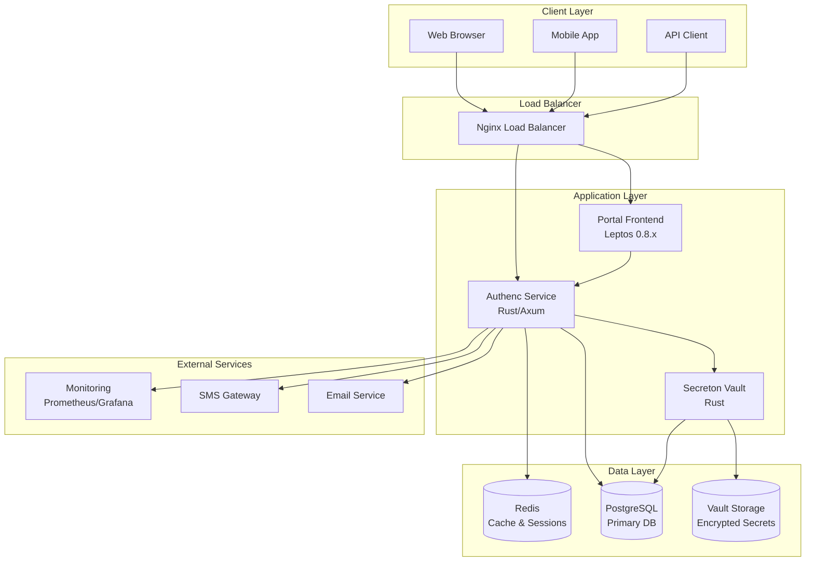
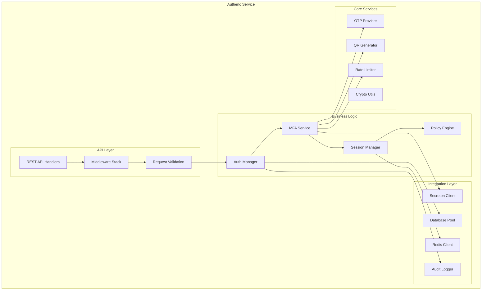
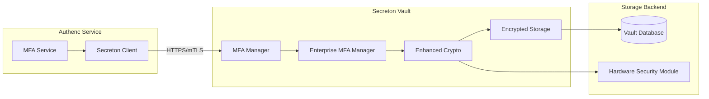
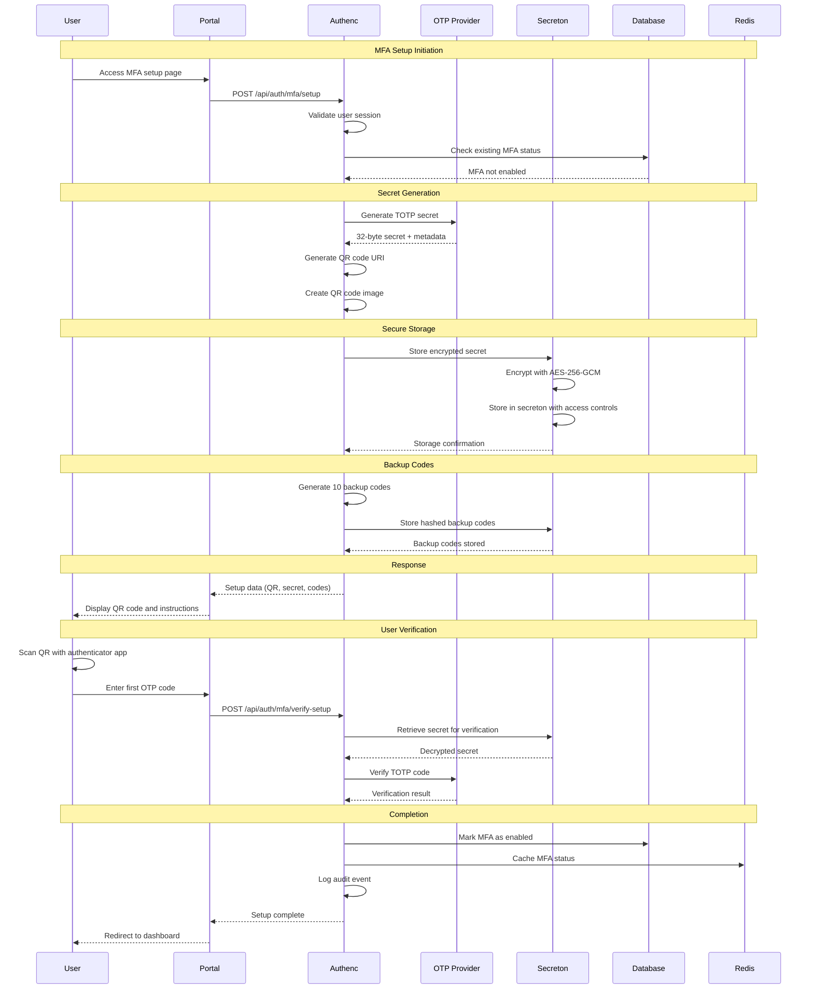
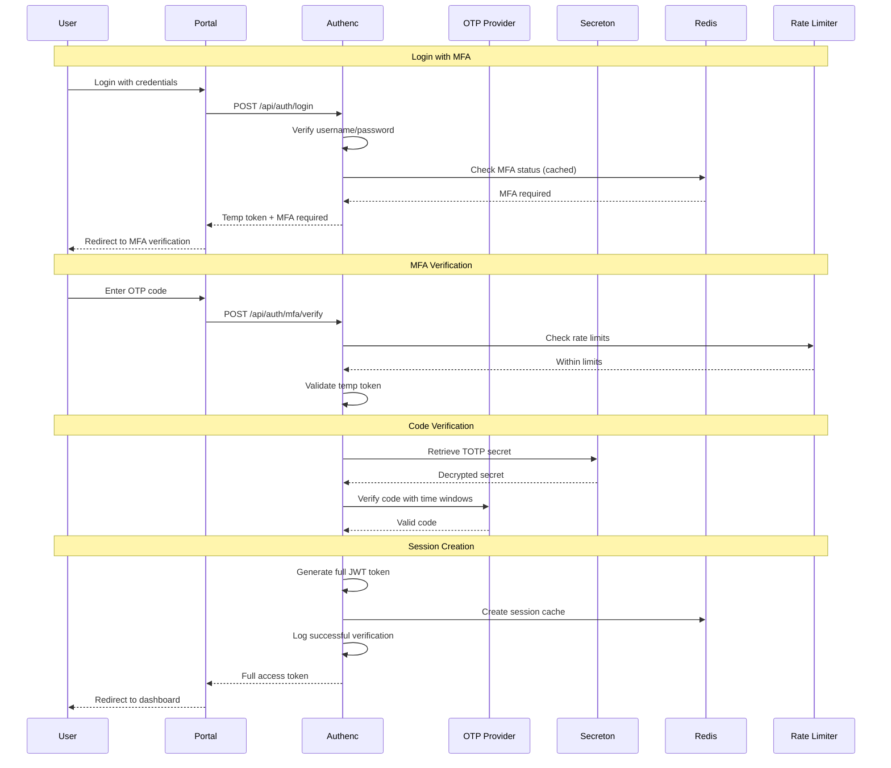
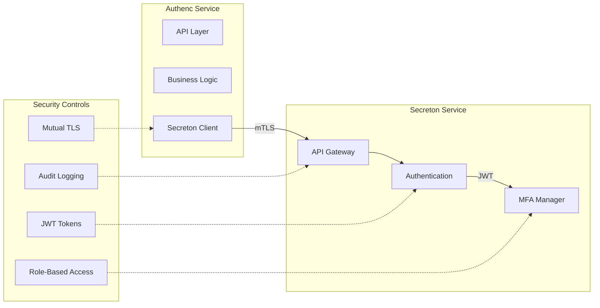
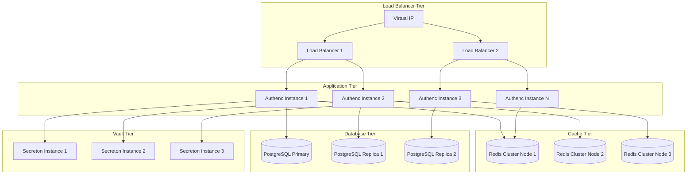

# MFA Architecture Documentation - SIMPEL

## Table of Contents
1. [System Overview](#system-overview)
2. [Component Architecture](#component-architecture)
3. [Data Flow](#data-flow)
4. [Security Architecture](#security-architecture)
5. [Integration Patterns](#integration-patterns)
6. [Scalability Design](#scalability-design)
7. [Deployment Architecture](#deployment-architecture)

---

## System Overview

### High-Level Architecture



### Core Components

#### 1. Portal Frontend (Leptos 0.8.x)
- **Purpose**: User interface for MFA setup and verification
- **Technology**: Rust + Leptos framework, WebAssembly
- **Responsibilities**:
  - MFA setup wizard with QR code display
  - OTP verification forms
  - User-friendly error handling
  - Responsive design for mobile/desktop

#### 2. Authenc Service (Authentication & Authorization)
- **Purpose**: Core authentication service with MFA capabilities
- **Technology**: Rust +m web framework
- **Responsibilities**:
  - User authentication and session management
  - TOTP generation and verification
  - MFA policy enforcement
  - Integration with Secreton for secret storage

#### 3. Secreton Vault (Security Vault)
- **Purpose**: Secure storage and management of cryptographic secrets
- **Technology**: Rust with enterprise-grade encryption
- **Responsibilities**:
  - Encrypted storage of TOTP secrets
  - Key management and rotation
  - Access control and audit logging
  - Backup code generation and storage

---

## Component Architecture

### Authenc Service Architecture



### MFA Service Internal Architecture

```rust
// Core MFA Service Structure
pub struct MfaService {
    otp_provider: Arc<OtpCredentialProvider>,
    secreton_client: Arc<SecretonClient>,
    db_pool: Arc<PgPool>,
    redis_client: Arc<RedisClient>,
    rate_limiter: Arc<RateLimiter>,
    audit_logger: Arc<AuditLogger>,
}

impl MfaService {
    // Setup flow
    pub async fn setup_mfa(&self, user_id: Uuid) -> Result<MfaSetupResponse>;
    pub async fn verify_setup(&self, user_id: Uuid, code: &str) -> Result<()>;

    // Verification flow
    pub async fn verify_mfa(&self, user_id: Uuid, code: &str) -> Result<()>;
    pub async fn verify_backup_code(&self, user_id: Uuid, code: &str) -> Result<()>;

    // Management
    pub async fn reset_mfa(&self, user_id: Uuid) -> Result<MfaSetupResponse>;
    pub async fn disable_mfa(&self, user_id: Uuid, reason: &str) -> Result<()>;

    // Admin operations
    pub async fn admin_reset_user_mfa(&self, admin_id: Uuid, user_id: Uuid) -> Result<()>;
    pub async fn get_mfa_status(&self, user_id: Uuid) -> Result<MfaStatus>;
}
```
### Secreton Integration Architecture



### Database Schema Architecture

```sql
-- Core MFA tables in PostgreSQL
CREATE SCHEMA mfa;

-- User MFA status and metadata
CREATE TABLE mfa.user_mfa_status (
    user_id UUID PRIMARY KEY REFERENCES users(id),
    mfa_enabled BOOLEAN NOT NULL DEFAULT FALSE,
    mfa_required BOOLEAN NOT NULL DEFAULT FALSE,
    setup_at TIMESTAMP WITH TIME ZONE,
    last_used_at TIMESTAMP WITH TIME ZONE,
    backup_codes_remaining INTEGER DEFAULT 0,
    created_at TIMESTAMP WITH TIME ZONE DEFAULT NOW(),
    updated_at TIMESTAMP WITH TIME ZONE DEFAULT NOW()
);

-- MFA audit and event logs
CREATE TABLE mfa.audit_logs (
    id UUID PRIMARY KEY DEFAULT gen_random_uuid(),
    user_id UUID REFERENCES users(id),
    event_type VARCHAR(50) NOT NULL,
    event_data JSONB,
    ip_address INET,
    user_agent TEXT,
    result VARCHAR(20), -- success, failed, error
    created_at TIMESTAMP WITH TIME ZONE DEFAULT NOW()
);

-- MFA configuration and policies
CREATE TABLE mfa.policies (
    id UUID PRIMARY KEY DEFAULT gen_random_uuid(),
    name VARCHAR(100) NOT NULL,
    description TEXT,
    policy_data JSONB NOT NULL,
    active BOOLEAN DEFAULT TRUE,
    created_by UUID REFERENCES users(id),
    created_at TIMESTAMP WITH TIME ZONE DEFAULT NOW()
);

-- Rate limiting and security
CREATE TABLE mfa.rate_limits (
    id UUID PRIMARY KEY DEFAULT gen_random_uuid(),
    user_id UUID REFERENCES users(id),
    ip_address INET,
    endpoint VARCHAR(100),
    attempt_count INTEGER DEFAULT 1,
    window_start TIMESTAMP WITH TIME ZONE DEFAULT NOW(),
    locked_until TIMESTAMP WITH TIME ZONE
);

-- Indexes for performance
CREATE INDEX idx_user_mfa_status_enabled ON mfa.user_mfa_status(mfa_enabled);
CREATE INDEX idx_audit_logs_user_created ON mfa.audit_logs(user_id, created_at DESC);
CREATE INDEX idx_rate_limits_user_endpoint ON mfa.rate_limits(user_id, endpoint);
CREATE INDEX idx_rate_limits_ip_endpoint ON mfa.rate_limits(ip_address, endpoint);
```

---

## Data Flow

### MFA Setup Flow



### MFA Verification Flow



---

## Security Architecture

### Zero-Trust Security Model

```mermaid
graph TB
    subgraph "Security Layers"
        subgraph "Network Security"
            FW[Firewall Rules]
            WAF[Web Application Firewall]
            DDoS[DDoS Protection]
        end

        subgraph "Application Security"
            AUTH[Authentication]
            AUTHZ[Authorization]
            MFA_SEC[MFA Security]
            RATE_LIM[Rate Limiting]
        end

        subgraph "Data Security"
            ENCRYPT[Encryption at Rest]
            TLS[TLS in Transit]
            KEY_MGT[Key Management]
            AUDIT[Audit Logging]
        end

        subgraph "Infrastructure Security"
            RBAC[Role-Based Access]
            SECRETS[Secret Management]
            MONITOR[Security Monitoring]
            INCIDENT[Incident Response]
        end
    end

    FW --> WAF
    WAF --> DDoS
    DDoS --> AUTH
    AUTH --> AUTHZ
    AUTHZ --> MFA_SEC
    MFA_SEC --> RATE_LIM
    RATE_LIM --> ENCRYPT
    ENCRYPT --> TLS
    TLS --> KEY_MGT
    KEY_MGT --> AUDIT
    AUDIT --> RBAC
    RBAC --> SECRETS
    SECRETS --> MONITOR
    MONITOR --> INCIDENT
```


### Cryptographic Architecture

```rust
// Cryptographic components and their relationships
pub struct CryptoArchitecture {
    // TOTP Implementation
    totp_config: TotpConfig {
        algorithm: HmacSha256,    // Upgraded from SHA1
        digits: 6,
        period: 30,
        skew: 1,                  // ±30 seconds tolerance
    },

    // Secret Encryption
    secret_encryption: SecretEncryption {
        algorithm: Aes256Gcm,
        key_derivation: Pbkdf2,
        salt_length: 32,
        iterations: 100_000,
    },

    // Backup Code Security
    backup_codes: BackupCodeSecurity {
        hash_algorithm: Sha256,
        salt_per_code: true,
        code_length: 8,
        character_set: "0123456789ABCDEF",
    },

    // Session Security
    session_security: SessionSecurity {
        jwt_algorithm: Rs256,
        key_rotation_interval: Duration::days(30),
        session_timeout: Duration::hours(8),
    },
}

// Key Management Hierarchy
pub struct KeyManagement {
    // Master Key (HSM or Secreton)
    master_key: MasterKey {
        algorithm: Aes256,
        storage: HardwareSecurityModule,
        rotation_schedule: Quarterly,
    },

    // Data Encryption Keys
    data_keys: Vec<DataKey> {
        purpose: ["mfa_secrets", "backup_codes", "audit_logs"],
        derived_from: master_key,
        rotation_schedule: Monthly,
    },

    // Transport Keys
    transport_keys: TransportKeys {
        tls_certificates: X509Certificates,
        mtls_client_certs: ClientCertificates,
        api_signing_keys: EcdsaP256,
    },
}
```

### Threat Model and Mitigations

| Threat | Impact | Likelihood | Mitigation |
|--------|--------|------------|------------|
| **TOTP Secret Compromise** | High | Low | Encrypted storage, key rotation, audit logging |
| **Brute Force Attacks** | Medium | Medium | Rate limiting, account lockout, progressive delays |
| **Session Hijacking** | High | Low | Secure JWT, HTTPS only, short expiration |
| **Backup Code Theft** | Medium | Low | Hashed storage, one-time use, regeneration |
| **Database Breach** | High | Low | Encryption at rest, access controls, monitoring |
| **Man-in-the-Middle** | High | Low | TLS 1.3, certificate pinning, HSTS |
| **Replay Attacks** | Medium | Medium | Time-based codes, nonce validation |
| **Social Engineering** | Medium | Medium | User education, admin verification |

---

## Integration Patterns

### Service-to-Service Communication



### API Integration Pattern

```rust
// Secreton Client Implementation
#[async_trait]
pub trait SecretonMfaClient {
    async fn store_mfa_secret(
        &self,
        user_id: Uuid,
        secret: &[u8],
        metadata: MfaMetadata,
    ) -> Result<SecretId>;

    async fn retrieve_mfa_secret(
        &self,
        user_id: Uuid,
    ) -> Result<Vec<u8>>;

    async fn rotate_mfa_secret(
        &self,
        user_id: Uuid,
        new_secret: &[u8],
    ) -> Result<SecretId>;

    async fn delete_mfa_secret(
        &self,
        user_id: Uuid,
    ) -> Result<()>;
}

// Implementation with retry and circuit breaker
pub struct SecretonClientImpl {
    http_client: reqwest::Client,
    base_url: Url,
    auth_token: String,
    circuit_breaker: CircuitBreaker,
    retry_policy: RetryPolicy,
}

impl SecretonClientImpl {
    async fn make_request<T>(&self, request: Request) -> Result<T> {
        self.circuit_breaker.call(|| {
            self.retry_policy.retry(|| {
                self.http_client.execute(request.clone())
            })
        }).await
    }
}
```

### Event-Driven Architecture

```yaml
# Event Bus Configuration
event_bus:
  type: "redis_streams"
  streams:
    - name: "mfa.events"
      max_length: 10000
      retention: "7d"

  producers:
    - service: "authenc"
      events: ["mfa.setup", "mfa.verify", "mfa.reset"]

  consumers:
    - service: "audit-service"
      events: ["mfa.*"]
      consumer_group: "audit-processors"

    - service: "notification-service"
      events: ["mfa.setup", "mfa.reset"]
      consumer_group: "notification-processors"

    - service: "security-monitor"
      events: ["mfa.verify.failed", "mfa.account.locked"]
      consumer_group: "security-processors"
```

---

## Scalability Design

### Horizontal Scaling Architecture


### Performance Optimization Strategies

```rust
// Caching Strategy Implementation
pub struct MfaCacheStrategy {
    // L1 Cache: In-memory application cache
    l1_cache: Arc<Mutex<LruCache<UserId, MfaStatus>>>,

    // L2 Cache: Redis distributed cache
    l2_cache: Arc<RedisClient>,

    // Cache TTL configuration
    ttl_config: CacheTtlConfig {
        mfa_status: Duration::minutes(15),
        user_session: Duration::hours(8),
        rate_limit: Duration::minutes(10),
        backup_codes_count: Duration::hours(1),
    },
}

impl MfaCacheStrategy {
    async fn get_mfa_status(&self, user_id: UserId) -> Option<MfaStatus> {
        // Try L1 cache first
        if let Some(status) = self.l1_cache.lock().await.get(&user_id) {
            return Some(status.clone());
        }

        // Try L2 cache
        if let Ok(Some(status)) = self.l2_cache.get(&format!("mfa:status:{}", user_id)).await {
            // Populate L1 cache
            self.l1_cache.lock().await.put(user_id, status.clone());
            return Some(status);
        }

        None
    }

    async fn set_mfa_status(&self, user_id: UserId, status: MfaStatus) {
        // Update both caches
        self.l1_cache.lock().await.put(user_id, status.clone());
        let _ = self.l2_cache.setex(
            &format!("mfa:status:{}", user_id),
            self.ttl_config.mfa_status.as_secs(),
            &status
        ).await;
    }
}

// Database Connection Pooling
pub struct DatabaseConfig {
    pool_config: PgPoolOptions {
        max_connections: 20,
        min_connections: 5,
        acquire_timeout: Duration::seconds(30),
        idle_timeout: Duration::minutes(10),
        max_lifetime: Duration::hours(1),
    },

    read_replica_config: ReadReplicaConfig {
        replicas: vec![
            "postgres://replica1:5432/simipelv2",
            "postgres://replica2:5432/simipelv2",
        ],
        load_balancing: LoadBalancingStrategy::RoundRobin,
        failover_timeout: Duration::seconds(5),
    },
}
```

### Auto-Scaling Configuration

```yaml
# Kubernetes HPA Configuration
apiVersion: autoscaling/v2
kind: HorizontalPodAutoscaler
metadata:
  name: authenc-mfa-hpa
spec:
  scaleTargetRef:
    apiVersion: apps/v1
    kind: Deployment
    name: authenc-service
  minReplicas: 3
  maxReplicas: 20
  metrics:
  - type: Resource
    resource:
      name: cpu
      target:
        type: Utilization
        averageUtilization: 70
  - type: Resource
    resource:
      name: memory
      target:
        type: Utilization
        averageUtilization: 80
  - type: Pods
    pods:
      metric:
        name: mfa_requests_per_second
      target:
        type: AverageValue
        averageValue: "100"
  behavior:
    scaleUp:
      stabilizationWindowSeconds: 60
      policies:
      - type: Percent
        value: 50
        periodSeconds: 60
    scaleDown:
      stabilizationWindowSeconds: 300
      policies:
      - type: Percent
        value: 10
        periodSeconds: 60
```

---

## Deployment Architecture

### Kubernetes Deployment

```yaml
# Authenc Service Deployment
apiVersion: apps/v1
kind: Deployment
metadata:
  name: authenc-service
  namespace: simipelv2
spec:
  replicas: 3
  selector:
    matchLabels:
      app: authenc-service
  template:
    metadata:
      labels:
        app: authenc-service
    spec:
      serviceAccountName: authenc-service-account
      securityContext:
        runAsNonRoot: true
        runAsUser: 1000
        fsGroup: 1000
      containers:
      - name: authenc
        image: registry.kejaksaan.go.id/simipelv2/authenc:v1.0.0
        ports:
        - containerPort: 8080
          name: http
        - containerPort: 9090
          name: metrics
        env:
        - name: DATABASE_URL
          valueFrom:
            secretKeyRef:
              name: database-credentials
              key: url
        - name: REDIS_URL
          valueFrom:
            secretKeyRef:
              name: redis-credentials
              key: url
        - name: SECRETON_URL
          valueFrom:
            configMapKeyRef:
              name: service-config
              key: secreton-url
        resources:
          requests:
            memory: "256Mi"
            cpu: "250m"
          limits:
            memory: "512Mi"
            cpu: "500m"
        livenessProbe:
          httpGet:
            path: /health
            port: 8080
          initialDelaySeconds: 30
          periodSeconds: 10
        readinessProbe:
          httpGet:
            path: /ready
            port: 8080
          initialDelaySeconds: 5
          periodSeconds: 5
        securityContext:
          allowPrivilegeEscalation: false
          readOnlyRootFilesystem: true
          capabilities:
            drop:
            - ALL
        volumeMounts:
        - name: tmp
          mountPath: /tmp
        - name: config
          mountPath: /etc/authenc
          readOnly: true
      volumes:
      - name: tmp
        emptyDir: {}
      - name: config
        configMap:
          name: authenc-config
```

### Service Mesh Integration

```yaml
# Istio Service Mesh Configuration
apiVersion: networking.istio.io/v1beta1
kind: VirtualService
metadata:
  name: authenc-mfa-vs
spec:
  hosts:
  - authenc-service
  http:
  - match:
    - uri:
        prefix: "/api/auth/mfa"
    route:
    - destination:
        host: authenc-service
        port:
          number: 8080
    fault:
      delay:
        percentage:
          value: 0.1
        fixedDelay: 5s
    retries:
      attempts: 3
      perTryTimeout: 2s
    timeout: 10s

---
apiVersion: security.istio.io/v1beta1
kind: PeerAuthentication
metadata:
  name: authenc-mfa-pa
spec:
  selector:
    matchLabels:
      app: authenc-service
  mtls:
    mode: STRICT

---
apiVersion: security.istio.io/v1beta1
kind: AuthorizationPolicy
metadata:
  name: authenc-mfa-authz
spec:
  selector:
    matchLabels:
      app: authenc-service
  rules:
  - from:
    - source:
        principals: ["cluster.local/ns/simipelv2/sa/portal-service"]
    - source:
        principals: ["cluster.local/ns/simipelv2/sa/api-gateway"]
    to:
    - operation:
        methods: ["GET", "POST"]
        paths: ["/api/auth/mfa/*"]
```

### Monitoring and Observability

```yaml
# Prometheus ServiceMonitor
apiVersion: monitoring.coreos.com/v1
kind: ServiceMonitor
metadata:
  name: authenc-mfa-metrics
spec:
  selector:
    matchLabels:
      app: authenc-service
  endpoints:
  - port: metrics
    interval: 30s
    path: /metrics

---
# Grafana Dashboard ConfigMap
apiVersion: v1
kind: ConfigMap
metadata:
  name: mfa-dashboard
data:
  dashboard.json: |
    {
      "dashboard": {
        "title": "MFA Service Metrics",
        "panels": [
          {
            "title": "MFA Requests Rate",
            "type": "graph",
            "targets": [
              {
                "expr": "rate(mfa_requests_total[5m])",
                "legendFormat": "{{method}} {{endpoint}}"
              }
            ]
          },
          {
            "title": "MFA Success Rate",
            "type": "singlestat",
            "targets": [
              {
                "expr": "rate(mfa_verifications_success_total[5m]) / rate(mfa_verifications_total[5m]) * 100"
              }
            ]
          }
        ]
      }
    }
```

---

**Architecture Version**: 1.0
**Last Updated**: October 15, 2024
**Maintained By**: SIMPEL Architecture Team
**Contact**: architecture@kejaksaan.go.id
