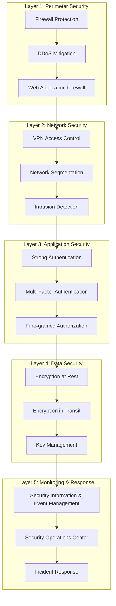

# MFA Security Considerations and Compliance - SIMPelv2

## Table of Contents
1. [Security Framework](#security-framework)
2. [Regulatory Compliance](#regulatory-compliance)
3. [Risk Assessment](#risk-assessment)
4. [Security Controls](#security-controls)
5. [Compliance Validation](#compliance-validation)
6. [Audit Requirements](#audit-requirements)
7. [Continuous Monitoring](#continuous-monitoring)

---

## Security Framework

### Defense in Depth Strategy

The MFA implementation follows a comprehensive defense-in-depth approach:



### Security Principles

#### 1. Zero Trust Architecture
- **Never Trust, Always Verify**: Every request is authenticated and authorized
- **Least Privilege Access**: Minimal necessary permissions granted
- **Assume Breach**: Design with the assumption that perimeter is compromised
- **Continuous Verification**: Ongoing validation of user identity and device trust

#### 2. Cryptographic Standards
```yaml
cryptographic_standards:
  totp_algorithm:
    primary: "HMAC-SHA256"
    fallback: "HMAC-SHA1"  # For legacy compatibility
    secret_length: 256  # bits
    time_step: 30  # seconds
    code_digits: 6

  encryption:
    symmetric: "AES-256-GCM"
    asymmetric: "RSA-4096 / ECDSA-P384"
    key_derivation: "PBKDF2-SHA256"
    iterations: 100000

  transport_security:
    tls_version: "1.3"
    cipher_suites:
      - "TLS_AES_256_GCM_SHA384"
      - "TLS_CHACHA20_POLY1305_SHA256"
    certificate_validation: "strict"

  digital_signatures:
    algorithm: "ECDSA-P384-SHA384"
    key_rotation: "quarterly"
```

#### 3. Secure Development Lifecycle
- **Security by Design**: Security considerations from initial design
- **Threat Modeling**: Systematic identification of security threats
- **Secure Coding**: Following secure coding practices and standards
- **Security Testing**: Regular penetration testing and vulnerability assessments

---

## Regulatory Compliance

### Indonesian Government Regulations

#### 1. Peraturan Menteri Komunikasi dan Informatika No. 4 Tahun 2016
**Requirement**: Keamanan Informasi dalam Penyelenggaraan Sistem Elektronik

**Compliance Mapping**:
```yaml
permenkominfo_4_2016:
  pasal_15_autentikasi:
    requirement: "Sistem elektronik wajib menerapkan autentikasi yang kuat"
    implementation:
      - multi_factor_authentication: "TOTP + Password"
      - strong_password_policy: "Minimum 12 characters, complexity rules"
      - session_management: "Secure JWT with 8-hour expiration"

  pasal_16_otorisasi:
    requirement: "Penerapan mekanisme otorisasi yang tepat"
    implementation:
 - role_based_access_control: "RBAC with principle of least privilege"
      - mfa_policy_enforcement: "MFA required for privileged operations"
      - audit_logging: "Comprehensive access logging"

  pasal_17_audit:
    requirement: "Pencatatan dan pemantauan aktivitas sistem"
    implementation:
      - mfa_audit_logs: "All MFA events logged with tamper protection"
      - real_time_monitoring: "24/7 security monitoring"
      - log_retention: "7 years as per government requirements"
```

#### 2. Surat Edaran Menteri PANRB No. 3 Tahun 2018
**Requirement**: Keamanan Data dan Informasi ASN

**Compliance Implementation**:
```sql
-- Data protection compliance tracking
CREATE TABLE compliance_tracking (
    id UUID PRIMARY KEY,
    regulation VARCHAR(100) NOT NULL,
    requirement_id VARCHAR(50) NOT NULL,
    compliance_status VARCHAR(20) NOT NULL, -- COMPLIANT, PARTIAL, NON_COMPLIANT
    evidence JSONB,
    assessment_date DATE NOT NULL,
    next_review_date DATE NOT NULL,
    responsible_officer UUID REFERENCES users(id)
);

-- Insert compliance requirements
INSERT INTO compliance_tracking VALUES
('uuid1', 'SE_MENPANRB_3_2018', 'DATA_SECURITY', 'COMPLIANT',
 '{"encryption": "AES-256", "access_control": "RBAC", "mfa": "enabled"}',
 CURRENT_DATE, CURRENT_DATE + INTERVAL '3 months', 'security-officer-uuid'),

('uuid2', 'SE_MENPANRB_3_2018', 'BACKUP_RECOVERY', 'COMPLIANT',
 '{"backup_frequency": "daily", "recovery_tested": "monthly", "offsite_storage": "enabled"}',
 CURRENT_DATE, CURRENT_DATE + INTERVAL '3 months', 'security-officer-uuid');
```
#### 3. ISO 27001:2013 Information Security Management

**Control Implementation Matrix**:

| ISO Control | Description | MFA Implementation | Status |
|-------------|-------------|-------------------|---------|
| A.9.1.2 | Access to networks and network services | MFA required for network access | ✅ Implemented |
| A.9.2.1 | User registration and de-registration | Automated MFA provisioning/deprovisioning | ✅ Implemented |
| A.9.2.2 | User access provisioning | Role-based MFA requirements | ✅ Implemented |
| A.9.2.3 | Management of privileged access rights | Enhanced MFA for admin accounts | ✅ Implemented |
| A.9.2.4 | Management of secret authentication information | Secure TOTP secret storage | ✅ Implemented |
| A.9.2.5 | Review of user access rights | Regular MFA access reviews | ✅ Implemented |
| A.9.2.6 | Removal or adjustment of access rights | Automated MFA disabling | ✅ Implemented |
| A.9.4.2 | Secure log-on procedures | MFA integrated login process | ✅ Implemented |
| A.9.4.3 | Password management system | TOTP as password alternative | ✅ Implemented |

### International Standards Compliance

#### NIST Cybersecurity Framework
```yaml
nist_csf_compliance:
  identify:
    - asset_management: "MFA secrets classified as critical assets"
    - risk_assessment: "Regular MFA risk assessments conducted"

  protect:
    - access_control: "MFA enforces strong authentication"
    - data_security: "TOTP secrets encrypted at rest and in transit"
    - protective_technology: "Hardware security modules for key storage"

  detect:
    - anomaly_detection: "Real-time MFA anomaly detection"
    - security_monitoring: "24/7 MFA security event monitoring"

  respond:
    - incident_response: "MFA-specific incident response procedures"
    - communications: "Automated security alerts for MFA incidents"

  recover:
    - recovery_planning: "MFA disaster recovery procedures"
    - improvements: "Post-incident MFA security improvements"
```

#### NIST SP 800-63B Authentication Guidelines
```yaml
nist_800_63b_compliance:
  authenticator_assurance_level: "AAL2"  # Multi-factor authentication

  memorized_secrets:  # Passwords
    minimum_length: 12
    complexity_requirements: false  # NIST recommends against complexity
    password_hints: false
    knowledge_based_authentication: false

  out_of_band_authenticators:  # TOTP
    time_based: true
    algorithm: "HMAC-SHA256"
    key_length: 256  # bits
    time_step: 30  # seconds

  verifier_requirements:
    rate_limiting: true
    account_lockout: true
    secure_storage: true
    salted_hashing: true
```

---

## Risk Assessment

### MFA-Specific Risk Analysis

#### High-Risk Scenarios
```yaml
high_risk_scenarios:
  totp_secret_compromise:
    probability: "Low"
    impact: "High"
    risk_score: 6  # (2 * 3)
    mitigations:
      - "Encrypted storage with HSM"
      - "Regular key rotation"
      - "Access logging and monitoring"
      - "Principle of least privilege"

  mass_account_lockout:
    probability: "Medium"
    impact: "High"
    risk_score: 9  # (3 * 3)
    mitigations:
      - "Rate limiting per IP and user"
      - "Progressive delay mechanisms"
      - "Admin override capabilities"
      - "Incident response procedures"

  backup_code_exhaustion:
    probability: "Medium"
    impact: "Medium"
    risk_score: 6  # (3 * 2)
    mitigations:
      - "Automatic regeneration alerts"
      - "Admin-assisted recovery"
      - "Alternative authentication methods"
      - "User education programs"
```

#### Risk Mitigation Matrix
```sql
-- Risk tracking and mitigation
CREATE TABLE security_risks (
    id UUID PRIMARY KEY,
    risk_category VARCHAR(50) NOT NULL,
    risk_description TEXT NOT NULL,
    probability VARCHAR(20) NOT NULL, -- LOW, MEDIUM, HIGH
    impact VARCHAR(20) NOT NULL,      -- LOW, MEDIUM, HIGH
    risk_score INTEGER NOT NULL,
    mitigation_status VARCHAR(20) NOT NULL, -- PLANNED, IN_PROGRESS, IMPLEMENTED
    mitigation_measures JSONB,
    owner_id UUID REFERENCES users(id),
    created_at TIMESTAMP WITH TIME ZONE DEFAULT NOW(),
    updated_at TIMESTAMP WITH TIME ZONE DEFAULT NOW()
);

-- Example risk entries
INSERT INTO security_risks VALUES
('risk-001', 'AUTHENTICATION', 'TOTP secret database compromise', 'LOW', 'HIGH', 6,
 'IMPLEMENTED',
 '{"encryption": "AES-256-GCM", "access_control": "RBAC", "monitoring": "24/7"}',
 'security-officer-uuid', NOW(), NOW()),

('risk-002', 'AVAILABILITY', 'DDoS attack on MFA endpoints', 'MEDIUM', 'HIGH', 9,
 'IMPLEMENTED',
 '{"rate_limiting": true, "ddos_protection": "CloudFlare", "failover": "multi-region"}',
 'security-officer-uuid', NOW(), NOW());
```

---

## Security Controls

### Technical Controls

#### 1. Cryptographic Controls
```rust
// Secure TOTP implementation
pub struct SecureTotpProvider {
    config: TotpConfig {
        algorithm: HmacSha256,
        digits: 6,
        period: 30,
        skew: 1,
        secret_length: 32, // 256 bits
    },

    // Secure random number generation
    rng: SystemRandom,

    // Key derivation for secret encryption
    kdf: Pbkdf2 {
        algorithm: Pbkdf2HmacSha256,
        iterations: 100_000,
        salt_length: 32,
    },
}

impl SecureTotpProvider {
    pub fn generate_secret(&self) -> Result<Vec<u8>, CryptoError> {
        let mut secret = vec![0u8; self.config.secret_length];
        self.rng.fill(&mut secret)?;

        // Validate entropy
        if self.validate_entropy(&secret)? {
            Ok(secret)
        } else {
            Err(CryptoError::InsufficientEntropy)
        }
    }

    pub fn verify_totp(&self, secret: &[u8], code: &str, timestamp: u64) -> Result<bool> {
        let time_step = timestamp / self.config.period;

        // Check current and adjacent time windows for clock skew
        for window in (time_step.saturating_sub(self.config.skew))..=(time_step + self.config.skew) {
            if self.generate_totp(secret, window)? == code {
                return Ok(true);
            }
        }

        Ok(false)
    }
}
```

#### 2. Access Controls
```yaml
rbac_configuration:
  roles:
    mfa_user:
      permissions:
        - "mfa:setup:own"
        - "mfa:verify:own"
        - "mfa:status:read:own"
        - "mfa:backup_codes:regenerate:own"

    mfa_admin:
      permissions:
        - "mfa:*:*"  # Full MFA administration
        - "mfa:users:list"
        - "mfa:users:reset"
        - "mfa:reports:read"
        - "mfa:policies:manage"

    security_officer:
      permissions:
        - "mfa:audit:read"
        - "mfa:incidents:manage"
        - "mfa:compliance:report"
        - "mfa:risk:assess"

  policies:
    mfa_setup_policy:
      effect: "ALLOW"
      principals: ["role:mfa_user"]
      actions: ["mfa:setup:own"]
      conditions:
        - "user.mfa_enabled == false"
        - "user.account_status == 'active'"

    admin_reset_policy:
      effect: "ALLOW"
      principals: ["role:mfa_admin"]
      actions: ["mfa:users:reset"]
      conditions:
        - "request.reason != null"
        - "target_user.role != 'super_admin'"
```
#### 3. Monitoring and Detection Controls
```sql
-- Security event detection rules
CREATE TABLE security_detection_rules (
    id UUID PRIMARY KEY,
    rule_name VARCHAR(100) NOT NULL,
    rule_type VARCHAR(50) NOT NULL, -- THRESHOLD, ANOMALY, PATTERN
    rule_definition JSONB NOT NULL,
    severity VARCHAR(20) NOT NULL,   -- LOW, MEDIUM, HIGH, CRITICAL
    enabled BOOLEAN DEFAULT TRUE,
    created_at TIMESTAMP WITH TIME ZONE DEFAULT NOW()
);

-- Example detection rules
INSERT INTO security_detection_rules VALUES
('rule-001', 'MFA Brute Force Detection', 'THRESHOLD',
 '{"metric": "failed_mfa_attempts", "threshold": 5, "window": "10m", "group_by": "user_id"}',
 'HIGH', TRUE, NOW()),

('rule-002', 'Impossible Travel Detection', 'ANOMALY',
 '{"metric": "mfa_login_location", "algorithm": "geographic_distance", "threshold": "500km/1h"}',
 'MEDIUM', TRUE, NOW()),

('rule-003', 'Mass MFA Disable', 'PATTERN',
 '{"pattern": "admin_mfa_disable", "count": ">10", "window": "1h"}',
 'CRITICAL', TRUE, NOW());

-- Real-time monitoring queries
CREATE OR REPLACE FUNCTION detect_security_events()
RETURNS TABLE(event_type TEXT, severity TEXT, details JSONB) AS $$
BEGIN
    -- Brute force detection
    RETURN QUERY
    SELECT
        'MFA_BRUTE_FORCE'::TEXT,
        'HIGH'::TEXT,
        json_build_object(
            'user_id', ml.user_id,
            'failed_attempts', COUNT(*),
            'time_window', '10 minutes',
            'ip_addresses', array_agg(DISTINCT ml.ip_address)
        )::JSONB
    FROM mfa_logs ml
    WHERE ml.event_type = 'verify_failed'
        AND ml.created_at >= NOW() - INTERVAL '10 minutes'
    GROUP BY ml.user_id
    HAVING COUNT(*) >= 5;

    -- Suspicious admin activity
    RETURN QUERY
    SELECT
        'SUSPICIOUS_ADMIN_ACTIVITY'::TEXT,
        'CRITICAL'::TEXT,
        json_build_object(
            'admin_id', ama.admin_user_id,
            'actions', COUNT(*),
            'action_types', array_agg(DISTINCT ama.action_type),
            'affected_users', COUNT(DISTINCT ama.target_user_id)
        )::JSONB
    FROM admin_mfa_actions ama
    WHERE ama.created_at >= NOW() - INTERVAL '1 hour'
        AND ama.action_type IN ('reset', 'disable', 'force_setup')
    GROUP BY ama.admin_user_id
    HAVING COUNT(*) >= 10;
END;
$$ LANGUAGE plpgsql;
```

### Administrative Controls

#### 1. Security Policies and Procedures
```yaml
security_policies:
  mfa_policy:
    title: "Multi-Factor Authentication Policy"
    version: "1.0"
    effective_date: "2024-10-15"
    review_cycle: "annual"

    requirements:
      mandatory_users:
        - "All government employees"
        - "Contractors with system access"
        - "Third-party service providers"

      exemptions:
        - "Emergency service accounts (temporary, max 24h)"
        - "System service accounts (with compensating controls)"

      enforcement:
        - "Grace period: 7 days for new users"
        - "Account suspension after 30 days non-compliance"
        - "Manager approval required for exemptions"

  incident_response:
    title: "MFA Security Incident Response"
    procedures:
      - "Immediate containment of compromised accounts"
      - "Forensic analysis of security events"
      - "Communication to affected users and management"
      - "Post-incident review and improvement"
```

#### 2. Training and Awareness
```yaml
security_training:
  mfa_user_training:
    frequency: "annual"
    content:
      - "MFA setup and usage procedures"
      - "Recognizing phishing and social engineering"
      - "Secure handling of backup codes"
      - "Incident reporting procedures"

    delivery_methods:
      - "Interactive online modules"
      - "In-person workshops"
      - "Video tutorials"
      - "Quick reference guides"

  admin_training:
    frequency: "semi-annual"
    content:
      - "MFA administration procedures"
      - "Security incident response"
      - "Compliance requirements"
      - "Risk assessment techniques"
```

---

## Compliance Validation

### Automated Compliance Checking

```bash
#!/bin/bash
# Automated compliance validation script

validate_mfa_compliance() {
    local report_file="/var/reports/compliance/mfa_compliance_$(date +%Y%m%d).json"

    echo "Starting MFA compliance validation..."

    # Check 1: MFA adoption rate
    local adoption_rate=$(psql -t -c "
        SELECT ROUND(
            COUNT(CASE WHEN mfa_enabled THEN 1 END) * 100.0 / COUNT(*), 2
        ) FROM users WHERE active = true;
    ")

    # Check 2: Encryption compliance
    local encryption_check=$(./scripts/security/check_encryption_compliance.sh)

    # Check 3: Audit logging compliance
    local audit_check=$(./scripts/security/check_audit_compliance.sh)

    # Check 4: Access control compliance
    local access_check=$(./scripts/security/check_access_control_compliance.sh)

    # Generate compliance report
    cat > $report_file << EOF
{
    "compliance_report": {
        "report_date": "$(date -Iseconds)",
        "report_type": "mfa_compliance_validation",
        "overall_status": "$(determine_overall_status $adoption_rate)",
        "checks": {
            "mfa_adoption": {
                "status": "$(check_adoption_compliance $adoption_rate)",
                "value": $adoption_rate,
                "threshold": 95.0,
                "requirement": "PERMENKOMINFO_4_2016"
            },
            "encryption_compliance": $encryption_check,
            "audit_compliance": $audit_check,
            "access_conl_compliance": $access_check
        }
    }
}
EOF

    echo "Compliance validation completed. Report: $report_file"
}

# Compliance status determination
determine_overall_status() {
    local adoption_rate=$1
    if (( $(echo "$adoption_rate >= 95" | bc -l) )); then
        echo "COMPLIANT"
    elif (( $(echo "$adoption_rate >= 80" | bc -l) )); then
        echo "PARTIALLY_COMPLIANT"
    else
        echo "NON_COMPLIANT"
    fi
}
```

### Compliance Reporting Dashboard

```sql
-- Compliance dashboard queries
CREATE VIEW compliance_dashboard AS
WITH compliance_metrics AS (
    SELECT
        'MFA_ADOPTION' as metric_name,
        ROUND(COUNT(CASE WHEN mfa_enabled THEN 1 END) * 100.0 / COUNT(*), 2) as value,
        95.0 as threshold,
        'PERMENKOMINFO_4_2016' as regulation
    FROM users WHERE active = true

    UNION ALL

    SELECT
        'AUDIT_RETENTION',
        EXTRACT(days FROM (MAX(created_at) - MIN(created_at))),
        2555.0, -- 7 years in days
        'SE_MENPANRB_3_2018'
    FROM mfa_logs

    UNION ALL

    SELECT
        'ENCRYPTION_STRENGTH',
        256.0, -- AES-256
        256.0,
        'ISO_27001'
    FROM (SELECT 1) dummy
)
SELECT
    metric_name,
    value,
    threshold,
    regulation,
    CASE
        WHEN value >= threshold THEN 'COMPLIANT'
        WHEN value >= threshold * 0.8 THEN 'PARTIALLY_COMPLIANT'
        ELSE 'NON_COMPLIANT'
    END as compliance_status,
    CURRENT_TIMESTAMP as last_updated
FROM compliance_metrics;
```

---

## Audit Requirements

### Audit Trail Specifications

```yaml
audit_requirements:
  log_retention:
    duration: "7 years"
    format: "JSON with digital signatures"
    storage: "Immutable storage with WORM compliance"

  audit_events:
    authentication_events:
      - "mfa_setup_initiated"
      - "mfa_setup_completed"
      - "mfa_verification_success"
      - "mfa_verification_failed"
      - "account_locked"
      - "account_unlocked"

    administrative_events:
      - "mfa_admin_reset"
      - "mfa_policy_changed"
      - "mfa_exemption_granted"
      - "mfa_bulk_operation"

    security_events:
      - "suspicious_activity_detected"
      - "brute_force_attempt"
      - "impossible_travel_detected"
      - "security_incident_declared"

  audit_data_elements:
    required_fields:
      - "timestamp (ISO 8601 with timezone)"
      - "user_id (UUID)"
      - "event_type"
      - "event_result (success/failure/error)"
      - "ip_address"
      - "user_agent"
      - "session_id"

    optional_fields:
      - "geolocation"
      - "device_fingerprint"
      - "risk_score"
      - "additional_context"
```

### Audit Log Format

```json
{
  "audit_log_entry": {
    "id": "audit-uuid-12345",
    "timestamp": "2024-10-15T10:30:00.000Z",
    "event_type": "mfa_verification_success",
    "event_category": "authentication",
    "user_id": "user-uuid-67890",
    "user_nip": "12345678",
    "session_id": "session-uuid-abcde",
    "ip_address": "192.168.1.100",
    "user_agent": "Mozilla/5.0 (Windows NT 10.0; Win64; x64) AppleWebKit/537.36",
    "geolocation": {
      "country": "Indonesia",
      "city": "Jakarta",
      "coordinates": {
        "latitude": -6.2088,
        "longitude": 106.8456
      }
    },
    "event_details": {
      "authentication_method": "totp",
      "code_used": "******",
      "time_window": 1697365800,
      "verification_duration_ms": 150
    },
    "risk_assessment": {
      "risk_score": 0.1,
      "risk_factors": [],
      "trust_level": "high"
    },
    "compliance_tags": [
      "PERMENKOMINFO_4_2016",
      "ISO_27001_A.9.4.2"
    ],
    "digital_signature": {
      "algorithm": "ECDSA-P384-SHA384",
      "signature": "MEUCIQDxxx...",
      "certificate_thumbprint": "sha256:abc123..."
    }
  }
}
```

---

## Continuous Monitoring

### Security Metrics and KPIs

```yaml
security_metrics:
  availability_metrics:
    - name: "MFA Service Uptime"
      target: "99.9%"
      measurement: "Monthly"

    - name: "MFA Response Time"
      target: "< 500ms (95th percentile)"
      measurement: "Real-time"

  security_metrics:
    - name: "MFA Adoption Rate"
      target: "> 95%"
      measurement: "Daily"

    - name: "Failed MFA Attempts Rate"
      target: "< 5%"
      measurement: "Real-time"

    - name: "Security Incident Response Time"
      target: "< 15 minutes"
      measurement: "Per incident"

  compliance_metrics:
    - name: "Audit Log Completeness"
      target: "100%"
      measurement: "Daily"

    - name: "Compliance Violation Count"
      target: "0"
      measurement: "Monthly"
```

### Continuous Compliance Monitoring

```python
# Automated compliance monitoring
import asyncio
import json
from datetime import datetime, timedelta

class ComplianceMonitor:
    def __init__(self):
        self.compliance_rules = self.load_compliance_rules()
        self.alert_thresholds = self.load_alert_thresholds()

    async def run_compliance_checks(self):
        """Run all compliance checks and generate alerts if needed"""
        results = {}

        # Check MFA adoption rate
        adoption_rate = await self.check_mfa_adoption_rate()
        results['mfa_adoption'] = adoption_rate

        if adoption_rate < self.alert_thresholds['mfa_adoption']:
            await self.send_compliance_alert(
                'MFA_ADOPTION_LOW',
                f'MFA adoption rate is {adoption_rate}%, below threshold'
            )

        # Check audit log integrity
        audit_integrity = await self.check_audit_log_integrity()
        results['audit_integrity'] = audit_integrity

        # Check encryption compliance
        encryption_compliance = await self.check_encryption_compliance()
        results['encryption_compliance'] = encryption_compliance

        # Generate compliance report
        await self.generate_compliance_report(results)

        return results

    async def check_mfa_adoption_rate(self):
        """Calculate current MFA adoption rate"""
        # Implementation would query database
        pass

    async def send_compliance_alert(self, alert_type, message):
        """Send compliance alert to relevant stakeholders"""
        alert = {
            'timestamp': datetime.utcnow().isoformat(),
            'alert_type': alert_type,
            'severity': 'HIGH',
            'message': message,
            'recipients': ['compliance@kejaksaan.go.id', 'security@kejaksaan.go.id']
        }

        # Send alert via configured channels
        await self.send_email_alert(alert)
        await self.send_slack_alert(alert)

# Schedule compliance monitoring
async def main():
    monitor = ComplianceMonitor()

    # Run compliance checks every hour
    while True:
        try:
            await monitor.run_compliance_checks()
            await asyncio.sleep(3600)  # 1 hour
        except Exception as e:
            print(f"Compliance monitoring error: {e}")
            await asyncio.sleep(300)  # 5 minutes on error

if __name__ == "__main__":
    asyncio.run(main())
```

---

**Document Classification**: CONFIDENTIAL
**Last Updated**: October 15, 2024
**Next Review**: January 15, 2025
**Owner**: Security & Compliance Team
**Contact**: security@kejaksaan.go.id
