# Post-Quantum Migration Strategy

## Executive Summary

This document outlines the comprehensive strategy for migrating the SIMKARI (Sistem Informasi Manajemen Kejaksaan Republik Indonesia) platform to post-quantum cryptography, ensuring long-term security against quantum computing threats while maintaining operational continuity.

## Table of Contents

1. [Migration Overview](#migration-overview)
2. [Threat Assessment](#threat-assessment)
3. [Algorithm Selection](#algorithm-selection)
4. [Migration Phases](#migration-phases)
5. [Implementation Strategy](#implementation-strategy)
6. [Risk Management](#risk-management)
7. [Testing and Validation](#testing-and-validation)
8. [Compliance Considerations](#compliance-considerations)

## Migration Overview

### Strategic Objectives

1. **Quantum Resistance**: Protect against future quantum computing attacks
2. **Operational Continuity**: Maintain service availability during migration
3. **Compliance Adherence**: Meet Indonesian government security requirements
4. **Performance Optimization**: Minimize performance impact of new algorithms
5. **Cost Effectiveness**: Implement migration within budget constraints

### Migration Principles

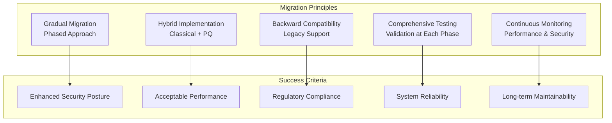

## Threat Assessment

### Quantum Computing Timeline

```mermaid
gantt
    title Quantum Computing Threat Timeline
    dateFormat  YYYY-MM-DD
    section Current State
    NISQ Era                :done, nisq, 2020-01-01, 2030-12-31
    Limited Quantum Advantage :done, limited, 2023-01-01, 2028-12-31

    section Near Term (5-10 years)
    Improved Quantum Hardware :active, improved, 2024-01-01, 2034-12-31
    Cryptographically Relevant :crit, relevant, 2030-01-01, 2035-12-31

    section Long Term (10+ years)
    Large-Scale Quantum     :future, largescale, 2035-01-01, 2045-12-31
    RSA/ECC Breaking        :crit, breaking, 2032-01-01, 2040-12-31
```

### Vulnerability Assessment

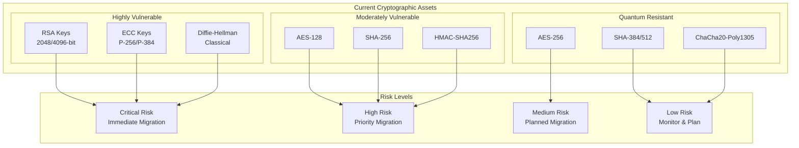

## Algorithm Selection

### NIST Post-Quantum Standards

```mermaid
graph TB
    subgraph "NIST PQC Standards (2024)"
        subgraph "Digital Signatures"
            MLDSA[ML-DSA<br/>(Dilithium)]
            SLHDSA[SLH-DSA<br/>(SPHINCS+)]
            Falcon[Falcon<br/>(Compact Signatures)]
        end

        subgraph "Key Encapsulation"
            MLKEM[ML-KEM<br/>(Kyber)]
            ClassicMcEliece[Classic McEliece<br/>(Code-based)]
            BIKE[BIKE<br/>(Code-based)]
        end

        subgraph "Security Levels"
            Level1[NIST Level 1<br/>AES-128 equivalent]
            Level3[NIST Level 3<br/>AES-192 equivalent]
            Level5[NIST Level 5<br/>AES-256 equivalent]
        end
    end

    MLDSA --> Level1
    MLDSA --> Level3
    MLDSA --> Level5

    MLKEM --> Level1
    MLKEM --> Level3
    MLKEM --> Level5

    SLHDSA --> Level1
    SLHDSA --> Level3
    SLHDSA --> Level5
```

### Algorithm Selection Matrix

| Use Case | Current Algorithm | Selected PQ Algorithm | Security Level | Rationale |
|----------|-------------------|----------------------|----------------|-----------|
| JWT Signing | Ed25519 | ML-DSA-65 | Level 3 | Balance of security and performance |
| TLS Certificates | ECDSA P-256 | ML-DSA-44 | Level 2 | Compatibility with existing PKI |
| Key Exchange | X25519 | ML-KEM-768 | Level 3 | Standard security for most applications |
| Long-term Archives | RSA-4096 | ML-KEM-1024 | Level 5 | Maximum security for sensitive data |
| Document Signing | RSA-2048 | ML-DSA-87 | Level 5 | Legal document integrity |
| Session Keys | ECDH P-256 | ML-KEM-512 | Level 1 | Ephemeral keys, performance priority |

### Implementation Priorities

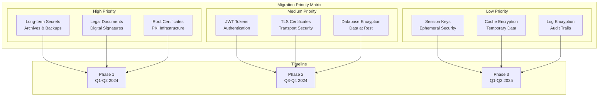

## Migration Phases

### Phase 1: Foundation and Critical Systems (Q1-Q2 2024)

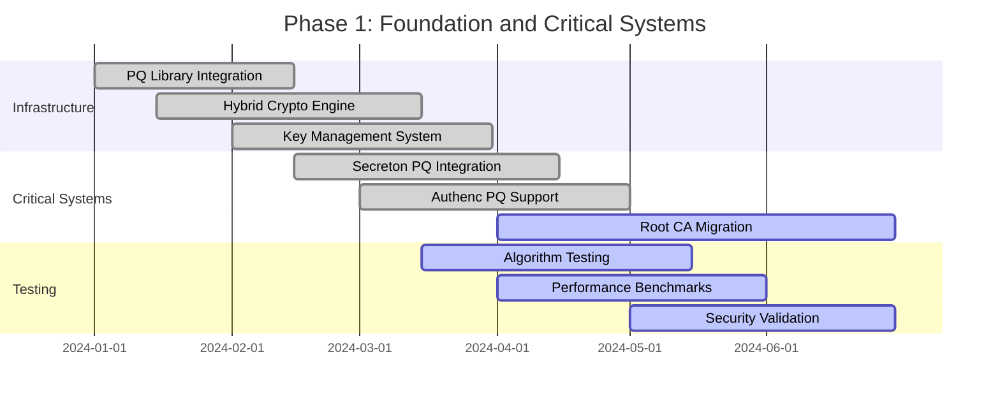

#### Phase 1 Deliverables

1. **Post-Quantum Cryptographic Library**
   - ML-DSA and ML-KEM implementations
   - Hybrid cryptographic operations
   - Performance optimizations

2. **Enhanced Key Management**
   - Post-quantum key generation
   - Hybrid key storage
   - Automated key rotation

3. **Critical System Updates**
   - Secreton post-quantum encryption
   - Authenc hybrid signatures
   - Root certificate authority migration

### Phase 2: Service Integration (Q3-Q4 2024)

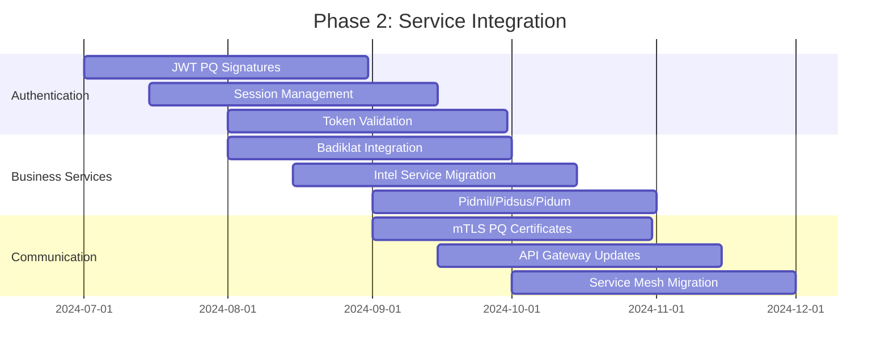

#### Phase 2 Deliverables

1. **Authentication System Migration**
   - JWT tokens with ML-DSA signatures
   - Hybrid session management
   - Post-quantum token validation

2. **Business Service Integration**
   - All SIMKARI services support PQ
   - Hybrid communication protocols
   - Performance optimization

3. **Infrastructure Updates**
   - mTLS with post-quantum certificates
   - API gateway PQ support
   - Service mesh configuration

### Phase 3: Full Migration and Optimization (Q1-Q2 2025)

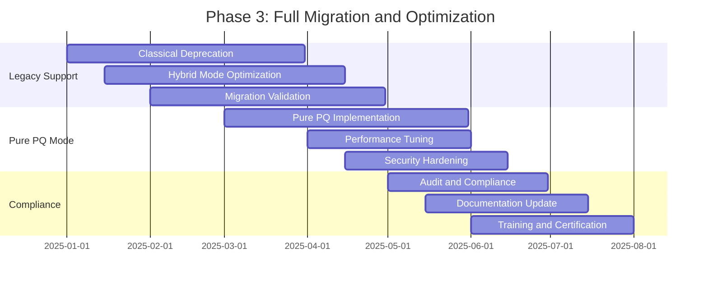

#### Phase 3 Deliverables

1. **Legacy System Deprecation**
   - Classical algorithm phase-out
   - Hybrid mode optimization
   - Migration completion validation

2. **Pure Post-Quantum Mode**
   - Full PQ implementation
   - Performance optimization
   - Security validation

3. **Compliance and Documentation**
   - Regulatory compliance verification
   - Complete documentation update
   - Staff training and certification

## Implementation Strategy

### Hybrid Cryptography Approach

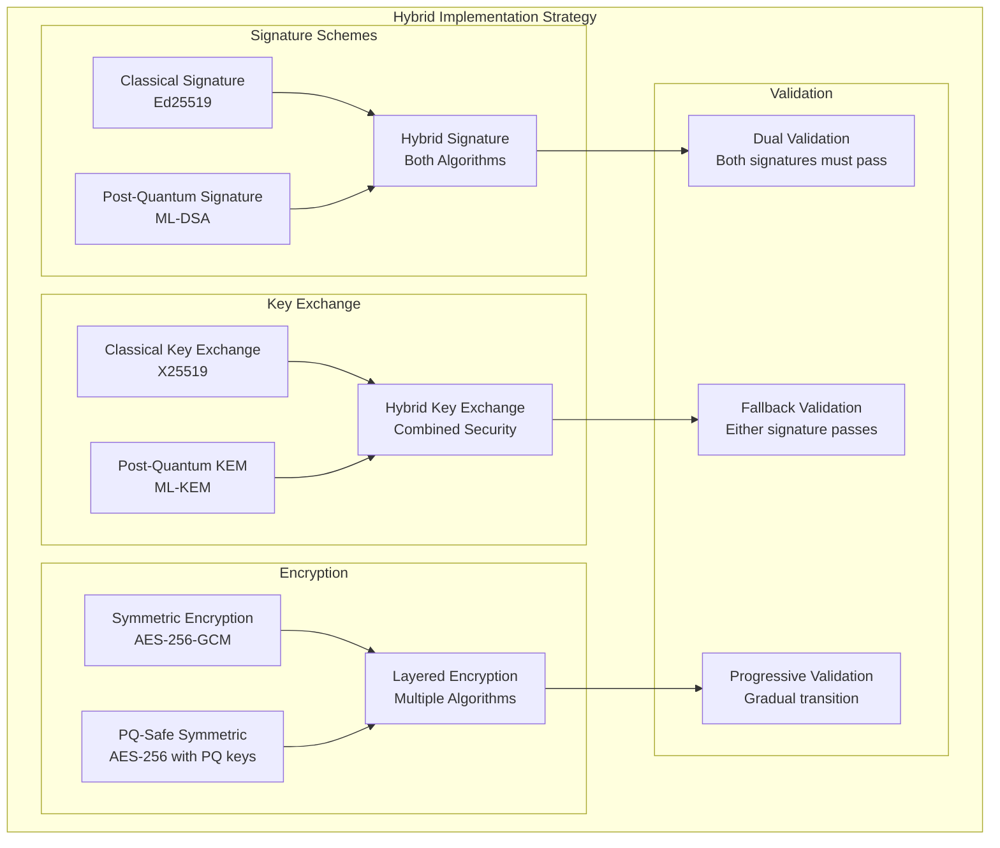

### Migration Control System

```rust
// Configuration-driven migration control
#[derive(Debug, Clone, Serialize, Deserialize)]
pub struct MigrationConfig {
    pub crypto_mode: CryptoMode,
    pub signature_policy: SignaturePolicy,
    pub key_exchange_policy: KeyExchangePolicy,
    pub encryption_policy: EncryptionPolicy,
    pub validation_policy: ValidationPolicy,
}

#[derive(Debug, Clone, Serialize, Deserialize)]
pub enum CryptoMode {
    Classical,           // Legacy mode
    Hybrid,             // Transition mode
    PostQuantum,        // Target mode
    Progressive(f32),   // Gradual transition (0.0 to 1.0)
}

#[derive(Debug, Clone, Serialize, Deserialize)]
pub struct SignaturePolicy {
    pub require_classical: bool,
    pub require_post_quantum: bool,
    pub allow_fallback: bool,
    pub migration_percentage: f32,
}

impl MigrationConfig {
    /// Determine which algorithms to use based on current policy
    pub fn get_active_algorithms(&self) -> ActiveAlgorithms {
        match self.crypto_mode {
            CryptoMode::Classical => ActiveAlgorithms {
                signature: vec![Algorithm::Ed25519],
                key_exchange: vec![Algorithm::X25519],
                encryption: vec![Algorithm::Aes256Gcm],
            },
            CryptoMode::Hybrid => ActiveAlgorithms {
                signature: vec![Algorithm::Ed25519, Algorithm::MlDsa65],
                key_exchange: vec![Algorithm::X25519, Algorithm::MlKem768],
                encryption: vec![Algorithm::Aes256Gcm],
            },
            CryptoMode::PostQuantum => ActiveAlgorithms {
                signature: vec![Algorithm::MlDsa65],
                key_exchange: vec![Algorithm::MlKem768],
                encryption: vec![Algorithm::Aes256Gcm],
            },
            CryptoMode::Progressive(percentage) => {
                // Gradually increase PQ usage based on percentage
                self.get_progressive_algorithms(percentage)
            }
        }
    }

    /// Progressive migration based on percentage
    fn get_progressive_algorithms(&self, percentage: f32) -> ActiveAlgorithms {
        let use_pq = rand::random::<f32>() < percentage;

        if use_pq {
            ActiveAlgorithms {
                signature: vec![Algorithm::MlDsa65, Algorithm::Ed25519],
                key_exchange: vec![Algorithm::MlKem768, Algorithm::X25519],
                encryption: vec![Algorithm::Aes256Gcm],
            }
        } else {
            ActiveAlgorithms {
                signature: vec![Algorithm::Ed25519],
                key_exchange: vec![Algorithm::X25519],
                encryption: vec![Algorithm::Aes256Gcm],
            }
        }
    }
}
```

### Performance Optimization Strategy

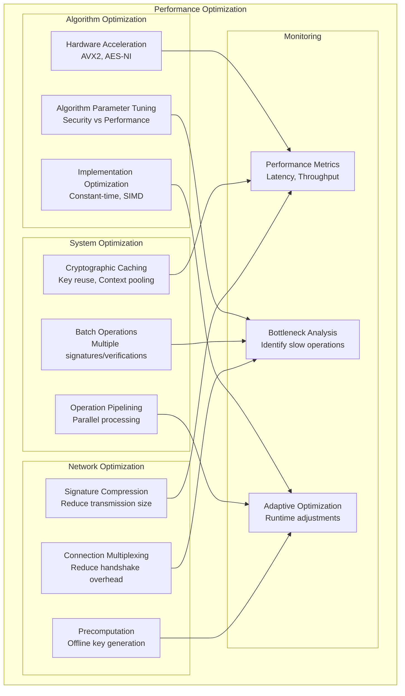

## Risk Management

### Migration Risks and Mitigation

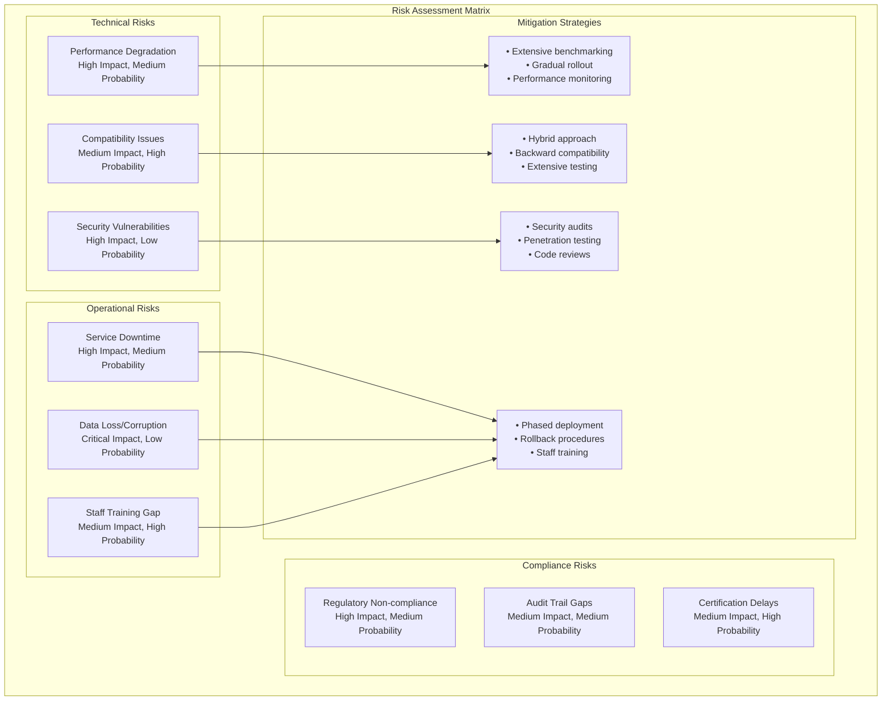

### Rollback Strategy

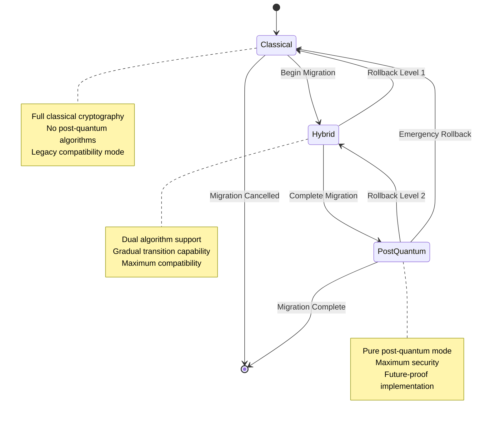

## Testing and Validation

### Comprehensive Testing Strategy

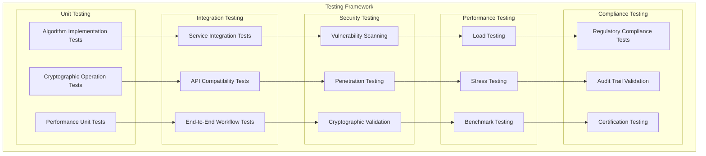

### Validation Criteria

| Test Category | Success Criteria | Acceptance Threshold |
|---------------|------------------|---------------------|
| **Performance** | Latency increase < 20% | 95% of operations within threshold |
| **Compatibility** | All existing APIs functional | 100% backward compatibility |
| **Security** | No new vulnerabilities | Zero critical/high severity issues |
| **Reliability** | System availability > 99.9% | Maximum 8.76 hours downtime/year |
| **Compliance** | All regulatory requirements met | 100% compliance verification |

## Compliance Considerations

### Indonesian Government Requirements

```mermaid
graph TB
    subgraph "Regulatory Framework"
        subgraph "National Standards"
            SNI27001[SNI ISO/IEC 27001:2013<br/>Information Security Management]
            PermenKominfo[Permen Kominfo No. 4/2016<br/>Sistem Elektronik Lingkup Privat]
            UUPerlindunganData[UU No. 27/2022<br/>Perlindungan Data Pribadi]
        end

        subgraph "Attorney General's Office"
            PeraturanJakgung[Peraturan Jaksa Agung<br/>Sistem Informasi Kejaksaan]
            SOPKeamanan[SOP Keamanan Informasi<br/>Kejaksaan RI]
            PedomanTeknis[Pedoman Teknis<br/>Implementasi Sistem]
        end

        subgraph "International Standards"
            NISTPQC[NIST Post-Quantum Cryptography<br/>Standards]
            ISO27002[ISO/IEC 27002:2022<br/>Information Security Controls]
            CommonCriteria[Common Criteria<br/>Security Evaluation]
        end
    end

    subgraph "Implementation Requirements"
        CryptoCompliance[Cryptographic Compliance<br/>Approved algorithms only]
        AuditRequirements[Audit Requirements<br/>Complete trail maintenance]
        DataProtection[Data Protection<br/>Privacy and security]
        AccessControl[Access Control<br/>Role-based permissions]
    end

    SNI27001 --> CryptoCompliance
    PermenKominfo --> AuditRequirements
    UUPerlindunganData --> DataProtection

    PeraturanJakgung --> AccessControl
    SOPKeamanan --> CryptoCompliance
    PedomanTeknis --> AuditRequirements

    NISTPQC --> CryptoCompliance
    ISO27002 --> AccessControl
    CommonCriteria --> DataProtection
```

### Certification and Approval Process

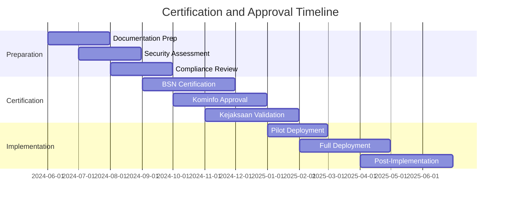

This comprehensive post-quantum migration strategy provides a roadmap for transitioning the SIMKARI platform to quantum-resistant cryptography while maintaining security, performance, and compliance requirements.
