# SIMKARI Architecture Documentation

## Overview

This document provides comprehensive architecture documentation for the SIMKARI (Sistem Informasi Manajemen Kejaksaan Republik Indonesia) super app platform, focusing on the hierarchical administrative structure, security architecture, and post-quantum cryptography integration.

## Table of Contents

1. [System Architecture Overview](#system-architecture-overview)
2. [Hierarchical Administrative Structure](#hierarchical-administrative-structure)
3. [Security Architecture](#security-architecture)
4. [Post-Quantum Migration Strategy](#post-quantum-migration-strategy)
5. [Service Integration Patterns](#service-integration-patterns)
6. [Deployment Architecture](#deployment-architecture)
7. [Compliance and Audit Architecture](#compliance-and-audit-architecture)

## System Architecture Overview

### High-Level System Architecture

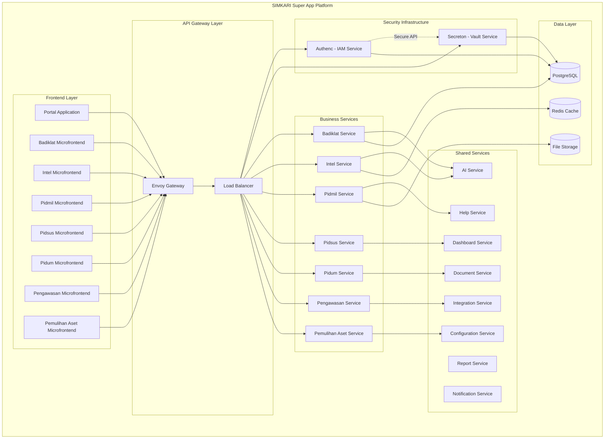
```mermaid
graph TB
    subgraph "SIMKARI Super App Platform"
        subgraph "Frontend Layer"
            Portal[Portal Application]
            Badiklat[Badiklat Microfrontend]
            Intel[Intel Microfrontend]
            Pidmil[Pidmil Microfrontend]
            Pidsus[Pidsus Microfrontend]
            Pidum[Pidum Microfrontend]
            Pengawasan[Pengawasan Microfrontend]
            PemulihanAset[Pemulihan Aset Microfrontend]
        end

        subgraph "API Gateway Layer"
            Gateway[Envoy Gateway]
            LoadBalancer[Load Balancer]
        end

        subgraph "Security Infrastructure"
            Authenc[Authenc - IAM Service]
            Secreton[Secreton - Vault Service]
        end

        subgraph "Business Services"
            BadiklatSvc[Badiklat Service]
            IntelSvc[Intel Service]
            PidmilSvc[Pidmil Service]
            PidsusSvc[Pidsus Service]
            PidumSvc[Pidum Service]
            PengawasanSvc[Pengawasan Service]
            PemulihanAsetSvc[Pemulihan Aset Service]
        end

        subgraph "Shared Services"
            AI[AI Service]
            Bantuan[Help Service]
            Dasbor[Dashboard Service]
            Dokumen[Document Service]
            Integrasi[Integration Service]
            Konfigurasi[Configuration Service]
            Laporan[Report Service]
            Notifikasi[Notification Service]
        end

        subgraph "Data Layer"
            PostgreSQL[(PostgreSQL)]
            Redis[(Redis Cache)]
            FileStorage[(File Storage)]
        end
    end

    Portal --> Gateway
    Badiklat --> Gateway
    Intel --> Gateway
    Pidmil --> Gateway
    Pidsus --> Gateway
    Pidum --> Gateway
    Pengawasan --> Gateway
    PemulihanAset --> Gateway

    Gateway --> LoadBalancer
    LoadBalancer --> Authenc
    LoadBalancer --> Secreton

    Authenc -.->|Secure API| Secreton

    LoadBalancer --> BadiklatSvc
    LoadBalancer --> IntelSvc
    LoadBalancer --> PidmilSvc
    LoadBalancer --> PidsusSvc
    LoadBalancer --> PidumSvc
    LoadBalancer --> PengawasanSvc
    LoadBalancer --> PemulihanAsetSvc

    BadiklatSvc --> AI
    IntelSvc --> AI
    PidmilSvc --> Bantuan
    PidsusSvc --> Dasbor
    PidumSvc --> Dokumen
    PengawasanSvc --> Integrasi
    PemulihanAsetSvc --> Konfigurasi

    Authenc --> PostgreSQL
    Secreton --> PostgreSQL
    BadiklatSvc --> PostgreSQL
    IntelSvc --> Redis
    PidmilSvc --> FileStorage
```

### Component Responsibilities

#### Frontend Layer
- **Portal Application**: Main entry point and navigation hub
- **Microfrontends**: Specialized applications for different functional areas
- **Shared Components**: Reusable UI components and utilities

#### Security Infrastructure
- **Authenc**: Identity and Access Management (IAM) service
- **Secreton**: Security vault and secret management service
- **mTLS Communication**: Secure service-to-service communication

#### Business Services
- **Domain-Specific Services**: Each functional area has its own service
- **Independent Scaling**: Services can scale based on demand
- **Microservices Architecture**: Loosely coupled, independently deployable

## Hierarchical Administrative Structure

### Organizational Hierarchy

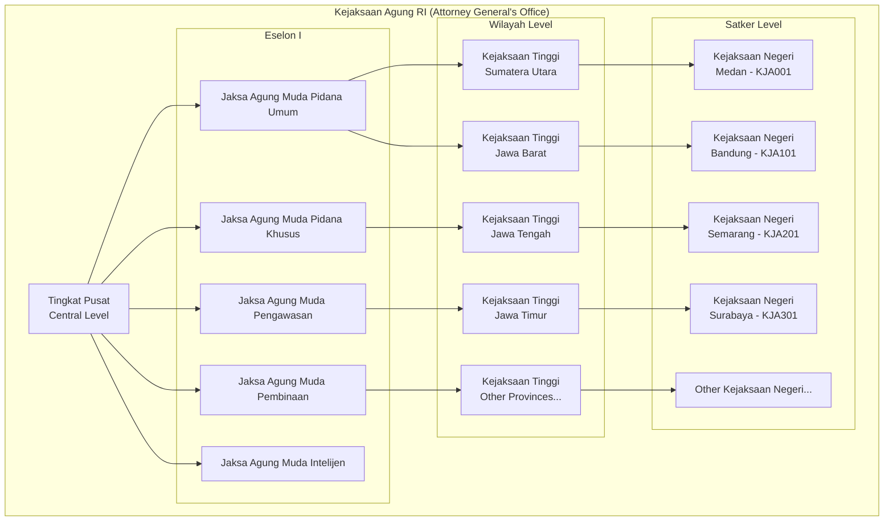
```mermaid
graph TD
    subgraph "Kejaksaan Agung RI (Attorney General's Office)"
        Pusat[Tingkat Pusat<br/>Central Level]

        subgraph "Eselon I"
            EselonI1[Jaksa Agung Muda Pidana Umum]
            EselonI2[Jaksa Agung Muda Pidana Khusus]
            EselonI3[Jaksa Agung Muda Pengawasan]
            EselonI4[Jaksa Agung Muda Pembinaan]
            EselonI5[Jaksa Agung Muda Intelijen]
        end

        subgraph "Wilayah Level"
            Wilayah1[Kejaksaan Tinggi<br/>Sumatera Utara]
            Wilayah2[Kejaksaan Tinggi<br/>Jawa Barat]
            Wilayah3[Kejaksaan Tinggi<br/>Jawa Tengah]
            Wilayah4[Kejaksaan Tinggi<br/>Jawa Timur]
            WilayahN[Kejaksaan Tinggi<br/>Other Provinces...]
        end

        subgraph "Satker Level"
            Satker1[Kejaksaan Negeri<br/>Medan - KJA001]
            Satker2[Kejaksaan Negeri<br/>Bandung - KJA101]
            Satker3[Kejaksaan Negeri<br/>Semarang - KJA201]
            Satker4[Kejaksaan Negeri<br/>Surabaya - KJA301]
            SatkerN[Other Kejaksaan Negeri...]
        end
    end

    Pusat --> EselonI1
    Pusat --> EselonI2
    Pusat --> EselonI3
    Pusat --> EselonI4
    Pusat --> EselonI5

    EselonI1 --> Wilayah1
    EselonI1 --> Wilayah2
    EselonI2 --> Wilayah3
    EselonI3 --> Wilayah4
    EselonI4 --> WilayahN

    Wilayah1 --> Satker1
    Wilayah2 --> Satker2
    Wilayah3 --> Satker3
    Wilayah4 --> Satker4
    WilayahN --> SatkerN
```

### Administrative Levels and Permissions

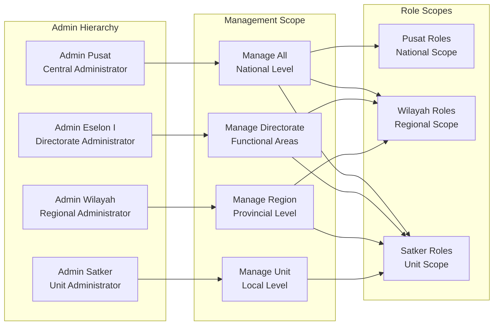
```mermaid
graph LR
    subgraph "Admin Hierarchy"
        AdminPusat[Admin Pusat<br/>Central Administrator]
        AdminEselonI[Admin Eselon I<br/>Directorate Administrator]
        AdminWilayah[Admin Wilayah<br/>Regional Administrator]
        AdminSatker[Admin Satker<br/>Unit Administrator]
    end

    subgraph "Management Scope"
        ManagePusat[Manage All<br/>National Level]
        ManageEselon[Manage Directorate<br/>Functional Areas]
        ManageWilayah[Manage Region<br/>Provincial Level]
        ManageSatker[Manage Unit<br/>Local Level]
    end

    subgraph "Role Scopes"
        RolePusat[Pusat Roles<br/>National Scope]
        RoleWilayah[Wilayah Roles<br/>Regional Scope]
        RoleSatker[Satker Roles<br/>Unit Scope]
    end

    AdminPusat --> ManagePusat
    AdminEselonI --> ManageEselon
    AdminWilayah --> ManageWilayah
    AdminSatker --> ManageSatker

    ManagePusat --> RolePusat
    ManagePusat --> RoleWilayah
    ManagePusat --> RoleSatker

    ManageEselon --> RoleWilayah
    ManageEselon --> RoleSatker

    ManageWilayah --> RoleWilayah
    ManageWilayah --> RoleSatker

    ManageSatker --> RoleSatker
```

### Role-Based Access Control Matrix

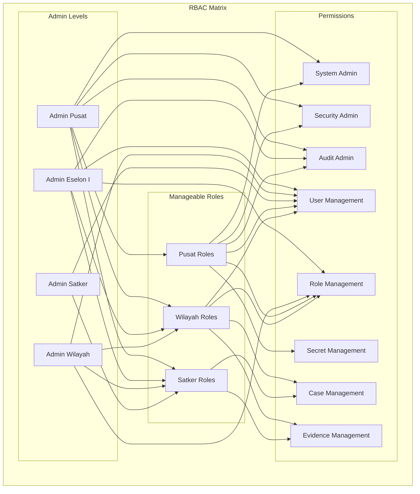
```mermaid
graph TB
    subgraph "RBAC Matrix"
        subgraph "Admin Levels"
            AP[Admin Pusat]
            AE[Admin Eselon I]
            AW[Admin Wilayah]
            AS[Admin Satker]
        end

        subgraph "Manageable Roles"
            RP[Pusat Roles]
            RW[Wilayah Roles]
            RS[Satker Roles]
        end

        subgraph "Permissions"
            PSystem[System Admin]
            PSecurity[Security Admin]
            PAudit[Audit Admin]
            PUser[User Management]
            PRole[Role Management]
            PSecret[Secret Management]
            PCase[Case Management]
            PEvidence[Evidence Management]
        end
    end

    AP --> RP
    AP --> RW
    AP --> RS
    AP --> PSystem
    AP --> PSecurity
    AP --> PAudit

    AE --> RW
    AE --> RS
    AE --> PUser
    AE --> PRole
    AE --> PAudit

    AW --> RW
    AW --> RS
    AW --> PUser
    AW --> PRole

    AS --> RS
    AS --> PUser

    RP --> PSystem
    RP --> PSecurity
    RP --> PAudit
    RP --> PUser
    RP --> PRole
    RP --> PSecret

    RW --> PUser
    RW --> PRole
    RW --> PCase
    RW --> PEvidence

    RS --> PCase
    RS --> PEvidence
```

### Satker/Wilayah/Pusat Relationships

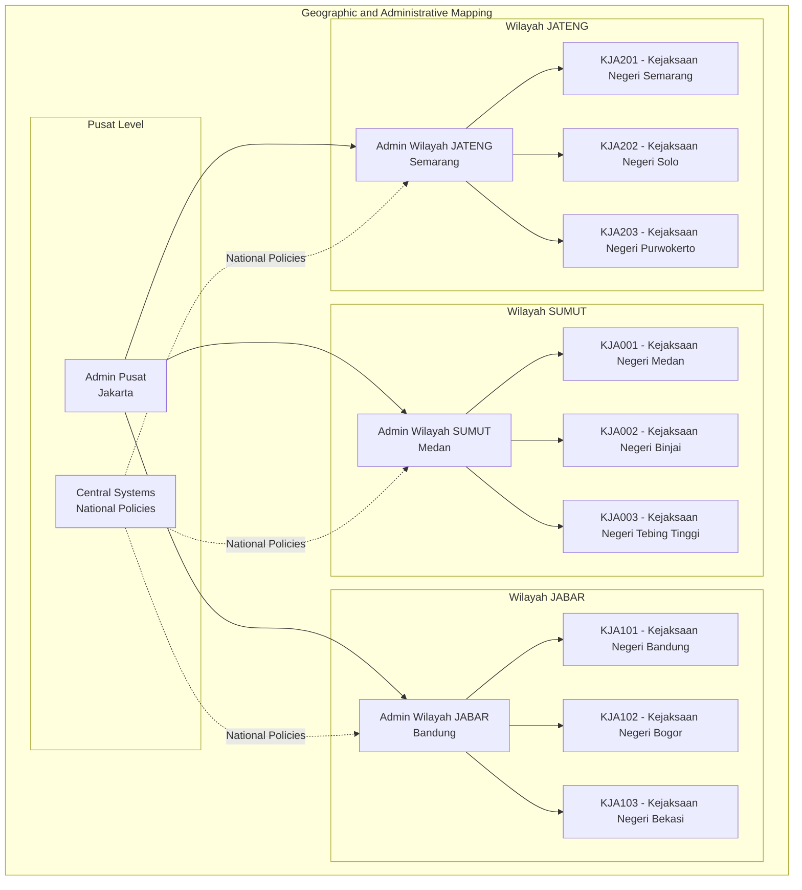
```mermaid
graph TD
    subgraph "Geographic and Administrative Mapping"
        subgraph "Pusat Level"
            PusatAdmin[Admin Pusat<br/>Jakarta]
            PusatSystems[Central Systems<br/>National Policies]
        end

        subgraph "Wilayah SUMUT"
            WilayahSUMUT[Admin Wilayah SUMUT<br/>Medan]
            KJA001[KJA001 - Kejaksaan Negeri Medan]
            KJA002[KJA002 - Kejaksaan Negeri Binjai]
            KJA003[KJA003 - Kejaksaan Negeri Tebing Tinggi]
        end

        subgraph "Wilayah JABAR"
            WilayahJABAR[Admin Wilayah JABAR<br/>Bandung]
            KJA101[KJA101 - Kejaksaan Negeri Bandung]
            KJA102[KJA102 - Kejaksaan Negeri Bogor]
            KJA103[KJA103 - Kejaksaan Negeri Bekasi]
        end

        subgraph "Wilayah JATENG"
            WilayahJATENG[Admin Wilayah JATENG<br/>Semarang]
            KJA201[KJA201 - Kejaksaan Negeri Semarang]
            KJA202[KJA202 - Kejaksaan Negeri Solo]
            KJA203[KJA203 - Kejaksaan Negeri Purwokerto]
        end
    end

    PusatAdmin --> WilayahSUMUT
    PusatAdmin --> WilayahJABAR
    PusatAdmin --> WilayahJATENG

    WilayahSUMUT --> KJA001
    WilayahSUMUT --> KJA002
    WilayahSUMUT --> KJA003

    WilayahJABAR --> KJA101
    WilayahJABAR --> KJA102
    WilayahJABAR --> KJA103

    WilayahJATENG --> KJA201
    WilayahJATENG --> KJA202
    WilayahJATENG --> KJA203

    PusatSystems -.->|National Policies| WilayahSUMUT
    PusatSystems -.->|National Policies| WilayahJABAR
    PusatSystems -.->|National Policies| WilayahJATENG
```

## Security Architecture

### Zero-Trust Security Model

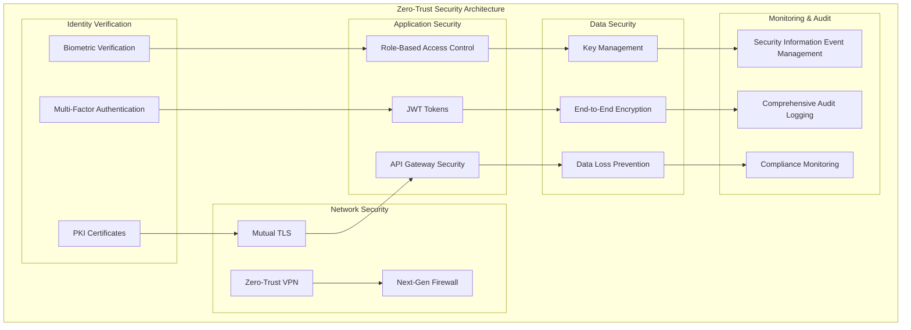
```mermaid
graph TB
    subgraph "Zero-Trust Security Architecture"
        subgraph "Identity Verification"
            MFA[Multi-Factor Authentication]
            PKI[PKI Certificates]
            Biometric[Biometric Verification]
        end

        subgraph "Network Security"
            mTLS[Mutual TLS]
            VPN[Zero-Trust VPN]
            Firewall[Next-Gen Firewall]
        end

        subgraph "Application Security"
            JWT[JWT Tokens]
            RBAC[Role-Based Access Control]
            API[API Gateway Security]
        end

        subgraph "Data Security"
            Encryption[End-to-End Encryption]
            KeyManagement[Key Management]
            DataLoss[Data Loss Prevention]
        end

        subgraph "Monitoring & Audit"
            SIEM[Security Information Event Management]
            AuditLog[Comprehensive Audit Logging]
            Compliance[Compliance Monitoring]
        end
    end

    MFA --> JWT
    PKI --> mTLS
    Biometric --> RBAC

    mTLS --> API
    VPN --> Firewall

    JWT --> Encryption
    RBAC --> KeyManagement
    API --> DataLoss

    Encryption --> AuditLog
    KeyManagement --> SIEM
    DataLoss --> Compliance
```

### Service-to-Service Security

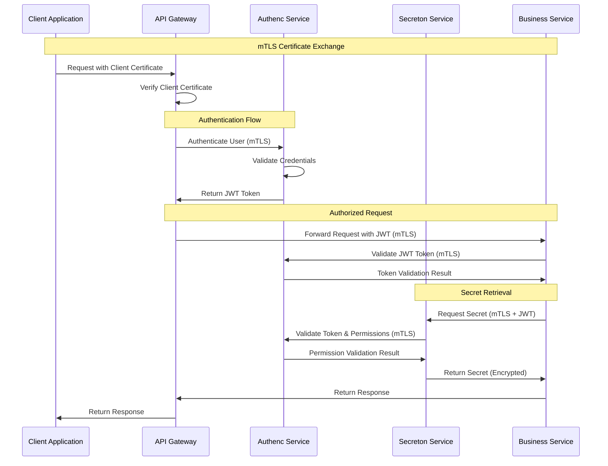
```mermaid
sequenceDiagram
    participant Client as Client Application
    participant Gateway as API Gateway
    participant Authenc as Authenc Service
    participant Secreton as Secreton Service
    participant Business as Business Service

    Note over Client,Business: mTLS Certificate Exchange
    Client->>Gateway: Request with Client Certificate
    Gateway->>Gateway: Verify Client Certificate

    Note over Gateway,Authenc: Authentication Flow
    Gateway->>Authenc: Authenticate User (mTLS)
    Authenc->>Authenc: Validate Credentials
    Authenc->>Gateway: Return JWT Token

    Note over Gateway,Business: Authorized Request
    Gateway->>Business: Forward Request with JWT (mTLS)
    Business->>Authenc: Validate JWT Token (mTLS)
    Authenc->>Business: Token Validation Result

    Note over Business,Secreton: Secret Retrieval
    Business->>Secreton: Request Secret (mTLS + JWT)
    Secreton->>Authenc: Validate Token & Permissions (mTLS)
    Authenc->>Secreton: Permission Validation Result
    Secreton->>Business: Return Secret (Encrypted)

    Business->>Gateway: Return Response
    Gateway->>Client: Return Response
```

### Cryptographic Architecture

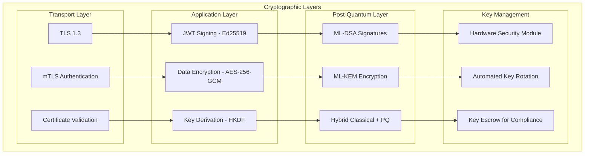
```mermaid
graph TB
    subgraph "Cryptographic Layers"
        subgraph "Transport Layer"
            TLS13[TLS 1.3]
            mTLSAuth[mTLS Authentication]
            CertValidation[Certificate Validation]
        end

        subgraph "Application Layer"
            JWTSigning[JWT Signing - Ed25519]
            DataEncryption[Data Encryption - AES-256-GCM]
            KeyDerivation[Key Derivation - HKDF]
        end

        subgraph "Post-Quantum Layer"
            MLDSASign[ML-DSA Signatures]
            MLKEMEncrypt[ML-KEM Encryption]
            HybridMode[Hybrid Classical + PQ]
        end

        subgraph "Key Management"
            HSM[Hardware Security Module]
            KeyRotation[Automated Key Rotation]
            KeyEscrow[Key Escrow for Compliance]
        end
    end

    TLS13 --> JWTSigning
    mTLSAuth --> DataEncryption
    CertValidation --> KeyDerivation

    JWTSigning --> MLDSASign
    DataEncryption --> MLKEMEncrypt
    KeyDerivation --> HybridMode

    MLDSASign --> HSM
    MLKEMEncrypt --> KeyRotation
    HybridMode --> KeyEscrow
```

## Post-Quantum Migration Strategy

### Migration Phases

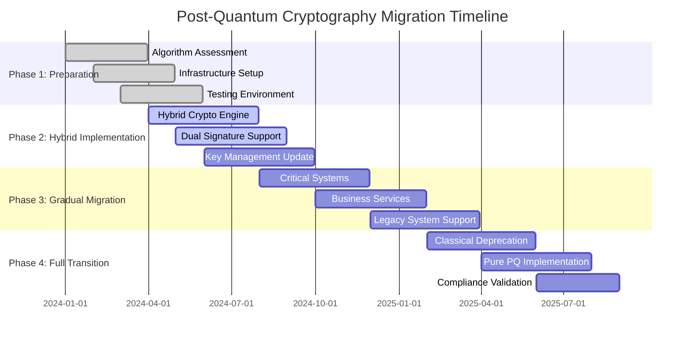
```mermaid
gantt
    title Post-Quantum Cryptography Migration Timeline
    dateFormat  YYYY-MM-DD
    section Phase 1: Preparation
    Algorithm Assessment    :done, prep1, 2024-01-01, 2024-03-31
    Infrastructure Setup    :done, prep2, 2024-02-01, 2024-04-30
    Testing Environment     :done, prep3, 2024-03-01, 2024-05-31

    section Phase 2: Hybrid Implementation
    Hybrid Crypto Engine    :active, hybrid1, 2024-04-01, 2024-07-31
    Dual Signature Support :active, hybrid2, 2024-05-01, 2024-08-31
    Key Management Update   :hybrid3, 2024-06-01, 2024-09-30

    section Phase 3: Gradual Migration
    Critical Systems        :migrate1, 2024-08-01, 2024-11-30
    Business Services       :migrate2, 2024-10-01, 2025-01-31
    Legacy System Support   :migrate3, 2024-12-01, 2025-03-31

    section Phase 4: Full Transition
    Classical Deprecation   :transition1, 2025-02-01, 2025-05-31
    Pure PQ Implementation  :transition2, 2025-04-01, 2025-07-31
    Compliance Validation   :transition3, 2025-06-01, 2025-08-31
```

### Algorithm Selection Strategy

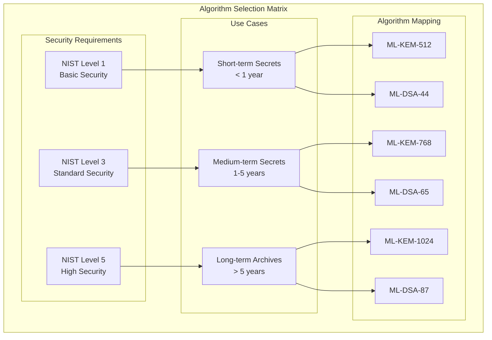
```mermaid
graph TD
    subgraph "Algorithm Selection Matrix"
        subgraph "Security Requirements"
            Level1[NIST Level 1<br/>Basic Security]
            Level3[NIST Level 3<br/>Standard Security]
            Level5[NIST Level 5<br/>High Security]
        end

        subgraph "Use Cases"
            ShortTerm[Short-term Secrets<br/>< 1 year]
            MediumTerm[Medium-term Secrets<br/>1-5 years]
            LongTerm[Long-term Archives<br/>> 5 years]
        end

        subgraph "Algorithm Mapping"
            MlKem512[ML-KEM-512]
            MlKem768[ML-KEM-768]
            MlKem1024[ML-KEM-1024]
            MlDsa44[ML-DSA-44]
            MlDsa65[ML-DSA-65]
            MlDsa87[ML-DSA-87]
        end
    end

    Level1 --> ShortTerm
    Level3 --> MediumTerm
    Level5 --> LongTerm

    ShortTerm --> MlKem512
    ShortTerm --> MlDsa44

    MediumTerm --> MlKem768
    MediumTerm --> MlDsa65

    LongTerm --> MlKem1024
    LongTerm --> MlDsa87
```

### Hybrid Cryptography Implementation

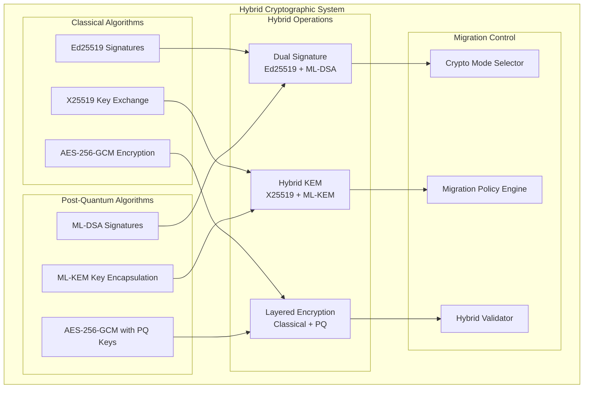
```mermaid
graph TB
    subgraph "Hybrid Cryptographic System"
        subgraph "Classical Algorithms"
            Ed25519[Ed25519 Signatures]
            X25519[X25519 Key Exchange]
            AES256[AES-256-GCM Encryption]
        end

        subgraph "Post-Quantum Algorithms"
            MLDSA[ML-DSA Signatures]
            MLKEM[ML-KEM Key Encapsulation]
            AESPQ[AES-256-GCM with PQ Keys]
        end

        subgraph "Hybrid Operations"
            DualSign[Dual Signature<br/>Ed25519 + ML-DSA]
            HybridKEM[Hybrid KEM<br/>X25519 + ML-KEM]
            LayeredEnc[Layered Encryption<br/>Classical + PQ]
        end

        subgraph "Migration Control"
            ModeSelector[Crypto Mode Selector]
            PolicyEngine[Migration Policy Engine]
            Validator[Hybrid Validator]
        end
    end

    Ed25519 --> DualSign
    MLDSA --> DualSign

    X25519 --> HybridKEM
    MLKEM --> HybridKEM

    AES256 --> LayeredEnc
    AESPQ --> LayeredEnc

    DualSign --> ModeSelector
    HybridKEM --> PolicyEngine
    LayeredEnc --> Validator
```

### Key Lifecycle Management

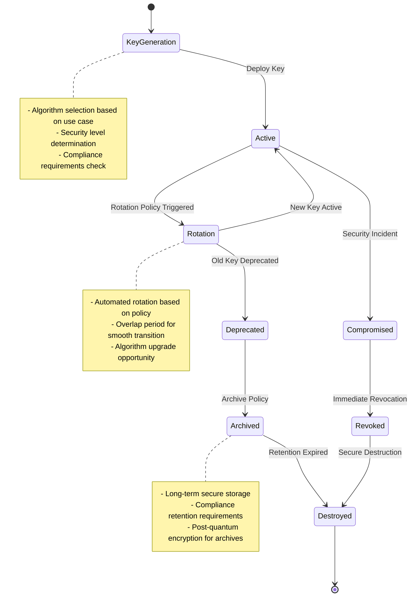
```mermaid
stateDiagram-v2
    [*] --> KeyGeneration

    KeyGeneration --> Active : Deploy Key
    Active --> Rotation : Rotation Policy Triggered
    Rotation --> Active : New Key Active
    Rotation --> Deprecated : Old Key Deprecated

    Deprecated --> Archived : Archive Policy
    Archived --> Destroyed : Retention Expired

    Active --> Compromised : Security Incident
    Compromised --> Revoked : Immediate Revocation
    Revoked --> Destroyed : Secure Destruction

    Destroyed --> [*]

    note right of KeyGeneration
        - Algorithm selection based on use case
        - Security level determination
        - Compliance requirements check
    end note

    note right of Rotation
        - Automated rotation based on policy
        - Overlap period for smooth transition
        - Algorithm upgrade opportunity
    end note

    note right of Archived
        - Long-term secure storage
        - Compliance retention requirements
        - Post-quantum encryption for archives
    end note
```

## Service Integration Patterns

### Microservices Communication

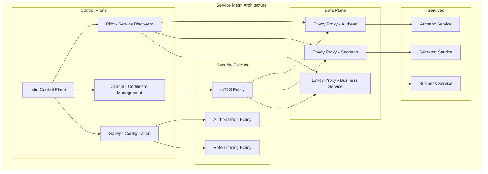
```mermaid
graph TB
    subgraph "Service Mesh Architecture"
        subgraph "Control Plane"
            Istio[Istio Control Plane]
            Pilot[Pilot - Service Discovery]
            Citadel[Citadel - Certificate Management]
            Galley[Galley - Configuration]
        end

        subgraph "Data Plane"
            EnvoyProxy1[Envoy Proxy - Authenc]
            EnvoyProxy2[Envoy Proxy - Secreton]
            EnvoyProxy3[Envoy Proxy - Business Service]
        end

        subgraph "Services"
            AuthencSvc[Authenc Service]
            SecretonSvc[Secreton Service]
            BusinessSvc[Business Service]
        end

        subgraph "Security Policies"
            mTLSPolicy[mTLS Policy]
            AuthzPolicy[Authorization Policy]
            RateLimitPolicy[Rate Limiting Policy]
        end
    end

    Istio --> Pilot
    Istio --> Citadel
    Istio --> Galley

    Pilot --> EnvoyProxy1
    Pilot --> EnvoyProxy2
    Pilot --> EnvoyProxy3

    Citadel --> mTLSPolicy
    Galley --> AuthzPolicy
    Galley --> RateLimitPolicy

    EnvoyProxy1 --> AuthencSvc
    EnvoyProxy2 --> SecretonSvc
    EnvoyProxy3 --> BusinessSvc

    mTLSPolicy --> EnvoyProxy1
    mTLSPolicy --> EnvoyProxy2
    mTLSPolicy --> EnvoyProxy3
```

### Event-Driven Architecture

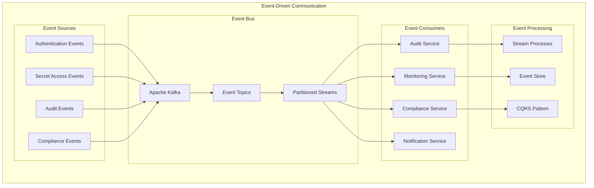
```mermaid
graph TB
    subgraph "Event-Driven Communication"
        subgraph "Event Sources"
            AuthEvent[Authentication Events]
            SecretEvent[Secret Access Events]
            AuditEvent[Audit Events]
            ComplianceEvent[Compliance Events]
        end

        subgraph "Event Bus"
            Kafka[Apache Kafka]
            Topics[Event Topics]
            Partitions[Partitioned Streams]
        end

        subgraph "Event Consumers"
            AuditService[Audit Service]
            MonitoringService[Monitoring Service]
            ComplianceService[Compliance Service]
            NotificationService[Notification Service]
        end

        subgraph "Event Processing"
            StreamProcessor[Stream Processor]
            EventStore[Event Store]
            CQRS[CQRS Pattern]
        end
    end

    AuthEvent --> Kafka
    SecretEvent --> Kafka
    AuditEvent --> Kafka
    ComplianceEvent --> Kafka

    Kafka --> Topics
    Topics --> Partitions

    Partitions --> AuditService
    Partitions --> MonitoringService
    Partitions --> ComplianceService
    Partitions --> NotificationService

    AuditService --> StreamProcessor
    MonitoringService --> EventStore
    ComplianceService --> CQRS
```

## Deployment Architecture

### Kubernetes Deployment

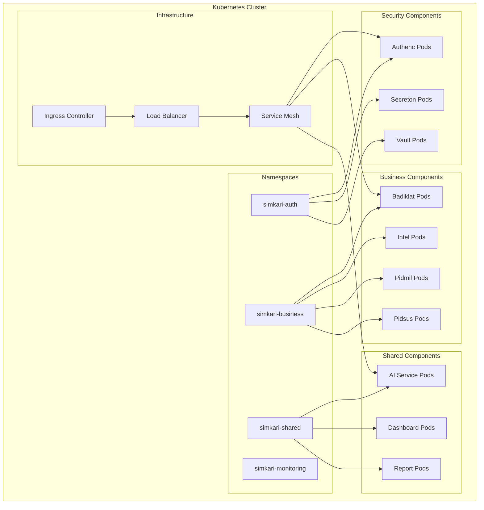
```mermaid
graph TB
    subgraph "Kubernetes Cluster"
        subgraph "Namespaces"
            NSAuth[simkari-auth]
            NSBusiness[simkari-business]
            NSShared[simkari-shared]
            NSMonitoring[simkari-monitoring]
        end

        subgraph "Security Components"
            AuthencPod[Authenc Pods]
            SecretonPod[Secreton Pods]
            VaultPod[Vault Pods]
        end

        subgraph "Business Components"
            BadiklatPod[Badiklat Pods]
            IntelPod[Intel Pods]
            PidmilPod[Pidmil Pods]
            PidsusPod[Pidsus Pods]
        end

        subgraph "Shared Components"
            AIPod[AI Service Pods]
            DasborPod[Dashboard Pods]
            LaporanPod[Report Pods]
        end

        subgraph "Infrastructure"
            Ingress[Ingress Controller]
            LoadBalancer[Load Balancer]
            ServiceMesh[Service Mesh]
        end
    end

    NSAuth --> AuthencPod
    NSAuth --> SecretonPod
    NSAuth --> VaultPod

    NSBusiness --> BadiklatPod
    NSBusiness --> IntelPod
    NSBusiness --> PidmilPod
    NSBusiness --> PidsusPod

    NSShared --> AIPod
    NSShared --> DasborPod
    NSShared --> LaporanPod

    Ingress --> LoadBalancer
    LoadBalancer --> ServiceMesh
    ServiceMesh --> AuthencPod
    ServiceMesh --> BadiklatPod
    ServiceMesh --> AIPod
```

### High Availability Architecture

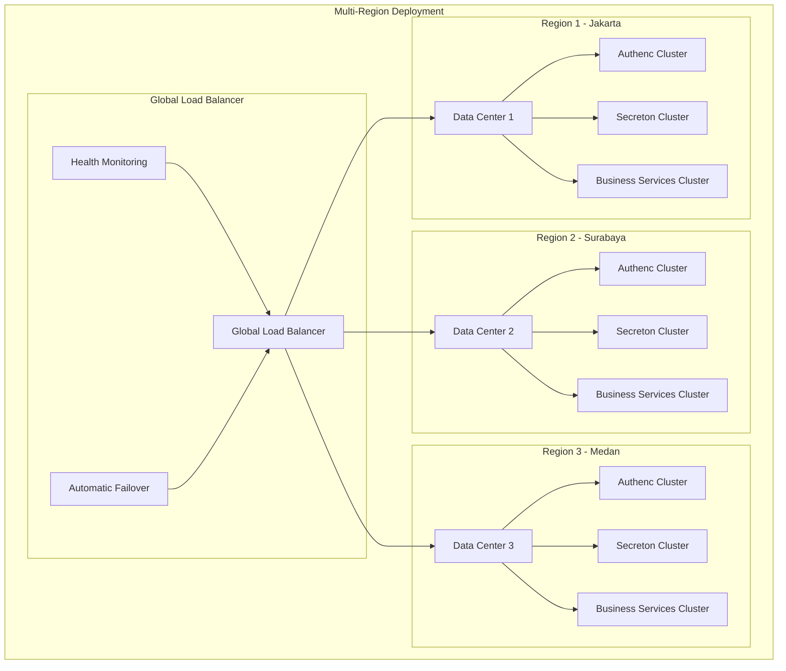
```mermaid
graph TB
    subgraph "Multi-Region Deployment"
        subgraph "Region 1 - Jakarta"
            DC1[Data Center 1]
            AuthencCluster1[Authenc Cluster]
            SecretonCluster1[Secreton Cluster]
            BusinessCluster1[Business Services Cluster]
        end

        subgraph "Region 2 - Surabaya"
            DC2[Data Center 2]
            AuthencCluster2[Authenc Cluster]
            SecretonCluster2[Secreton Cluster]
            BusinessCluster2[Business Services Cluster]
        end

        subgraph "Region 3 - Medan"
            DC3[Data Center 3]
            AuthencCluster3[Authenc Cluster]
            SecretonCluster3[Secreton Cluster]
            BusinessCluster3[Business Services Cluster]
        end

        subgraph "Global Load Balancer"
            GlobalLB[Global Load Balancer]
            HealthCheck[Health Monitoring]
            Failover[Automatic Failover]
        end
    end

    DC1 --> AuthencCluster1
    DC1 --> SecretonCluster1
    DC1 --> BusinessCluster1

    DC2 --> AuthencCluster2
    DC2 --> SecretonCluster2
    DC2 --> BusinessCluster2

    DC3 --> AuthencCluster3
    DC3 --> SecretonCluster3
    DC3 --> BusinessCluster3

    GlobalLB --> DC1
    GlobalLB --> DC2
    GlobalLB --> DC3

    HealthCheck --> GlobalLB
    Failover --> GlobalLB
```

## Compliance and Audit Architecture

### Audit Trail Architecture

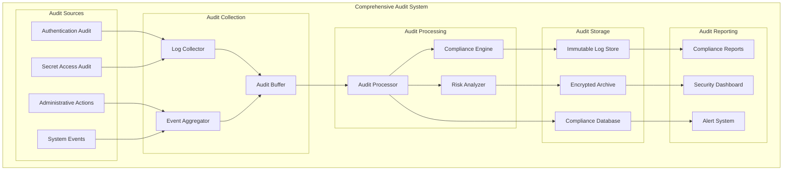
```mermaid
graph TB
    subgraph "Comprehensive Audit System"
        subgraph "Audit Sources"
            AuthAudit[Authentication Audit]
            SecretAudit[Secret Access Audit]
            AdminAudit[Administrative Actions]
            SystemAudit[System Events]
        end

        subgraph "Audit Collection"
            LogCollector[Log Collector]
            EventAggregator[Event Aggregator]
            AuditBuffer[Audit Buffer]
        end

        subgraph "Audit Processing"
            AuditProcessor[Audit Processor]
            ComplianceEngine[Compliance Engine]
            RiskAnalyzer[Risk Analyzer]
        end

        subgraph "Audit Storage"
            ImmutableLog[Immutable Log Store]
            EncryptedArchive[Encrypted Archive]
            ComplianceDB[Compliance Database]
        end

        subgraph "Audit Reporting"
            ComplianceReport[Compliance Reports]
            SecurityDashboard[Security Dashboard]
            AlertSystem[Alert System]
        end
    end

    AuthAudit --> LogCollector
    SecretAudit --> LogCollector
    AdminAudit --> EventAggregator
    SystemAudit --> EventAggregator

    LogCollector --> AuditBuffer
    EventAggregator --> AuditBuffer

    AuditBuffer --> AuditProcessor
    AuditProcessor --> ComplianceEngine
    AuditProcessor --> RiskAnalyzer

    ComplianceEngine --> ImmutableLog
    RiskAnalyzer --> EncryptedArchive
    AuditProcessor --> ComplianceDB

    ImmutableLog --> ComplianceReport
    EncryptedArchive --> SecurityDashboard
    ComplianceDB --> AlertSystem
```

### Compliance Framework

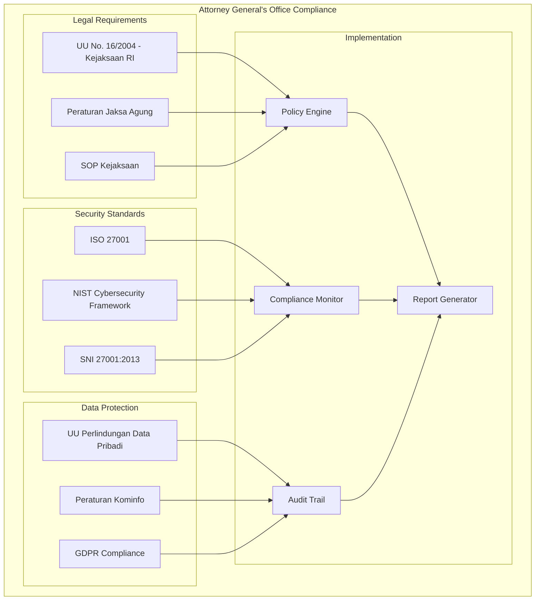
```mermaid
graph TB
    subgraph "Attorney General's Office Compliance"
        subgraph "Legal Requirements"
            UUKejaksaan[UU No. 16/2004 - Kejaksaan RI]
            PeraturanJakgung[Peraturan Jaksa Agung]
            SOPKejaksaan[SOP Kejaksaan]
        end

        subgraph "Security Standards"
            ISO27001[ISO 27001]
            NIST[NIST Cybersecurity Framework]
            SNI[SNI 27001:2013]
        end

        subgraph "Data Protection"
            UUPerlindunganData[UU Perlindungan Data Pribadi]
            PeraturanKominfo[Peraturan Kominfo]
            GDPR[GDPR Compliance]
        end

        subgraph "Implementation"
            PolicyEngine[Policy Engine]
            ComplianceMonitor[Compliance Monitor]
            AuditTrail[Audit Trail]
            ReportGenerator[Report Generator]
        end
    end

    UUKejaksaan --> PolicyEngine
    PeraturanJakgung --> PolicyEngine
    SOPKejaksaan --> PolicyEngine

    ISO27001 --> ComplianceMonitor
    NIST --> ComplianceMonitor
    SNI --> ComplianceMonitor

    UUPerlindunganData --> AuditTrail
    PeraturanKominfo --> AuditTrail
    GDPR --> AuditTrail

    PolicyEngine --> ReportGenerator
    ComplianceMonitor --> ReportGenerator
    AuditTrail --> ReportGenerator
```

### Security Considerations for Attorney General's Office

#### Data Classification and Handling

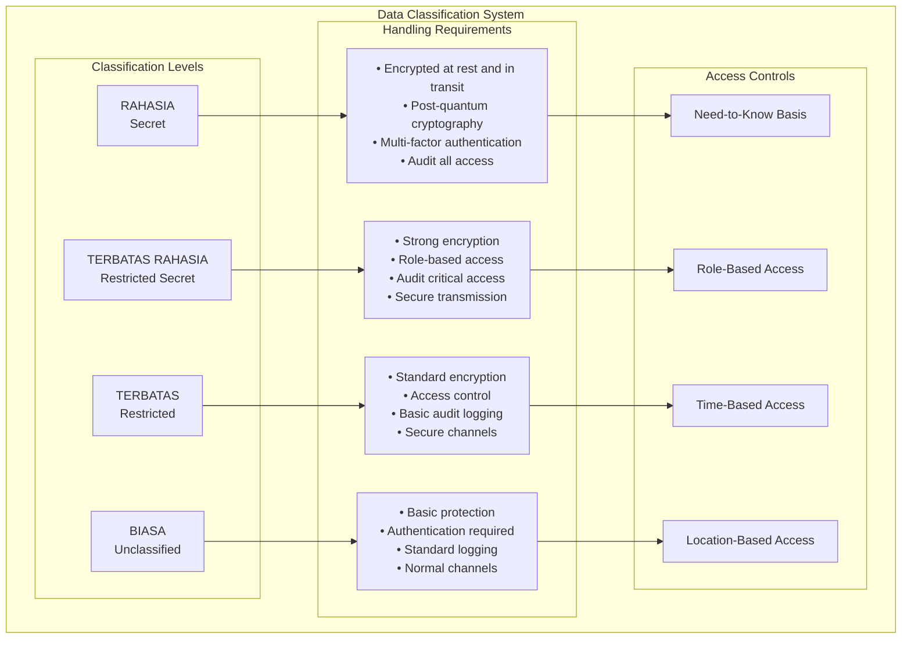
```mermaid
graph TB
    subgraph "Data Classification System"
        subgraph "Classification Levels"
            Rahasia[RAHASIA<br/>Secret]
            TerbatasRahasia[TERBATAS RAHASIA<br/>Restricted Secret]
            Terbatas[TERBATAS<br/>Restricted]
            Biasa[BIASA<br/>Unclassified]
        end

        subgraph "Handling Requirements"
            RahasiaHandling[• Encrypted at rest and in transit<br/>• Post-quantum cryptography<br/>• Multi-factor authentication<br/>• Audit all access]

            TerbatasRahasiaHandling[• Strong encryption<br/>• Role-based access<br/>• Audit critical access<br/>• Secure transmission]

            TerbatasHandling[• Standard encryption<br/>• Access control<br/>• Basic audit logging<br/>• Secure channels]

            BiasaHandling[• Basic protection<br/>• Authentication required<br/>• Standard logging<br/>• Normal channels]
        end

        subgraph "Access Controls"
            NeedToKnow[Need-to-Know Basis]
            RoleBasedAccess[Role-Based Access]
            TimeBasedAccess[Time-Based Access]
            LocationBasedAccess[Location-Based Access]
        end
    end

    Rahasia --> RahasiaHandling
    TerbatasRahasia --> TerbatasRahasiaHandling
    Terbatas --> TerbatasHandling
    Biasa --> BiasaHandling

    RahasiaHandling --> NeedToKnow
    TerbatasRahasiaHandling --> RoleBasedAccess
    TerbatasHandling --> TimeBasedAccess
    BiasaHandling --> LocationBasedAccess
```

#### Incident Response Architecture

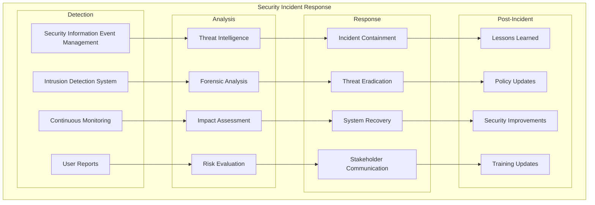
```mermaid
graph TB
    subgraph "Security Incident Response"
        subgraph "Detection"
            SIEM[Security Information Event Management]
            IDS[Intrusion Detection System]
            Monitoring[Continuous Monitoring]
            UserReports[User Reports]
        end

        subgraph "Analysis"
            ThreatIntel[Threat Intelligence]
            ForensicAnalysis[Forensic Analysis]
            ImpactAssessment[Impact Assessment]
            RiskEvaluation[Risk Evaluation]
        end

        subgraph "Response"
            Containment[Incident Containment]
            Eradication[Threat Eradication]
            Recovery[System Recovery]
            Communication[Stakeholder Communication]
        end

        subgraph "Post-Incident"
            LessonsLearned[Lessons Learned]
            PolicyUpdate[Policy Updates]
            SecurityImprovement[Security Improvements]
            TrainingUpdate[Training Updates]
        end
    end

    SIEM --> ThreatIntel
    IDS --> ForensicAnalysis
    Monitoring --> ImpactAssessment
    UserReports --> RiskEvaluation

    ThreatIntel --> Containment
    ForensicAnalysis --> Eradication
    ImpactAssessment --> Recovery
    RiskEvaluation --> Communication

    Containment --> LessonsLearned
    Eradication --> PolicyUpdate
    Recovery --> SecurityImprovement
    Communication --> TrainingUpdate
```

This comprehensive architecture documentation provides detailed insights into the SIMKARI platform's hierarchical structure, security architecture, post-quantum migration strategy, and compliance framework specifically designed for the Indonesian Attorney General's Office requirements.
