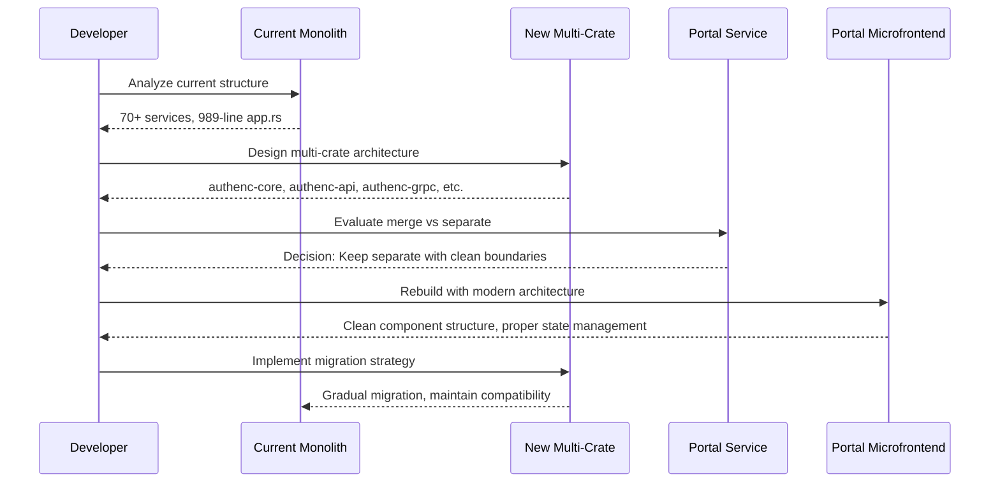
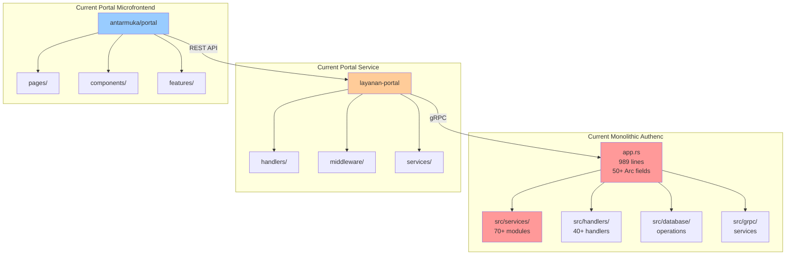

# Design Document: Authenc & Portal Comprehensive Refactoring

## Overview

This document outlines a comprehensive architectural refactoring of the SIMPelv2 authentication and portal system. The refactoring addresses three major areas:

1. **Authenc Multi-Crate Architecture**: Breaking down the monolithic authenc service (70+ service modules, 989-line app.rs) into a modular multi-crate architecture following Rust best practices
2. **Portal Service Architecture Decision**: Evaluating whether to merge layanan-portal into authenc or maintain separation with cleaner boundaries
3. **Portal Microfrontend Rebuild**: Complete redesign of the portal microfrontend with modern UI/UX and proper architecture

The goal is to create a maintainable, scalable, production-ready authentication and portal system that follows enterprise-grade patterns while maintaining backward compatibility and all existing security features.

## Main Algorithm/Workflow

## Architecture

### Current State Analysis

