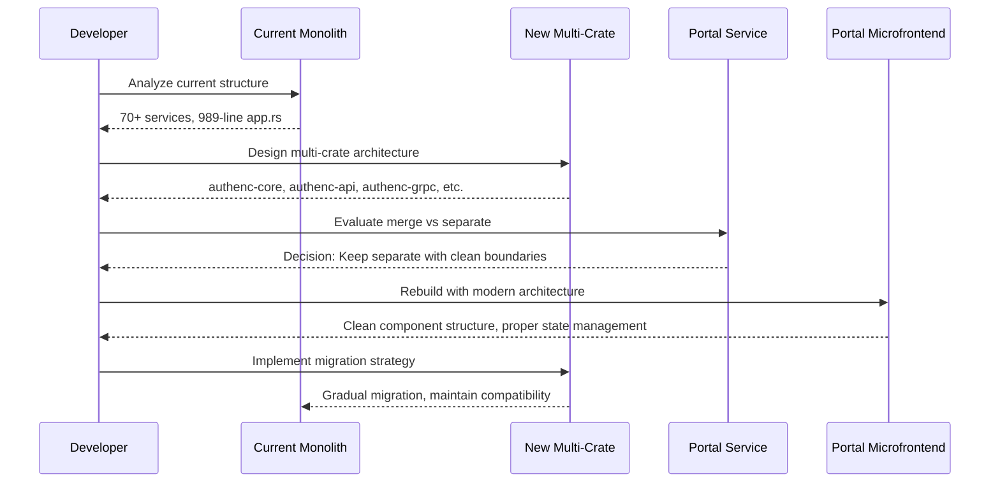
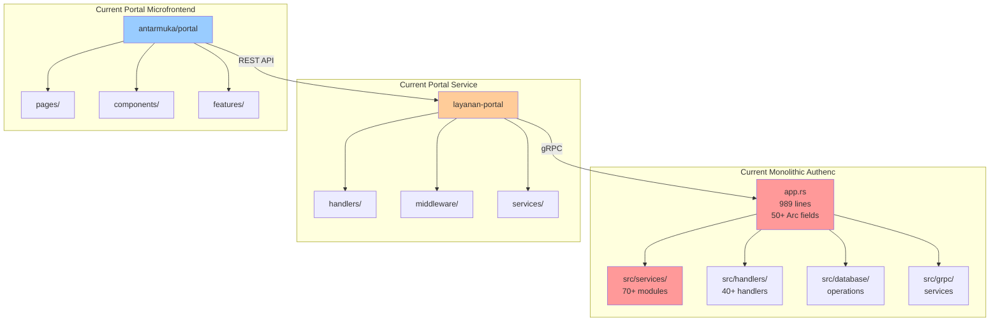
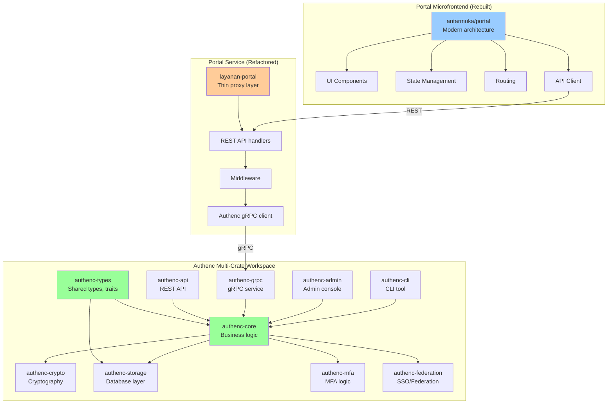
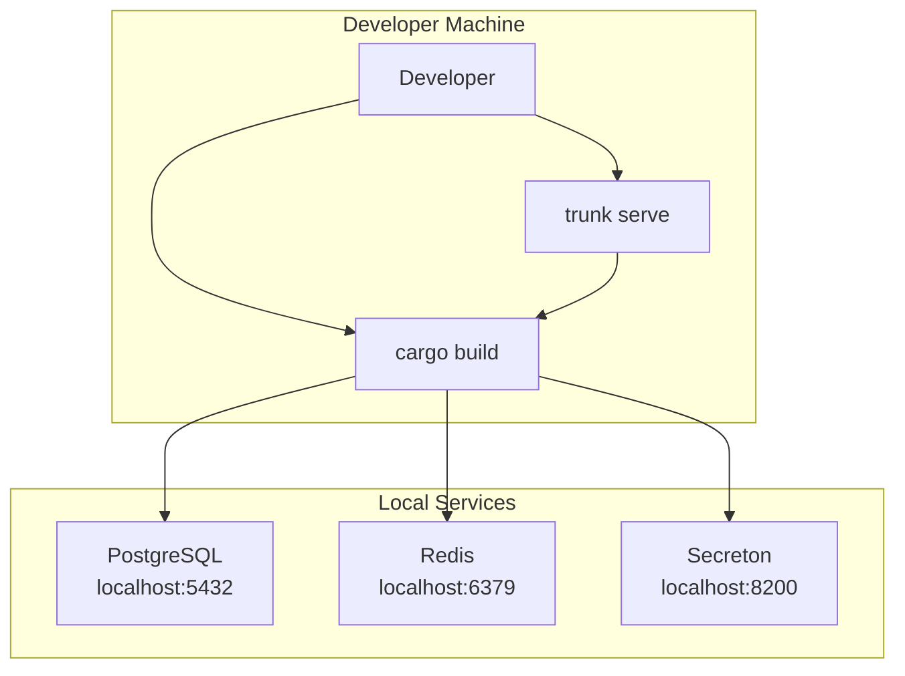
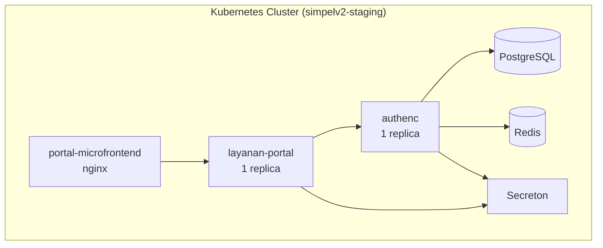
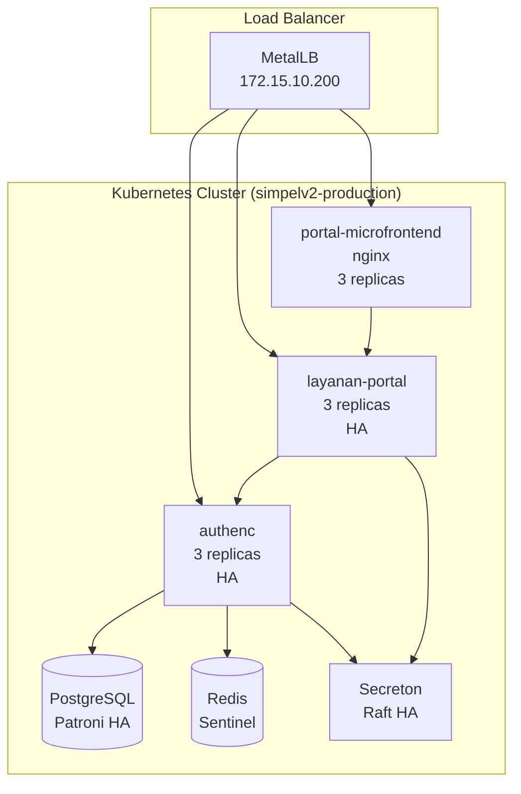
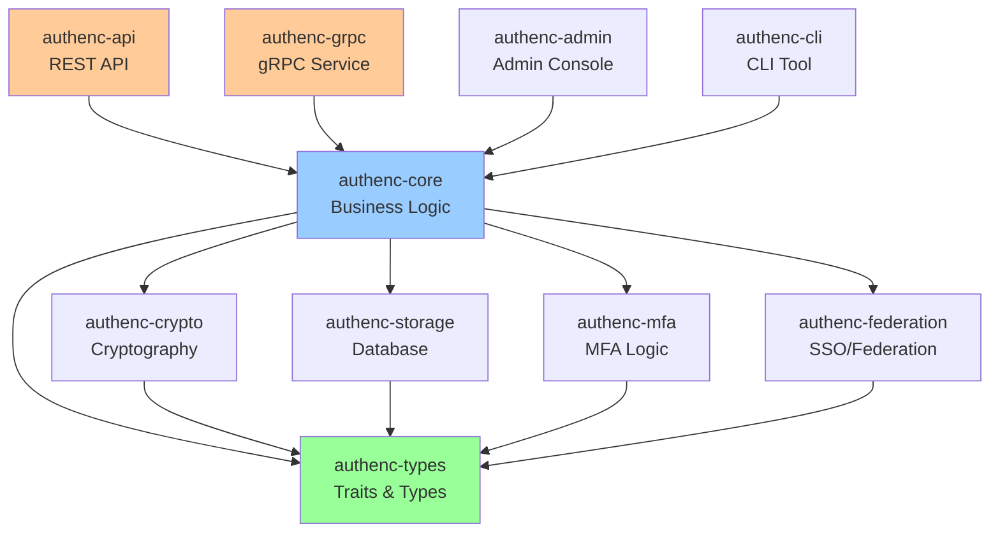

# Design Document: Authenc & Portal Comprehensive Refactoring

## Overview

This document outlines a comprehensive architectural refactoring of the SIMPelv2 authentication and portal system. The refactoring addresses three major areas:

1. **Authenc Multi-Crate Architecture**: Breaking down the monolithic authenc service (70+ service modules, 989-line app.rs) into a modular multi-crate architecture following Rust best practices
2. **Portal Service Architecture Decision**: Evaluating whether to merge layanan-portal into authenc or maintain separation with cleaner boundaries
3. **Portal Microfrontend Rebuild**: Complete redesign of the portal microfrontend with modern UI/UX and proper architecture

The goal is to create a maintainable, scalable, production-ready authentication and portal system that follows enterprise-grade patterns while maintaining backward compatibility and all existing security features.

## Main Algorithm/Workflow



## Architecture

### Current State Analysis




### Target Multi-Crate Architecture




## Components and Interfaces

### 1. Authenc Multi-Crate Structure

#### 1.1 authenc-types

**Purpose**: Shared types, traits, and interfaces used across all authenc crates

**Interface**:
```rust
// Core domain types
pub struct UserId(pub Uuid);
pub struct RealmId(pub Uuid);
pub struct ClientId(pub Uuid);
pub struct SessionId(pub Uuid);

// Authentication result
pub enum AuthResult {
    Success { user_id: UserId, session_id: SessionId },
    MfaRequired { user_id: UserId, mfa_token: String },
    Failed { reason: AuthFailureReason },
}

// Traits for service abstraction
pub trait UserStore: Send + Sync {
    async fn get_user(&self, id: UserId) -> Result<User>;
    async fn create_user(&self, req: CreateUserRequest) -> Result<User>;
    async fn update_user(&self, id: UserId, req: UpdateUserRequest) -> Result<User>;
}

pub trait SessionStore: Send + Sync {
    async fn create_session(&self, user_id: UserId) -> Result<Session>;
    async fn get_session(&self, id: SessionId) -> Result<Option<Session>>;
    async fn invalidate_session(&self, id: SessionId) -> Result<()>;
}

pub trait AuthenticationService: Send + Sync {
    async fn authenticate(&self, credentials: Credentials) -> Result<AuthResult>;
    async fn verify_mfa(&self, user_id: UserId, code: String) -> Result<AuthResult>;
}
```

**Responsibilities**:
- Define core domain types (User, Session, Realm, Client, etc.)
- Define service traits for dependency injection
- Define error types and result types
- Define configuration structures
- No implementation logic (pure interfaces)


#### 1.2 authenc-core

**Purpose**: Core business logic and service implementations

**Interface**:
```rust
// Main authentication service
pub struct AuthenticationServiceImpl {
    user_store: Arc<dyn UserStore>,
    session_store: Arc<dyn SessionStore>,
    password_hasher: Arc<dyn PasswordHasher>,
    brute_force_protector: Arc<BruteForceProtector>,
}

impl AuthenticationService for AuthenticationServiceImpl {
    async fn authenticate(&self, credentials: Credentials) -> Result<AuthResult> {
        // 1. Check brute force protection
        self.brute_force_protector.check(&credentials.username).await?;

        // 2. Get user from store
        let user = self.user_store.get_by_username(&credentials.username).await?;

        // 3. Verify password
        if !self.password_hasher.verify(&credentials.password, &user.password_hash)? {
            self.brute_force_protector.record_failure(&credentials.username).await;
            return Ok(AuthResult::Failed { reason: AuthFailureReason::InvalidCredentials });
        }

        // 4. Check MFA requirement
        if user.mfa_enabled {
            let mfa_token = self.generate_mfa_token(&user).await?;
            return Ok(AuthResult::MfaRequired { user_id: user.id, mfa_token });
        }

        // 5. Create session
        let session = self.session_store.create_session(user.id).await?;

        Ok(AuthResult::Success { user_id: user.id, session_id: session.id })
    }
}

// User management service
pub struct UserManagementService {
    user_store: Arc<dyn UserStore>,
    event_publisher: Arc<dyn EventPublisher>,
}

// Realm management service
pub struct RealmManagementService {
    realm_store: Arc<dyn RealmStore>,
}

// OAuth2/OIDC service
pub struct OAuth2Service {
    client_store: Arc<dyn ClientStore>,
    token_generator: Arc<dyn TokenGenerator>,
}
```

**Responsibilities**:
- Implement authentication logic
- Implement user management
- Implement realm management
- Implement OAuth2/OIDC flows
- Implement authorization logic
- Coordinate between different stores
- Publish domain events


#### 1.3 authenc-crypto

**Purpose**: Cryptographic operations (JWT, password hashing, encryption)

**Interface**:
```rust
// JWT operations
pub struct JwtService {
    signing_key: Ed25519KeyPair,
    issuer: String,
}

impl JwtService {
    pub fn generate_access_token(&self, claims: TokenClaims) -> Result<String> {
        // Generate JWT with Ed25519 signature
    }

    pub fn verify_token(&self, token: &str) -> Result<TokenClaims> {
        // Verify JWT signature and expiry
    }
}

// Password hashing
pub trait PasswordHasher: Send + Sync {
    fn hash(&self, password: &str) -> Result<String>;
    fn verify(&self, password: &str, hash: &str) -> Result<bool>;
}

pub struct Argon2PasswordHasher {
    config: Argon2Config,
}

// Encryption
pub struct EncryptionService {
    key: ChaCha20Poly1305Key,
}

impl EncryptionService {
    pub fn encrypt(&self, plaintext: &[u8]) -> Result<Vec<u8>>;
    pub fn decrypt(&self, ciphertext: &[u8]) -> Result<Vec<u8>>;
}
```

**Responsibilities**:
- JWT generation and validation (Ed25519)
- Password hashing (Argon2id)
- Symmetric encryption (ChaCha20-Poly1305)
- Key management
- TOTP generation and verification


#### 1.4 authenc-storage

**Purpose**: Database layer with PostgreSQL implementation

**Interface**:
```rust
// Database connection pool
pub struct Database {
    pool: deadpool_postgres::Pool,
    prepared_cache: PreparedStatementCache,
}

// User store implementation
pub struct PostgresUserStore {
    db: Arc<Database>,
}

impl UserStore for PostgresUserStore {
    async fn get_user(&self, id: UserId) -> Result<User> {
        let row = self.db.query_one(
            "SELECT * FROM users WHERE id = $1",
            &[&id.0]
        ).await?;
        Ok(User::from_row(row)?)
    }

    async fn create_user(&self, req: CreateUserRequest) -> Result<User> {
        let id = UserId(Uuid::new_v4());
        self.db.execute(
            "INSERT INTO users (id, username, email, password_hash) VALUES ($1, $2, $3, $4)",
            &[&id.0, &req.username, &req.email, &req.password_hash]
        ).await?;
        self.get_user(id).await
    }
}

// Session store implementation
pub struct PostgresSessionStore {
    db: Arc<Database>,
}

// Realm store implementation
pub struct PostgresRealmStore {
    db: Arc<Database>,
}

// Client store implementation
pub struct PostgresClientStore {
    db: Arc<Database>,
}
```

**Responsibilities**:
- Database connection management
- Prepared statement caching
- Transaction support
- Store implementations for all domain entities
- Migration management


#### 1.5 authenc-api

**Purpose**: REST API layer (Axum 0.8.x)

**Interface**:
```rust
// API state
pub struct ApiState {
    auth_service: Arc<dyn AuthenticationService>,
    user_service: Arc<UserManagementService>,
    oauth2_service: Arc<OAuth2Service>,
    jwt_service: Arc<JwtService>,
}

// Authentication handlers
pub async fn login_handler(
    State(state): State<Arc<ApiState>>,
    Json(req): Json<LoginRequest>,
) -> Result<Json<LoginResponse>, ApiError> {
    let result = state.auth_service.authenticate(req.into()).await?;

    match result {
        AuthResult::Success { user_id, session_id } => {
            let token = state.jwt_service.generate_access_token(TokenClaims {
                sub: user_id.to_string(),
                exp: Utc::now() + Duration::minutes(15),
            })?;
            Ok(Json(LoginResponse { access_token: token }))
        }
        AuthResult::MfaRequired { mfa_token, .. } => {
            Ok(Json(LoginResponse { mfa_token: Some(mfa_token) }))
        }
        AuthResult::Failed { reason } => {
            Err(ApiError::Unauthorized(reason.to_string()))
        }
    }
}

// OAuth2 handlers
pub async fn oauth2_authorize_handler(...) -> Result<Response, ApiError>;
pub async fn oauth2_token_handler(...) -> Result<Json<TokenResponse>, ApiError>;

// User management handlers
pub async fn create_user_handler(...) -> Result<Json<User>, ApiError>;
pub async fn get_user_handler(...) -> Result<Json<User>, ApiError>;
```

**Responsibilities**:
- HTTP request handling
- Request validation
- Response serialization
- Error handling
- Middleware (auth, rate limiting, CORS)
- OpenAPI documentation


#### 1.6 authenc-grpc

**Purpose**: gRPC service layer (Tonic 0.14.x)

**Interface**:
```rust
// Proto definition
// proto/authenc.proto
service AuthencService {
  rpc Authenticate(AuthenticateRequest) returns (AuthenticateResponse);
  rpc ValidateToken(ValidateTokenRequest) returns (ValidateTokenResponse);
  rpc CreateUser(CreateUserRequest) returns (CreateUserResponse);
  rpc GetUser(GetUserRequest) returns (GetUserResponse);
}

// gRPC service implementation
pub struct AuthencGrpcService {
    auth_service: Arc<dyn AuthenticationService>,
    user_service: Arc<UserManagementService>,
    jwt_service: Arc<JwtService>,
}

#[tonic::async_trait]
impl authenc_proto::authenc_service_server::AuthencService for AuthencGrpcService {
    async fn authenticate(
        &self,
        request: Request<AuthenticateRequest>,
    ) -> Result<Response<AuthenticateResponse>, Status> {
        let req = request.into_inner();

        let result = self.auth_service.authenticate(Credentials {
            username: req.username,
            password: req.password,
        }).await.map_err(|e| Status::internal(e.to_string()))?;

        match result {
            AuthResult::Success { user_id, session_id } => {
                let token = self.jwt_service.generate_access_token(...)?;
                Ok(Response::new(AuthenticateResponse {
                    success: true,
                    access_token: token,
                    user_id: user_id.to_string(),
                }))
            }
            _ => Ok(Response::new(AuthenticateResponse { success: false, .. }))
        }
    }

    async fn validate_token(...) -> Result<Response<ValidateTokenResponse>, Status>;
}
```

**Responsibilities**:
- gRPC service implementation
- Proto code generation
- mTLS configuration
- gRPC interceptors (auth, logging)
- Error mapping


#### 1.7 authenc-mfa

**Purpose**: Multi-factor authentication logic

**Interface**:
```rust
// MFA service
pub struct MfaService {
    totp_store: Arc<dyn TotpStore>,
    secreton_client: Arc<SecretonClient>,
}

impl MfaService {
    pub async fn setup_totp(&self, user_id: UserId) -> Result<TotpSetupResponse> {
        // 1. Generate TOTP secret
        let secret = generate_totp_secret();

        // 2. Store in Secreton
        self.secreton_client.store_secret(
            &format!("totp/{}", user_id),
            secret.as_bytes()
        ).await?;

        // 3. Generate QR code
        let qr_code = generate_qr_code(&secret, &user_id.to_string())?;

        Ok(TotpSetupResponse { qr_code, secret })
    }

    pub async fn verify_totp(&self, user_id: UserId, code: &str) -> Result<bool> {
        // 1. Retrieve secret from Secreton
        let secret = self.secreton_client.get_secret(&format!("totp/{}", user_id)).await?;

        // 2. Verify TOTP code
        verify_totp_code(&secret, code)
    }
}

// Backup codes service
pub struct BackupCodesService {
    db: Arc<Database>,
}

// WebAuthn service
pub struct WebAuthnService {
    rp_id: String,
    rp_name: String,
}
```

**Responsibilities**:
- TOTP setup and verification
- Backup codes generation and validation
- WebAuthn/FIDO2 support
- MFA policy enforcement
- Integration with Secreton for secret storage


#### 1.8 authenc-federation

**Purpose**: SSO and external identity provider integration

**Interface**:
```rust
// Federation service
pub struct FederationService {
    provider_registry: Arc<ProviderRegistry>,
    user_store: Arc<dyn UserStore>,
}

impl FederationService {
    pub async fn initiate_sso(&self, provider: &str) -> Result<SsoRedirect> {
        let provider = self.provider_registry.get(provider)?;
        provider.initiate_login().await
    }

    pub async fn handle_callback(&self, provider: &str, code: &str) -> Result<User> {
        let provider = self.provider_registry.get(provider)?;
        let external_user = provider.exchange_code(code).await?;

        // Link or create user
        self.link_or_create_user(external_user).await
    }
}

// OIDC provider
pub struct OidcProvider {
    config: OidcConfig,
    client: OidcClient,
}

// SAML provider
pub struct SamlProvider {
    config: SamlConfig,
}

// LDAP provider
pub struct LdapProvider {
    config: LdapConfig,
}
```

**Responsibilities**:
- External IdP integration (OIDC, SAML, LDAP)
- SSO flow orchestration
- User account linking
- Attribute mapping
- Just-in-time provisioning


### 2. Portal Service Architecture Decision

After analyzing the current architecture, the recommendation is to **keep layanan-portal separate** but refactor for cleaner boundaries.

**Rationale**:

1. **Separation of Concerns**: Authenc is an identity provider (authentication/authorization), while Portal is an application gateway (business logic proxy)
2. **Scalability**: Independent scaling of auth vs application services
3. **Deployment Flexibility**: Can deploy authenc once for multiple applications
4. **Security Boundary**: Clear separation between identity management and application logic
5. **Team Organization**: Different teams can own different services

**Refactored Portal Service Structure**:

```rust
// layanan-portal/src/main.rs
pub struct PortalState {
    authenc_client: Arc<AuthencGrpcClient>,
    secreton_client: Arc<SecretonGrpcClient>,
    config: Arc<PortalConfig>,
}

// Thin proxy handlers
pub async fn dashboard_handler(
    State(state): State<Arc<PortalState>>,
    Extension(user): Extension<AuthenticatedUser>,
) -> Result<Json<DashboardData>, ApiError> {
    // Business logic here
    // Call other services as needed
    Ok(Json(dashboard_data))
}

// Authentication middleware
pub async fn auth_middleware(
    State(state): State<Arc<PortalState>>,
    mut req: Request<Body>,
    next: Next,
) -> Result<Response, StatusCode> {
    let token = extract_token(&req)?;

    // Validate token via Authenc gRPC
    let response = state.authenc_client
        .validate_token(ValidateTokenRequest { token })
        .await?;

    if !response.into_inner().valid {
        return Err(StatusCode::UNAUTHORIZED);
    }

    // Add user to request extensions
    req.extensions_mut().insert(AuthenticatedUser { ... });

    Ok(next.run(req).await)
}
```

**Portal Service Responsibilities**:
- REST API gateway for microfrontends
- Business logic orchestration
- Call Authenc for authentication/authorization
- Call Secreton for secrets
- Call domain services (perlengkapan, etc.)
- Session management (via Authenc)
- CORS and security headers


### 3. Portal Microfrontend Rebuild

**Modern Architecture with Leptos 0.8.x**:

```rust
// antarmuka/portal/src/lib.rs
pub mod components;
pub mod features;
pub mod pages;
pub mod state;
pub mod api;
pub mod router;

// antarmuka/portal/src/state.rs
use leptos::prelude::*;

#[derive(Clone, Debug)]
pub struct AppState {
    pub user: RwSignal<Option<User>>,
    pub auth_token: RwSignal<Option<String>>,
    pub is_authenticated: Signal<bool>,
}

impl AppState {
    pub fn new() -> Self {
        let user = RwSignal::new(None);
        let auth_token = RwSignal::new(None);
        let is_authenticated = Signal::derive(move || user.get().is_some());

        Self { user, auth_token, is_authenticated }
    }

    pub fn login(&self, user: User, token: String) {
        self.user.set(Some(user));
        self.auth_token.set(Some(token));
        // Store in localStorage
        store_token(&token);
    }

    pub fn logout(&self) {
        self.user.set(None);
        self.auth_token.set(None);
        clear_token();
    }
}

// antarmuka/portal/src/api/client.rs
pub struct ApiClient {
    base_url: String,
    auth_token: Signal<Option<String>>,
}

impl ApiClient {
    pub async fn get<T: DeserializeOwned>(&self, path: &str) -> Result<T> {
        let url = format!("{}{}", self.base_url, path);
        let token = self.auth_token.get();

        let response = gloo_net::http::Request::get(&url)
            .header("Authorization", &format!("Bearer {}", token.unwrap_or_default()))
            .send()
            .await?;

        if !response.ok() {
            return Err(ApiError::HttpError(response.status()));
        }

        response.json().await.map_err(Into::into)
    }
}

// antarmuka/portal/src/pages/dashboard.rs
#[component]
pub fn Dashboard() -> impl IntoView {
    let app_state = use_context::<AppState>().expect("AppState not provided");

    let dashboard_data = Resource::new(
        || (),
        |_| async move {
            let client = ApiClient::new();
            client.get::<DashboardData>("/api/dashboard").await
        }
    );

    view! {
        <div class="dashboard">
            <h1>"Dashboard"</h1>
            <Suspense fallback=move || view! { <Loading /> }>
                {move || dashboard_data.get().map(|result| match result {
                    Ok(data) => view! { <DashboardContent data=data /> }.into_any(),
                    Err(e) => view! { <ErrorDisplay error=e.to_string() /> }.into_any(),
                })}
            </Suspense>
        </div>
    }
}
```


## Data Models

### Authenc Core Models

```rust
// User model
#[derive(Debug, Clone, Serialize, Deserialize)]
pub struct User {
    pub id: UserId,
    pub username: String,
    pub email: String,
    pub password_hash: String,
    pub enabled: bool,
    pub email_verified: bool,
    pub mfa_enabled: bool,
    pub realm_id: RealmId,
    pub created_at: DateTime<Utc>,
    pub updated_at: DateTime<Utc>,
}

// Session model
#[derive(Debug, Clone, Serialize, Deserialize)]
pub struct Session {
    pub id: SessionId,
    pub user_id: UserId,
    pub realm_id: RealmId,
    pub created_at: DateTime<Utc>,
    pub expires_at: DateTime<Utc>,
    pub ip_address: Option<String>,
    pub user_agent: Option<String>,
}

// Realm model
#[derive(Debug, Clone, Serialize, Deserialize)]
pub struct Realm {
    pub id: RealmId,
    pub name: String,
    pub display_name: String,
    pub enabled: bool,
    pub config: RealmConfig,
}

// OAuth2 Client model
#[derive(Debug, Clone, Serialize, Deserialize)]
pub struct OidcClient {
    pub id: ClientId,
    pub client_id: String,
    pub client_secret: String,
    pub redirect_uris: Vec<String>,
    pub allowed_scopes: Vec<String>,
    pub realm_id: RealmId,
}
```

**Validation Rules**:
- Username: 3-50 characters, alphanumeric + underscore
- Email: Valid email format
- Password: Minimum 8 characters, complexity requirements
- Realm name: Unique, 3-50 characters


## Algorithmic Pseudocode

### Main Authentication Flow

```pascal
ALGORITHM authenticate(credentials)
INPUT: credentials (username, password)
OUTPUT: AuthResult

BEGIN
  // Precondition: credentials are non-empty
  ASSERT credentials.username ≠ ∅ AND credentials.password ≠ ∅

  // Step 1: Check brute force protection
  IF brute_force_protector.is_blocked(credentials.username) THEN
    RETURN AuthResult.Failed(reason: "Account temporarily locked")
  END IF

  // Step 2: Retrieve user from database
  user ← user_store.get_by_username(credentials.username)
  IF user = NULL THEN
    brute_force_protector.record_failure(credentials.username)
    RETURN AuthResult.Failed(reason: "Invalid credentials")
  END IF

  // Step 3: Verify password
  password_valid ← password_hasher.verify(credentials.password, user.password_hash)
  IF NOT password_valid THEN
    brute_force_protector.record_failure(credentials.username)
    RETURN AuthResult.Failed(reason: "Invalid credentials")
  END IF

  // Step 4: Reset brute force counter on success
  brute_force_protector.reset(credentials.username)

  // Step 5: Check if user is enabled
  IF NOT user.enabled THEN
    RETURN AuthResult.Failed(reason: "Account disabled")
  END IF

  // Step 6: Check MFA requirement
  IF user.mfa_enabled THEN
    mfa_token ← generate_mfa_token(user.id)
    RETURN AuthResult.MfaRequired(user_id: user.id, mfa_token: mfa_token)
  END IF

  // Step 7: Create session
  session ← session_store.create_session(user.id)

  // Step 8: Publish authentication event
  event_publisher.publish(UserAuthenticatedEvent(user_id: user.id))

  // Postcondition: Session is created and valid
  ASSERT session.id ≠ NULL AND session.expires_at > NOW()

  RETURN AuthResult.Success(user_id: user.id, session_id: session.id)
END
```

**Preconditions**:
- credentials.username is non-empty string
- credentials.password is non-empty string
- Database connection is available
- Password hasher is initialized

**Postconditions**:
- If successful: Session is created and stored
- If MFA required: MFA token is generated
- If failed: Failure is recorded for brute force protection
- Authentication event is published

**Loop Invariants**: N/A (no loops in main flow)


### OAuth2 Authorization Code Flow

```pascal
ALGORITHM oauth2_authorize(client_id, redirect_uri, scope, state)
INPUT: client_id, redirect_uri, scope, state
OUTPUT: authorization_code OR error_redirect

BEGIN
  // Precondition: All parameters are non-empty
  ASSERT client_id ≠ ∅ AND redirect_uri ≠ ∅

  // Step 1: Validate client
  client ← client_store.get_by_client_id(client_id)
  IF client = NULL THEN
    RETURN error_redirect("invalid_client")
  END IF

  // Step 2: Validate redirect URI
  IF redirect_uri NOT IN client.redirect_uris THEN
    RETURN error_redirect("invalid_redirect_uri")
  END IF

  // Step 3: Validate scopes
  FOR each requested_scope IN scope DO
    IF requested_scope NOT IN client.allowed_scopes THEN
      RETURN error_redirect("invalid_scope")
    END IF
  END FOR

  // Step 4: Check user authentication
  user ← get_authenticated_user()
  IF user = NULL THEN
    RETURN redirect_to_login(return_url: current_url)
  END IF

  // Step 5: Check user consent
  consent ← consent_store.get_consent(user.id, client.id)
  IF consent = NULL OR consent.scopes ⊄ scope THEN
    RETURN show_consent_screen(client, scope)
  END IF

  // Step 6: Generate authorization code
  auth_code ← generate_random_string(32)
  expires_at ← NOW() + 10_MINUTES

  // Step 7: Store authorization code
  code_store.store(AuthorizationCode {
    code: auth_code,
    client_id: client.id,
    user_id: user.id,
    redirect_uri: redirect_uri,
    scope: scope,
    expires_at: expires_at
  })

  // Step 8: Redirect with authorization code
  redirect_url ← redirect_uri + "?code=" + auth_code + "&state=" + state

  // Postcondition: Authorization code is stored and valid
  ASSERT code_store.exists(auth_code) AND code_store.get(auth_code).expires_at > NOW()

  RETURN redirect(redirect_url)
END
```

**Preconditions**:
- client_id is valid and registered
- redirect_uri is whitelisted for the client
- User is authenticated (or will be redirected to login)

**Postconditions**:
- Authorization code is generated and stored
- Code expires in 10 minutes
- User consent is recorded
- Redirect includes code and state parameters

**Loop Invariants**:
- All previously checked scopes are valid
- Scope validation state remains consistent


## Key Functions with Formal Specifications

### Function 1: create_user()

```rust
pub async fn create_user(
    user_store: &dyn UserStore,
    password_hasher: &dyn PasswordHasher,
    request: CreateUserRequest,
) -> Result<User>
```

**Preconditions:**
- `request.username` is non-empty and 3-50 characters
- `request.email` is valid email format
- `request.password` meets complexity requirements (min 8 chars)
- `user_store` connection is available
- Username and email are unique (not already registered)

**Postconditions:**
- Returns `User` with generated UUID
- User is persisted in database
- Password is hashed with Argon2id
- `created_at` and `updated_at` are set to current timestamp
- User is enabled by default
- Email is not verified by default
- MFA is disabled by default

**Loop Invariants:** N/A

---

### Function 2: validate_token()

```rust
pub fn validate_token(
    jwt_service: &JwtService,
    token: &str,
) -> Result<TokenClaims>
```

**Preconditions:**
- `token` is non-empty string
- `token` is valid JWT format
- JWT signing key is loaded

**Postconditions:**
- Returns `TokenClaims` if token is valid
- Verifies Ed25519 signature
- Checks token expiration (`exp` claim)
- Checks token issuer (`iss` claim)
- Returns error if any validation fails

**Loop Invariants:** N/A

---

### Function 3: setup_totp()

```rust
pub async fn setup_totp(
    mfa_service: &MfaService,
    user_id: UserId,
) -> Result<TotpSetupResponse>
```

**Preconditions:**
- `user_id` exists in database
- User does not already have TOTP enabled
- Secreton client is connected

**Postconditions:**
- TOTP secret is generated (32 bytes, base32 encoded)
- Secret is stored in Secreton at path `totp/{user_id}`
- QR code is generated with secret and user identifier
- Returns `TotpSetupResponse` with QR code and backup codes
- User's `mfa_enabled` flag is NOT set (requires verification first)

**Loop Invariants:** N/A


## Example Usage

### Authenc Multi-Crate Usage

```rust
// Example 1: Initialize Authenc services
use authenc_core::{AuthenticationServiceImpl, UserManagementService};
use authenc_storage::{Database, PostgresUserStore, PostgresSessionStore};
use authenc_crypto::{JwtService, Argon2PasswordHasher};

#[tokio::main]
async fn main() -> Result<()> {
    // Initialize database
    let db = Database::connect(&config.database).await?;

    // Initialize stores
    let user_store = Arc::new(PostgresUserStore::new(db.clone()));
    let session_store = Arc::new(PostgresSessionStore::new(db.clone()));

    // Initialize crypto services
    let password_hasher = Arc::new(Argon2PasswordHasher::new());
    let jwt_service = Arc::new(JwtService::new(signing_key, "authenc")?);

    // Initialize authentication service
    let auth_service = Arc::new(AuthenticationServiceImpl::new(
        user_store.clone(),
        session_store.clone(),
        password_hasher,
        brute_force_protector,
    ));

    // Use authentication service
    let result = auth_service.authenticate(Credentials {
        username: "admin".to_string(),
        password: "password123".to_string(),
    }).await?;

    match result {
        AuthResult::Success { user_id, session_id } => {
            println!("Login successful: user={}, session={}", user_id, session_id);
        }
        AuthResult::MfaRequired { mfa_token, .. } => {
            println!("MFA required: token={}", mfa_token);
        }
        AuthResult::Failed { reason } => {
            println!("Login failed: {}", reason);
        }
    }

    Ok(())
}

// Example 2: REST API handler
use authenc_api::{ApiState, login_handler};
use axum::{Router, routing::post};

let api_state = Arc::new(ApiState {
    auth_service,
    user_service,
    oauth2_service,
    jwt_service,
});

let app = Router::new()
    .route("/api/auth/login", post(login_handler))
    .with_state(api_state);

// Example 3: gRPC service
use authenc_grpc::AuthencGrpcService;
use tonic::transport::Server;

let grpc_service = AuthencGrpcService::new(
    auth_service,
    user_service,
    jwt_service,
);

Server::builder()
    .add_service(AuthencServiceServer::new(grpc_service))
    .serve("0.0.0.0:50051".parse()?)
    .await?;
```


### Portal Service Usage

```rust
// Example 1: Portal service with Authenc client
use layanan_portal::{PortalState, create_router};

#[tokio::main]
async fn main() -> Result<()> {
    // Connect to Authenc gRPC
    let authenc_client = AuthencGrpcClient::connect("https://authenc:50051").await?;

    // Connect to Secreton gRPC
    let secreton_client = SecretonGrpcClient::connect("https://secreton:50052").await?;

    // Initialize portal state
    let state = Arc::new(PortalState {
        authenc_client,
        secreton_client,
        config: Arc::new(config),
    });

    // Create router with authentication middleware
    let app = create_router(state);

    // Start server
    let listener = TcpListener::bind("0.0.0.0:3010").await?;
    axum::serve(listener, app).await?;

    Ok(())
}

// Example 2: Protected handler
async fn dashboard_handler(
    State(state): State<Arc<PortalState>>,
    Extension(user): Extension<AuthenticatedUser>,
) -> Result<Json<DashboardData>, ApiError> {
    // User is already authenticated by middleware
    let dashboard_data = DashboardData {
        user_name: user.username,
        notifications: fetch_notifications(&user.id).await?,
        recent_activity: fetch_recent_activity(&user.id).await?,
    };

    Ok(Json(dashboard_data))
}

// Example 3: Authentication middleware
async fn auth_middleware(
    State(state): State<Arc<PortalState>>,
    mut req: Request<Body>,
    next: Next,
) -> Result<Response, StatusCode> {
    // Extract token from Authorization header
    let token = req.headers()
        .get("Authorization")
        .and_then(|v| v.to_str().ok())
        .and_then(|v| v.strip_prefix("Bearer "))
        .ok_or(StatusCode::UNAUTHORIZED)?;

    // Validate token via Authenc gRPC
    let response = state.authenc_client
        .clone()
        .validate_token(ValidateTokenRequest {
            token: token.to_string(),
        })
        .await
        .map_err(|_| StatusCode::INTERNAL_SERVER_ERROR)?;

    let validation = response.into_inner();
    if !validation.valid {
        return Err(StatusCode::UNAUTHORIZED);
    }

    // Add authenticated user to request extensions
    req.extensions_mut().insert(AuthenticatedUser {
        id: UserId::parse_str(&validation.user_id).unwrap(),
        username: validation.username,
        roles: validation.roles,
    });

    Ok(next.run(req).await)
}
```


### Portal Microfrontend Usage

```rust
// Example 1: Application setup
use leptos::prelude::*;
use portal_microfrontend::{App, AppState};

pub fn main() {
    console_error_panic_hook::set_once();

    // Initialize app state
    let app_state = AppState::new();

    // Provide state to entire app
    leptos::mount::mount_to_body(move || {
        provide_context(app_state);
        view! { <App /> }
    });
}

// Example 2: Login page
#[component]
pub fn LoginPage() -> impl IntoView {
    let app_state = use_context::<AppState>().expect("AppState not provided");
    let (username, set_username) = signal(String::new());
    let (password, set_password) = signal(String::new());
    let (error, set_error) = signal(None::<String>);

    let login_action = Action::new(move |_: &()| {
        let username = username.get();
        let password = password.get();

        async move {
            let client = ApiClient::new();
            match client.login(&username, &password).await {
                Ok(response) => {
                    app_state.login(response.user, response.access_token);
                    // Navigate to dashboard
                    use_navigate()("/dashboard", Default::default());
                }
                Err(e) => {
                    set_error.set(Some(e.to_string()));
                }
            }
        }
    });

    view! {
        <div class="login-page">
            <h1>"Login"</h1>
            <form on:submit=move |ev| {
                ev.prevent_default();
                login_action.dispatch(());
            }>
                <input
                    type="text"
                    placeholder="Username"
                    prop:value=username
                    on:input=move |ev| set_username.set(event_target_value(&ev))
                />
                <input
                    type="password"
                    placeholder="Password"
                    prop:value=password
                    on:input=move |ev| set_password.set(event_target_value(&ev))
                />
                <button type="submit">"Login"</button>
            </form>
            {move || error.get().map(|e| view! { <div class="error">{e}</div> })}
        </div>
    }
}

// Example 3: Protected route
#[component]
pub fn ProtectedRoute(children: Children) -> impl IntoView {
    let app_state = use_context::<AppState>().expect("AppState not provided");

    Effect::new(move || {
        if !app_state.is_authenticated.get() {
            use_navigate()("/login", Default::default());
        }
    });

    view! {
        <Show
            when=move || app_state.is_authenticated.get()
            fallback=|| view! { <div>"Redirecting..."</div> }
        >
            {children()}
        </Show>
    }
}
```


## Correctness Properties

### Universal Quantification Statements

1. **Authentication Invariant**: ∀ credentials ∈ Credentials, authenticate(credentials) returns Success ⟹ user exists ∧ password is valid ∧ user is enabled

2. **Session Validity**: ∀ session ∈ Sessions, session.expires_at > now() ⟹ session is valid

3. **Token Integrity**: ∀ token ∈ JWTs, validate_token(token) returns Success ⟹ signature is valid ∧ token is not expired ∧ issuer is correct

4. **MFA Requirement**: ∀ user ∈ Users, user.mfa_enabled = true ⟹ authenticate(user) requires MFA verification

5. **Authorization Code Uniqueness**: ∀ code1, code2 ∈ AuthorizationCodes, code1 ≠ code2 ⟹ code1.code ≠ code2.code

6. **Redirect URI Validation**: ∀ client ∈ OidcClients, ∀ uri ∈ RedirectURIs, authorize(client, uri) succeeds ⟹ uri ∈ client.redirect_uris

7. **Scope Authorization**: ∀ client ∈ OidcClients, ∀ scope ∈ Scopes, request_scope(client, scope) succeeds ⟹ scope ∈ client.allowed_scopes

8. **Password Hashing**: ∀ password ∈ Passwords, hash(password) ≠ password (passwords are never stored in plaintext)

9. **Brute Force Protection**: ∀ username ∈ Usernames, failed_attempts(username) ≥ MAX_ATTEMPTS ⟹ authenticate(username) is blocked

10. **Session Isolation**: ∀ session1, session2 ∈ Sessions, session1.user_id ≠ session2.user_id ⟹ session1 cannot access session2's data


## Error Handling

### Error Scenario 1: Database Connection Failure

**Condition**: Database connection pool is exhausted or database is unreachable

**Response**:
- Return `AuthencError::DatabaseError` with descriptive message
- Log error with full context (connection string, pool stats)
- Return HTTP 503 Service Unavailable to clients
- Trigger health check failure

**Recovery**:
- Retry connection with exponential backoff
- If persistent, alert operations team
- Gracefully degrade (e.g., use cached data if available)

---

### Error Scenario 2: Invalid JWT Token

**Condition**: Token signature is invalid, token is expired, or token format is malformed

**Response**:
- Return `AuthencError::InvalidToken` with specific reason
- Log security event (potential attack)
- Return HTTP 401 Unauthorized
- Do NOT reveal specific reason to client (security)

**Recovery**:
- Client should redirect to login page
- Clear stored token from localStorage
- Optionally trigger re-authentication flow

---

### Error Scenario 3: MFA Verification Failure

**Condition**: TOTP code is invalid or expired

**Response**:
- Return `AuthencError::MfaVerificationFailed`
- Increment failed MFA attempts counter
- Return HTTP 401 Unauthorized with `mfa_required: true`
- Log MFA failure event

**Recovery**:
- Allow user to retry (up to 3 attempts)
- After 3 failures, lock account temporarily
- Provide option to use backup codes
- Send notification to user about failed attempts

---

### Error Scenario 4: Secreton Connection Failure

**Condition**: Cannot connect to Secreton gRPC service

**Response**:
- Return `AuthencError::SecretonUnavailable`
- Log error with connection details
- Return HTTP 503 Service Unavailable
- Trigger circuit breaker

**Recovery**:
- Retry with exponential backoff (3 attempts)
- If persistent, use fallback local storage (if configured)
- Alert operations team
- Gracefully degrade MFA functionality

---

### Error Scenario 5: OAuth2 Invalid Redirect URI

**Condition**: Client requests authorization with non-whitelisted redirect URI

**Response**:
- Return `AuthencError::InvalidRedirectUri`
- Log security event (potential attack)
- Do NOT redirect (security risk)
- Display error page to user

**Recovery**:
- User must contact administrator to whitelist URI
- No automatic recovery (security measure)


## Testing Strategy

### Unit Testing Approach

**Scope**: Test individual functions and components in isolation

**Key Test Cases**:

1. **Authentication Service Tests**:
   - Valid credentials → Success
   - Invalid password → Failed
   - Disabled user → Failed
   - MFA enabled user → MfaRequired
   - Brute force protection triggers after N attempts

2. **Password Hasher Tests**:
   - Hash produces different output for same input (salt)
   - Verify returns true for correct password
   - Verify returns false for incorrect password
   - Hash output is Argon2id format

3. **JWT Service Tests**:
   - Generate token with valid claims
   - Verify valid token returns claims
   - Verify expired token returns error
   - Verify tampered token returns error
   - Verify token with wrong issuer returns error

4. **User Store Tests**:
   - Create user with valid data
   - Get user by ID returns correct user
   - Get user by username returns correct user
   - Update user modifies fields
   - Delete user removes from database

**Coverage Goals**: 80% line coverage, 90% branch coverage

**Tools**: `cargo test`, `cargo-tarpaulin` for coverage

---

### Property-Based Testing Approach

**Property Test Library**: `proptest`

**Properties to Test**:

1. **Password Hashing Idempotence**:
   ```rust
   proptest! {
       #[test]
       fn password_hash_verify_roundtrip(password in "\\PC{8,100}") {
           let hasher = Argon2PasswordHasher::new();
           let hash = hasher.hash(&password).unwrap();
           assert!(hasher.verify(&password, &hash).unwrap());
       }
   }
   ```

2. **JWT Token Roundtrip**:
   ```rust
   proptest! {
       #[test]
       fn jwt_encode_decode_roundtrip(
           user_id in "[a-f0-9]{8}-[a-f0-9]{4}-[a-f0-9]{4}-[a-f0-9]{4}-[a-f0-9]{12}",
           exp_offset in 1..3600u64
       ) {
           let jwt_service = JwtService::new(test_key(), "test");
           let claims = TokenClaims {
               sub: user_id.clone(),
               exp: (Utc::now() + Duration::seconds(exp_offset as i64)).timestamp(),
               iss: "test".to_string(),
           };
           let token = jwt_service.generate_token(claims.clone()).unwrap();
           let decoded = jwt_service.verify_token(&token).unwrap();
           assert_eq!(decoded.sub, user_id);
       }
   }
   ```

3. **Session Expiry Invariant**:
   ```rust
   proptest! {
       #[test]
       fn session_always_has_future_expiry(
           user_id in any::<Uuid>(),
           ttl_seconds in 60..86400u64
       ) {
           let session_store = TestSessionStore::new();
           let session = session_store.create_session_with_ttl(
               UserId(user_id),
               Duration::seconds(ttl_seconds as i64)
           ).await.unwrap();
           assert!(session.expires_at > Utc::now());
       }
   }
   ```


### Integration Testing Approach

**Scope**: Test interactions between multiple components

**Key Integration Tests**:

1. **End-to-End Authentication Flow**:
   - User submits credentials via REST API
   - API calls authentication service
   - Service validates via database
   - JWT token is generated
   - Token is returned to client
   - Client uses token for subsequent requests

2. **OAuth2 Authorization Code Flow**:
   - Client initiates authorization request
   - User authenticates and consents
   - Authorization code is generated
   - Client exchanges code for token
   - Token is used to access protected resources

3. **MFA Setup and Verification**:
   - User initiates TOTP setup
   - Secret is stored in Secreton
   - QR code is generated
   - User scans and verifies code
   - MFA is enabled for user
   - Subsequent logins require MFA

4. **Authenc-Portal Integration**:
   - Portal calls Authenc gRPC for token validation
   - Authenc validates token and returns user info
   - Portal uses user info for authorization
   - Portal accesses protected resources

5. **Database Migration Tests**:
   - Run migrations on empty database
   - Verify all tables are created
   - Verify indexes are created
   - Run migrations again (idempotent)
   - Rollback migrations

**Tools**: `cargo test --test integration_tests`, Docker Compose for test environment

---

### Performance Testing

**Load Testing Scenarios**:

1. **Authentication Throughput**:
   - Target: 1000 requests/second
   - Measure: Response time, error rate
   - Tool: `wrk` or `k6`

2. **Token Validation Throughput**:
   - Target: 5000 requests/second
   - Measure: Response time, cache hit rate
   - Tool: `wrk` or `k6`

3. **Database Connection Pool**:
   - Measure: Pool exhaustion under load
   - Measure: Connection acquisition time
   - Tool: Custom benchmark

**Benchmarking**:
```rust
use criterion::{black_box, criterion_group, criterion_main, Criterion};

fn benchmark_password_hashing(c: &mut Criterion) {
    let hasher = Argon2PasswordHasher::new();
    c.bench_function("password_hash", |b| {
        b.iter(|| hasher.hash(black_box("password123")))
    });
}

fn benchmark_jwt_generation(c: &mut Criterion) {
    let jwt_service = JwtService::new(test_key(), "test");
    let claims = TokenClaims { /* ... */ };
    c.bench_function("jwt_generate", |b| {
        b.iter(|| jwt_service.generate_token(black_box(claims.clone())))
    });
}

criterion_group!(benches, benchmark_password_hashing, benchmark_jwt_generation);
criterion_main!(benches);
```


## Performance Considerations

### Database Optimization

1. **Connection Pooling**:
   - Use `deadpool-postgres` with configurable pool size
   - Default: 20 connections
   - Monitor pool utilization and adjust based on load

2. **Prepared Statement Caching**:
   - Cache frequently used queries
   - Reduce parsing overhead
   - Implement LRU eviction policy

3. **Indexes**:
   - Index on `users.username` (unique)
   - Index on `users.email` (unique)
   - Index on `sessions.user_id`
   - Index on `sessions.expires_at` (for cleanup)
   - Composite index on `oidc_clients.client_id, realm_id`

4. **Query Optimization**:
   - Use `SELECT` with specific columns (avoid `SELECT *`)
   - Use `LIMIT` for pagination
   - Use `EXISTS` instead of `COUNT` for existence checks

---

### Caching Strategy

1. **Redis Cache**:
   - Cache user profiles (TTL: 5 minutes)
   - Cache JWT validation results (TTL: token expiry)
   - Cache realm configurations (TTL: 1 hour)
   - Cache client configurations (TTL: 1 hour)

2. **In-Memory Cache**:
   - Cache signing keys (refresh every 24 hours)
   - Cache frequently accessed configuration

3. **Cache Invalidation**:
   - Event-driven invalidation on user updates
   - TTL-based expiration
   - Manual invalidation via admin API

---

### Concurrency

1. **Async/Await**:
   - Use `tokio` runtime for async operations
   - Non-blocking I/O for database and network calls
   - Parallel processing where possible

2. **Arc for Shared State**:
   - Use `Arc<T>` for shared immutable state
   - Use `Arc<RwLock<T>>` for shared mutable state
   - Minimize lock contention

3. **Connection Pool**:
   - Async connection acquisition
   - Timeout configuration
   - Graceful degradation on pool exhaustion

---

### Resource Limits

1. **Request Size Limits**:
   - Max request body: 1 MB
   - Max header size: 8 KB
   - Reject oversized requests early

2. **Rate Limiting**:
   - Per-IP rate limiting: 100 requests/minute
   - Per-user rate limiting: 1000 requests/minute
   - Adaptive rate limiting based on risk score

3. **Memory Management**:
   - Limit in-memory cache size
   - Use streaming for large responses
   - Monitor memory usage and alert on high usage


## Security Considerations

### Authentication Security

1. **Password Security**:
   - Use Argon2id for password hashing
   - Minimum password length: 8 characters
   - Enforce password complexity (uppercase, lowercase, digit, special char)
   - Password history: prevent reuse of last 5 passwords
   - Password expiry: optional, configurable per realm

2. **Brute Force Protection**:
   - Lock account after 5 failed attempts
   - Lockout duration: 15 minutes
   - Exponential backoff for repeated failures
   - CAPTCHA after 3 failed attempts

3. **Session Security**:
   - Secure session cookies (HttpOnly, Secure, SameSite=Strict)
   - Session timeout: 15 minutes idle, 8 hours absolute
   - Session invalidation on logout
   - Session fixation protection (regenerate session ID on login)

---

### Token Security

1. **JWT Security**:
   - Use Ed25519 for signing (not RSA)
   - Short-lived access tokens (15 minutes)
   - Long-lived refresh tokens (7 days)
   - Token rotation on refresh
   - Revocation list for compromised tokens

2. **Token Storage**:
   - Store tokens in localStorage (not cookies for WASM)
   - Clear tokens on logout
   - Encrypt sensitive claims
   - Include `jti` (JWT ID) for revocation

---

### API Security

1. **Input Validation**:
   - Validate all inputs against schema
   - Sanitize inputs to prevent injection
   - Reject malformed requests early
   - Use type-safe deserialization

2. **CORS Configuration**:
   - Whitelist allowed origins
   - Restrict allowed methods
   - Restrict allowed headers
   - Set appropriate max age

3. **Rate Limiting**:
   - Per-IP rate limiting
   - Per-user rate limiting
   - Adaptive rate limiting based on risk
   - DDoS protection

---

### Cryptography

1. **Encryption**:
   - Use ChaCha20-Poly1305 for symmetric encryption
   - Use Ed25519 for signing
   - Use X25519 for key exchange
   - Use Argon2id for password hashing

2. **Key Management**:
   - Store keys in Secreton (not environment variables)
   - Rotate keys regularly (every 90 days)
   - Use separate keys for different purposes
   - Secure key generation (use OS random)

---

### Compliance

1. **GDPR**:
   - User consent management
   - Right to be forgotten (data deletion)
   - Data portability (export user data)
   - Privacy by design

2. **Government Standards**:
   - Follow Indonesian government security standards
   - Audit logging for all authentication events
   - Secure communication (TLS 1.3, mTLS for gRPC)
   - Regular security audits


## Dependencies

### Authenc Dependencies

**Core Dependencies**:
- `tokio` (1.x): Async runtime
- `axum` (0.8.x): REST API framework
- `tonic` (0.14.x): gRPC framework
- `prost` (0.14.x): Protocol buffers
- `deadpool-postgres` (0.15.x): PostgreSQL connection pool
- `tokio-postgres` (0.7.x): PostgreSQL async driver
- `serde` (1.x): Serialization/deserialization
- `uuid` (1.x): UUID generation
- `chrono` (0.4.x): Date/time handling

**Cryptography Dependencies**:
- `argon2` (0.5.x): Password hashing
- `ed25519-dalek` (2.x): Ed25519 signing
- `chacha20poly1305` (0.10.x): Symmetric encryption
- `jsonwebtoken` (9.x): JWT operations
- `totp-rs` (5.x): TOTP generation

**Testing Dependencies**:
- `proptest` (1.x): Property-based testing
- `criterion` (0.5.x): Benchmarking
- `mockall` (0.13.x): Mocking
- `wiremock` (0.6.x): HTTP mocking

---

### Portal Service Dependencies

**Core Dependencies**:
- `tokio` (1.x): Async runtime
- `axum` (0.8.x): REST API framework
- `tonic` (0.14.x): gRPC client
- `serde` (1.x): Serialization
- `tower` (0.5.x): Middleware
- `tower-http` (0.6.x): HTTP middleware

---

### Portal Microfrontend Dependencies

**Core Dependencies**:
- `leptos` (0.8.x): Frontend framework
- `leptos_router` (0.8.x): Routing
- `gloo-net` (0.6.x): HTTP client
- `serde` (1.x): Serialization
- `wasm-bindgen` (0.2.x): WASM bindings
- `web-sys` (0.3.x): Web APIs

**UI Dependencies**:
- `lib-ui` (workspace): Shared UI components
- `tailwindcss` (via Trunk): CSS framework

---

### External Services

1. **PostgreSQL** (16.x):
   - Primary database
   - Stores users, sessions, realms, clients, etc.

2. **Redis** (7.x):
   - Optional caching layer
   - Session storage
   - Rate limiting

3. **Secreton**:
   - Secret management
   - TOTP secret storage
   - JWT signing key storage

4. **Kafka** (optional):
   - Event streaming
   - Audit log streaming


## Migration Strategy

### Phase 1: Preparation (Week 1-2)

**Goals**: Set up multi-crate structure, define interfaces

**Tasks**:
1. Create new crate directories under `infra/authenc/crates/`
2. Define `authenc-types` with core traits and types
3. Set up workspace in `infra/authenc/Cargo.toml`
4. Create CI/CD pipeline for multi-crate builds
5. Document migration plan and communicate to team

**Success Criteria**:
- All crates compile independently
- Workspace builds successfully
- CI/CD pipeline passes

---

### Phase 2: Core Migration (Week 3-6)

**Goals**: Migrate core business logic to new crates

**Tasks**:
1. Implement `authenc-storage` with PostgreSQL stores
2. Implement `authenc-crypto` with JWT, password hashing
3. Implement `authenc-core` with authentication service
4. Migrate database operations to new stores
5. Write unit tests for each crate
6. Maintain backward compatibility with old code

**Success Criteria**:
- All core services implemented in new crates
- Unit tests pass with >80% coverage
- Old code still works (parallel implementation)

---

### Phase 3: API Migration (Week 7-8)

**Goals**: Migrate REST and gRPC APIs to new crates

**Tasks**:
1. Implement `authenc-api` with Axum handlers
2. Implement `authenc-grpc` with Tonic services
3. Update handlers to use new core services
4. Migrate middleware to new API crate
5. Integration tests for API endpoints

**Success Criteria**:
- All API endpoints work with new implementation
- Integration tests pass
- Performance is equal or better than old implementation

---

### Phase 4: Feature Migration (Week 9-10)

**Goals**: Migrate MFA, federation, and other features

**Tasks**:
1. Implement `authenc-mfa` with TOTP, backup codes
2. Implement `authenc-federation` with OIDC, SAML
3. Migrate MFA logic to new crate
4. Migrate federation logic to new crate
5. Integration tests for MFA and federation

**Success Criteria**:
- MFA works with new implementation
- Federation works with new implementation
- All existing features are migrated

---

### Phase 5: Portal Refactoring (Week 11-12)

**Goals**: Refactor portal service and microfrontend

**Tasks**:
1. Refactor `layanan-portal` to use new Authenc gRPC client
2. Simplify portal handlers (remove duplicate auth logic)
3. Rebuild portal microfrontend with modern architecture
4. Implement new UI components
5. Integration tests for portal

**Success Criteria**:
- Portal service is simplified and maintainable
- Portal microfrontend has modern UI/UX
- All authentication flows work end-to-end

---

### Phase 6: Cleanup and Optimization (Week 13-14)

**Goals**: Remove old code, optimize performance

**Tasks**:
1. Remove old monolithic code from `infra/authenc/src/`
2. Update documentation
3. Performance testing and optimization
4. Security audit
5. Production deployment preparation

**Success Criteria**:
- Old code is removed
- Documentation is up-to-date
- Performance meets targets
- Security audit passes
- Ready for production deployment

---

### Rollback Plan

If migration fails at any phase:

1. **Immediate Rollback**: Revert to old code (maintained in parallel)
2. **Gradual Rollback**: Disable new features, keep old features
3. **Data Integrity**: Ensure database schema is backward compatible
4. **Communication**: Notify team and stakeholders

**Rollback Triggers**:
- Critical bugs in production
- Performance degradation >20%
- Security vulnerabilities
- Data loss or corruption


## Deployment Architecture

### Development Environment



**Configuration**:
- Use `.env` files for local configuration
- Docker Compose for local services
- Hot reload for development

---

### Staging Environment



**Configuration**:
- 1 replica for each service
- PERMISSIVE mTLS
- Debug logging
- Automatic deployment on merge to `develop` branch

---

### Production Environment



**Configuration**:
- 3 replicas for high availability
- STRICT mTLS
- Info logging
- Manual deployment with approval
- Blue-green deployment strategy


## Monitoring and Observability

### Metrics

**Prometheus Metrics**:

1. **Authentication Metrics**:
   - `authenc_login_attempts_total{result="success|failure|mfa_required"}`
   - `authenc_login_duration_seconds{quantile="0.5|0.9|0.99"}`
   - `authenc_mfa_verifications_total{result="success|failure"}`
   - `authenc_brute_force_blocks_total`

2. **Token Metrics**:
   - `authenc_tokens_generated_total{type="access|refresh"}`
   - `authenc_tokens_validated_total{result="valid|invalid|expired"}`
   - `authenc_token_validation_duration_seconds`

3. **Database Metrics**:
   - `authenc_db_connections_active`
   - `authenc_db_connections_idle`
   - `authenc_db_query_duration_seconds{query="..."}`
   - `authenc_db_errors_total{type="connection|query|timeout"}`

4. **Cache Metrics**:
   - `authenc_cache_hits_total{cache="redis|memory"}`
   - `authenc_cache_misses_total{cache="redis|memory"}`
   - `authenc_cache_evictions_total`

5. **gRPC Metrics**:
   - `authenc_grpc_requests_total{method="...", status="..."}`
   - `authenc_grpc_request_duration_seconds{method="..."}`

---

### Logging

**Structured Logging with `tracing`**:

```rust
use tracing::{info, warn, error, instrument};

#[instrument(skip(password))]
pub async fn authenticate(username: &str, password: &str) -> Result<AuthResult> {
    info!(username = %username, "Authentication attempt");

    // ... authentication logic ...

    match result {
        Ok(AuthResult::Success { user_id, .. }) => {
            info!(user_id = %user_id, "Authentication successful");
        }
        Ok(AuthResult::Failed { reason }) => {
            warn!(username = %username, reason = %reason, "Authentication failed");
        }
        Err(e) => {
            error!(error = %e, "Authentication error");
        }
    }

    result
}
```

**Log Levels**:
- `ERROR`: Critical errors requiring immediate attention
- `WARN`: Warnings that may indicate problems
- `INFO`: Important events (login, logout, etc.)
- `DEBUG`: Detailed debugging information
- `TRACE`: Very detailed tracing (disabled in production)

---

### Tracing

**OpenTelemetry Integration**:

```rust
use opentelemetry::trace::{Tracer, SpanKind};

let tracer = opentelemetry::global::tracer("authenc");

let span = tracer
    .span_builder("authenticate")
    .with_kind(SpanKind::Server)
    .start(&tracer);

// ... authentication logic ...

span.end();
```

**Trace Propagation**:
- Propagate trace context via gRPC metadata
- Propagate trace context via HTTP headers
- Correlate logs with traces using trace ID

---

### Health Checks

**Liveness Probe** (`/health/live`):
- Returns 200 if service is running
- Used by Kubernetes to restart unhealthy pods

**Readiness Probe** (`/health/ready`):
- Returns 200 if service is ready to accept traffic
- Checks database connection
- Checks Redis connection (if enabled)
- Checks Secreton connection

**Startup Probe** (`/health/startup`):
- Returns 200 when service has completed initialization
- Allows longer startup time

---

### Alerting

**Alert Rules**:

1. **High Error Rate**:
   - Condition: `rate(authenc_login_attempts_total{result="failure"}[5m]) > 10`
   - Severity: Warning
   - Action: Investigate failed login attempts

2. **Database Connection Pool Exhausted**:
   - Condition: `authenc_db_connections_active >= authenc_db_connections_max`
   - Severity: Critical
   - Action: Scale up or investigate slow queries

3. **High Response Time**:
   - Condition: `histogram_quantile(0.99, authenc_login_duration_seconds) > 1.0`
   - Severity: Warning
   - Action: Investigate performance issues

4. **Service Down**:
   - Condition: `up{job="authenc"} == 0`
   - Severity: Critical
   - Action: Restart service, investigate crash


## Crate Dependency Graph



**Dependency Rules**:
1. `authenc-types` has no dependencies (pure interfaces)
2. `authenc-core` depends on types, crypto, storage, mfa, federation
3. `authenc-api` and `authenc-grpc` depend on core (presentation layer)
4. No circular dependencies allowed
5. Each crate can be compiled independently

---

## Workspace Structure

```
infra/authenc/
├── Cargo.toml                    # Workspace manifest
├── crates/
│   ├── types/                    # authenc-types
│   │   ├── Cargo.toml
│   │   └── src/
│   │       ├── lib.rs
│   │       ├── user.rs
│   │       ├── session.rs
│   │       ├── realm.rs
│   │       ├── client.rs
│   │       ├── traits.rs
│   │       └── error.rs
│   │
│   ├── core/                     # authenc-core
│   │   ├── Cargo.toml
│   │   └── src/
│   │       ├── lib.rs
│   │       ├── auth_service.rs
│   │       ├── user_service.rs
│   │       ├── realm_service.rs
│   │       ├── oauth2_service.rs
│   │       └── events.rs
│   │
│   ├── crypto/                   # authenc-crypto
│   │   ├── Cargo.toml
│   │   └── src/
│   │       ├── lib.rs
│   │       ├── jwt.rs
│   │       ├── password.rs
│   │       ├── encryption.rs
│   │       └── totp.rs
│   │
│   ├── storage/                  # authenc-storage
│   │   ├── Cargo.toml
│   │   └── src/
│   │       ├── lib.rs
│   │       ├── database.rs
│   │       ├── user_store.rs
│   │       ├── session_store.rs
│   │       ├── realm_store.rs
│   │       ├── client_store.rs
│   │       └── migrations/
│   │
│   ├── api/                      # authenc-api
│   │   ├── Cargo.toml
│   │   └── src/
│   │       ├── lib.rs
│   │       ├── state.rs
│   │       ├── handlers/
│   │       ├── middleware/
│   │       └── routes.rs
│   │
│   ├── grpc/                     # authenc-grpc
│   │   ├── Cargo.toml
│   │   ├── build.rs
│   │   └── src/
│   │       ├── lib.rs
│   │       ├── service.rs
│   │       └── interceptors.rs
│   │
│   ├── mfa/                      # authenc-mfa
│   │   ├── Cargo.toml
│   │   └── src/
│   │       ├── lib.rs
│   │       ├── totp.rs
│   │       ├── backup_codes.rs
│   │       └── webauthn.rs
│   │
│   ├── federation/               # authenc-federation
│   │   ├── Cargo.toml
│   │   └── src/
│   │       ├── lib.rs
│   │       ├── oidc.rs
│   │       ├── saml.rs
│   │       └── ldap.rs
│   │
│   ├── admin/                    # authenc-admin
│   │   ├── Cargo.toml
│   │   └── src/
│   │       ├── lib.rs
│   │       └── console.rs
│   │
│   └── cli/                      # authenc-cli
│       ├── Cargo.toml
│       └── src/
│           ├── main.rs
│           └── commands/
│
├── proto/                        # Shared proto files
├── migrations/                   # Database migrations
├── tests/                        # Integration tests
└── benches/                      # Benchmarks
```


## Root Cargo.toml Configuration

```toml
[workspace]
resolver = "2"
members = [
    "crates/types",
    "crates/core",
    "crates/crypto",
    "crates/storage",
    "crates/api",
    "crates/grpc",
    "crates/mfa",
    "crates/federation",
    "crates/admin",
    "crates/cli",
]

[workspace.package]
version = "0.1.0"
edition = "2024"
rust-version = "1.90"
authors = ["SIMPelv2 Team"]
license = "MIT"

[workspace.dependencies]
# Async runtime
tokio = { version = "1", features = ["full"] }

# Web frameworks
axum = { version = "0.8", features = ["macros"] }
tonic = { version = "0.14", features = ["tls", "gzip"] }
prost = "0.14"
prost-types = "0.14"

# Database
tokio-postgres = { version = "0.7", features = ["with-uuid-1", "with-chrono-0_4"] }
deadpool-postgres = "0.15"
refinery = { version = "0.8", features = ["tokio-postgres"] }

# Serialization
serde = { version = "1", features = ["derive"] }
serde_json = "1"

# Cryptography
argon2 = "0.5"
ed25519-dalek = "2"
chacha20poly1305 = "0.10"
jsonwebtoken = "9"
totp-rs = "5"

# Utilities
uuid = { version = "1", features = ["v4", "serde"] }
chrono = { version = "0.4", features = ["serde"] }
tracing = "0.1"
tracing-subscriber = { version = "0.3", features = ["env-filter"] }

# Error handling
thiserror = "2"
anyhow = "1"

# Testing
proptest = "1"
criterion = "0.5"
mockall = "0.13"

# Internal crates
authenc-types = { path = "crates/types" }
authenc-core = { path = "crates/core" }
authenc-crypto = { path = "crates/crypto" }
authenc-storage = { path = "crates/storage" }
authenc-api = { path = "crates/api" }
authenc-grpc = { path = "crates/grpc" }
authenc-mfa = { path = "crates/mfa" }
authenc-federation = { path = "crates/federation" }
authenc-admin = { path = "crates/admin" }
authenc-cli = { path = "crates/cli" }

[profile.release]
opt-level = 3
lto = "thin"
codegen-units = 1
strip = true

[profile.dev]
opt-level = 0
debug = true
```

---

## Example Crate Cargo.toml

### authenc-core/Cargo.toml

```toml
[package]
name = "authenc-core"
version.workspace = true
edition.workspace = true
rust-version.workspace = true
authors.workspace = true
license.workspace = true

[dependencies]
# Workspace dependencies
authenc-types = { workspace = true }
authenc-crypto = { workspace = true }
authenc-storage = { workspace = true }
authenc-mfa = { workspace = true }
authenc-federation = { workspace = true }

# External dependencies
tokio = { workspace = true }
serde = { workspace = true }
serde_json = { workspace = true }
uuid = { workspace = true }
chrono = { workspace = true }
tracing = { workspace = true }
thiserror = { workspace = true }
anyhow = { workspace = true }

[dev-dependencies]
proptest = { workspace = true }
mockall = { workspace = true }
tokio = { workspace = true, features = ["test-util"] }
```


## Backward Compatibility

### API Compatibility

**REST API**:
- Maintain existing endpoints during migration
- Use API versioning (`/api/v1/`, `/api/v2/`)
- Deprecate old endpoints gradually
- Provide migration guide for clients

**gRPC API**:
- Maintain existing proto definitions
- Use proto versioning (`authenc.v1`, `authenc.v2`)
- Support both old and new protos during transition
- Deprecate old protos after migration complete

---

### Database Compatibility

**Schema Changes**:
- Use additive migrations (add columns, don't remove)
- Keep old columns during transition
- Use database views for backward compatibility
- Remove old columns only after migration complete

**Data Migration**:
- Migrate data in background (no downtime)
- Use dual-write pattern during transition
- Verify data integrity after migration
- Rollback capability for data migration

---

### Configuration Compatibility

**Environment Variables**:
- Support both old and new variable names
- Provide deprecation warnings for old variables
- Document migration path
- Remove old variables after grace period

**Configuration Files**:
- Support both old and new formats
- Auto-migrate old format to new format
- Provide validation and error messages
- Document new configuration structure

---

## Risk Assessment

### High Risks

1. **Data Loss During Migration**:
   - Mitigation: Comprehensive backup strategy, dual-write pattern, rollback plan
   - Impact: Critical
   - Probability: Low

2. **Performance Degradation**:
   - Mitigation: Performance testing, benchmarking, gradual rollout
   - Impact: High
   - Probability: Medium

3. **Security Vulnerabilities**:
   - Mitigation: Security audit, penetration testing, code review
   - Impact: Critical
   - Probability: Low

---

### Medium Risks

1. **Integration Issues with Portal**:
   - Mitigation: Integration testing, staging environment testing
   - Impact: Medium
   - Probability: Medium

2. **Dependency Conflicts**:
   - Mitigation: Careful dependency management, version pinning
   - Impact: Medium
   - Probability: Low

3. **Team Learning Curve**:
   - Mitigation: Documentation, training, pair programming
   - Impact: Medium
   - Probability: Medium

---

### Low Risks

1. **Build Time Increase**:
   - Mitigation: Incremental compilation, caching
   - Impact: Low
   - Probability: High

2. **Documentation Gaps**:
   - Mitigation: Continuous documentation updates
   - Impact: Low
   - Probability: Medium


## Success Metrics

### Technical Metrics

1. **Code Quality**:
   - Target: >80% test coverage
   - Target: 0 critical Clippy warnings
   - Target: <5% code duplication
   - Measure: `cargo test`, `cargo clippy`, `cargo-tarpaulin`

2. **Performance**:
   - Target: <100ms p99 authentication latency
   - Target: >1000 req/s authentication throughput
   - Target: <50ms p99 token validation latency
   - Measure: Load testing with `wrk` or `k6`

3. **Maintainability**:
   - Target: <500 lines per file
   - Target: <10 dependencies per crate
   - Target: Clear separation of concerns
   - Measure: Code review, static analysis

4. **Security**:
   - Target: 0 high/critical vulnerabilities
   - Target: All security best practices followed
   - Target: Pass security audit
   - Measure: `cargo audit`, penetration testing

---

### Business Metrics

1. **Development Velocity**:
   - Target: 50% reduction in time to add new features
   - Target: 30% reduction in bug fix time
   - Measure: JIRA metrics, sprint velocity

2. **System Reliability**:
   - Target: 99.9% uptime
   - Target: <1 hour MTTR (Mean Time To Recovery)
   - Target: <0.1% error rate
   - Measure: Prometheus metrics, incident reports

3. **User Experience**:
   - Target: <2 seconds page load time
   - Target: >90% user satisfaction
   - Target: <5% authentication failure rate
   - Measure: User surveys, analytics

---

## Conclusion

This comprehensive refactoring addresses the core architectural issues in the current SIMPelv2 authentication and portal system:

1. **Authenc Multi-Crate Architecture**: Transforms the monolithic 989-line app.rs with 70+ service modules into a clean, modular multi-crate architecture with clear separation of concerns

2. **Portal Service Decision**: Maintains separation between identity provider (Authenc) and application gateway (Portal) while refactoring for cleaner boundaries and better maintainability

3. **Portal Microfrontend Rebuild**: Provides a modern, accessible, government-standard UI/UX with proper Leptos 0.8.x architecture and state management

The design follows Rust best practices, maintains backward compatibility, includes comprehensive testing strategies, and provides a clear migration path. The result will be a production-ready, enterprise-grade authentication and portal system that is maintainable, scalable, and secure.

**Next Steps**:
1. Review and approve design document
2. Create detailed task breakdown
3. Set up development environment
4. Begin Phase 1 implementation (Preparation)
5. Continuous integration and testing throughout migration

---

**Document Version**: 1.0
**Last Updated**: 2026-02-03
**Authors**: SIMPelv2 Architecture Team
**Status**: Draft - Awaiting Review
