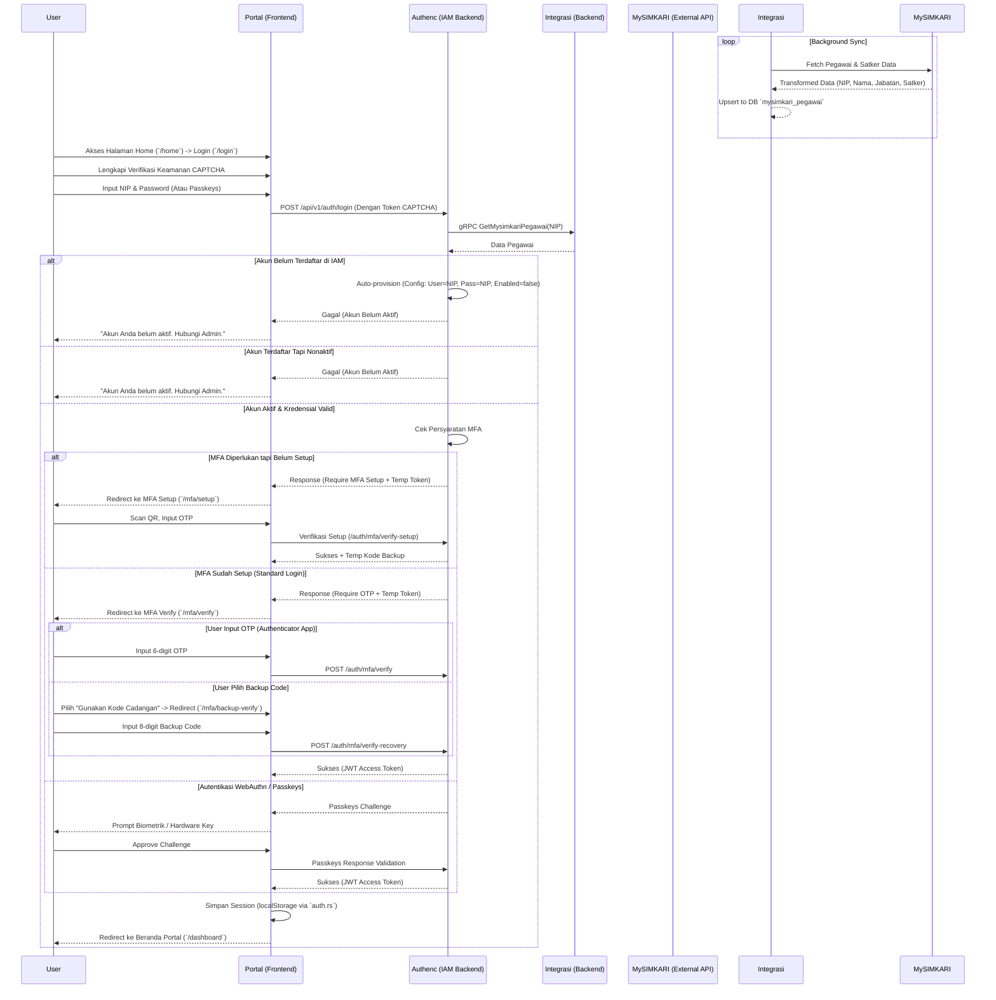
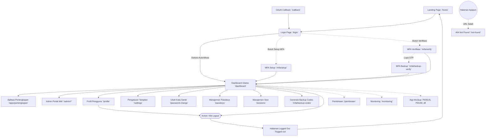

# Refactoring Portal, SSO, dan IAM Integration

Goal: Melakukan refaktor total pada `antarmuka/portal` agar sesuai standar dan best practice, memastikan integrasi Single Sign-On (SSO) dan IAM dengan `authenc`, serta mengintegrasikan data `satker` dan `pegawai` secara penuh dari `layanan-integrasi`.

## Flow Diagrams

### 1. SSO Login, MFA, & Activation Flow (Comprehensive)

### 2. Portal App Navigation Flow (Pages Exhaustive Mapping)

---

## Proposed Changes

### 1. Refactor Portal (`antarmuka/portal/src/pages/*`)
> [!NOTE]
> Halaman statis atau fitur prototipe yang tidak memiliki back-end terintegrasi akan dihapus, sedangkan halaman core IAM Identity dan Pengaturan Mandiri Pengguna (Self-Service) akan dipertahankan dengan refinement.

- **[DELETE] Halaman Statis/Halu**:
  - `src/pages/pembinaan.rs`
  - `src/pages/monitoring.rs`
  - *List microfrontends (Apps) halu seperti PIDUM, PIDSUS, dll pada `src/features/microfrontends.rs` dihapus, menyisakan Perlengkapan dan Admin*.
- **[RETAIN & MODIFY] Core Login & Landing**:
  - `src/pages/home.rs`: Halaman landing page tetap dipertahankan dengan UI resmi Kejaksaan RI.
  - `src/pages/login.rs`: Tetap dipertahankan, namun UX-nya disesuaikan untuk lebih eksplisit meminta NIP. Mendukung redireksi untuk status Akun Non-aktif. **Sudah terintegrasi dengan verifikasi keamanan CAPTCHA yang wajib (mandatory) sebelum request login dikirim.**
  - `src/pages/logged_out.rs`: Dipertahankan untuk transisi Sign-Out.
  - `src/pages/not_found.rs`: Dipertahankan sebagai catch-all fallback 404 router.
  - `src/pages/callback.rs`: Dipertahankan untuk delegasi flow otentikasi OAuth2 internal (jika SSO di-switch on).
- **[RETAIN & MODIFY] Flow MFA (Multi-Factor Auth)**:
  - `src/pages/mfa_setup.rs` & `src/pages/mfa_verification.rs`: Dipertahankan, mendukung logic token temporary session backend dengan flow interceptor login.
  - `src/pages/mfa_backup_codes.rs` & `src/pages/mfa_backup_verification.rs`: Dipertahankan, memfasilitasi pengguna yang app Authenticator-nya hilang.
- **[RETAIN & MODIFY] Self-Service / Profiling Pengguna**:
  - `src/pages/passkeys.rs`: Dipertahankan sebagai front-end untuk WebAuthn (Login Sidik Jari/Wajah).
  - `src/pages/password_change.rs`: Dipertahankan untuk user mengganti password NIP default sistem mereka.
  - `src/pages/profile.rs`, `src/pages/sessions.rs`, `src/pages/settings.rs`: Dipertahankan dan dipastikan sinkron dengan user claim yang baru dari database layanan integrasi (Nama, Satker, Jabatan).
- **[MODIFY] Dashboard Utama**:
  - `src/pages/dashboard.rs`: Dihapus koneksinya ke widget Monitoring mock. Ganti dengan widgets/summary valid (misal: Sesi Login Aktif terakhir, atau Info Data Satker).

### 2. Seeding Admin Authenc & Aktivasi Akun
> [!IMPORTANT]
> Admin akan mendapat Default Password: `199203142014031001` untuk saat ini sesuai request. Akun yang auto-provison akan dibuat **nonaktif** (`enabled: false`), dan harus diaktivasi via manajemen admin.

- **[MODIFY]** `layanan/authenc/crates/core/src/init/database.rs` (atau file startup yang ekuivalen):
  - Tambahkan skrip seeding saat backend startup untuk mengecek keberadaan admin `199203142014031001`.
  - Jika belum ada, lakukan `INSERT` otomatis ke tabel user IAM default sistem dengan Role Admin dan status `enabled: true`.

### 3. Integrasi gRPC ke Layanan Integrasi
Mengoptimalkan data di dalam Authenc berdasar tarikan gRPC.
- **[MODIFY]** `layanan/authenc/crates/federation/src/mysimkari_sync.rs`:
  - Hapus stub mock data. Panggil gRPC Client.
  - Ketika token digenerate dan data user belum ada / butuh sync ulang:
    - Tarik data `nip`, `nama`, `satker_id`, `jabatan`, dan `status_pegawai` menggunakan endpoint gRPC `GetMysimkariPegawai`.
    - Simpan info ini ke dalam Database / Claims user.
    - Set default user `enabled = false` saat pertama kali di-*upsert*.
- **[MODIFY]** `layanan/authenc/crates/core/src/config/mod.rs`:
  - Inject environment parameter untuk host `layanan-integrasi-grpc:50051`.

### 4. Aktivasi User di Portal Admin (`antarmuka/portal/src/pages/admin/users.rs`)
- **[MODIFY]** `src/pages/admin/users.rs`:
  - Fitur *Aksi* -> *Aktifkan* / *Nonaktifkan* sudah/sedang diimplementasikan untuk trigger ke endpoint API IAM Authenc (`PUT /api/v1/iam/users/{id}`).
  - Halaman ini juga perlu menampung data pencarian baru (berdasarkan *username, email, nip, nama*) dan *pagination* yang telah ditambahkan pada *backend store*.
  - Pastikan User Experience (UX) menekankan bahwa user baru dari sinkronisasi MySIMKARI akan muncul dengan status **Nonaktif** dan membutuhkan *approval* klik **Aktifkan** oleh Admin untuk mengizinkan login.

## Verification Plan

### Automated Tests
- Menjalankan testing `authenc` untuk memastikan akun yang di-*provisioning* otomatis terekam dengan `enabled: false`.
- Eksekusi cargo check di folder portal setelah komponen mock dihapus.

### Manual Verification
- Jalankan portal secara lokal (termasuk db, redis, layanan-integrasi).
- Coba login dengan NIP baru (Gagal - butuh aktivasi).
- Login dengan akun admin default `199203142014031001` dan passwordnya.
- Aktifkan akun test NIP lewat UI Admin Portal.
- Login dengan NIP test, verifikasi berhasil diarahkan ke Dashboard.
