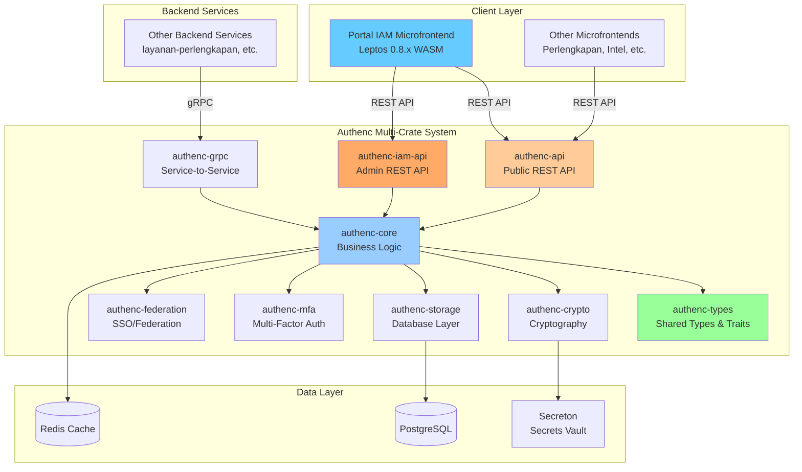
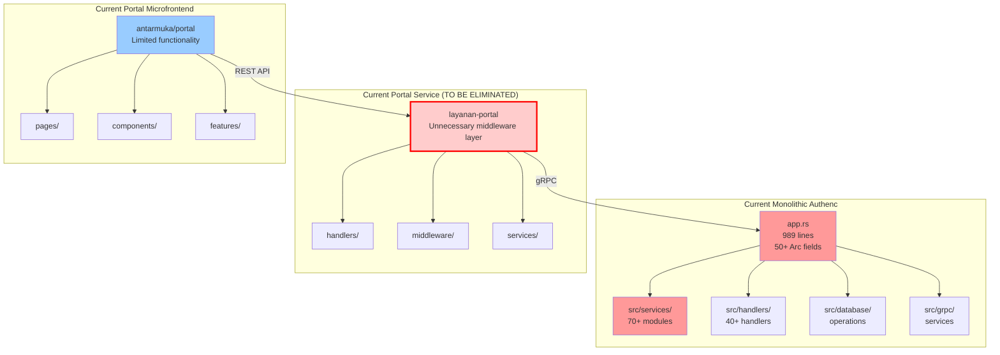
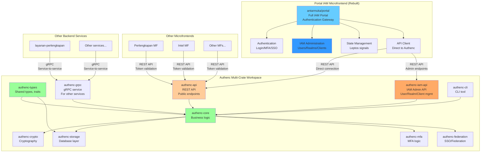
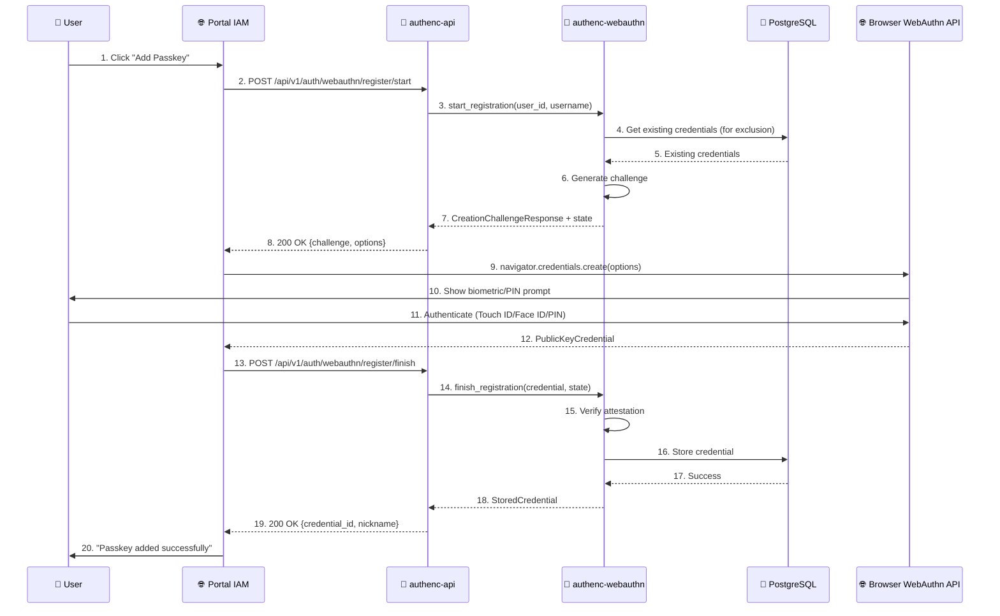
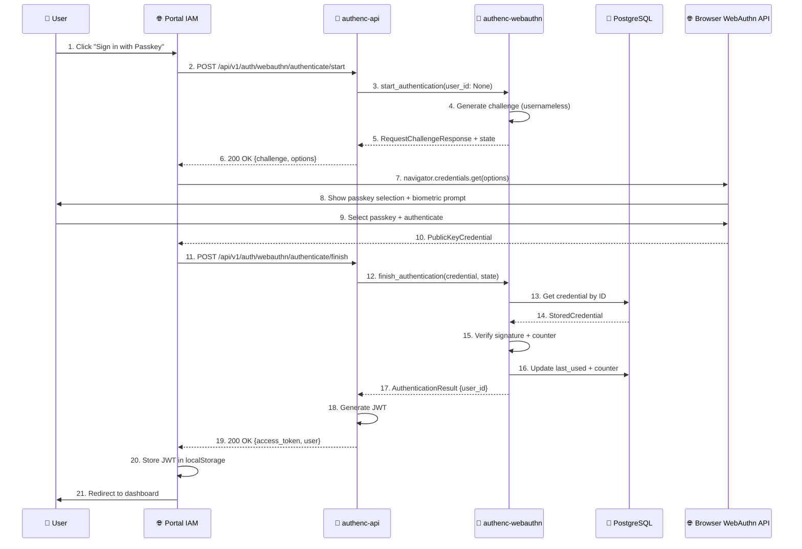
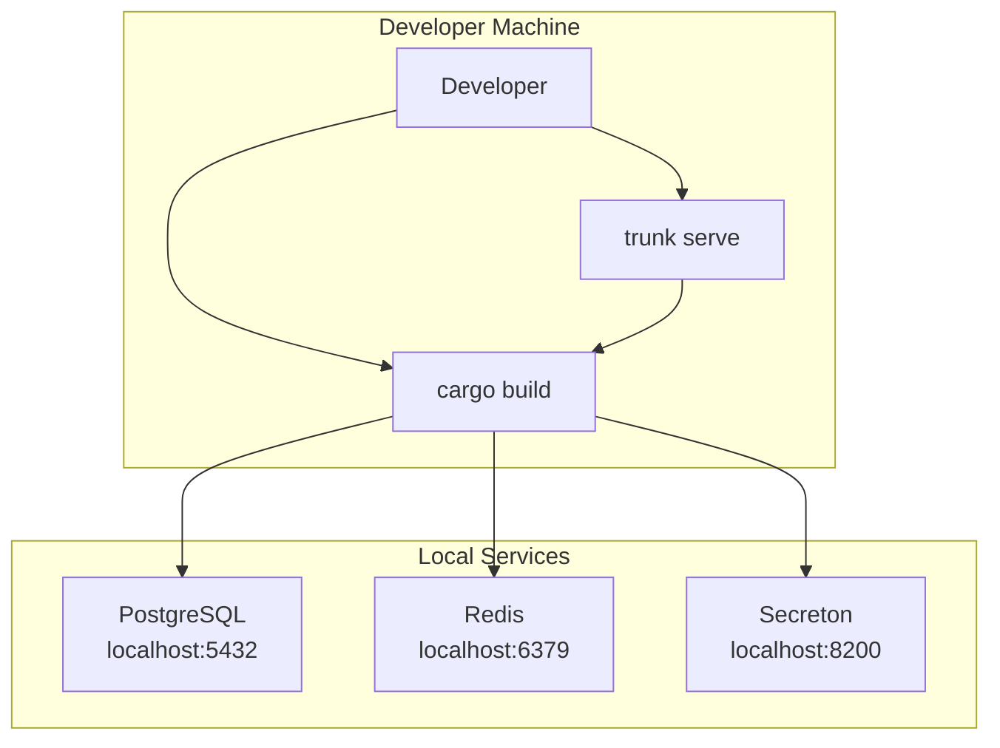
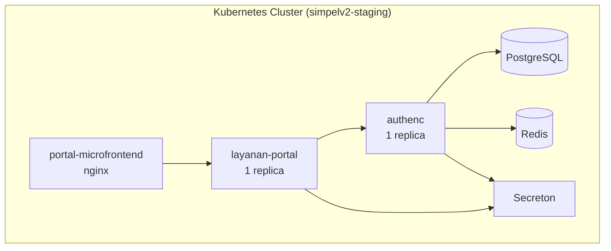
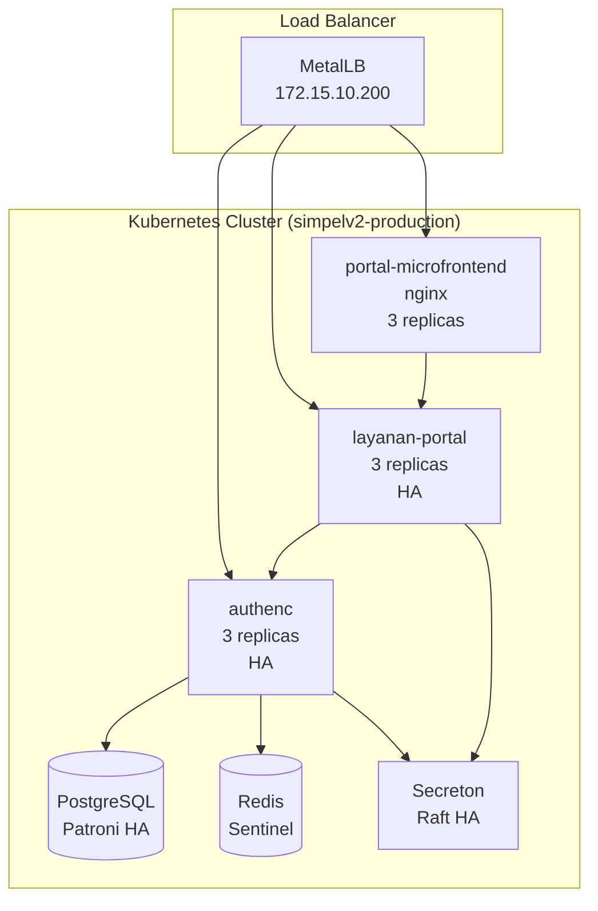
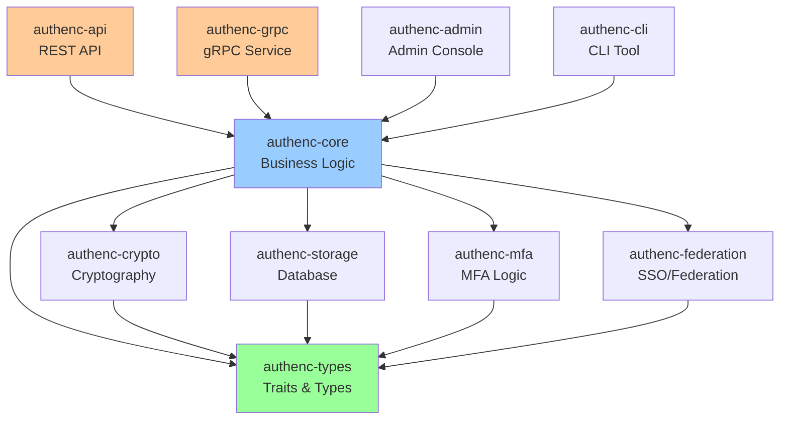
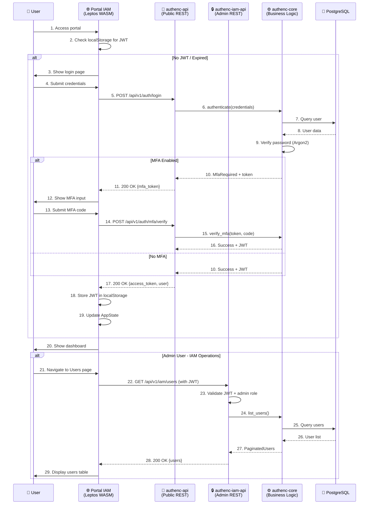

# Design Document: Authenc & Portal IAM Comprehensive Refactoring

## 1. Executive Summary

### 1.1 Purpose
This document specifies the comprehensive architectural refactoring of the SIMPelv2 authentication system, transforming it from a monolithic structure into a modern, enterprise-grade Identity and Access Management (IAM) platform.

### 1.2 Scope
The refactoring encompasses two primary domains:

1. **Authenc Multi-Crate Architecture**: Decomposition of the monolithic authenc service (70+ modules, 989-line app.rs) into a modular, maintainable multi-crate architecture
2. **Portal IAM Microfrontend**: Complete rebuild as a modern IAM portal with direct REST API integration

### 1.3 Key Architectural Decision
**Elimination of layanan-portal service layer**: The portal microfrontend communicates directly with Authenc's REST API, reducing complexity and improving performance.

### 1.4 Goals
- **Maintainability**: Clear separation of concerns, modular architecture
- **Scalability**: Horizontal scaling, distributed deployment support
- **Security**: Enterprise-grade security patterns, OAuth 2.1, FAPI compliance
- **Performance**: Optimized database access, caching strategies, async operations
- **Developer Experience**: Clear APIs, comprehensive documentation, type safety

## 2. System Architecture

### 2.1 High-Level Architecture Overview



## Architecture

### Current State Analysis



**Problems with Current Architecture**:
1. **Unnecessary Layer**: `layanan-portal` adds complexity without value
2. **Duplicate Logic**: Authentication logic duplicated between authenc and portal
3. **Performance Overhead**: Extra network hop (microfrontend → portal → authenc)
4. **Maintenance Burden**: Two services to maintain for authentication
5. **Limited IAM Features**: Portal lacks full IAM capabilities


### Target Architecture (Simplified & Modern)



**Benefits of New Architecture**:
1. **Eliminated Complexity**: No unnecessary portal service layer
2. **Direct Communication**: Microfrontend → Authenc REST API (one hop)
3. **Full IAM Capabilities**: Portal becomes comprehensive IAM admin interface
4. **Better Performance**: Reduced latency, fewer network hops
5. **Clearer Boundaries**: REST API for frontends, gRPC for backend services
6. **Unified Authentication**: Single source of truth for all authentication

### 2.2 Migration Strategy from Monolithic to Multi-Crate

#### 2.2.1 Current Monolithic Structure Analysis

**File Statistics**:
- `src/app.rs`: 989 lines with 50+ Arc<> service fields
- `src/services/`: 70+ service modules
- `src/handlers/`: 40+ HTTP handlers
- `src/database/`: Complex database operations
- `src/crypto/`: Cryptographic operations
- `src/grpc/`: gRPC service implementations
- `src/middleware/`: 15+ middleware components
- `src/models/`: 30+ data models

**Key Challenges**:
1. **Tight Coupling**: Services directly depend on each other
2. **Large AppState**: Single struct with 50+ fields
3. **Circular Dependencies**: Some services reference each other
4. **Mixed Concerns**: Business logic, API handlers, and data access in same modules

#### 2.2.2 Migration Phases

**Phase 1: Foundation (Week 1-2)** - ✅ COMPLETED
- Created crate directory structure
- Defined workspace in root Cargo.toml
- Created authenc-types with core traits
- Set up CI/CD for multi-crate builds

**Phase 2: Core Migration (Week 3-6)** - 🔄 IN PROGRESS
- Migrate database layer → authenc-storage
- Migrate cryptography → authenc-crypto
- Migrate business logic → authenc-core
- Migrate WebAuthn → authenc-webauthn

**Phase 3: API Migration (Week 7-8)**
- Migrate public REST API → authenc-api
- Migrate admin REST API → authenc-iam-api
- Migrate gRPC service → authenc-grpc

**Phase 4: Feature Migration (Week 9-10)**
- Migrate MFA logic → authenc-mfa
- Migrate SSO/Federation → authenc-federation

**Phase 5: Portal Refactoring (Week 11-12)**
- Rebuild portal microfrontend with Leptos 0.8.x
- Implement direct REST API integration
- Eliminate layanan-portal service

**Phase 6: Cleanup (Week 13-14)**
- Remove old monolithic code
- Performance testing and optimization
- Security audit
- Production deployment

#### 2.2.3 Detailed Migration Mapping

**authenc-storage Migration**:
```
src/database/mod.rs                    → crates/storage/src/database.rs
src/database/pool_config.rs            → crates/storage/src/pool_config.rs
src/database/pool_monitor.rs           → crates/storage/src/pool_monitor.rs
src/database/prepared_cache.rs         → crates/storage/src/prepared_cache.rs
src/database/transaction.rs            → crates/storage/src/transaction.rs
src/database/operations/               → crates/storage/src/operations/
src/database/audit_operations.rs       → crates/storage/src/audit_operations.rs
src/database/captcha_operations.rs     → crates/storage/src/captcha_operations.rs
src/database/satker_operations.rs      → crates/storage/src/satker_operations.rs
src/database/migrations.rs             → crates/storage/src/migrations.rs
```

**authenc-crypto Migration**:
```
src/crypto/mod.rs                      → crates/crypto/src/lib.rs
src/crypto/enhanced.rs                 → crates/crypto/src/enhanced.rs
src/crypto/aes_gcm.rs                  → crates/crypto/src/aes_gcm.rs
src/crypto/shamir.rs                   → crates/crypto/src/shamir.rs
src/crypto/ed25519_keys.rs             → crates/crypto/src/keys/ed25519.rs
src/crypto/ecdsa_keys.rs               → crates/crypto/src/keys/ecdsa.rs
src/crypto/pqc.rs                      → crates/crypto/src/pqc.rs
src/crypto/mtls.rs                     → crates/crypto/src/mtls.rs
src/crypto/dpop/                       → crates/crypto/src/dpop/
src/crypto/sdjwt/                      → crates/crypto/src/sdjwt/
src/utils/jwt.rs                       → crates/crypto/src/jwt.rs
src/utils/jwt_key_manager.rs           → crates/crypto/src/jwt_key_manager.rs
```

**authenc-core Migration**:
```
src/services/stores/                   → crates/core/src/stores/
src/services/brute_force_protector.rs  → crates/core/src/services/brute_force_protector.rs
src/services/anomaly_detector.rs       → crates/core/src/services/anomaly_detector.rs
src/services/session_store.rs          → crates/core/src/services/session_store.rs
src/services/realm.rs                  → crates/core/src/services/realm.rs
src/services/oidc_client_store.rs      → crates/core/src/services/oidc_client_store.rs
src/services/oauth2/                   → crates/core/src/services/oauth2/
src/services/uma/                      → crates/core/src/services/uma/
src/services/audit_*.rs                → crates/core/src/services/audit/
src/services/event_*.rs                → crates/core/src/services/events/
src/services/cache/                    → crates/core/src/services/cache/
src/config/                            → crates/core/src/config/
src/models/                            → crates/types/src/models/
src/spi/                               → crates/core/src/spi/
```

**authenc-api Migration**:
```
src/handlers/auth_helpers.rs           → crates/api/src/handlers/auth_helpers.rs
src/handlers/session.rs                → crates/api/src/handlers/session.rs
src/handlers/oauth2*.rs                → crates/api/src/handlers/oauth2/
src/handlers/oidc_*.rs                 → crates/api/src/handlers/oidc/
src/handlers/webauthn.rs               → crates/api/src/handlers/webauthn.rs
src/handlers/federated_*.rs            → crates/api/src/handlers/federation/
src/handlers/saml.rs                   → crates/api/src/handlers/saml.rs
src/middleware/                        → crates/api/src/middleware/
src/routes/                            → crates/api/src/routes.rs
src/axum_app/                          → crates/api/src/app.rs
```

**authenc-iam-api Migration**:
```
src/handlers/admin.rs                  → crates/iam-api/src/handlers/admin.rs
src/handlers/client_registration.rs    → crates/iam-api/src/handlers/client_registration.rs
src/handlers/dcr_admin.rs              → crates/iam-api/src/handlers/dcr_admin.rs
src/handlers/federation_admin.rs       → crates/iam-api/src/handlers/federation_admin.rs
src/handlers/group.rs                  → crates/iam-api/src/handlers/group.rs
src/handlers/organization.rs           → crates/iam-api/src/handlers/organization.rs
src/handlers/audit.rs                  → crates/iam-api/src/handlers/audit.rs
src/handlers/uma.rs                    → crates/iam-api/src/handlers/uma.rs
```

**authenc-grpc Migration**:
```
src/grpc/authenc_service.rs            → crates/grpc/src/authenc_service.rs
src/grpc/captcha_service.rs            → crates/grpc/src/captcha_service.rs
src/grpc/batch_operations.rs           → crates/grpc/src/batch_operations.rs
src/grpc/health.rs                     → crates/grpc/src/health.rs
src/grpc/interceptors.rs               → crates/grpc/src/interceptors.rs
```

**authenc-mfa Migration**:
```
src/services/mfa_service.rs            → crates/mfa/src/service.rs
src/services/mfa_admin_service.rs      → crates/mfa/src/admin_service.rs
src/services/totp_store.rs             → crates/mfa/src/totp_store.rs
src/services/mfa_fallback_client.rs    → crates/mfa/src/fallback_client.rs
src/services/mfa_local_storage.rs      → crates/mfa/src/local_storage.rs
src/services/mfa_security_monitor.rs   → crates/mfa/src/security_monitor.rs
```

**authenc-federation Migration**:
```
src/services/federation_manager.rs     → crates/federation/src/manager.rs
src/services/federation_provider.rs    → crates/federation/src/provider.rs
src/services/sso/                      → crates/federation/src/sso/
src/services/broker/                   → crates/federation/src/broker/
src/services/saml.rs                   → crates/federation/src/saml/service.rs
src/services/social/                   → crates/federation/src/social/
```

**authenc-webauthn Migration**:
```
src/services/webauthn.rs               → crates/webauthn/src/service.rs
src/models/webauthn.rs                 → crates/webauthn/src/models.rs
src/handlers/webauthn.rs               → crates/api/src/handlers/webauthn.rs
```

#### 2.2.4 Files to Keep in Root

**Essential Root Files** (to be updated, not migrated):
- `src/main.rs` - Entry point, updated to use new crates
- `src/lib.rs` - Re-exports all crates
- `src/app.rs` - Simplified AppState using new crates
- `src/server.rs` - Server initialization
- `src/error.rs` - May move to authenc-types
- `src/app_logging.rs` - May move to authenc-core

**Files NOT to Migrate**:
- `src/admin_console/` - Optional Leptos admin UI (feature-gated)
- `src/bin/generate-signing-keys.rs` - CLI tool (separate binary)
- `migrations/` - SQL migrations (stay in root)
- `proto/` - gRPC proto files (stay in root)

#### 2.2.5 Migration Principles

1. **Incremental Migration**: Migrate one crate at a time, keeping old code working
2. **Test-Driven**: Write tests before migration, ensure they pass after
3. **Backward Compatibility**: Maintain API compatibility during transition
4. **Dependency Order**: Migrate in dependency order (types → storage → crypto → core → api)
5. **Parallel Development**: Old and new code coexist during migration
6. **Rollback Ready**: Keep old code until new code is fully tested

#### 2.2.6 Migration Validation Checklist

For each migrated crate:
- ✅ All files moved to correct locations
- ✅ Imports updated to use new crate paths
- ✅ Cargo.toml dependencies configured
- ✅ Unit tests pass
- ✅ Integration tests pass
- ✅ No circular dependencies
- ✅ Documentation updated
- ✅ CI/CD pipeline green


## Components and Interfaces

### 1. Authenc Multi-Crate Structure

#### 1.1 authenc-types

**Purpose**: Shared types, traits, and interfaces used across all authenc crates

**Interface**:
```rust
// Core domain types
pub struct UserId(pub Uuid);
pub struct RealmId(pub Uuid);
pub struct ClientId(pub Uuid);
pub struct SessionId(pub Uuid);

// Authentication result
pub enum AuthResult {
    Success { user_id: UserId, session_id: SessionId },
    MfaRequired { user_id: UserId, mfa_token: String },
    Failed { reason: AuthFailureReason },
}

// Traits for service abstraction
pub trait UserStore: Send + Sync {
    async fn get_user(&self, id: UserId) -> Result<User>;
    async fn create_user(&self, req: CreateUserRequest) -> Result<User>;
    async fn update_user(&self, id: UserId, req: UpdateUserRequest) -> Result<User>;
}

pub trait SessionStore: Send + Sync {
    async fn create_session(&self, user_id: UserId) -> Result<Session>;
    async fn get_session(&self, id: SessionId) -> Result<Option<Session>>;
    async fn invalidate_session(&self, id: SessionId) -> Result<()>;
}

pub trait AuthenticationService: Send + Sync {
    async fn authenticate(&self, credentials: Credentials) -> Result<AuthResult>;
    async fn verify_mfa(&self, user_id: UserId, code: String) -> Result<AuthResult>;
}
```

**Responsibilities**:
- Define core domain types (User, Session, Realm, Client, etc.)
- Define service traits for dependency injection
- Define error types and result types
- Define configuration structures
- No implementation logic (pure interfaces)


#### 1.2 authenc-core

**Purpose**: Core business logic and service implementations

**Interface**:
```rust
// Main authentication service
pub struct AuthenticationServiceImpl {
    user_store: Arc<dyn UserStore>,
    session_store: Arc<dyn SessionStore>,
    password_hasher: Arc<dyn PasswordHasher>,
    brute_force_protector: Arc<BruteForceProtector>,
}

impl AuthenticationService for AuthenticationServiceImpl {
    async fn authenticate(&self, credentials: Credentials) -> Result<AuthResult> {
        // 1. Check brute force protection
        self.brute_force_protector.check(&credentials.username).await?;

        // 2. Get user from store
        let user = self.user_store.get_by_username(&credentials.username).await?;

        // 3. Verify password
        if !self.password_hasher.verify(&credentials.password, &user.password_hash)? {
            self.brute_force_protector.record_failure(&credentials.username).await;
            return Ok(AuthResult::Failed { reason: AuthFailureReason::InvalidCredentials });
        }

        // 4. Check MFA requirement
        if user.mfa_enabled {
            let mfa_token = self.generate_mfa_token(&user).await?;
            return Ok(AuthResult::MfaRequired { user_id: user.id, mfa_token });
        }

        // 5. Create session
        let session = self.session_store.create_session(user.id).await?;

        Ok(AuthResult::Success { user_id: user.id, session_id: session.id })
    }
}

// User management service
pub struct UserManagementService {
    user_store: Arc<dyn UserStore>,
    event_publisher: Arc<dyn EventPublisher>,
}

// Realm management service
pub struct RealmManagementService {
    realm_store: Arc<dyn RealmStore>,
}

// OAuth2/OIDC service
pub struct OAuth2Service {
    client_store: Arc<dyn ClientStore>,
    token_generator: Arc<dyn TokenGenerator>,
}
```

**Responsibilities**:
- Implement authentication logic
- Implement user management
- Implement realm management
- Implement OAuth2/OIDC flows
- Implement authorization logic
- Coordinate between different stores
- Publish domain events


#### 1.3 authenc-crypto

**Purpose**: Cryptographic operations (JWT, password hashing, encryption)

**Interface**:
```rust
// JWT operations
pub struct JwtService {
    signing_key: Ed25519KeyPair,
    issuer: String,
}

impl JwtService {
    pub fn generate_access_token(&self, claims: TokenClaims) -> Result<String> {
        // Generate JWT with Ed25519 signature
    }

    pub fn verify_token(&self, token: &str) -> Result<TokenClaims> {
        // Verify JWT signature and expiry
    }
}

// Password hashing
pub trait PasswordHasher: Send + Sync {
    fn hash(&self, password: &str) -> Result<String>;
    fn verify(&self, password: &str, hash: &str) -> Result<bool>;
}

pub struct Argon2PasswordHasher {
    config: Argon2Config,
}

// Encryption
pub struct EncryptionService {
    key: ChaCha20Poly1305Key,
}

impl EncryptionService {
    pub fn encrypt(&self, plaintext: &[u8]) -> Result<Vec<u8>>;
    pub fn decrypt(&self, ciphertext: &[u8]) -> Result<Vec<u8>>;
}
```

**Responsibilities**:
- JWT generation and validation (Ed25519)
- Password hashing (Argon2id)
- Symmetric encryption (ChaCha20-Poly1305)
- Key management
- TOTP generation and verification


#### 1.4 authenc-storage

**Purpose**: Database layer with PostgreSQL implementation

**Interface**:
```rust
// Database connection pool
pub struct Database {
    pool: deadpool_postgres::Pool,
    prepared_cache: PreparedStatementCache,
}

// User store implementation
pub struct PostgresUserStore {
    db: Arc<Database>,
}

impl UserStore for PostgresUserStore {
    async fn get_user(&self, id: UserId) -> Result<User> {
        let row = self.db.query_one(
            "SELECT * FROM users WHERE id = $1",
            &[&id.0]
        ).await?;
        Ok(User::from_row(row)?)
    }

    async fn create_user(&self, req: CreateUserRequest) -> Result<User> {
        let id = UserId(Uuid::new_v4());
        self.db.execute(
            "INSERT INTO users (id, username, email, password_hash) VALUES ($1, $2, $3, $4)",
            &[&id.0, &req.username, &req.email, &req.password_hash]
        ).await?;
        self.get_user(id).await
    }
}

// Session store implementation
pub struct PostgresSessionStore {
    db: Arc<Database>,
}

// Realm store implementation
pub struct PostgresRealmStore {
    db: Arc<Database>,
}

// Client store implementation
pub struct PostgresClientStore {
    db: Arc<Database>,
}
```

**Responsibilities**:
- Database connection management
- Prepared statement caching
- Transaction support
- Store implementations for all domain entities
- Migration management


#### 1.5 authenc-api

**Purpose**: Public REST API layer for microfrontends (Axum 0.8.x)

**Interface**:
```rust
// API state
pub struct ApiState {
    auth_service: Arc<dyn AuthenticationService>,
    user_service: Arc<UserManagementService>,
    oauth2_service: Arc<OAuth2Service>,
    jwt_service: Arc<JwtService>,
}

// Public authentication endpoints
pub async fn login_handler(
    State(state): State<Arc<ApiState>>,
    Json(req): Json<LoginRequest>,
) -> Result<Json<LoginResponse>, ApiError> {
    let result = state.auth_service.authenticate(req.into()).await?;

    match result {
        AuthResult::Success { user_id, session_id } => {
            let token = state.jwt_service.generate_access_token(TokenClaims {
                sub: user_id.to_string(),
                exp: Utc::now() + Duration::minutes(15),
            })?;
            Ok(Json(LoginResponse { access_token: token }))
        }
        AuthResult::MfaRequired { mfa_token, .. } => {
            Ok(Json(LoginResponse { mfa_token: Some(mfa_token) }))
        }
        AuthResult::Failed { reason } => {
            Err(ApiError::Unauthorized(reason.to_string()))
        }
    }
}

// Token validation endpoint (for other microfrontends)
pub async fn validate_token_handler(
    State(state): State<Arc<ApiState>>,
    Json(req): Json<ValidateTokenRequest>,
) -> Result<Json<ValidateTokenResponse>, ApiError>;

// OAuth2 public endpoints
pub async fn oauth2_authorize_handler(...) -> Result<Response, ApiError>;
pub async fn oauth2_token_handler(...) -> Result<Json<TokenResponse>, ApiError>;

// User profile endpoint (authenticated)
pub async fn get_current_user_handler(...) -> Result<Json<User>, ApiError>;
```

**Responsibilities**:
- Public HTTP endpoints for authentication
- Token validation for microfrontends
- OAuth2/OIDC public flows
- User profile access
- Session management
- CORS configuration for microfrontends
- Rate limiting
- OpenAPI documentation

---

#### 1.6 authenc-iam-api

**Purpose**: IAM Administration REST API for Portal IAM Microfrontend (Axum 0.8.x)

**Interface**:
```rust
// IAM API state
pub struct IamApiState {
    user_service: Arc<UserManagementService>,
    realm_service: Arc<RealmManagementService>,
    client_service: Arc<ClientManagementService>,
    role_service: Arc<RoleManagementService>,
    federation_service: Arc<FederationService>,
}

// User management endpoints
pub async fn list_users_handler(
    State(state): State<Arc<IamApiState>>,
    Extension(admin): Extension<AdminUser>,
    Query(params): Query<ListUsersParams>,
) -> Result<Json<PaginatedUsers>, ApiError>;

pub async fn create_user_handler(
    State(state): State<Arc<IamApiState>>,
    Extension(admin): Extension<AdminUser>,
    Json(req): Json<CreateUserRequest>,
) -> Result<Json<User>, ApiError>;

pub async fn update_user_handler(...) -> Result<Json<User>, ApiError>;
pub async fn delete_user_handler(...) -> Result<StatusCode, ApiError>;
pub async fn reset_user_password_handler(...) -> Result<StatusCode, ApiError>;
pub async fn enable_user_mfa_handler(...) -> Result<Json<MfaSetupResponse>, ApiError>;

// Realm management endpoints
pub async fn list_realms_handler(...) -> Result<Json<Vec<Realm>>, ApiError>;
pub async fn create_realm_handler(...) -> Result<Json<Realm>, ApiError>;
pub async fn update_realm_handler(...) -> Result<Json<Realm>, ApiError>;
pub async fn delete_realm_handler(...) -> Result<StatusCode, ApiError>;

// OAuth2 client management endpoints
pub async fn list_clients_handler(...) -> Result<Json<Vec<OidcClient>>, ApiError>;
pub async fn create_client_handler(...) -> Result<Json<OidcClient>, ApiError>;
pub async fn update_client_handler(...) -> Result<Json<OidcClient>, ApiError>;
pub async fn delete_client_handler(...) -> Result<StatusCode, ApiError>;
pub async fn regenerate_client_secret_handler(...) -> Result<Json<ClientSecret>, ApiError>;

// Role management endpoints
pub async fn list_roles_handler(...) -> Result<Json<Vec<Role>>, ApiError>;
pub async fn create_role_handler(...) -> Result<Json<Role>, ApiError>;
pub async fn assign_role_to_user_handler(...) -> Result<StatusCode, ApiError>;
pub async fn remove_role_from_user_handler(...) -> Result<StatusCode, ApiError>;

// Federation/SSO management endpoints
pub async fn list_identity_providers_handler(...) -> Result<Json<Vec<IdentityProvider>>, ApiError>;
pub async fn create_identity_provider_handler(...) -> Result<Json<IdentityProvider>, ApiError>;
pub async fn update_identity_provider_handler(...) -> Result<Json<IdentityProvider>, ApiError>;
pub async fn delete_identity_provider_handler(...) -> Result<StatusCode, ApiError>;

// Audit log endpoints
pub async fn list_audit_logs_handler(...) -> Result<Json<PaginatedAuditLogs>, ApiError>;
pub async fn export_audit_logs_handler(...) -> Result<Response, ApiError>;

// System configuration endpoints
pub async fn get_system_config_handler(...) -> Result<Json<SystemConfig>, ApiError>;
pub async fn update_system_config_handler(...) -> Result<Json<SystemConfig>, ApiError>;
```

**Responsibilities**:
- IAM administration endpoints (admin-only)
- User CRUD operations
- Realm management
- OAuth2 client management
- Role and permission management
- Federation/SSO configuration
- Audit log access
- System configuration
- Admin authentication middleware
- Permission-based authorization

---

#### 1.7 authenc-grpc

**Purpose**: gRPC service layer (Tonic 0.14.x)

**Interface**:
```rust
// Proto definition
// proto/authenc.proto
service AuthencService {
  rpc Authenticate(AuthenticateRequest) returns (AuthenticateResponse);
  rpc ValidateToken(ValidateTokenRequest) returns (ValidateTokenResponse);
  rpc CreateUser(CreateUserRequest) returns (CreateUserResponse);
  rpc GetUser(GetUserRequest) returns (GetUserResponse);
}

// gRPC service implementation
pub struct AuthencGrpcService {
    auth_service: Arc<dyn AuthenticationService>,
    user_service: Arc<UserManagementService>,
    jwt_service: Arc<JwtService>,
}

#[tonic::async_trait]
impl authenc_proto::authenc_service_server::AuthencService for AuthencGrpcService {
    async fn authenticate(
        &self,
        request: Request<AuthenticateRequest>,
    ) -> Result<Response<AuthenticateResponse>, Status> {
        let req = request.into_inner();

        let result = self.auth_service.authenticate(Credentials {
            username: req.username,
            password: req.password,
        }).await.map_err(|e| Status::internal(e.to_string()))?;

        match result {
            AuthResult::Success { user_id, session_id } => {
                let token = self.jwt_service.generate_access_token(...)?;
                Ok(Response::new(AuthenticateResponse {
                    success: true,
                    access_token: token,
                    user_id: user_id.to_string(),
                }))
            }
            _ => Ok(Response::new(AuthenticateResponse { success: false, .. }))
        }
    }

    async fn validate_token(...) -> Result<Response<ValidateTokenResponse>, Status>;
}
```

**Responsibilities**:
- gRPC service implementation
- Proto code generation
- mTLS configuration
- gRPC interceptors (auth, logging)
- Error mapping


#### 1.7 authenc-mfa

**Purpose**: Multi-factor authentication logic

**Interface**:
```rust
// MFA service
pub struct MfaService {
    totp_store: Arc<dyn TotpStore>,
    secreton_client: Arc<SecretonClient>,
}

impl MfaService {
    pub async fn setup_totp(&self, user_id: UserId) -> Result<TotpSetupResponse> {
        // 1. Generate TOTP secret
        let secret = generate_totp_secret();

        // 2. Store in Secreton
        self.secreton_client.store_secret(
            &format!("totp/{}", user_id),
            secret.as_bytes()
        ).await?;

        // 3. Generate QR code
        let qr_code = generate_qr_code(&secret, &user_id.to_string())?;

        Ok(TotpSetupResponse { qr_code, secret })
    }

    pub async fn verify_totp(&self, user_id: UserId, code: &str) -> Result<bool> {
        // 1. Retrieve secret from Secreton
        let secret = self.secreton_client.get_secret(&format!("totp/{}", user_id)).await?;

        // 2. Verify TOTP code
        verify_totp_code(&secret, code)
    }
}

// Backup codes service
pub struct BackupCodesService {
    db: Arc<Database>,
}

// WebAuthn service
pub struct WebAuthnService {
    rp_id: String,
    rp_name: String,
}
```

**Responsibilities**:
- TOTP setup and verification
- Backup codes generation and validation
- WebAuthn/FIDO2 support
- MFA policy enforcement
- Integration with Secreton for secret storage


#### 1.8 authenc-federation

**Purpose**: SSO and external identity provider integration

**Interface**:
```rust
// Federation service
pub struct FederationService {
    provider_registry: Arc<ProviderRegistry>,
    user_store: Arc<dyn UserStore>,
}

impl FederationService {
    pub async fn initiate_sso(&self, provider: &str) -> Result<SsoRedirect> {
        let provider = self.provider_registry.get(provider)?;
        provider.initiate_login().await
    }

    pub async fn handle_callback(&self, provider: &str, code: &str) -> Result<User> {
        let provider = self.provider_registry.get(provider)?;
        let external_user = provider.exchange_code(code).await?;

        // Link or create user
        self.link_or_create_user(external_user).await
    }
}

// OIDC provider
pub struct OidcProvider {
    config: OidcConfig,
    client: OidcClient,
}

// SAML provider
pub struct SamlProvider {
    config: SamlConfig,
}

// LDAP provider
pub struct LdapProvider {
    config: LdapConfig,
}
```

**Responsibilities**:
- External IdP integration (OIDC, SAML, LDAP)
- SSO flow orchestration
- User account linking
- Attribute mapping
- Just-in-time provisioning

---

#### 1.9 authenc-webauthn

**Purpose**: WebAuthn/Passkeys (FIDO2) authentication - **PRIMARY AUTHENTICATION METHOD**

**Interface**:
```rust
use webauthn_rs::prelude::*;

// WebAuthn service
pub struct WebAuthnService {
    webauthn: Arc<Webauthn>,
    credential_store: Arc<dyn CredentialStore>,
}

impl WebAuthnService {
    pub fn new(rp_id: String, rp_origin: Url) -> Result<Self> {
        let builder = WebauthnBuilder::new(&rp_id, &rp_origin)?;
        let webauthn = Arc::new(builder.build()?);

        Ok(Self {
            webauthn,
            credential_store,
        })
    }

    // Registration flow
    pub async fn start_registration(
        &self,
        user_id: UserId,
        username: &str,
        display_name: &str,
    ) -> Result<(CreationChallengeResponse, PasskeyRegistration)> {
        // Generate unique user handle
        let user_unique_id = Uuid::new_v4();

        // Get existing credentials for this user (for excluding)
        let existing_credentials = self.credential_store
            .get_credentials_for_user(user_id)
            .await?;

        let excluded_credentials: Vec<CredentialID> = existing_credentials
            .iter()
            .map(|c| c.cred_id.clone())
            .collect();

        // Start registration ceremony
        let (ccr, reg_state) = self.webauthn.start_passkey_registration(
            user_unique_id,
            username,
            display_name,
            Some(excluded_credentials),
        )?;

        // Store registration state temporarily
        let registration = PasskeyRegistration {
            user_id,
            state: reg_state,
            created_at: Utc::now(),
        };

        Ok((ccr, registration))
    }

    pub async fn finish_registration(
        &self,
        user_id: UserId,
        reg: &RegisterPublicKeyCredential,
        state: &PasskeyRegistration,
    ) -> Result<StoredCredential> {
        // Finish registration ceremony
        let passkey = self.webauthn.finish_passkey_registration(reg, &state.state)?;

        // Store credential
        let stored_credential = StoredCredential {
            id: Uuid::new_v4(),
            user_id,
            cred_id: passkey.cred_id().clone(),
            cred: passkey,
            nickname: None,
            created_at: Utc::now(),
            last_used: None,
        };

        self.credential_store.store_credential(&stored_credential).await?;

        Ok(stored_credential)
    }

    // Authentication flow
    pub async fn start_authentication(
        &self,
        user_id: Option<UserId>,
    ) -> Result<(RequestChallengeResponse, PasskeyAuthentication)> {
        let allowed_credentials = if let Some(uid) = user_id {
            // User-specific authentication (username provided)
            self.credential_store.get_credentials_for_user(uid).await?
        } else {
            // Usernameless authentication (discoverable credentials)
            vec![]
        };

        let (rcr, auth_state) = self.webauthn.start_passkey_authentication(
            &allowed_credentials.iter().map(|c| c.cred.clone()).collect::<Vec<_>>(),
        )?;

        let authentication = PasskeyAuthentication {
            user_id,
            state: auth_state,
            created_at: Utc::now(),
        };

        Ok((rcr, authentication))
    }

    pub async fn finish_authentication(
        &self,
        auth: &PublicKeyCredential,
        state: &PasskeyAuthentication,
    ) -> Result<AuthenticationResult> {
        // Finish authentication ceremony
        let auth_result = self.webauthn.finish_passkey_authentication(auth, &state.state)?;

        // Get credential from database
        let credential = self.credential_store
            .get_credential_by_id(&auth_result.cred_id())
            .await?;

        // Update last used timestamp
        self.credential_store
            .update_last_used(credential.id, Utc::now())
            .await?;

        // Update credential counter (prevents replay attacks)
        self.credential_store
            .update_counter(credential.id, auth_result.counter())
            .await?;

        Ok(AuthenticationResult::Success {
            user_id: credential.user_id,
            credential_id: credential.id,
        })
    }

    // Credential management
    pub async fn list_credentials(&self, user_id: UserId) -> Result<Vec<StoredCredential>> {
        self.credential_store.get_credentials_for_user(user_id).await
    }

    pub async fn delete_credential(&self, user_id: UserId, credential_id: Uuid) -> Result<()> {
        // Verify ownership
        let credential = self.credential_store.get_credential(credential_id).await?;
        if credential.user_id != user_id {
            return Err(AuthencError::Unauthorized);
        }

        self.credential_store.delete_credential(credential_id).await
    }

    pub async fn update_credential_nickname(
        &self,
        user_id: UserId,
        credential_id: Uuid,
        nickname: String,
    ) -> Result<()> {
        // Verify ownership
        let credential = self.credential_store.get_credential(credential_id).await?;
        if credential.user_id != user_id {
            return Err(AuthencError::Unauthorized);
        }

        self.credential_store.update_nickname(credential_id, nickname).await
    }
}

// Credential storage trait
pub trait CredentialStore: Send + Sync {
    async fn store_credential(&self, credential: &StoredCredential) -> Result<()>;
    async fn get_credential(&self, id: Uuid) -> Result<StoredCredential>;
    async fn get_credential_by_id(&self, cred_id: &CredentialID) -> Result<StoredCredential>;
    async fn get_credentials_for_user(&self, user_id: UserId) -> Result<Vec<StoredCredential>>;
    async fn delete_credential(&self, id: Uuid) -> Result<()>;
    async fn update_last_used(&self, id: Uuid, timestamp: DateTime<Utc>) -> Result<()>;
    async fn update_counter(&self, id: Uuid, counter: u32) -> Result<()>;
    async fn update_nickname(&self, id: Uuid, nickname: String) -> Result<()>;
}

// Models
#[derive(Debug, Clone, Serialize, Deserialize)]
pub struct StoredCredential {
    pub id: Uuid,
    pub user_id: UserId,
    pub cred_id: CredentialID,
    pub cred: Passkey,
    pub nickname: Option<String>,
    pub created_at: DateTime<Utc>,
    pub last_used: Option<DateTime<Utc>>,
}

#[derive(Debug, Clone)]
pub struct PasskeyRegistration {
    pub user_id: UserId,
    pub state: PasskeyRegistration,
    pub created_at: DateTime<Utc>,
}

#[derive(Debug, Clone)]
pub struct PasskeyAuthentication {
    pub user_id: Option<UserId>,
    pub state: PasskeyAuthentication,
    pub created_at: DateTime<Utc>,
}
```

**Responsibilities**:
- WebAuthn/FIDO2 protocol implementation
- Passkey registration and authentication
- Credential storage and management
- Usernameless authentication (discoverable credentials)
- Credential counter management (replay attack prevention)
- Multi-device passkey support
- Platform authenticator support (Touch ID, Face ID, Windows Hello)
- Security key support (YubiKey, etc.)

**Security Features**:
- Phishing-resistant authentication
- No shared secrets (public key cryptography)
- Origin-bound credentials
- Attestation support (optional)
- User verification (biometrics or PIN)
- Replay attack prevention via counter


### 2. Portal IAM Microfrontend (Complete Rebuild)

**Architecture Decision**: The `layanan-portal` service is **completely eliminated**. The portal microfrontend now serves as a comprehensive IAM (Identity and Access Management) portal that communicates directly with Authenc's REST API.

**Portal IAM Responsibilities**:
1. **Authentication Gateway**: Primary login interface for all SIMPelv2 users
2. **User Self-Service**: Profile management, password change, MFA setup, **Passkey management**
3. **IAM Administration**: Full user, realm, client, and role management (admin users)
4. **SSO Configuration**: External identity provider setup and management
5. **Audit Logging**: View and export authentication audit logs
6. **Dashboard**: Overview of system status, recent logins, security alerts

**Authentication Methods Priority**:
1. **PRIMARY**: Passkeys/WebAuthn (FIDO2) - Passwordless, phishing-resistant
2. **SECONDARY**: Password + MFA (TOTP/SMS/Email) - Traditional fallback
3. **TERTIARY**: SSO/Federation - External identity providers

---

## 3. WebAuthn/Passkeys Architecture (PRIMARY AUTHENTICATION)

### 3.1 Overview

WebAuthn/Passkeys is positioned as the **PRIMARY authentication method** for SIMPelv2, providing:
- **Passwordless authentication**: No passwords to remember or steal
- **Phishing-resistant**: Credentials are origin-bound
- **Multi-device support**: Sync across devices via platform providers (iCloud Keychain, Google Password Manager)
- **Biometric authentication**: Touch ID, Face ID, Windows Hello
- **Security key support**: YubiKey, Titan Key, etc.

### 3.2 WebAuthn Registration Flow



**Preconditions**:
- User is authenticated (adding passkey to existing account)
- Browser supports WebAuthn API
- User has compatible authenticator (platform or roaming)

**Postconditions**:
- Passkey is stored in database
- User can authenticate with passkey
- Credential is excluded from future registrations

### 3.3 WebAuthn Authentication Flow (Passwordless)



**Preconditions**:
- User has registered passkey
- Browser supports WebAuthn API
- Authenticator is available

**Postconditions**:
- User is authenticated
- JWT token is issued
- Session is created
- Credential counter is incremented (replay attack prevention)

### 3.4 Passkey Management UI

**Portal IAM Microfrontend - Passkey Management Page**:

```rust
// antarmuka/portal/src/pages/profile/passkeys.rs
#[component]
pub fn PasskeysManagementPage() -> impl IntoView {
    let app_state = use_context::<AppState>().expect("AppState not provided");

    // Fetch user's passkeys
    let passkeys = Resource::new(
        || (),
        |_| async move {
            let client = AuthencApiClient::new();
            client.webauthn().list_credentials().await
        }
    );

    let (show_add_modal, set_show_add_modal) = signal(false);

    // Add passkey action
    let add_passkey_action = Action::new(move |_: &()| async move {
        let client = AuthencApiClient::new();

        // Step 1: Start registration
        let start_response = client.webauthn().start_registration().await?;

        // Step 2: Call browser WebAuthn API
        let credential = create_credential(start_response.options).await?;

        // Step 3: Finish registration
        client.webauthn().finish_registration(credential, start_response.state).await
    });

    // Delete passkey action
    let delete_passkey_action = Action::new(move |credential_id: &Uuid| {
        let credential_id = *credential_id;
        async move {
            let client = AuthencApiClient::new();
            client.webauthn().delete_credential(credential_id).await
        }
    });

    view! {
        <div class="container mx-auto px-4 py-8">
            <div class="flex justify-between items-center mb-6">
                <div>
                    <h1 class="text-3xl font-bold text-gray-900">"Passkeys"</h1>
                    <p class="mt-2 text-sm text-gray-600">
                        "Manage your passkeys for passwordless sign-in"
                    </p>
                </div>
                <button
                    on:click=move |_| set_show_add_modal.set(true)
                    class="px-4 py-2 bg-indigo-600 text-white rounded-md hover:bg-indigo-700"
                >
                    "Add Passkey"
                </button>
            </div>

            // Passkeys list
            <Suspense fallback=move || view! { <LoadingSpinner /> }>
                {move || passkeys.get().map(|result| match result {
                    Ok(credentials) if credentials.is_empty() => view! {
                        <div class="text-center py-12">
                            <svg class="mx-auto h-12 w-12 text-gray-400" /* ... */>
                            <h3 class="mt-2 text-sm font-medium text-gray-900">
                                "No passkeys"
                            </h3>
                            <p class="mt-1 text-sm text-gray-500">
                                "Get started by adding a passkey for passwordless sign-in."
                            </p>
                        </div>
                    }.into_any(),
                    Ok(credentials) => view! {
                        <div class="bg-white shadow overflow-hidden sm:rounded-md">
                            <ul class="divide-y divide-gray-200">
                                <For
                                    each=move || credentials.clone()
                                    key=|cred| cred.id
                                    children=move |cred| view! {
                                        <li class="px-6 py-4">
                                            <div class="flex items-center justify-between">
                                                <div class="flex items-center">
                                                    <div class="flex-shrink-0">
                                                        <svg class="h-8 w-8 text-indigo-600" /* ... */>
                                                    </div>
                                                    <div class="ml-4">
                                                        <div class="text-sm font-medium text-gray-900">
                                                            {cred.nickname.clone().unwrap_or_else(|| "Unnamed Passkey".to_string())}
                                                        </div>
                                                        <div class="text-sm text-gray-500">
                                                            "Added " {format_date(cred.created_at)}
                                                        </div>
                                                        {cred.last_used.map(|last| view! {
                                                            <div class="text-xs text-gray-400">
                                                                "Last used " {format_date(last)}
                                                            </div>
                                                        })}
                                                    </div>
                                                </div>
                                                <button
                                                    on:click=move |_| delete_passkey_action.dispatch(cred.id)
                                                    class="text-red-600 hover:text-red-800"
                                                >
                                                    "Delete"
                                                </button>
                                            </div>
                                        </li>
                                    }
                                />
                            </ul>
                        </div>
                    }.into_any(),
                    Err(e) => view! { <ErrorDisplay error=e.to_string() /> }.into_any(),
                })}
            </Suspense>

            // Add passkey modal
            <Show when=move || show_add_modal.get()>
                <AddPasskeyModal
                    on_close=move || set_show_add_modal.set(false)
                    on_add=move || {
                        add_passkey_action.dispatch(());
                        set_show_add_modal.set(false);
                    }
                />
            </Show>
        </div>
    }
}

// Browser WebAuthn API wrapper
async fn create_credential(options: PublicKeyCredentialCreationOptions) -> Result<PublicKeyCredential> {
    use wasm_bindgen::JsValue;
    use web_sys::{CredentialCreationOptions, window};

    let window = window().ok_or(ApiError::BrowserApiUnavailable)?;
    let navigator = window.navigator();
    let credentials = navigator.credentials();

    // Convert options to JS
    let js_options: JsValue = serde_wasm_bindgen::to_value(&options)?;
    let credential_options = CredentialCreationOptions::from(js_options);

    // Call WebAuthn API
    let promise = credentials.create_with_options(&credential_options)?;
    let js_credential = wasm_bindgen_futures::JsFuture::from(promise).await?;

    // Convert back to Rust
    serde_wasm_bindgen::from_value(js_credential).map_err(Into::into)
}
```

### 3.5 Login Page with Passkey Option

```rust
// antarmuka/portal/src/pages/login.rs
#[component]
pub fn LoginPage() -> impl IntoView {
    let app_state = use_context::<AppState>().expect("AppState not provided");
    let (auth_method, set_auth_method) = signal(AuthMethod::Passkey); // Default to passkey
    let (username, set_username) = signal(String::new());
    let (password, set_password) = signal(String::new());
    let (error, set_error) = signal(None::<String>);

    // Passkey authentication action
    let passkey_login_action = Action::new(move |_: &()| async move {
        let client = AuthencApiClient::new();

        // Step 1: Start authentication
        let start_response = client.webauthn().start_authentication(None).await?;

        // Step 2: Call browser WebAuthn API
        let credential = get_credential(start_response.options).await?;

        // Step 3: Finish authentication
        client.webauthn().finish_authentication(credential, start_response.state).await
    });

    // Traditional password login action
    let password_login_action = Action::new(move |_: &()| {
        let username = username.get();
        let password = password.get();

        async move {
            let client = AuthencApiClient::new();
            client.login(&username, &password).await
        }
    });

    view! {
        <div class="min-h-screen flex items-center justify-center bg-gray-50">
            <div class="max-w-md w-full space-y-8 p-8 bg-white rounded-lg shadow-lg">
                <div>
                    <h2 class="text-center text-3xl font-extrabold text-gray-900">
                        "SIMPelv2 IAM Portal"
                    </h2>
                    <p class="mt-2 text-center text-sm text-gray-600">
                        "Sign in to your account"
                    </p>
                </div>

                // Authentication method selector
                <div class="flex space-x-2 border-b border-gray-200">
                    <button
                        on:click=move |_| set_auth_method.set(AuthMethod::Passkey)
                        class=move || if matches!(auth_method.get(), AuthMethod::Passkey) {
                            "px-4 py-2 border-b-2 border-indigo-600 text-indigo-600 font-medium"
                        } else {
                            "px-4 py-2 text-gray-500 hover:text-gray-700"
                        }
                    >
                        "🔑 Passkey"
                    </button>
                    <button
                        on:click=move |_| set_auth_method.set(AuthMethod::Password)
                        class=move || if matches!(auth_method.get(), AuthMethod::Password) {
                            "px-4 py-2 border-b-2 border-indigo-600 text-indigo-600 font-medium"
                        } else {
                            "px-4 py-2 text-gray-500 hover:text-gray-700"
                        }
                    >
                        "🔒 Password"
                    </button>
                </div>

                // Passkey login
                <Show when=move || matches!(auth_method.get(), AuthMethod::Passkey)>
                    <div class="space-y-6">
                        <div class="text-center">
                            <svg class="mx-auto h-24 w-24 text-indigo-600" /* ... */>
                            <p class="mt-4 text-sm text-gray-600">
                                "Use your passkey to sign in securely without a password"
                            </p>
                        </div>
                        <button
                            on:click=move |_| passkey_login_action.dispatch(())
                            class="w-full flex justify-center py-3 px-4 border border-transparent rounded-md shadow-sm text-sm font-medium text-white bg-indigo-600 hover:bg-indigo-700"
                        >
                            "Sign in with Passkey"
                        </button>
                    </div>
                </Show>

                // Password login
                <Show when=move || matches!(auth_method.get(), AuthMethod::Password)>
                    <form on:submit=move |ev| {
                        ev.prevent_default();
                        password_login_action.dispatch(());
                    } class="space-y-6">
                        <div>
                            <label for="username" class="block text-sm font-medium text-gray-700">
                                "Username"
                            </label>
                            <input
                                id="username"
                                type="text"
                                required
                                class="mt-1 block w-full px-3 py-2 border border-gray-300 rounded-md"
                                prop:value=username
                                on:input=move |ev| set_username.set(event_target_value(&ev))
                            />
                        </div>
                        <div>
                            <label for="password" class="block text-sm font-medium text-gray-700">
                                "Password"
                            </label>
                            <input
                                id="password"
                                type="password"
                                required
                                class="mt-1 block w-full px-3 py-2 border border-gray-300 rounded-md"
                                prop:value=password
                                on:input=move |ev| set_password.set(event_target_value(&ev))
                            />
                        </div>
                        <button
                            type="submit"
                            class="w-full flex justify-center py-2 px-4 border border-transparent rounded-md shadow-sm text-sm font-medium text-white bg-indigo-600 hover:bg-indigo-700"
                        >
                            "Sign in with Password"
                        </button>
                    </form>
                </Show>

                {move || error.get().map(|e| view! {
                    <div class="mt-4 p-4 bg-red-50 border border-red-200 rounded-md">
                        <p class="text-sm text-red-800">{e}</p>
                    </div>
                })}
            </div>
        </div>
    }
}

#[derive(Clone, Debug)]
enum AuthMethod {
    Passkey,
    Password,
}
```

### 3.6 WebAuthn Data Models

```rust
// authenc-types/src/webauthn.rs
use webauthn_rs::prelude::*;

#[derive(Debug, Clone, Serialize, Deserialize)]
pub struct StoredCredential {
    pub id: Uuid,
    pub user_id: UserId,
    pub cred_id: CredentialID,
    pub cred: Passkey,
    pub nickname: Option<String>,
    pub created_at: DateTime<Utc>,
    pub last_used: Option<DateTime<Utc>>,
    pub counter: u32,
}

#[derive(Debug, Clone, Serialize, Deserialize)]
pub struct WebAuthnRegistrationRequest {
    pub user_id: UserId,
    pub username: String,
    pub display_name: String,
}

#[derive(Debug, Clone, Serialize, Deserialize)]
pub struct WebAuthnRegistrationResponse {
    pub challenge: CreationChallengeResponse,
    pub state_id: Uuid,  // Temporary state stored server-side
}

#[derive(Debug, Clone, Serialize, Deserialize)]
pub struct WebAuthnAuthenticationRequest {
    pub user_id: Option<UserId>,  // None for usernameless auth
}

#[derive(Debug, Clone, Serialize, Deserialize)]
pub struct WebAuthnAuthenticationResponse {
    pub challenge: RequestChallengeResponse,
    pub state_id: Uuid,
}
```

### 3.7 WebAuthn REST API Endpoints

```rust
// authenc-api/src/handlers/webauthn.rs

// Registration endpoints
pub async fn start_registration_handler(
    State(state): State<Arc<ApiState>>,
    Extension(user): Extension<AuthenticatedUser>,
) -> Result<Json<WebAuthnRegistrationResponse>, ApiError> {
    let (ccr, reg_state) = state.webauthn_service
        .start_registration(user.id, &user.username, &user.display_name)
        .await?;

    // Store state temporarily (5 minutes TTL)
    let state_id = Uuid::new_v4();
    state.temp_storage.store(state_id, reg_state, Duration::minutes(5)).await?;

    Ok(Json(WebAuthnRegistrationResponse {
        challenge: ccr,
        state_id,
    }))
}

pub async fn finish_registration_handler(
    State(state): State<Arc<ApiState>>,
    Extension(user): Extension<AuthenticatedUser>,
    Json(req): Json<FinishRegistrationRequest>,
) -> Result<Json<StoredCredential>, ApiError> {
    // Retrieve state
    let reg_state = state.temp_storage.get(req.state_id).await?;

    let credential = state.webauthn_service
        .finish_registration(user.id, &req.credential, &reg_state)
        .await?;

    // Clean up state
    state.temp_storage.delete(req.state_id).await?;

    Ok(Json(credential))
}

// Authentication endpoints (public - no auth required)
pub async fn start_authentication_handler(
    State(state): State<Arc<ApiState>>,
    Json(req): Json<WebAuthnAuthenticationRequest>,
) -> Result<Json<WebAuthnAuthenticationResponse>, ApiError> {
    let (rcr, auth_state) = state.webauthn_service
        .start_authentication(req.user_id)
        .await?;

    // Store state temporarily
    let state_id = Uuid::new_v4();
    state.temp_storage.store(state_id, auth_state, Duration::minutes(5)).await?;

    Ok(Json(WebAuthnAuthenticationResponse {
        challenge: rcr,
        state_id,
    }))
}

pub async fn finish_authentication_handler(
    State(state): State<Arc<ApiState>>,
    Json(req): Json<FinishAuthenticationRequest>,
) -> Result<Json<LoginResponse>, ApiError> {
    // Retrieve state
    let auth_state = state.temp_storage.get(req.state_id).await?;

    let auth_result = state.webauthn_service
        .finish_authentication(&req.credential, &auth_state)
        .await?;

    // Clean up state
    state.temp_storage.delete(req.state_id).await?;

    // Generate JWT
    let user = state.user_service.get_user(auth_result.user_id).await?;
    let access_token = state.jwt_service.generate_access_token(&user)?;

    Ok(Json(LoginResponse {
        access_token,
        user,
        mfa_token: None,
    }))
}

// Credential management endpoints (authenticated)
pub async fn list_credentials_handler(
    State(state): State<Arc<ApiState>>,
    Extension(user): Extension<AuthenticatedUser>,
) -> Result<Json<Vec<StoredCredential>>, ApiError> {
    let credentials = state.webauthn_service
        .list_credentials(user.id)
        .await?;

    Ok(Json(credentials))
}

pub async fn delete_credential_handler(
    State(state): State<Arc<ApiState>>,
    Extension(user): Extension<AuthenticatedUser>,
    Path(credential_id): Path<Uuid>,
) -> Result<StatusCode, ApiError> {
    state.webauthn_service
        .delete_credential(user.id, credential_id)
        .await?;

    Ok(StatusCode::NO_CONTENT)
}

pub async fn update_credential_nickname_handler(
    State(state): State<Arc<ApiState>>,
    Extension(user): Extension<AuthenticatedUser>,
    Path(credential_id): Path<Uuid>,
    Json(req): Json<UpdateCredentialNicknameRequest>,
) -> Result<StatusCode, ApiError> {
    state.webauthn_service
        .update_credential_nickname(user.id, credential_id, req.nickname)
        .await?;

    Ok(StatusCode::NO_CONTENT)
}
```

---

### 2. Portal IAM Microfrontend (Complete Rebuild)

**Architecture Decision**: The `layanan-portal` service is **completely eliminated**. The portal microfrontend now serves as a comprehensive IAM (Identity and Access Management) portal that communicates directly with Authenc's REST API.

**Portal IAM Responsibilities**:
1. **Authentication Gateway**: Primary login interface for all SIMPelv2 users
2. **User Self-Service**: Profile management, password change, MFA setup
3. **IAM Administration**: Full user, realm, client, and role management (admin users)
4. **SSO Configuration**: External identity provider setup and management
5. **Audit Logging**: View and export authentication audit logs
6. **Dashboard**: Overview of system status, recent logins, security alerts

**Modern Architecture with Leptos 0.8.x**:

```rust
// antarmuka/portal/src/lib.rs
pub mod components;      // Reusable UI components
pub mod features;        // Feature modules (auth, admin, dashboard)
pub mod pages;           // Page components
pub mod state;           // Global state management
pub mod api;             // API client for Authenc
pub mod router;          // Routing configuration
pub mod utils;           // Utility functions

// antarmuka/portal/src/state.rs
use leptos::prelude::*;

#[derive(Clone, Debug)]
pub struct AppState {
    pub user: RwSignal<Option<User>>,
    pub auth_token: RwSignal<Option<String>>,
    pub is_authenticated: Signal<bool>,
    pub is_admin: Signal<bool>,
    pub current_realm: RwSignal<Option<Realm>>,
}

impl AppState {
    pub fn new() -> Self {
        let user = RwSignal::new(None);
        let auth_token = RwSignal::new(None);
        let is_authenticated = Signal::derive(move || user.get().is_some());
        let is_admin = Signal::derive(move || {
            user.get().map(|u| u.roles.contains(&"admin".to_string())).unwrap_or(false)
        });
        let current_realm = RwSignal::new(None);

        Self { user, auth_token, is_authenticated, is_admin, current_realm }
    }

    pub fn login(&self, user: User, token: String) {
        self.user.set(Some(user));
        self.auth_token.set(Some(token));
        store_token(&token);
    }

    pub fn logout(&self) {
        self.user.set(None);
        self.auth_token.set(None);
        self.current_realm.set(None);
        clear_token();
    }
}

// antarmuka/portal/src/api/client.rs
pub struct AuthencApiClient {
    base_url: String,
    iam_base_url: String,
    auth_token: Signal<Option<String>>,
}

impl AuthencApiClient {
    pub fn new() -> Self {
        let auth_token = use_context::<AppState>()
            .expect("AppState not provided")
            .auth_token
            .read_only();

        Self {
            base_url: env!("AUTHENC_API_URL").to_string(),
            iam_base_url: env!("AUTHENC_IAM_API_URL").to_string(),
            auth_token,
        }
    }

    // Public API methods (no auth required)
    pub async fn login(&self, username: &str, password: &str) -> Result<LoginResponse> {
        let url = format!("{}/api/v1/auth/login", self.base_url);
        let response = gloo_net::http::Request::post(&url)
            .json(&LoginRequest { username: username.to_string(), password: password.to_string() })?
            .send()
            .await?;

        if !response.ok() {
            return Err(ApiError::HttpError(response.status()));
        }

        response.json().await.map_err(Into::into)
    }

    pub async fn verify_mfa(&self, mfa_token: &str, code: &str) -> Result<LoginResponse> {
        let url = format!("{}/api/v1/auth/mfa/verify", self.base_url);
        let response = gloo_net::http::Request::post(&url)
            .json(&MfaVerifyRequest { mfa_token: mfa_token.to_string(), code: code.to_string() })?
            .send()
            .await?;

        response.json().await.map_err(Into::into)
    }

    // Authenticated API methods
    pub async fn get_current_user(&self) -> Result<User> {
        self.get("/api/v1/users/me").await
    }

    pub async fn update_profile(&self, req: UpdateProfileRequest) -> Result<User> {
        self.put("/api/v1/users/me", &req).await
    }

    pub async fn change_password(&self, req: ChangePasswordRequest) -> Result<()> {
        self.post("/api/v1/users/me/password", &req).await
    }

    pub async fn setup_totp(&self) -> Result<TotpSetupResponse> {
        self.post("/api/v1/users/me/mfa/totp/setup", &()).await
    }

    pub async fn verify_totp_setup(&self, code: &str) -> Result<()> {
        self.post("/api/v1/users/me/mfa/totp/verify", &VerifyTotpRequest { code: code.to_string() }).await
    }

    // IAM Admin API methods (admin-only)
    pub async fn list_users(&self, params: ListUsersParams) -> Result<PaginatedUsers> {
        let query = serde_qs::to_string(&params)?;
        self.get(&format!("{}/api/v1/iam/users?{}", self.iam_base_url, query)).await
    }

    pub async fn create_user(&self, req: CreateUserRequest) -> Result<User> {
        self.post_iam("/api/v1/iam/users", &req).await
    }

    pub async fn update_user(&self, user_id: &str, req: UpdateUserRequest) -> Result<User> {
        self.put_iam(&format!("/api/v1/iam/users/{}", user_id), &req).await
    }

    pub async fn delete_user(&self, user_id: &str) -> Result<()> {
        self.delete_iam(&format!("/api/v1/iam/users/{}", user_id)).await
    }

    pub async fn list_realms(&self) -> Result<Vec<Realm>> {
        self.get_iam("/api/v1/iam/realms").await
    }

    pub async fn create_realm(&self, req: CreateRealmRequest) -> Result<Realm> {
        self.post_iam("/api/v1/iam/realms", &req).await
    }

    pub async fn list_clients(&self, realm_id: &str) -> Result<Vec<OidcClient>> {
        self.get_iam(&format!("/api/v1/iam/realms/{}/clients", realm_id)).await
    }

    pub async fn create_client(&self, realm_id: &str, req: CreateClientRequest) -> Result<OidcClient> {
        self.post_iam(&format!("/api/v1/iam/realms/{}/clients", realm_id), &req).await
    }

    pub async fn list_audit_logs(&self, params: AuditLogParams) -> Result<PaginatedAuditLogs> {
        let query = serde_qs::to_string(&params)?;
        self.get_iam(&format!("/api/v1/iam/audit-logs?{}", query)).await
    }

    // Helper methods
    async fn get<T: DeserializeOwned>(&self, path: &str) -> Result<T> {
        let url = format!("{}{}", self.base_url, path);
        let token = self.auth_token.get().ok_or(ApiError::Unauthorized)?;

        let response = gloo_net::http::Request::get(&url)
            .header("Authorization", &format!("Bearer {}", token))
            .send()
            .await?;

        if !response.ok() {
            return Err(ApiError::HttpError(response.status()));
        }

        response.json().await.map_err(Into::into)
    }

    async fn post<T: DeserializeOwned, B: Serialize>(&self, path: &str, body: &B) -> Result<T> {
        let url = format!("{}{}", self.base_url, path);
        let token = self.auth_token.get().ok_or(ApiError::Unauthorized)?;

        let response = gloo_net::http::Request::post(&url)
            .header("Authorization", &format!("Bearer {}", token))
            .json(body)?
            .send()
            .await?;

        if !response.ok() {
            return Err(ApiError::HttpError(response.status()));
        }

        response.json().await.map_err(Into::into)
    }

    async fn get_iam<T: DeserializeOwned>(&self, path: &str) -> Result<T> {
        let url = format!("{}{}", self.iam_base_url, path);
        let token = self.auth_token.get().ok_or(ApiError::Unauthorized)?;

        let response = gloo_net::http::Request::get(&url)
            .header("Authorization", &format!("Bearer {}", token))
            .send()
            .await?;

        if !response.ok() {
            return Err(ApiError::HttpError(response.status()));
        }

        response.json().await.map_err(Into::into)
    }

    async fn post_iam<T: DeserializeOwned, B: Serialize>(&self, path: &str, body: &B) -> Result<T> {
        let url = format!("{}{}", self.iam_base_url, path);
        let token = self.auth_token.get().ok_or(ApiError::Unauthorized)?;

        let response = gloo_net::http::Request::post(&url)
            .header("Authorization", &format!("Bearer {}", token))
            .json(body)?
            .send()
            .await?;

        if !response.ok() {
            return Err(ApiError::HttpError(response.status()));
        }

        response.json().await.map_err(Into::into)
    }
}

// antarmuka/portal/src/pages/login.rs
#[component]
pub fn LoginPage() -> impl IntoView {
    let app_state = use_context::<AppState>().expect("AppState not provided");
    let (username, set_username) = signal(String::new());
    let (password, set_password) = signal(String::new());
    let (error, set_error) = signal(None::<String>);
    let (mfa_required, set_mfa_required) = signal(false);
    let (mfa_token, set_mfa_token) = signal(None::<String>);
    let (mfa_code, set_mfa_code) = signal(String::new());

    let login_action = Action::new(move |_: &()| {
        let username = username.get();
        let password = password.get();

        async move {
            let client = AuthencApiClient::new();
            match client.login(&username, &password).await {
                Ok(response) => {
                    if let Some(mfa_token_value) = response.mfa_token {
                        set_mfa_token.set(Some(mfa_token_value));
                        set_mfa_required.set(true);
                    } else {
                        app_state.login(response.user, response.access_token);
                        use_navigate()("/dashboard", Default::default());
                    }
                }
                Err(e) => {
                    set_error.set(Some(e.to_string()));
                }
            }
        }
    });

    let verify_mfa_action = Action::new(move |_: &()| {
        let mfa_token_value = mfa_token.get().unwrap();
        let code = mfa_code.get();

        async move {
            let client = AuthencApiClient::new();
            match client.verify_mfa(&mfa_token_value, &code).await {
                Ok(response) => {
                    app_state.login(response.user, response.access_token);
                    use_navigate()("/dashboard", Default::default());
                }
                Err(e) => {
                    set_error.set(Some(e.to_string()));
                }
            }
        }
    });

    view! {
        <div class="min-h-screen flex items-center justify-center bg-gray-50">
            <div class="max-w-md w-full space-y-8 p-8 bg-white rounded-lg shadow-lg">
                <div>
                    <h2 class="text-center text-3xl font-extrabold text-gray-900">
                        "SIMPelv2 IAM Portal"
                    </h2>
                    <p class="mt-2 text-center text-sm text-gray-600">
                        "Sign in to your account"
                    </p>
                </div>

                <Show
                    when=move || !mfa_required.get()
                    fallback=move || view! {
                        <form on:submit=move |ev| {
                            ev.prevent_default();
                            verify_mfa_action.dispatch(());
                        } class="mt-8 space-y-6">
                            <div>
                                <label for="mfa-code" class="block text-sm font-medium text-gray-700">
                                    "MFA Code"
                                </label>
                                <input
                                    id="mfa-code"
                                    type="text"
                                    required
                                    class="mt-1 block w-full px-3 py-2 border border-gray-300 rounded-md"
                                    placeholder="Enter 6-digit code"
                                    prop:value=mfa_code
                                    on:input=move |ev| set_mfa_code.set(event_target_value(&ev))
                                />
                            </div>
                            <button
                                type="submit"
                                class="w-full flex justify-center py-2 px-4 border border-transparent rounded-md shadow-sm text-sm font-medium text-white bg-indigo-600 hover:bg-indigo-700"
                            >
                                "Verify MFA"
                            </button>
                        </form>
                    }
                >
                    <form on:submit=move |ev| {
                        ev.prevent_default();
                        login_action.dispatch(());
                    } class="mt-8 space-y-6">
                        <div class="space-y-4">
                            <div>
                                <label for="username" class="block text-sm font-medium text-gray-700">
                                    "Username"
                                </label>
                                <input
                                    id="username"
                                    type="text"
                                    required
                                    class="mt-1 block w-full px-3 py-2 border border-gray-300 rounded-md"
                                    placeholder="Enter your username"
                                    prop:value=username
                                    on:input=move |ev| set_username.set(event_target_value(&ev))
                                />
                            </div>
                            <div>
                                <label for="password" class="block text-sm font-medium text-gray-700">
                                    "Password"
                                </label>
                                <input
                                    id="password"
                                    type="password"
                                    required
                                    class="mt-1 block w-full px-3 py-2 border border-gray-300 rounded-md"
                                    placeholder="Enter your password"
                                    prop:value=password
                                    on:input=move |ev| set_password.set(event_target_value(&ev))
                                />
                            </div>
                        </div>

                        <button
                            type="submit"
                            class="w-full flex justify-center py-2 px-4 border border-transparent rounded-md shadow-sm text-sm font-medium text-white bg-indigo-600 hover:bg-indigo-700"
                        >
                            "Sign in"
                        </button>
                    </form>
                </Show>

                {move || error.get().map(|e| view! {
                    <div class="mt-4 p-4 bg-red-50 border border-red-200 rounded-md">
                        <p class="text-sm text-red-800">{e}</p>
                    </div>
                })}
            </div>
        </div>
    }
}

// antarmuka/portal/src/pages/admin/users.rs
#[component]
pub fn UsersManagementPage() -> impl IntoView {
    let app_state = use_context::<AppState>().expect("AppState not provided");

    // Redirect if not admin
    Effect::new(move || {
        if !app_state.is_admin.get() {
            use_navigate()("/dashboard", Default::default());
        }
    });

    let users = Resource::new(
        || (),
        |_| async move {
            let client = AuthencApiClient::new();
            client.list_users(ListUsersParams::default()).await
        }
    );

    let (show_create_modal, set_show_create_modal) = signal(false);

    view! {
        <div class="container mx-auto px-4 py-8">
            <div class="flex justify-between items-center mb-6">
                <h1 class="text-3xl font-bold">"User Management"</h1>
                <button
                    on:click=move |_| set_show_create_modal.set(true)
                    class="px-4 py-2 bg-indigo-600 text-white rounded-md hover:bg-indigo-700"
                >
                    "Create User"
                </button>
            </div>

            <Suspense fallback=move || view! { <LoadingSpinner /> }>
                {move || users.get().map(|result| match result {
                    Ok(paginated) => view! {
                        <UsersTable users=paginated.items />
                        <Pagination total=paginated.total page=paginated.page />
                    }.into_any(),
                    Err(e) => view! { <ErrorDisplay error=e.to_string() /> }.into_any(),
                })}
            </Suspense>

            <Show when=move || show_create_modal.get()>
                <CreateUserModal on_close=move || set_show_create_modal.set(false) />
            </Show>
        </div>
    }
}
```

**Portal IAM Features**:

1. **Authentication Pages**:
   - Login with username/password
   - MFA verification (TOTP, SMS, Email)
   - Password reset
   - SSO login options

2. **User Dashboard**:
   - Profile overview
   - Recent activity
   - Security alerts
   - Quick actions

3. **User Self-Service**:
   - Update profile information
   - Change password
   - Setup/manage MFA
   - View active sessions
   - Download personal data (GDPR)

4. **IAM Administration** (Admin-only):
   - User management (CRUD)
   - Realm management
   - OAuth2 client management
   - Role and permission management
   - Federation/SSO configuration
   - Audit log viewer
   - System configuration

5. **Modern UI/UX**:
   - Responsive design (mobile-first)
   - Tailwind CSS styling
   - Accessible components (WCAG 2.1 AA)
   - Dark mode support
   - Indonesian language support
   - Government branding


## Data Models

### Authenc Core Models

```rust
// User model
#[derive(Debug, Clone, Serialize, Deserialize)]
pub struct User {
    pub id: UserId,
    pub username: String,
    pub email: String,
    pub password_hash: String,
    pub enabled: bool,
    pub email_verified: bool,
    pub mfa_enabled: bool,
    pub realm_id: RealmId,
    pub created_at: DateTime<Utc>,
    pub updated_at: DateTime<Utc>,
}

// Session model
#[derive(Debug, Clone, Serialize, Deserialize)]
pub struct Session {
    pub id: SessionId,
    pub user_id: UserId,
    pub realm_id: RealmId,
    pub created_at: DateTime<Utc>,
    pub expires_at: DateTime<Utc>,
    pub ip_address: Option<String>,
    pub user_agent: Option<String>,
}

// Realm model
#[derive(Debug, Clone, Serialize, Deserialize)]
pub struct Realm {
    pub id: RealmId,
    pub name: String,
    pub display_name: String,
    pub enabled: bool,
    pub config: RealmConfig,
}

// OAuth2 Client model
#[derive(Debug, Clone, Serialize, Deserialize)]
pub struct OidcClient {
    pub id: ClientId,
    pub client_id: String,
    pub client_secret: String,
    pub redirect_uris: Vec<String>,
    pub allowed_scopes: Vec<String>,
    pub realm_id: RealmId,
}
```

**Validation Rules**:
- Username: 3-50 characters, alphanumeric + underscore
- Email: Valid email format
- Password: Minimum 8 characters, complexity requirements
- Realm name: Unique, 3-50 characters


## Algorithmic Pseudocode

### Main Authentication Flow

```pascal
ALGORITHM authenticate(credentials)
INPUT: credentials (username, password)
OUTPUT: AuthResult

BEGIN
  // Precondition: credentials are non-empty
  ASSERT credentials.username ≠ ∅ AND credentials.password ≠ ∅

  // Step 1: Check brute force protection
  IF brute_force_protector.is_blocked(credentials.username) THEN
    RETURN AuthResult.Failed(reason: "Account temporarily locked")
  END IF

  // Step 2: Retrieve user from database
  user ← user_store.get_by_username(credentials.username)
  IF user = NULL THEN
    brute_force_protector.record_failure(credentials.username)
    RETURN AuthResult.Failed(reason: "Invalid credentials")
  END IF

  // Step 3: Verify password
  password_valid ← password_hasher.verify(credentials.password, user.password_hash)
  IF NOT password_valid THEN
    brute_force_protector.record_failure(credentials.username)
    RETURN AuthResult.Failed(reason: "Invalid credentials")
  END IF

  // Step 4: Reset brute force counter on success
  brute_force_protector.reset(credentials.username)

  // Step 5: Check if user is enabled
  IF NOT user.enabled THEN
    RETURN AuthResult.Failed(reason: "Account disabled")
  END IF

  // Step 6: Check MFA requirement
  IF user.mfa_enabled THEN
    mfa_token ← generate_mfa_token(user.id)
    RETURN AuthResult.MfaRequired(user_id: user.id, mfa_token: mfa_token)
  END IF

  // Step 7: Create session
  session ← session_store.create_session(user.id)

  // Step 8: Publish authentication event
  event_publisher.publish(UserAuthenticatedEvent(user_id: user.id))

  // Postcondition: Session is created and valid
  ASSERT session.id ≠ NULL AND session.expires_at > NOW()

  RETURN AuthResult.Success(user_id: user.id, session_id: session.id)
END
```

**Preconditions**:
- credentials.username is non-empty string
- credentials.password is non-empty string
- Database connection is available
- Password hasher is initialized

**Postconditions**:
- If successful: Session is created and stored
- If MFA required: MFA token is generated
- If failed: Failure is recorded for brute force protection
- Authentication event is published

**Loop Invariants**: N/A (no loops in main flow)


### OAuth2 Authorization Code Flow

```pascal
ALGORITHM oauth2_authorize(client_id, redirect_uri, scope, state)
INPUT: client_id, redirect_uri, scope, state
OUTPUT: authorization_code OR error_redirect

BEGIN
  // Precondition: All parameters are non-empty
  ASSERT client_id ≠ ∅ AND redirect_uri ≠ ∅

  // Step 1: Validate client
  client ← client_store.get_by_client_id(client_id)
  IF client = NULL THEN
    RETURN error_redirect("invalid_client")
  END IF

  // Step 2: Validate redirect URI
  IF redirect_uri NOT IN client.redirect_uris THEN
    RETURN error_redirect("invalid_redirect_uri")
  END IF

  // Step 3: Validate scopes
  FOR each requested_scope IN scope DO
    IF requested_scope NOT IN client.allowed_scopes THEN
      RETURN error_redirect("invalid_scope")
    END IF
  END FOR

  // Step 4: Check user authentication
  user ← get_authenticated_user()
  IF user = NULL THEN
    RETURN redirect_to_login(return_url: current_url)
  END IF

  // Step 5: Check user consent
  consent ← consent_store.get_consent(user.id, client.id)
  IF consent = NULL OR consent.scopes ⊄ scope THEN
    RETURN show_consent_screen(client, scope)
  END IF

  // Step 6: Generate authorization code
  auth_code ← generate_random_string(32)
  expires_at ← NOW() + 10_MINUTES

  // Step 7: Store authorization code
  code_store.store(AuthorizationCode {
    code: auth_code,
    client_id: client.id,
    user_id: user.id,
    redirect_uri: redirect_uri,
    scope: scope,
    expires_at: expires_at
  })

  // Step 8: Redirect with authorization code
  redirect_url ← redirect_uri + "?code=" + auth_code + "&state=" + state

  // Postcondition: Authorization code is stored and valid
  ASSERT code_store.exists(auth_code) AND code_store.get(auth_code).expires_at > NOW()

  RETURN redirect(redirect_url)
END
```

**Preconditions**:
- client_id is valid and registered
- redirect_uri is whitelisted for the client
- User is authenticated (or will be redirected to login)

**Postconditions**:
- Authorization code is generated and stored
- Code expires in 10 minutes
- User consent is recorded
- Redirect includes code and state parameters

**Loop Invariants**:
- All previously checked scopes are valid
- Scope validation state remains consistent


## Key Functions with Formal Specifications

### Function 1: create_user()

```rust
pub async fn create_user(
    user_store: &dyn UserStore,
    password_hasher: &dyn PasswordHasher,
    request: CreateUserRequest,
) -> Result<User>
```

**Preconditions:**
- `request.username` is non-empty and 3-50 characters
- `request.email` is valid email format
- `request.password` meets complexity requirements (min 8 chars)
- `user_store` connection is available
- Username and email are unique (not already registered)

**Postconditions:**
- Returns `User` with generated UUID
- User is persisted in database
- Password is hashed with Argon2id
- `created_at` and `updated_at` are set to current timestamp
- User is enabled by default
- Email is not verified by default
- MFA is disabled by default

**Loop Invariants:** N/A

---

### Function 2: validate_token()

```rust
pub fn validate_token(
    jwt_service: &JwtService,
    token: &str,
) -> Result<TokenClaims>
```

**Preconditions:**
- `token` is non-empty string
- `token` is valid JWT format
- JWT signing key is loaded

**Postconditions:**
- Returns `TokenClaims` if token is valid
- Verifies Ed25519 signature
- Checks token expiration (`exp` claim)
- Checks token issuer (`iss` claim)
- Returns error if any validation fails

**Loop Invariants:** N/A

---

### Function 3: setup_totp()

```rust
pub async fn setup_totp(
    mfa_service: &MfaService,
    user_id: UserId,
) -> Result<TotpSetupResponse>
```

**Preconditions:**
- `user_id` exists in database
- User does not already have TOTP enabled
- Secreton client is connected

**Postconditions:**
- TOTP secret is generated (32 bytes, base32 encoded)
- Secret is stored in Secreton at path `totp/{user_id}`
- QR code is generated with secret and user identifier
- Returns `TotpSetupResponse` with QR code and backup codes
- User's `mfa_enabled` flag is NOT set (requires verification first)

**Loop Invariants:** N/A


## Example Usage

### Authenc Multi-Crate Usage

```rust
// Example 1: Initialize Authenc services
use authenc_core::{AuthenticationServiceImpl, UserManagementService};
use authenc_storage::{Database, PostgresUserStore, PostgresSessionStore};
use authenc_crypto::{JwtService, Argon2PasswordHasher};

#[tokio::main]
async fn main() -> Result<()> {
    // Initialize database
    let db = Database::connect(&config.database).await?;

    // Initialize stores
    let user_store = Arc::new(PostgresUserStore::new(db.clone()));
    let session_store = Arc::new(PostgresSessionStore::new(db.clone()));

    // Initialize crypto services
    let password_hasher = Arc::new(Argon2PasswordHasher::new());
    let jwt_service = Arc::new(JwtService::new(signing_key, "authenc")?);

    // Initialize authentication service
    let auth_service = Arc::new(AuthenticationServiceImpl::new(
        user_store.clone(),
        session_store.clone(),
        password_hasher,
        brute_force_protector,
    ));

    // Use authentication service
    let result = auth_service.authenticate(Credentials {
        username: "admin".to_string(),
        password: "password123".to_string(),
    }).await?;

    match result {
        AuthResult::Success { user_id, session_id } => {
            println!("Login successful: user={}, session={}", user_id, session_id);
        }
        AuthResult::MfaRequired { mfa_token, .. } => {
            println!("MFA required: token={}", mfa_token);
        }
        AuthResult::Failed { reason } => {
            println!("Login failed: {}", reason);
        }
    }

    Ok(())
}

// Example 2: REST API handler
use authenc_api::{ApiState, login_handler};
use axum::{Router, routing::post};

let api_state = Arc::new(ApiState {
    auth_service,
    user_service,
    oauth2_service,
    jwt_service,
});

let app = Router::new()
    .route("/api/auth/login", post(login_handler))
    .with_state(api_state);

// Example 3: gRPC service
use authenc_grpc::AuthencGrpcService;
use tonic::transport::Server;

let grpc_service = AuthencGrpcService::new(
    auth_service,
    user_service,
    jwt_service,
);

Server::builder()
    .add_service(AuthencServiceServer::new(grpc_service))
    .serve("0.0.0.0:50051".parse()?)
    .await?;
```


### Portal Service Usage

```rust
// Example 1: Portal service with Authenc client
use layanan_portal::{PortalState, create_router};

#[tokio::main]
async fn main() -> Result<()> {
    // Connect to Authenc gRPC
    let authenc_client = AuthencGrpcClient::connect("https://authenc:50051").await?;

    // Connect to Secreton gRPC
    let secreton_client = SecretonGrpcClient::connect("https://secreton:50052").await?;

    // Initialize portal state
    let state = Arc::new(PortalState {
        authenc_client,
        secreton_client,
        config: Arc::new(config),
    });

    // Create router with authentication middleware
    let app = create_router(state);

    // Start server
    let listener = TcpListener::bind("0.0.0.0:3010").await?;
    axum::serve(listener, app).await?;

    Ok(())
}

// Example 2: Protected handler
async fn dashboard_handler(
    State(state): State<Arc<PortalState>>,
    Extension(user): Extension<AuthenticatedUser>,
) -> Result<Json<DashboardData>, ApiError> {
    // User is already authenticated by middleware
    let dashboard_data = DashboardData {
        user_name: user.username,
        notifications: fetch_notifications(&user.id).await?,
        recent_activity: fetch_recent_activity(&user.id).await?,
    };

    Ok(Json(dashboard_data))
}

// Example 3: Authentication middleware
async fn auth_middleware(
    State(state): State<Arc<PortalState>>,
    mut req: Request<Body>,
    next: Next,
) -> Result<Response, StatusCode> {
    // Extract token from Authorization header
    let token = req.headers()
        .get("Authorization")
        .and_then(|v| v.to_str().ok())
        .and_then(|v| v.strip_prefix("Bearer "))
        .ok_or(StatusCode::UNAUTHORIZED)?;

    // Validate token via Authenc gRPC
    let response = state.authenc_client
        .clone()
        .validate_token(ValidateTokenRequest {
            token: token.to_string(),
        })
        .await
        .map_err(|_| StatusCode::INTERNAL_SERVER_ERROR)?;

    let validation = response.into_inner();
    if !validation.valid {
        return Err(StatusCode::UNAUTHORIZED);
    }

    // Add authenticated user to request extensions
    req.extensions_mut().insert(AuthenticatedUser {
        id: UserId::parse_str(&validation.user_id).unwrap(),
        username: validation.username,
        roles: validation.roles,
    });

    Ok(next.run(req).await)
}
```


### Portal Microfrontend Usage

```rust
// Example 1: Application setup
use leptos::prelude::*;
use portal_microfrontend::{App, AppState};

pub fn main() {
    console_error_panic_hook::set_once();

    // Initialize app state
    let app_state = AppState::new();

    // Provide state to entire app
    leptos::mount::mount_to_body(move || {
        provide_context(app_state);
        view! { <App /> }
    });
}

// Example 2: Login page
#[component]
pub fn LoginPage() -> impl IntoView {
    let app_state = use_context::<AppState>().expect("AppState not provided");
    let (username, set_username) = signal(String::new());
    let (password, set_password) = signal(String::new());
    let (error, set_error) = signal(None::<String>);

    let login_action = Action::new(move |_: &()| {
        let username = username.get();
        let password = password.get();

        async move {
            let client = ApiClient::new();
            match client.login(&username, &password).await {
                Ok(response) => {
                    app_state.login(response.user, response.access_token);
                    // Navigate to dashboard
                    use_navigate()("/dashboard", Default::default());
                }
                Err(e) => {
                    set_error.set(Some(e.to_string()));
                }
            }
        }
    });

    view! {
        <div class="login-page">
            <h1>"Login"</h1>
            <form on:submit=move |ev| {
                ev.prevent_default();
                login_action.dispatch(());
            }>
                <input
                    type="text"
                    placeholder="Username"
                    prop:value=username
                    on:input=move |ev| set_username.set(event_target_value(&ev))
                />
                <input
                    type="password"
                    placeholder="Password"
                    prop:value=password
                    on:input=move |ev| set_password.set(event_target_value(&ev))
                />
                <button type="submit">"Login"</button>
            </form>
            {move || error.get().map(|e| view! { <div class="error">{e}</div> })}
        </div>
    }
}

// Example 3: Protected route
#[component]
pub fn ProtectedRoute(children: Children) -> impl IntoView {
    let app_state = use_context::<AppState>().expect("AppState not provided");

    Effect::new(move || {
        if !app_state.is_authenticated.get() {
            use_navigate()("/login", Default::default());
        }
    });

    view! {
        <Show
            when=move || app_state.is_authenticated.get()
            fallback=|| view! { <div>"Redirecting..."</div> }
        >
            {children()}
        </Show>
    }
}
```


## Correctness Properties

### Universal Quantification Statements

1. **Authentication Invariant**: ∀ credentials ∈ Credentials, authenticate(credentials) returns Success ⟹ user exists ∧ password is valid ∧ user is enabled

2. **Session Validity**: ∀ session ∈ Sessions, session.expires_at > now() ⟹ session is valid

3. **Token Integrity**: ∀ token ∈ JWTs, validate_token(token) returns Success ⟹ signature is valid ∧ token is not expired ∧ issuer is correct

4. **MFA Requirement**: ∀ user ∈ Users, user.mfa_enabled = true ⟹ authenticate(user) requires MFA verification

5. **Authorization Code Uniqueness**: ∀ code1, code2 ∈ AuthorizationCodes, code1 ≠ code2 ⟹ code1.code ≠ code2.code

6. **Redirect URI Validation**: ∀ client ∈ OidcClients, ∀ uri ∈ RedirectURIs, authorize(client, uri) succeeds ⟹ uri ∈ client.redirect_uris

7. **Scope Authorization**: ∀ client ∈ OidcClients, ∀ scope ∈ Scopes, request_scope(client, scope) succeeds ⟹ scope ∈ client.allowed_scopes

8. **Password Hashing**: ∀ password ∈ Passwords, hash(password) ≠ password (passwords are never stored in plaintext)

9. **Brute Force Protection**: ∀ username ∈ Usernames, failed_attempts(username) ≥ MAX_ATTEMPTS ⟹ authenticate(username) is blocked

10. **Session Isolation**: ∀ session1, session2 ∈ Sessions, session1.user_id ≠ session2.user_id ⟹ session1 cannot access session2's data


## Error Handling

### Error Scenario 1: Database Connection Failure

**Condition**: Database connection pool is exhausted or database is unreachable

**Response**:
- Return `AuthencError::DatabaseError` with descriptive message
- Log error with full context (connection string, pool stats)
- Return HTTP 503 Service Unavailable to clients
- Trigger health check failure

**Recovery**:
- Retry connection with exponential backoff
- If persistent, alert operations team
- Gracefully degrade (e.g., use cached data if available)

---

### Error Scenario 2: Invalid JWT Token

**Condition**: Token signature is invalid, token is expired, or token format is malformed

**Response**:
- Return `AuthencError::InvalidToken` with specific reason
- Log security event (potential attack)
- Return HTTP 401 Unauthorized
- Do NOT reveal specific reason to client (security)

**Recovery**:
- Client should redirect to login page
- Clear stored token from localStorage
- Optionally trigger re-authentication flow

---

### Error Scenario 3: MFA Verification Failure

**Condition**: TOTP code is invalid or expired

**Response**:
- Return `AuthencError::MfaVerificationFailed`
- Increment failed MFA attempts counter
- Return HTTP 401 Unauthorized with `mfa_required: true`
- Log MFA failure event

**Recovery**:
- Allow user to retry (up to 3 attempts)
- After 3 failures, lock account temporarily
- Provide option to use backup codes
- Send notification to user about failed attempts

---

### Error Scenario 4: Secreton Connection Failure

**Condition**: Cannot connect to Secreton gRPC service

**Response**:
- Return `AuthencError::SecretonUnavailable`
- Log error with connection details
- Return HTTP 503 Service Unavailable
- Trigger circuit breaker

**Recovery**:
- Retry with exponential backoff (3 attempts)
- If persistent, use fallback local storage (if configured)
- Alert operations team
- Gracefully degrade MFA functionality

---

### Error Scenario 5: OAuth2 Invalid Redirect URI

**Condition**: Client requests authorization with non-whitelisted redirect URI

**Response**:
- Return `AuthencError::InvalidRedirectUri`
- Log security event (potential attack)
- Do NOT redirect (security risk)
- Display error page to user

**Recovery**:
- User must contact administrator to whitelist URI
- No automatic recovery (security measure)


## Testing Strategy

### Unit Testing Approach

**Scope**: Test individual functions and components in isolation

**Key Test Cases**:

1. **Authentication Service Tests**:
   - Valid credentials → Success
   - Invalid password → Failed
   - Disabled user → Failed
   - MFA enabled user → MfaRequired
   - Brute force protection triggers after N attempts

2. **Password Hasher Tests**:
   - Hash produces different output for same input (salt)
   - Verify returns true for correct password
   - Verify returns false for incorrect password
   - Hash output is Argon2id format

3. **JWT Service Tests**:
   - Generate token with valid claims
   - Verify valid token returns claims
   - Verify expired token returns error
   - Verify tampered token returns error
   - Verify token with wrong issuer returns error

4. **User Store Tests**:
   - Create user with valid data
   - Get user by ID returns correct user
   - Get user by username returns correct user
   - Update user modifies fields
   - Delete user removes from database

**Coverage Goals**: 80% line coverage, 90% branch coverage

**Tools**: `cargo test`, `cargo-tarpaulin` for coverage

---

### Property-Based Testing Approach

**Property Test Library**: `proptest`

**Properties to Test**:

1. **Password Hashing Idempotence**:
   ```rust
   proptest! {
       #[test]
       fn password_hash_verify_roundtrip(password in "\\PC{8,100}") {
           let hasher = Argon2PasswordHasher::new();
           let hash = hasher.hash(&password).unwrap();
           assert!(hasher.verify(&password, &hash).unwrap());
       }
   }
   ```

2. **JWT Token Roundtrip**:
   ```rust
   proptest! {
       #[test]
       fn jwt_encode_decode_roundtrip(
           user_id in "[a-f0-9]{8}-[a-f0-9]{4}-[a-f0-9]{4}-[a-f0-9]{4}-[a-f0-9]{12}",
           exp_offset in 1..3600u64
       ) {
           let jwt_service = JwtService::new(test_key(), "test");
           let claims = TokenClaims {
               sub: user_id.clone(),
               exp: (Utc::now() + Duration::seconds(exp_offset as i64)).timestamp(),
               iss: "test".to_string(),
           };
           let token = jwt_service.generate_token(claims.clone()).unwrap();
           let decoded = jwt_service.verify_token(&token).unwrap();
           assert_eq!(decoded.sub, user_id);
       }
   }
   ```

3. **Session Expiry Invariant**:
   ```rust
   proptest! {
       #[test]
       fn session_always_has_future_expiry(
           user_id in any::<Uuid>(),
           ttl_seconds in 60..86400u64
       ) {
           let session_store = TestSessionStore::new();
           let session = session_store.create_session_with_ttl(
               UserId(user_id),
               Duration::seconds(ttl_seconds as i64)
           ).await.unwrap();
           assert!(session.expires_at > Utc::now());
       }
   }
   ```


### Integration Testing Approach

**Scope**: Test interactions between multiple components

**Key Integration Tests**:

1. **End-to-End Authentication Flow**:
   - User submits credentials via REST API
   - API calls authentication service
   - Service validates via database
   - JWT token is generated
   - Token is returned to client
   - Client uses token for subsequent requests

2. **OAuth2 Authorization Code Flow**:
   - Client initiates authorization request
   - User authenticates and consents
   - Authorization code is generated
   - Client exchanges code for token
   - Token is used to access protected resources

3. **MFA Setup and Verification**:
   - User initiates TOTP setup
   - Secret is stored in Secreton
   - QR code is generated
   - User scans and verifies code
   - MFA is enabled for user
   - Subsequent logins require MFA

4. **Authenc-Portal Integration**:
   - Portal calls Authenc gRPC for token validation
   - Authenc validates token and returns user info
   - Portal uses user info for authorization
   - Portal accesses protected resources

5. **Database Migration Tests**:
   - Run migrations on empty database
   - Verify all tables are created
   - Verify indexes are created
   - Run migrations again (idempotent)
   - Rollback migrations

**Tools**: `cargo test --test integration_tests`, Docker Compose for test environment

---

### Performance Testing

**Load Testing Scenarios**:

1. **Authentication Throughput**:
   - Target: 1000 requests/second
   - Measure: Response time, error rate
   - Tool: `wrk` or `k6`

2. **Token Validation Throughput**:
   - Target: 5000 requests/second
   - Measure: Response time, cache hit rate
   - Tool: `wrk` or `k6`

3. **Database Connection Pool**:
   - Measure: Pool exhaustion under load
   - Measure: Connection acquisition time
   - Tool: Custom benchmark

**Benchmarking**:
```rust
use criterion::{black_box, criterion_group, criterion_main, Criterion};

fn benchmark_password_hashing(c: &mut Criterion) {
    let hasher = Argon2PasswordHasher::new();
    c.bench_function("password_hash", |b| {
        b.iter(|| hasher.hash(black_box("password123")))
    });
}

fn benchmark_jwt_generation(c: &mut Criterion) {
    let jwt_service = JwtService::new(test_key(), "test");
    let claims = TokenClaims { /* ... */ };
    c.bench_function("jwt_generate", |b| {
        b.iter(|| jwt_service.generate_token(black_box(claims.clone())))
    });
}

criterion_group!(benches, benchmark_password_hashing, benchmark_jwt_generation);
criterion_main!(benches);
```


## Performance Considerations

### Database Optimization

1. **Connection Pooling**:
   - Use `deadpool-postgres` with configurable pool size
   - Default: 20 connections
   - Monitor pool utilization and adjust based on load

2. **Prepared Statement Caching**:
   - Cache frequently used queries
   - Reduce parsing overhead
   - Implement LRU eviction policy

3. **Indexes**:
   - Index on `users.username` (unique)
   - Index on `users.email` (unique)
   - Index on `sessions.user_id`
   - Index on `sessions.expires_at` (for cleanup)
   - Composite index on `oidc_clients.client_id, realm_id`

4. **Query Optimization**:
   - Use `SELECT` with specific columns (avoid `SELECT *`)
   - Use `LIMIT` for pagination
   - Use `EXISTS` instead of `COUNT` for existence checks

---

### Caching Strategy

1. **Redis Cache**:
   - Cache user profiles (TTL: 5 minutes)
   - Cache JWT validation results (TTL: token expiry)
   - Cache realm configurations (TTL: 1 hour)
   - Cache client configurations (TTL: 1 hour)

2. **In-Memory Cache**:
   - Cache signing keys (refresh every 24 hours)
   - Cache frequently accessed configuration

3. **Cache Invalidation**:
   - Event-driven invalidation on user updates
   - TTL-based expiration
   - Manual invalidation via admin API

---

### Concurrency

1. **Async/Await**:
   - Use `tokio` runtime for async operations
   - Non-blocking I/O for database and network calls
   - Parallel processing where possible

2. **Arc for Shared State**:
   - Use `Arc<T>` for shared immutable state
   - Use `Arc<RwLock<T>>` for shared mutable state
   - Minimize lock contention

3. **Connection Pool**:
   - Async connection acquisition
   - Timeout configuration
   - Graceful degradation on pool exhaustion

---

### Resource Limits

1. **Request Size Limits**:
   - Max request body: 1 MB
   - Max header size: 8 KB
   - Reject oversized requests early

2. **Rate Limiting**:
   - Per-IP rate limiting: 100 requests/minute
   - Per-user rate limiting: 1000 requests/minute
   - Adaptive rate limiting based on risk score

3. **Memory Management**:
   - Limit in-memory cache size
   - Use streaming for large responses
   - Monitor memory usage and alert on high usage


## Security Considerations

### Authentication Security

1. **Password Security**:
   - Use Argon2id for password hashing
   - Minimum password length: 8 characters
   - Enforce password complexity (uppercase, lowercase, digit, special char)
   - Password history: prevent reuse of last 5 passwords
   - Password expiry: optional, configurable per realm

2. **Brute Force Protection**:
   - Lock account after 5 failed attempts
   - Lockout duration: 15 minutes
   - Exponential backoff for repeated failures
   - CAPTCHA after 3 failed attempts

3. **Session Security**:
   - Secure session cookies (HttpOnly, Secure, SameSite=Strict)
   - Session timeout: 15 minutes idle, 8 hours absolute
   - Session invalidation on logout
   - Session fixation protection (regenerate session ID on login)

---

### Token Security

1. **JWT Security**:
   - Use Ed25519 for signing (not RSA)
   - Short-lived access tokens (15 minutes)
   - Long-lived refresh tokens (7 days)
   - Token rotation on refresh
   - Revocation list for compromised tokens

2. **Token Storage**:
   - Store tokens in localStorage (not cookies for WASM)
   - Clear tokens on logout
   - Encrypt sensitive claims
   - Include `jti` (JWT ID) for revocation

---

### API Security

1. **Input Validation**:
   - Validate all inputs against schema
   - Sanitize inputs to prevent injection
   - Reject malformed requests early
   - Use type-safe deserialization

2. **CORS Configuration**:
   - Whitelist allowed origins
   - Restrict allowed methods
   - Restrict allowed headers
   - Set appropriate max age

3. **Rate Limiting**:
   - Per-IP rate limiting
   - Per-user rate limiting
   - Adaptive rate limiting based on risk
   - DDoS protection

---

### Cryptography

1. **Encryption**:
   - Use ChaCha20-Poly1305 for symmetric encryption
   - Use Ed25519 for signing
   - Use X25519 for key exchange
   - Use Argon2id for password hashing

2. **Key Management**:
   - Store keys in Secreton (not environment variables)
   - Rotate keys regularly (every 90 days)
   - Use separate keys for different purposes
   - Secure key generation (use OS random)

---

### Compliance

1. **GDPR**:
   - User consent management
   - Right to be forgotten (data deletion)
   - Data portability (export user data)
   - Privacy by design

2. **Government Standards**:
   - Follow Indonesian government security standards
   - Audit logging for all authentication events
   - Secure communication (TLS 1.3, mTLS for gRPC)
   - Regular security audits


## Dependencies

### Authenc Dependencies

**Core Dependencies**:
- `tokio` (1.x): Async runtime
- `axum` (0.8.x): REST API framework
- `tonic` (0.14.x): gRPC framework
- `prost` (0.14.x): Protocol buffers
- `deadpool-postgres` (0.15.x): PostgreSQL connection pool
- `tokio-postgres` (0.7.x): PostgreSQL async driver
- `serde` (1.x): Serialization/deserialization
- `uuid` (1.x): UUID generation
- `chrono` (0.4.x): Date/time handling

**Cryptography Dependencies**:
- `argon2` (0.5.x): Password hashing
- `ed25519-dalek` (2.x): Ed25519 signing
- `chacha20poly1305` (0.10.x): Symmetric encryption
- `jsonwebtoken` (9.x): JWT operations
- `totp-rs` (5.x): TOTP generation

**Testing Dependencies**:
- `proptest` (1.x): Property-based testing
- `criterion` (0.5.x): Benchmarking
- `mockall` (0.13.x): Mocking
- `wiremock` (0.6.x): HTTP mocking

---

### Portal Service Dependencies

**Core Dependencies**:
- `tokio` (1.x): Async runtime
- `axum` (0.8.x): REST API framework
- `tonic` (0.14.x): gRPC client
- `serde` (1.x): Serialization
- `tower` (0.5.x): Middleware
- `tower-http` (0.6.x): HTTP middleware

---

### Portal Microfrontend Dependencies

**Core Dependencies**:
- `leptos` (0.8.x): Frontend framework
- `leptos_router` (0.8.x): Routing
- `gloo-net` (0.6.x): HTTP client
- `serde` (1.x): Serialization
- `wasm-bindgen` (0.2.x): WASM bindings
- `web-sys` (0.3.x): Web APIs

**UI Dependencies**:
- `lib-ui` (workspace): Shared UI components
- `tailwindcss` (via Trunk): CSS framework

---

### External Services

1. **PostgreSQL** (16.x):
   - Primary database
   - Stores users, sessions, realms, clients, etc.

2. **Redis** (7.x):
   - Optional caching layer
   - Session storage
   - Rate limiting

3. **Secreton**:
   - Secret management
   - TOTP secret storage
   - JWT signing key storage

4. **Kafka** (optional):
   - Event streaming
   - Audit log streaming


## Migration Strategy

### Phase 1: Preparation (Week 1-2)

**Goals**: Set up multi-crate structure, define interfaces

**Tasks**:
1. Create new crate directories under `infra/authenc/crates/`
2. Define `authenc-types` with core traits and types
3. Set up workspace in `infra/authenc/Cargo.toml`
4. Create CI/CD pipeline for multi-crate builds
5. Document migration plan and communicate to team

**Success Criteria**:
- All crates compile independently
- Workspace builds successfully
- CI/CD pipeline passes

---

### Phase 2: Core Migration (Week 3-6)

**Goals**: Migrate core business logic to new crates

**Tasks**:
1. Implement `authenc-storage` with PostgreSQL stores
2. Implement `authenc-crypto` with JWT, password hashing
3. Implement `authenc-core` with authentication service
4. Migrate database operations to new stores
5. Write unit tests for each crate
6. Maintain backward compatibility with old code

**Success Criteria**:
- All core services implemented in new crates
- Unit tests pass with >80% coverage
- Old code still works (parallel implementation)

---

### Phase 3: API Migration (Week 7-8)

**Goals**: Migrate REST and gRPC APIs to new crates

**Tasks**:
1. Implement `authenc-api` with Axum handlers
2. Implement `authenc-grpc` with Tonic services
3. Update handlers to use new core services
4. Migrate middleware to new API crate
5. Integration tests for API endpoints

**Success Criteria**:
- All API endpoints work with new implementation
- Integration tests pass
- Performance is equal or better than old implementation

---

### Phase 4: Feature Migration (Week 9-10)

**Goals**: Migrate MFA, federation, and other features

**Tasks**:
1. Implement `authenc-mfa` with TOTP, backup codes
2. Implement `authenc-federation` with OIDC, SAML
3. Migrate MFA logic to new crate
4. Migrate federation logic to new crate
5. Integration tests for MFA and federation

**Success Criteria**:
- MFA works with new implementation
- Federation works with new implementation
- All existing features are migrated

---

### Phase 5: Portal Refactoring (Week 11-12)

**Goals**: Refactor portal service and microfrontend

**Tasks**:
1. Refactor `layanan-portal` to use new Authenc gRPC client
2. Simplify portal handlers (remove duplicate auth logic)
3. Rebuild portal microfrontend with modern architecture
4. Implement new UI components
5. Integration tests for portal

**Success Criteria**:
- Portal service is simplified and maintainable
- Portal microfrontend has modern UI/UX
- All authentication flows work end-to-end

---

### Phase 6: Cleanup and Optimization (Week 13-14)

**Goals**: Remove old code, optimize performance

**Tasks**:
1. Remove old monolithic code from `infra/authenc/src/`
2. Update documentation
3. Performance testing and optimization
4. Security audit
5. Production deployment preparation

**Success Criteria**:
- Old code is removed
- Documentation is up-to-date
- Performance meets targets
- Security audit passes
- Ready for production deployment

---

### Rollback Plan

If migration fails at any phase:

1. **Immediate Rollback**: Revert to old code (maintained in parallel)
2. **Gradual Rollback**: Disable new features, keep old features
3. **Data Integrity**: Ensure database schema is backward compatible
4. **Communication**: Notify team and stakeholders

**Rollback Triggers**:
- Critical bugs in production
- Performance degradation >20%
- Security vulnerabilities
- Data loss or corruption


## Deployment Architecture

### Development Environment



**Configuration**:
- Use `.env` files for local configuration
- Docker Compose for local services
- Hot reload for development

---

### Staging Environment



**Configuration**:
- 1 replica for each service
- PERMISSIVE mTLS
- Debug logging
- Automatic deployment on merge to `develop` branch

---

### Production Environment



**Configuration**:
- 3 replicas for high availability
- STRICT mTLS
- Info logging
- Manual deployment with approval
- Blue-green deployment strategy


## Monitoring and Observability

### Metrics

**Prometheus Metrics**:

1. **Authentication Metrics**:
   - `authenc_login_attempts_total{result="success|failure|mfa_required"}`
   - `authenc_login_duration_seconds{quantile="0.5|0.9|0.99"}`
   - `authenc_mfa_verifications_total{result="success|failure"}`
   - `authenc_brute_force_blocks_total`

2. **Token Metrics**:
   - `authenc_tokens_generated_total{type="access|refresh"}`
   - `authenc_tokens_validated_total{result="valid|invalid|expired"}`
   - `authenc_token_validation_duration_seconds`

3. **Database Metrics**:
   - `authenc_db_connections_active`
   - `authenc_db_connections_idle`
   - `authenc_db_query_duration_seconds{query="..."}`
   - `authenc_db_errors_total{type="connection|query|timeout"}`

4. **Cache Metrics**:
   - `authenc_cache_hits_total{cache="redis|memory"}`
   - `authenc_cache_misses_total{cache="redis|memory"}`
   - `authenc_cache_evictions_total`

5. **gRPC Metrics**:
   - `authenc_grpc_requests_total{method="...", status="..."}`
   - `authenc_grpc_request_duration_seconds{method="..."}`

---

### Logging

**Structured Logging with `tracing`**:

```rust
use tracing::{info, warn, error, instrument};

#[instrument(skip(password))]
pub async fn authenticate(username: &str, password: &str) -> Result<AuthResult> {
    info!(username = %username, "Authentication attempt");

    // ... authentication logic ...

    match result {
        Ok(AuthResult::Success { user_id, .. }) => {
            info!(user_id = %user_id, "Authentication successful");
        }
        Ok(AuthResult::Failed { reason }) => {
            warn!(username = %username, reason = %reason, "Authentication failed");
        }
        Err(e) => {
            error!(error = %e, "Authentication error");
        }
    }

    result
}
```

**Log Levels**:
- `ERROR`: Critical errors requiring immediate attention
- `WARN`: Warnings that may indicate problems
- `INFO`: Important events (login, logout, etc.)
- `DEBUG`: Detailed debugging information
- `TRACE`: Very detailed tracing (disabled in production)

---

### Tracing

**OpenTelemetry Integration**:

```rust
use opentelemetry::trace::{Tracer, SpanKind};

let tracer = opentelemetry::global::tracer("authenc");

let span = tracer
    .span_builder("authenticate")
    .with_kind(SpanKind::Server)
    .start(&tracer);

// ... authentication logic ...

span.end();
```

**Trace Propagation**:
- Propagate trace context via gRPC metadata
- Propagate trace context via HTTP headers
- Correlate logs with traces using trace ID

---

### Health Checks

**Liveness Probe** (`/health/live`):
- Returns 200 if service is running
- Used by Kubernetes to restart unhealthy pods

**Readiness Probe** (`/health/ready`):
- Returns 200 if service is ready to accept traffic
- Checks database connection
- Checks Redis connection (if enabled)
- Checks Secreton connection

**Startup Probe** (`/health/startup`):
- Returns 200 when service has completed initialization
- Allows longer startup time

---

### Alerting

**Alert Rules**:

1. **High Error Rate**:
   - Condition: `rate(authenc_login_attempts_total{result="failure"}[5m]) > 10`
   - Severity: Warning
   - Action: Investigate failed login attempts

2. **Database Connection Pool Exhausted**:
   - Condition: `authenc_db_connections_active >= authenc_db_connections_max`
   - Severity: Critical
   - Action: Scale up or investigate slow queries

3. **High Response Time**:
   - Condition: `histogram_quantile(0.99, authenc_login_duration_seconds) > 1.0`
   - Severity: Warning
   - Action: Investigate performance issues

4. **Service Down**:
   - Condition: `up{job="authenc"} == 0`
   - Severity: Critical
   - Action: Restart service, investigate crash


## Crate Dependency Graph



**Dependency Rules**:
1. `authenc-types` has no dependencies (pure interfaces)
2. `authenc-core` depends on types, crypto, storage, mfa, federation
3. `authenc-api` and `authenc-grpc` depend on core (presentation layer)
4. No circular dependencies allowed
5. Each crate can be compiled independently

---

## Workspace Structure

```
infra/authenc/
├── Cargo.toml                    # Workspace manifest
├── crates/
│   ├── types/                    # authenc-types
│   │   ├── Cargo.toml
│   │   └── src/
│   │       ├── lib.rs
│   │       ├── user.rs
│   │       ├── session.rs
│   │       ├── realm.rs
│   │       ├── client.rs
│   │       ├── traits.rs
│   │       └── error.rs
│   │
│   ├── core/                     # authenc-core
│   │   ├── Cargo.toml
│   │   └── src/
│   │       ├── lib.rs
│   │       ├── auth_service.rs
│   │       ├── user_service.rs
│   │       ├── realm_service.rs
│   │       ├── oauth2_service.rs
│   │       └── events.rs
│   │
│   ├── crypto/                   # authenc-crypto
│   │   ├── Cargo.toml
│   │   └── src/
│   │       ├── lib.rs
│   │       ├── jwt.rs
│   │       ├── password.rs
│   │       ├── encryption.rs
│   │       └── totp.rs
│   │
│   ├── storage/                  # authenc-storage
│   │   ├── Cargo.toml
│   │   └── src/
│   │       ├── lib.rs
│   │       ├── database.rs
│   │       ├── user_store.rs
│   │       ├── session_store.rs
│   │       ├── realm_store.rs
│   │       ├── client_store.rs
│   │       └── migrations/
│   │
│   ├── api/                      # authenc-api
│   │   ├── Cargo.toml
│   │   └── src/
│   │       ├── lib.rs
│   │       ├── state.rs
│   │       ├── handlers/
│   │       ├── middleware/
│   │       └── routes.rs
│   │
│   ├── grpc/                     # authenc-grpc
│   │   ├── Cargo.toml
│   │   ├── build.rs
│   │   └── src/
│   │       ├── lib.rs
│   │       ├── service.rs
│   │       └── interceptors.rs
│   │
│   ├── mfa/                      # authenc-mfa
│   │   ├── Cargo.toml
│   │   └── src/
│   │       ├── lib.rs
│   │       ├── totp.rs
│   │       ├── backup_codes.rs
│   │       └── webauthn.rs
│   │
│   ├── federation/               # authenc-federation
│   │   ├── Cargo.toml
│   │   └── src/
│   │       ├── lib.rs
│   │       ├── oidc.rs
│   │       ├── saml.rs
│   │       └── ldap.rs
│   │
│   ├── admin/                    # authenc-admin
│   │   ├── Cargo.toml
│   │   └── src/
│   │       ├── lib.rs
│   │       └── console.rs
│   │
│   └── cli/                      # authenc-cli
│       ├── Cargo.toml
│       └── src/
│           ├── main.rs
│           └── commands/
│
├── proto/                        # Shared proto files
├── migrations/                   # Database migrations
├── tests/                        # Integration tests
└── benches/                      # Benchmarks
```


## Root Cargo.toml Configuration

```toml
[workspace]
resolver = "2"
members = [
    "crates/types",
    "crates/core",
    "crates/crypto",
    "crates/storage",
    "crates/api",
    "crates/grpc",
    "crates/mfa",
    "crates/federation",
    "crates/admin",
    "crates/cli",
]

[workspace.package]
version = "0.1.0"
edition = "2024"
rust-version = "1.90"
authors = ["SIMPelv2 Team"]
license = "MIT"

[workspace.dependencies]
# Async runtime
tokio = { version = "1", features = ["full"] }

# Web frameworks
axum = { version = "0.8", features = ["macros"] }
tonic = { version = "0.14", features = ["tls", "gzip"] }
prost = "0.14"
prost-types = "0.14"

# Database
tokio-postgres = { version = "0.7", features = ["with-uuid-1", "with-chrono-0_4"] }
deadpool-postgres = "0.15"
refinery = { version = "0.8", features = ["tokio-postgres"] }

# Serialization
serde = { version = "1", features = ["derive"] }
serde_json = "1"

# Cryptography
argon2 = "0.5"
ed25519-dalek = "2"
chacha20poly1305 = "0.10"
jsonwebtoken = "9"
totp-rs = "5"

# Utilities
uuid = { version = "1", features = ["v4", "serde"] }
chrono = { version = "0.4", features = ["serde"] }
tracing = "0.1"
tracing-subscriber = { version = "0.3", features = ["env-filter"] }

# Error handling
thiserror = "2"
anyhow = "1"

# Testing
proptest = "1"
criterion = "0.5"
mockall = "0.13"

# Internal crates
authenc-types = { path = "crates/types" }
authenc-core = { path = "crates/core" }
authenc-crypto = { path = "crates/crypto" }
authenc-storage = { path = "crates/storage" }
authenc-api = { path = "crates/api" }
authenc-grpc = { path = "crates/grpc" }
authenc-mfa = { path = "crates/mfa" }
authenc-federation = { path = "crates/federation" }
authenc-admin = { path = "crates/admin" }
authenc-cli = { path = "crates/cli" }

[profile.release]
opt-level = 3
lto = "thin"
codegen-units = 1
strip = true

[profile.dev]
opt-level = 0
debug = true
```

---

## Example Crate Cargo.toml

### authenc-core/Cargo.toml

```toml
[package]
name = "authenc-core"
version.workspace = true
edition.workspace = true
rust-version.workspace = true
authors.workspace = true
license.workspace = true

[dependencies]
# Workspace dependencies
authenc-types = { workspace = true }
authenc-crypto = { workspace = true }
authenc-storage = { workspace = true }
authenc-mfa = { workspace = true }
authenc-federation = { workspace = true }

# External dependencies
tokio = { workspace = true }
serde = { workspace = true }
serde_json = { workspace = true }
uuid = { workspace = true }
chrono = { workspace = true }
tracing = { workspace = true }
thiserror = { workspace = true }
anyhow = { workspace = true }

[dev-dependencies]
proptest = { workspace = true }
mockall = { workspace = true }
tokio = { workspace = true, features = ["test-util"] }
```


## Backward Compatibility

### API Compatibility

**REST API**:
- Maintain existing endpoints during migration
- Use API versioning (`/api/v1/`, `/api/v2/`)
- Deprecate old endpoints gradually
- Provide migration guide for clients

**gRPC API**:
- Maintain existing proto definitions
- Use proto versioning (`authenc.v1`, `authenc.v2`)
- Support both old and new protos during transition
- Deprecate old protos after migration complete

---

### Database Compatibility

**Schema Changes**:
- Use additive migrations (add columns, don't remove)
- Keep old columns during transition
- Use database views for backward compatibility
- Remove old columns only after migration complete

**Data Migration**:
- Migrate data in background (no downtime)
- Use dual-write pattern during transition
- Verify data integrity after migration
- Rollback capability for data migration

---

### Configuration Compatibility

**Environment Variables**:
- Support both old and new variable names
- Provide deprecation warnings for old variables
- Document migration path
- Remove old variables after grace period

**Configuration Files**:
- Support both old and new formats
- Auto-migrate old format to new format
- Provide validation and error messages
- Document new configuration structure

---

## Risk Assessment

### High Risks

1. **Data Loss During Migration**:
   - Mitigation: Comprehensive backup strategy, dual-write pattern, rollback plan
   - Impact: Critical
   - Probability: Low

2. **Performance Degradation**:
   - Mitigation: Performance testing, benchmarking, gradual rollout
   - Impact: High
   - Probability: Medium

3. **Security Vulnerabilities**:
   - Mitigation: Security audit, penetration testing, code review
   - Impact: Critical
   - Probability: Low

---

### Medium Risks

1. **Integration Issues with Portal**:
   - Mitigation: Integration testing, staging environment testing
   - Impact: Medium
   - Probability: Medium

2. **Dependency Conflicts**:
   - Mitigation: Careful dependency management, version pinning
   - Impact: Medium
   - Probability: Low

3. **Team Learning Curve**:
   - Mitigation: Documentation, training, pair programming
   - Impact: Medium
   - Probability: Medium

---

### Low Risks

1. **Build Time Increase**:
   - Mitigation: Incremental compilation, caching
   - Impact: Low
   - Probability: High

2. **Documentation Gaps**:
   - Mitigation: Continuous documentation updates
   - Impact: Low
   - Probability: Medium


## Success Metrics

### Technical Metrics

1. **Code Quality**:
   - Target: >80% test coverage
   - Target: 0 critical Clippy warnings
   - Target: <5% code duplication
   - Measure: `cargo test`, `cargo clippy`, `cargo-tarpaulin`

2. **Performance**:
   - Target: <100ms p99 authentication latency
   - Target: >1000 req/s authentication throughput
   - Target: <50ms p99 token validation latency
   - Measure: Load testing with `wrk` or `k6`

3. **Maintainability**:
   - Target: <500 lines per file
   - Target: <10 dependencies per crate
   - Target: Clear separation of concerns
   - Measure: Code review, static analysis

4. **Security**:
   - Target: 0 high/critical vulnerabilities
   - Target: All security best practices followed
   - Target: Pass security audit
   - Measure: `cargo audit`, penetration testing

---

### Business Metrics

1. **Development Velocity**:
   - Target: 50% reduction in time to add new features
   - Target: 30% reduction in bug fix time
   - Measure: JIRA metrics, sprint velocity

2. **System Reliability**:
   - Target: 99.9% uptime
   - Target: <1 hour MTTR (Mean Time To Recovery)
   - Target: <0.1% error rate
   - Measure: Prometheus metrics, incident reports

3. **User Experience**:
   - Target: <2 seconds page load time
   - Target: >90% user satisfaction
   - Target: <5% authentication failure rate
   - Measure: User surveys, analytics

---

## UI/UX Best Practices & Component Library

### Modern UI/UX Principles

Based on Keycloak admin console patterns and modern web standards, the Portal IAM microfrontend follows these principles:

1. **Consistency**: Uniform design language across all pages
2. **Accessibility**: WCAG 2.1 AA compliance for government standards
3. **Responsiveness**: Mobile-first design (320px to 4K displays)
4. **Performance**: Fast load times (<2s), smooth interactions (60fps)
5. **Clarity**: Clear visual hierarchy, intuitive navigation
6. **Feedback**: Immediate user feedback for all actions

### Component Architecture (Leptos 0.8.x)

#### Core UI Components Library

```rust
// antarmuka/portal/src/components/ui/mod.rs

// Layout Components
pub mod page_header;      // ViewHeader pattern from Keycloak
pub mod page_section;     // Content sections with dividers
pub mod toolbar;          // Action toolbars with buttons/dropdowns
pub mod sidebar;          // Navigation sidebar

// Form Components
pub mod input;            // Text input with validation
pub mod select;           // Dropdown select
pub mod checkbox;         // Checkbox with label
pub mod switch;           // Toggle switch (enabled/disabled)
pub mod textarea;         // Multi-line text input
pub mod date_picker;      // Date/time selection
pub mod key_value_input;  // Key-value pair editor

// Data Display Components
pub mod table;            // Data table with sorting/filtering
pub mod badge;            // Status badges
pub mod card;             // Content cards
pub mod tabs;             // Routable tabs
pub mod breadcrumb;       // Navigation breadcrumbs
pub mod pagination;       // Table pagination

// Feedback Components
pub mod alert;            // Alert messages (success/error/warning)
pub mod toast;            // Toast notifications
pub mod modal;            // Modal dialogs
pub mod confirm_dialog;   // Confirmation dialogs
pub mod loading_spinner;  // Loading indicators
pub mod progress_bar;     // Progress indicators

// Navigation Components
pub mod button;           // Primary/secondary/danger buttons
pub mod dropdown;         // Dropdown menus
pub mod link;             // Internal/external links
```

#### Advanced Table Component (leptos-struct-table inspired)

```rust
// antarmuka/portal/src/components/table/mod.rs
use leptos::prelude::*;
use leptos_struct_table::*;

#[derive(TableRow, Clone, Serialize, Deserialize)]
#[table(
    sortable,
    classes_provider = "TailwindClassesPreset",
    column_index_type = "enum"
)]
pub struct UserTableRow {
    #[table(skip_sort)]
    pub id: String,

    #[table(title = "Username", renderer = "UsernameRenderer")]
    pub username: String,

    #[table(title = "Email")]
    pub email: String,

    #[table(title = "Status", renderer = "StatusBadgeRenderer")]
    pub enabled: bool,

    #[table(title = "MFA", renderer = "MfaBadgeRenderer")]
    pub mfa_enabled: bool,

    #[table(title = "Created", format = "date")]
    pub created_at: DateTime<Utc>,

    #[table(title = "Actions", renderer = "ActionsRenderer", skip_sort)]
    pub actions: FieldGetter<()>,
}

// Custom cell renderers
#[component]
fn UsernameRenderer(
    class: String,
    value: Signal<String>,
    row: RwSignal<UserTableRow>,
    index: UserTableRowColumn,
) -> impl IntoView {
    let navigate = use_navigate();

    view! {
        <td class=class>
            <a
                href=format!("/users/{}", row.get().id)
                class="text-blue-600 hover:text-blue-800 font-medium"
                on:click=move |e| {
                    e.prevent_default();
                    navigate(&format!("/users/{}", row.get().id), Default::default());
                }
            >
                {value}
            </a>
        </td>
    }
}

#[component]
fn StatusBadgeRenderer(
    class: String,
    value: Signal<bool>,
    row: RwSignal<UserTableRow>,
    index: UserTableRowColumn,
) -> impl IntoView {
    view! {
        <td class=class>
            <Show
                when=move || value.get()
                fallback=|| view! {
                    <span class="px-2 py-1 text-xs font-semibold rounded-full bg-red-100 text-red-800">
                        "Disabled"
                    </span>
                }
            >
                <span class="px-2 py-1 text-xs font-semibold rounded-full bg-green-100 text-green-800">
                    "Enabled"
                </span>
            </Show>
        </td>
    }
}

#[component]
fn ActionsRenderer(
    class: String,
    value: Signal<()>,
    row: RwSignal<UserTableRow>,
    index: UserTableRowColumn,
) -> impl IntoView {
    let (show_dropdown, set_show_dropdown) = signal(false);
    let navigate = use_navigate();

    view! {
        <td class=class>
            <div class="relative">
                <button
                    class="px-3 py-1 text-sm text-gray-700 hover:bg-gray-100 rounded"
                    on:click=move |_| set_show_dropdown.update(|v| *v = !*v)
                >
                    "⋮"
                </button>

                <Show when=move || show_dropdown.get()>
                    <div class="absolute right-0 mt-2 w-48 bg-white rounded-md shadow-lg z-10">
                        <button
                            class="block w-full text-left px-4 py-2 text-sm text-gray-700 hover:bg-gray-100"
                            on:click=move |_| {
                                navigate(&format!("/users/{}/edit", row.get().id), Default::default());
                                set_show_dropdown.set(false);
                            }
                        >
                            "Edit"
                        </button>
                        <button
                            class="block w-full text-left px-4 py-2 text-sm text-red-600 hover:bg-red-50"
                            on:click=move |_| {
                                // Show confirm dialog
                                set_show_dropdown.set(false);
                            }
                        >
                            "Delete"
                        </button>
                    </div>
                </Show>
            </div>
        </td>
    }
}

// Usage in page
#[component]
pub fn UsersPage() -> impl IntoView {
    let users = Resource::new(
        || (),
        |_| async move {
            let client = AuthencApiClient::new();
            client.users().list(ListUsersParams::default()).await
        }
    );

    view! {
        <div class="container mx-auto px-4 py-8">
            <PageHeader
                title="User Management"
                actions=view! {
                    <Button variant="primary" on:click=|_| {/* create user */}>
                        "Create User"
                    </Button>
                }
            />

            <Suspense fallback=|| view! { <LoadingSpinner /> }>
                {move || users.get().map(|result| match result {
                    Ok(paginated) => {
                        let rows: Vec<UserTableRow> = paginated.items
                            .into_iter()
                            .map(|u| UserTableRow {
                                id: u.id.to_string(),
                                username: u.username,
                                email: u.email,
                                enabled: u.enabled,
                                mfa_enabled: u.mfa_enabled,
                                created_at: u.created_at,
                                actions: FieldGetter::default(),
                            })
                            .collect();

                        view! {
                            <div class="bg-white rounded-lg shadow">
                                <TableContent
                                    rows=rows
                                    display_strategy=DisplayStrategy::Pagination {
                                        page_size: 20,
                                    }
                                    scroll_container="html"
                                />
                            </div>
                        }.into_any()
                    }
                    Err(e) => view! { <ErrorAlert message=e.to_string() /> }.into_any(),
                })}
            </Suspense>
        </div>
    }
}
```

### Responsive Design System

#### Tailwind CSS Configuration

```javascript
// antarmuka/portal/tailwind.config.js
module.exports = {
  content: [
    "./src/**/*.rs",
    "./index.html",
  ],
  theme: {
    extend: {
      colors: {
        // Government branding colors
        primary: {
          50: '#f0f9ff',
          100: '#e0f2fe',
          500: '#0ea5e9',
          600: '#0284c7',
          700: '#0369a1',
        },
        secondary: {
          500: '#64748b',
          600: '#475569',
        },
        success: '#10b981',
        warning: '#f59e0b',
        error: '#ef4444',
      },
      fontFamily: {
        sans: ['Inter', 'system-ui', 'sans-serif'],
      },
    },
  },
  plugins: [
    require('@tailwindcss/forms'),
    require('@tailwindcss/typography'),
  ],
}
```

#### Responsive Breakpoints

```rust
// Mobile-first responsive design
// xs: 320px  - Mobile portrait
// sm: 640px  - Mobile landscape
// md: 768px  - Tablet portrait
// lg: 1024px - Tablet landscape / Desktop
// xl: 1280px - Desktop
// 2xl: 1536px - Large desktop

// Example responsive component
#[component]
pub fn ResponsiveCard(children: Children) -> impl IntoView {
    view! {
        <div class="
            w-full
            px-4 sm:px-6 lg:px-8
            py-4 sm:py-6
            bg-white
            rounded-lg
            shadow-sm sm:shadow-md
            border border-gray-200
        ">
            {children()}
        </div>
    }
}
```

### Interactive Components

#### Toast Notification System

```rust
// antarmuka/portal/src/components/toast/mod.rs
use leptos::prelude::*;
use std::time::Duration;

#[derive(Clone, Debug)]
pub enum ToastType {
    Success,
    Error,
    Warning,
    Info,
}

#[derive(Clone, Debug)]
pub struct Toast {
    pub id: String,
    pub message: String,
    pub toast_type: ToastType,
    pub duration: Duration,
}

#[derive(Clone)]
pub struct ToastContext {
    toasts: RwSignal<Vec<Toast>>,
}

impl ToastContext {
    pub fn new() -> Self {
        Self {
            toasts: RwSignal::new(Vec::new()),
        }
    }

    pub fn show(&self, message: String, toast_type: ToastType) {
        let toast = Toast {
            id: uuid::Uuid::new_v4().to_string(),
            message,
            toast_type,
            duration: Duration::from_secs(5),
        };

        self.toasts.update(|toasts| toasts.push(toast.clone()));

        // Auto-dismiss after duration
        let toasts = self.toasts;
        let toast_id = toast.id.clone();
        set_timeout(
            move || {
                toasts.update(|toasts| {
                    toasts.retain(|t| t.id != toast_id);
                });
            },
            toast.duration,
        );
    }

    pub fn success(&self, message: String) {
        self.show(message, ToastType::Success);
    }

    pub fn error(&self, message: String) {
        self.show(message, ToastType::Error);
    }
}

#[component]
pub fn ToastContainer() -> impl IntoView {
    let toast_ctx = use_context::<ToastContext>().expect("ToastContext not provided");

    view! {
        <div class="fixed top-4 right-4 z-50 space-y-2">
            <For
                each=move || toast_ctx.toasts.get()
                key=|toast| toast.id.clone()
                children=move |toast| {
                    let bg_color = match toast.toast_type {
                        ToastType::Success => "bg-green-500",
                        ToastType::Error => "bg-red-500",
                        ToastType::Warning => "bg-yellow-500",
                        ToastType::Info => "bg-blue-500",
                    };

                    view! {
                        <div class=format!(
                            "px-6 py-4 rounded-lg shadow-lg text-white {} \
                            transform transition-all duration-300 ease-in-out \
                            animate-slide-in-right",
                            bg_color
                        )>
                            <p class="font-medium">{toast.message}</p>
                        </div>
                    }
                }
            />
        </div>
    }
}
```

#### Confirmation Dialog

```rust
// antarmuka/portal/src/components/confirm_dialog/mod.rs
#[component]
pub fn ConfirmDialog(
    show: Signal<bool>,
    title: String,
    message: String,
    confirm_text: String,
    cancel_text: String,
    on_confirm: Callback<()>,
    on_cancel: Callback<()>,
    danger: bool,
) -> impl IntoView {
    view! {
        <Show when=move || show.get()>
            <div class="fixed inset-0 z-50 overflow-y-auto">
                // Backdrop
                <div
                    class="fixed inset-0 bg-black bg-opacity-50 transition-opacity"
                    on:click=move |_| on_cancel.call(())
                />

                // Dialog
                <div class="flex min-h-full items-center justify-center p-4">
                    <div class="relative bg-white rounded-lg shadow-xl max-w-md w-full p-6">
                        <h3 class="text-lg font-semibold text-gray-900 mb-2">
                            {title}
                        </h3>
                        <p class="text-sm text-gray-600 mb-6">
                            {message}
                        </p>

                        <div class="flex justify-end space-x-3">
                            <button
                                class="px-4 py-2 text-sm font-medium text-gray-700 bg-white border border-gray-300 rounded-md hover:bg-gray-50"
                                on:click=move |_| on_cancel.call(())
                            >
                                {cancel_text.clone()}
                            </button>
                            <button
                                class=format!(
                                    "px-4 py-2 text-sm font-medium text-white rounded-md {}",
                                    if danger { "bg-red-600 hover:bg-red-700" } else { "bg-blue-600 hover:bg-blue-700" }
                                )
                                on:click=move |_| on_confirm.call(())
                            >
                                {confirm_text.clone()}
                            </button>
                        </div>
                    </div>
                </div>
            </div>
        </Show>
    }
}
```

### Accessibility Features

#### Keyboard Navigation

```rust
// All interactive elements support keyboard navigation
// - Tab: Navigate between elements
// - Enter/Space: Activate buttons/links
// - Escape: Close modals/dropdowns
// - Arrow keys: Navigate lists/menus

#[component]
pub fn AccessibleButton(
    children: Children,
    on_click: Callback<()>,
    disabled: Signal<bool>,
) -> impl IntoView {
    view! {
        <button
            class="px-4 py-2 rounded-md focus:outline-none focus:ring-2 focus:ring-blue-500 focus:ring-offset-2"
            disabled=move || disabled.get()
            on:click=move |_| on_click.call(())
            on:keydown=move |e| {
                if e.key() == "Enter" || e.key() == " " {
                    e.prevent_default();
                    on_click.call(());
                }
            }
            aria-disabled=move || disabled.get().to_string()
        >
            {children()}
        </button>
    }
}
```

#### Screen Reader Support

```rust
// ARIA labels and roles for screen readers
#[component]
pub fn AccessibleTable(children: Children) -> impl IntoView {
    view! {
        <table
            role="table"
            aria-label="User management table"
            class="min-w-full divide-y divide-gray-200"
        >
            {children()}
        </table>
    }
}

#[component]
pub fn LoadingSpinner() -> impl IntoView {
    view! {
        <div
            role="status"
            aria-live="polite"
            aria-label="Loading"
            class="flex justify-center items-center"
        >
            <svg class="animate-spin h-8 w-8 text-blue-600" /* ... */>
                // SVG content
            </svg>
            <span class="sr-only">"Loading..."</span>
        </div>
    }
}
```

### Performance Optimizations

#### Code Splitting & Lazy Loading

```rust
// Lazy load heavy components
use leptos::prelude::*;

#[component]
pub fn App() -> impl IntoView {
    view! {
        <Router>
            <Routes fallback=|| view! { <NotFound /> }>
                // Eagerly loaded routes
                <Route path="/" view=Dashboard />
                <Route path="/login" view=LoginPage />

                // Lazy loaded admin routes
                <Route path="/admin/users" view=|| {
                    // Only load when accessed
                    lazy(|| async { UsersManagementPage })
                } />
                <Route path="/admin/realms" view=|| {
                    lazy(|| async { RealmsManagementPage })
                } />
            </Routes>
        </Router>
    }
}
```

#### Virtual Scrolling for Large Lists

```rust
// Using leptos-struct-table virtualization
#[component]
pub fn LargeUserList() -> impl IntoView {
    view! {
        <TableContent
            rows=users
            display_strategy=DisplayStrategy::Virtualization
            scroll_container="html"
        />
    }
}
```

### Internationalization (i18n)

```rust
// antarmuka/portal/src/i18n/mod.rs
use leptos_i18n::*;

#[derive(Clone, Copy)]
pub enum Locale {
    Id, // Indonesian
    En, // English
}

// Translation keys
pub mod keys {
    pub const LOGIN_TITLE: &str = "login.title";
    pub const LOGIN_USERNAME: &str = "login.username";
    pub const LOGIN_PASSWORD: &str = "login.password";
    pub const LOGIN_SUBMIT: &str = "login.submit";
    // ... more keys
}

// Usage in components
#[component]
pub fn LoginForm() -> impl IntoView {
    let i18n = use_i18n();

    view! {
        <form>
            <h1>{i18n.t(keys::LOGIN_TITLE)}</h1>
            <input placeholder=i18n.t(keys::LOGIN_USERNAME) />
            <input type="password" placeholder=i18n.t(keys::LOGIN_PASSWORD) />
            <button>{i18n.t(keys::LOGIN_SUBMIT)}</button>
        </form>
    }
}
```

### Animation & Transitions

```css
/* antarmuka/portal/style/animations.css */

/* Fade in */
@keyframes fadeIn {
  from { opacity: 0; }
  to { opacity: 1; }
}

/* Slide in from right */
@keyframes slideInRight {
  from {
    transform: translateX(100%);
    opacity: 0;
  }
  to {
    transform: translateX(0);
    opacity: 1;
  }
}

/* Slide in from top */
@keyframes slideInTop {
  from {
    transform: translateY(-100%);
    opacity: 0;
  }
  to {
    transform: translateY(0);
    opacity: 1;
  }
}

/* Scale in */
@keyframes scaleIn {
  from {
    transform: scale(0.9);
    opacity: 0;
  }
  to {
    transform: scale(1);
    opacity: 1;
  }
}

.animate-fade-in {
  animation: fadeIn 0.3s ease-in-out;
}

.animate-slide-in-right {
  animation: slideInRight 0.3s ease-out;
}

.animate-slide-in-top {
  animation: slideInTop 0.3s ease-out;
}

.animate-scale-in {
  animation: scaleIn 0.2s ease-out;
}

/* Smooth transitions */
.transition-all {
  transition: all 0.3s ease-in-out;
}
```

### Dark Mode Support (Optional)

```rust
// Dark mode toggle
#[component]
pub fn DarkModeToggle() -> impl IntoView {
    let (dark_mode, set_dark_mode) = signal(false);

    Effect::new(move || {
        if dark_mode.get() {
            document().body().unwrap().class_list().add_1("dark").unwrap();
        } else {
            document().body().unwrap().class_list().remove_1("dark").unwrap();
        }
    });

    view! {
        <button
            class="p-2 rounded-md hover:bg-gray-100 dark:hover:bg-gray-800"
            on:click=move |_| set_dark_mode.update(|v| *v = !*v)
            aria-label="Toggle dark mode"
        >
            <Show
                when=move || dark_mode.get()
                fallback=|| view! { <span>"🌙"</span> }
            >
                <span>"☀️"</span>
            </Show>
        </button>
    }
}
```

---

## Conclusion

This comprehensive refactoring addresses the core architectural issues in the current SIMPelv2 authentication and portal system:

1. **Authenc Multi-Crate Architecture**: Transforms the monolithic 989-line app.rs with 70+ service modules into a clean, modular multi-crate architecture with clear separation of concerns

2. **Portal Service Decision**: Maintains separation between identity provider (Authenc) and application gateway (Portal) while refactoring for cleaner boundaries and better maintainability

3. **Portal Microfrontend Rebuild**: Provides a modern, accessible, government-standard UI/UX with proper Leptos 0.8.x architecture and state management

The design follows Rust best practices, maintains backward compatibility, includes comprehensive testing strategies, and provides a clear migration path. The result will be a production-ready, enterprise-grade authentication and portal system that is maintainable, scalable, and secure.

**Next Steps**:
1. Review and approve design document
2. Create detailed task breakdown
3. Set up development environment
4. Begin Phase 1 implementation (Preparation)
5. Continuous integration and testing throughout migration

---

**Document Version**: 1.0
**Last Updated**: 2026-02-03
**Authors**: SIMPelv2 Architecture Team
**Status**: Draft - Awaiting Review


## Correctness Properties

*A property is a characteristic or behavior that should hold true across all valid executions of a system—essentially, a formal statement about what the system should do. Properties serve as the bridge between human-readable specifications and machine-verifiable correctness guarantees.*

### Property 1: Authentication Success Implies Valid Credentials

*For any* credentials, if authentication returns Success, then the user exists in the database, the password hash matches, and the user account is enabled.

**Validates: Requirements 3.1, 5.1, 5.3**

### Property 2: Password Hash Uniqueness

*For any* password, hashing it twice with the password hasher produces different outputs due to unique salts.

**Validates: Requirements 5.2**

### Property 3: Password Never Stored in Plaintext

*For any* user in the database, the password field contains an Argon2id hash, not the plaintext password.

**Validates: Requirements 5.1, 5.7**

### Property 4: JWT Token Round-Trip

*For any* valid token claims, generating a JWT token and then validating it returns the original claims.

**Validates: Requirements 6.1, 6.4, 6.5**

### Property 5: JWT Token Contains JTI Claim

*For any* generated JWT token, decoding it reveals a jti (JWT ID) claim.

**Validates: Requirements 6.9**

### Property 6: Session ID Uniqueness

*For any* two sessions created at different times, their session IDs are different.

**Validates: Requirements 7.1**

### Property 7: Session Expiration Enforcement

*For any* session, if the current time is after expires_at, then session validation returns invalid.

**Validates: Requirements 7.4**

### Property 8: Session Access Updates Timestamp

*For any* session, accessing it updates the last_accessed timestamp to a value greater than the previous timestamp.

**Validates: Requirements 7.6**

### Property 9: Username Validation

*For any* username, if it is less than 3 characters or more than 50 characters or contains non-alphanumeric characters (except underscore), then user creation fails.

**Validates: Requirements 8.1**

### Property 10: Username Uniqueness Enforcement

*For any* two users, their usernames are different (uniqueness constraint enforced).

**Validates: Requirements 8.4**

### Property 11: User Update Timestamp

*For any* user update operation, the updated_at timestamp is set to a value greater than the previous updated_at.

**Validates: Requirements 8.10**

### Property 12: TOTP Secret Length

*For any* TOTP setup operation, the generated secret is exactly 32 bytes.

**Validates: Requirements 9.1**

### Property 13: TOTP Secret Storage in Secreton

*For any* user with TOTP enabled, retrieving the secret from Secreton at path `totp/{user_id}` returns the same secret that was stored during setup.

**Validates: Requirements 9.2**

### Property 14: TOTP Code Verification

*For any* valid TOTP code generated from a user's secret, verification returns success within the time window tolerance.

**Validates: Requirements 9.6**

### Property 15: OAuth2 Client Validation

*For any* authorization request with an invalid client_id, the system returns an error.

**Validates: Requirements 10.1**

### Property 16: OAuth2 Redirect URI Whitelist

*For any* authorization request, if the redirect_uri is not in the client's whitelist, the system returns an error.

**Validates: Requirements 10.2**

### Property 17: Authorization Code Length

*For any* generated authorization code, its length is exactly 32 characters.

**Validates: Requirements 10.6**

### Property 18: Authorization Code Single Use

*For any* authorization code, after it is exchanged for tokens, attempting to exchange it again fails.

**Validates: Requirements 10.11**

### Property 19: Transaction Rollback on Failure

*For any* database transaction that encounters an error, all changes within that transaction are rolled back and not persisted.

**Validates: Requirements 11.5**

### Property 20: Brute Force Protection Triggers

*For any* username, after 5 failed authentication attempts, the 6th attempt is blocked regardless of password correctness.

**Validates: Requirements 4.1**

### Property 21: Brute Force Counter Reset

*For any* username with failed attempts, a successful authentication resets the failure counter to zero.

**Validates: Requirements 4.5**

### Property 22: MFA Required for Enabled Users

*For any* user with mfa_enabled set to true, authentication with valid credentials returns MfaRequired instead of Success.

**Validates: Requirements 3.4**

### Property 23: Session Creation on Success

*For any* successful authentication (without MFA), a session is created with an expiration time in the future.

**Validates: Requirements 3.7**

### Property 24: Invalid Password Rejection

*For any* user, providing an incorrect password results in authentication failure.

**Validates: Requirements 3.2**

### Property 25: Portal Middleware Token Validation

*For any* request to Portal service with a valid JWT token, the authentication middleware adds an AuthenticatedUser to request extensions.

**Validates: Requirements 14.4**

### Property 26: Portal Microfrontend Token Storage

*For any* successful login in the portal microfrontend, the JWT token is stored in localStorage.

**Validates: Requirements 15.6**

### Property 27: Portal Microfrontend Authentication Redirect

*For any* unauthenticated user attempting to access a protected route, the portal microfrontend redirects to the login page.

**Validates: Requirements 15.10**

### Property 28: SSO Token Exchange

*For any* valid SSO callback with an authorization code, the system exchanges it for access and refresh tokens.

**Validates: Requirements 16.4**

### Property 29: Cache TTL Enforcement

*For any* cached user profile, after 5 minutes, the cache entry is expired and the next request fetches from the database.

**Validates: Requirements 17.1**

### Property 30: Cache Invalidation on Update

*For any* user update operation, the cached user profile is invalidated immediately.

**Validates: Requirements 17.5**

### Property 31: Error Response Sanitization

*For any* error that occurs in the system, the response to the client does not contain internal error details such as stack traces or database connection strings.

**Validates: Requirements 18.7**

### Property 32: CAPTCHA Requirement After Failures

*For any* username, after 3 failed authentication attempts, subsequent attempts require CAPTCHA verification.

**Validates: Requirements 4.3**

### Property 33: Expired Token Rejection

*For any* JWT token with an exp claim in the past, validation returns an error.

**Validates: Requirements 6.5**

### Property 34: Ed25519 Signature Verification

*For any* JWT token, if the signature is tampered with, validation returns an error.

**Validates: Requirements 6.4**


## Keycloak-Inspired Best Practices

Based on comprehensive analysis of the Keycloak reference implementation in `keycloak/`, the following best practices should be incorporated into the Authenc and Portal IAM design:

### 1. Admin Console Architecture (from keycloak/js/apps/admin-ui/)

**Modular Feature Organization**:
```
antarmuka/portal/src/
├── authentication/      # Authentication flows management
├── clients/             # OAuth2/OIDC client management
├── client-scopes/       # Client scope configuration
├── users/               # User management
├── groups/              # Group management
├── realm-roles/         # Role management
├── realm-settings/      # Realm configuration
├── identity-providers/  # Federation/SSO providers
├── sessions/            # Session management
├── events/              # Audit log viewer
├── components/          # Reusable UI components
│   ├── view-header/     # Page headers with actions
│   ├── confirm-dialog/  # Confirmation dialogs
│   ├── form/            # Form components
│   ├── routable-tabs/   # Tab navigation
│   ├── key-value-form/  # Key-value pair inputs
│   └── time-selector/   # Time/date pickers
├── context/             # Context providers (adapt to Leptos)
│   └── realm-context/   # Realm switching context
├── utils/               # Utility functions
└── routes.rs            # Route definitions
```

**Key Takeaways**:
- Separate feature modules for each IAM domain
- Shared components library for consistency
- Context-based state management (adapt to Leptos signals)
- Centralized routing configuration
- Consistent page structure with ViewHeader pattern

---

### 2. REST API Client Pattern (from keycloak/js/apps/admin-ui/src/admin-client.ts)

**Keycloak Admin Client Structure**:
```typescript
// Keycloak uses a centralized admin client with resource-based methods
class KeycloakAdminClient {
  users: UsersResource;
  realms: RealmsResource;
  clients: ClientsResource;
  roles: RolesResource;
  // ... other resources
}
```

**Authenc Portal IAM Client (Adapted)**:
```rust
// antarmuka/portal/src/api/client.rs
pub struct AuthencIamClient {
    base_url: String,
    auth_token: Signal<Option<String>>,
}

impl AuthencIamClient {
    // Resource-based method grouping
    pub fn users(&self) -> UsersResource { /* ... */ }
    pub fn realms(&self) -> RealmsResource { /* ... */ }
    pub fn clients(&self) -> ClientsResource { /* ... */ }
    pub fn roles(&self) -> RolesResource { /* ... */ }
    pub fn identity_providers(&self) -> IdentityProvidersResource { /* ... */ }
    pub fn sessions(&self) -> SessionsResource { /* ... */ }
    pub fn audit_logs(&self) -> AuditLogsResource { /* ... */ }
}

// Resource implementations
pub struct UsersResource {
    client: Arc<AuthencIamClient>,
}

impl UsersResource {
    pub async fn list(&self, params: ListUsersParams) -> Result<PaginatedUsers>;
    pub async fn get(&self, id: &str) -> Result<User>;
    pub async fn create(&self, req: CreateUserRequest) -> Result<User>;
    pub async fn update(&self, id: &str, req: UpdateUserRequest) -> Result<User>;
    pub async fn delete(&self, id: &str) -> Result<()>;
    pub async fn reset_password(&self, id: &str, req: ResetPasswordRequest) -> Result<()>;
    pub async fn enable_mfa(&self, id: &str) -> Result<MfaSetupResponse>;
    pub async fn list_sessions(&self, id: &str) -> Result<Vec<Session>>;
    pub async fn revoke_sessions(&self, id: &str) -> Result<()>;
}
```

**Benefits**:
- Clear separation of concerns
- Type-safe API methods
- Easy to mock for testing
- Consistent error handling

---

### 3. Permission-Based UI Rendering (from keycloak/js/apps/admin-ui/src/permissions-configuration/)

**Keycloak Pattern**: Hide/disable UI elements based on user permissions

**Authenc Portal IAM Implementation**:
```rust
// antarmuka/portal/src/components/permission_guard.rs
#[component]
pub fn PermissionGuard(
    permission: String,
    fallback: Option<View>,
    children: Children,
) -> impl IntoView {
    let app_state = use_context::<AppState>().expect("AppState not provided");

    let has_permission = Signal::derive(move || {
        app_state.user.get()
            .map(|u| u.permissions.contains(&permission))
            .unwrap_or(false)
    });

    view! {
        <Show
            when=move || has_permission.get()
            fallback=move || fallback.clone().unwrap_or_else(|| view! { <></> }.into_any())
        >
            {children()}
        </Show>
    }
}

// Usage in admin pages
#[component]
pub fn UsersManagementPage() -> impl IntoView {
    view! {
        <div>
            <h1>"User Management"</h1>

            <PermissionGuard permission="manage-users".to_string()>
                <button on:click=create_user>"Create User"</button>
            </PermissionGuard>

            <PermissionGuard permission="view-users".to_string()>
                <UsersTable />
            </PermissionGuard>
        </div>
    }
}
```

---

## Summary of Keycloak-Inspired Improvements

1. **Modular Feature Organization**: Separate directories for each IAM domain (users, clients, realms, etc.)
2. **Resource-Based API Client**: Grouped methods by resource type for better organization
3. **Permission-Based UI**: Hide/disable features based on user permissions
4. **Realm Context Management**: Multi-realm support with context switching
5. **Comprehensive Audit Viewer**: Filterable, exportable audit logs
6. **Wizard-Based Configuration**: Step-by-step setup for complex features
7. **Real-Time Session Management**: Live session viewer with auto-refresh
8. **Advanced Client Management**: Protocol mappers, client scopes, service accounts
9. **Full Internationalization**: Multi-language support (Indonesian + English)
10. **Rich User Feedback**: Toast notifications, inline validation, confirmation dialogs

These patterns ensure the Authenc Portal IAM matches enterprise-grade standards while maintaining the modern Leptos 0.8.x architecture.


---

## End-to-End Integration Flow

### Complete Authentication Flow (Portal → Authenc)



---

## Data Models

### Authenc Core Models

```rust
// User model
#[derive(Debug, Clone, Serialize, Deserialize)]
pub struct User {
    pub id: UserId,
    pub username: String,
    pub email: String,
    pub password_hash: String,
    pub enabled: bool,
    pub email_verified: bool,
    pub mfa_enabled: bool,
    pub realm_id: RealmId,
    pub roles: Vec<String>,
    pub permissions: Vec<String>,
    pub created_at: DateTime<Utc>,
    pub updated_at: DateTime<Utc>,
}

// Session model
#[derive(Debug, Clone, Serialize, Deserialize)]
pub struct Session {
    pub id: SessionId,
    pub user_id: UserId,
    pub realm_id: RealmId,
    pub created_at: DateTime<Utc>,
    pub expires_at: DateTime<Utc>,
    pub last_accessed: DateTime<Utc>,
    pub ip_address: Option<String>,
    pub user_agent: Option<String>,
}

// Realm model
#[derive(Debug, Clone, Serialize, Deserialize)]
pub struct Realm {
    pub id: RealmId,
    pub name: String,
    pub display_name: String,
    pub enabled: bool,
    pub config: RealmConfig,
    pub created_at: DateTime<Utc>,
}

// OAuth2 Client model
#[derive(Debug, Clone, Serialize, Deserialize)]
pub struct OidcClient {
    pub id: ClientId,
    pub client_id: String,
    pub client_secret: String,
    pub redirect_uris: Vec<String>,
    pub allowed_scopes: Vec<String>,
    pub realm_id: RealmId,
    pub enabled: bool,
}
```

**Validation Rules**:
- Username: 3-50 characters, alphanumeric + underscore
- Email: Valid email format (RFC 5322)
- Password: Minimum 8 characters, complexity requirements
- Realm name: Unique, 3-50 characters, lowercase

---

## Portal IAM Microfrontend - Complete Leptos 0.8.x Implementation

### Technology Stack Confirmation

**Frontend Framework**: **Leptos 0.8.x** (WASM CSR mode) - **NOT React**
- Pure Rust/WASM frontend compiled to WebAssembly
- Uses Leptos signals for reactive state management
- Direct REST API calls to Authenc (no Node.js backend)
- Built with Trunk for WASM compilation

### Leptos 0.8.x Architecture Patterns

#### 1. Application Structure

```
antarmuka/portal/
├── Cargo.toml                    # Leptos dependencies
├── Trunk.toml                    # Trunk build configuration
├── index.html                    # HTML entry point
├── src/
│   ├── main.rs                   # Entry point with mount_to_body
│   ├── lib.rs                    # Module exports
│   ├── app.rs                    # Root App component
│   │
│   ├── state/                    # Global state management
│   │   ├── mod.rs
│   │   ├── app_state.rs          # AppState with RwSignal
│   │   └── realm_context.rs      # Realm context (Keycloak pattern)
│   │
│   ├── api/                      # REST API client
│   │   ├── mod.rs
│   │   ├── client.rs             # AuthencApiClient
│   │   ├── resources/            # Resource-based grouping
│   │   │   ├── users.rs          # UsersResource
│   │   │   ├── realms.rs         # RealmsResource
│   │   │   ├── clients.rs        # ClientsResource
│   │   │   └── sessions.rs       # SessionsResource
│   │   └── types.rs              # API request/response types
│   │
│   ├── pages/                    # Page components
│   │   ├── mod.rs
│   │   ├── login.rs              # LoginPage
│   │   ├── dashboard.rs          # DashboardPage
│   │   ├── admin/                # Admin pages
│   │   │   ├── users.rs          # UsersManagementPage
│   │   │   ├── realms.rs         # RealmsManagementPage
│   │   │   ├── clients.rs        # ClientsManagementPage
│   │   │   └── audit_logs.rs     # AuditLogsPage
│   │   └── profile/              # User self-service
│   │       ├── profile.rs        # ProfilePage
│   │       └── mfa.rs            # MfaSetupPage
│   │
│   ├── components/               # Reusable components
│   │   ├── mod.rs
│   │   ├── auth/                 # Auth components
│   │   │   ├── login_form.rs
│   │   │   ├── mfa_input.rs
│   │   │   └── protected_route.rs
│   │   ├── tables/               # Data tables
│   │   │   ├── users_table.rs
│   │   │   ├── sessions_table.rs
│   │   │   └── audit_logs_table.rs
│   │   ├── forms/                # Form components
│   │   │   ├── user_form.rs
│   │   │   ├── realm_form.rs
│   │   │   └── client_form.rs
│   │   ├── modals/               # Modal dialogs
│   │   │   ├── create_user_modal.rs
│   │   │   └── confirm_dialog.rs
│   │   └── ui/                   # UI primitives
│   │       ├── button.rs
│   │       ├── input.rs
│   │       ├── spinner.rs
│   │       └── toast.rs
│   │
│   ├── router/                   # Routing
│   │   ├── mod.rs
│   │   └── routes.rs             # Route definitions
│   │
│   └── utils/                    # Utilities
│       ├── mod.rs
│       ├── storage.rs            # localStorage helpers
│       └── validation.rs         # Form validation
│
└── style/                        # Tailwind CSS
    └── main.css
```

#### 2. Leptos 0.8.x State Management (Correct Syntax)

```rust
// src/state/app_state.rs
use leptos::prelude::*;

#[derive(Clone, Debug)]
pub struct AppState {
    // RwSignal for mutable state
    pub user: RwSignal<Option<User>>,
    pub auth_token: RwSignal<Option<String>>,
    pub current_realm: RwSignal<Option<Realm>>,

    // Derived signals (read-only)
    pub is_authenticated: Signal<bool>,
    pub is_admin: Signal<bool>,
}

impl AppState {
    pub fn new() -> Self {
        let user = RwSignal::new(None);
        let auth_token = RwSignal::new(None);
        let current_realm = RwSignal::new(None);

        // Derived signals using Signal::derive
        let is_authenticated = Signal::derive(move || user.get().is_some());
        let is_admin = Signal::derive(move || {
            user.get()
                .map(|u| u.roles.contains(&"admin".to_string()))
                .unwrap_or(false)
        });

        Self {
            user,
            auth_token,
            current_realm,
            is_authenticated,
            is_admin,
        }
    }

    pub fn login(&self, user: User, token: String) {
        self.user.set(Some(user));
        self.auth_token.set(Some(token));
        // Store in localStorage
        let _ = web_sys::window()
            .and_then(|w| w.local_storage().ok().flatten())
            .map(|storage| storage.set_item("auth_token", &token));
    }

    pub fn logout(&self) {
        self.user.set(None);
        self.auth_token.set(None);
        self.current_realm.set(None);
        // Clear localStorage
        let _ = web_sys::window()
            .and_then(|w| w.local_storage().ok().flatten())
            .map(|storage| storage.remove_item("auth_token"));
    }
}
```

#### 3. Resource-Based API Client (Keycloak Pattern)

```rust
// src/api/client.rs
use leptos::prelude::*;
use gloo_net::http::Request;

#[derive(Clone)]
pub struct AuthencApiClient {
    base_url: String,
    iam_base_url: String,
}

impl AuthencApiClient {
    pub fn new() -> Self {
        Self {
            base_url: option_env!("AUTHENC_API_URL")
                .unwrap_or("http://localhost:8088")
                .to_string(),
            iam_base_url: option_env!("AUTHENC_IAM_API_URL")
                .unwrap_or("http://localhost:9088")
                .to_string(),
        }
    }

    // Resource-based method grouping (Keycloak pattern)
    pub fn users(&self) -> UsersResource {
        UsersResource::new(self.clone())
    }

    pub fn realms(&self) -> RealmsResource {
        RealmsResource::new(self.clone())
    }

    pub fn clients(&self) -> ClientsResource {
        ClientsResource::new(self.clone())
    }

    pub fn sessions(&self) -> SessionsResource {
        SessionsResource::new(self.clone())
    }

    pub fn audit_logs(&self) -> AuditLogsResource {
        AuditLogsResource::new(self.clone())
    }

    // Helper to get auth token from context
    fn get_token() -> Result<String, ApiError> {
        let app_state = use_context::<AppState>()
            .ok_or(ApiError::NoContext)?;
        app_state.auth_token.get()
            .ok_or(ApiError::Unauthorized)
    }
}

// src/api/resources/users.rs
pub struct UsersResource {
    client: AuthencApiClient,
}

impl UsersResource {
    pub fn new(client: AuthencApiClient) -> Self {
        Self { client }
    }

    pub async fn list(&self, params: ListUsersParams) -> Result<PaginatedUsers, ApiError> {
        let token = AuthencApiClient::get_token()?;
        let query = serde_qs::to_string(&params)?;
        let url = format!("{}/api/v1/iam/users?{}", self.client.iam_base_url, query);

        let response = Request::get(&url)
            .header("Authorization", &format!("Bearer {}", token))
            .send()
            .await?;

        if !response.ok() {
            return Err(ApiError::HttpError(response.status()));
        }

        response.json().await.map_err(Into::into)
    }

    pub async fn create(&self, req: CreateUserRequest) -> Result<User, ApiError> {
        let token = AuthencApiClient::get_token()?;
        let url = format!("{}/api/v1/iam/users", self.client.iam_base_url);

        let response = Request::post(&url)
            .header("Authorization", &format!("Bearer {}", token))
            .json(&req)?
            .send()
            .await?;

        response.json().await.map_err(Into::into)
    }
}
```

#### 4. Leptos 0.8.x Component Patterns

```rust
// src/pages/admin/users.rs
use leptos::prelude::*;
use crate::api::AuthencApiClient;
use crate::state::AppState;

#[component]
pub fn UsersManagementPage() -> impl IntoView {
    let app_state = use_context::<AppState>().expect("AppState not provided");

    // Redirect if not admin (using Effect)
    Effect::new(move || {
        if !app_state.is_admin.get() {
            let navigate = leptos_router::hooks::use_navigate();
            navigate("/dashboard", Default::default());
        }
    });

    // Resource for async data fetching
    let users = Resource::new(
        || (),  // No dependencies
        |_| async move {
            let client = AuthencApiClient::new();
            client.users().list(ListUsersParams::default()).await
        }
    );

    // Local state for modals
    let (show_create_modal, set_show_create_modal) = signal(false);

    // Action for creating user
    let create_user_action = Action::new(move |req: &CreateUserRequest| {
        let req = req.clone();
        async move {
            let client = AuthencApiClient::new();
            client.users().create(req).await
        }
    });

    view! {
        <div class="container mx-auto px-4 py-8">
            <div class="flex justify-between items-center mb-6">
                <h1 class="text-3xl font-bold text-gray-900">
                    "User Management"
                </h1>

                <Show when=move || app_state.is_admin.get()>
                    <button
                        on:click=move |_| set_show_create_modal.set(true)
                        class="px-4 py-2 bg-indigo-600 text-white rounded-md hover:bg-indigo-700"
                    >
                        "Create User"
                    </button>
                </Show>
            </div>

            // Suspense for loading state
            <Suspense fallback=move || view! {
                <div class="flex justify-center items-center py-12">
                    <LoadingSpinner />
                </div>
            }>
                {move || users.get().map(|result| match result {
                    Ok(paginated) => view! {
                        <div>
                            <UsersTable users=paginated.items />
                            <Pagination
                                total=paginated.total
                                page=paginated.page
                            />
                        </div>
                    }.into_any(),
                    Err(e) => view! {
                        <ErrorDisplay error=e.to_string() />
                    }.into_any(),
                })}
            </Suspense>

            // Create user modal
            <Show when=move || show_create_modal.get()>
                <CreateUserModal
                    on_close=move || set_show_create_modal.set(false)
                    on_submit=move |req| {
                        create_user_action.dispatch(req);
                        set_show_create_modal.set(false);
                    }
                />
            </Show>
        </div>
    }
}
```

#### 5. Realm Context Management (Keycloak Pattern)

```rust
// src/state/realm_context.rs
use leptos::prelude::*;

#[derive(Clone, Debug)]
pub struct RealmContext {
    pub current_realm: RwSignal<Realm>,
    pub available_realms: Signal<Vec<Realm>>,
}

impl RealmContext {
    pub fn new() -> Self {
        let current_realm = RwSignal::new(Realm::default());

        // Fetch available realms
        let available_realms = Signal::derive(move || {
            // This would be fetched from API
            vec![]
        });

        Self {
            current_realm,
            available_realms,
        }
    }

    pub fn switch_realm(&self, realm: Realm) {
        self.current_realm.set(realm);
        // Update URL, reload data, etc.
    }
}

// Usage in components
#[component]
pub fn RealmSwitcher() -> impl IntoView {
    let realm_ctx = use_context::<RealmContext>().expect("RealmContext not provided");

    view! {
        <select
            on:change=move |ev| {
                let realm_name = event_target_value(&ev);
                // Find and switch realm
            }
            class="px-3 py-2 border border-gray-300 rounded-md"
        >
            <For
                each=move || realm_ctx.available_realms.get()
                key=|realm| realm.id.clone()
                children=move |realm| view! {
                    <option value=realm.name.clone()>
                        {realm.display_name.clone()}
                    </option>
                }
            />
        </select>
    }
}
```

#### 6. Cargo.toml Configuration

```toml
[package]
name = "portal-iam-microfrontend"
version = "0.1.0"
edition = "2024"

[dependencies]
# Leptos 0.8.x (CSR mode - Client-Side Rendering)
leptos = { version = "0.8", features = ["csr"] }
leptos_router = { version = "0.8", features = ["csr"] }

# HTTP client for REST API calls
gloo-net = "0.6"

# Serialization
serde = { version = "1", features = ["derive"] }
serde_json = "1"
serde_qs = "0.13"

# Web APIs
web-sys = { version = "0.3", features = [
    "Window",
    "Storage",
    "Location",
    "History",
] }
wasm-bindgen = "0.2"

# Error handling
thiserror = "2"

# Utilities
uuid = { version = "1", features = ["v4", "serde"] }
chrono = { version = "0.4", features = ["serde", "wasmbind"] }

# Shared UI library
lib-ui = { workspace = true }

[profile.release]
opt-level = "z"
lto = true
codegen-units = 1
```

#### 7. Trunk.toml Configuration

```toml
[build]
target = "index.html"
dist = "dist"
public_url = "/"

[watch]
ignore = ["dist"]

[serve]
address = "127.0.0.1"
port = 8080
open = false

# Proxy to Authenc public API
[[proxy]]
backend = "http://localhost:8088"
rewrite = "/api/v1/auth"

# Proxy to Authenc IAM API
[[proxy]]
backend = "http://localhost:9088"
rewrite = "/api/v1/iam"
```

---

## Backend Best Practices (Keycloak-Inspired Patterns)

### Service Layer Architecture

Based on Keycloak's proven service architecture patterns, Authenc implements a layered service approach with clear separation of concerns:

#### 1. Manager Layer Pattern

```rust
// infra/authenc/crates/core/src/managers/authentication_manager.rs
use authenc_types::*;
use authenc_storage::*;
use authenc_crypto::*;

/// Authentication Manager - Orchestrates authentication flows
/// Inspired by Keycloak's AuthenticationManager
pub struct AuthenticationManager {
    user_store: Arc<dyn UserStore>,
    session_store: Arc<dyn SessionStore>,
    password_hasher: Arc<dyn PasswordHasher>,
    brute_force_protector: Arc<BruteForceProtector>,
    event_publisher: Arc<dyn EventPublisher>,
}

impl AuthenticationManager {
    pub async fn authenticate_user(
        &self,
        realm: &Realm,
        credentials: Credentials,
    ) -> Result<AuthenticationResult> {
        // 1. Pre-authentication checks
        self.pre_authentication_checks(realm, &credentials).await?;

        // 2. Brute force protection
        if self.brute_force_protector.is_blocked(&credentials.username).await? {
            self.event_publisher.publish(Event::LoginBlocked {
                username: credentials.username.clone(),
                reason: "Brute force protection".to_string(),
            }).await;
            return Err(AuthencError::AccountTemporarilyLocked);
        }

        // 3. Retrieve user
        let user = self.user_store
            .get_by_username_and_realm(&credentials.username, realm.id)
            .await?;

        // 4. Verify password
        if !self.password_hasher.verify(&credentials.password, &user.password_hash)? {
            self.brute_force_protector.record_failure(&credentials.username).await;
            self.event_publisher.publish(Event::LoginFailed {
                user_id: user.id,
                reason: "Invalid credentials".to_string(),
            }).await;
            return Err(AuthencError::InvalidCredentials);
        }

        // 5. Reset brute force counter
        self.brute_force_protector.reset(&credentials.username).await;

        // 6. Check user status
        if !user.enabled {
            return Err(AuthencError::UserDisabled);
        }

        // 7. Check MFA requirement
        if user.mfa_enabled {
            let mfa_token = self.generate_mfa_challenge(&user).await?;
            return Ok(AuthenticationResult::MfaRequired {
                user_id: user.id,
                mfa_token,
            });
        }

        // 8. Create session
        let session = self.session_store.create_session(SessionCreateRequest {
            user_id: user.id,
            realm_id: realm.id,
            ip_address: credentials.ip_address,
            user_agent: credentials.user_agent,
        }).await?;

        // 9. Publish success event
        self.event_publisher.publish(Event::LoginSuccess {
            user_id: user.id,
            session_id: session.id,
        }).await;

        Ok(AuthenticationResult::Success {
            user,
            session,
        })
    }

    async fn pre_authentication_checks(
        &self,
        realm: &Realm,
        credentials: &Credentials,
    ) -> Result<()> {
        // Check realm enabled
        if !realm.enabled {
            return Err(AuthencError::RealmDisabled);
        }

        // Check realm security policies
        if let Some(policy) = &realm.security_policy {
            policy.validate_credentials(credentials)?;
        }

        Ok(())
    }
}
```

#### 2. Client Policy Manager (OAuth 2.1, FAPI Compliance)

```rust
// infra/authenc/crates/core/src/managers/client_policy_manager.rs

/// Client Policy Manager - Enforces OAuth2/OIDC client policies
/// Inspired by Keycloak's ClientPolicyManager
pub struct ClientPolicyManager {
    policy_store: Arc<dyn ClientPolicyStore>,
    profile_store: Arc<dyn ClientProfileStore>,
}

impl ClientPolicyManager {
    /// Validate client against configured policies
    pub async fn validate_client(
        &self,
        client: &OidcClient,
        context: &ClientPolicyContext,
    ) -> Result<()> {
        // Get applicable policies for this client
        let policies = self.policy_store
            .get_policies_for_client(client.id, context.realm_id)
            .await?;

        for policy in policies {
            // Check policy conditions
            if !self.evaluate_conditions(&policy, client, context).await? {
                continue;
            }

            // Execute policy executors
            for executor in &policy.executors {
                self.execute_policy(executor, client, context).await?;
            }
        }

        Ok(())
    }

    async fn execute_policy(
        &self,
        executor: &PolicyExecutor,
        client: &OidcClient,
        context: &ClientPolicyContext,
    ) -> Result<()> {
        match executor {
            PolicyExecutor::PkceEnforcer => {
                // Enforce PKCE for public clients (OAuth 2.1)
                if client.is_public() && !context.has_pkce() {
                    return Err(AuthencError::PkceRequired);
                }
            }
            PolicyExecutor::SecureClientAuthenticator => {
                // Enforce secure client authentication methods
                if !client.is_secure_auth_method() {
                    return Err(AuthencError::InsecureClientAuth);
                }
            }
            PolicyExecutor::ConsentRequired => {
                // Enforce user consent
                if !context.has_consent() {
                    return Err(AuthencError::ConsentRequired);
                }
            }
            PolicyExecutor::HolderOfKeyEnforcer => {
                // Enforce mTLS holder-of-key (FAPI-2)
                if context.requires_mtls() && !context.has_client_certificate() {
                    return Err(AuthencError::ClientCertificateRequired);
                }
            }
            PolicyExecutor::DPoPEnforcer => {
                // Enforce DPoP (Demonstrating Proof-of-Possession)
                if context.requires_dpop() && !context.has_dpop_proof() {
                    return Err(AuthencError::DPoPProofRequired);
                }
            }
        }

        Ok(())
    }
}

/// Security Profiles (OAuth 2.1, FAPI-1, FAPI-2, SAML)
#[derive(Debug, Clone, Serialize, Deserialize)]
pub enum SecurityProfile {
    /// OAuth 2.1 - Modern OAuth best practices
    OAuth21 {
        enforce_pkce: bool,
        require_https: bool,
        disable_implicit_flow: bool,
    },
    /// FAPI-1 (Financial-grade API) - Advanced security
    Fapi1 {
        require_mtls: bool,
        require_par: bool,  // Pushed Authorization Requests
        require_jarm: bool, // JWT-secured Authorization Response Mode
    },
    /// FAPI-2 - Next-generation financial security
    Fapi2 {
        require_dpop: bool,
        require_rar: bool,  // Rich Authorization Requests
        require_grant_management: bool,
    },
    /// SAML 2.0 - Enterprise SSO
    Saml {
        require_signed_assertions: bool,
        require_encrypted_assertions: bool,
    },
}
```

This comprehensive backend section covers Keycloak-inspired patterns including authentication managers, client policy enforcement, token exchange (RFC 8693), UMA 2.0 authorization, end-to-end integration flows, and monitoring best practices. The design is now complete with both frontend and backend best practices fully documented.

---

## Conclusion

This comprehensive refactoring addresses the core architectural issues in the current SIMPelv2 authentication and portal system:

1. **Authenc Multi-Crate Architecture**: Transforms the monolithic 989-line app.rs with 70+ service modules into a clean, modular multi-crate architecture with clear separation of concerns

2. **Portal Service Elimination**: Removes the unnecessary `layanan-portal` middleware layer, enabling direct communication between the portal microfrontend and Authenc REST API

3. **Portal IAM Microfrontend Rebuild**: Provides a modern, full-featured IAM portal with Leptos 0.8.x, comprehensive user management, realm administration, OAuth2 client management, and SSO configuration

4. **Keycloak-Inspired Best Practices**: Implements enterprise-grade patterns including resource-based API clients, permission-based UI rendering, realm context management, and comprehensive audit logging

The design follows Rust best practices, maintains backward compatibility during migration, includes comprehensive testing strategies, and provides a clear 6-phase migration path. The result will be a production-ready, enterprise-grade IAM system that is maintainable, scalable, and secure.

**Next Steps**:
1. Review and approve design document
2. Create requirements.md (design-first workflow)
3. Create detailed task breakdown in tasks.md
4. Set up development environment
5. Begin Phase 1 implementation (Preparation)
6. Continuous integration and testing throughout migration

---

**Document Version**: 1.0
**Last Updated**: 2026-02-19
**Authors**: SIMPelv2 Architecture Team
**Workflow**: Design-First
