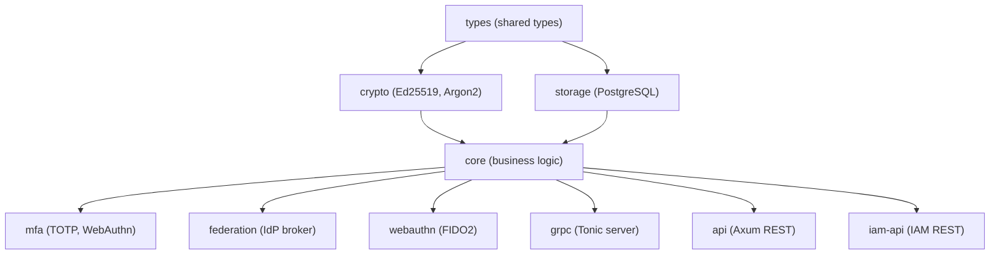

# 🤖 AGENTS.md - Authenc

> **AI Agent Guide** for working with the Authentication & Authorization Service.
> Menginduk ke `layanan/AGENTS.md` dan root `AGENTS.md`.

## 🌍 Service Context

**Authenc** adalah Enterprise-grade Identity Provider (IdP) dan Authorization Server untuk SIMPEL, dikembangkan oleh Cipherce. Menyediakan:

- **Multi-Protocol Auth**: OIDC, SAML, JWT, OAuth2 (PAR, Token Exchange RFC 8693)
- **MFA**: TOTP, SMS, Email, WebAuthn/FIDO2
- **Authorization**: RBAC/ABAC, UMA 2.0, Dynamic Client Registration
- **Enterprise**: SSO/Federation, OID4VC, Realm Management, Satker Hierarchy, Admin Console
- **Security**: Argon2 hashing, Ed25519 signing, Brute Force Protection, AI-Resistant CAPTCHA
- **Compliance**: Zero-trust, FIPS 140-2, GDPR-aligned, Government standards

## 🔑 Tech Stack

| Component | Technology | Version |
|-----------|------------|---------|
| Language | Rust | Edition 2024, MSRV 1.90+ |
| Web Framework | Axum | 0.8.x |
| Database | PostgreSQL | tokio-postgres + deadpool + refinery |
| Cryptography | Ed25519, X25519, ChaCha20-Poly1305 | jsonwebtoken, argon2 |
| gRPC | Tonic + Prost | 0.14.x |
| Metrics | OpenTelemetry, Prometheus | 0.31+ |
| Admin UI | Leptos | 0.8.x (feature: admin_console) |
| Post-Quantum | pqcrypto-mldsa, mlkem, falcon | Optional |

### Feature Flags

```toml
[features]
default = ["axum", "grpc", "auth", "oidc", "db", "metrics"]
axum = ["dep:axum", "dep:tower", "dep:tower-http"]
grpc = ["dep:tonic", "dep:tonic-prost", "dep:prost", "dep:prost-types"]
auth = ["dep:jsonwebtoken", "dep:argon2"]
oidc = ["auth"]
db = ["dep:tokio-postgres", "dep:deadpool-postgres"]
metrics = ["dep:opentelemetry", "dep:opentelemetry-otlp", "dep:tracing-opentelemetry"]
rdkafka = ["dep:rdkafka"]
admin_console = ["dep:leptos"]
quantum = ["dep:pqcrypto-mldsa", "dep:pqcrypto-mlkem", "dep:pqcrypto-falcon"]
```

### Authentication Method Status

| Method | Status | Notes |
|--------|--------|-------|
| Password (`POST /api/v1/auth/login`) | ✅ Production | Argon2 hashing, lockout via captcha |
| JWT bearer + refresh | ✅ Production | HS256 with rotation; `lib_core::jwt_claims::Claims` |
| WebAuthn / Passkeys | ✅ Production | `crates/webauthn` — primary 2FA |
| MFA TOTP + backup codes | ✅ Production (Phase 1.3) | Backed by `services::LocalMfaApi` + Postgres stores (migration 049). TOTP secrets are base32 plaintext — encryption-at-rest is a follow-up. |
| OAuth2 Authorization Code + PKCE | ✅ Production | Standard authz code with optional PKCE |
| Dynamic Client Registration (DCR) | ✅ Production | RFC 7591 |
| Device Authorization Grant | 🔴 Deferred | Handler skeleton only |
| SAML 2.0 federation | 🔴 Deferred | No demand yet |
| Social login (Google, etc.) | 🔴 Deferred | Identity Providers crate exists; surface UI not wired |

## 🏗️ Architecture

Authenc menggunakan arsitektur **multi-crate** di bawah workspace utama:

```
layanan/authenc/
├── Cargo.toml              # Package manifest (part of root workspace)
├── build.rs                # Proto compilation
├── crates/                 # 10 sub-crates
│   ├── api/                # Axum HTTP server (REST endpoints, handlers, middleware)
│   ├── core/               # Business logic (services, stores, risk engine)
│   ├── crypto/             # Cryptographic operations (Ed25519, Argon2, FIPS)
│   ├── federation/         # IdP federation & identity brokering
│   ├── grpc/               # Tonic gRPC server (auth_service, captcha, health)
│   ├── iam-api/            # IAM REST API (users, roles, realms, clients)
│   ├── mfa/                # MFA subsystem (TOTP, WebAuthn, SMS, Email)
│   ├── storage/            # Storage backends (PostgreSQL operations, migrations)
│   ├── types/              # Shared types & error definitions
│   └── webauthn/           # WebAuthn/FIDO2 implementation
├── migrations/             # SQL migrations (refinery)
└── proto/                  # gRPC proto files
    ├── authenc.proto        # Main auth service
    ├── common.proto         # Shared types
    └── secreton.proto       # Secreton client proto
```

> ⚠️ **PENTING**: Authenc BUKAN flat `src/` project. Ini adalah multi-crate workspace. Jangan buat file baru di `src/` — gunakan crate yang tepat di `crates/`.

### Crate Dependency Flow



---

## 📏 Critical Conventions

### 1. Configuration

- Config hierarchy: `AppConfig` → sub-configs (`ServerConfig`, `DatabaseConfig`, `RateLimitConfig`, dll)
- Environment variables untuk local dev, Secreton gRPC untuk production secrets
- Key env vars: `AUTHENC_HOST`, `AUTHENC_PORT`, `AUTHENC_GRPC_PORT`, `DATABASE_URL`, `SECRETON_GRPC_URL`

### 2. Database

- **Pool**: `deadpool-postgres` (default pool_size=20); `Database::new` set
  `options=-c search_path=authenc,public` di tiap koneksi → query unqualified resolve
  ke schema `authenc`, fallback `public` (extension/fungsi bersama).
- **Schema `authenc` (bukan `public`)** di **shared `dbsimpelv2`** (bersama integrasi +
  perlengkapan; perlengkapan ber-FK ke `authenc.users`). Authenc **TIDAK** punya DB
  sendiri lagi — lihat `layanan/AGENTS.md` → Database Architecture.
- **Migrations**: baseline+seed via binari out-of-band **`authenc-migrate`**
  (`crates/api/src/bin/migrate.rs`) — `CREATE SCHEMA authenc` + `run_migrations`; app
  **tidak** self-migrate (replika tak balapan). File: `001_baseline.sql` (schema) +
  `002_seed.sql` (realm/roles/oauth2_clients + seed user). Pra-prod boleh squash.
- **Operations**: Prepared statements wajib, transaction handling untuk multi-step ops.
- **Peran: IAM MURNI** — identitas satker SoT = MySIMKARI via integrasi (read-model),
  RBAC authenc ber-FK `satker_code` (lihat #42 SSoT). BUKAN master data referensi.

### 3. Cryptography

- **Password hashing**: Argon2 (BUKAN bcrypt, BUKAN SHA-256)
- **JWT signing**: Ed25519 (BUKAN RSA)
- **Encryption**: ChaCha20-Poly1305 atau AES-256-GCM
- **Key storage**: Secreton gRPC (BUKAN environment variables)
- **Key rotation**: Automatic via `key_rotation.rs`

### 4. Authentication Flow

```
Browser → Portal MFE → REST API (layanan) → gRPC → Authenc
```

- Microfrontend DILARANG akses Authenc langsung
- JWT disimpan di `localStorage` key `auth_token`
- Token validation wajib di setiap request via gRPC `ValidateToken()`
- **MFA temp token (half-auth):** saat password benar tapi MFA wajib, login
  mengembalikan **JWT pendek (5 mnt) ber-claim `mfa_pending=true`** sebagai
  `temp_token` (bukan stub `mfa_<uuid>` lama yang tak bisa di-decode → MFA login
  dulu rusak). Token ini **HANYA** boleh dipakai untuk `/mfa/verify` +
  `/mfa/verify-recovery` (FE kirim via `Authorization: Bearer`). Helper
  `auth_helpers`: `generate_mfa_temp_token` (mint), `verify_mfa_pending_token`
  (REQUIRE claim). Endpoint terproteksi (`extract_user_from_token` dkk) **MENOLAK**
  token `mfa_pending` → tak bisa skip 2FA. Verify sukses → tukar jadi access+refresh penuh.
- **CAPTCHA enforced server-side (#49):** setelah `captcha_threshold` gagal
  (BruteForceProtector), `POST /api/v1/auth/login` WAJIB menyertakan `captcha_token`
  (= id challenge yang sudah di-solve via `POST /api/captcha/verify`). Login
  me-**redeem** challenge itu **single-use** (`consume_solved_captcha`, dihapus →
  tak bisa di-replay; freshness dibatasi `expires_at` ≤5 mnt). Token captcha
  cosmetic lama (tak tervalidasi) sudah dibuang. FE captcha widget (`lib-ui`)
  punya prop `reset` untuk menarik challenge baru tiap login gagal.

### 5. gRPC Service

- Proto files di `proto/authenc.proto`
- Service: `AuthService` (ValidateToken, CreateSession, RevokeToken, dll)
- mTLS wajib untuk semua komunikasi gRPC
- Canonical URL: `AUTHENC_GRPC_URL`

---

<!-- BATAS TRUNCATION: Konten di bawah baris ini adalah referensi detail. -->
<!-- AI agents boleh berhenti membaca di sini jika context window terbatas. -->

## ⚠️ Common Pitfalls

### ❌ DON'T

1. **Store passwords in plaintext** → Use `hash_password()` (Argon2)
2. **Use short-lived refresh tokens** → `JWT_REFRESH_TOKEN_TTL=604800` (7 days)
3. **Skip token validation** → Always `validate_jwt_token(token).await?`
4. **Hard-code signing keys** → Load from Secreton
5. **Allow unlimited login attempts** → Use rate limiting middleware

### ✅ DO

1. Use Argon2 for password hashing
2. Validate all JWT tokens (signature, expiry, issuer)
3. Implement rate limiting on login endpoints
4. Store keys in Secreton, not environment variables
5. Use prepared statements to prevent SQL injection
6. Log all authentication events to audit log
7. Require MFA for admin accounts
8. Validate redirect URIs strictly in OAuth2
9. Use Ed25519 for JWT signing (not RSA)
10. Use HTTPS/mTLS for all communication

## 🔍 Troubleshooting

### JWT Validation Fails

- Check signing key: `secreton-cli get jwt_signing_key`
- Verify token issuer: `jwt decode $TOKEN | jq .iss`
- Check key rotation: `SELECT * FROM signing_keys WHERE is_active = true;`

### Database Connection Pool Exhausted

- Increase pool size: `DATABASE_POOL_SIZE=50`
- Use transactions properly to release connections

### MFA TOTP Not Working

- Check server time sync: `timedatectl status`
- Verify TOTP secret encoding (base32)

## 📋 Common Tasks

### 1. Wire a new MFA method (alongside TOTP)

TOTP + backup codes are live (Phase 1.3). The REST adapter at
`crates/api/src/services/mfa_api.rs::LocalMfaApi` implements
`MfaApiService` by composing `authenc_mfa::TotpService` and
`BackupCodesService`. To add a second method (WebAuthn step-up, SMS
OTP, etc.):

1. **Trait** — extend `crates/api/src/handlers/mfa.rs::MfaApiService`
   with the new methods (`setup_<method>`, `verify_<method>`, etc.).
2. **Adapter** — implement them on `LocalMfaApi`. Add new stores in
   `services::mfa_store` if you need persistent state. For shared
   state with TOTP (failed-attempt counters, lockout) use the existing
   `users.mfa_*` columns from migration `021_mfa_fields.sql`.
3. **Routes** — register handlers in `crates/api/src/router.rs`. Keep
   verb conventions consistent: `POST .../setup`, `POST .../verify`,
   `DELETE .../disable`.
4. **Frontend** — Portal already polls `GET /api/v1/auth/mfa/status`;
   surface the new method as an additional card on the MFA setup page.
5. **gRPC** — if backend services should be able to verify this method
   over gRPC, mirror the change into `crates/grpc/src/mfa_facade.rs`.

### 2. Add a new claim to `ValidateTokenResponse`

When perlengkapan (or any downstream backend) needs a new piece of
identity info inside JWTs:

1. **Proto** — add the field to
   `proto/authenc.proto::ValidateTokenResponse`. Use the next free
   field number; never reuse a deleted one.
2. **Issuer** — populate it in `crates/core/src/services/token/`
   wherever the JWT is minted, sourcing from the canonical column on
   `authenc.users`.
3. **gRPC service** — populate it in
   `crates/grpc/src/service.rs::validate_token` and in the
   `AuthencClient::dummy()` shim in
   `layanan/perlengkapan/src/shared/grpc/clients.rs` so dev builds
   without authenc still type-check.
4. **Consumer** — surface it on `lib_core::jwt_claims::Claims` if any
   MFE needs it, then thread through the storage listener so the
   `UserSession` projection stays current.
5. **Tests** — proto fields default to "0" / empty string when missing,
   so add a migration test that asserts existing clients don't break.

### 3. Add or rotate a JWT signing key

`AUTHENC_JWT_SECRET` is loaded from Secreton on boot. Rotation:

1. Generate a new 32-byte key (`openssl rand -hex 32`).
2. Update `kv/authenc/jwt` in Secreton; restart pods so the env
   re-reads. **Existing tokens stay valid until expiry** — clients
   re-authenticate naturally; no big-bang invalidation required.
3. If you must invalidate everyone (compromise), rotate then drop the
   sessions table to force re-login.

## 📚 Key Files Reference

| Crate | Key File | Purpose |
|-------|----------|---------|
| `storage` | `src/operations/users_ops.rs` | User CRUD |
| `api` | `src/handlers/oauth2.rs` | OAuth2 endpoints |
| `core` | `src/services/token/` | JWT generation/validation |
| `grpc` | `src/authenc_service.rs` | gRPC authentication service |
| `mfa` | `src/totp.rs` | TOTP implementation |
| `types` | `src/error.rs` | Error type definitions |
| `crypto` | `src/signing.rs` | Ed25519 signing |

---

## 🔐 Secret Fetching (Zero-Trust)

Saat `secretonAuth.enabled=true` di Helm values:

- Pod `authenc` punya volume projected `serviceAccountToken` di `/var/run/secrets/tokens/secreton-token` (audience `secreton`, TTL 3600s).
- Module `secreton-agent` (di `layanan/secreton/crates/agent/src/auth/kubernetes.rs`) handle login: read SA JWT → `POST /v1/auth/kubernetes/login` → terima Secreton client token → auto-renew background task setiap 30 menit.
- **Path policy yang boleh diakses** (sesuai `secretonAuth.policies.authenc` di `infra/helm/simpel/values.yaml`):
  - `kv/data/authenc/*` — JWT signing keys (Ed25519 private), session encryption keys, SMTP password, OAuth2 client secrets.
  - `kv/data/postgres/authenc` — DATABASE_URL credential.
  - `transit/encrypt|decrypt/authenc-key` — envelope encryption untuk data at-rest.
- **Env yang di-inject otomatis oleh `_workload.tpl`** (jangan set manual):
  - `SECRETON_ADDR`, `SECRETON_AUTH_METHOD=kubernetes`, `SECRETON_AUTH_ROLE=authenc`, `SECRETON_K8S_TOKEN_PATH=/var/run/secrets/tokens/secreton-token`.
- **DILARANG**: pakai `SECRETON_TOKEN` env di production. Token statis hanya untuk dev lokal (docker-compose).

---

**Last Updated:** April 23, 2026
**Maintainer:** SIMPEL Team
**Related:** `/AGENTS.md`, `layanan/AGENTS.md`
