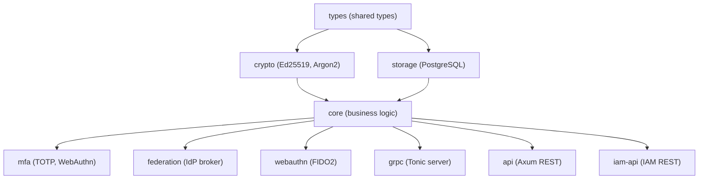

# 🤖 AGENTS.md - Authenc

> **AI Agent Guide** for working with the Authentication & Authorization Service.
> Menginduk ke `layanan/AGENTS.md` dan root `AGENTS.md`.

## 🌍 Service Context

**Authenc** adalah Enterprise-grade Identity Provider (IdP) dan Authorization Server untuk SIMPEL, dikembangkan oleh Cipherce. Menyediakan:

- **Multi-Protocol Auth**: OIDC, SAML, JWT, OAuth2 (PAR, Token Exchange RFC 8693)
- **MFA**: TOTP, SMS, Email, WebAuthn/FIDO2
- **Authorization**: RBAC/ABAC, UMA 2.0, Dynamic Client Registration
- **Enterprise**: SSO/Federation, OID4VC, Realm Management, Satker Hierarchy, Admin Console
- **Security**: Argon2 hashing, Ed25519 signing, Brute Force Protection, AI-Resistant CAPTCHA
- **Compliance**: Zero-trust, FIPS 140-2, GDPR-aligned, Government standards

## 🔑 Tech Stack

| Component | Technology | Version |
|-----------|------------|---------|
| Language | Rust | Edition 2024, MSRV 1.90+ |
| Web Framework | Axum | 0.8.x |
| Database | PostgreSQL | tokio-postgres + deadpool + refinery |
| Cryptography | Ed25519, X25519, ChaCha20-Poly1305 | jsonwebtoken, argon2 |
| gRPC | Tonic + Prost | 0.14.x |
| Metrics | OpenTelemetry, Prometheus | 0.31+ |
| Admin UI | Leptos | 0.8.x (feature: admin_console) |
| Post-Quantum | pqcrypto-mldsa, mlkem, falcon | Optional |

### Feature Flags
```toml
[features]
default = ["axum", "grpc", "auth", "oidc", "db", "metrics"]
axum = ["dep:axum", "dep:tower", "dep:tower-http"]
grpc = ["dep:tonic", "dep:tonic-prost", "dep:prost", "dep:prost-types"]
auth = ["dep:jsonwebtoken", "dep:argon2"]
oidc = ["auth"]
db = ["dep:tokio-postgres", "dep:deadpool-postgres"]
metrics = ["dep:opentelemetry", "dep:opentelemetry-otlp", "dep:tracing-opentelemetry"]
rdkafka = ["dep:rdkafka"]
admin_console = ["dep:leptos"]
quantum = ["dep:pqcrypto-mldsa", "dep:pqcrypto-mlkem", "dep:pqcrypto-falcon"]
```

## 🏗️ Architecture

Authenc menggunakan arsitektur **multi-crate** di bawah workspace utama:

```
layanan/authenc/
├── Cargo.toml              # Package manifest (part of root workspace)
├── build.rs                # Proto compilation
├── crates/                 # 10 sub-crates
│   ├── api/                # Axum HTTP server (REST endpoints, handlers, middleware)
│   ├── core/               # Business logic (services, stores, risk engine)
│   ├── crypto/             # Cryptographic operations (Ed25519, Argon2, FIPS)
│   ├── federation/         # IdP federation & identity brokering
│   ├── grpc/               # Tonic gRPC server (auth_service, captcha, health)
│   ├── iam-api/            # IAM REST API (users, roles, realms, clients)
│   ├── mfa/                # MFA subsystem (TOTP, WebAuthn, SMS, Email)
│   ├── storage/            # Storage backends (PostgreSQL operations, migrations)
│   ├── types/              # Shared types & error definitions
│   └── webauthn/           # WebAuthn/FIDO2 implementation
├── migrations/             # SQL migrations (refinery)
└── proto/                  # gRPC proto files
    ├── authenc.proto        # Main auth service
    ├── common.proto         # Shared types
    └── secreton.proto       # Secreton client proto
```

> ⚠️ **PENTING**: Authenc BUKAN flat `src/` project. Ini adalah multi-crate workspace. Jangan buat file baru di `src/` — gunakan crate yang tepat di `crates/`.

### Crate Dependency Flow



---

## 📏 Critical Conventions

### 1. Configuration
- Config hierarchy: `AppConfig` → sub-configs (`ServerConfig`, `DatabaseConfig`, `RateLimitConfig`, dll)
- Environment variables untuk local dev, Secreton gRPC untuk production secrets
- Key env vars: `AUTHENC_HOST`, `AUTHENC_PORT`, `AUTHENC_GRPC_PORT`, `DATABASE_URL`, `SECRETON_GRPC_URL`

### 2. Database
- **Pool**: `deadpool-postgres` (default pool_size=20)
- **Migrations**: `refinery` (SQL files di `migrations/`)
- **Operations**: Prepared statements wajib, transaction handling untuk multi-step ops
- **Terpisah**: Authenc memiliki database sendiri (bukan shared dengan layanan lain)

### 3. Cryptography
- **Password hashing**: Argon2 (BUKAN bcrypt, BUKAN SHA-256)
- **JWT signing**: Ed25519 (BUKAN RSA)
- **Encryption**: ChaCha20-Poly1305 atau AES-256-GCM
- **Key storage**: Secreton gRPC (BUKAN environment variables)
- **Key rotation**: Automatic via `key_rotation.rs`

### 4. Authentication Flow
```
Browser → Portal MFE → REST API (layanan) → gRPC → Authenc
```
- Microfrontend DILARANG akses Authenc langsung
- JWT disimpan di `localStorage` key `auth_token`
- Token validation wajib di setiap request via gRPC `ValidateToken()`

### 5. gRPC Service
- Proto files di `proto/authenc.proto`
- Service: `AuthService` (ValidateToken, CreateSession, RevokeToken, dll)
- mTLS wajib untuk semua komunikasi gRPC
- Canonical URL: `AUTHENC_GRPC_URL`

---

<!-- BATAS TRUNCATION: Konten di bawah baris ini adalah referensi detail. -->
<!-- AI agents boleh berhenti membaca di sini jika context window terbatas. -->

## ⚠️ Common Pitfalls

### ❌ DON'T
1. **Store passwords in plaintext** → Use `hash_password()` (Argon2)
2. **Use short-lived refresh tokens** → `JWT_REFRESH_TOKEN_TTL=604800` (7 days)
3. **Skip token validation** → Always `validate_jwt_token(token).await?`
4. **Hard-code signing keys** → Load from Secreton
5. **Allow unlimited login attempts** → Use rate limiting middleware

### ✅ DO
1. Use Argon2 for password hashing
2. Validate all JWT tokens (signature, expiry, issuer)
3. Implement rate limiting on login endpoints
4. Store keys in Secreton, not environment variables
5. Use prepared statements to prevent SQL injection
6. Log all authentication events to audit log
7. Require MFA for admin accounts
8. Validate redirect URIs strictly in OAuth2
9. Use Ed25519 for JWT signing (not RSA)
10. Use HTTPS/mTLS for all communication

## 🔍 Troubleshooting

### JWT Validation Fails
- Check signing key: `secreton-cli get jwt_signing_key`
- Verify token issuer: `jwt decode $TOKEN | jq .iss`
- Check key rotation: `SELECT * FROM signing_keys WHERE is_active = true;`

### Database Connection Pool Exhausted
- Increase pool size: `DATABASE_POOL_SIZE=50`
- Use transactions properly to release connections

### MFA TOTP Not Working
- Check server time sync: `timedatectl status`
- Verify TOTP secret encoding (base32)

## 📚 Key Files Reference

| Crate | Key File | Purpose |
|-------|----------|---------|
| `storage` | `src/operations/users_ops.rs` | User CRUD |
| `api` | `src/handlers/oauth2.rs` | OAuth2 endpoints |
| `core` | `src/services/token/` | JWT generation/validation |
| `grpc` | `src/authenc_service.rs` | gRPC authentication service |
| `mfa` | `src/totp.rs` | TOTP implementation |
| `types` | `src/error.rs` | Error type definitions |
| `crypto` | `src/signing.rs` | Ed25519 signing |

---

**Last Updated:** April 23, 2026
**Maintainer:** SIMPEL Team
**Related:** `/AGENTS.md`, `layanan/AGENTS.md`
