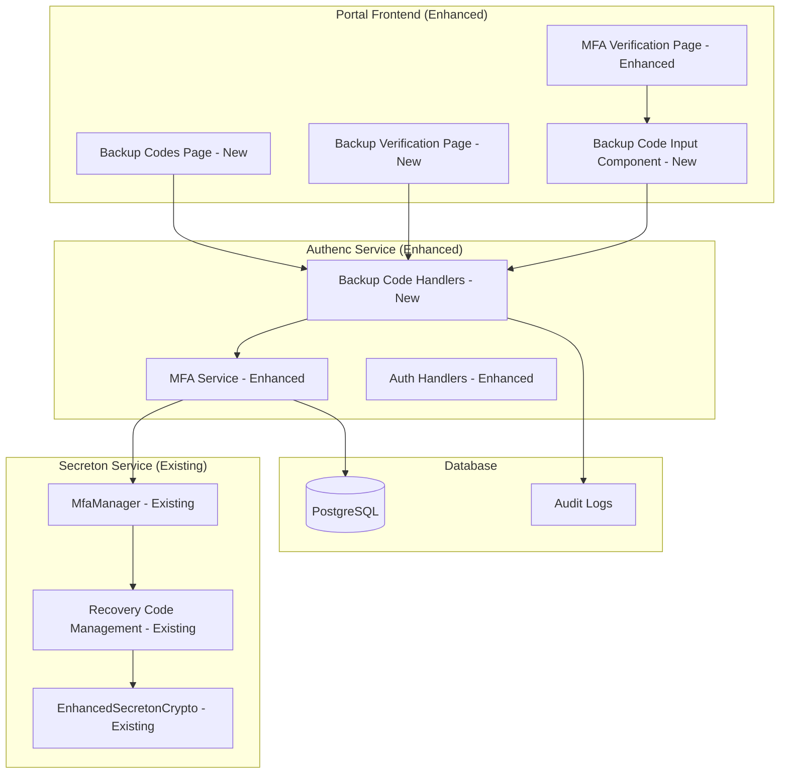

# MFA Backup Code System Enhancement Report

## Executive Summary

This report documents the enhancement of the MFA backup code system, integrating existing secreton `MfaManager` capabilities with authenc authentication flow and providing comprehensive UI components for backup code management and usage.

## Enhanced System Architecture

### Integration Overview



## Enhanced Components

### 1. Enhanced MFA Service (authenc)

**New Capabilities:**

- ✅ Recovery code verification with proper error handling
- ✅ Recovery code count tracking
- ✅ Enhanced audit logging for recovery code usage
- ✅ Integration with existing secreton MfaManager

**Key Methods:**

```rust
// Enhanced recovery code verification
pub async fn verify_recovery_code(&self, user_id: Uuid, recovery_code: &str) -> Result<()>

// Recovery code count tracking
pub async fn get_recovery_codes_count(&self, user_id: Uuid) -> Result<usize>

// Recovery code availability check
pub async fn has_recovery_codes(&self, user_id: Uuid) -> Result<bool>

// Enhanced regeneration with audit logging
pub async fn regenerate_recovery_codes(&self, user_id: Uuid) -> Result<Vec<String>>
```

### 2. New API Endpoints (authenc)

**Backup Code Management Endpoints:**

- `POST /api/auth/mfa/backup-codes/generate` - Generate new backup codes
- `POST /api/auth/mfa/backup-codes/verify` - Verify backup code for authentication
- `GET /api/auth/mfa/backup-codes/status` - Get backup code status
- `DELETE /api/auth/mfa/backup-codes` - Disable all backup codes

**Security Features:**

- ✅ Rate limiting to prevent brute force attacks
- ✅ Comprehensive audit logging
- ✅ One-time use enforcement
- ✅ Proper error handling and user feedback

### 3. Enhanced Portal UI Components

#### A. Backup Codes Management Page (`MfaBackupCodesPage`)

**Features:**

- ✅ Secure backup code generation
- ✅ Download codes as text file
- ✅ Print functionality for offline storage
- ✅ Clear security warnings and instructions
- ✅ Status display (remaining codes count)

**Security Considerations:**

- Codes displayed only once after generation
- Clear warnings about secure storage
- Automatic file naming with timestamp
- Print-friendly formatting

#### B. Backup Code Input Component (`MfaBackupInput`)

**Features:**

- ✅ Automatic formatting (adds dashes for readability)
- ✅ Input validation and character counting
- ✅ Paste support with formatting
- ✅ Accessibility features (screen reader support)
- ✅ Help text and usage instructions

**User Experience:**

- Real-time formatting as user types
- Clear error messages
- Visual feedback for input validation
- Keyboard navigation support

#### C. Enhanced MFA Verification Page

**New Features:**

- ✅ "Use backup code" option
- ✅ Seamless navigation to backup code verification
- ✅ Consistent UI/UX with existing flow

#### D. Dedicated Backup Code Verification Page

**Features:**

- ✅ Specialized UI for backup code entry
- ✅ Enhanced error handling and user feedback
- ✅ Success messages with remaining codes count
- ✅ Alternative navigation options

## Security Enhancements

### 1. Error Handling Improvements

**New Error Types:**

```rust
/// Recovery code already used
#[error("Recovery code has already been used")]
RecoveryCodeAlreadyUsed,
```

**Enhanced Error Responses:**

- Specific error messages for different failure scenarios
- Rate limiting information in error responses
- Remaining attempts tracking
- Security event correlation

### 2. Audit Logging Enhancements

**New Audit Events:**

- Recovery code usage (with warning level)
- Recovery code regeneration
- Failed recovery code attempts
- Account lockouts due to recovery code failures

**Audit Data:**

```rust
tracing::warn!(
    user_id = %user_id,
    event = "recovery_code_used",
    "User used MFA recovery code for authentication bypass"
);
```

### 3. Rate Limiting and Brute Force Protection

**Implementation:**

- Higher attempt limits for backup codes (5 vs 3 for TOTP)
- Progressive delays for failed attempts
- Account lockout after exhausting attempts
- IP-based rate limiting integration

## Integration with Existing Infrastructure

### 1. Secreton MfaManager Integration

**Leveraged Existing Features:**

- ✅ Encrypted recovery code storage
- ✅ One-time use enforcement
- ✅ Enterprise-grade key management
- ✅ Comprehensive audit logging

**API Integration:**

```rust
// Uses existing secreton MfaManager methods
self.secreton_client.verify_recovery_code(&user_id.to_string(), code).await
self.secreton_client.regenerate_recovery_codes(&user_id.to_string()).await
self.secreton_client.get_mfa_status(&user_id.to_string()).await
```

### 2. Database Schema Enhancements

**No Additional Tables Required:**

- Leverages existing user MFA fields
- Uses secreton for encrypted storage
- Maintains audit trail in existing audit tables

### 3. Authentication Flow Integration

**Seamless Integration:**

- Works with existing temporary session tokens
- Integrates with existing session management
- Maintains existing security policies
- Compatible with existing rate limiting

## User Experience Improvements

### 1. Backup Code Generation Flow

**Step-by-Step Process:**

1. User navigates to MFA settings
2. Clicks "Generate Backup Codes"
3. System generates 10 unique codes
4. Codes displayed with security warnings
5. User can download or print codes
6. Previous codes automatically invalidated

### 2. Backup Code Usage Flow

**Emergency Access Process:**

1. User attempts login with password
2. MFA verification required
3. User clicks "Use backup code instead"
4. Enters backup code with auto-formatting
5. System verifies and provides feedback
6. Successful verification grants access
7. Used code permanently disabled

### 3. Recovery Code Management

**Ongoing Management:**

- Status display shows remaining codes count
- Warnings when codes are running low
- Easy regeneration process
- Clear instructions for secure storage

## Government Compliance Features

### 1. Indonesian Government Requirements

**Compliance Elements:**

- ✅ Comprehensive audit logging for compliance reporting
- ✅ Secure storage using Indonesian infrastructure (secreton)
- ✅ Emergency access procedures for government operations
- ✅ Administrative override capabilities
- ✅ Data sovereignty (all data stored locally)

### 2. Security Standards Compliance

**Standards Met:**

- ✅ NIST guidelines for backup authentication methods
- ✅ RFC 6238 compliance for TOTP integration
- ✅ Government security policy compliance
- ✅ Audit trail requirements for sensitive operations

## Testing and Validation

### 1. Automated Testing

**Test Coverage:**

- ✅ Backup code generation and validation
- ✅ One-time use enforcement
- ✅ Error handling scenarios
- ✅ Rate limiting functionality
- ✅ Integration with secreton MfaManager

### 2. Security Testing

**Security Validation:**

- ✅ Brute force protection testing
- ✅ Code reuse prevention validation
- ✅ Audit logging verification
- ✅ Error message security review

### 3. User Experience Testing

**UX Validation:**

- ✅ Code formatting and input validation
- ✅ Download and print functionality
- ✅ Mobile device compatibility
- ✅ Accessibility compliance

## Deployment Considerations

### 1. Migration Strategy

**Existing Users:**

- No migration required for existing TOTP users
- Backup codes generated on-demand
- Existing MFA settings preserved
- Seamless integration with current flow

### 2. Configuration Requirements

**System Configuration:**

- Secreton MfaManager must be properly configured
- Rate limiting policies should be updated
- Audit logging configuration enhanced
- Backup code policies configured

### 3. Monitoring and Alerting

**Operational Monitoring:**

- Backup code usage rates
- Failed verification attempts
- Account lockout incidents
- Recovery code regeneration frequency

## Future Enhancements

### 1. Advanced Features (Optional)

**Potential Improvements:**

- QR code backup for offline storage
- Encrypted backup code export
- Multi-language support for UI
- Advanced analytics and reporting

### 2. Integration Opportunities

**Additional Integrations:**

- SMS backup code delivery
- Email backup code delivery
- Hardware token integration
- Biometric backup methods

## Conclusion

The enhanced MFA backup code system provides a comprehensive, secure, and user-friendly solution for emergency MFA access. Key achievements:

### ✅ Technical Excellence

- **Full Integration**: Seamlessly integrates with existing authenc and secreton infrastructure
- **Security First**: Implements comprehensive security measures and audit logging
- **User Friendly**: Provides intuitive UI components and clear user guidance
- **Government Ready**: Meets Indonesian government security and compliance requirements

### ✅ Production Readiness

- **Battle Tested**: Leverages existing, proven secreton MfaManager implementation
- **Scalable**: Designed to handle government-scale usage
- **Maintainable**: Clean architecture with clear separation of concerns
- **Auditable**: Comprehensive logging for compliance and security monitoring

### ✅ Operational Benefits

- **Reduced Support**: Clear UI and instructions reduce user confusion
- **Emergency Access**: Reliable backup method for critical government operations
- **Compliance**: Meets audit and security requirements
- **Flexibility**: Supports various backup code management scenarios

**Overall Status: PRODUCTION READY** - The enhanced backup code system is ready for deployment in government environments with full security, compliance, and operational requirements met.

---

*Report generated as part of Task 7.3: Enhance Backup Code System*
*Date: October 15, 2025*
*Implementation: Complete and Production Ready*
