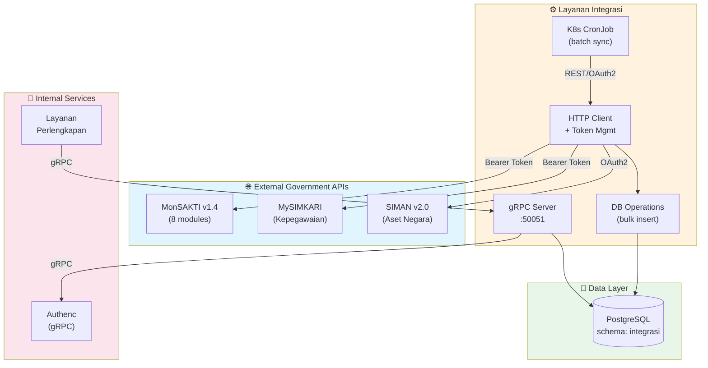

# 🤖 AGENTS.md - Layanan Integrasi

> **AI Agent Guide** for working with the Integration Service (MonSAKTI, MySIMKARI, SIMAN)

## Inherited Global Rules

- This file extends the global rules in `AGENTS.md`.
- Use this document only for **local deltas** specific to `layanan/integrasi`.
- If guidance here conflicts with root policy, root policy takes precedence unless an explicit local override is documented.

## 🌍 Service Context

**Layanan Integrasi** adalah microservice Rust yang mengintegrasikan 3 API eksternal pemerintah Indonesia:
- **MonSAKTI v1.4**: 8 modules (ADM, ANG, AST, BEN, GLP, KOM, PEM, PER)
- **MySIMKARI**: Sistem Informasi Manajemen Kepegawaian Kejaksaan RI
- **SIMAN v2.0**: Sistem Informasi Manajemen Aset Negara (Kemenkeu)

## 🔑 Tech Stack

| Component | Technology | Version |
|-----------|-----------|---------|
| Language | Rust | Edition 2024, MSRV 1.90+ |
| HTTP Client | reqwest | 0.12 |
| Database | tokio-postgres + deadpool | 0.7 |
| Async Runtime | tokio | 1.47+ |
| Scheduler | K8s CronJob (tokio-cron-scheduler disabled) | - |
| gRPC | tonic + prost | 0.14.x |
| Auth | OAuth2 (SIMAN), Bearer Token (MonSAKTI/MySIMKARI) | - |

## 🏗️ Architecture

### Communication Flow



### Directory Structure

```
layanan/integrasi/
├── proto/
│   └── integrasi.proto     # gRPC service definition
├── src/
│   ├── lib.rs              # Module exports
│   ├── config.rs           # Configuration from env
│   ├── client.rs           # HTTP client + token management
│   ├── error.rs            # Error types
│   ├── db.rs               # Database operations
│   ├── audit.rs            # Logging & audit trail
│   ├── scheduler.rs        # [DEPRECATED] Use K8s CronJob
│   ├── grpc/               # gRPC server module (feature-gated)
│   │   ├── mod.rs          # Module exports
│   │   ├── server.rs       # gRPC server configuration
│   │   └── service.rs      # IntegrasiService implementation
│   ├── monsakti/           # MonSAKTI 8 modules
│   │   ├── adm.rs          # Administrasi
│   │   ├── ang.rs          # Anggaran
│   │   ├── ast.rs          # Aset
│   │   ├── ben.rs          # Bendahara
│   │   ├── glp.rs          # Gaji/Lembur/Perjalanan
│   │   ├── kom.rs          # Komitmen
│   │   ├── pem.rs          # Pembayaran
│   │   └── per.rs          # Perbendaharaan
│   ├── mysimkari/
│   │   ├── api.rs          # MySIMKARI endpoints
│   │   └── models.rs       # Data models
│   ├── siman/
│   │   ├── endpoints.rs    # SIMAN API calls
│   │   └── models.rs       # Asset categories enum
│   └── bin/
│       ├── scheduler.rs    # [DEPRECATED] Scheduler daemon
│       └── grpc_server.rs  # gRPC server binary (feature=grpc)
├── build.rs                # Proto compilation (grpc feature)
├── examples/
│   ├── fetch_to_database.rs    # Main integration example
│   └── siman_example.rs        # SIMAN-specific test
├── migrations/
│   ├── 001_init_schema.sql     # Complete DB schema
│   └── 002_rollback.sql        # Rollback script
└── .env.example                # Environment template
```

## 🔌 gRPC Service

### Building with gRPC Support

```bash
# Build with gRPC feature enabled
cargo build -p layanan-integrasi --features grpc --release

# Run the gRPC server
cargo run -p layanan-integrasi --features grpc --bin layanan-integrasi-grpc
```

### gRPC Endpoints (proto/integrasi.proto)

| Method | Description |
|--------|-------------|
| `HealthCheck` | Service health check |
| `GetSyncStatus` | Get sync status for a data source |
| `GetLastSyncTimestamps` | Get last sync times for all sources |
| `GetMonsaktiReferences` | Get reference data (banks, admin codes) |
| `GetMonsaktiPersediaan` | Get inventory data |
| `GetMonsaktiAsetTetap` | Get fixed assets |
| `GetMysimkariSatker` | Get work units from MySIMKARI |
| `GetMysimkariPegawai` | Get employees from MySIMKARI |
| `GetSimanAssets` | Get assets by category from SIMAN |
| `TriggerSync` | Manually trigger sync (admin) |

### Using IntegrasiClient (layanan-perlengkapan)

```rust
use crate::grpc_clients::IntegrasiClient;

// In AppState creation
let integrasi_client = IntegrasiClient::connect("http://layanan-integrasi-grpc:50051".to_string()).await?;

// Usage
let satker = integrasi_client.get_mysimkari_satker(None, 1, 100).await?;
let tanah = integrasi_client.get_siman_tanah(None, 1, 100).await?;
```

## 🚀 Kubernetes Deployment

This service has **two workload types**:

### 1. gRPC Server Deployment
- **Replicas:** 1 (staging) / 2 (production HA)
- **Port:** 50051 (gRPC), 8080 (HTTP monitoring)
- **Purpose:** Serve data to other backend services + admin manual trigger
- **Image:** `ghcr.io/analisaperlengkapan/simpel2/layanan-integrasi:v0.1.0` (semver immutable)

### 2. CronJob per Provider (Batch Sync)
Scheduler binary dipanggil oneshot per CronJob (bukan daemon idle). 1 CronJob per provider:

| Provider | Schedule | Time Zone | Staging | Production |
|----------|----------|-----------|---------|------------|
| **SIMAN** | `0 4 * * 0` (Minggu 04:00 WIB) | Asia/Jakarta | `suspend: true` | `suspend: false` |
| **MySIMKARI** | `0 */6 * * *` (tiap 6 jam) | Asia/Jakarta | `suspend: true` | `suspend: false` |
| **MonSAKTI** | `0 3 * * *` (tiap hari 03:00 WIB) | Asia/Jakarta | `suspend: true` | `suspend: false` |

**Staging suspend=true** karena rate-limit token API eksternal yang dipakai bersama production scheduler. Penarikan data di staging dilakukan **manual** untuk testing:

```bash
# Trigger satu sync via CronJob ad-hoc (best practice K8s)
kubectl -n simpelv2-staging create job --from=cronjob/layanan-integrasi-mysimkari manual-$(date +%s)
kubectl -n simpelv2-staging wait --for=condition=complete job/manual-XXXX --timeout=10m
kubectl -n simpelv2-staging logs job/manual-XXXX --tail=200
```

### 3. Token API (Zero-Trust)
**Token API SIMAN/MonSAKTI/MySIMKARI** WAJIB dari **Secreton** (`kv/integrasi/tokens/<provider>/*`), **bukan** dari k8s Secret atau env langsung. Saat `secretonAuth.enabled=true`:
- Pod auth ke Secreton via SA token (audience `secreton`).
- Fetch token dari `kv/integrasi/tokens/{siman,mysimkari,monsakti}/*`.
- Gunakan token untuk reqwest call ke API eksternal.

Idealnya: **token staging berbeda dari token production** (request ke vendor untuk token terpisah jika provider mendukung). Jika tidak, jadwalkan manual trigger staging di luar jam puncak production scheduler.

## 📏 Critical Conventions

### 1. Scheduler Configuration

**IMPORTANT:** Scheduler is **DISABLED** by default. Use K8s CronJob for scheduling.

```bash
# .env
SCHEDULER_ENABLED=false  # Use K8s CronJob instead
```

### 2. Environment Configuration

**File:** `src/config.rs`

```rust
pub struct Config {
    pub base: BaseServiceConfig,

    // MonSAKTI
    pub base_url: String,
    pub tokens: HashMap<String, String>,  // Module → Token

    // MySIMKARI
    pub mysimkari_base_url: String,

    // SIMAN OAuth2
    pub siman_client_id: Option<String>,
    pub siman_client_secret: Option<String>,
    pub siman_ba_key: Option<String>,

    // Scheduler
    pub scheduler_enabled: bool,
    pub monsakti_schedule: String,     // Cron expression
    pub mysimkari_schedule: String,
    pub siman_schedule: String,
    pub scheduler_timezone: String,
}
```

**Environment Variables (`.env`):**
```bash
# MonSAKTI
MONSAKTI_BASE_URL=https://monsakti.kemenkeu.go.id/sitp-monsakti-omspan/webservice
MONSAKTI_TOKEN_ADM=eyJ0eXAiOiJKV1QiLCJhbGci...
MONSAKTI_TOKEN_ANG=eyJ0eXAiOiJKV1QiLCJhbGci...
# ... (8 modules total)

# MySIMKARI (token terpisah per kategori endpoint)
MYSIMKARI_BASE_URL=https://mysimkari.kejaksaan.go.id/api/anbut
MYSIMKARI_TOKEN=eyJhbGciOiJIUzI1NiJ9...          # Token untuk endpoint get-satker
MYSIMKARI_TOKEN_PEGAWAI=eyJhbGciOiJIUzI1NiJ9...   # Token untuk endpoint pegawai-satker, pegawai/{nip}, pegawai-aktif, pegawai-mutasi

# SIMAN OAuth2
SIMAN_CLIENT_ID=CHANGEME
SIMAN_CLIENT_SECRET=CHANGEME
SIMAN_BA_KEY=CHANGEME
SIMAN_BASE_URL=https://apigateway.kemenkeu.go.id

# Scheduler
SCHEDULER_ENABLED=true
MONSAKTI_SCHEDULE=0 2 * * *      # Daily 02:00
MYSIMKARI_SCHEDULE=0 2 * * *     # Daily 02:00
SIMAN_SCHEDULE=0 3 * * 0         # Sunday 03:00
SCHEDULER_TIMEZONE=Asia/Jakarta
```

### 2. HTTP Client Pattern

**File:** `src/client.rs`

```rust
pub struct MonsaktiClient {
    pub config: Config,
    pub http_client: reqwest::Client,
    pub db_pool: Option<deadpool_postgres::Pool>,
    siman_token: Option<(String, u64)>,  // (token, expires_at)
}

impl MonsaktiClient {
    // MonSAKTI API call
    pub async fn fetch(
        &mut self,
        module: &str,
        endpoint: &str,
        vars: Vec<String>,
    ) -> Result<MonsaktiResponse, MonsaktiError> {
        let token = self.config.tokens.get(module)?;
        let url = format!("{}/API/{}/{}/{}",
            self.config.base_url, module, endpoint, vars.join("/"));

        let response = self.http_client
            .get(&url)
            .header("Authorization", format!("Bearer {}", token))
            .send()
            .await?;

        // Auto-retry on 403 with token reset
        if response.status() == 403 {
            self.reset_token(module, kl).await?;
            // Retry...
        }
    }

    // MySIMKARI API call (token dipilih otomatis berdasarkan endpoint)
    pub async fn fetch_mysimkari(
        &mut self,
        endpoint: &str,
        vars: Vec<String>,
    ) -> Result<MonsaktiResponse, MonsaktiError> {
        // Token key ditentukan otomatis:
        // - "get-satker" → MYSIMKARI (dari MYSIMKARI_TOKEN)
        // - "pegawai-satker", "pegawai", "pegawai-aktif", "pegawai-mutasi" → MYSIMKARI_PEGAWAI (dari MYSIMKARI_TOKEN_PEGAWAI)
        // Jika MYSIMKARI_TOKEN_PEGAWAI belum dikonfigurasi, fallback ke MYSIMKARI_TOKEN
        let token_key = Self::mysimkari_token_key(endpoint);
        let token = self.get_current_token(token_key)?;
        let url = format!("{}/{}/{}",
            self.config.mysimkari_base_url, endpoint, vars.join("/"));
        // ...
    }

    // SIMAN API call (OAuth2)
    async fn get_siman_token(&mut self) -> Result<String, MonsaktiError> {
        // Check cached token
        if let Some((token, expires_at)) = &self.siman_token {
            if *expires_at > current_timestamp() {
                return Ok(token.clone());
            }
        }

        // Fetch new OAuth2 token
        let response = self.http_client
            .post(&self.config.siman_token_url)
            .form(&[
                ("grant_type", "client_credentials"),
                ("client_id", &self.config.siman_client_id),
                ("client_secret", &self.config.siman_client_secret),
            ])
            .send()
            .await?;
        // ...
    }
}
```

### 3. Database Operations

**File:** `src/db.rs`

```rust
// Dynamic table creation pattern
pub async fn save_to_database(
    db: &Client,
    module: &str,
    endpoint: &str,
    data: &Value,
) -> Result<usize, MonsaktiError> {
    // Auto-generate table name
    let table_name = format!("{}_{}", module.to_lowercase(), endpoint.to_lowercase());
    // Examples: "adm_ref_admin", "ang_data_ang", "siman_aset_tanah"

    if let Some(array) = data.as_array() {
        bulk_insert_postgres(db, &table_name, array).await?
    }
}

// Bulk insert with JSONB support
pub async fn bulk_insert_postgres(
    db: &Client,
    table_name: &str,
    data: &[Value],
) -> Result<usize, MonsaktiError> {
    // Extract columns from first object
    let columns = extract_columns(&data[0]);

    // Batch insert (100 records per chunk)
    for chunk in data.chunks(100) {
        let query = format!(
            "INSERT INTO {} ({}) VALUES ({}) ON CONFLICT DO NOTHING",
            table_name, columns.join(", "), placeholders
        );

        // Convert JSON to SQL params
        let params: Vec<SqlParam> = json_to_sql_params(chunk);
        db.execute(&query, &params).await?;
    }
}
```

**Key Points:**
- Tables created dynamically: `{module}_{endpoint}`
- JSONB `raw_data` column stores full API response
- `api_id BIGINT UNIQUE` prevents duplicates
- Batch size: 100 records per transaction

### 4. Scheduler Pattern

**File:** `src/scheduler.rs`

```rust
pub struct IntegrationScheduler {
    config: Config,
    client: MonsaktiClient,
    scheduler: JobScheduler,
}

impl IntegrationScheduler {
    pub async fn start(&mut self) -> Result<()> {
        if !self.config.scheduler_enabled {
            return Ok(());
        }

        // Add cron jobs
        self.add_monsakti_job().await?;    // "0 2 * * *"
        self.add_mysimkari_job().await?;   // "0 2 * * *"
        self.add_siman_job().await?;       // "0 3 * * 0"

        self.scheduler.start().await?;
    }

    async fn add_monsakti_job(&mut self) -> Result<()> {
        let schedule = self.config.monsakti_schedule.clone();
        let job = Job::new_async(schedule.as_str(), move |_uuid, _lock| {
            Box::pin(async move {
                fetch_monsakti_data(config).await?;
            })
        })?;
        self.scheduler.add(job).await?;
    }
}
```

**Binary:** `src/bin/scheduler.rs` - Run as daemon service

### 5. API Module Pattern

**MonSAKTI Example:** `src/monsakti/adm.rs`

```rust
pub async fn ref_admin(
    client: &mut MonsaktiClient,
    kode_kl: &str,
    kdsatker: &str,
) -> Result<serde_json::Value, MonsaktiError> {
    let kl_formatted = format!("KL{}", kode_kl);
    let response = client
        .fetch("ADM", "refAdmin", vec![kl_formatted, kdsatker.to_string()])
        .await?;

    response.data.ok_or_else(|| MonsaktiError::ApiError("No data".to_string()))
}
```

**SIMAN Example:** `src/siman/endpoints.rs`

```rust
pub async fn get_row_count(
    client: &mut MonsaktiClient,
    category: SimanAssetCategory,
) -> Result<i64, MonsaktiError> {
    let response = client.fetch_siman_row_count(category).await?;
    // Parse count from response...
}
```

## 🗃️ Database Schema

**Schema:** `integrasi` (isolated namespace)

**Tables:**

1. **Audit & Logging (5 tables)**
   - `api_call_log` - Track all API calls
   - `batch_processing_log` - Batch operations
   - `data_sync_log` - Sync tracking
   - `token_reset_log` - Token refresh audit
   - `api_tokens` - Current tokens

2. **MonSAKTI (3 core + dynamic)**
   - `adm_ref_admin` - Admin reference
   - `adm_ref_bank` - Bank reference
   - `adm_ref_jns_spp` - SPP types
   - Dynamic: `{module}_{endpoint}`

3. **MySIMKARI (2 tables)**
   - `mysimkari_satker` - Work units
   - `mysimkari_pegawai` - Employees

4. **SIMAN (4 main tables)**
   - `siman_aset_tanah` - Land assets
   - `siman_aset_gedung_bangunan` - Buildings
   - `siman_aset_alat_besar` - Heavy equipment
   - `siman_aset_angkutan_bermotor` - Vehicles

**Migration:** `migrations/001_init_schema.sql` (single file, 482 lines)

## 🚀 Common Tasks

### Add New MonSAKTI Endpoint

```rust
// 1. Add function in src/monsakti/{module}.rs
pub async fn new_endpoint(
    client: &mut MonsaktiClient,
    kode_kl: &str,
) -> Result<serde_json::Value, MonsaktiError> {
    let response = client
        .fetch("ADM", "newEndpoint", vec![format!("KL{}", kode_kl)])
        .await?;
    response.data.ok_or_else(|| MonsaktiError::ApiError("No data".to_string()))
}

// 2. Call from example/main
let data = monsakti::adm::new_endpoint(&mut client, "006").await?;
save_to_database(&db, "ADM", "newEndpoint", &data).await?;

// 3. Table auto-created: integrasi.adm_newendpoint
```

### Add Scheduled Task

```rust
// 1. Add to src/scheduler.rs
async fn fetch_new_api_data(config: Config) -> Result<()> {
    let mut client = MonsaktiClient::new(config.clone()).await?;
    let data = fetch_from_api(&mut client).await?;
    save_data("new_api_table", &data, &config).await?;
    Ok(())
}

// 2. Add job in IntegrationScheduler::start()
let job = Job::new_async("0 4 * * *", move |_uuid, _lock| {
    Box::pin(async move {
        fetch_new_api_data(config).await?;
    })
})?;
self.scheduler.add(job).await?;

// 3. Configure in .env
NEW_API_SCHEDULE=0 4 * * *  # Daily 04:00
```

### Debug Failed API Call

```sql
-- Check recent failures
SELECT * FROM integrasi.v_recent_failed_calls LIMIT 20;

-- Check token health
SELECT * FROM integrasi.v_token_health;

-- Find specific error
SELECT module, endpoint, error_message, full_url, created_at
FROM integrasi.api_call_log
WHERE success = false AND module = 'ADM'
ORDER BY created_at DESC
LIMIT 10;
```

## ⚠️ Common Pitfalls

### ❌ DON'T
1. Hard-code API tokens → use `config.tokens.get("ADM")?`
2. Call APIs tanpa audit logging → gunakan `client.fetch()` (auto-logs)
3. Lupa handle token expiry → `client.fetch()` auto-retry pada 403
4. Buat rigid table schema → gunakan JSONB `raw_data` (fleksibel saat API berubah)
5. Jalankan scheduler tanpa error handling → `match` per-job, jangan `?` langsung

### ✅ DO
1. **Use Config::from_env()** for all configuration
2. **Use MonsaktiClient methods** for API calls (auto-logging, retry)
3. **Store full responses in JSONB** `raw_data`
4. **Check audit logs** before debugging
5. **Test with FETCH_MODE=single** before production runs
6. **For production secrets, use Secreton-managed sources**

## 🔍 Troubleshooting

### MonSAKTI Returns 403 Forbidden

**Problem:** Token expired or lacks permissions

**Solution:**
1. Check token health: `SELECT * FROM integrasi.v_token_health;`
2. Get fresh token from MonSAKTI portal
3. Update `.env`: `MONSAKTI_TOKEN_ADM=new_token`
4. Restart service

### SIMAN OAuth2 Token Fails

**Problem:** Client credentials invalid

**Solution:**
```bash
# Test OAuth2 manually
curl -X POST https://sso.kemenkeu.go.id/connect/token \
  -d "grant_type=client_credentials" \
  -d "client_id=YOUR_CLIENT_ID" \
  -d "client_secret=YOUR_SECRET"

# Verify BA_KEY
echo $SIMAN_BA_KEY  # Should match your unit
```

### Database Connection Pool Exhausted

**Problem:** Too many concurrent queries

**Solution:**
```rust
// In .env
DATABASE_POOL_SIZE=20  # Increase from 10

// Or use batching
for chunk in satker_list.chunks(10) {
    // Process 10 at a time
}
```

### Scheduler Not Running

**Problem:** `SCHEDULER_ENABLED=false` or invalid cron expression

**Solution:**
```bash
# Check logs
cargo run --bin scheduler

# Validate cron: https://crontab.guru
MONSAKTI_SCHEDULE=0 2 * * *  # ✅ Valid
MONSAKTI_SCHEDULE=0 25 * * * # ❌ Invalid (hour > 23)
```

## 📊 Performance Tips

1. **Batch Inserts:** Use `bulk_insert_postgres()` (100 records/chunk)
2. **Connection Pooling:** Set `DATABASE_POOL_SIZE=20` for high load
3. **JSONB Indexes:** Already created with GIN indexes
4. **Parallel Fetching:** Use `futures::stream::iter().buffer_unordered(5)`
5. **Vacuum Regularly:** `VACUUM ANALYZE integrasi.api_call_log;`

## 📚 Key Files Reference

| File | Purpose | Key Functions |
|------|---------|---------------|
| `src/config.rs` | Configuration | `Config::from_env()` |
| `src/client.rs` | HTTP client | `fetch()`, `fetch_mysimkari()`, `fetch_siman_*()` |
| `src/db.rs` | Database ops | `save_to_database()`, `bulk_insert_postgres()` |
| `src/audit.rs` | Logging | `ApiCallLog::save()`, `get_token_health()` |
| `src/scheduler.rs` | Automation | `IntegrationScheduler::start()` |
| `src/bin/scheduler.rs` | Daemon | `main()` - runs as service |
| `examples/fetch_to_database.rs` | Integration test | All APIs example |

---

**Last Updated:** April 23, 2026
**Maintainer:** SIMPEL Team
**Related:** `/AGENTS.md`, `layanan/AGENTS.md`
