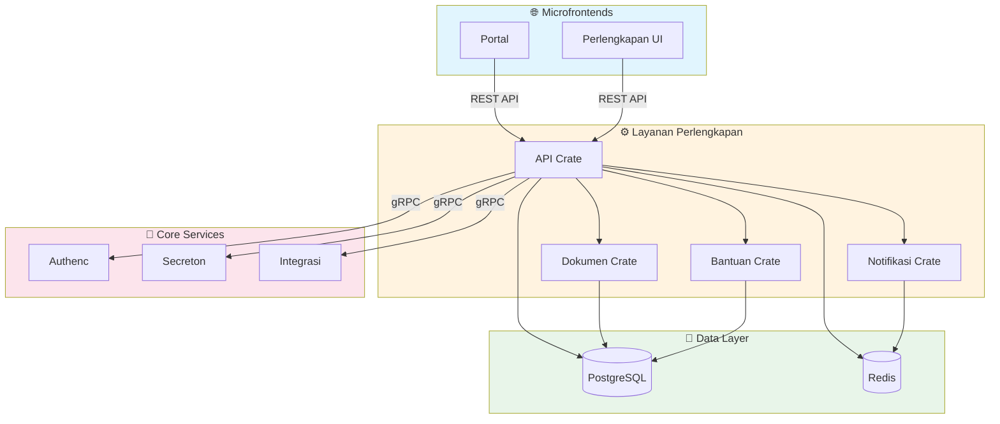

# 🤖 AGENTS.md - Layanan Perlengkapan

> **Service Context**: Backend service untuk manajemen Barang Milik Negara (BMN) Kejaksaan RI.

---

## 🌍 Service Context

Layanan Perlengkapan adalah backend service utama untuk sistem informasi perlengkapan Kejaksaan RI. Service ini menangani:
- Manajemen data BMN (Barang Milik Negara)
- Dokumentasi dan pelaporan perlengkapan
- Notifikasi terkait perlengkapan
- Sistem bantuan/ticket untuk perlengkapan

Service ini berkomunikasi dengan:
- **Authenc** (via gRPC) untuk autentikasi dan otorisasi
- **Secreton** (via gRPC) untuk manajemen secrets
- **Integrasi** (via gRPC) untuk integrasi dengan sistem eksternal (MySIMKARI, SIMAN)
- **Microfrontends** (via REST API) untuk antarmuka pengguna

---

## 🔑 Tech Stack

| Component | Technology | Version |
|-----------|------------|---------|
| **Language** | Rust (Edition 2024) | 1.93+ |
| **HTTP Framework** | Axum | 0.8.x |
| **Database** | PostgreSQL | tokio-postgres + deadpool |
| **Cache** | Redis | - |
| **gRPC** | Tonic + Prost | 0.14.x |
| **Async Runtime** | Tokio | 1.x |
| **Validation** | validator | 0.18.x |
| **Metrics** | Prometheus | - |
| **Scheduler** | tokio-cron-scheduler | - |

---

## 🏗️ Architecture

### Crate Structure

```
layanan/perlengkapan/
├── Cargo.toml              # Virtual manifest (build = false)
├── Dockerfile
├── build.rs
└── crates/
    ├── api/                # Main REST API service
    │   ├── src/
    │   │   ├── main.rs    # Entry point
    │   │   ├── lib.rs     # Library exports
    │   │   ├── handlers/  # HTTP handlers
    │   │   ├── models/    # Data models
    │   │   └── config.rs  # Configuration
    │   ├── build.rs      # Proto compilation
    │   └── Cargo.toml
    ├── dokumen/           # Document management service
    │   ├── src/
    │   │   ├── lib.rs
    │   │   ├── handlers/
    │   │   └── storage/
    │   └── Cargo.toml
    ├── notifikasi/        # Notification service
    │   ├── src/
    │   │   ├── lib.rs
    │   │   ├── handlers/
    │   │   └── channels/
    │   └── Cargo.toml
    └── bantuan/           # Help/ticket system
        ├── src/
        │   ├── lib.rs
        │   ├── handlers/
        │   └── workflow/
        └── Cargo.toml
```

### Communication Flow



---

## 📏 Critical Conventions

### 1. Dependency Management
- **ALL dependencies** MUST be defined in root `Cargo.toml` `[workspace.dependencies]`
- Member crates MUST use `dependency_name = { workspace = true }`
- **NEVER** specify versions in member `Cargo.toml` files

### 2. Configuration
- Use environment variables with `dotenvy` for local development
- Use Secreton gRPC for production secrets
- Config validation at startup with clear error messages
- Feature flags for optional functionality

### 3. Database Layer
- Use `deadpool-postgres` for connection pooling
- Each crate should have its own database schema if needed
- Use prepared statements for frequently executed queries
- Implement proper transaction handling

### 4. Error Handling
- Use `thiserror` for error enums
- Implement `From` conversions for common errors
- Return structured error responses with error codes
- Log errors with appropriate context using `tracing`

### 5. Authentication & Authorization
- Validate JWT tokens via Authenc gRPC on every request
- Implement role-based access control (RBAC)
- Use middleware for authentication checks
- Never trust client-side data for authorization

---

## 🦀 Code Patterns

### Axum Handler Pattern

```rust
use axum::{
    extract::{Path, Query, State, Json},
    response::IntoResponse,
    http::StatusCode,
};
use uuid::Uuid;

pub async fn get_perlengkapan(
    State(state): State<Arc<AppState>>,
    Path(id): Path<Uuid>,
    user_id: Uuid, // From auth middleware
) -> Result<Json<PerlengkapanResponse>, AppError> {
    // Validate authorization
    if !state.auth_client.check_permission(user_id, "perlengkapan:read").await? {
        return Err(AppError::Unauthorized("Insufficient permissions".into()));
    }

    // Fetch from database
    let perlengkapan = state.db_pool
        .get()
        .await?
        .query_one("SELECT * FROM perlengkapan WHERE id = $1", &[&id])
        .await?
        .try_into()?;

    Ok(Json(perlengkapan))
}
```

### gRPC Client Pattern

```rust
use tonic::transport::Channel;

pub async fn create_authenc_client() -> Result<AuthServiceClient<Channel>, tonic::transport::Error> {
    let channel = Channel::from_static("https://authenc.internal:50051")
        .tls_config(tonic::transport::ClientTlsConfig::new())?
        .connect()
        .await?;
    Ok(AuthServiceClient::new(channel))
}
```

### Database Operation Pattern

```rust
use deadpool_postgres::Pool;

pub async fn create_perlengkapan(
    pool: &Pool,
    request: CreatePerlengkapanRequest,
) -> Result<Perlengkapan> {
    let client = pool.get().await?;
    let tx = client.transaction().await?;

    let row = tx.query_one(
        "INSERT INTO perlengkapan (kode_barang, nama, satker_id, created_by) 
         VALUES ($1, $2, $3, $4) 
         RETURNING *",
        &[&request.kode_barang, &request.nama, &request.satker_id, &request.created_by]
    ).await?;

    tx.commit().await?;
    Ok(row.try_into()?)
}
```

---

## 📋 Common Tasks

### 1. Add New API Endpoint

1. Add route in `crates/api/src/lib.rs`:
```rust
.route("/api/v1/perlengkapan", get(list_perlengkapan).post(create_perlengkapan))
.route("/api/v1/perlengkapan/:id", get(get_perlengkapan).put(update_perlengkapan))
```

2. Implement handler in `crates/api/src/handlers/perlengkapan.rs`
3. Add tests in `crates/api/tests/`
4. Update documentation

### 2. Add Validation Rule

1. Add validation function in `crates/api/src/validation.rs`:
```rust
use validator::Validate;

#[derive(Validate)]
pub struct CreatePerlengkapanRequest {
    #[validate(length(min = 1, max = 50))]
    pub kode_barang: String,
    
    #[validate(length(min = 1, max = 255))]
    pub nama: String,
}
```

2. Apply validation in handler:
```rust
request.validate().map_err(AppError::Validation)?;
```

### 3. Add gRPC Service Method

1. Update proto file in `proto/`
2. Regenerate code: `cargo build -p layanan-perlengkapan-api`
3. Implement service in `crates/api/src/grpc/`
4. Add to router

---

## ⚠️ Common Pitfalls

❌ **DON'T:**
- Call Authenc/Secreton directly from microfrontends
- Store secrets in environment variables in production
- Use raw SQL queries without prepared statements
- Forget to validate user input
- Ignore error context in error handling
- Use blocking I/O in async functions
- Hardcode database connection strings
- Skip transaction handling for multi-step operations

✅ **DO:**
- Use gRPC for inter-service communication
- Fetch secrets from Secreton via gRPC
- Use prepared statements with parameterized queries
- Validate all input with `validator` crate
- Include context in errors using `tracing`
- Use async/await throughout
- Use connection pooling with `deadpool`
- Wrap multi-step operations in transactions

---

## 🔍 Troubleshooting

### Database Connection Issues
- **Symptom**: "Connection refused" or timeout errors
- **Check**: PostgreSQL is running, connection string is correct
- **Solution**: Verify `DATABASE_URL` and network connectivity

### gRPC Connection Failures
- **Symptom**: "Failed to connect to authenc"
- **Check**: mTLS certificates are valid, service is running
- **Solution**: Verify certificate paths and service discovery

### Validation Errors
- **Symptom**: "Validation error" without details
- **Check**: Validation rules are properly defined
- **Solution**: Add custom error messages to validation attributes

### Performance Issues
- **Symptom**: Slow API responses
- **Check**: Database query performance, connection pool size
- **Solution**: Add indexes, optimize queries, increase pool size

---

## 📚 Key Files Reference

| File | Purpose |
|------|---------|
| `crates/api/src/main.rs` | Application entry point |
| `crates/api/src/lib.rs` | Router and state setup |
| `crates/api/src/handlers/` | HTTP request handlers |
| `crates/api/src/models/` | Data models and DTOs |
| `crates/api/src/config.rs` | Configuration loading |
| `crates/api/build.rs` | Proto file compilation |
| `crates/dokumen/src/lib.rs` | Document management logic |
| `crates/notifikasi/src/lib.rs` | Notification service logic |
| `crates/bantuan/src/lib.rs` | Help/ticket system logic |

---

## 🧪 Testing

### Unit Tests
```bash
cargo test -p layanan-perlengkapan-api
```

### Integration Tests
```bash
cargo test -p layanan-perlengkapan-api --features integration-tests
```

### Build
```bash
cargo build -p layanan-perlengkapan-api --release
```

---

## 🚀 Build & Run

### Development
```bash
cd layanan/perlengkapan/crates/api
cargo run
```

### Production Build
```bash
cargo build -p layanan-perlengkapan-api --release
```

### Docker Build
```bash
docker build -t layanan-perlengkapan-api:latest .
```

---

> **Catatan Akhir**: Layanan Perlengkapan adalah service kritis untuk operasional BMN Kejaksaan RI. Pastikan semua perubahan melalui code review dan testing yang menyeluruh sebelum deployment ke production.
