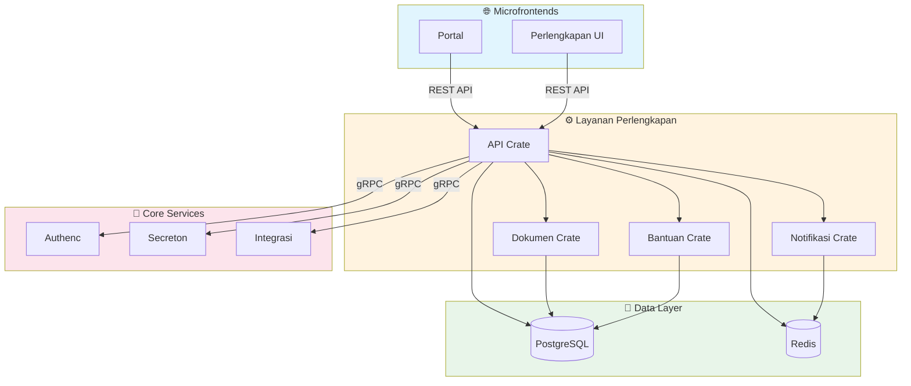

# 🤖 AGENTS.md - Layanan Perlengkapan

> **Service Context**: Backend service untuk manajemen Barang Milik Negara (BMN) Kejaksaan RI.

## Inherited Global Rules

- This file extends the global rules in `AGENTS.md`.
- Use this document only for **local deltas** specific to `layanan/perlengkapan`.
- If guidance here conflicts with root policy, root policy takes precedence unless an explicit local override is documented.

---

## 🌍 Service Context

Layanan Perlengkapan adalah backend service utama untuk sistem informasi perlengkapan Kejaksaan RI. Service ini menangani:

- Manajemen data BMN (Barang Milik Negara)
- Dokumentasi dan pelaporan perlengkapan
- Notifikasi terkait perlengkapan
- Sistem bantuan/ticket untuk perlengkapan

Service ini berkomunikasi dengan:

- **Authenc** (via gRPC) untuk autentikasi dan otorisasi
- **Secreton** (via gRPC) untuk manajemen secrets
- **Integrasi** (via gRPC) untuk integrasi dengan sistem eksternal (MySIMKARI, SIMAN)
- **Microfrontends** (via REST API) untuk antarmuka pengguna

---

## 🔑 Tech Stack

| Component | Technology | Version |
|-----------|------------|---------|
| **Language** | Rust (Edition 2024) | 1.93+ |
| **HTTP Framework** | Axum | 0.8.x |
| **Database** | PostgreSQL | tokio-postgres + deadpool |
| **Cache** | Redis | - |
| **gRPC** | Tonic + Prost | 0.14.x |
| **Async Runtime** | Tokio | 1.x |
| **Validation** | validator | 0.18.x |
| **Metrics** | Prometheus | - |
| **Scheduler** | tokio-cron-scheduler | - |

---

## 🏗️ Architecture

### Crate Structure

Per refactor `refactor/perlengkapan-unified`: a single package owns every
domain. The previous `crates/{api,dokumen,notifikasi,bantuan}` split is
gone — modules now sit as siblings under `src/` and depend on each other
through ports & adapters (traits in `lib-perlengkapan::contracts`).

```
layanan/perlengkapan/
├── Cargo.toml              # unified package: layanan-perlengkapan
├── Dockerfile
├── build.rs                # compiles authenc/secreton/integrasi protos
├── migrations/             # V001..V0XX SQL, embedded via refinery
└── src/
    ├── main.rs             # bin entrypoint, wires AppState
    ├── lib.rs              # module declarations
    ├── state.rs            # AppState (carries Arc<dyn DocumentGenerator>
    │                       #            + Arc<dyn NotificationSender>)
    ├── routes.rs           # axum router composition
    ├── migrations.rs       # refinery::embed_migrations! runner
    │                       # (NB: no top-level handlers/models/services/
    │                       #  repository.rs — the old catch-all was
    │                       #  dissolved into feature modules, see below)
    │
    ├── shared/             # infra lintas-fitur: db, grpc, middleware,
    │                       #   cache, events, error, health, pagination, …
    ├── analisis/           # CRUD analisis_kebutuhan (eks catch-all)
    ├── export/             # generic xlsx export jobs (eks catch-all)
    ├── audit/              # audit-log query surface
    │
    ├── bank_aset/          # BMN catalog
    ├── kebutuhan_bmn/      # needs assessment + SIMAN integration
    ├── pakaian_dinas/      # uniform allocation
    ├── pemakaian_bmn/      # usage permits + scheduler
    ├── penghapusan_bmn/    # asset disposal
    ├── roadmap_sarpras/    # facilities roadmap
    ├── mapping_kodefikasi/ # asset coding
    ├── dashboard/          # KPI dashboard + WebSocket
    ├── admin/              # user/role admin (local to perlengkapan)
    ├── workflow/           # approval state machine + SLA monitor
    │   ├── engine/         # split: mod (types+ctors) + transition +
    │   │                   #   documents + notifications submodules
    │   ├── sla.rs
    │   ├── sla_scheduler.rs
    │   └── notification_types.rs  # WorkflowNotificationType +
    │                                # to_notification_message() adapter
    │
    ├── dokumen/            # templates + PDF/Excel generators + storage
    │   └── service.rs      # impl DocumentGenerator (real prod wiring)
    ├── notifikasi/         # email/SMS/whatsapp/push/in-app + queue
    │   └── service.rs      # impl NotificationSender (in-app real, others stub)
    └── bantuan/            # FAQ, ticketing, knowledge base, chatbot
        └── ticket.rs       # injects NotificationSender for tiket events
```

### Layout per modul fitur (konvensi F0-A)

Tiap modul fitur memakai `handlers` · `models` · `services` · `repository`
(+ `mod.rs`). **Bila satu berkas tumbuh besar (>~30KB / ratusan baris), pecah
menjadi direktori submodul kohesif** dengan `mod.rs` yang me-`pub use <grp>::*`
sehingga path publik lama (`crate::<modul>::models::*`, dll) tetap utuh:

- `kebutuhan_bmn/` — `handlers/` (per-handler-group + `params`), `models/`
  (`status`/`entities`/`requests`/`responses`), `services/`, `repository/`
  (`mod` = trait, `pg` = impl).
- `pemakaian_bmn/` — `models/`, `services/`, `repository/` (per-fitur).
- `pakaian_dinas/` — `models/`, `repository/`.
- `bantuan/` — `handlers/` (per-fitur; `mod.rs` menyimpan `routes()`).
- `workflow/engine/` — `transition`/`documents`/`notifications` (inherent
  impl boleh dipecah lintas-berkas selama submodul = descendant module;
  method privat yang dipanggil lintas-berkas → `pub(crate)`). **Trait impl
  TIDAK dipecah** (koherensi: satu blok — lihat `repository/pg.rs`).

Aturan saat memecah: submodul pakai path absolut `crate::<modul>::…` (bukan
`super::…`, sebab makna `super` berubah saat berkas turun satu level); `mod.rs`
mempertahankan re-export glob. Murni pemindahan kode — tanpa ubah perilaku.

### Why this shape

- **Ports & adapters**: cross-module calls go through trait contracts in
  `lib-perlengkapan::contracts` (`DocumentGenerator`, `NotificationSender`,
  `AuditSink`, `DocumentStorage`). The workflow engine no longer takes a
  concrete `DokumenClient` — it takes `Arc<dyn DocumentGenerator>`, so the
  module can be replaced or extracted to its own crate later without
  touching call sites.
- **No internal gRPC**: the old workflow → dokumen / workflow → notifikasi
  proto-over-Tonic clients are gone. Direct in-process trait dispatch
  removes the serialization hop and the second binary.
- **Migrations**: `migrations/V*.sql` is the source of truth, applied by
  refinery on startup. The legacy hand-coded `Database::migrate` runs
  after, for tables that don't have a refinery file yet.

### Communication Flow



---

## 📏 Critical Conventions

### 1. Dependency Management

- **ALL dependencies** MUST be defined in root `Cargo.toml` `[workspace.dependencies]`
- Member crates MUST use `dependency_name = { workspace = true }`
- **NEVER** specify versions in member `Cargo.toml` files

### 2. Configuration

- Use environment variables with `dotenvy` for local development
- Use Secreton gRPC for production secrets
- Config validation at startup with clear error messages
- Feature flags for optional functionality

### 3. Database Layer

- Use `deadpool-postgres` for connection pooling
- Each crate should have its own database schema if needed
- Use prepared statements for frequently executed queries
- Implement proper transaction handling

### 4. Error Handling

- Use `thiserror` for error enums
- Implement `From` conversions for common errors
- Return structured error responses with error codes
- Log errors with appropriate context using `tracing`

### 5. Authentication & Authorization

- Validate JWT tokens via Authenc gRPC on every request
- Implement role-based access control (RBAC)
- Use middleware for authentication checks
- Never trust client-side data for authorization

---

## 🦀 Code Patterns

### Axum Handler Pattern

```rust
use axum::{
    extract::{Path, Query, State, Json},
    response::IntoResponse,
    http::StatusCode,
};
use uuid::Uuid;

pub async fn get_perlengkapan(
    State(state): State<Arc<AppState>>,
    Path(id): Path<Uuid>,
    user_id: Uuid, // From auth middleware
) -> Result<Json<PerlengkapanResponse>, AppError> {
    // Validate authorization
    if !state.auth_client.check_permission(user_id, "perlengkapan:read").await? {
        return Err(AppError::Unauthorized("Insufficient permissions".into()));
    }

    // Fetch from database
    let perlengkapan = state.db_pool
        .get()
        .await?
        .query_one("SELECT * FROM perlengkapan WHERE id = $1", &[&id])
        .await?
        .try_into()?;

    Ok(Json(perlengkapan))
}
```

### gRPC Client Pattern

```rust
use tonic::transport::Channel;

pub async fn create_authenc_client() -> Result<AuthServiceClient<Channel>, tonic::transport::Error> {
    let channel = Channel::from_static("https://authenc.internal:50051")
        .tls_config(tonic::transport::ClientTlsConfig::new())?
        .connect()
        .await?;
    Ok(AuthServiceClient::new(channel))
}
```

### Database Operation Pattern

```rust
use deadpool_postgres::Pool;

pub async fn create_perlengkapan(
    pool: &Pool,
    request: CreatePerlengkapanRequest,
) -> Result<Perlengkapan> {
    let client = pool.get().await?;
    let tx = client.transaction().await?;

    let row = tx.query_one(
        "INSERT INTO perlengkapan (kode_barang, nama, satker_id, created_by) 
         VALUES ($1, $2, $3, $4) 
         RETURNING *",
        &[&request.kode_barang, &request.nama, &request.satker_id, &request.created_by]
    ).await?;

    tx.commit().await?;
    Ok(row.try_into()?)
}
```

---

## 📋 Common Tasks

### 1. Add New API Endpoint

Perlengkapan is a *single-crate* service (flat `src/`, no `crates/api/` —
that pattern lives in authenc, not here). End-to-end:

1. **Route** — register in `src/routes.rs`. Example layout (see the
   `Workflow Delegation Routes` block circa line 510 for a fresh
   reference):

   ```rust
   .route(
       "/workflow/delegations",
       get(crate::workflow::delegation_handlers::list_delegations_handler)
           .post(crate::workflow::delegation_handlers::create_delegation_handler),
   )
   ```

2. **Handler** — drop the function in `<module>/handlers.rs`, or in the
   relevant `<module>/handlers/<group>.rs` when that module's handlers are
   split into a directory (e.g. `kebutuhan_bmn`, `bantuan`). The
   re-exporting `mod.rs` keeps the `crate::<module>::<fn>` path stable.
   Extractor ordering matters in axum: `State` first, then custom
   extractors (`Claims`), then `Path` / `Query`, with `Json(body)` last.

3. **Service / repository** — keep the handler thin; business rules and
   DB I/O go in `<module>/services(.rs|/…)` and
   `<module>/repository(.rs|/…)` — single file for small modules, a
   directory of cohesive submodules (re-exported via `mod.rs`) for large
   ones. The handler wires through `AppState`.

4. **Migration** — schema lives under `migrations/` as `V###__name.sql`
   and runs through `refinery` from `main.rs` (`migrations::run()`).
   Never `ALTER` an existing migration after merge — append a new file.

5. **Test** — unit tests next to the service; cross-module flows go in
   `tests/`. Backend lib tests must run serial (`--test-threads=1`)
   because they share a Docker Postgres.

### 2. Add Validation Rule

1. Add validation function in `crates/api/src/validation.rs`:

```rust
use validator::Validate;

#[derive(Validate)]
pub struct CreatePerlengkapanRequest {
    #[validate(length(min = 1, max = 50))]
    pub kode_barang: String,
    
    #[validate(length(min = 1, max = 255))]
    pub nama: String,
}
```

2. Apply validation in handler:

```rust
request.validate().map_err(AppError::Validation)?;
```

### 3. Add a Workflow Definition or Delegation

The workflow engine lives in `src/workflow/`. Two ways to extend it:

- **New workflow definition (a new approval flow)** — add a `default_*`
  fn to `workflow/config.rs::WorkflowConfig` that returns
  `WorkflowConfig { states, transitions, sla_minutes, roles, ... }`,
  then wire `WorkflowEngine::for_<entity>` in `main.rs`. Once shipped,
  the admin UI at `/admin/workflow` displays it for inspection without
  any frontend change. Add a refinery migration only if the new
  workflow needs entity-specific columns (most don't — the engine
  tables are polymorphic).

- **Delegation (validator hands off to another user)** — the model is
  already wired (`workflow/delegation.rs` + `delegation_handlers.rs`
  routes at `/workflow/delegations`). The hot path is:
  `POST /workflow/delegations` → `DelegationManager::create_delegation`
  inserts into `perlengkapan.workflow_delegations`. Status transitions
  (`Scheduled` → `Active` → `Expired`) are driven by
  `DelegationManager::process_delegation_lifecycle()`; hook it into
  the SLA scheduler if you add a separate cron loop. Frontend lives at
  `antarmuka/perlengkapan/src/pages/workflow/delegation.rs`.

### 4. Add a Secreton-backed Service Credential

`main.rs` already creates a single `SecretonClient` and keeps it alive
for the duration of the process — reuse it instead of opening a new
gRPC channel per service. Worked example: SMTP credentials for
`notifikasi::email::EmailService`:

```rust
// 1. Construct service with `new_with_secreton`, passing the live
//    Secreton client and a KV path. The path resolves under
//    `kv/data/<path>` in Secreton's REST API.
let email = EmailService::new_with_secreton(
    notif_config,
    db.pool().clone(),
    secreton_client_ref,         // &SecretonClient (kept across boot)
    "perlengkapan/notifikasi/smtp", // bundle with `username` + `password` keys
).await?;

// 2. Production hardening: under `APP_ENV=production` the Err arm
//    must abort start-up (anyhow::bail!) instead of degrading silently.
```

The KV bundle must be readable by the SA role declared in
`infra/helm/simpel/values.yaml` under
`secretonAuth.policies.layanan-perlengkapan`. Add new globs there for
new bundles — current entries:

- `kv/data/postgres/perlengkapan`
- `kv/data/postgres/integrasi`
- `kv/data/perlengkapan/notifikasi/*`

### 5. Add gRPC Service Method

1. Update proto file in `proto/`
2. Regenerate code: `cargo build -p layanan-perlengkapan`
3. Implement service in `crates/api/src/grpc/`
4. Add to router

---

## ⚠️ Common Pitfalls

❌ **DON'T:**

- Call Authenc/Secreton directly from microfrontends
- Store secrets in environment variables in production
- Use raw SQL queries without prepared statements
- Forget to validate user input
- Ignore error context in error handling
- Use blocking I/O in async functions
- Hardcode database connection strings
- Skip transaction handling for multi-step operations

✅ **DO:**

- Use gRPC for inter-service communication
- Fetch secrets from Secreton via gRPC
- Use prepared statements with parameterized queries
- Validate all input with `validator` crate
- Include context in errors using `tracing`
- Use async/await throughout
- Use connection pooling with `deadpool`
- Wrap multi-step operations in transactions

---

## 🔍 Troubleshooting

### Database Connection Issues

- **Symptom**: "Connection refused" or timeout errors
- **Check**: PostgreSQL is running, connection string is correct
- **Solution**: Verify `DATABASE_URL` and network connectivity

### gRPC Connection Failures

- **Symptom**: "Failed to connect to authenc"
- **Check**: mTLS certificates are valid, service is running
- **Solution**: Verify certificate paths and service discovery

### Validation Errors

- **Symptom**: "Validation error" without details
- **Check**: Validation rules are properly defined
- **Solution**: Add custom error messages to validation attributes

### Performance Issues

- **Symptom**: Slow API responses
- **Check**: Database query performance, connection pool size
- **Solution**: Add indexes, optimize queries, increase pool size

---

## 📚 Key Files Reference

| File | Purpose |
|------|---------|
| `crates/api/src/main.rs` | Application entry point |
| `crates/api/src/lib.rs` | Router and state setup |
| `crates/api/src/handlers/` | HTTP request handlers |
| `crates/api/src/models/` | Data models and DTOs |
| `crates/api/src/config.rs` | Configuration loading |
| `crates/api/build.rs` | Proto file compilation |
| `crates/dokumen/src/lib.rs` | Document management logic |
| `crates/notifikasi/src/lib.rs` | Notification service logic |
| `crates/bantuan/src/lib.rs` | Help/ticket system logic |

---

## 🧪 Testing

### Unit Tests

```bash
cargo test -p layanan-perlengkapan
```

### Integration Tests

```bash
cargo test -p layanan-perlengkapan --features integration-tests
```

### Build

```bash
cargo build -p layanan-perlengkapan --release
```

---

## 🚀 Build & Run

### Development

```bash
cd layanan/perlengkapan/crates/api
cargo run
```

### Production Build

```bash
cargo build -p layanan-perlengkapan --release
```

### Docker Build

```bash
docker build -t layanan-perlengkapan:latest .
```

---

## 🔗 End-to-End Integration Map

### Frontend → Backend Flow

```
antarmuka/perlengkapan (WASM)
  → reads JWT from localStorage key `auth_token`
  → calls REST API at /api/pembinaan/perlengkapan/*
  → layanan-perlengkapan (Axum)
    → validates JWT via gRPC → authenc-grpc
    → fetches secrets via gRPC → secreton-grpc
    → queries PostgreSQL via deadpool-postgres
    → returns JSON response
```

### Cross-Microfrontend Auth

Portal and Perlengkapan share the same `auth_token` localStorage key.
When Portal logs out, it:

1. Calls `POST /api/v1/auth/logout` to invalidate server session
2. Clears `auth_token`, `refresh_token` from localStorage
3. Fires `logout_event` storage event for cross-tab sync
4. Does a full page reload to clear WASM memory

Perlengkapan listens for `auth_token` and `logout_event` storage events
to sync session state across tabs.

See root `AGENTS.md` → "Canonical localStorage Keys" for the full key table.

### Known Integration Gaps

Snapshot as of the May 2026 stabilization sweep (Phase 1–2 of the
`tolong-bantu-saya-saya-tender-flamingo` plan).

| Gap | Status | Notes |
|-----|--------|-------|
| Cross-MFE token refresh (Portal ↔ Perlengkapan) | ✅ Wired | `features::session_monitor::spawn_refresh_loop` in Perlengkapan refreshes ahead of expiry; Portal listener now reacts to `auth_token` storage events too. ADR `docs/adr/0003-cross-mfe-token-sync.md`. |
| Email notification via SMTP | ✅ Wired | `EmailService::new_with_secreton` reads `perlengkapan/notifikasi/smtp` bundle; `NotifikasiService::with_email()` dispatches the Email channel. Helm policy adds `kv/data/perlengkapan/notifikasi/*`. |
| MFA TOTP REST endpoints | ✅ Wired | `services::LocalMfaApi` adapter in authenc-api drives `setup`/`verify`/`disable` against Postgres-backed stores (migration `049_totp_backup_codes.sql`). TOTP secrets stored as base32 plaintext — wrap with `authenc-crypto` envelope encryption in a follow-up. |
| Hardcoded `pegawai_id="0"` on `/pakaian-dinas/ukuran` | ✅ Removed | Route now reads `UserSession` from context. `fetch_pegawai_ukuran` no longer appends a path-param; backend resolves pegawai from JWT NIP claim. |
| Portal admin: Roles CRUD | ✅ Wired | Create + Delete modals in `antarmuka/portal/src/pages/admin/roles.rs`. |
| Portal admin: Realm General settings | ✅ Wired | Editable form bound to `iam_update_realm`. Other 8 tabs carry a "Pratinjau — belum tersambung" banner pending backend endpoints. |
| Workflow delegation (`/workflow/delegations`) | ✅ Wired | Backend handlers + REST routes added; `delegation.rs` table refs corrected to V007 schema (`workflow_delegations`). Frontend at `/admin/workflow-delegation`. |
| SMS / WhatsApp / Push channels | 🟡 Deferred | `NotifikasiService` still logs-and-skips these; SMTP-style adapter scaffolding can be ported once provider creds are minted into Secreton. |
| Authorization Services (Keycloak parity: resource servers, scopes, policies, evaluate) | 🔴 Pending epic | `antarmuka/portal/src/pages/admin/permissions.rs` shows a labelled "Pratinjau" UI; no backend endpoints yet. |
| Realm Settings tabs other than General | 🔴 Pending epic | Login/Email/Themes/Keys/Sessions/Tokens/Security/Localization need authenc settings endpoints. |
| TOTP secret encryption-at-rest | 🟡 Follow-up | Tracked in migration 049 comment; wrap with envelope encryption from `authenc-crypto`. |
| Pengadaan tender, BMN Wasdal | 🟡 Stays on v1 | Per the plan, v1 PHP keeps these — bug fixes in `monolith/simpelv1/`, no v2 rebuild scheduled. |

---

## 🔐 Secret Fetching (Zero-Trust)

Saat `secretonAuth.enabled=true` di Helm values:

- Pod `layanan-perlengkapan` punya projected SA token di `/var/run/secrets/tokens/secreton-token` (audience `secreton`).
- Pakai `secreton-agent` Kubernetes auth backend (lihat `layanan/secreton/crates/agent/src/auth/kubernetes.rs`).
- **Path policy** (`secretonAuth.policies.layanan-perlengkapan` di `infra/helm/simpel/values.yaml`):
  - `kv/data/postgres/perlengkapan` — DATABASE_URL untuk DB perlengkapan.
  - `kv/data/postgres/integrasi` — read-only ke DB integrasi (untuk join data BMN ↔ sync).
- **Env auto-injected** oleh `_workload.tpl`: `SECRETON_ADDR`, `SECRETON_AUTH_METHOD=kubernetes`, `SECRETON_AUTH_ROLE=layanan-perlengkapan`, `SECRETON_K8S_TOKEN_PATH=/var/run/secrets/tokens/secreton-token`.
- **DILARANG** pakai `SECRETON_TOKEN` env di production. Token statis hanya untuk dev lokal (docker-compose).

---

> **Catatan Akhir**: Layanan Perlengkapan adalah service kritis untuk operasional BMN Kejaksaan RI. Pastikan semua perubahan melalui code review dan testing yang menyeluruh sebelum deployment ke production.
