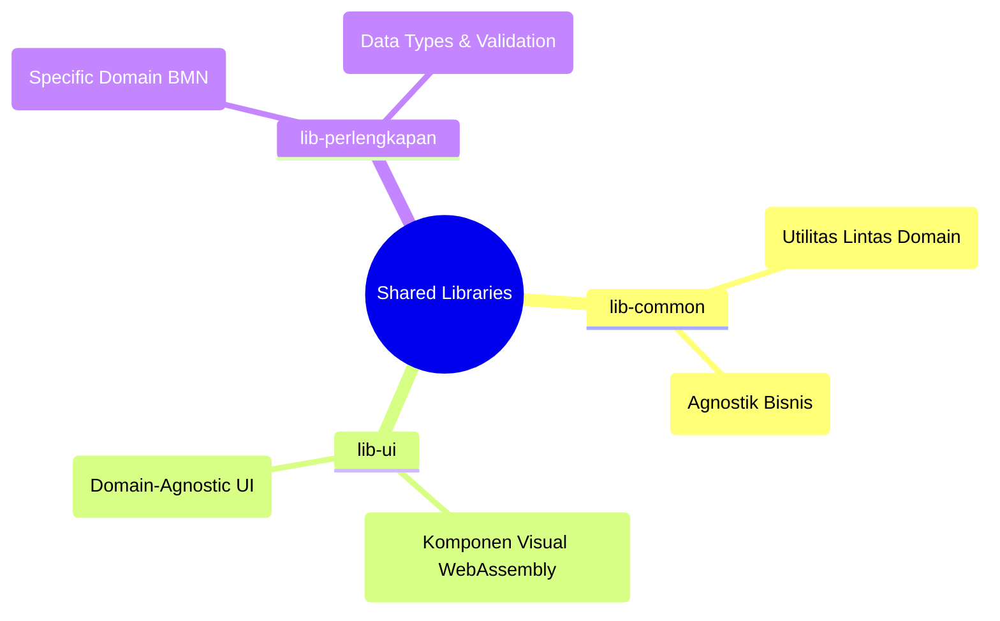

# 🤖 AGENTS.md - Pustaka Bersama (Shared Libraries)

> **Peringatan untuk AI Agents**: File ini adalah aturan dasar untuk beroperasi dalam direktori `lib/`. **Bacalah dengan saksama** sebelum mengubah kode apa pun yang berdampak global.

---

## 🌍 Konteks Direktori `lib/`

Direktori `lib/` adalah otak komunal untuk seluruh repositori SIMPEL. Kesalahan, kelalaian dependensi, atau penambahan kode yang salah ranah di sini akan berdampak langsung ke seluruh proyek Microfrontend (`antarmuka/`) maupun Microservices (`layanan/`).

## 🚨 Aturan Emas Pustaka (The Golden Rules)

1. **Anti Dependensi Sirkular**:
   ✅ BENAR: `lib-perlengkapan` bergantung pada `lib-common`.
   ⛔ SALAH: `lib-common` bergantung pada `lib-perlengkapan` atau `lib-ui`.

2. **Kesesuaian Tumpukan Fitur (Feature Flags)**:
   Pustaka kami harus aman di-*compile* untuk dua target berbeda:
   - Target `wasm32-unknown-unknown` (Frontend Leptos)
   - Target Backend Server (Tokio/Axum)

   🔴 **AI AGENTS HARUS MEMPERHATIKAN**: Jangan impor `tokio`, `axum`, atau `deadpool-postgres` di tingkat paling luar file. Selalu lindungi modul backend dengan `#[cfg(feature = "backend")]` atau letakkan di balik feature flag pada `Cargo.toml`.

3. **Modul Domain Spesifik**:
   Jangan menambahkan tipe data tentang "Pengadaan", "BMN", atau "Kode Barang" ke `lib-common`. Itu *strictly* bagian dari `lib-perlengkapan`.

## 📍 Struktur Pustaka

| Pustaka | Target Utama | Panduan Khusus AI |
|---------|-------------|-------------------|
| `lib-common/` | Backend & WASM Utils | Lintas fungsionalitas murni; Kriptografi, Otentikasi, Auth Middleware. |
| `lib-perlengkapan/` | Perlengkapan Domain | Murni menyimpan `Model` dan Logika BMN. Jangan tambahkan HTTP Handlers di sini! |
| `lib-ui/` | Leptos WASM | Hanya khusus komponen visual. Bebas dari logika *fetching* HTTP spesifik (gunakan callbacks). |

Masing-masing pustaka memiliki file `AGENTS.md` yang lebih detail di dalam direktorinya. Cek file tersebut saat masuk ke folder bersangkutan!
