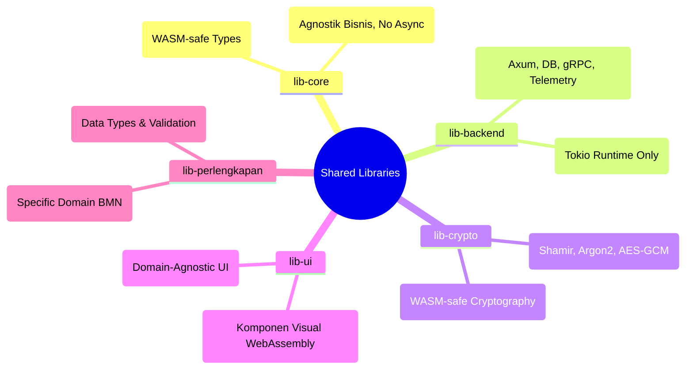

# 🤖 AGENTS.md - Pustaka Bersama (Shared Libraries)

> **Peringatan untuk AI Agents**: File ini adalah aturan dasar untuk beroperasi dalam direktori `lib/`. **Bacalah dengan saksama** sebelum mengubah kode apa pun yang berdampak global.

---

## 🌍 Konteks Direktori `lib/`

Direktori `lib/` adalah otak komunal untuk seluruh repositori SIMPEL. Kesalahan, kelalaian dependensi, atau penambahan kode yang salah ranah di sini akan berdampak langsung ke seluruh proyek Microfrontend (`antarmuka/`) maupun Microservices (`layanan/`).



> **Catatan**: `lib-common` telah dipecah menjadi `lib-core`, `lib-backend`, dan `lib-crypto`
> untuk memperjelas batas kompatibilitas WASM. Jangan tambahkan referensi baru ke `lib-common`.

## 🚨 Aturan Emas Pustaka (The Golden Rules)

1. **Anti Dependensi Sirkular**:
   ✅ BENAR: `lib-backend` / `lib-crypto` bergantung pada `lib-core`. `lib-perlengkapan` bergantung pada `lib-core`.
   ⛔ SALAH: `lib-core` bergantung pada crate lain di `lib/`. `lib-ui` bergantung pada `lib-backend`.

2. **Kesesuaian Tumpukan Fitur (Feature Flags)**:
   Pustaka di `lib/` harus aman di-*compile* untuk dua target berbeda:
   - Target `wasm32-unknown-unknown` (Frontend Leptos) → `lib-core`, `lib-crypto`, `lib-ui`, `lib-perlengkapan`
   - Target Backend Server (Tokio/Axum) → `lib-backend`

   🔴 **AI AGENTS HARUS MEMPERHATIKAN**: Jangan impor `tokio`, `axum`, atau `deadpool-postgres`
   di `lib-core`, `lib-crypto`, `lib-ui`, atau `lib-perlengkapan`. Infrastruktur backend
   HANYA boleh tinggal di `lib-backend` (dan di-gate dengan feature flag per-module).

3. **Modul Domain Spesifik**:
   Jangan menambahkan tipe data tentang "Pengadaan", "BMN", atau "Kode Barang" ke `lib-core`.
   Itu *strictly* bagian dari `lib-perlengkapan`.

## 📍 Struktur Pustaka

| Pustaka | Target Utama | Panduan Khusus AI |
|---------|-------------|-------------------|
| `lib-core/` | WASM + Backend | Tipe WASM-safe (validators, config structs, auth claims, audit types). **DILARANG** dependensi async (`tokio`, `axum`). |
| `lib-backend/` | Backend Only | Infrastruktur Axum, deadpool-postgres, Redis, gRPC, telemetry. Gunakan feature flags (`axum`, `db`, `jwt`, `grpc`). |
| `lib-crypto/` | WASM + Backend | Shamir, Argon2, bcrypt, AES-GCM (feature-gated). Semua WASM-compatible. |
| `lib-perlengkapan/` | Perlengkapan Domain (WASM-safe murni) | DTO/`Model` + domain BMN murni. Sejak F0-C: **tanpa** feature `backend`, `tokio-postgres`, `from_row`, atau trait kontrak service — semua itu di `layanan/perlengkapan` (repository `FromPgRow`/`search_db`, `contracts.rs`). Jangan tambah HTTP handler/ORM/async di sini. |
| `lib-ui/` | Leptos WASM | Hanya khusus komponen visual. Bebas dari logika *fetching* HTTP spesifik (gunakan callbacks). |

Masing-masing pustaka memiliki file `AGENTS.md` yang lebih detail di dalam direktorinya. Cek file tersebut saat masuk ke folder bersangkutan!

## 📋 Common Tasks

### 1. Add a new UI component to `lib-ui/`

1. Drop a new file under `lib/ui/src/components/<kategori>/<name>.rs`
   (atau jadi sub-modul kalau sudah punya keluarga komponen — lihat
   `components/floating/` sebagai contoh modular).
2. Export dari `lib/ui/src/components/<kategori>/mod.rs` lalu
   re-export di `lib/ui/src/components/mod.rs` atau `lib/ui/src/lib.rs`
   sesuai pola yang sudah ada.
3. **Props convention**: pakai `#[prop(into)] Callback<T>` untuk event
   handler, `#[prop(optional, default = ...)]` untuk opsi dengan
   default. Hindari prop berbentuk `Box<dyn Fn() -> View>` kecuali
   benar-benar perlu (Callback lebih reactive-friendly).
4. **Styling**: Tailwind utility classes — `lib-ui` tidak punya CSS
   global sendiri. Gunakan token desain dari Portal/Perlengkapan
   (`bg-app-gradient`, `text-gold-400`, dll) supaya komponen terlihat
   konsisten antar MFE.
5. **Test**: kalau ada logic non-trivial (sort, filter, dll), tulis
   pure-Rust unit test di file komponen — `#[cfg(test)]` tidak
   memerlukan browser.

### 2. Verify a `lib/` crate stays WASM-safe

Bug yang paling sering muncul: developer menambahkan `tokio::spawn`
atau `axum::response::IntoResponse` ke crate yang dipakai MFE. Build
WASM gagal cryptically. Cara cepat membuktikan crate masih clean:

```bash
# WASM-only check; gagal cepat kalau ada dep async/std-net yang tidak compatible
cargo +1.95.0 check -p lib-core --target wasm32-unknown-unknown
cargo +1.95.0 check -p lib-crypto --target wasm32-unknown-unknown
cargo +1.95.0 check -p lib-ui --target wasm32-unknown-unknown
cargo +1.95.0 check -p lib-perlengkapan --target wasm32-unknown-unknown --features wasm
```

Jika perlu trait/util yang membutuhkan tokio atau koneksi DB, taruh
di `lib-backend`. Jika perlu sharing antar backend service tanpa async,
tetap WASM-safe — taruh di `lib-core`.

### 3. Decide where new code belongs

Diagram cepat keputusan:

- Dipakai oleh MFE **dan** backend, tanpa async/IO → `lib-core`.
- Dipakai oleh MFE, butuh komponen visual → `lib-ui`.
- Dipakai oleh MFE atau backend, primitif kripto → `lib-crypto`.
- Dipakai backend saja, axum/tokio/db/grpc → `lib-backend`
  (gate dengan feature flag — `axum`, `db`, `grpc`, dll).
- Domain BMN (model, validation, domain murni — WASM-safe) → `lib-perlengkapan`.
  Trait kontrak service + ORM (`from_row`) → `layanan/perlengkapan`, BUKAN di sini.
- Domain authenc/secreton → **JANGAN** di `lib/`, pakai crates internal
  service (`layanan/authenc/crates/*`, `layanan/secreton/crates/*`).
