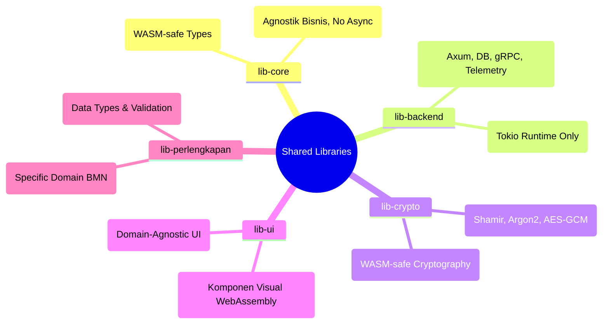

# 🤖 AGENTS.md - Pustaka Bersama (Shared Libraries)

> **Peringatan untuk AI Agents**: File ini adalah aturan dasar untuk beroperasi dalam direktori `lib/`. **Bacalah dengan saksama** sebelum mengubah kode apa pun yang berdampak global.

---

## 🌍 Konteks Direktori `lib/`

Direktori `lib/` adalah otak komunal untuk seluruh repositori SIMPEL. Kesalahan, kelalaian dependensi, atau penambahan kode yang salah ranah di sini akan berdampak langsung ke seluruh proyek Microfrontend (`antarmuka/`) maupun Microservices (`layanan/`).

> **Catatan**: `lib-common` telah dipecah menjadi `lib-core`, `lib-backend`, dan `lib-crypto`
> untuk memperjelas batas kompatibilitas WASM. Jangan tambahkan referensi baru ke `lib-common`.

## 🚨 Aturan Emas Pustaka (The Golden Rules)

1. **Anti Dependensi Sirkular**:
   ✅ BENAR: `lib-backend` / `lib-crypto` bergantung pada `lib-core`. `lib-perlengkapan` bergantung pada `lib-core`.
   ⛔ SALAH: `lib-core` bergantung pada crate lain di `lib/`. `lib-ui` bergantung pada `lib-backend`.

2. **Kesesuaian Tumpukan Fitur (Feature Flags)**:
   Pustaka di `lib/` harus aman di-*compile* untuk dua target berbeda:
   - Target `wasm32-unknown-unknown` (Frontend Leptos) → `lib-core`, `lib-crypto`, `lib-ui`, `lib-perlengkapan`
   - Target Backend Server (Tokio/Axum) → `lib-backend`

   🔴 **AI AGENTS HARUS MEMPERHATIKAN**: Jangan impor `tokio`, `axum`, atau `deadpool-postgres`
   di `lib-core`, `lib-crypto`, `lib-ui`, atau `lib-perlengkapan`. Infrastruktur backend
   HANYA boleh tinggal di `lib-backend` (dan di-gate dengan feature flag per-module).

3. **Modul Domain Spesifik**:
   Jangan menambahkan tipe data tentang "Pengadaan", "BMN", atau "Kode Barang" ke `lib-core`.
   Itu *strictly* bagian dari `lib-perlengkapan`.

## 📍 Struktur Pustaka

| Pustaka | Target Utama | Panduan Khusus AI |
|---------|-------------|-------------------|
| `lib-core/` | WASM + Backend | Tipe WASM-safe (validators, config structs, auth claims, audit types). **DILARANG** dependensi async (`tokio`, `axum`). |
| `lib-backend/` | Backend Only | Infrastruktur Axum, deadpool-postgres, Redis, gRPC, telemetry. Gunakan feature flags (`axum`, `db`, `jwt`, `grpc`). |
| `lib-crypto/` | WASM + Backend | Shamir, Argon2, bcrypt, AES-GCM (feature-gated). Semua WASM-compatible. |
| `lib-perlengkapan/` | Perlengkapan Domain | Murni menyimpan `Model` dan Logika BMN. Jangan tambahkan HTTP Handlers di sini! |
| `lib-ui/` | Leptos WASM | Hanya khusus komponen visual. Bebas dari logika *fetching* HTTP spesifik (gunakan callbacks). |

Masing-masing pustaka memiliki file `AGENTS.md` yang lebih detail di dalam direktorinya. Cek file tersebut saat masuk ke folder bersangkutan!
