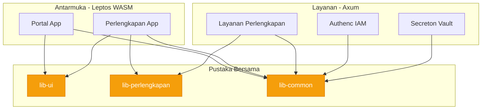

# 📚 SIMPEL Shared Libraries (`lib/`)

Direktori ini berisi pustaka (*libraries*) Rust yang digunakan bersama (*shared*) di seluruh *workspace* SIMPEL. Pengkodean diletakkan di sini untuk mempromosikan kapabilitas penggunaan ulang (*reusability*) kode, mencegah duplikasi, dan mempertegas batasan domain.

---

## 🏗️ Topologi Pustaka

---

## 📦 Pustaka Tersedia

Daftar pustaka (*crates*) aktual yang tersedia:

1. **`lib-common`**
   - **Tujuan**: Utilitas lintas domain (*cross-cutting concerns*).
   - **Isi**: Konfigurasi basis data, *middleware* otorisasi/JWT, kriptografi dasar, telemetri, dan penanganan *error*.
   - **Pengguna**: Backend services (mayoritas) dan Frontend (fitur tertentu).

2. **`lib-perlengkapan`**
   - **Tujuan**: Spesifik pada domain bisnis Barang Milik Negara (BMN) / Perlengkapan.
   - **Isi**: *Data models*, logika *gap analysis*, prioritisasi, validasi kode barang, dan tipe *search*.
   - **Pengguna**: Antarmuka Perlengkapan dan Layanan API Perlengkapan.

3. **`lib-ui`**
   - **Tujuan**: Pustaka komponen bawaan untuk antarmuka (*Shared UI Components*).
   - **Isi**: Elemen *buttons*, *inputs*, *tables*, *modals*, *hooks*, dan *utils* khusus Leptos (WASM).
   - **Pengguna**: Semua proyek di bawah direktori `antarmuka/` (seperti Portal dan Perlengkapan).

---

## 🛡️ Aturan Pengembangan Pustaka

1. Pustaka di sini **dilarang bergantung secara sirkular** antara satu sama lain yang tidak proporsional (aturan absolut: `lib-common` tidak boleh bergantung pada domain spesifik seperti `lib-perlengkapan`).
2. Hindari dependensi makro berat jika memungkinkan untuk mempercepat kompilasi antarmuka (WASM).
3. Pisahkan antara *backend features* (membutuhkan `tokio`) dan *frontend features* (membutuhkan `wasm-bindgen`).
