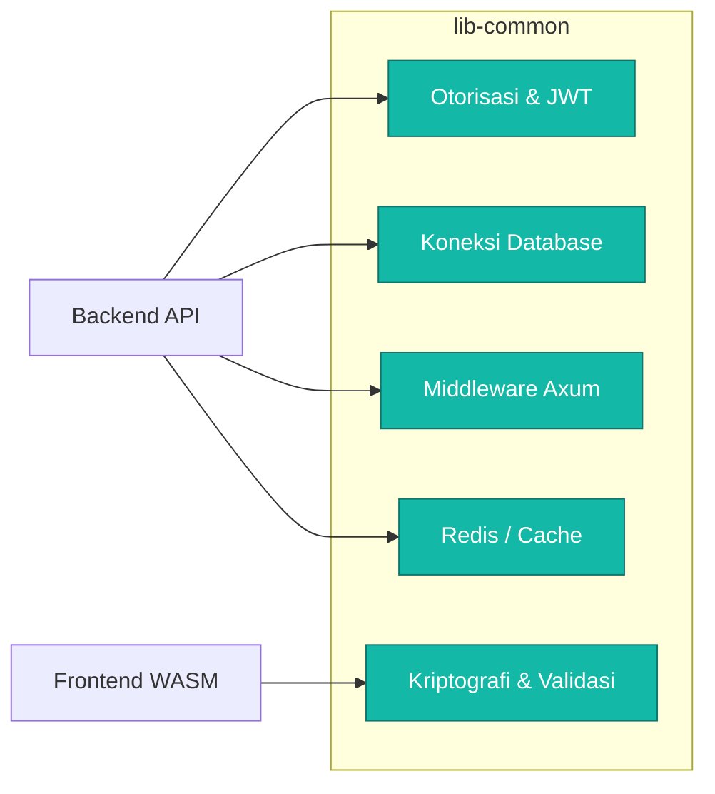

# 🧰 `lib-common` (Utilitas Bersama)

Pustaka utilitas fundamental yang menangani seluruh *cross-cutting concerns* pada arsitektur perangkat lunak Sistem Informasi Perlengkapan (SIMPEL). `lib-common` dapat dideklarasikan dengan fungsionalitas murni atau diiringi oleh dependensi opsional berbasis *features* di `Cargo.toml`.

---

## 🏗️ Struktur dan Fitur

---

## 🔑 Fitur-Fitur (Cargo Features)

`lib-common` mendukung modulasi dependensi untuk memperkecil ukuran binari akhir (terutama pada WebAssembly).

- **Tanpa Fitur / Bawaan**: Kode *pure rust* seperti manipulasi *string*, *error types*, atau regex dasar. Fitur ini aman dipanggil oleh aplikasi antarmuka (WASM).
- **`backend`**: Menarik seluruh pustaka yang membutuhkan `tokio` (Axum middleware, `tokio-postgres`, gRPC). ***Hanya untuk aplikasi backend!***
- **Sub-fitur Backend**:
  - `redis-cache`: Komponen integrasi `redis`.
  - `db`: Manajemen *pool* menggunakan `deadpool-postgres`.
  - `jwt`: Penggalian dan validasi klaim token (`jsonwebtoken`).
  - `crypto` / `encryption`: Fungsionalitas rahasia (*argon2*, *aes-gcm*, kurva eliptis).

---

## 📁 Struktur Modul (Faktual)

- `audit.rs` & `telemetry.rs`: Mencatat riwayat akses sistem dan pemantauan metrik OpenTelemetry.
- `auth.rs`, `jwt.rs`, `jwt_claims.rs`: Kinerja integrasi *Identity and Access Management* (IAM).
- `cache.rs`, `cache_middleware.rs`, `memory.rs`: Sistem penyimpanan semu berkecepatan tinggi.
- `db.rs`: Konfigurasi basis data tangguh dan persisten.
- `middleware/`: Berisikan fungsi lapisan *interceptors* pada server Axum (Validasi HTTP, manipulasi header).
- `crypto/`: Komponen pembantu untuk algoritma kriptografi.

> **Kontribusi**: Pastikan Anda meletakkan kode sesuai domain modul. Hindari meletakkan logika sentris bisnis Perlengkapan di tempat ini.
