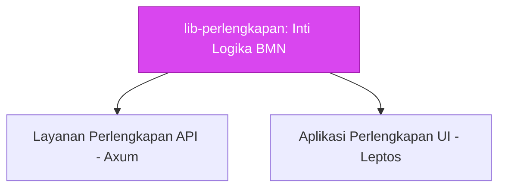

# 🤖 AGENTS.md - Panduan Domain Perlengkapan

> **Domain Konteks**: Spesifik Kejaksaan RI -> Manajemen Barang Milik Negara (BMN) / Perlengkapan.

---

## 🏗️ Ruang Lingkup AI

Pustaka `lib-perlengkapan` adalah repositori *Domain-Driven Design (DDD)* murni.
Semua tipe data, logika komputasi gap analysis, prioritisasi pengadaan, dan validasi standar kode BMN diletakkan di sini.



**ATURAN WAJIB (MANDATORY RULES):**
1. ⛔ **JANGAN** membuat model database *ORM-specific* (seperti `sea-query` entities atau `sqlx` structs) yang bocor ke dalam ekosistem WASM. Pisahkan menggunakan *feature flag* `backend`.
2. ✅ **SELALU** gunakan penamaan bidang (*fields*) sesuai standar leksikal Kejaksaan (Misalnya `kode_satker`, bukan `office_code`; `kode_barang`, bukan `item_id`).
3. ✅ Semua *Structs* harus di-*derive* dengan `serde::Serialize` dan `serde::Deserialize` (*by default*).
4. ✅ Terapkan validasi *Type-Safe*! Gunakan `validator` atau modul `validation/` yang ada untuk memastikan data mentah sesuai dengan parameter `Sistem Informasi Perlengkapan` sebelum diproses ke *layer* terluar.

## 🧮 Logika Kompleks Bisnis yang Bisa Anda Modifikasi

- **`gap_analysis.rs`**: Menghitung delta antara Barang Tersedia (Riil) dengan Barang Ideal (Ketentuan Standar Lembaga).
- **`prioritization.rs`**: Menilai urgensi pengadaan barang berdasarkan faktor keamanan, umur, dan depresiasi aset BMN.
- **`kode_barang.rs`**: Menganalisis dan memvalidasi `Identitas BMN` baku sesuai regulasi Kemenkeu/DJKN dan Kejaksaan. Pahami format NUP (Nomor Urut Pendaftaran) dengan ketat!

Jika Anda mengubah rumus komputasi di atas, selalu buat **Tests** yang sesuai di dalam `tests/` atau file unit tes yang disertakan dengan modul asalnya.

---

## ✅ Validation Patterns

### Type-Safe Validation
Gunakan `validator` crate untuk validasi yang type-safe dan komposabel:

```rust
use validator::Validate;

#[derive(Debug, Validate, Serialize, Deserialize)]
pub struct PerlengkapanRequest {
    #[validate(length(min = 1, max = 50))]
    pub kode_barang: String,

    #[validate(length(min = 1, max = 255))]
    pub nama: String,

    #[validate(custom = "validate_kode_satker")]
    pub kode_satker: String,

    #[validate(range(min = 0, max = 1000000000))]
    pub nilai: i64,
}

fn validate_kode_satker(kode: &str) -> Result<(), validator::ValidationError> {
    if !kode.starts_with("KEJ-") {
        return Err(validator::ValidationError::new("invalid_satker_format"));
    }
    Ok(())
}
```

### Domain-Specific Validation Rules
Validasi harus mengikuti standar regulasi Kejaksaan dan Kemenkeu:

- **Kode Barang**: Format 10 digit sesuai standar DJKN (X.XX.XX.XX.XXX)
- **NUP (Nomor Urut Pendaftaran)**: 6 digit numerik (contoh: 000001)
- **Kode Satker**: 6 digit numerik (contoh: 400000)
- **Nilai Aset**: Non-negative, dalam Rupiah

### Custom Validation Functions
Untuk validasi kompleks yang spesifik domain:

```rust
pub fn validate_nup(nup: &str) -> Result<(), ValidationError> {
    if nup.is_empty() || nup.len() > 6 {
        return Err(ValidationError::new("nup_length_must_be_between_1_and_6"));
    }
    if !nup.chars().all(|c| c.is_ascii_digit()) {
        return Err(ValidationError::new("nup_must_be_numeric"));
    }
    Ok(())
}

pub fn validate_kode_barang(kode: &str) -> Result<(), ValidationError> {
    let parts: Vec<&str> = kode.split('.').collect();
    if parts.len() != 5 {
        return Err(ValidationError::new("invalid_barang_format"));
    }
    // Additional validation per DJKN standard
    Ok(())
}
```

### Validation Error Handling
Kembalikan error yang informatif dengan field-level details:

```rust
use thiserror::Error;

#[derive(Error, Debug)]
pub enum ValidationError {
    #[error("Kode barang invalid: {0}")]
    InvalidKodeBarang(String),

    #[error("NUP invalid: {0}")]
    InvalidNup(String),

    #[error("Kode satker tidak dikenal: {0}")]
    UnknownSatker(String),

    #[error("Nilai aset tidak valid: {0}")]
    InvalidNilai(String),
}
```

### Integration with Backend Validation
Di backend, gunakan feature flag `backend` untuk ORM-specific validation:

```rust
#[cfg(feature = "backend")]
pub async fn validate_unique_kode_barang(
    db: &Database,
    kode: &str,
) -> Result<(), ValidationError> {
    let exists = db.check_kode_barang_exists(kode).await?;
    if exists {
        return Err(ValidationError::new("kode_barang_must_be_unique"));
    }
    Ok(())
}
```

### WASM Compatibility
Pastikan semua validasi berjalan di WASM tanpa I/O sistem:

```rust
// ✅ Validasi murni - OK untuk WASM
pub fn validate_format(kode: &str) -> Result<(), ValidationError> { ... }

// ❌ Validasi dengan database - HARUS di feature flag "backend"
#[cfg(feature = "backend")]
pub async fn validate_unique(db: &Database, kode: &str) -> Result<(), ValidationError> { ... }
```
