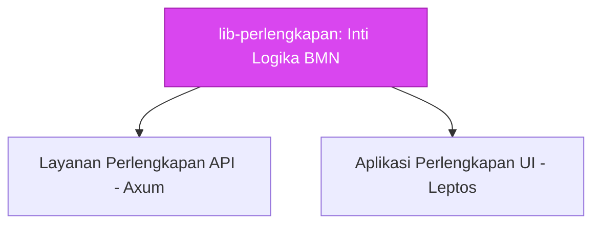

# 🤖 AGENTS.md - Panduan Domain Perlengkapan

> **Domain Konteks**: Spesifik Kejaksaan RI -> Manajemen Barang Milik Negara (BMN) / Perlengkapan.

---

## 🏗️ Ruang Lingkup AI

Pustaka `lib-perlengkapan` adalah repositori *Domain-Driven Design (DDD)* murni.
Semua tipe data, logika komputasi gap analysis, prioritisasi pengadaan, dan validasi standar kode BMN diletakkan di sini.

**ATURAN WAJIB (MANDATORY RULES):**
1. ⛔ **JANGAN** membuat model database *ORM-specific* (seperti `sea-query` entities atau `sqlx` structs) yang bocor ke dalam ekosistem WASM. Pisahkan menggunakan *feature flag* `backend`.
2. ✅ **SELALU** gunakan penamaan bidang (*fields*) sesuai standar leksikal Kejaksaan (Misalnya `kode_satker`, bukan `office_code`; `kode_barang`, bukan `item_id`).
3. ✅ Semua *Structs* harus di-*derive* dengan `serde::Serialize` dan `serde::Deserialize` (*by default*).
4. ✅ Terapkan validasi *Type-Safe*! Gunakan `validator` atau modul `validation/` yang ada untuk memastikan data mentah sesuai dengan parameter `Sistem Informasi Perlengkapan` sebelum diproses ke *layer* terluar.

## 🧮 Logika Kompleks Bisnis yang Bisa Anda Modifikasi

- **`gap_analysis.rs`**: Menghitung delta antara Barang Tersedia (Riil) dengan Barang Ideal (Ketentuan Standar Lembaga).
- **`prioritization.rs`**: Menilai urgensi pengadaan barang berdasarkan faktor keamanan, umur, dan depresiasi aset BMN.
- **`kode_barang.rs`**: Menganalisis dan memvalidasi `Identitas BMN` baku sesuai regulasi Kemenkeu/DJKN dan Kejaksaan. Pahami format NUP (Nomor Urut Pendaftaran) dengan ketat!

Jika Anda mengubah rumus komputasi di atas, selalu buat **Tests** yang sesuai di dalam `tests/` atau file unit tes yang disertakan dengan modul asalnya.
