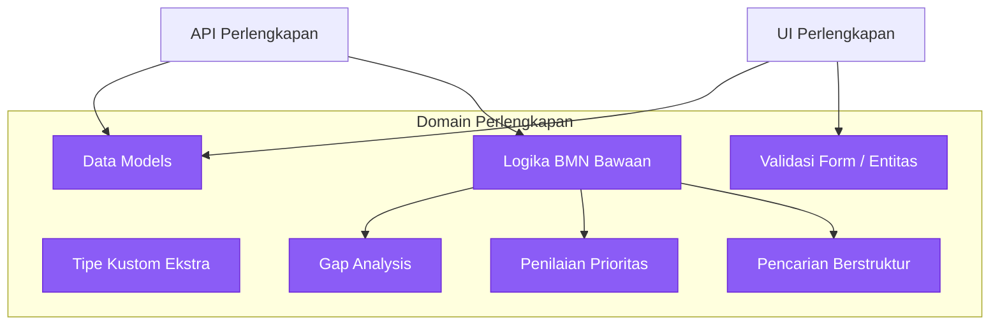

# 📦 `lib-perlengkapan` (Domain Perlengkapan)

Pustaka ini merepresentasikan model domain dan kumpulan aturan logika bisnis spesifik untuk subsistem Barang Milik Negara (BMN) / Perlengkapan di ekosistem SIMPEL.

Pustaka domain disusun secara terpisah sehingga memodelisasi **Domain-Driven Design (DDD)**. Dengan membagikan pustaka ini, baik antarmuka klien maupun server memiliki kesepahaman struktur data (*single source of truth*) yang sama.

---

## 🏗️ Relasi Modul Domain

---

## 🔮 Fungsi Modul Saat Ini

Berbeda dengan `lib-common`, modul di sini difokuskan secara kuat pada terminologi dan realitas entitas Kejaksaan spesifik Perlengkapan:

- `models/`: Mengampung pendefinisian `struct` untuk tabel data (contoh: Barang, Riwayat, Dokumen) dan implementasi *trait* serde (Serializer/Deserializer).
- `validation/` & `types/`: Menyediakan lapisan *typesafe* pencegahan inkonsistensi data seperti batas angka kuantitas barang, penyesuaian kode unik BMN, dll.
- `gap_analysis.rs`: Logika komputasi jarak ketersediaan aktual berbanding rasio ideal berdasarkan standardisasi BMN Kejaksaan.
- `prioritization.rs`: Logika pemberian nilai urgensi pengadaan barang secara matematis berdasar skor pemeliharaan atau kriteria kondisi lapuk.
- `kode_barang.rs`: Standar kode identifikasi barang bawaan negara.

---

## 🔌 Tumpukan Fitur Dependensi (Features)

Sama seperti perpustakaan *shared* lainnya, pustaka perlengkapan memiliki flag `Cargo.toml`.
- **`backend`**: Digunakan *backend service* yang menuntut integrasi konversi ke dalam bentuk ORM atau `tokio-postgres` parsers.
- **`wasm` / `frontend`**: Mengikutsertakan trait penyesuaian fungsional di WebAssembly dan Javascript binding (`wasm-bindgen`).
