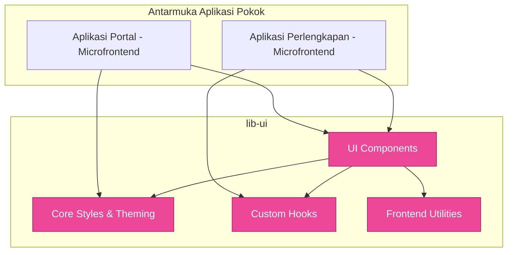

# 🎨 `lib-ui` (Pustaka Komponen Akses Visual)

`lib-ui` merupakan repositori Komponen Web Assembly (WASM) yang dibentuk dengan basis framework **Leptos**. Digunakan eksklusif oleh aplikasi Web atau Microfrontends klien SIMPEL untuk menjamin konsistensi antarmuka UI/UX (Design System).

---

## 🏗️ Arsitektur Rekayasa Antarmuka



---

## 📦 Isi Folder (Struktur Modular)

Pustaka dipenggal menjadi beberapa bagian penting:

### 1. `components/`
Berisikan serpihan bangunan ( *Building Blocks* ) yang independen dan dapat didaur ulang:
- **Atom**: Tombol (`Buttons`), Input teks (`Inputs`), Indikator Proses (`Spinners/Loaders`), dan Ikon.
- **Molekul**: Form *Fields*, Peringatan (*Alerts* / *Toast*), dan Kartu (*Cards*).
- **Organisme**: Tabel dinamis berskala besar, Pemutar halaman (*Pagination*), *Modals*, *Sidebar*, dan Menu *Navbars*.

### 2. `hooks/` (*Reactive Primitives*)
Modul pembantu *Reaktivitas* khusus leptos (*Reactive Signals*):
- Pengamat klik di luar elemen (`use_click_outside()`).
- Penurun laju eksekusi sinyal interaktif (`use_debounce()`).
- Deteksi parameter ukuran layar (*responsive observer*).

### 3. `utils/`
Utilitas yang spesifik untuk klien browser (*Browser / WASM*):
- Pemformatan angka standar Rupiah, pemformatan tanggal ramah lokalisasi.
- Komunikator penyetoran (*Fetch/HTTP Wrappers*) yang berintegrasi langsung ke standar token `Auth` SIMPEL.
- Validasi ringkas khusus visualisasi klien berbasis Regex.

### 4. `core/`
Inti manajemen warna dan tipografi global pendamping pengatur *Design System* bawaan SIMPEL (Misalnya pengolahan tailwind class statik).

---

## 🧭 Panduan Ekstensibilitas Komponen

Jika Anda merencanakan komponen visual baru:
1. Yakinkan komponen tersebut **Agnostik Domain**. Jangan membuat komponen misalnya `TabelValidasiBarang`, tapi buatlah tabel parameter asertif bernama `DataTable`.
2. Setiap fitur yang memiliki reaktivitas dom browser ekstensif jangan dibuat tertutup (*encapsulated hard*), sediakan argumen *Callback* bagi peladen state (`#[prop(into)]`).
3. Selalu periksa ukuran biner tambahan melalui standar performa trunk / leptos. Hindari menyuntikkan dependensi WASM yang tak logis secara memori.

---

## 🛠️ Idioms untuk Kontributor

Stack saat ini diintegrasikan dari ekosistem **awesome-leptos**. Bagian ini
menjelaskan satu-satunya cara yang benar untuk menulis kode baru — dan
mental-model yang setara dari Laravel & Next.js untuk kontributor yang
datang dari ekosistem PHP/JS.

### Reactivity primitives

| Pakai ini | Bukan ini | Setara JS/PHP |
|---|---|---|
| `signal(...)` / `RwSignal::new(...)` | `create_signal` (legacy) | React `useState`, Vue `ref` |
| `Memo::new(\|\| ...)` | manual recompute | React `useMemo`, Vue `computed` |
| `Effect::new(\|\| ...)` | manual `Effect::watch` | React `useEffect`, Vue `watchEffect` |
| `provide_context` / `use_context` | global mut state | React `Context`, Zustand, Pinia |

Tidak perlu memanggil `.set()` manual untuk re-render — fine-grained
reactivity sudah otomatis.

### Data fetching (phase 6)

Pakai `leptos-fetch`'s `use_query` — `QueryClient` sudah dimount di App
root kedua microfrontend.

```rust
use leptos_fetch::use_query;

let data = use_query(...); // analog ke React Query / SWR
```

**Jangan** menulis `LocalResource::new(...)` baru — pattern itu hanya
ada di kode lama yang belum dimigrasi.

### Hooks generik (phase 2)

Re-export dari `lib_ui::prelude` lewat `leptos-use`:

| Hook | Setara JS |
|---|---|
| `use_debounce_fn` | `lodash.debounce` |
| `use_throttle_fn` | `lodash.throttle` |
| `use_local_storage` / `use_session_storage` | React `useLocalStorage` |
| `use_media_query` | React `useMediaQuery` |
| `on_click_outside` | `react-onclickoutside` |
| `use_event_listener` | manual `addEventListener` |
| `use_window_focus` | `document.visibilityState` |

Setiap kali tergoda menulis sendiri, **gunakan ini dulu** — tulis hook
custom hanya kalau benar-benar tidak ada padanan di leptos-use.

### Penyimpanan non-reactive

Pakai helper di `lib_ui::utils::storage`:

- `load_from_storage::<T>(key)` → `Option<T>` (deserde JSON).
- `save_to_storage(key, value)` → persist JSON.
- `remove_from_storage(key)` / `clear_storage()`.

Untuk reactive storage gunakan `use_local_storage` di atas.

### Icons (phase 3)

`<i class="fas fa-...">` **dilarang** di kode baru — FontAwesome CDN
sudah dihapus dari `index.html`. Pakai typed phosphor constants:

```rust
use lib_ui::prelude::*;
use phosphor_leptos::USER_CIRCLE;

view! { <AppIcon icon=USER_CIRCLE size=20 /> }
```

Untuk migrasi titik panggil dinamis (legacy `icon: String` props),
pakai `lib_ui::components::icon::icon_from_fa_class(&fa_string)` yang
memetakan ~145 kelas FontAwesome ke konstanta phosphor.

### Toast / notifikasi (phase 7)

Sama API ringkas seperti `react-hot-toast`:

```rust
let toast = use_toast();
toast.success("Tersimpan!");
toast.error("Gagal menyimpan.");
```

Versi advanced dengan progress bar / durasi custom:

```rust
use lib_ui::hooks::use_toast::{ToastOptions, ToastVariant};

toast.show_with(
    ToastOptions::new(ToastVariant::Info, "Sinkronisasi…")
        .duration_ms(8000)
        .with_progress(),
);
```

Toast otomatis pause-on-hover dan pause-on-focus, dan setiap toast
membawa `role="alert"` (Error/Warning) atau `role="status"`
(Success/Info) untuk kepatuhan WCAG.

### Z-index layering (phase 4)

Gunakan token Tailwind, **jangan** tulis `z-[70]` / `z-[9999]`:

| Token | Nilai | Untuk |
|---|---|---|
| `z-dropdown` | 40 | Profile menu, navigation dropdown |
| `z-popover` | 60 | Popover panel, role switcher |
| `z-tooltip` | 70 | Hover tooltip |
| `z-modal` | 80 | Dialog, drawer |
| `z-toast` | 90 | Notification overlay |

### Routing (phase 8a)

URL strings hardcoded di `<A href="/perlengkapan/...">` mendrift dengan
mudah. Gunakan typed enums:

```rust
use lib_ui::prelude::*;

let url = PerlengkapanRoute::KebutuhanDetail { id: bmn_id }.to_path();
view! { <A href=url>"Lihat detail"</A> }
```

Setara dengan Laravel `route('users.show', $id)` atau Next.js
`Link href="/users/[id]"` — tapi compile-time-checked, jadi tidak ada
typo URL yang lolos sampai runtime.

### Layout / routing mental-model

| Leptos | Next.js | Laravel |
|---|---|---|
| `<ParentRoute view=…>` + child `<Route>`s | `app/layout.tsx` + `page.tsx` | `Route::middleware([...])->group(...)` |
| `<Suspense fallback=…>` | `loading.tsx` | Livewire skeleton |
| `<ErrorBoundary fallback=…>` | `error.tsx` | exception handler |
| `provide_context` di App root | `Context.Provider` | session helpers |
| `#[server]` (belum dipakai) | Server Actions / RSC | controller methods |

### Tracing / logging (phase 1)

```rust
tracing::info!("user logged in: {user_id}");
tracing::warn!(?error, "validation failed");
```

`tracing-subscriber-wasm` mengirim ini ke browser console terstruktur
(level + span). **Jangan** pakai `console_log!` atau `log::info!` —
keduanya sudah dihapus dari kedua app.

### Phase masih ditunda

Beberapa primitif sudah punya dep dipasang tapi implementasi ditunda
sampai 62 error build pre-existing teratasi (lihat
`.claude/plans/coba-kritisi-uraian-berikut-pure-rossum.md`):

- `<Tooltip>` / `<Popover>` / `<Dropdown>` — `floating-ui-leptos`
  sudah ready (`lib_ui::components::floating::floating_ui_leptos`).
- `<DataTable>` v2 — `leptos-struct-table` siap di
  `lib_ui::components::data_table_v2`.
- `<SimpelBarChart>` / `<SimpelPieChart>` — `leptos-chartistry` siap
  di `lib_ui::components::charts`.
- `<RouteSuspense>` — placeholder di `lib_ui::components::route_suspense`.
- `<AppShell>` — placeholder di `lib_ui::components::app_shell`.
- `leptos_animate` — di-skip karena butuh `--cfg=web_sys_unstable_apis`.
- Code splitting per-route — menunggu `leptos::lazy!` stabil di 0.9+.
