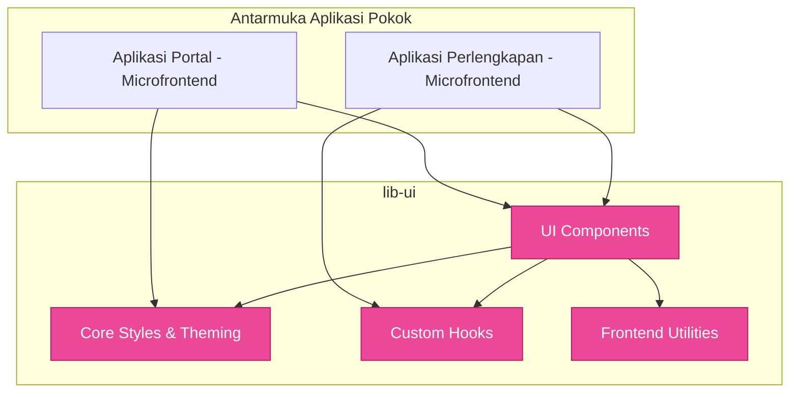

# 🎨 `lib-ui` (Pustaka Komponen Akses Visual)

`lib-ui` merupakan repositori Komponen Web Assembly (WASM) yang dibentuk dengan basis framework **Leptos**. Digunakan eksklusif oleh aplikasi Web atau Microfrontends klien SIMPEL untuk menjamin konsistensi antarmuka UI/UX (Design System).

---

## 🏗️ Arsitektur Rekayasa Antarmuka

---

## 📦 Isi Folder (Struktur Modular)

Pustaka dipenggal menjadi beberapa bagian penting:

### 1. `components/`
Berisikan serpihan bangunan ( *Building Blocks* ) yang independen dan dapat didaur ulang:
- **Atom**: Tombol (`Buttons`), Input teks (`Inputs`), Indikator Proses (`Spinners/Loaders`), dan Ikon.
- **Molekul**: Form *Fields*, Peringatan (*Alerts* / *Toast*), dan Kartu (*Cards*).
- **Organisme**: Tabel dinamis berskala besar, Pemutar halaman (*Pagination*), *Modals*, *Sidebar*, dan Menu *Navbars*.

### 2. `hooks/` (*Reactive Primitives*)
Modul pembantu *Reaktivitas* khusus leptos (*Reactive Signals*):
- Pengamat klik di luar elemen (`use_click_outside()`).
- Penurun laju eksekusi sinyal interaktif (`use_debounce()`).
- Deteksi parameter ukuran layar (*responsive observer*).

### 3. `utils/`
Utilitas yang spesifik untuk klien browser (*Browser / WASM*):
- Pemformatan angka standar Rupiah, pemformatan tanggal ramah lokalisasi.
- Komunikator penyetoran (*Fetch/HTTP Wrappers*) yang berintegrasi langsung ke standar token `Auth` SIMPEL.
- Validasi ringkas khusus visualisasi klien berbasis Regex.

### 4. `core/`
Inti manajemen warna dan tipografi global pendamping pengatur *Design System* bawaan SIMPEL (Misalnya pengolahan tailwind class statik).

---

## 🧭 Panduan Ekstensibilitas Komponen

Jika Anda merencanakan komponen visual baru:
1. Yakinkan komponen tersebut **Agnostik Domain**. Jangan membuat komponen misalnya `TabelValidasiBarang`, tapi buatlah tabel parameter asertif bernama `DataTable`.
2. Setiap fitur yang memiliki reaktivitas dom browser ekstensif jangan dibuat tertutup (*encapsulated hard*), sediakan argumen *Callback* bagi peladen state (`#[prop(into)]`).
3. Selalu periksa ukuran biner tambahan melalui standar performa trunk / leptos. Hindari menyuntikkan dependensi WASM yang tak logis secara memori.
